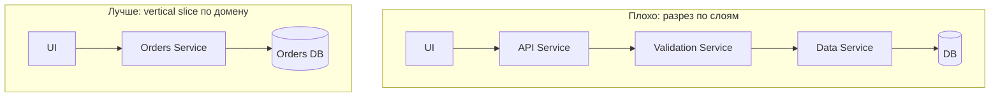
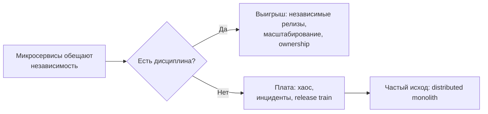
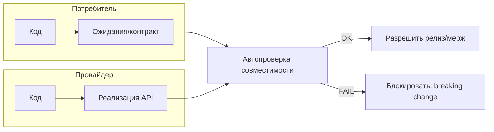
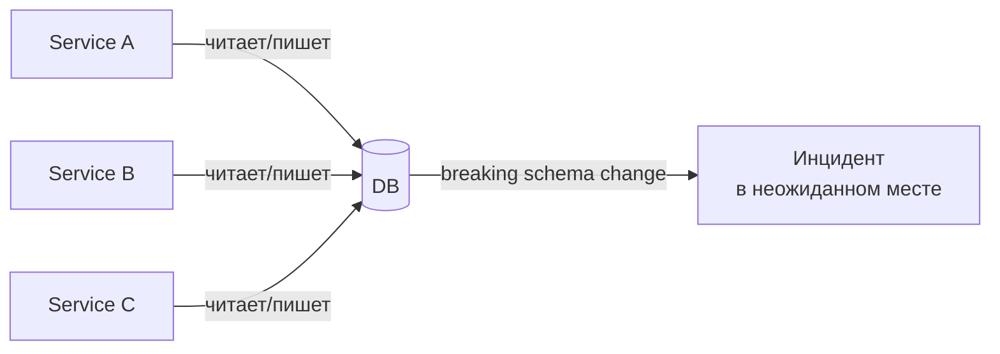

[← Назад к индексу части 33](index.md)

## 33.2 Типичные ошибки

### Цель раздела

Собрать самые частые практические ошибки, которые превращают разумные идеи в дорогую реальность, и показать “как правильно” в терминах границ, контрактов и эксплуатации.

### В этом разделе главное

- Ошибка выбора архитектуры часто не в “названии подхода”, а в **плохом разрезе** и **отсутствии контрактности**.
- Микросервисы/EDA/микрофронтенды требуют зрелости эксплуатации. Без неё сложность становится неконтролируемой.
- Совместимость (API/события) и документация решений — это не бюрократия, а защита от инцидентов.

---

<a id="3321-rezat-po-sloyam-vmesto-domena-резать-по-слоям-вместо-домена"></a>
### 33.2.1 Резать по слоям вместо домена

#### Цель подраздела

Понять, почему разрез “по слоям” (отдельный сервис БД/сервис API/сервис валидации) почти всегда ведёт к сильной связанности и nanoservices.

#### Теория и правила

Разрез “по слоям” выглядит так:

- “сервис авторизации” делает только проверки,
- “сервис данных” делает только CRUD,
- “сервис API” проксирует.

Проблема: бизнес‑сценарий (vertical slice) проходит через много слоёв, которые становятся зависимыми, и изменение “в одной фиче” требует изменения многих слоёв.

**Правильная идея:** разрезать по **домену/сценарию**, чтобы одна команда могла менять срез целиком.

#### Mermaid‑схема: плохой разрез vs хороший



#### Проверь себя

1. Почему разрез по слоям ухудшает автономность команд?  
2. В чём ключевое отличие vertical slice от “слоёв”?  
3. Когда разрез по слоям всё же может быть допустим (редкий случай)?

<details><summary>Ответ</summary>

1. Потому что бизнес‑изменение требует изменения нескольких слоёв, а значит координации и синхронных релизов.  
2. Vertical slice включает ответственность “от входа до данных” для сценария/домена.  
3. В очень ограниченных инфраструктурных компонентах (например, централизованный auth‑провайдер как отдельный продукт), но и там нужны чёткие контракты и границы; для доменной логики — редко.

</details>

---

<a id="3322-mikroservisy-bez-gotovnosti-k-ekspluatacii-микросервисы-без-готовности-к-эксплуатации"></a>
### 33.2.2 Микросервисы без готовности к эксплуатации

#### Цель подраздела

Понять, почему микросервисы без observability/CI‑CD/контрактности становятся “архитектурой для инцидентов”.

#### Теория и правила

Минимальная готовность к микросервисам включает:

- деплой и откат (часть 20),
- наблюдаемость (часть 31),
- контрактность и совместимость (части 9, 30),
- устойчивость на границах (timeouts/retry/breaker, часть 31),
- правила владения данными (часть 9).

Если хотя бы половины нет — вы получите:

- “ничего не понятно, где падает”,
- “релизы страшные”,
- “всё связано и ломается”.

#### Мини‑чек‑лист готовности к микросервисам (перед тем как “разрезать”)

Это быстрый список “есть/нет”. Если вы отвечаете “нет” на половину пунктов — почти наверняка выгоднее начать с модульного монолита или гибрида.

**A. Релизы и откаты (часть 20)**

- можно ли выкатывать изменения **частично** (canary/blue‑green) и быстро откатывать?
- есть ли health checks (liveness/readiness) и понятный rollback?

**B. Наблюдаемость (часть 31)**

- есть ли единый `trace_id`/корреляция логов?
- можно ли по трейсу увидеть “где в цепочке” появилась ошибка/латентность?
- есть ли SLI/SLO хотя бы на ключевых пользовательских потоках?

**C. Контракты и совместимость**

- есть ли формализованные контракты (API/события) и правила deprecate → remove?
- есть ли автоматическая проверка совместимости (CDC/verification)?

**D. Данные и ownership**

- известно ли, кто владеет какими данными (таблицы/события/проекции)?
- запрещены ли “чужие записи” в чужие данные?

**E. Resilience на границах**

- таймауты на внешние вызовы заданы явно?
- retry/breaker/лимиты не создают шторма и каскадного падения?

#### Картинка в голове: микросервисы как “обмен свободы на дисциплину”



#### Проверь себя

1. Назови три “операционных” элемента, без которых микросервисы почти всегда страдают.  
2. Почему observability — это часть архитектуры, а не “потом прикрутим”?  
3. Какой более простой шаг часто даёт 80% выгоды при маленькой команде?

<details><summary>Ответ</summary>

1. Наблюдаемость (логи/метрики/трейсы), CI/CD и управление релизами (canary/rollback), контрактность (версии/CDC).  
2. Потому что без неё вы не можете безопасно менять систему: вы теряете способность измерять последствия и локализовать проблему.  
3. Модульный монолит с явными границами и контрактами на уровне модулей.

</details>

---

<a id="3323-otsutstvie-kontraktov-отсутствие-контрактов"></a>
### 33.2.3 Отсутствие контрактов

#### Цель подраздела

Увидеть, что “контракт — это способ не ломать друг друга”, и что Swagger без процесса совместимости не решает проблему.

#### Теория и правила

Отсутствие контрактов проявляется как:

- фронт и бекенд ломают друг друга после релиза,
- сервисы ломают друг друга после релиза,
- изменения “удалили поле” превращаются в инциденты.

Минимальная практика:

- формализовать контракт (OpenAPI/GraphQL schema/protobuf/event schema),
- ввести правила совместимости (deprecate → remove),
- автоматизировать проверки (CDC/verification).

#### Пошагово: как сделать контрактность “живой”, а не декоративной

Ниже — минимально достатимый процесс, который обычно даёт эффект очень быстро (и для фронт–бекенд, и для сервис‑сервис):

1. **Определи границу и владельца контракта.**  
   - кто провайдер (кто отдаёт API/событие),
   - кто потребители (кто реально зависит),
   - кто отвечает за совместимость.
2. **Зафиксируй контракт в машиночитаемой форме.**  
   - HTTP: OpenAPI, JSON Schema, GraphQL schema;  
   - события: schema + версия;  
   - gRPC: protobuf.
3. **Сформулируй правила эволюции.**  
   - что считается breaking change,  
   - как выглядит deprecation,  
   - какие сроки/этапы у удаления.
4. **Сделай “проверку совместимости” автоматической.**  
   - CDC (consumer‑driven): потребители фиксируют ожидания, провайдер подтверждает;  
   - или provider‑driven + “compat check” (diff схем).
5. **Сделай совместимость частью Definition of Done.**  
   - изменение контракта без проверки = нельзя мёржить,  
   - в PR должны быть: обновление схемы + тест/verification + заметка о совместимости.

#### Проверь себя по процессу контрактности

1. Почему “определить владельца контракта” (шаг 1) критично для реальной совместимости, а не просто организационная формальность?  
2. В чём отличие CDC от “мы обновили схему в репозитории” по эффекту на риск прод‑поломок?  
3. Представь, что вы внедрили схемы, но breaking‑изменения всё равно попадают в прод. Какой шаг процесса, скорее всего, отсутствует или формален?

<details><summary>Ответ</summary>

1. Потому что совместимость — это ответственность: кто принимает решение “breaking/не breaking”, кто ведёт deprecation, кто обеспечивает миграцию потребителей. Без владельца изменения становятся “общей проблемой” и ломаются внезапно.  
2. CDC заставляет провайдера автоматически доказывать, что ожидания потребителей выполняются. Просто схема в репозитории не блокирует breaking‑изменение и может устареть.  
3. Скорее всего отсутствует DoD‑гейт (шаг 5) или автоматическая проверка (шаг 4): изменения мёржатся без verification, или “проверка” не является обязательной для релиза.

</details>

#### Картинка в голове: контракты как “шлюз безопасности изменений”



#### Пример 1: “удалили поле” — как выглядит безопасная эволюция (OpenAPI/JSON)

**Небезопасно (breaking сразу):**

- Было:

```json
{ "id": "123", "email": "a@b.com", "name": "Ann" }
```

- Стало:

```json
{ "id": "123", "name": "Ann" }
```

Если хоть один потребитель использовал `email`, он упадёт.

**Безопасный путь (deprecate → remove):**

1) Добавляем новое поле / новый путь, не ломая старое:

```json
{ "id": "123", "primaryEmail": "a@b.com", "email": "a@b.com", "name": "Ann" }
```

2) Помечаем `email` как deprecated в контракте (в OpenAPI/JSON schema/GraphQL).  
3) Даем время потребителям мигрировать.  
4) Только затем удаляем `email` (и фиксируем это как версию/major, если политика такая).

#### Пример 2: контракт события и “обратная совместимость”

**Правило для событий (частая практика):**

- добавление новых полей — обычно **backward compatible** (если потребители умеют игнорировать неизвестное),
- переименование/смена смысла поля — почти всегда breaking,
- удаление поля — почти всегда breaking.

Мини‑пример “событие заказа”:

```json
{
  "eventType": "OrderCreated",
  "eventVersion": 1,
  "orderId": "o-1",
  "total": 1200,
  "currency": "RUB"
}
```

Если вы меняете смысл `total` (например, “до скидки” → “после скидки”), это breaking даже если поле не менялось технически: вы сломали **семантику**.

#### Типичные ошибки (про контракты)

- считать контрактом “пример JSON в Confluence” без автоматической проверки;
- держать схему, но не иметь политики эволюции (breaking происходит всё равно);
- “мы просто поменяли смысл” — самый опасный вид несовместимости;
- обновлять контракт после релиза (“догоняем документацию”) — это уже поздно.

#### Проверь себя

1. Почему “Swagger есть” не гарантирует совместимость?  
2. Что значит “deprecation” и зачем он нужен?  
3. Чем контрактные тесты отличаются от E2E в плане диагностики?

<details><summary>Ответ</summary>

1. Потому что документ может устареть и не блокирует breaking change. Нужны правила и автоматическая проверка.  
2. Deprecation — фаза “поле/эндпоинт устаревает”: предупреждаем потребителей и даём время мигрировать.  
3. Контрактные тесты локализуют проблему на границе потребитель↔провайдер; E2E дорогие и плохо показывают, кто виноват.

</details>

---

<a id="3324-obshchaya-bd-bez-vladeniya-dannymi-общая-бд-без-владения-данными"></a>
### 33.2.4 Общая БД без владения данными

#### Цель подраздела

Понять, почему “одна БД на всех” разрушает границы и делает эволюцию опасной.

#### Теория и правила

Главная проблема общей БД — не в самой БД, а в отсутствии **владения**:

- кто имеет право менять схему?
- кто отвечает за инварианты?
- кто гарантирует совместимость?

Если ответа нет — у вас скрытые зависимости.

#### Пошагово: как вводить владение данными, если “общая БД уже есть”

Это типовая реальность: “общая БД есть, и завтра её не уберёшь”. Тогда цель — сделать так, чтобы общая БД перестала быть **хаотичной**.

1. **Нарисуйте карту владения таблицами.**  
   Таблица → владелец (команда/сервис) → кто читает → кто пишет → через какой контракт.
2. **Запретите запись “не владельцу”.**  
   Даже если чтение пока остаётся общим, запись — самый опасный вид связи.
3. **Сделайте чтение через контракт владельца там, где это реально важно.**  
   Это шаг к разрезу (часть 32: Strangler).
4. **Договоритесь о правилах миграций схемы.**  
   - expand/contract,  
   - обратная совместимость,  
   - rollback‑мышление.
5. **Внедрите минимальную наблюдаемость миграций.**  
   Метрики наполнения новых полей, error rate, латентность критичных запросов.

#### Проверь себя по внедрению ownership данных

1. Почему “запретить запись не‑владельцу” обычно сильнее и безопаснее, чем “запретить чтение”?  
2. Что такое “карта владения таблицами” и какие 3 колонки в ней обязательны, чтобы она помогала на инцидентах?  
3. Какой типичный провал случится, если вы введёте ownership “на бумаге”, но не измените процесс миграций схемы?

<details><summary>Ответ</summary>

1. Запись меняет мир и инварианты. Чтение иногда можно временно терпеть как переходный шаг, а запись “в чужие данные” почти гарантированно создаёт скрытую связанность и точки невозврата.  
2. Минимум: таблица/сущность, владелец (команда/сервис), кто читает/кто пишет и через какой контракт (API/событие/SQL). Тогда при проблеме ясно “кто отвечает” и “где граница”.  
3. Схема будет меняться хаотично: breaking‑изменения попадут без expand/contract и без обратной совместимости, и вы получите падения потребителей/фоновых джобов и длинные откаты.

</details>

#### Картинка в голове: “общая БД без владения” = невидимая общая сцепка



#### Пример граничного случая: “мы не вызываем друг друга, значит независимы”

Даже если сервисы не вызывают друг друга по сети, общая БД связывает их:

- схемой (удалили колонку — падает потребитель),
- семантикой (поменяли смысл статуса — отчёты и UI “врут”),
- производительностью (один сервис сделал тяжёлый запрос — остальные деградируют).

#### Проверь себя

1. Почему общая БД увеличивает связность даже если сервисы не вызывают друг друга?  
2. В каких случаях общая БД может быть временно допустима?  
3. Какой шаг поможет “уменьшить вред”, если общую БД пока нельзя убрать?

<details><summary>Ответ</summary>

1. Потому что все зависят от схемы и данных; изменение в одной части может сломать другую.  
2. Как временный шаг миграции, если есть план развязки и строгие границы доступа (и ownership).  
3. Ввести владение таблицами/схемой, запрет прямого доступа для “не владельца”, доступ через API владельца, и expand/contract для миграций.

</details>

---

<a id="3325-ignorirovanie-idempotentnosti-игнорирование-идемпотентности"></a>
### 33.2.5 Игнорирование идемпотентности

#### Цель подраздела

Понять, почему retry без идемпотентности — это генератор двойных операций и финансовых/данных инцидентов.

#### Теория и правила

В распределённых системах ретраи неизбежны (сеть, таймауты, перегрузка). Поэтому:

- операции должны быть идемпотентны,
- должны быть идемпотентные ключи,
- должна быть наблюдаемость повторов,
- побочные эффекты должны быть контролируемы (outbox/saga/компенсации — по теме частей 12–14).

#### Пошагово: как сделать идемпотентность “практически”

Самый понятный шаблон для HTTP‑операций “создать/оплатить”:

1. Клиент генерирует `Idempotency-Key` (UUID) на попытку операции.  
2. Сервер хранит результат обработки ключа (успех/ошибка/тело ответа).  
3. Повтор с тем же ключом возвращает тот же результат (не повторяя побочный эффект).

Мини‑схема таблицы:

```sql
CREATE TABLE idempotency_keys (
  key TEXT PRIMARY KEY,
  created_at TIMESTAMP NOT NULL,
  request_hash TEXT NOT NULL,
  status TEXT NOT NULL,
  response_code INT NOT NULL,
  response_body_json TEXT NOT NULL
);
```

Критичный момент: **request_hash** (или эквивалент) нужен, чтобы один и тот же ключ не “подменял” разные запросы.

#### Проверь себя по идемпотентным ключам

1. Почему недостаточно просто принять `Idempotency-Key`, но не хранить результат? Что произойдёт при ретрае?  
2. Зачем нужен `request_hash` (или эквивалент) и какой класс атак/ошибок он предотвращает?  
3. Где хранить результат идемпотентности: в БД, в кэше, в отдельном сервисе? Какой главный trade‑off?

<details><summary>Ответ</summary>

1. Повторный запрос снова выполнит побочный эффект (например, повторное списание), потому что сервер “не помнит”, что ключ уже был обработан.  
2. Он предотвращает ситуацию, когда тот же ключ используется для другого запроса: либо по багу клиента, либо злоумышленником. Без сверки вы можете вернуть “чужой” результат или выполнить неверную операцию.  
3. БД: надёжнее и консистентнее, но дороже по латентности. Кэш: быстрее, но сложнее по TTL/персистентности и риску потери записи. Отдельный сервис: гибко, но добавляет зависимость и операционную цену.

</details>

#### ASCII‑картинка: как ретрай без идемпотентности даёт двойной эффект

```
Клиент ---POST /pay---> Сервис
         (timeout)
Клиент ---retry POST---> Сервис
                        (двойное списание)
```

#### Граничный случай: идемпотентность ≠ “сделать PUT”

Иногда говорят: “пусть будет PUT, он идемпотентный”. Но:

- идемпотентность — про **эффект**, а не про HTTP‑метод;
- можно сделать `POST /payments` идемпотентным ключом и это будет корректнее по модели.

#### Типичные ошибки (про идемпотентность)

- использовать ключ, но не хранить результат (повтор всё равно выполняет действие);
- принимать один ключ для разных запросов (нет request_hash/сверки);
- хранить ключи без TTL/очистки (бесконечный рост);
- считать идемпотентными операции с побочными эффектами “по умолчанию”.

#### Проверь себя

1. Приведи пример операции, где повтор опасен.  
2. Почему “мы сделаем retry, чтобы было надёжнее” без идемпотентности — неверно?  
3. Назови один способ реализовать идемпотентность на уровне API.

<details><summary>Ответ</summary>

1. Оплата/списание, отправка письма, создание заказа.  
2. Потому что вы увеличиваете вероятность двойного эффекта: два списания вместо одного.  
3. Идемпотентный ключ в заголовке (`Idempotency-Key`) + хранение результата/маркировка обработанного ключа.

</details>

---

<a id="3326-vybor-po-trendu-выбор-по-тренду"></a>
### 33.2.6 Выбор по тренду

#### Цель подраздела

Научиться ловить “архитектуру ради архитектуры” до того, как она станет долгом.

#### Теория и правила

Сигналы выбора по тренду:

- аргументы вида “все так делают”,
- отсутствие критериев успеха,
- отсутствие оценки стоимости владения,
- отсутствие плана эволюции (как будем мигрировать/откатывать).

**Противоядие:** чек‑лист критериев (33.3) и фиксация решения (мини‑ADR).

#### Проверь себя

1. Какой один вопрос быстрее всего вскрывает “трендовый” выбор?  
2. Почему “модно” иногда работает как прокси‑аргумент (и почему это опасно)?  
3. Какие два артефакта помогают “приземлить” обсуждение?

<details><summary>Ответ</summary>

1. “Какую конкретную боль/метрику это улучшит в нашем контексте?”  
2. Потому что кажется, что “современно = правильно”. Опасно, потому что контекст различается.  
3. Чек‑лист выбора и мини‑ADR с последствиями/стоимостью.

</details>

---

<a id="3327-lomaem-sovmestimost-ломаем-совместимость"></a>
### 33.2.7 Ломаем совместимость

#### Цель подраздела

Понять, что совместимость — это дисциплина, а не “мелочь”, и почему breaking‑изменения без процесса — почти гарантированный инцидент.

#### Теория и правила

Минимальная дисциплина:

- не удалять поле/эндпоинт без deprecation,
- делать новые поля optional (если возможно),
- версионировать контракты (API/schemas/events),
- иметь процесс миграции потребителей.

#### Пошагово: безопасная эволюция API (deprecate → migrate → remove)

Практичный “скелет” процесса:

1. **Добавь новое, не ломая старое.**  
   Обычно это: новое поле, новый эндпоинт, новый вариант события или новый тип в GraphQL.
2. **Пометь старое как deprecated и объясни “чем заменить”.**  
   Deprecation без “replacement” — это шум, а не помощь.
3. **Дай время и инструменты миграции.**  
   - лог/метрика использования старого поля/эндпоинта,  
   - список потребителей,  
   - датa “последнего дня”.
4. **Отключи постепенно (если можно) и убери.**  
   В зрелых системах это делают по окружениям и/или canary‑путём, чтобы поймать скрытых потребителей.

#### Проверь себя по эволюции API

1. Почему deprecation без мониторинга использования почти неизбежно превращается в “вечный deprecated”?  
2. Что опаснее: удалить поле сразу или тихо поменять его смысл? Приведи пример “тихого” провала.  
3. Какой минимальный набор артефактов ты бы добавил(а) к deprecation, чтобы миграция потребителей была управляемой?

<details><summary>Ответ</summary>

1. Потому что вы не знаете, кто использует старое и сколько. Без фактов нельзя уверенно удалять — и вы оставляете deprecated навсегда, накапливая долг и ветвление поведения.  
2. Тихая смена смысла часто опаснее: система может не упасть, но начнёт “врать”. Пример: поле `total` поменяли с “до скидки” на “после скидки”, отчёты и UI начинают показывать неверные суммы.  
3. (а) явный replacement (чем заменить), (б) срок/дата удаления, (в) метрика использования (кто/сколько), (г) правило совместимости и план отката/постепенного отключения.

</details>

#### Mermaid‑схема: жизненный цикл совместимости

```mermaid
flowchart LR
  A[Add: вводим новое\n(совместимо)] --> B[Deprecate: помечаем старое\n+ migration guide]
  B --> C[Migrate: потребители переходят\n(видим метриками)]
  C --> D[Remove: удаляем старое\n(major/новая версия)]
```

#### Пример 1: REST/OpenAPI — как выглядят безопасные изменения

**Обычно безопасно:**

- добавить новое optional‑поле;
- добавить новый endpoint (оставив старый);
- добавить новый enum‑вариант (если потребители умеют “unknown”);
- расширить ответ без изменения смысла старых полей.

**Обычно breaking:**

- удалить поле/endpoint;
- переименовать поле;
- изменить тип (`string` → `number`);
- изменить смысл поля, даже если тип не менялся.

Мини‑пример “переименование поля” (лучше делать как deprecate):

```json
{
  "userId": "u-1",
  "primaryEmail": "a@b.com",
  "email": "a@b.com" 
}
```

`email` остаётся на переходный период и помечается deprecated.

#### Пример 2: GraphQL — deprecation как встроенная дисциплина

GraphQL хорош тем, что deprecation — часть языка.

Пример:

```graphql
type User {
  primaryEmail: String!
  email: String @deprecated(reason: "Use primaryEmail")
}
```

Но важно: это работает только если вы:

- следите за использованием deprecated‑полей (через persisted queries/логирование/аналитику),
- реально удаляете устаревшее по плану (иначе “deprecated навсегда”).

#### Пример 3: события — “совместимость по схеме” и “совместимость по смыслу”

События особенно коварны: их много потребителей, и вы часто не знаете всех.

**Два правила:**

1) **Схема:** добавление полей обычно ок, удаление/смена типа — почти всегда breaking.  
2) **Смысл:** изменение семантики (пример: `total` “до скидки” → “после скидки”) — breaking даже без смены схемы.

##### Как версионировать событие (два практичных варианта)

**Вариант A (часто проще):** `eventVersion` в payload + поддержка v1/v2 у потребителей.

```json
{ "eventType": "OrderCreated", "eventVersion": 2, "orderId": "o-1", "totalAfterDiscount": 1000 }
```

**Вариант B:** отдельные типы событий: `OrderCreatedV2` (с осторожностью: плодит зоопарк).

#### Граничный случай: “breaking без ошибки”

Самый опасный класс поломок — когда ничего не падает, но система начинает “врать”:

- отчётность считает иначе,
- скидки применяются иначе,
- UI показывает некорректные статусы.

Это происходит при **семантических breaking‑изменениях**. Их ловят:

- shadowing/diff (часть 32),
- контрактные проверки, которые проверяют не только форму, но и инварианты,
- тесты на бизнес‑правила (golden tests).

#### Типичные ошибки (про совместимость)

- deprecation без сроков и без мониторинга использования;
- считать “добавили поле — значит безопасно”, хотя поменяли смысл старого;
- выпускать breaking‑изменения без миграции потребителей;
- игнорировать “скрытых” потребителей (аналитика, партнёры, мобильные версии);
- “мы версионируем URL, значит всё ок” — версия без процесса совместимости не спасает.

#### Проверь себя

1. Почему “удалим поле, никто не использует” — опасное утверждение?  
2. Какой “мягкий” способ эволюции обычно лучше удаления?  
3. Почему события тоже требуют обратной совместимости?

<details><summary>Ответ</summary>

1. Потому что “никто” без контрактной проверки — гипотеза; потребитель может быть скрыт (мобильный, партнёр, аналитика).  
2. Deprecation + параллельная поддержка, затем удаление по плану.  
3. Потому что события потребляют многие системы; изменение схемы ломает потребителей так же, как API.

</details>

---

<a id="3328-znaniya-v-golovah-знания-в-головах"></a>
### 33.2.8 Знания в головах

#### Цель подраздела

Понять, что отсутствие документации границ и решений превращает архитектуру в “устную традицию”, которая ломается при росте команды.

#### Теория и правила

Минимум, который окупается почти всегда:

- ADR для значимых решений (часть 32),
- C4‑Container диаграмма актуального состояния (as‑is),
- явное описание владельцев границ (ownership).

#### Проверь себя

1. Почему “документация устаревает” — это не оправдание, а сигнал отсутствия процесса?  
2. Что важнее на старте: идеальная документация или минимальный, но живой пакет?  
3. Почему “знания в головах” напрямую влияет на скорость изменений?

<details><summary>Ответ</summary>

1. Потому что актуальность требует триггеров обновления (docs as code, PR‑ревью).  
2. Минимальный живой пакет: пару диаграмм + ADR, но обновляемых вместе с кодом.  
3. Потому что каждый шаг требует синхронизации людей, а не изменений в системе.

</details>

---

<a id="3329-dublirovanie-logiki-radi-nezavisimosti-дублирование-логики-ради-независимости"></a>
### 33.2.9 Дублирование логики “ради независимости”

#### Цель подраздела

Разобраться, когда дублирование — разумный компромисс, а когда — дорогой долг, который разрушает согласованность.

#### Теория и правила

Дублирование может быть оправдано, если:

- домены действительно независимы,
- согласованность не критична,
- цена координации выше цены дублирования,
- есть явные границы и владельцы.

Дублирование опасно, если:

- это одна и та же бизнес‑правда (например, расчёт скидок) в двух местах,
- нет единого источника истины,
- нет тестов/контрактов, которые ловят расхождения.

#### Проверь себя

1. Приведи пример допустимого дублирования и недопустимого.  
2. Почему “shared‑пакет со всей доменной логикой” часто не решает проблему, а создаёт другую?  
3. Какой механизм помогает ловить расхождения, если дублирование всё же есть?

<details><summary>Ответ</summary>

1. Допустимо: локальные форматы представления/валидации UI. Недопустимо: правила расчёта платежей/баланса в двух сервисах.  
2. Он создаёт жёсткую связанность по версии и превращает независимые сервисы в совместно релизящийся монолит.  
3. Контрактные проверки/сверка (shadowing/diff), метрики mismatch, единый владелец правила (или явный процесс синхронизации).

</details>

---

### Проверь себя по разделу 33.2 (типичные ошибки)

1. Почему “разрез по слоям” почти всегда ухудшает автономность?  
2. Назови два признака “микросервисы без готовности к эксплуатации”.  
3. Чем “документация устарела” отличается от “документации нет как процесса”?

<details><summary>Ответ</summary>

1. Потому что бизнес‑изменение требует изменения нескольких слоёв и координации команд/релизов.  
2. Нет наблюдаемости, нет безопасного деплоя/rollback, нет контрактности/совместимости.  
3. “Устарела” — симптом; причина обычно в отсутствии триггеров обновления и ownership (docs as code).

</details>

---
