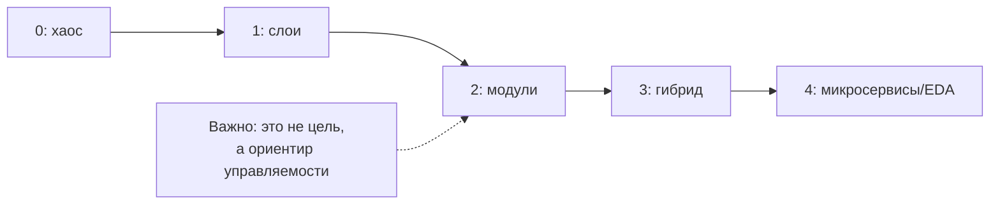

[← Назад к индексу части 33](index.md)

## 33.3 Критерии выбора

### Цель раздела

Дать тебе рабочий способ принимать архитектурные решения под контекст: какие критерии учитывать, какие вопросы задавать, как оценивать стоимость владения и зрелость, как фиксировать решение и план эволюции.

### В этом разделе главное

- Правильный выбор начинается с **контекста и целей**, а не с технологий.
- Критерии выбора почти всегда компромиссные: “что улучшаем” и “чем платим”.
- Для сложных архитектур (микросервисы, EDA, микрофронтенды) нужны предпосылки: **зрелость эксплуатации** и **контрактность**.

---

<a id="3331-kriterii-vybora-chto-realno-vazhno"></a>
### 33.3.1 Критерии выбора: что реально важно

#### Цель подраздела

Собрать ключевые критерии выбора в понятную систему и научиться применять их к сценариям.

#### Теория и правила

Ниже критерии из плана (и их практический смысл).

##### 1) Размер и структура команды

- **Одна команда**: чаще всего достаточно монолита или модульного монолита. Вы выигрываете простотой релиза и отладки.  
- **Несколько команд с разными доменами**: появляются причины для микросервисов/микрофронтендов, но только если есть готовность к контрактам и эксплуатации.  
- **Распределённая команда**: особенно важны явные контракты, независимые артефакты и документация границ.

##### 2) Домен

- **Сложный домен** с несколькими контекстами → полезны явные границы модулей/сервисов.  
- **Простой CRUD** → чаще не надо усложнять; стоимость сложной архитектуры не окупится.  
- **Нестабильные границы домена** → риск частого “переразреза” сервисов (дорого).

##### 3) Масштаб и латентность

- Нужно ли независимо масштабировать части? (поиск/каталог vs админка)  
- Требования к латентности и размещению (edge, real‑time) влияют на форму API и кеширование.

##### 4) Сроки и зрелость

- При жёстких сроках чаще выигрывает **минимально достаточная архитектура**, но с планом эволюции (часть 32).  
- Сложные архитектуры требуют дисциплины: CI/CD, observability, контрактность.

##### 5) Стоимость внедрения и владения (TCO)

Сравнение “по ощущению” часто ошибочно. Лучше мыслить как таблицей стоимости:

| Вариант | Что проще | Что сложнее/дороже |
| --- | --- | --- |
| **Монолит / модульный монолит** | один деплой, простая отладка, меньше инфраструктуры | масштабирование отдельных частей, независимость команд (если их много) |
| **Микросервисы** | независимый релиз и масштабирование по доменам (при правильных границах) | контракты, наблюдаемость, эксплуатация, данные, сеть, отладка |
| **Событийная архитектура (EDA)** | ослабление связности, много потребителей | идемпотентность, lag, мониторинг, консистентность, отладка |
| **BFF** | адаптация под клиентов, меньше запросов с клиента | новый слой, дополнительный hop, риск “толстого BFF” |
| **Микрофронтенды** | независимые команды и релизы UI‑частей | производительность, shared deps, версии, интеграция и тестирование композиции |

#### Простыми словами (формула выбора)

Выбор архитектуры — это всегда:

**контекст → цель → ограничения → варианты → последствия**.

Если вы пропускаете “последствия”, вы выбираете вслепую.

#### Практика: 3 разбора “как выбирать” (кейсы)

Ниже — три типовых контекста. В каждом мы сознательно идём по схеме:

**контекст → цели → ограничения → варианты → последствия → план эволюции**.

##### Кейс A. B2C‑продукт, 2 команды, web + mobile, частые релизы

**Контекст:** два клиента (web/mobile) требуют разной формы данных, нагрузка умеренная, релизы частые.  
**Цели:** ускорить разработку клиентских фич без ломания интеграций, снизить число сетевых походов “на экран”.  
**Ограничения:** команда небольшая, хочется не взорвать эксплуатацию.

**Варианты:**

1) Прямые вызовы микросервисов из клиентов  
2) Общий API Gateway без адаптации под клиент  
3) **BFF** (один или по клиентам) + контрактность  

**Выбор (часто разумный):** BFF + контрактные проверки.

**Почему:** BFF даёт место для агрегации и унификации ошибок/auth/observability, а контракты предотвращают “релиз сломал клиента”.

**Риски/цена:** новый слой, риск “толстого BFF”, нужна дисциплина (логика домена остаётся в сервисах).

**План эволюции:** если появятся 3+ команд и домены станут стабильнее — возможно, BFF разделится по клиентам/доменам; миграция по шагам (часть 32).

##### Кейс B. Enterprise, регуляторика, аудит, много интеграций и legacy

**Контекст:** много систем вокруг (legacy), высокий требования к аудиту, интеграции, иногда централизованные политики.  
**Цели:** предсказуемость и управляемость изменений, минимизация рисков безопасности/аудита.  
**Ограничения:** много зависимостей, много “чужих” потребителей, изменения дорогие.

**Варианты:**

1) Микросервисы “сразу”  
2) SOA/интеграционный слой (включая ESB‑подобные подходы)  
3) Модульный монолит + явные контракты + постепенное выделение сервисов

**Часто разумный путь:** начать с явных контрактов и владения данными (даже в монолите), затем выделять сервисы по доменам по мере зрелости. SOA‑подход может быть оправдан, если нужен централизованный контроль интеграций и аудит.

**Критичная деталь:** в таком контексте “breaking” особенно опасен, поэтому процесс совместимости (33.2.7) и документация решений (ADR) — обязательны.

##### Кейс C. Стартап, 3 разработчика, один домен, очень жёсткие сроки

**Контекст:** мало людей, всё меняется, нужно быстро.  
**Цели:** time‑to‑market и выживание продукта.  
**Ограничения:** нет ресурсов на сложную эксплуатацию.

**Часто правильный выбор:** монолит или модульный монолит с минимальными правилами границ (ownership модулей, запрет циклов, “контракты модулей”).

**План эволюции:** выделять сервисы только при появлении чётких доменных границ + организационной причины + готовности к эксплуатационной цене.

#### Проверь себя

1. Почему критерий “размер команды” часто важнее, чем “нагрузка”, на ранних этапах?  
2. Почему сложный домен толкает к границам, но не обязательно к микросервисам?  
3. Назови два элемента стоимости владения микросервисов, которые часто недооценивают.

<details><summary>Ответ</summary>

1. Потому что независимость изменений чаще упирается в координацию людей и релизы, а не в RPS.  
2. Границы можно сделать в модульном монолите: это дешевле по эксплуатации и часто достаточно.  
3. Наблюдаемость (трейсы/метрики) и контрактность/совместимость (включая тестирование и версионирование), плюс отладка распределённых цепочек.

</details>

---

<a id="3332-chek-list-vybora-arkhitektury-чек-лист-выбора-архитектуры"></a>
### 33.3.2 Чек‑лист выбора архитектуры

#### Цель подраздела

Дать список вопросов, который можно реально использовать на проекте, чтобы выбрать архитектуру без “религии”.

#### Чек‑лист (задайте эти вопросы перед выбором)

##### A. Контекст и цели

1. Какие 1–3 цели важнее всего? (скорость фич, надёжность, масштабирование, безопасность, time‑to‑market)  
2. Какие ограничения? (сроки, бюджет, навыки, регуляторика, legacy)  
3. Что будет “успехом” через 3–6 месяцев? (метрики, SLO, lead time)

##### B. Команда и процесс

4. Сколько команд и насколько независимы домены?  
5. Есть ли культура совместимости и документации (ADR/C4)?  
6. Есть ли готовность к эксплуатации: CI/CD, rollback, observability?

##### C. Данные и консистентность

7. Где источник истины для ключевых сущностей?  
8. Где нужна строгая консистентность, а где допустима eventual?  
9. Кто владелец данных (таблиц/событий/проекций)?

##### D. Контракты и интеграции

10. Как формализуем контракты (OpenAPI/GraphQL/protobuf/events)?  
11. Как обеспечиваем обратную совместимость? (deprecate → remove)  
12. Как проверяем совместимость автоматически? (CDC/verification)

##### E. Стоимость владения

13. Сколько новых “точек отказа” добавляем? (сервисы, брокер, BFF, микрофронтенды)  
14. Как диагностируем инциденты? (трейсы, корреляция)  
15. Что будет самым дорогим через год: разработка, эксплуатация, инциденты, координация?

#### Короткая «матрица выбора» (быстрый навигатор)

Это не “истина”, а быстрый способ не начинать обсуждение с технологий. В реальности вы почти всегда придёте к гибриду, но стартовая точка важна.

| Контекст | Обычно разумный старт | Почему |
| --- | --- | --- |
| **1 команда, 1 домен, жёсткие сроки** | Монолит или модульный монолит | минимальная операционная цена, быстрый цикл обратной связи |
| **2–3 команды, домены отделимы, нужна скорость параллельно** | Модульный монолит → гибрид (1–2 сервиса) | границы появляются без взрыва сложности |
| **много команд, разные домены, независимые релизы критичны** | Микросервисы (по доменам) | независимость стоит цены, если есть зрелость |
| **много потребителей одних данных, асинхронность допустима** | EDA/CQRS (точечно) | ослабление связности, масштабирование потребителей |
| **несколько типов клиентов (web/mobile) и разные формы данных** | BFF (один или по клиентам) | адаптация и контрактность на границе |
| **несколько команд владеют UI‑частями одной страницы** | Микрофронтенды (если есть орг‑причина) | независимые релизы UI‑фрагментов |

#### Пошагово: как превратить чек‑лист в решение (и не спорить бесконечно)

1. **Собери вводные в 10 строк.** Команда, домен, нагрузка, сроки, ограничения, риски.  
2. **Сформулируй 1–3 цели (измеримо).** Пример: “lead time 10 дней → 3”, “p95 < 300мс”, “минус 30% инцидентов на границе”.  
3. **Сравни 2–3 варианта по TCO.** Не абстрактно, а по пунктам: деплой, мониторинг, контракты, данные, отладка.  
4. **Прими решение и зафиксируй мини‑ADR.** Контекст → варианты → решение → последствия → план эволюции.  
5. **Проверь на антипаттерны.** Не ведёт ли выбранный путь к distributed monolith / Big Ball of Mud / nanoservices?

#### Проверь себя по “алгоритму выбора”

1. Почему шаг “сформулировать цели измеримо” должен идти до сравнения вариантов по TCO?  
2. Представь, что вы выбрали вариант с лучшим time‑to‑market, но он ухудшил MTTR и инциденты. Какой шаг алгоритма вы, скорее всего, сделали формально или пропустили?  
3. Как именно шаг “проверить на антипаттерны” может изменить решение (приведи пример: какой вариант отсеется и почему)?

<details><summary>Ответ</summary>

1. Потому что без цели вы не знаете, что оптимизируете: TCO и trade‑off’ы зависят от того, что для вас “успех”. Иначе сравнение превращается в спор о вкусах.  
2. Скорее всего недооценили “охранные метрики” и эксплуатационные последствия (нужно было явно учесть observability/rollback/resilience и цену владения).  
3. Например, вариант “разрезать на 20 сервисов по слоям” может дать иллюзию независимости, но приводит к nanoservices и distributed monolith (нет ownership данных, растут цепочки и release train). Тогда вы выбираете модульный монолит или разрез по домену.

</details>

#### Мини‑шаблон результата (чтобы решение было проверяемым)

После прохождения чек‑листа запишите:

- выбранный вариант,
- 2–3 альтернативы,
- последствия (плюсы/минусы),
- план эволюции (что будем делать, если вырастем),
- риски и охранные метрики.

#### Проверь себя

1. Почему вопросы про данные и владение данными стоят отдельным блоком?  
2. Какой вопрос чек‑листа лучше всего ловит “архитектуру по тренду”?  
3. Назови два “охранных” индикатора, которые стоит держать при усложнении архитектуры.

<details><summary>Ответ</summary>

1. Потому что данные — источник самых дорогих связей и точек невозврата; без владения данных независимость не получится.  
2. “Какая цель/метрика улучшится и какая цена владения?” — тренд обычно не даёт ответа.  
3. Ошибки (error rate) и p95/p99 латентности, плюс lead time/частота инцидентов (в зависимости от цели).

</details>

---

<a id="3333-arkhitekturnoe-revyu-i-fiksaciya-resheniya-архитектурное-ревью-и-фиксация-решения"></a>
### 33.3.3 Архитектурное ревью и фиксация решения

#### Цель подраздела

Понять, как проверять выбранную архитектуру (ревью) и как фиксировать решение так, чтобы оно было полезно через 6 месяцев.

#### Теория и правила

**Архитектурное ревью** — это не “комментарии к диаграммам”, а проверка:

- границ ответственности (кто за что отвечает),
- контрактов (что стабильно на стыке),
- владения данными,
- устойчивости на границах,
- наблюдаемости,
- стоимости владения.

**Фиксация решения** — минимально в форме ADR/мини‑ADR:

```markdown
Решение: <что выбрали>
Контекст: <почему возник вопрос>
Варианты: <2–3>
Последствия: <плюсы/минусы/риски/стоимость>
План эволюции: <как будем менять/мигрировать>
```

#### Пошагово: шаблон архитектурного ревью на 30 минут (чтобы это не стало бюрократией)

Этот формат полезен, когда нужен быстрый “quality gate” перед крупным изменением: новый сервис/BFF, новая схема данных, новый интеграционный контур, крупная миграция.

**Подготовка (асинхронно, 10–15 минут):**

- 1 страница контекста (проблема/цель/ограничения),
- 1 диаграмма C4‑Container (as‑is или delta),
- 1 диаграмма потока (sequence/flow) для ключевого сценария,
- черновик мини‑ADR (варианты + последствия).

**Встреча (30 минут):**

1) **0–5 мин: контекст и цель.** Что меняем и зачем? Какая метрика/боль?  
2) **5–12 мин: границы и владение.**  
   - кто владеет чем (данные/контракты),  
   - где границы доверия,  
   - какие новые точки отказа появляются.  
3) **12–20 мин: контракты и совместимость.**  
   - как версионируем,  
   - что является breaking,  
   - как проверяем совместимость автоматически.  
4) **20–26 мин: эксплуатация и риски.**  
   - observability (что логируем/какие SLI/SLO),  
   - rollback/kill switch,  
   - таймауты/retry/breaker (если есть внешние зависимости).  
5) **26–30 мин: решение и следующие шаги.**  
   - выбрали вариант,  
   - фиксируем мини‑ADR,  
   - список работ и “охранные” метрики.

#### Проверь себя по 30‑минутному ревью

1. Почему блок “границы и владение” стоит раньше “контракты и совместимость”?  
2. Представь, что ревью хорошо прошло, но через неделю случился инцидент из‑за деградации зависимости. Какой пункт встречи вы, скорее всего, сделали поверхностно?  
3. Какие два артефакта из “подготовки” дадут максимум пользы при онбординге нового инженера через 2 месяца — и почему?

<details><summary>Ответ</summary>

1. Потому что контракты зависят от того, где проходит граница ответственности и кто владеет данными/инвариантами. Без ясных границ обсуждение контрактов превращается в спор “кто должен”.  
2. Пункт “эксплуатация и риски”: не проговорили таймауты/retry/breaker, деградацию, охранные метрики и план отката/kill switch.  
3. Диаграмма (C4 Container или delta) и мини‑ADR: диаграмма даёт карту системы, ADR — причины решений и последствия. Вместе они быстро создают ментальную модель.

</details>

**Выходы ревью (обязательные артефакты):**

- мини‑ADR со статусом (Accepted/Proposed),
- список шагов (миграция/релиз/контракты),
- охранные метрики и критерии отката,
- обновлённая диаграмма (если менялись границы/потоки).

#### Mermaid‑схема: ревью как “воронка в решение”


#### Частая ловушка: “ревью обсуждает технологии, а не последствия”

Если обсуждение уходит в “какой фреймворк/какой брокер” без ответа:

- зачем,
- какая цена владения,
- как диагностируем и откатываем,

то ревью не выполняет функцию архитектурной защиты.

#### Практический мини‑ADR (пример)

```markdown
Решение: модульный монолит + BFF для web
Контекст: одна команда, быстрый time-to-market, разные формы данных для экрана
Варианты: (1) прямой вызов API из браузера, (2) BFF, (3) микросервисы сразу
Последствия:
  + один деплой бекенда, проще отладка
  + BFF уменьшит число запросов и централизует auth/ошибки
  - BFF добавит слой поддержки; риск "толстого BFF" — доменная логика остаётся в модулях
План эволюции:
  если появятся 2+ команды и домены стабилизируются → рассмотреть разрез модулей в сервисы (Strangler)
```

#### Проверь себя

1. Почему “план эволюции” должен быть частью решения, даже если вы выбрали простой вариант?  
2. Что значит “границы ответственности” на практике (не абстрактно)?  
3. Как отличить полезное ревью от бюрократии?

<details><summary>Ответ</summary>

1. Потому что контекст меняется. План эволюции делает решение устойчивым: вы знаете, как будете действовать при росте.  
2. Кто владеет данными и логикой, кто принимает изменения, где контракт, кто отвечает за инциденты в этой зоне.  
3. Если ревью заканчивается решениями/ADR/планом действий и охранными метриками — полезно; если только “обсудили” — бюрократия.

</details>

---

<a id="3334-modeli-zrelosti-orientir-ne-religiya-модели-зрелости"></a>
### 33.3.4 Модели зрелости (ориентир, не религия)

#### Цель подраздела

Дать ментальную модель зрелости, чтобы понимать: готовы ли вы к усложнению архитектуры, или сначала нужно выстроить базу.

#### Теория и правила

Это **не лестница “все должны дойти до микросервисов”**. Это ориентир: какие практики должны появиться, чтобы сложность была управляемой.

##### Уровень 0 — хаотичный монолит

- границы неясны, нет контрактов, релизы опасны, наблюдаемость слабая.

##### Уровень 1 — монолит со слоями и базовыми правилами

- слои и направление зависимостей, базовые тесты, базовый деплой.

##### Уровень 2 — модульный монолит (явные границы)

- ownership модулей, запрет циклов, публичные интерфейсы модулей, проще эволюция.

##### Уровень 3 — первые выделенные сервисы / гибрид

- один‑два сервиса вынесены по домену, контракты и наблюдаемость обязательны, миграция по шагам.

##### Уровень 4 — микросервисы/EDA как осознанная стратегия

- зрелая эксплуатация, контрактность, владение данными, процессы совместимости, наблюдаемость “по умолчанию”.

#### Mermaid‑схема: зрелость как “управляемость сложности”



#### Проверь себя

1. Почему модульный монолит часто “лучший следующий шаг” вместо микросервисов?  
2. Какие два признака показывают готовность к уровню 4?  
3. Почему “мы хотим микросервисы” без культуры observability — риск?

<details><summary>Ответ</summary>

1. Он даёт границы и автономность внутри одного деплоя: дешевле по эксплуатации и проще эволюционировать.  
2. Есть владение данными и контрактность, есть наблюдаемость и управляемый релиз (canary/rollback).  
3. Потому что распределённая система без наблюдаемости становится неотлаживаемой, а инциденты — “непонятно где”.

</details>

---
