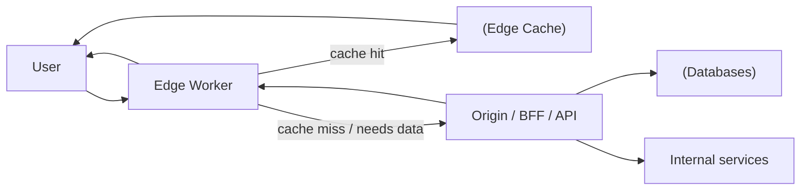
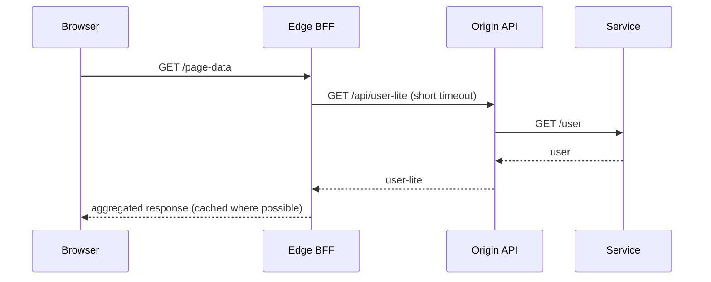

[← Назад к индексу части 34](index.md)

## 34.1 Edge и периферийные вычисления

### Цель раздела

Сформировать правильную ментальную модель edge: **что это**, **где проходит граница**, какие задачи решает хорошо, и какие ограничения являются «стеной», а не «неприятностью».

### В этом разделе главное

- Edge — это **не магия** и не «просто быстрее». Это **перенос части логики ближе к пользователю**, обычно с жёсткими лимитами.
- Edge особенно полезен там, где можно **принять решение на границе** (маршрутизация, A/B, кеширование, адаптация ответа) и **не ходить глубоко внутрь**.
- Самая частая ошибка: делать edge‑слой «как обычный бекенд», а потом страдать от ограничений и сложной отладки.

### Термины

| Термин | Определение |
| --- | --- |
| **CDN** | Сеть доставки контента: раздаёт статику и может кешировать ответы |
| **Edge runtime** | Среда выполнения на узлах провайдера (часто ближе к Web API, чем к “полноценному Node”) |
| **Origin** | Центральный бекенд/сервер, к которому edge обращается при необходимости |
| **Request rewriting** | Изменение запроса/маршрута/заголовков на границе |
| **Cache key** | Ключ, по которому выбирается кешированный ответ (важно для персонализации) |

---

### 34.1.1 Что такое edge и чем он НЕ является

#### Теория и правила

**Интуиция.** Представь, что пользователь в Бразилии, а твой сервер в Европе. Даже если твой код супер‑быстрый, физика сети добавляет задержку. Edge пытается сделать часть работы **на ближайшей к пользователю точке присутствия**.

**Формулировка.** Edge computing — это выполнение программируемой логики на инфраструктуре, расположенной ближе к пользователю (часто на узлах CDN), чтобы:

- уменьшить латентность для части операций,
- уменьшить нагрузку на origin,
- сделать маршрутизацию и кеширование более «умными».

**Чем edge НЕ является:**

- не означает, что «всё приложение теперь работает на edge»;
- не отменяет необходимость в origin и данных;
- не гарантирует скорость для сценариев, где всё равно нужен поход в origin и в БД.

#### Простыми словами

Edge — это «охранник и диспетчер у входа в здание». Он может:

- быстро решить, куда направить посетителя,
- проверить простые правила,
- дать ответ из «склада готовых ответов» (кеша),
- но он не может сходить в архив и переписать документы (сложная доменная логика и данные).

#### Картинка в голове

```
Пользователь → ближайший узел (Edge) → (иногда) Origin → БД/сервисы

Edge — быстрый, но "маленький";
Origin — дальше, но "большой" и ближе к данным.
```

#### Как запомнить

- Edge хорош для **решений на границе**.
- Всё, что требует «много внутренней кухни» — чаще остаётся в origin.

#### Примеры

**Пример 1: A/B тест на edge без похода в origin.**

- Edge читает cookie `ab_bucket`.
- Если нет — назначает bucket, ставит cookie.
- Переписывает путь `/` → `/landing-a` или `/landing-b`.

**Псевдокод (edge‑воркер):**

```js
export default {
  async fetch(request) {
    const url = new URL(request.url);
    const cookie = request.headers.get("Cookie") || "";
    let bucket = cookie.includes("ab_bucket=A") ? "A" :
                 cookie.includes("ab_bucket=B") ? "B" : null;

    if (!bucket) {
      bucket = Math.random() < 0.5 ? "A" : "B";
    }

    if (url.pathname === "/") {
      url.pathname = bucket === "A" ? "/landing-a" : "/landing-b";
    }

    const res = await fetch(url.toString(), request);
    const headers = new Headers(res.headers);
    if (!cookie.includes("ab_bucket=")) {
      headers.append("Set-Cookie", `ab_bucket=${bucket}; Path=/; HttpOnly; SameSite=Lax`);
    }
    return new Response(res.body, { status: res.status, headers });
  }
}
```

Ключевое: логика «маленькая», ответ — статический (SSG) и легко кешируется.

#### Проверь себя: что такое edge

1. Назови одну задачу, которая хорошо подходит для edge, и одну — которая плохо подходит, и объясни почему.  
2. Почему edge может ухудшить ситуацию, даже если “ближе к пользователю”?  
3. Что является “настоящей” ценностью edge: вычисления или кеш/маршрутизация?

<details><summary>Ответ</summary>

1. Хорошо: редиректы/маршрутизация, A/B, лёгкие правила, кеширование. Плохо: тяжёлая доменная логика с походами в БД и множеством внутренних зависимостей — упрёшься в лимиты и хвосты p95/p99.  
2. Из‑за лишнего hop’а до origin, лимитов runtime, нестабильности хвостов и сложной отладки/сетевых ограничений.  
3. Чаще всего — кеш и принятие решений “на границе” (маршрутизация/правила), а не тяжёлые вычисления.

</details>

---

### 34.1.2 Типовые сценарии edge

#### Теория и правила

Сценарии, где edge почти всегда имеет смысл:

- **редиректы и маршрутизация** (например, по региону или языку);
- **A/B и feature gating** на уровне маршрута/заголовков;
- **персонализация лёгкого уровня**, когда данные уже в cookie/токене и не нужно ходить в БД;
- **агрегация “лёгких” данных** из нескольких публичных API (но это уже риск по латентности);
- **защита и фильтрация** на границе (WAF‑подобные правила, rate limit) — здесь важна связь с частью 31.

#### Пошагово: как выбрать edge‑задачу

1. Сформулируй «что хотим улучшить»: latency, нагрузку, безопасность, гибкость маршрутизации.
2. Проверь: можно ли принять решение **без похода в origin** или хотя бы с минимальным походом.
3. Проверь: можно ли ответ **кешировать** (и как будет выглядеть cache key).
4. Проверь лимиты runtime и доступ к секретам/внутренним API.

#### Картинка в голове: edge как слой “до” бекенда



Здесь важно: edge может **отдать сразу** (cache hit) или **стать “умным прокси”**.

#### Практика / реальные сценарии

**Сценарий: “вход для пользователей из разных стран должен открывать разные страницы”.**

- На edge читаем `CF-IPCountry` (или аналогичный заголовок провайдера).
- Переписываем путь на `/ru`, `/en`.
- Отдаём статику из CDN.

**Граничный случай:** VPN/прокси. Значит, нельзя использовать это как “безопасное” определение страны — только как UX‑подсказку.

#### Проверь себя: сценарии edge

1. Почему “геолокация по IP” подходит для UX, но плохо подходит для безопасности?  
2. Какие 2 вопроса нужно задать, прежде чем переносить сценарий на edge?  
3. В чём риск “лёгкой агрегации” на edge при обращении к нескольким API?

<details><summary>Ответ</summary>

1. Потому что IP легко подменяется (VPN/прокси), и это не является надёжным фактором доверия.  
2. (а) можно ли принять решение без похода в origin? (б) можно ли безопасно кешировать и как будет выглядеть cache key/`Vary`?  
3. Риск по латентности и хвостам: суммирование задержек и рост вероятности частичных отказов, плюс усложнение наблюдаемости.

</details>

---

### 34.1.3 Ограничения и риски edge

#### Теория и правила

Edge‑среды почти всегда имеют ограничения:

- **лимиты CPU/памяти/времени** на один запрос;
- **ограничения runtime** (не полный Node.js, ограниченные API, запрет некоторых модулей);
- **ограничения сетевого доступа** (особенно к приватным внутренним системам);
- **сложность управления секретами** и доверия (где хранить ключи, как ротация);
- **отладка и воспроизводимость**: “в локале работает” ≠ “на edge работает”.

#### Простыми словами

Edge — это «маленькая кухня возле зала». На ней нельзя приготовить сложный банкет: не хватит места, оборудования, времени.

#### Что будет, если…

- **если делать тяжёлую доменную логику на edge**, вы упрётесь в лимиты и получите нестабильность по p95/p99;
- **если тянуть внутренние API на edge**, можно упереться в сетевые ограничения или сделать “дырку” в безопасности;
- **если бездумно кешировать персонализированное**, можно утечь данные между пользователями (ошибка в cache key).

#### Типичные ошибки

- кешировать ответ, зависящий от пользователя, по ключу «только URL»;
- хранить токены/ключи без продуманной модели ротации;
- переносить на edge то, что лучше решается обычным CDN‑кешем или gzip/brotli.

#### Проверь себя

1. Какой самый опасный класс ошибок на edge‑кеше для персонализированного контента?  
2. Почему “edge runtime” часто не равен “Node.js”?  
3. Почему доступ edge к внутренним API — это архитектурно чувствительное решение?

<details><summary>Ответ</summary>

1. Утечка данных: когда кеш отдаёт одному пользователю ответ другого из‑за неправильного cache key или отсутствия `Vary`/учёта заголовков.  
2. Потому что провайдеры часто дают Web‑подобный runtime (Fetch API, ограниченные модули) ради быстрого старта и безопасности.  
3. Это меняет границу доверия: edge становится частью “внутреннего периметра” и требует сильной модели аутентификации, авторизации и наблюдаемости (часть 31).

</details>

#### Запомните

Edge — это слой про **маршрутизацию/кеш/лёгкую логику**, а не про «перенести туда весь бекенд».

---

### 34.1.4 Edge‑BFF: когда уместно

#### Теория и правила

**Edge‑BFF** — это вариант BFF (часть 30), который размещён на edge и делает агрегацию/адаптацию ближе к клиенту.

Он уместен, когда:

- клиенты геораспределены и latency критична;
- агрегация лёгкая и не требует тяжёлых внутренних зависимостей;
- данные можно получить из публичных API или из origin с предсказуемой задержкой;
- есть зрелая безопасность и наблюдаемость на границе (часть 31).

**Он опасен**, когда:

- BFF становится “толстым” и начинает «решать домен»;
- BFF требует доступа к приватным системам без сильной модели доверия;
- контракты с внутренними сервисами нестабильны.

#### Картинка в голове: тонкий edge‑BFF



Ключевое: edge‑BFF **не должен превращаться** в новый “центральный монолит” на границе.

#### Проверь себя

1. Почему edge‑BFF должен быть “тоньше”, чем обычный BFF?  
2. Какие два риска появляются при доступе edge‑BFF к внутренним API?  
3. Что важнее для edge‑BFF: скорость “средняя” или p95/p99 и почему?

<details><summary>Ответ</summary>

1. Потому что edge ограничен по ресурсам и сложнее в отладке; “толстый” BFF быстро упрётся в лимиты и станет точкой боли.  
2. Риск безопасности (расширение поверхности атаки) и риск надёжности/отладки (сложные цепочки, зависимость от сети и лимитов).  
3. p95/p99: пользователь чувствует хвосты задержек; edge‑слой легко даёт нестабильность в хвостах, если перегружен или ходит в origin.

</details>

#### Запомните

Edge‑BFF — это **опциональный ускоритель**, а не “обязательная прослойка”.

---

### 34.1.5 Инструменты, окружения и “как не выстрелить себе в ногу”

#### Цель подраздела

Дать практическую опору: какие типы edge‑платформ бывают, почему у них разный runtime, как организовать локальную разработку, и где чаще всего происходят “производственные сюрпризы” (кеш, секреты, доступ к origin, персонализация).

#### Теория и правила

**Edge — это не одна технология**, а семейство платформ. На практике ты встретишь:

- **Edge Workers** (условно “Web‑runtime”): быстрый старт, Fetch API, ограничения по Node‑модулям.
- **Lambda@Edge / функции на CDN**: ближе к “серверной” модели, но всё равно со своими ограничениями и деплоем через CDN‑цепочку.
- **Edge middleware** в fullstack‑фреймворках: чаще про переписывание запросов/заголовков, а не про тяжёлую бизнес‑логику.

Чтобы не путаться, полезная “ось”:

1. **Где выполняется код?** (PoP ближе к пользователю или региональный дата‑центр)
2. **Какой runtime?** (Web‑API vs Node‑совместимый)
3. **Есть ли доступ к приватным сетям?** (часто нет или он ограничен)
4. **Что с секретами и ключами?** (как хранить, как ротировать)

#### Простыми словами

Edge‑платформы — это “разные типы маленьких кухонь”. Где-то есть только микроволновка (Web‑runtime), где-то есть плита, но помещение всё равно маленькое (функции на CDN).

#### Практика: типовые платформы (ориентиры)

Это не “единственный список”, но хорошие ориентиры, чтобы у тебя появилась карта:

- **Cloudflare Workers** (edge‑воркеры, Web‑runtime)
- **Vercel Edge** (edge‑runtime, часто вокруг fullstack‑фреймворков)
- **Deno Deploy** (edge‑подобное исполнение, Deno/Web API)
- **AWS Lambda@Edge** (функции у CDN, привязанные к CloudFront)

Важно: конкретные лимиты и API меняются, поэтому всегда проверяй документацию конкретного провайдера, но **класс ограничений** почти всегда одинаковый.

#### Критически важное про кеш: `Vary`, cache key и персонализация

Самый частый “фатальный” инцидент на edge связан не с падением воркера, а с **неправильным кешированием**.

**Правило:** если ответ зависит от заголовка/куки, это должно отражаться:

- либо в **cache key**,
- либо в HTTP‑заголовке **`Vary`**,
- либо кеш должен быть отключён для этого ответа.

**Пример:**

- если ты персонализируешь по `Accept-Language`, то без `Vary: Accept-Language` кеш может раздавать “чужой” язык.
- если персонализируешь по cookie пользователя — кеширование часто нужно отключать или строить отдельный слой “кеш на сегменты”.

#### Пошагово: безопасная схема кеширования на edge

1. Раздели контент на категории:
   - **полностью публичный** (можно агрессивно кешировать),
   - **сегментный** (язык/регион/AB‑bucket),
   - **персональный** (лучше не кешировать на edge, или кешировать строго по user‑key с сильной дисциплиной).
2. Явно зафиксируй правила: “что влияет на ответ” → “как это попадает в кеш‑ключ”.
3. Добавь проверки: unit‑/integration‑тесты, которые ловят отсутствие `Vary` и неправильные `Cache-Control`.
4. Сделай наблюдаемость кеша: hit ratio, ключевые варианты, аномалии.

#### Конкретика: какие HTTP‑заголовки чаще всего нужны (и почему)

Когда ты проектируешь edge‑кеш, тебе почти всегда приходится руками “собирать” поведение из заголовков.

Базовый набор, который стоит уметь читать и писать:

- **`Cache-Control`** — правила кеширования (браузер/прокси/CDN):
  - `public` / `private`
  - `max-age` (кеш в браузере),
  - `s-maxage` (кеш в shared proxy/CDN),
  - `no-store`, `no-cache`,
  - `stale-while-revalidate`, `stale-if-error` (если поддерживается).
- **`ETag`** и **`If-None-Match`** — валидация кеша без полного ответа.
- **`Vary`** — “от чего зависит ответ” (влияет на кеш‑ключ).

**Пример 1: публичная статика (каталог) с быстрым обновлением через SWR.**

```http
Cache-Control: public, max-age=60, s-maxage=600, stale-while-revalidate=300, stale-if-error=600
ETag: "v2026-03-17-abc123"
```

Идея:

- браузер держит минуту,
- CDN держит 10 минут,
- если истёк — можно отдать слегка устаревшее и “допроверить” в фоне (SWR),
- при ошибке origin — можно подержать старое (stale-if-error).

**Пример 2: сегментный контент (язык), где важно `Vary`.**

```http
Vary: Accept-Language
Cache-Control: public, s-maxage=300
```

**Пример 3: персональный ответ (почти всегда — не кешировать на shared‑кеше).**

```http
Cache-Control: private, no-store
```

#### Проверь себя: HTTP‑кеш на edge

1. В чём практическая разница между `max-age` и `s-maxage`?  
2. Почему `Vary` — это часть безопасности, а не только “производительности”?  
3. Когда `stale-if-error` может спасти продукт, а когда — навредить?

<details><summary>Ответ</summary>

1. `max-age` влияет на кеш браузера, `s-maxage` — на shared кеши (CDN/proxy). Это позволяет по-разному управлять кешем “у клиента” и “на границе”.  
2. Потому что без `Vary` кеш может склеить разные варианты ответа (язык/сегмент/заголовки) и отдать “чужой” контент не тому пользователю/сегменту.  
3. Спасает, когда кратковременный сбой origin не должен “положить” продукт (лучше старое, чем 500). Вредит, если вы тем самым скрываете критическую проблему и продолжаете раздавать сильно устаревшие данные там, где это ломает инварианты (например, цены/остатки без доп. правил).

</details>

#### Практический приём: “кеш на сегменты”, а не “кеш на пользователя”

Часто реальный компромисс такой:

- персональное не кешируем на edge,
- но делаем **сегментацию** (регион/язык/AB‑bucket) и кешируем сегментные ответы.

Это снижает риск утечек и при этом даёт выигрыш по latency.

#### Проверь себя: сегментный кеш

1. Почему “кеш на сегменты” обычно проще и безопаснее, чем “кеш на пользователей”?  
2. Приведи 2 примера “сегмента”, который обычно безопасен (и полезен).  
3. В каком случае сегментация всё равно может привести к утечке данных?

<details><summary>Ответ</summary>

1. Потому что сегменты (язык/регион/AB bucket) имеют ограниченное количество вариантов и не несут прямых персональных данных; меньше риск перепутать ключ и легче наблюдать/валидировать.  
2. Язык (`Accept-Language`), регион (в UX‑смысле), A/B bucket, тип клиента (mobile/web) — если это не связано с приватными данными.  
3. Если внутри сегмента всё равно присутствует персонализация (например, “привет, Иван”) или чувствительные данные — тогда кеш по сегменту будет отдавать чужое.

</details>

#### Секреты и доступ к origin: где чаще всего ошибаются

Если edge‑код обращается к origin/внутренним API, возникает вопрос: **как он аутентифицируется?**

Типовая безопасная модель (концептуально):

- edge получает **короткоживущий** токен/подпись (или подписывает запрос),
- origin проверяет подпись и ограничивает права,
- запросы имеют таймауты и лимиты (часть 31).

**Антипаттерны:**

- хранить “вечный” ключ в edge‑коде без ротации;
- давать edge доступ “как внутреннему сервису” без строгой авторизации;
- забыть про лимиты и retries → каскадные деградации.

#### Проверь себя

1. Почему ошибка в `Vary`/cache key может привести к утечке данных?  
2. Почему “локально работает” на edge‑коде часто не значит “в проде будет так же”?  
3. Назови два решения, которые уменьшают риск при доступе edge к origin.

<details><summary>Ответ</summary>

1. Потому что кеш начинает считать два разных ответа “одним и тем же” и отдаёт неверный (потенциально персональный) контент другому пользователю.  
2. Потому что runtime, лимиты, геораспределение, сеть до origin и правила кеша в проде другие; локальная среда часто ближе к Node и не воспроизводит поведение PoP.  
3. Короткоживущие/подписанные токены + строгая авторизация на origin; таймауты/лимиты и наблюдаемость запросов edge→origin.

</details>

#### Запомните

Edge выигрывает за счёт близости к пользователю, но “расплата” — **кеш и безопасность на границе становятся критичными**.

---
