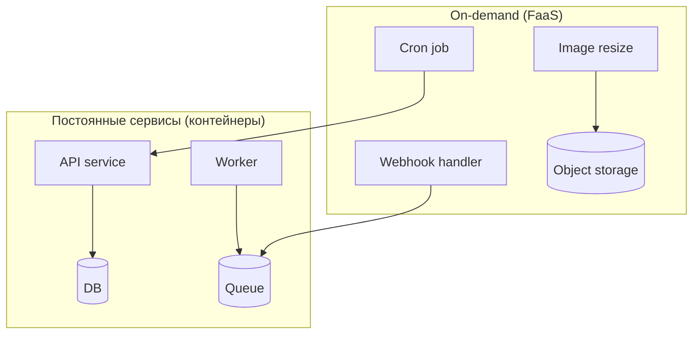

[← Назад к индексу части 34](index.md)

## 34.2 Serverless и FaaS

### Цель раздела

Понять serverless как архитектурную модель: триггеры и события, stateless‑выполнение, внешнее состояние, ограничения и способы сделать это надёжным (идемпотентность, дедупликация, наблюдаемость).

### В этом разделе главное

- Serverless хорошо работает для **событий** и **нерегулярной нагрузки** (всплески, редкие вызовы).
- Главные “скрытые грабли”: **cold start**, **лимиты**, **повторная доставка**, **сложность диагностики**.
- Serverless почти всегда требует архитектурной дисциплины: **идемпотентность**, **таймауты**, **корреляция**, **явное хранение состояния**.

### Термины

| Термин | Определение |
| --- | --- |
| **Trigger** | Событие, запускающее функцию (HTTP, очередь, cron, storage event) |
| **At-least-once delivery** | Доставка “как минимум один раз”: возможно повторение события |
| **Exactly-once** | Почти всегда недостижимо как “простая настройка”; обычно достигается комбинацией дедупликации/транзакций |
| **Dedupe** | Дедупликация: распознать повтор и не выполнить эффект второй раз |
| **Timeout budget** | Бюджет времени на цепочку вызовов (важно для хвостов) |

---

### 34.2.1 Модель serverless: что выполняется, где живут данные

#### Теория и правила

**Интуиция.** В “обычном” приложении есть процесс, который живёт долго: держит соединения, кэш в памяти, прогретые зависимости. В serverless процесс короткий: его могут поднять и убить в любой момент.

**Формулировка.** Serverless/FaaS — модель, где код выполняется в виде функций:

- запускается по триггеру,
- выполняется ограниченное время,
- может масштабироваться автоматически,
- при этом **не гарантирует** сохранение состояния между вызовами.

Следствие: состояние и консистентность “выползают наружу”:

- БД, очереди, кэши, object storage становятся частью архитектуры,
- а “в памяти функции” — ненадёжно как источник истины.

#### Картинка в голове: функция как “одноразовый рабочий”

```
Событие/HTTP → Функция → (читает/пишет во внешние системы) → Ответ/результат
             ↘ может быть повторно вызвана ↙
```

#### Пример: обработчик события из очереди

```python
import json
import os
import hashlib

def handler(event, context):
    # event = пакет сообщений (batch)
    for msg in event["records"]:
        payload = json.loads(msg["body"])

        # Идемпотентность через dedupe-key (упрощённо)
        dedupe_key = payload.get("event_id") or hashlib.sha256(msg["body"].encode()).hexdigest()
        if is_already_processed(dedupe_key):
            continue

        process_business_logic(payload)
        mark_processed(dedupe_key)
```

Это не «красота», а необходимость: повторная доставка — нормальна.

#### Практика / реальные сценарии

- обработка загрузок: “положили файл в storage → сработала функция → сделали превью/антивирус/метаданные”;
- отправка email/push: “событие заказа → функция отправки уведомления”;
- webhooks: “внешняя система шлёт события → функция валидирует → кладёт в очередь”.

#### Проверь себя: модель serverless

1. Почему “хранить состояние в памяти функции” — архитектурно ненадёжно?  
2. Чем отличается “HTTP‑функция” от “функции по событию” по ошибкам и ретраям?  
3. Назови один признак, что задачу лучше вынести в очередь + воркер, а не делать полностью внутри функции.

<details><summary>Ответ</summary>

1. Потому что среда выполнения может быть уничтожена/пересоздана, а масштабирование запускает несколько экземпляров; память не является устойчивым источником истины.  
2. В событиях часто есть at‑least‑once доставка и повторная обработка — это “нормальная ветка”. В HTTP пользователь ждёт ответ, но ретраи также возможны на стороне клиента/прокси. В обоих случаях нужна идемпотентность, но в событиях — почти всегда критичнее.  
3. Когда обработка долгая/ресурсоёмкая, есть внешние зависимые шаги, нужен контроль повторов и устойчивость к пикам — очередь сгладит нагрузку и сделает поток управляемым.

</details>

---

### 34.2.2 Холодный старт и лимиты: как думать

#### Теория и правила

**Cold start** появляется, когда провайдеру нужно:

- поднять среду выполнения,
- загрузить код и зависимости,
- выполнить инициализацию (например, подключиться к БД).

Это влияет не на “среднее”, а на хвосты p95/p99.

**Лимиты** обычно включают:

- время выполнения,
- память,
- количество соединений,
- размер пакета/ответа.

#### Пошагово: как проектировать под cold start

1. Раздели инициализацию на “обязательную” и “ленивую”.
2. Держи зависимости лёгкими (не тащи монструозные пакеты).
3. Закладывай таймауты и fallback, чтобы cold start не убивал цепочку вызовов.
4. Меряй p95/p99, а не только “среднее”.

#### Простыми словами

Serverless — это как такси “по вызову”. Иногда такси стоит рядом (warm), иногда надо ждать, пока оно приедет (cold). Если ваш UX не терпит ожидания — это важно.

#### Проверь себя

1. Почему cold start опаснее для интерактивных API, чем для фоновой обработки?  
2. Чем опасны тяжёлые зависимости (большой пакет) в serverless?  
3. Какой показатель лучше сигнализирует о проблеме cold start: средняя латентность или p95/p99?

<details><summary>Ответ</summary>

1. Для интерактивного API пользователь ждёт ответ прямо сейчас; в фоне +500ms может быть не критично.  
2. Увеличивают время загрузки/инициализации и расход памяти, что повышает вероятность таймаутов и стоимость.  
3. p95/p99: cold start редко влияет на “среднее”, но сильно портит хвосты.

</details>

#### Запомните

Serverless отлично «держит всплески», но **не отменяет физику**: холодные старты и лимиты — это часть контракта.

---

<a id="34221-set-i-dostup-k-privatnym-zavisimostyam-skrytaya-cena-serverless"></a>

### 34.2.2.1 Сеть и доступ к приватным зависимостям: “скрытая цена” serverless

#### Цель

Сделать явным то, что часто ломает serverless‑решения в production: сеть, приватные зависимости и стоимость трафика.

#### Теория и правила

В реальности функции почти всегда ходят:

- в БД,
- во внутренние сервисы,
- во внешние API,
- в storage/очереди.

И тут всплывают проблемы:

- **приватная сеть** (доступ к внутренней БД/сервисам) может требовать “входа” в VPC/частную сеть;
- “вход в VPC” часто означает **дополнительную задержку**, ограничения по масштабированию и усложнение диагностики;
- **egress‑трафик** (выходящий трафик) и межзональные вызовы могут стать заметной статьёй стоимости;
- DNS/NAT/маршрутизация в проде могут отличаться от локала (см. 34.2.6).

#### Простыми словами

Функция — это не “код в вакууме”. Она всегда привязана к сети. Если сеть сложная — serverless‑магия быстро заканчивается.

#### Пошагово: как проверить “сеть не убьёт идею”

1. Перечисли зависимости функции: БД, сервисы, внешние API.
2. Отметь, какие из них **приватные** (недоступны из интернета).
3. Для каждой зависимости задай вопросы:
   - какой таймаут?
   - что при ошибке/ретрае?
   - сколько соединений может открыть функция при пике?
4. Посчитай “грубую стоимость”: вызовы/сек × средний размер ответа × egress‑тарифы (на уровне порядка).

#### Проверь себя

1. Почему “доступ к приватной БД” в serverless часто усложняет архитектуру?  
2. Почему стоимость serverless может “взлететь” при большом количестве мелких вызовов?  
3. Что опаснее для стабильности: средняя задержка или “хвосты” p95/p99 при сетевых зависимостях?

<details><summary>Ответ</summary>

1. Потому что требует частной сетевой интеграции (VPC/приватные сети), что влияет на латентность, масштабирование и отладку.  
2. Потому что оплата идёт за количество вызовов, время выполнения, а иногда и за сетевой трафик; “много мелких” может оказаться дороже “мало крупных”.  
3. Хвосты p95/p99: они ломают UX и цепочки таймаутов, даже если “в среднем всё нормально”.

</details>

#### Запомните

Serverless “прекрасен на диаграмме”, пока вы не нарисовали **сеть и зависимости**. Рисуйте их сразу.

---

### 34.2.3 Идемпотентность и повторная доставка в serverless

#### Теория и правила

В serverless (особенно при очередях/событиях) повтор — норма:

- событие может прийти дважды,
- функция может упасть после записи в БД и быть запущена снова,
- сеть может потерять подтверждение.

Поэтому правило: **любой обработчик должен быть безопасен к повтору**.

Два базовых инструмента:

1. **Idempotency key** (ключ идемпотентности): запрос/событие несёт уникальный ключ, по которому мы понимаем “уже делали”.
2. **Dedupe store**: место, где фиксируем “выполнено” (таблица, Redis, KV), желательно атомарно.

#### Пошагово: как сделать обработчик идемпотентным

1. Выберите ключ: `event_id`, `request_id`, `order_id+action`.
2. В начале обработки сделайте атомарную попытку “зарезервировать” ключ.
3. Если ключ уже был — завершите без эффекта.
4. Только после резервирования делайте внешние эффекты (списание, письмо, запись).

#### Картинка в голове

```
Повтор = нормальная ветка.
Идемпотентность = архитектурный ремень безопасности.
```

#### Пример: таблица идемпотентности (SQL)

```sql
create table idempotency_keys (
  key text primary key,
  created_at timestamptz not null default now()
);

-- Псевдо-логика:
-- insert key; если конфликт — значит уже обработано.
```

#### Типичные ошибки

- “у нас очереди, значит события точно не повторяются”;
- “мы сделаем retry” без идемпотентности → двойные эффекты;
- хранить dedupe “в памяти функции”.

#### Что будет, если…

- если нет идемпотентности, то при сбое/повторе получите “двойную оплату”, “двойное письмо”, “двойную проводку”;
- если dedupe store медленный и без таймаутов — функция начнёт умирать по таймаутам и повторов станет ещё больше.

#### Проверь себя

1. Почему at-least-once доставка — чаще реальность, чем exactly-once?  
2. Где должен жить dedupe store и почему?  
3. Почему идемпотентность — это не «опциональная оптимизация», а часть корректности?

<details><summary>Ответ</summary>

1. Потому что сеть и сбои неизбежны, а “гарантированно один раз” требует сложной координации (транзакции, подтверждения, дедупликация) и часто слишком дорого.  
2. Во внешней устойчивой системе (БД/kv/redis) с атомарными операциями — потому что функция не гарантирует сохранность памяти.  
3. Потому что повтор — это нормальный сценарий, а без идемпотентности система будет некорректной при реальных сбоях.

</details>

#### Запомните

Serverless‑обработчик без идемпотентности — это архитектура, которая **работает только в идеальном мире**.

---

### 34.2.4 Наблюдаемость и отладка serverless

#### Теория и правила

Serverless увеличивает количество мелких компонентов и событий. Без наблюдаемости (часть 31) вы получите:

- непонятно, где именно “сломалось”,
- непонятно, почему “стало дорого”,
- непонятно, почему “иногда медленно”.

Минимум для production:

- единый `request_id/trace_id`,
- структурированные логи,
- метрики (ошибки, латентность, количество повторов),
- распределённые трейсы, если есть цепочки вызовов.

#### Простыми словами

Если система — это «много маленьких функций», то диагностика без наблюдаемости — как расследование с закрытыми глазами.

#### Пример: корреляция

- edge или клиент генерирует `trace_id`,
- прокидывает в заголовке,
- функция пишет логи с этим `trace_id`,
- downstream сервисы тоже.

#### Проверь себя

1. Почему “логов много” не равно “наблюдаемость есть”?  
2. Какие 2–3 метрики полезно держать для serverless‑функции?  
3. Почему корреляция важна при отладке “иногда не работает”?

<details><summary>Ответ</summary>

1. Логи без структуры и корреляции превращаются в шум; наблюдаемость требует связки лог↔метрика↔трейс и понятных сигналов.  
2. Error rate, p95/p99 latency, количество таймаутов/ретраев/повторов, холодные старты (если доступно).  
3. Потому что проблема часто в “цепочке” — нужен способ связать события одного запроса по всей системе.

</details>

#### Запомните

Serverless без наблюдаемости быстро превращается в «дорого чинить».

---

### 34.2.5 Гибрид: serverless + контейнеры

#### Теория и правила

Гибрид часто реалистичнее “чистого serverless”:

- **контейнеры/сервисы** держат долгие процессы, сложные зависимости, стабильное соединение с БД;
- **serverless** обрабатывает события, всплески, редкие задачи, webhooks, cron‑джобы.

Критерий разнесения: **что требует предсказуемости и долгой жизни процесса**, а что можно выполнить как “функцию”.

#### Картинка в голове: два режима жизни



#### Проверь себя

1. Почему “долгие процессы” обычно плохо чувствуют себя в FaaS?  
2. Какие две вещи чаще всего вынуждают оставить часть системы в контейнерах?  
3. Что общего у гибрида и части 33 (критерии выбора)?

<details><summary>Ответ</summary>

1. Лимиты времени/ресурсов и модель исполнения “могут убить в любой момент” — плохо для долгих stateful операций.  
2. Стабильные соединения/состояние (например, WebSocket), тяжёлые зависимости/runtime, необходимость предсказуемой латентности без cold start.  
3. Это про выбор под контекст и trade‑off’ы: гибрид — типичный компромисс “взять лучшее, но честно заплатить за сложность”.

</details>

#### Запомните

Гибрид — нормальный зрелый выбор: не “религия”, а прагматика.

---

### 34.2.6 Локальная разработка, эмуляция и “production-расхождения”

#### Цель подраздела

Показать, почему у serverless чаще, чем у “обычных сервисов”, возникают сюрпризы при выкладке, и как строить разработку/тестирование так, чтобы эти сюрпризы ловить раньше.

#### Теория и правила

У serverless есть проблема “паритета окружений” (environment parity):

- локально ты часто запускаешь код как обычный процесс,
- в проде — это управляемая среда с лимитами, холодными стартами, сетевыми ограничениями и особенностями событийной доставки.

Поэтому **эмуляция важна**, но у неё есть потолок: она не всегда воспроизводит:

- реальную сеть (latency, DNS, NAT),
- лимиты и throttling,
- поведение cold start и масштабирование,
- интеграции с управляемыми сервисами (очереди, storage).

#### Практика: инструменты и подходы (ориентиры)

Часто встречающиеся классы инструментов:

- **эмуляция и локальный рантайм** (например, AWS SAM, serverless‑offline, локальные эмуляторы провайдеров);
- **контейнеризация окружения** для повторяемости;
- **preview/staging** среды, максимально похожие на prod;
- **генерация тестовых событий** (fixtures) и “проигрывание” пакетов сообщений.

#### Пошагово: как снизить риск “работает локально, падает в проде”

1. Введи “контракт события” (event contract) так же, как контракт API:
   - схема входного события,
   - обязательные поля,
   - версии.
2. Делай тесты “на событие”:
   - набор фикстур (валидные/невалидные/граничные),
   - проверка идемпотентности.
3. Делай интеграционную проверку в среде, похожей на prod:
   - реальная очередь,
   - реальный storage,
   - реальные таймауты.
4. Включи наблюдаемость (часть 31): трейс/метрики/логи в staging должны быть такими же, как в prod.

#### “Карта” типовых production‑расхождений

| Что ломается | Почему это происходит | Как ловить раньше |
| --- | --- | --- |
| таймауты | другие лимиты/latency до зависимостей | тесты с реальными таймаутами, p95/p99 |
| дубли и повторы | at‑least‑once доставка + ретраи | тесты идемпотентности + dedupe store |
| “слишком много коннектов к БД” | масштабирование функций параллельно | пул/лимиты коннектов, прокси, разделение нагрузки |
| разные payload в событиях | провайдер/интеграция меняет форму | версионирование схемы события |

#### Проверь себя

1. Почему эмулятор не гарантирует, что прод будет вести себя так же?  
2. Какие 2–3 “граничных события” ты бы добавил в фикстуры для обработчика очереди?  
3. Почему тесты идемпотентности — обязательны именно для serverless?

<details><summary>Ответ</summary>

1. Потому что он часто не воспроизводит сеть, лимиты, cold start, throttling и поведение управляемых сервисов; он полезен, но не “полный двойник” продакшена.  
2. Повтор одного и того же сообщения; сообщение без обязательного поля; пакет сообщений с частичной ошибкой; очень большой payload; сообщение с устаревшей версией схемы.  
3. Потому что повторы и ретраи — нормальный сценарий доставки; без идемпотентности корректность ломается “в реальности”.

</details>

#### Запомните

Serverless требует инженерной дисциплины: **контракт события + идемпотентность + прод‑похожее тестирование**.

---
