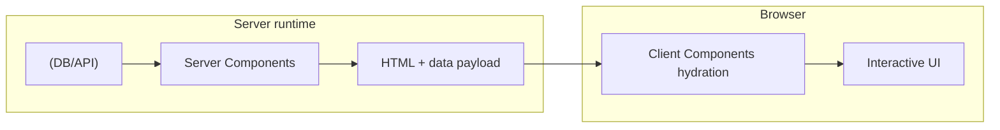
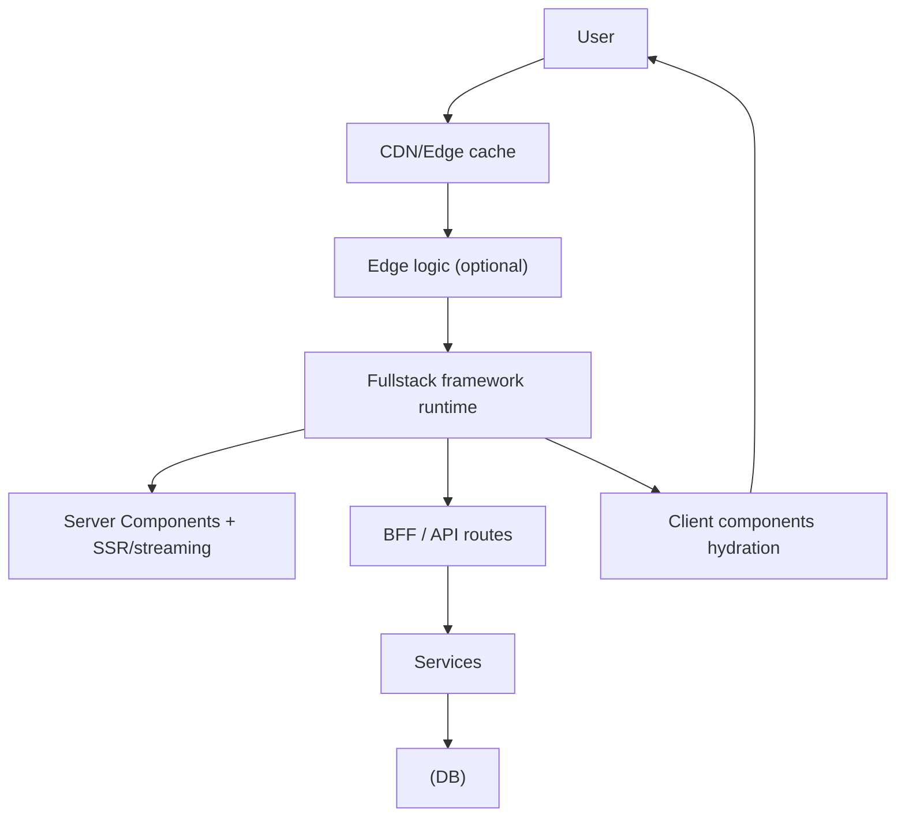
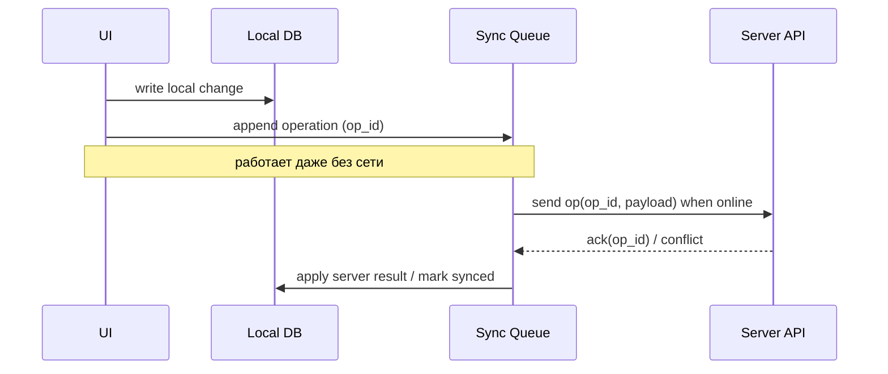
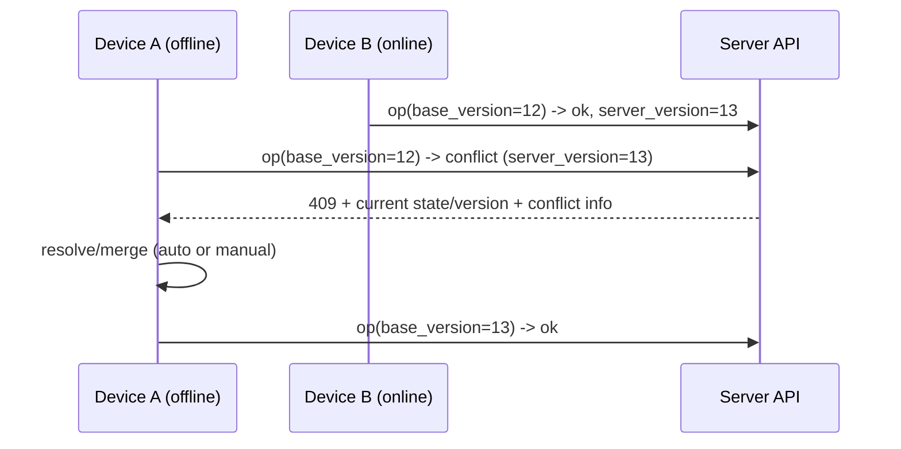
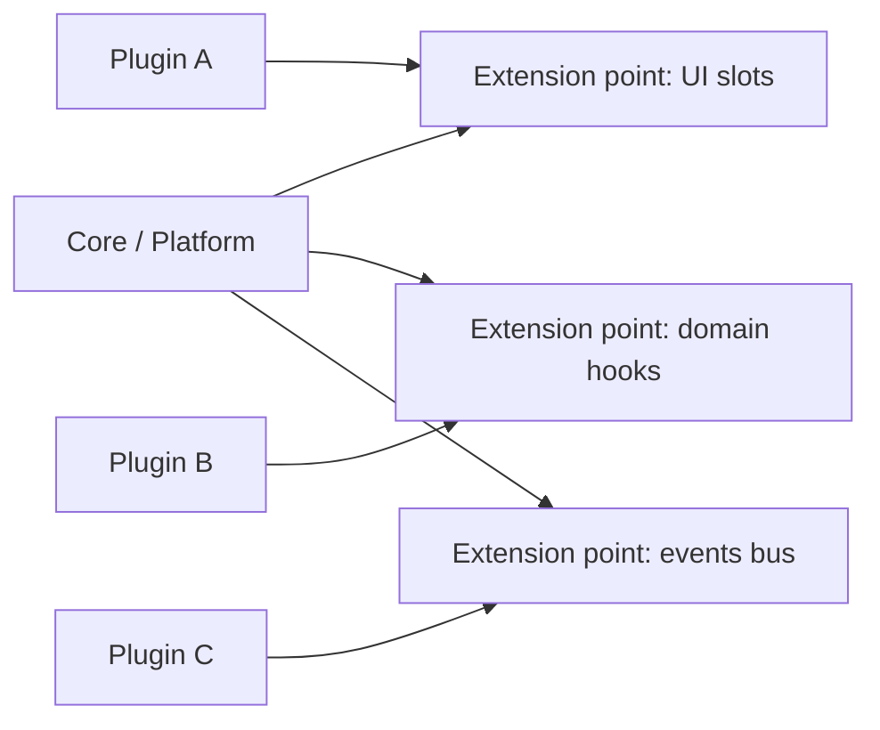
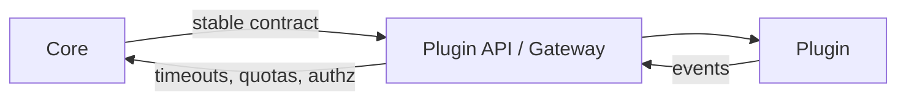
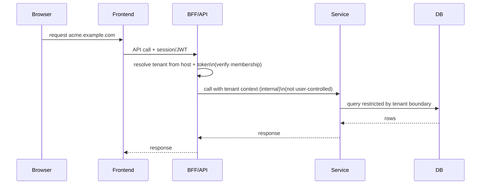

[← Назад к индексу части 34](index.md)

## 34.3 Server Components и гибриды; offline-first; плагины; multi-tenancy

### Цель раздела

Собрать связную модель “современного fullstack‑приложения”: как UI и данные проходят через границу server/client, как уменьшать клиентский JS, как жить с плохой сетью, как проектировать расширяемость и многопользовательскую изоляцию.

### В этом разделе главное

- Server Components — это способ **сдвинуть часть UI‑логики к данным** и уменьшить клиентский бандл.
- Offline‑first — это не “поставить кеш”, а **перенести источник истины** (частично) на устройство и научиться синхронизироваться.
- Плагины и multi‑tenancy — это архитектурные решения, которые сильно влияют на безопасность, контракты и стоимость сопровождения.

---

### 34.3.1 Server Components: граница server/client

#### Термины

| Термин | Суть |
| --- | --- |
| **Server Component** | Компонент, исполняемый на сервере; не попадает в клиентский JS |
| **Client Component** | Компонент для интерактивности в браузере |
| **Hydration** | “оживление” HTML на клиенте (часть 24) |
| **Data fetching on server** | Получение данных прямо в серверной части дерева компонентов |

#### Теория и правила

**Интуиция.** Классический SSR может дать быстрый HTML, но если у вас много интерактивности, всё равно нужно доставить большой JS и гидрировать. Server Components пытаются “срезать” JS там, где интерактивность не нужна.

**Формулировка.** Server Components — подход, в котором:

- часть компонентного дерева исполняется только на сервере,
- результаты (разметка/данные) “встраиваются” в ответ,
- клиент получает JS только для тех частей, которые реально интерактивны.

**Важно не перепутать:**

- SSR — про **где рождается HTML**,
- Server Components — про **какие компоненты вообще становятся JS на клиенте**.

#### Простыми словами

Server Component — это «кусок UI, который считается на сервере и приходит как готовая разметка», а не как “код, который надо запустить в браузере”.

#### Картинка в голове



#### Как запомнить

- **Server Components уменьшают JS**, потому что “не все компоненты должны стать JS”.
- Интерактивность требует client‑компонента — это осознанная граница.

#### Пример (концептуально)

```jsx
// Server component (не отправляется как JS в браузер)
export default async function ProductPage({ params }) {
  const product = await db.products.findById(params.id);
  return (
    <>
      <h1>{product.title}</h1>
      <p>{product.description}</p>
      <AddToCartButton productId={product.id} /> {/* интерактивность = client */}
    </>
  );
}
```

```jsx
"use client";
export function AddToCartButton({ productId }) {
  return <button onClick={() => addToCart(productId)}>В корзину</button>;
}
```

#### Практика / реальные сценарии

- каталоги, карточки товара, профили — где много “текста/разметки” и мало интерактивности;
- страницы, где данные удобно брать рядом с бекендом (без лишних round‑trip на клиенте).

#### Типичные ошибки

- пометить “client” слишком верхний компонент → весь поддеревом уедет в бандл, выигрыш исчезнет;
- тянуть секреты/приватные данные в клиентские компоненты;
- забыть про наблюдаемость: часть “UI‑ошибок” будет на сервере.
- устроить “водопад” данных: каждый серверный компонент отдельно ходит в API/БД, и латентность суммируется.

#### Практический нюанс: водопады данных и кеширование/дедупликация

Server Components часто упрощают data fetching, но есть риск:

- “удобно” вызвать `fetch()` в каждом компоненте,
- и получить **последовательные** запросы (водопад), если данные зависят друг от друга или нет дедупликации.

Практика, которая помогает:

- агрегировать данные на границе страницы (один “сборщик данных” для секции),
- использовать кеширование и дедупликацию запросов (на уровне фреймворка/рантайма),
- измерять p95/p99 на серверном рендере (а не только в браузере).

Картинка‑интуиция:

```
Плохо:   Page -> fetch A -> Component1 fetch B -> Component2 fetch C (последовательно)
Лучше:   Page -> fetch A,B,C (параллельно) -> раздать вниз как props/контекст
```

#### Проверь себя: водопады данных

1. Почему “водопад данных” часто ухудшает p95/p99 даже если каждый запрос сам по себе быстрый?  
2. Назови два способа уменьшить водопад запросов в серверном рендере.  
3. Почему измерять только браузерные метрики недостаточно при server components?

<details><summary>Ответ</summary>

1. Потому что последовательные запросы суммируют задержки, и вероятность “хвоста” растёт: один медленный запрос тянет всю цепочку.  
2. Параллелизация (агрегация данных выше по дереву), кеширование/дедупликация запросов, BFF‑агрегация, проектирование API “под страницу”.  
3. Потому что часть времени теперь живёт на сервере (серверный рендер/стриминг/запросы к данным). Без серверных метрик и трейсов вы не увидите реальную причину задержки.

</details>

#### Что будет, если…

- если граница server/client выбрана неправильно, можно получить:
  - большой бандл (как раньше),
  - сложность отладки (и на сервере, и на клиенте),
  - неожиданные проблемы кеширования и консистентности данных.

#### Проверь себя

1. Почему server components могут уменьшить размер бандла даже при наличии SSR?  
2. Что случится, если “случайно” сделать корневой layout client‑компонентом?  
3. Почему server components усиливают важность границ и контрактов с бекендом?

<details><summary>Ответ</summary>

1. Потому что они уменьшают объём кода, который вообще должен быть доставлен и выполнен в браузере; SSR сам по себе не уменьшает JS.  
2. Большая часть дерева станет клиентской, попадёт в бандл и будет гидратироваться — выигрыш исчезнет.  
3. Потому что часть данных и логики сдвигается ближе к бекенду: нужно чётко понимать, что где выполняется, какие данные доступны, и как это версионируется/кешируется.

</details>

#### Запомните

Server Components — это про **осознанную границу интерактивности** и про **перенос вычислений к данным**.

---

### 34.3.2 Гибриды: SSR/SSG/Islands/JAMstack + server components

#### Теория и правила

Реальные продукты редко “чистые”. Часто получается гибрид:

- маркетинг и документация — SSG/ISR + CDN (часть 23),
- часть страниц — SSR (динамика, персонализация),
- интерактивные блоки — islands/partial hydration (часть 24),
- server components — чтобы уменьшить клиентский JS,
- BFF — чтобы адаптировать данные под UI (часть 30),
- edge — чтобы ускорить маршрутизацию/кеш (34.1).

Главное правило: **каждый слой добавляет стоимость** (сложность, отладка, observability). Гибрид должен иметь понятную причину.

#### Картинка в голове: “слоёный пирог” рендера и данных



#### Простыми словами

Это как кухня ресторана:

- часть блюд готовится заранее (SSG),
- часть готовится на заказ (SSR),
- часть — “собирается на столе” (client hydration),
- а edge — это умный официант, который ускоряет доставку.

#### Практика / реальные сценарии

**Сценарий: SaaS продукт + маркетинговый сайт.**

- маркетинг: SSG/ISR + edge‑кеш;
- кабинет: SSR + server components для страниц с большим количеством данных;
- интерактивные элементы (фильтры/таблицы) — client‑компоненты;
- BFF: агрегация под UI, чтобы не гонять десятки запросов.

#### Типичные ошибки

- смешать всё сразу без метрики (зачем server components? зачем edge?);
- построить слишком много слоёв без наблюдаемости → “непонятно, где тормозит”;
- не продумать кеширование (когда кешируем, где, как инвалидируем).

#### Проверь себя

1. Назови один сигнал, что server components дают пользу именно в твоём продукте.  
2. Какую роль чаще всего играет BFF в гибридной схеме?  
3. Почему гибриды требуют особенно аккуратной наблюдаемости?

<details><summary>Ответ</summary>

1. Большой клиентский бандл и долгий TTI/гидрация при том, что много UI‑частей “не интерактивны” (списки/карточки/описания).  
2. Аггрегация и адаптация данных под нужды UI, уменьшение количества round‑trip и скрытие внутренней структуры сервисов.  
3. Потому что появляются многоступенчатые пути: edge → runtime → BFF → сервисы → БД → обратно; без трейсов и метрик сложно найти узкое место.

</details>

#### Запомните

Гибриды — это нормально, но **каждый новый слой должен окупаться**.

---

### 34.3.3 Offline‑first как архитектурный выбор

#### Термины

| Термин | Суть |
| --- | --- |
| **Local-first / Offline-first** | Приложение сначала опирается на локальные данные, сеть — для синхронизации |
| **Sync queue** | Очередь локальных изменений, которые нужно отправить на сервер |
| **Conflict** | Конфликт версий: два изменения несовместимы |
| **CRDT** | Класс структур данных, которые сходятся без централизованной блокировки (сложно, но мощно) |
| **Last-write-wins (LWW)** | Простое правило конфликтов: побеждает последнее по времени (опасно для некоторых доменов) |

#### Теория и правила

**Интуиция.** Если сеть плохая, “приложение, которое ждёт сервер” — раздражает и ломается. Offline‑first говорит: “пусть пользователь работает, а мы синхронизируем позже”.

Но это меняет архитектуру:

- часть источника истины живёт на устройстве,
- появляются конфликты,
- появляется очередь изменений,
- возрастает важность идемпотентности и контрактов.

**Ключевая дилемма:** что считать “истиной” в моменте — локальное или серверное.

#### Пошагово: базовый поток offline‑first

1. Данные хранятся локально (IndexedDB / SQLite / local storage — в зависимости от объёма и требований).
2. Любое действие пользователя записывается как **операция** в локальную очередь (operation log).
3. При появлении сети операции отправляются на сервер с идемпотентными ключами.
4. Сервер принимает операции, возвращает подтверждение и/или новую версию.
5. Клиент применяет результат, чистит очередь.
6. Если есть конфликты — применяем правило (LWW, merge, ручное разрешение, CRDT — в зависимости от домена).

#### Картинка в голове: две истины, которые надо “свести”



#### Простыми словами

Offline‑first — это как записная книжка:

- вы записываете изменения у себя,
- потом “сверяете” с общим журналом,
- и иногда приходится решать: “какая запись правильная”.

#### Примеры “какие правила конфликтов бывают”

- **LWW (last write wins)**: просто, но может терять данные (опасно).
- **Merge по полям**: если менялись разные поля — можно объединить.
- **Операции (patch) вместо состояния**: отправлять “что сделал пользователь”, а не “вот новый объект”.
- **Ручное разрешение**: для критичных доменов (документы, финансовые данные).
- **CRDT**: мощно, но требует глубокой проработки и не всегда окупается.

#### Мини‑таблица: какие конфликты бывают и как их решают

| Тип данных/домен | Что считается конфликтом | Частое решение | Риск/цена |
| --- | --- | --- | --- |
| **Счётчики/телеметрия** | два обновления пришли в разном порядке | коммутативное сложение, агрегирование | низкий |
| **CRUD‑объект (профиль)** | два устройства изменили разные поля | merge по полям + версии | средний |
| **Список задач/чек‑лист** | параллельные изменения элементов | операции “add/remove/toggle” + idempotency | средний |
| **Документ/текст** | параллельные правки в одном месте | OT/CRDT или ручной merge | высокий |
| **Деньги/биллинг** | “двойное списание/оплата” | только сервер как источник истины, строгие инварианты | очень высокий |

#### Проверь себя: типы конфликтов

1. Почему для “денег/биллинга” offline-first обычно ограничивают, даже если UX хочет “работать без сети”?  
2. Чем “операции” обычно лучше “состояния” для merge и конфликтов?  
3. Приведи пример домена, где LWW допустим, и где он опасен.

<details><summary>Ответ</summary>

1. Потому что цена ошибки — очень высокая (финансовые инварианты), и автоматический merge может привести к некорректным списаниям; чаще делают server-authoritative модель и оффлайн только для черновиков/нефинансовых действий.  
2. Операции отражают намерение пользователя и легче сделать идемпотентными/коммутативными; состояние легко перезаписывает чужие изменения.  
3. Допустим: телеметрия/просмотры. Опасен: документы/финансы/заказы.

</details>

#### Практический пример: “операции + sync API + конфликт”

**Сценарий:** мобильный инспектор заполняет форму оффлайн (чек‑лист объекта), потом сеть появляется и изменения синхронизируются.

Ключевой приём: **не отправлять целиком “новый объект”**, а отправлять **операции**, которые можно:

- повторить безопасно (idempotency),
- применить на сервере по порядку,
- в случае конфликта — вернуть понятный результат.

**Пример операции (JSON):**

```json
{
  "op_id": "01J2K5...-deviceA-00042",
  "entity": "inspection_checklist",
  "entity_id": "obj-123",
  "type": "toggle_item",
  "item_id": "fire_extinguisher",
  "value": true,
  "client_time": "2026-03-17T10:05:00Z",
  "base_version": 12
}
```

**Пример sync‑эндпоинта (идея контракта):**

```http
POST /sync
Content-Type: application/json

{
  "device_id": "deviceA",
  "ops": [ ... ]
}
```

Ответ сервера (варианты):

- `200 OK` + `applied_ops` + новая версия;
- `409 Conflict` + “вот актуальная версия + вот конфликтующие поля/операции”.

**Картинка в голове: конфликт как “расхождение версий”**



#### Проверь себя: sync‑контракт

1. Зачем в операции нужен `op_id` и почему он должен быть стабилен при повторе?  
2. Для чего `base_version` и как он помогает обнаружить конфликт?  
3. Почему “отправить целиком новый объект” хуже, чем отправить операции, в оффлайн‑синке?

<details><summary>Ответ</summary>

1. Чтобы сервер мог сделать дедупликацию и не применять эффект второй раз при повторах/ретраях.  
2. Он показывает, от какой версии клиент отталкивался; если сервер уже на другой версии, можно обнаружить расхождение и вернуть конфликт/актуальное состояние.  
3. Потому что “целый объект” перезапишет чужие правки и сложнее мёрджить; операции проще валидировать, применять по порядку и делать идемпотентными.

</details>

#### Безопасность в offline‑first: где “тонко”

Offline‑first почти всегда означает, что **данные оказываются на устройстве**. Это порождает вопросы:

- что можно хранить локально (PII, токены, документы),
- как защищать данные “на диске” (шифрование, secure storage),
- как вести аудит “кто что изменил” при оффлайне,
- что делать при компрометации устройства.

Практический минимум:

- **не хранить** в local storage/IndexedDB “вечные” токены; использовать короткие сессии + ротацию,
- разделять “кеш для UX” и “данные, влияющие на деньги/инварианты” (последние лучше валидировать на сервере),
- думать про “wipe” и отзыв доступа для устройства.

#### Проверь себя: безопасность offline‑first

1. Почему хранение “вечного” токена на устройстве — особенно опасно при offline-first?  
2. Какие данные можно хранить локально “как кеш для UX”, а какие — лучше держать server-authoritative?  
3. Что такое “wipe” в контексте offline‑first и зачем он нужен?

<details><summary>Ответ</summary>

1. Потому что устройство может быть потеряно/скомпрометировано; вечный токен превращает это в постоянный доступ злоумышленника.  
2. UX‑кеш: публичные/низкорисковые данные, черновики. Server-authoritative: деньги, права, критичные инварианты (заказы, биллинг) — их надо валидировать на сервере.  
3. Это удалённое/локальное “стирание” данных и отзыв сессии/ключей, чтобы после компрометации устройство не могло продолжать работать с данными/аккаунтом.

</details>

#### Практика / реальные сценарии

- мобильные приложения в поле (склад, курьеры, инспекция);
- редакторы документов/заметок;
- формы и чек‑листы, которые должны работать без сети.

#### Типичные ошибки

- “добавим оффлайн” через кеширование API‑ответов без модели операций → будут странные расхождения;
- хранить в локальном кеше чувствительные данные без модели безопасности;
- выбирать LWW там, где потеря изменений недопустима.

#### Что будет, если…

- если не продумать конфликты — пользователи будут терять данные “иногда” (самый неприятный класс багов);
- если нет идемпотентности — синхронизация будет плодить дубли;
- если нет наблюдаемости — не поймёте, почему у пользователей “иногда не синкается”.

#### Проверь себя

1. Почему offline‑first почти всегда требует “операций”, а не только “состояния”?  
2. Почему LWW — не универсальное решение?  
3. Назови один домен, где конфликт лучше решать вручную, и один — где можно автоматически.

<details><summary>Ответ</summary>

1. Потому что состояние может быть устаревшим и перезаписать чужие изменения; операции легче делать идемпотентными и легче мёрджить по смыслу.  
2. Потому что “последнее” может быть случайностью (у кого часы быстрее, кто позже вышел в сеть) и может уничтожить важные правки.  
3. Вручную: документы/тексты, финансовые записи. Автоматически: лайки/просмотры/телеметрия (где потеря не критична или есть агрегирование).

</details>

#### Запомните

Offline‑first — это **архитектура синхронизации и конфликтов**, а не “включить кеш”.

---

### 34.3.4 Плагинная архитектура (backend и frontend)

#### Термины

| Термин | Суть |
| --- | --- |
| **Extension point** | Точка расширения: место, куда подключаются плагины |
| **Plugin contract** | Контракт плагина: интерфейсы, события, права |
| **Sandbox** | Изоляция выполнения плагина, чтобы ограничить ущерб |
| **Capability / Permission** | Разрешения, которыми обладает плагин |

#### Теория и правила

**Интуиция.** Если продукт превращается в платформу (редактор, CRM, маркетплейс, аналитика), то “добавлять всё в ядро” приводит к взрыву сложности и конфликтам при разработке. Плагинная архитектура говорит: “ядро остаётся стабильным, расширения живут отдельно”.

**Главный принцип:** плагинная архитектура — это **контракты и границы**, иначе плагины превращаются в “хаос внутри”.

Три опоры:

1. **Стабильный контракт** (API плагина, события, модели данных, версии).
2. **Изоляция** (техническая и организационная): плагин не должен ломать ядро и другие плагины.
3. **Безопасность**: плагины — это расширение поверхности атаки.

#### Картинка в голове: ядро + плагины вокруг



#### Пошагово: как спроектировать плагинность

1. Определи, что остаётся **в ядре** (инварианты, безопасность, данные).
2. Выдели точки расширения:
   - UI‑слоты (кнопки/панели/страницы),
   - доменные хуки (before/after),
   - события (event bus).
3. Опиши контракт:
   - методы,
   - события,
   - версии,
   - разрешения.
4. Спроектируй изоляцию:
   - отдельный процесс/worker,
   - ограниченный API,
   - таймауты и circuit breaker на вызовы плагинов.
5. Продумай обновления и совместимость (семантическое версионирование, deprecation).

#### Варианты изоляции (sandbox): что реально делают в продакшене

Плагины почти всегда нужно изолировать. Изоляция — это не “одна кнопка”, а выбор механизма по контексту.

**На фронтенде** распространённые варианты:

- **iframe**: сильная изоляция по безопасности, но сложнее интеграция и UX;
- **Web Worker**: изоляция выполнения без доступа к DOM, хорошо для вычислений/парсинга;
- **Shadow DOM / Web Components**: изоляция стилей и разметки, но не полная безопасность;
- **WASM**: изоляция по модели выполнения, удобно для “плагинов‑алгоритмов” (но всё равно нужен контроль прав и доступов).

**На бекенде** варианты:

- отдельный **процесс** (RPC), или даже отдельный **контейнер** (ещё сильнее);
- ограниченный API “ядро ↔ плагин” + таймауты/лимиты;
- модель прав (capabilities) и аудит.

#### Картинка в голове: изоляция как “стена и дверь”



Смысл: “дверь” (контракт) должна быть узкой, а “стена” (изоляция) — прочной.

#### Проверь себя: sandbox/изоляция плагинов

1. Почему Shadow DOM/Web Components — это не “полная безопасность”, в отличие от iframe?  
2. Когда Web Worker подходит как sandbox, а когда — нет?  
3. Почему на бекенде “отдельный процесс/контейнер” часто проще для изоляции, чем “плагины в одном процессе”?

<details><summary>Ответ</summary>

1. Потому что они в основном изолируют UI/стили и структуру, но не дают жёсткой модели безопасности выполнения и доступа к данным как у iframe с origin‑изоляцией.  
2. Подходит для вычислений/парсинга без доступа к DOM; не подходит, если плагину нужно напрямую управлять UI/DOM или если нужно жёстко ограничить сетевые права без дополнительных механизмов.  
3. Потому что процесс/контейнер естественно отделяет память и падения, упрощает лимиты ресурсов и снижает риск “один плагин уронил весь сервис”.

</details>

#### Продакшн‑аспекты: supply chain, подпись, ревью, аудит

Если плагины распространяются не только “внутри команды”, а через маркетплейс/партнёров, появляются риски цепочки поставки:

- вредоносный код в плагине,
- компрометация аккаунта автора,
- подмена артефакта при доставке,
- зависимость плагина от уязвимых библиотек.

Практики, которые реально помогают:

- **подпись артефактов** (плагин должен быть подписан; платформа проверяет подпись перед установкой),
- **review‑процесс** (автоматический скан + ручной чек для прав/интеграций),
- **минимальные права по умолчанию** (capabilities: “запроси доступ” вместо “доступ есть”),
- **аудит**: логировать действия плагина (какие API вызывал, какие данные трогал),
- **kill switch**: возможность быстро отключить плагин при инциденте.

Мини‑чек‑лист перед запуском плагинов:

- есть ли версия контракта и политика deprecation?
- есть ли таймауты/лимиты/изоляция?
- есть ли модель прав (capabilities) и аудит?
- можно ли быстро отключить плагин без деплоя ядра?

#### Проверь себя: supply chain и аудит

1. Почему подпись плагинов важна даже если “у нас есть ревью кода”?  
2. Чем “capabilities по умолчанию минимальные” лучше, чем “все права сразу, потом ограничим”?  
3. Зачем нужен kill switch, если есть возможность “откатить релиз”?

<details><summary>Ответ</summary>

1. Потому что риск — не только в коде, но и в доставке артефакта: подмена сборки, компрометация аккаунта автора, атаки на цепочку поставки. Подпись помогает убедиться, что поставлен именно проверенный артефакт.  
2. Это снижает риск утечки/злоупотреблений: плагин получает ровно те права, которые запросил и которые одобрены, а не “всё сразу” на доверии.  
3. Потому что инцидент может быть вызван внешним плагином/партнёром; kill switch позволяет отключить проблему быстро без ожидания деплоя/отката ядра.

</details>

#### Пример: контракт плагина (TypeScript)

```ts
export type Capabilities = {
  uiSlots?: string[];
  domainHooks?: string[];
};

export interface PluginContext {
  log: (level: "info" | "warn" | "error", msg: string, meta?: Record<string, unknown>) => void;
  emitEvent: (name: string, payload: unknown) => Promise<void>;
  hasPermission: (perm: string) => boolean;
}

export interface Plugin {
  id: string;
  version: string;
  capabilities: Capabilities;
  init(ctx: PluginContext): Promise<void>;
}
```

#### Практика / реальные сценарии

- редакторы и платформы: плагины для импорта/экспорта, форматирования, интеграций;
- B2B продукты: кастомные поля/валидации/воркфлоу “под клиента” без форка ядра;
- фронтенд: подключаемые виджеты/страницы через Module Federation или registry (см. часть 29 про сборку).

#### Типичные ошибки

- “плагины” без изоляции: плагин падает → падает весь продукт;
- контракт “по договорённости в чате” → ломается совместимость;
- доступ плагина к данным без строгих прав → утечки и безопасность.

#### Что будет, если…

- если контракт нестабилен, плагины будут постоянно ломаться при релизах ядра;
- если нет sandbox/таймаутов, один плагин может деградировать производительность всей системы;
- если нет модели прав, плагины станут каналом компрометации.

#### Проверь себя

1. Почему плагинная архитектура почти всегда требует версионирования контрактов?  
2. Какие два механизма из части 31 особенно важны для плагинов?  
3. Чем плагинная архитектура отличается от “просто модулей” внутри монолита?

<details><summary>Ответ</summary>

1. Потому что ядро и плагины развиваются независимо; без версий и правил совместимости релизы станут “русской рулеткой”.  
2. Границы доверия/Zero Trust (плагин как недоверенный код) и наблюдаемость/таймауты/изоляция (resilience на границе ядро↔плагин).  
3. Модули — часть одной кодовой базы и одного процесса релиза; плагины — независимые расширения с отдельным жизненным циклом и повышенными требованиями к контрактам/изоляции.

</details>

#### Запомните

Плагинность — это **контракт + изоляция + безопасность**, а не “загружаем произвольный код”.

---

### 34.3.5 Multi‑tenancy: варианты и trade-offs

#### Термины

| Термин | Суть |
| --- | --- |
| **Tenant** | Клиент/организация в SaaS |
| **Isolation** | Изоляция данных и влияния одного тенанта на другого |
| **Noisy neighbor** | “Шумный сосед”: один тенант нагружает систему и ухудшает другим |
| **Compliance** | Регуляторные требования (GDPR, хранение в регионе, аудит) |

#### Теория и правила

Multi‑tenancy — это когда один продукт обслуживает много организаций, и нужно решить:

- как разделять данные,
- как ограничивать влияние,
- как соблюдать безопасность и регуляторику,
- как масштабировать и обслуживать.

Три базовые модели (в порядке роста изоляции и стоимости):

1. **Одна БД, таблицы с `tenant_id`**.
2. **Одна БД, отдельная схема (schema) на тенанта**.
3. **Отдельная БД/инстанс на тенанта**.

#### Картинка в голове: три уровня “стены”

```
tenant_id:   одна стена внутри комнаты (логическая изоляция)
schema:      отдельные комнаты в одном доме
db/instance: отдельные дома
```

#### Сравнение моделей (простая матрица)

| Модель | Плюсы | Минусы | Когда уместно |
| --- | --- | --- | --- |
| **Shared DB + tenant_id** | дёшево, просто, один пул ресурсов | риск утечек из‑за багов, noisy neighbor, сложнее compliance | много маленьких тенантов, умеренные требования |
| **Shared DB + schema per tenant** | лучше изоляция схемы, проще миграции “по тенанту” | сложнее эксплуатация и миграции, рост объектов | средний уровень изоляции, SaaS с отличиями по схемам |
| **DB per tenant / instance per tenant** | максимальная изоляция, проще compliance и “шумный сосед” | дорого, сложно управлять флотом, миграции как оркестрация | крупные клиенты, регуляторика, enterprise |

#### Пошагово: как выбирать модель multi‑tenancy

1. Определить требования к безопасности и регуляторике (нужна ли физическая изоляция? региональность? аудит?).
2. Оценить ожидаемую нагрузку и риск “шумного соседа”.
3. Оценить стоимость операций:
   - миграции схем,
   - бэкапы и восстановление,
   - мониторинг по тенантам,
   - онбординг/оффбординг тенанта.
4. Выбрать минимально достаточную модель с планом эволюции (часть 32).

#### Где живёт tenant‑контекст и как он “путешествует” по системе

Один из самых практичных вопросов multi‑tenancy: **как система узнаёт, какой сейчас tenant?**

Типовые варианты:

- **поддомен**: `acme.example.com` → tenant = `acme`;
- **путь**: `/t/acme/...` (часто хуже для публичных API);
- **claim в токене**: `tenant_id` в JWT/сессии;
- **заголовок**: `X-Tenant-Id` (удобно, но опасно, если клиент может подделать).

Главное правило безопасности:

- если tenant приходит “снаружи”, он должен быть **проверен и связан с identity** (аутентификация/авторизация), а не просто “прочитан из заголовка”.

#### Картинка в голове: прокидывание tenant‑контекста



Ключевая идея: tenant‑контекст внутри системы должен быть **внутренним фактом**, а не “параметром от клиента”.

#### Проверь себя: tenant‑контекст

1. Почему `X-Tenant-Id` опасен, если его можно прислать с клиента без проверки?  
2. Как связать tenant с identity так, чтобы пользователь не мог “переключиться” на чужого тенанта?  
3. Почему важно различать “tenant из URL/host” и “tenant из токена”?

<details><summary>Ответ</summary>

1. Потому что клиент может подделать заголовок и попытаться получить доступ к чужим данным; tenant должен быть проверен через аутентификацию/членство.  
2. Проверять membership/ролевая модель на сервере: tenant выбирается из контекста запроса, но подтверждается токеном/сессией и политиками доступа.  
3. URL/host может задавать “кандидат” тенанта, но токен подтверждает, что пользователь действительно принадлежит этому тенанту; несоответствие — признак атаки/ошибки.

</details>

#### Практика: noisy neighbor и квоты

Технические меры, которые часто нужны раньше, чем кажется:

- лимиты по RPS/CPU/памяти “на тенанта”,
- отдельные очереди или приоритеты,
- мониторинг метрик “по тенанту” (latency/error/usage),
- “быстрый выключатель” для проблемного тенанта (kill switch).

#### Проверь себя: noisy neighbor

1. Почему noisy neighbor — это не только “про производительность”, но и про SLA/бизнес-риски?  
2. Назови два инструмента ограничения “шумного соседа”, кроме “купить больше серверов”.  
3. Почему мониторинг “по тенанту” важнее, чем только общие метрики системы?

<details><summary>Ответ</summary>

1. Потому что один крупный/проблемный тенант может ухудшить опыт всем и привести к потере клиентов и нарушению обещаний (SLO/SLA).  
2. Квоты/лимиты RPS, приоритеты/очереди, rate limiting на тенанта, изоляция ресурсов, отдельные пулы/шарды для крупных клиентов.  
3. Общие метрики могут скрывать проблему: система “в среднем” нормальная, но один тенант деградирует или деградирует всем. Per-tenant метрики позволяют локализовать причину и принимать точечные меры.

</details>

#### Типичные граничные случаи (о которых забывают)

- **перенос тенанта** в другой регион (data residency);
- **экспорт данных** при расторжении договора;
- **восстановление из бэкапа**: “как восстановить одного тенанта, не затронув остальных?”;
- **миграции схемы**: как прогонять миграции по всем тенантам (особенно при schema/db per tenant).

#### Проверь себя: граничные случаи multi‑tenancy

1. Почему “восстановить одного тенанта из бэкапа” сложно в модели shared DB + tenant_id?  
2. Чем миграции схемы усложняются при schema/db per tenant?  
3. Какой “продуктовый” сценарий чаще всего ломает “мы потом решим multi‑tenancy”?

<details><summary>Ответ</summary>

1. Потому что данные физически перемешаны в одной базе; восстановление требует точечного извлечения и аккуратной согласованности ссылок/индексов.  
2. Нужно оркестрировать миграции для множества схем/баз, следить за версией каждого тенанта, обрабатывать частичные сбои и откаты.  
3. Появление enterprise‑клиента с регуляторикой/изоляцией, требованием выделенного хранилища/региона и строгого аудита.

</details>

#### Пример: защита на уровне БД при tenant_id (PostgreSQL RLS — концепт)

```sql
-- Минимальный пример (PostgreSQL, Row Level Security).
-- Цель: даже если разработчик "забыл WHERE tenant_id = ...",
-- БД всё равно отрежет чужие строки.

alter table invoices enable row level security;

-- Мы предполагаем, что приложение на соединении выставляет текущий tenant:
-- set app.tenant_id = 'acme';
create policy tenant_isolation on invoices
  using (tenant_id = current_setting('app.tenant_id')::text);

-- Важно: это не отменяет авторизацию на уровне приложения.
-- RLS — дополнительный барьер, а не единственная защита.
```

Ключевая мысль: “tenant_id в коде” — это хорошо, но **архитектурно лучше** иметь дополнительные барьеры (RLS, отдельные схемы, отдельные БД) по требованию риска.

#### Проверь себя: RLS как дополнительный барьер

1. Почему RLS не заменяет авторизацию приложения?  
2. Что произойдёт, если приложение забудет выставить `app.tenant_id` в соединении?  
3. Когда лучше выбрать “DB per tenant”, чем полагаться на RLS в shared DB?

<details><summary>Ответ</summary>

1. Потому что авторизация включает проверку identity/ролей/прав, бизнес‑правила и аудит; RLS — только фильтр строк в БД, он не понимает контекст прав.  
2. В зависимости от политики можно либо получить ошибку, либо (в худшем случае) неверное поведение. Поэтому нужно безопасное значение по умолчанию и тесты/гварды, которые гарантируют установку tenant‑контекста.  
3. Когда нужна физическая изоляция/регуляторика, крупные клиенты, риск noisy neighbor, требования по региональности и независимым бэкапам/восстановлению.

</details>

#### Типичные ошибки

- начать с shared DB и никогда не планировать эволюцию, а потом “невозможно выделить крупного клиента”;
- отсутствие лимитов и квот → noisy neighbor ломает опыт всем;
- смешать роли и права (RBAC) разных тенантов → утечки.

#### Что будет, если…

- если изоляция слабая при высоких требованиях — риск утечки и юридических последствий;
- если изоляция слишком сильная для старта — операционная сложность и стоимость могут убить скорость продукта.

#### Проверь себя

1. Почему shared DB + tenant_id — самый рискованный вариант по утечкам?  
2. Назови один критерий, который толкает к DB per tenant.  
3. Почему multi‑tenancy — это не только про БД?

<details><summary>Ответ</summary>

1. Потому что любая ошибка в запросе или авторизации может “пересечь” данные тенантов; разделение логическое и зависит от дисциплины и защит.  
2. Жёсткая регуляторика/контракты enterprise, требование физической изоляции, или высокая вероятность noisy neighbor с крупными клиентами.  
3. Потому что это ещё про аутентификацию/авторизацию, квоты, биллинг, наблюдаемость по тенантам, деплой и миграции.

</details>

#### Запомните

Multi‑tenancy — это выбор “изолируемость ↔ стоимость операций”. Правильный ответ зависит от контекста.

---
