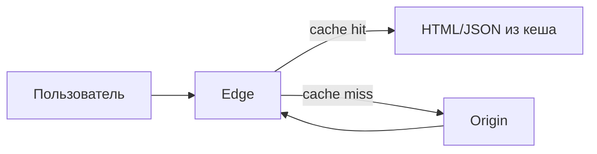

[← Назад к индексу части 34](index.md)

## Справочник по части

| Тема | Ключевые пункты (коротко) |
| --- | --- |
| **Edge** | ближе к пользователю; хорошо для routing/кеша; лимиты; осторожно с персонализацией и секретами |
| **Serverless** | функции по событию; stateless; cold start; лимиты; идемпотентность обязательна |
| **Server Components** | уменьшают клиентский JS; граница server/client важна; не путать с SSR |
| **Offline‑first** | локальная БД + очередь операций + синк + конфликты; без правил конфликтов опасно |
| **Плагины** | контракт+версионирование+изоляция+безопасность; без этого — хаос |
| **Multi‑tenancy** | tenant_id vs schema vs db per tenant; изоляция ↔ стоимость операций; квоты и наблюдаемость по тенантам |

#### Проверь себя: справочник

1. Если тебе нужно “срезать JS и ускорить интерактивность”, какая строка справочника должна первой всплыть в голове — и почему?  
2. Если продукт “падает” из‑за одного клиента, какая строка справочника указывает, куда копать?  
3. Чем отличаются “риски edge” и “риски serverless” по природе причин?

Ответ

1. Server Components: они прямо нацелены на уменьшение клиентского JS и на явную границу server/client, что влияет на размер бандла и гидрацию.  
2. Multi‑tenancy: noisy neighbor и квоты/изоляция — типовая причина “один клиент ломает всем”.  
3. Edge чаще “ломается” из‑за кеша/персонализации/границ доверия и ограничений runtime на PoP; serverless — из‑за повторов/идемпотентности, холодных стартов, сетевых зависимостей и лимитов выполнения/соединений.

---

## Частые сценарии

---

## Сквозные кейсы (end-to-end): “контекст → архитектура → риски → метрики → откат”

Сценарии ниже специально сделаны **сквозными**: они показывают не только “что это такое”, но и **как принять решение, как внедрять, как измерять успех и как откатывать**. Это то, чего обычно не хватает в обзорах “современных направлений”.

### Кейс 1. Edge-кэш и персонализация: “быстро первый байт, но без утечек”

**Контекст**

- публичные страницы (каталог/лендинг) с большим трафиком;
- есть персонализация (язык/регион/AB bucket; иногда — признаки авторизации);
- бизнес жалуется на TTFB и “сайт медленный в регионах”.

**Решение (типовая архитектура)**

- edge делает:
  - кеширование HTML/JSON,
  - лёгкую маршрутизацию,
  - выделение **безопасного cache key** (например, `region+lang+ab`).
- origin делает:
  - персональные данные,
  - сложные вычисления,
  - выдачу “истины”.

**Критические риски**

- неправильный cache key / `Vary` → **утечка данных между пользователями**;
- лишний hop edge→origin без кеш‑хита → “edge не ускорил, а замедлил”.

**Как внедрять (без боли)**

1) Выбери **1–2 страницы** и **явно определи “можно ли кешировать”**.  
2) Определи cache key только по **неперсональным сегментам** (регион/язык/AB).  
3) Включи **SWR** (stale‑while‑revalidate) только там, где “лучше старое, чем 500” допустимо.  
4) Добавь алерты: cache hit ratio, p95/p99 TTFB, доля ответов stale.

**Метрики успеха**

- TTFB p95/p99 по регионам (до/после),
- cache hit ratio,
- error rate origin (должен снизиться),
- инциденты “wrong user data” должны быть **нулевыми**.

**План отката**

- флаг/конфиг “bypass cache” на edge,
- временно выключить персонализирующие ключи и вернуться к “только статика”.

---

### Кейс 2. Serverless для асинхронной обработки: “дёшево и быстро, но без дублей”

**Контекст**

- обработка событий: вебхуки, загрузка файлов, генерация превью, email/SMS;
- всплески нагрузки;
- нужен быстрый старт без постоянного сервера воркеров.

**Решение**

- serverless-функция как обработчик события (queue/topic/webhook),
- состояние и дедупликация — **внешние** (DB/kv-store).

**Главный контракт**: at-least-once доставка → **идемпотентность обязательна**.

**Как внедрять**

1) Определи **idempotency key** (например, `eventId`/`messageId`).  
2) Сделай dedupe-store: “видели ключ? тогда no-op”.  
3) Определи DLQ и политику ретраев.  
4) Включи наблюдаемость: лаг очереди, доля ретраев, ошибки по типам.

**Метрики успеха**

- ноль двойных эффектов (дубли оплат/писем),
- backlog/age сообщений в очереди,
- стоимость на 1k событий,
- MTTR по инцидентам (должен уменьшиться за счёт метрик/DLQ).

**План отката**

- переключить обработку на временный контейнерный воркер,
- отключить триггер функции и “дочистить” DLQ вручную по runbook.

---

### Кейс 3. Server Components (и гибрид) в продукте: “уменьшить JS, не убить команду”

**Контекст**

- SPA/SSR-гибрид стал тяжёлым: большой бандл, плохой INP/TTI;
- много страниц, где интерактивность точечная (кнопки/формы), а контента много.

**Решение**

- выделить “серверные зоны” (контент/данные) и “клиентские острова” (интерактивность),
- уменьшить JS, который реально нужно гидрировать.

**Как внедрять**

1) Выбери 1 маршрут и пометь интерактивные компоненты как client, остальное — server.  
2) Перенеси data fetching на сервер там, где это безопасно (без утечек секретов в клиент).  
3) Зафиксируй правило: **не тащить интерактивность в server-компоненты** (иначе всё превратится в client).

**Метрики успеха**

- размер JS на первый экран,
- INP/TTI и LCP (до/после),
- error rate гидрации/рендер‑ошибок.

**План отката**

- флаг “старый рендер” на уровне маршрута (per-route),
- быстрый rollback версии (часть 20) + мониторинг метрик.

---

### Кейс 4. Offline-first форма: “работает без сети, но без потери данных”

**Контекст**

- полевой ввод данных (курьеры/склад/медицина),
- сеть плохая или отсутствует,
- пользователи редактируют одни и те же сущности на разных устройствах.

**Решение**

- локальное хранилище (IndexedDB/SQLite),
- operation log (очередь операций),
- синхронизация с сервером с идемпотентностью,
- правила конфликтов.

**Как внедрять**

1) Определи, какие операции должны работать оффлайн (команды), а какие — нет.  
2) Сделай operation log и “повторяемость” операций (idempotency key).  
3) Спроектируй конфликты: авто‑merge (если можно) и ручное разрешение (если критично).  
4) Добавь UX‑сигналы: “в очереди N изменений”, “последняя синхронизация”.

**Метрики успеха**

- доля успешных синков,
- число конфликтов (и время их разрешения),
- потерянные изменения = 0 (инвариант),
- время работы сценария при плохой сети (пользовательский успех).

**План отката**

- режим “read-only offline” (только просмотр) как fallback,
- ограничение оффлайн‑операций до безопасного минимума.

---

### Кейс 5. Multi-tenancy для SaaS: “начать просто, но иметь путь к enterprise”

**Контекст**

- B2B SaaS, много клиентов, у крупных клиентов особые требования;
- есть риск noisy neighbor;
- возможна регуляторика и требования изоляции/аудита.

**Решение (эволюционная схема)**

1) старт: `tenant_id` + строгая проверка прав + квоты,  
2) рост: `schema-per-tenant` для групп/enterprise,  
3) enterprise: `db-per-tenant`/отдельный инстанс.

**Как внедрять**

1) Ввести `tenant_id` как часть **контракта** (в токене/сессии, в запросе, в данных).  
2) Включить наблюдаемость “по тенанту” (p95 latency, error rate, RPS).  
3) Ввести квоты/лимиты и тарифы как guardrails.  
4) Заранее описать “условия эволюции” (когда переезжаем на отдельную БД).

**Метрики успеха**

- инциденты noisy neighbor локализуются по tenant,
- возможность ограничить/изолировать тенанта без влияния на остальных,
- время расследования инцидента по крупному клиенту.

**План отката**

- feature-flag ограничений (quota/rate limit) + аварийное “изоляция по тарифу”,
- миграция enterprise в отдельную БД как план B (если это запланировано заранее).

### Сценарий 1: “Нужно ускорить первый ответ пользователям по всему миру”

- **Как рассуждать**: можно ли кешировать? можно ли принять решение на edge без похода в origin? что с персонализацией?  
- **Частый выбор**: CDN + edge‑логика для routing/A/B; origin остаётся источником данных.  
- **Частый провал**: кешировать персонализированное “как статическое” и утечь данными.

#### Проверь себя: сценарий 1

1. Какие 2–3 фактора определяют, даст ли edge выигрыш по latency в этом сценарии?  
2. Что именно нужно проверить в кеше, чтобы не было утечки данных?  
3. Когда “обычный CDN‑кеш без вычислений” достаточен и edge‑код избыточен?

Ответ

1. Возможность ответить на границе (кеш/routing), доля запросов cache hit, необходимость похода в origin, p95/p99 по сети.  
2. Cache key/`Vary`, правила персонализации, разделение публичного/сегментного/персонального, `Cache-Control`.  
3. Когда контент статичен и хорошо кешируется, а логики принятия решения на границе почти нет (или она решается конфигурацией CDN).

### Сценарий 2: “Нагрузка редкая, но бывают всплески (например, вебхуки)”

- **Как рассуждать**: какой SLA по времени ответа? допустим ли cold start? нужна ли фоновой обработка?  
- **Частый выбор**: serverless для приёма и валидации → очередь → worker/сервис.  
- **Частый провал**: делать тяжёлую логику прямо в функции без идемпотентности и таймаутов.

#### Проверь себя: сценарий 2

1. Почему “функция принимает вебхук и сразу пишет в БД” может плохо масштабироваться?  
2. Где в цепочке вебхуков чаще всего требуется идемпотентность?  
3. Какую роль играет очередь в схеме “приём → очередь → обработка”?

Ответ

1. Всплеск вызовов приведёт к множеству параллельных соединений/транзакций, таймаутам, росту стоимости; лучше быстро принять/валидировать и поставить в очередь.  
2. На приёме вебхука (повторы от внешней системы) и на обработке события (at-least-once доставка/ретраи).  
3. Сглаживает пики, отделяет приём от обработки, повышает устойчивость и управляемость повторов/ошибок.

### Сценарий 3: “Слишком большой бандл и медленная гидрация”

- **Как рассуждать**: где интерактивность реально нужна? можно ли перенести часть рендера к данным?  
- **Частый выбор**: server components для неинтерактивных частей + аккуратные client‑острова.  
- **Частый провал**: пометить всё как client и не получить выигрыш.

#### Проверь себя: сценарий 3

1. Почему SSR сам по себе не гарантирует быстрый TTI?  
2. Какое простое архитектурное правило помогает не “случайно сделать всё client”?  
3. Назови один сигнал, что проблема не в JS‑бандле, а в данных/водопадах запросов.

Ответ

1. Потому что интерактивность требует скачивания и выполнения JS; если бандл огромный, гидрация всё равно будет долгой.  
2. Держать client‑компоненты максимально локальными (только там, где есть интерактивность) и не поднимать `use client` слишком высоко.  
3. Долгий серверный рендер/плохие p95/p99 до БД/API, много последовательных запросов — это водопад данных.

### Сценарий 4: “Пользователи работают без сети”

- **Как рассуждать**: какие операции должны быть доступны? какие конфликты возможны? как обеспечиваем корректность?  
- **Частый выбор**: локальная БД + очередь операций + синхронизация с идемпотентностью; правила конфликтов.  
- **Частый провал**: “кешировать ответы” вместо модели операций и конфликтов.

#### Проверь себя: сценарий 4

1. Почему “кешировать ответы API” не решает проблему оффлайн‑редактирования?  
2. Какие 2 элемента обязательны в минимальной offline-first архитектуре?  
3. Когда конфликт лучше решить вручную, а не автоматически?

Ответ

1. Потому что нужно не только “показать старое”, но и корректно принять новые изменения пользователя и синхронизировать их без потери данных.  
2. Очередь операций (operation log) + правила синхронизации/конфликтов (и идемпотентность на сервере).  
3. Когда домен критичен и потеря правок недопустима (документы, финансы, важные записи).

### Сценарий 5: “SaaS для компаний, нужен рост крупных клиентов”

- **Как рассуждать**: уровень изоляции? регуляторика? noisy neighbor? стоимость операций?  
- **Частый выбор**: старт с tenant_id + защитами (RLS/политики) и план эволюции; для enterprise — отдельные БД/инстансы.  
- **Частый провал**: не закладывать выбор и наблюдаемость по тенантам с самого начала.

#### Проверь себя: сценарий 5

1. Назови 3 фактора, которые толкают от `tenant_id` к “отдельная БД/инстанс”.  
2. Почему наблюдаемость “по тенантам” часто нужна раньше, чем “масштабирование”?  
3. Какой первый “архитектурный долг” появляется, если multi‑tenancy не продумали в начале?

Ответ

1. Регуляторика/изоляция, enterprise‑контракты, noisy neighbor/нагрузка, требования региональности, независимые бэкапы/restore.  
2. Потому что проблемы часто локальны (один тенант генерирует ошибки/нагрузку); без per-tenant метрик нельзя диагностировать и управлять риском.  
3. Смешение данных и прав: потом сложно безопасно разрезать схемы, вводить квоты и обеспечить аудит/изоляцию.

---

## Практика после части 34

1. Возьми один сценарий и выбери **edge vs serverless vs контейнер**. Опиши:
   - что выигрываем,
   - что платим,
   - одно ограничение, которое может “сломать” решение в production.
2. Для сценария “офлайн‑форма” опиши:
   - где хранится локальное состояние,
   - как выглядит операция синхронизации,
   - как решается конфликт.
3. Для SaaS придумай “маленький” контракт multi‑tenancy:
   - где хранится `tenant_id`,
   - как проверяются права,
   - как мониторить “шумного соседа”.

#### Проверь себя: практика

1. Как ты проверишь, что выбранное решение (edge/serverless/контейнер) действительно улучшило ситуацию, а не просто “сменило технологию”?  
2. Какие два вопроса ты обязан(а) задать про данные, когда проектируешь оффлайн‑форму?  
3. Назови один минимальный набор метрик “по тенанту”, который нужен почти всегда.

Ответ

1. Через измеримые метрики “до/после”: p95/p99 latency, error rate, стоимость (вызовы/сек, egress), cache hit ratio, время расследования инцидентов (observability).  
2. (а) какие операции должны работать оффлайн (и что является инвариантом), (б) какие конфликты возможны и как они разрешаются (авто/вручную), плюс идемпотентность синка.  
3. RPS/нагрузка, p95 latency, error rate, объём данных/операций синка, квоты/лимиты и их превышения.

---

## Вопросы для самопроверки

1. Когда edge действительно уменьшает latency, а когда нет?  
2. Почему idempotency — обязательна для serverless‑обработчиков событий?  
3. Чем server components отличаются от SSR по сути?  
4. Почему offline‑first без конфликтов — путь к потере данных?  
5. Назови три модели multi‑tenancy и один trade‑off для каждой.  
6. Почему плагины требуют изоляции и модели прав?

Ответ

1. Уменьшает, когда решение можно принять на границе (кеш/маршрутизация) и/или не нужно ходить в origin; не уменьшает, если вся работа всё равно в origin/БД и добавился лишний hop.  
2. Потому что повторная доставка и retry — нормальны; без идемпотентности эффекты будут выполняться дважды.  
3. SSR отвечает на вопрос “где рождается HTML”, а server components — “какие компоненты становятся JS на клиенте”; server components уменьшают JS‑бандл.  
4. Потому что независимые изменения неизбежны, и без правил вы получите недетерминированные перезаписи и расхождения.  
5. tenant_id (дёшево, риск утечек и noisy neighbor), schema per tenant (лучше изоляция, сложнее эксплуатация), db per tenant (макс. изоляция, дорого и сложно управлять).  
6. Потому что плагин — потенциально недоверенный код; без изоляции он может уронить систему или получить лишние данные/права.

---

## Типичные ошибки

- выбирать edge/serverless/server components “потому что модно”, а не потому что есть измеримая цель;
- игнорировать p95/p99 и смотреть только “среднее”;
- отсутствующие таймауты и идемпотентность в serverless‑цепочках;
- offline‑first без контрактов синхронизации и без стратегии конфликтов;
- multi‑tenancy без наблюдаемости и квот по тенантам;
- плагины без версии контракта и без sandbox/прав.

#### Проверь себя: типичные ошибки

1. Какая из ошибок чаще всего приводит к “инциденту утечки данных”, а какая — к “инциденту двойных эффектов”?  
2. Почему “смотреть среднее” — опасно в современных распределённых схемах?  
3. Какой “анти‑совет” можно дать команде, чтобы она сама распознала “мы делаем потому что модно”?

Ответ

1. Утечка данных — чаще про неправильный кеш (edge, `Vary`/cache key) и про multi‑tenancy без изоляции/прав; двойные эффекты — про serverless/очереди без идемпотентности.  
2. Потому что пользователи и цепочки зависят от хвостов p95/p99; “среднее” скрывает редкие, но очень дорогие деградации и таймаут‑каскады.  
3. “Сформулируйте измеримую цель и критерий успеха; если не можете — отложите технологию”. Если цель не формулируется — это сигнал про тренд, а не про контекст.

---

## Резюме части

- **Edge** — мощный ускоритель на границе, но с жёсткими лимитами и чувствительностью к безопасности/кешу.
- **Serverless** — отличный инструмент для событий и всплесков, но требует идемпотентности, наблюдаемости и честного учёта cold start.
- **Server Components и гибриды** — способ уменьшить клиентский JS и перенести вычисления к данным; ключ — граница server/client.
- **Offline‑first** — это архитектура синхронизации и конфликтов, а не “кеширование”.
- **Плагины и multi‑tenancy** — фундаментальные продуктовые решения: контрактность, изоляция, безопасность и стоимость операций.

Связь со следующей частью (35): теперь у тебя есть материал, чтобы в части 35 собрать **прагматичную сводку выбора**: когда что применять и какие вопросы задавать, чтобы не стать жертвой трендов.

#### Проверь себя: резюме

1. Назови одну общую “сквозную” идею, которая повторяется во всех направлениях (edge/serverless/server components/offline-first/плагины/multi-tenancy).  
2. Какой “универсальный вопрос” из части 33 ты бы применил(а) к любому современному направлению из части 34?  
3. Если тебе нужно объяснить менеджеру, почему “не усложнять” иногда лучший выбор, какая фраза из резюме будет ядром?

Ответ

1. Границы и контракты + цена эксплуатации: где выполняется код, где проходит доверие, как это наблюдать/защищать/эволюционировать.  
2. “Что выигрываем, чем платим, и готовы ли мы к цене владения (операционной сложности)?” — это критерии выбора под контекст.  
3. “Сложная архитектура должна окупаться; иначе она становится техдолгом и риском. Лучший современный выбор иногда — простая архитектура, которую команда точно потянет.”

