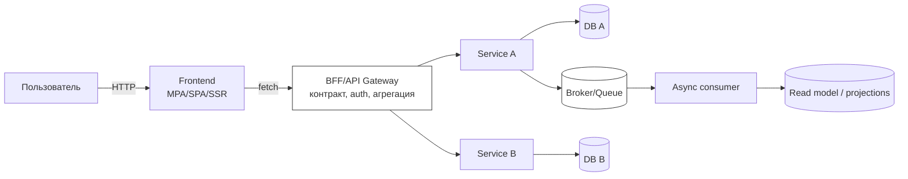
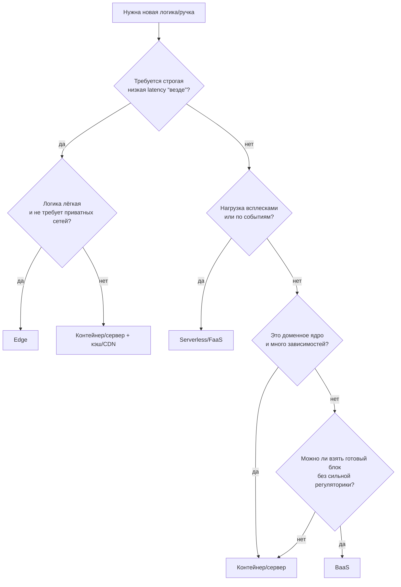
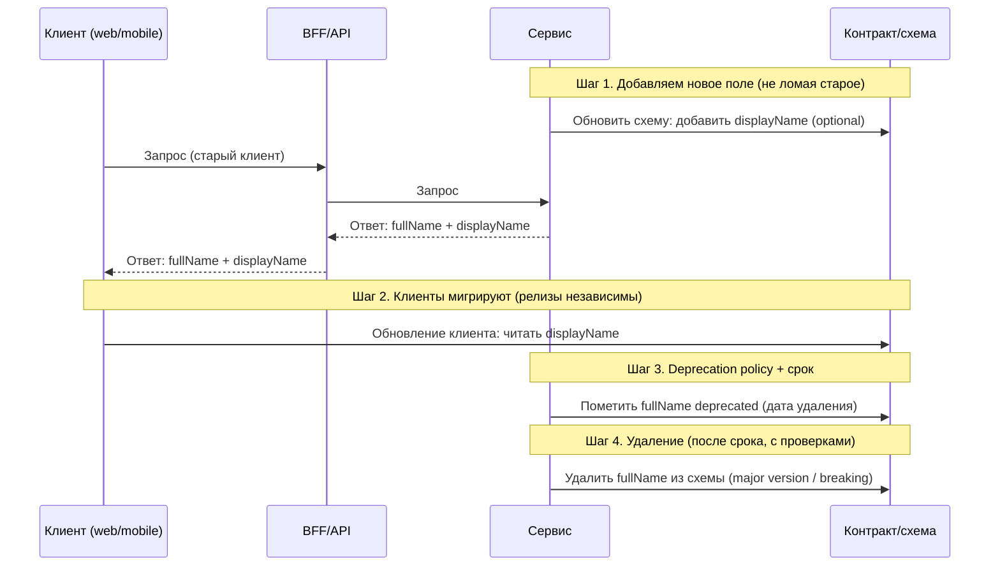

[← Назад к индексу части 35](index.md)

## 35.1 Сводка: когда какую архитектуру

### Цель раздела

Собрать «двигатель выбора»: как из контекста и целей получить решение по архитектуре (бекенд + фронтенд), и как не перепутать «подходит» с «модно».

#### Проверь себя: цель 35.1

1. Что означает «выбор архитектуры под контекст» на практике? Назови 2–3 фактора контекста, которые ты обязан выяснить до выбора.  
2. Почему “подходит” и “модно” — разные вещи? Приведи пример, где модный выбор ухудшит систему.  
3. Чем “двигатель выбора” отличается от “списка архитектур”?

<details><summary>Ответ</summary>

1. Это значит: сначала фиксируем ограничения и цели (команды/данные/эксплуатация/нагрузка/регуляторика), и только потом выбираем стиль и границы. Примеры факторов: количество команд и независимость релизов, модель данных и консистентность, зрелость наблюдаемости/on-call.  
2. Модный выбор может не соответствовать ограничениям. Например, микросервисы без наблюдаемости и контрактов часто ухудшают скорость и стабильность, превращаясь в распределённый монолит.  
3. Список архитектур отвечает “что существует”, а двигатель выбора отвечает “как выбрать и почему”, включая последствия и план эволюции.

</details>

### В этом разделе главное

- **Архитектура выбирается не по названиям**, а по **осям контекста** (команды, домен, данные, эксплуатация).
- **Главная цена сложной архитектуры** — не код, а **эксплуатация и координация** (контракты, релизы, наблюдаемость).
- Хорошая матрица выбора всегда отвечает на три вопроса:
  1) **Что выигрываем?**  
  2) **Чем платим?**  
  3) **Что станет сложнее/опаснее?**
- **Гибриды — норма**: система может быть «в целом монолит», но иметь 1–2 выделенных сервиса; фронт может быть SSR для публичной части и SPA для кабинета.
- На границах неизбежны «плохие условия» (сеть, несовместимость, атаки) → нужны **контракты, версии, наблюдаемость**.

#### Проверь себя: главное в 35.1

1. Почему «главная цена сложной архитектуры — эксплуатация и координация», а не “сложность кода”?  
2. Объясни формулу «сложность оправдана, когда покупает независимость». Какая независимость имеется в виду?  
3. Назови 2 примера гибридов и объясни, почему они часто лучше “чистого” решения.

<details><summary>Ответ</summary>

1. Потому что распределённость приносит контракты, версии, наблюдаемость, инциденты, деплой, диагностику и координацию изменений между командами. Это часто дороже, чем написать код.  
2. Независимость релизов команд, независимость масштабирования подсистем, независимость владения доменом/данными. Если независимость не нужна — вы платите сложностью без выгоды.  
3. SSR для публичной части + SPA для кабинета; модульный монолит + один выделенный сервис “по боли”. Гибрид позволяет платить сложностью только там, где она даёт измеримую выгоду.

</details>

### Термины

| Термин | Коротко |
| --- | --- |
| **Ось выбора** | Фактор, который резко меняет правильность архитектуры (например, «несколько команд»). |
| **Независимый релиз** | Возможность выпускать часть системы без синхронизации со всеми остальными. |
| **Владение данными** | Кто имеет право менять модель данных и как это влияет на другие части. |
| **Latency budget** | Сколько задержки допустимо на пользовательский сценарий. |
| **Blast radius** | Радиус поражения: насколько далеко разнесётся сбой одной части. |

#### Проверь себя: термины 35.1

1. Приведи пример **оси выбора** и объясни, как она меняет решение (например, про команды или консистентность).  
2. Что означает “владение данными” и почему оно критично при разделении на сервисы?  
3. Как связаны latency budget и выбор BFF/агрегации/количества сетевых hop’ов?

<details><summary>Ответ</summary>

1. Ось “несколько команд и независимые релизы” часто сдвигает выбор от монолита к сервисным границам. Ось “строгая консистентность” может удерживать в монолите/модульном монолите.  
2. Это право и ответственность менять модель данных и правила домена. Если владение не определено, появляются общие таблицы/схемы и скрытые зависимости — путь к распределённому монолиту.  
3. Каждый hop добавляет задержку и риск таймаутов. Если budget мал, лучше уменьшать hops (кэш, агрегация ближе к данным, edge/SSR/продуманная схема запросов).

</details>

### Теория и правила

#### 1) Универсальная модель выбора: «контекст → критерии → решение → последствия»

Архитектурное решение — это не «выбрать схему», а **свести цели и ограничения в критерии** и сравнить варианты.

Мини‑шаблон:

1. **Сформулировать сценарии** (не «в целом», а 2–5 ключевых потоков).
2. **Зафиксировать цели** (производительность, безопасность, скорость изменений, стоимость).
3. **Зафиксировать ограничения** (команда, сроки, legacy, регуляторика, инфраструктура).
4. **Сформировать 2–4 варианта** (не больше: иначе сравнение станет фейком).
5. **Оценить trade‑off’ы** по «осям выбора».
6. **Выбрать и записать ADR** (что выбрали и почему).
7. **Заложить эволюцию**: «если вырастем — какой следующий шаг».

Это звучит «процессно», но на практике — это способ **не выбирать на эмоциях**.

#### Проверь себя: модель выбора

1. Почему важно ограничить число вариантов до 2–4, а не рассматривать “всё на свете”?  
2. Что будет, если пропустить шаг «заложить эволюцию» и выбрать архитектуру как “навсегда”?  
3. Какая часть мини‑шаблона лучше всего предотвращает «религиозные споры» в команде и почему?

<details><summary>Ответ</summary>

1. Потому что сравнение становится управляемым и честным. Слишком много вариантов обычно превращается в имитацию анализа: никто не может качественно оценить trade‑off’ы.  
2. Вы рискуете “замуровать” решение: когда контекст изменится, цена смены станет слишком высокой, и система будет страдать.  
3. Фиксация критериев и последствий (ADR): она переводит спор из “мне нравится” в “что выигрываем/теряем и почему”.

</details>

#### 2) Оси выбора (самые важные)

Ниже — набор осей, которые чаще всего «переворачивают» выбор:

- **Команды и границы владения**
  - 1 команда → проще монолит/модульность/монорепо.
  - 3+ команд, разные домены → появляется смысл в сервисных/микрофронтовых границах.
- **Данные и консистентность**
  - Единая транзакционная модель и строгая консистентность → монолит/модульный монолит часто дешевле.
  - Eventual consistency приемлема → открывает EDA/CQRS/проекции.
- **Эксплуатационная зрелость**
  - Нет наблюдаемости/инцидент‑процесса → распределённость становится «слепой».
  - Есть логи/метрики/трейсы, контрактность, автоматизация → можно безопаснее усложнять.
- **Профиль нагрузки**
  - Ровная умеренная нагрузка → «простая» архитектура лучше.
  - Всплески/события/редкие тяжёлые операции → serverless может быть выгоден.
- **Latency и география**
  - Строгие требования к латентности в разных регионах → edge/кэш/репликации становятся архитектурной осью.
- **Регуляторика и изоляция**
  - Требования по изоляции/аудиту → влияет на multi‑tenancy, сегментацию, хранение данных.

#### Проверь себя: оси выбора

1. Почему ось “эксплуатационная зрелость” часто важнее, чем ось “нагрузка”, при решении “монолит vs микросервисы”?  
2. Приведи пример, когда ось “регуляторика” напрямую ломает красивую архитектурную идею (и что делать вместо).  
3. Какая ось чаще всего “прячется” и всплывает только в production?

<details><summary>Ответ</summary>

1. Потому что без наблюдаемости/процессов распределённая система становится неотлаживаемой и медленной в изменениях из‑за инцидентов. Нагрузка можно часто решить кэшем/индексами/очередями, не вводя сервисную сложность.  
2. Например, нельзя хранить данные вне региона/нужна строгая изоляция тенантов → нельзя просто “взять BaaS/общую БД”. Вместо этого — отдельные схемы/БД/инстансы, или гибридный подход с сегментацией.  
3. Эксплуатационная зрелость (логирование, трейсы, on-call) и контрактность — часто “не видны” до первых серьёзных инцидентов.

</details>
#### 3) Визуальная модель: как «течёт» запрос (и где обычно ломается)

Когда ты выбираешь архитектуру, полезно буквально видеть поток:



**Ключ**: «места, где ломается» — это границы: браузерная сеть, BFF/API, межсервисные вызовы, брокер, база. Поэтому выбор архитектуры — это выбор **количества и характера границ**.

#### Проверь себя: визуальная модель потока

1. Назови 3 границы на диаграмме, где чаще всего появляются таймауты/несовместимость/инциденты. Почему именно там?  
2. Зачем на схеме отдельно выделены **BFF/API Gateway** и **Broker/Queue**? Какую “цену” они добавляют и какую выгоду покупают?  
3. Как изменится “характер границ”, если ты уберёшь BFF и будешь ходить с фронта напрямую в сервисы?

<details><summary>Ответ</summary>

1. Браузерная сеть (CORS, нестабильность, латентность), граница BFF/API (контракт, auth, версии), межсервисные вызовы (таймауты, ретраи, каскады). Ещё брокер (повторы, порядок, дедупликация) и база (блокировки, схема).  
2. BFF покупает адаптацию/агрегацию/единый вход и политики безопасности, но добавляет hop и ответственность (наблюдаемость, масштабирование). Broker покупает асинхронность и декуплинг, но добавляет eventual consistency, повторные доставки, сложность дебага.  
3. Увеличится количество “публичных” контрактов и сетевых hops, усложнится auth/версионирование на клиенте, вырастет риск каскадных запросов и утечек внутренних деталей наружу.

</details>

---

### Пошагово: алгоритм выбора архитектуры под контекст

Ниже — «боевой» алгоритм, который можно применять за 30–60 минут на воркшопе.

#### Шаг 0. Определи 3–5 главных пользовательских сценариев

Примеры:

- «Пользователь открывает главную → видит персонализацию → кликает → покупает»
- «Оператор обрабатывает заказ, меняет статус»
- «Ночной отчёт считает метрики»

**Почему это важно:** архитектура выбирается под сценарии, а не под диаграммы.

##### Проверь себя: шаг 0 (сценарии)

1. Почему “сценарий” — это лучше, чем формулировка “нам нужен микросервис/SSR”?  
2. Приведи пример сценария, который “тянет” систему к асинхронности (EDA), и объясни почему.  
3. Какие 2 сценария ты выберешь в первую очередь для системы, где главная боль — инциденты?

<details><summary>Ответ</summary>

1. Потому что архитектура должна оптимизировать конкретные потоки (latency, ошибки, данные), а не соответствовать названию. “Нам нужен микросервис” — не задача, а решение без контекста.  
2. Например, “после оформления заказа нужно уведомить пользователя, обновить склад, отправить событие в аналитику и в поиск” — много потребителей одного факта → EDA снижает связанность.  
3. Самые частые и самые критичные для бизнеса/репутации (например, “оформление заказа” и “логин/оплата”), потому что они дадут больше всего сигналов о границах, наблюдаемости и рисках.

</details>
#### Шаг 1. Заполни “контекст‑карточку”

Скопируй и заполни для своей задачи:

| Вопрос | Твоё значение |
| --- | --- |
| Команда | 3 разработчика / 20 разработчиков / 5 команд |
| Домены | 1 домен / несколько bounded contexts |
| Частота релизов | раз в неделю / ежедневно / десятки раз в день |
| Данные | строгая консистентность / допускаем eventual |
| Нагрузка | ровная / всплески / события |
| Latency | обычная / строгая (игры, трейдинг) / глобальная аудитория |
| Интеграции | мало / много внешних систем |
| Регуляторика | нет / высокая (финансы, медицина) |
| Эксплуатация | базовая / зрелая (SLO, on-call) |

##### Проверь себя: шаг 1 (контекст‑карточка)

1. Какая строка карточки чаще всего недооценивается и потом “взрывается” в production? Почему?  
2. Если у тебя 1 команда и 1 домен, но нагрузка высокая — что в карточке важнее: “команда” или “нагрузка”? Как ты рассудишь?  
3. Приведи пример, как изменение одной строки карточки (например, появление второй команды) меняет архитектурное решение.

<details><summary>Ответ</summary>

1. Эксплуатация (наблюдаемость/on-call) и контрактность: пока нет инцидентов, кажется “неважным”, но распределённость без этого становится хаосом.  
2. Команда задаёт допустимую операционную сложность. При высокой нагрузке часто сначала достаточно кэша/очередей/шардинга, а не микросервисов. Решение — оценить, можно ли снять нагрузку без роста границ.  
3. Появилась вторая команда и блокировки релизов → появляется смысл в более автономных границах (модули/крупные сервисы/микросервисы) и в явных контрактах.

</details>
#### Шаг 2. Выдели «жёсткие» ограничения (они отсекают варианты)

Примеры жёстких ограничений:

- «Нужна транзакция на несколько сущностей» → микросервисы усложнят.
- «Нельзя хранить данные за пределами региона» → влияет на облако/edge/репликацию.
- «Команда не может поддерживать 10 сервисов on-call» → микросервисы не подходят *сейчас*.

##### Проверь себя: шаг 2 (жёсткие ограничения)

1. Почему жёсткие ограничения нужно фиксировать до обсуждения вариантов, а не “в процессе”?  
2. Приведи пример ограничения, которое отсекает serverless/edge даже если “хочется”.  
3. Что хуже: неверно считать ограничение жёстким или забыть реальное жёсткое ограничение? Почему?

<details><summary>Ответ</summary>

1. Потому что иначе команда тратит время на обсуждение вариантов, которые всё равно невозможны, и спор превращается в эмоции.  
2. Нужен доступ к приватной сети/VPC или долгие соединения/процессы — edge/serverless могут не подойти из‑за runtime/сетевых ограничений и лимитов времени.  
3. Забыть реальное жёсткое ограничение: это приведёт к решению, которое “не взлетит” и станет дорогим откатом. Ложное “жёсткое” тоже плохо, но его можно пересмотреть, если появятся факты.

</details>
#### Шаг 3. Сформируй 2–4 кандидата и сравни по осям

Пример кандидатов:

- модульный монолит + очереди для фоновых задач;
- микросервисы по доменам + BFF;
- монолит + выделенный сервис «платежи»;
- fullstack‑фреймворк (SSR) + BFF‑агрегация внутри одного процесса.

##### Проверь себя: шаг 3 (кандидаты)

1. Почему 2–4 кандидата — хороший диапазон, а 1 или 10 — почти всегда плохо?  
2. Какие 2 оси ты возьмёшь для сравнения, если проект “горит” по срокам, но ожидается рост команд?  
3. Приведи пример “кандидата‑гибрида” и объясни, какую цену он экономит.

<details><summary>Ответ</summary>

1. 1 кандидат = нет сравнения и риск религии. 10 кандидатов = нет качества анализа. 2–4 — баланс между широтой и глубиной.  
2. Ось “сроки/компетенции команды” (что реально внедрить) и “организационная независимость” (как не заблокировать рост).  
3. Модульный монолит + один сервис “по боли”: экономит цену распределённости там, где она не нужна, но даёт автономность там, где она окупается.

</details>
#### Шаг 4. Выбери «сейчас» и заложи «потом»

Главный приём зрелости: ты выбираешь не «на 10 лет», а **траекторию**:

- сейчас: модульный монолит (границы в коде, контракты между модулями);
- потом: выделить один сервис, когда появится вторая команда или узкий bottleneck.

##### Проверь себя: шаг 4 (траектория)

1. Почему “траектория” почти всегда лучше “идеала на 10 лет”?  
2. Назови 2 триггера, при которых ты пересмотришь решение “оставаться модульным монолитом”.  
3. Что ты сделаешь заранее в монолите, чтобы потом выделение сервиса было дешевле?

<details><summary>Ответ</summary>

1. Контекст меняется: требования, команда, регуляторика. Траектория позволяет получать ценность сейчас и снижать риск через поэтапные изменения.  
2. Появились независимые команды/релизы; возник узкий доменный bottleneck или отдельная нагрузка; данные требуют автономного владения.  
3. Ввести модульные границы, запрет циклов, явные контракты, изоляцию данных/репозиториев, наблюдаемость и правила взаимодействий.

</details>
#### Шаг 5. Зафиксируй ADR (минимум)

Формат ADR (1–2 страницы):

- Контекст
- Варианты
- Решение
- Последствия (плюсы/минусы/долги)
- План пересмотра (когда вернёмся к этому решению)

##### Проверь себя: шаг 5 (ADR)

1. Какие два пункта ADR чаще всего забывают, и чем это заканчивается?  
2. Почему “последствия” важнее, чем “описание решения”?  
3. Что должно быть в ADR, чтобы через год новая команда могла продолжить эволюцию без повторения споров?

<details><summary>Ответ</summary>

1. Триггеры пересмотра и план эволюции/отката: без них решение превращается в догму и “память старожилов”.  
2. Потому что последствия фиксируют trade‑off и долги — то, что реально определяет стоимость владения и риск.  
3. Контекст/ограничения, варианты и почему отвергли, решение, последствия (включая долги), когда пересматривать, какие метрики/сигналы считать триггерами.

</details>
---

### Быстрое дерево решений (если нужно “стартовое” направление за 2 минуты)

Этот блок не заменяет алгоритм выше, но помогает быстро сориентироваться и потом уже пройти шаги 0–5.

```mermaid
flowchart TD
  A[Старт: есть задача/продукт] --> B{Сколько команд<br/>и нужна ли независимость релизов?}

  B -- 1 команда / независимость не нужна --> C{Домен 1<br/>и нужны транзакции “всё сразу”?}
  C -- да --> D[Монолит / слоёная -> сразу думай про модульность]
  C -- нет --> E[Модульный монолит (границы внутри кода)]

  B -- 2-3 команды / частичная независимость --> F{Много legacy-интеграций<br/>и нужен интеграционный слой?}
  F -- да --> G[Крупные сервисы / SOA-стиль (осторожно с “умной шиной”)]
  F -- нет --> H[Модульный монолит или крупные сервисы по доменам]

  B -- 3+ команды / релизы должны быть независимы --> I{Эксплуатация зрелая?<br/>контракты+наблюдаемость+on-call}
  I -- нет --> J[Не прыгай в микросервисы: сначала платформа и guardrails]
  I -- да --> K[Микросервисы по доменам + владение данными]

  A --> L{Один факт нужен многим?<br/>отчеты/поиск/уведомления}
  L -- да --> M[EDA + (иногда) CQRS/проекции<br/>если eventual ok]
  L -- нет --> N[Синхронные API достаточно]
```

Что важно: дерево “подталкивает” к направлению, но **не отменяет контекст‑карточку, оценку ограничений и ADR**.

#### Проверь себя: быстрое дерево решений

1. В каких двух случаях дерево может “намекнуть” на микросервисы, но тебе всё равно нужно сначала усилить guardrails и эксплуатацию?  
2. Почему ветка «один факт нужен многим» ведёт к EDA/CQRS даже при одной команде?  
3. Какое решение дерево подсказало бы для «2 команды + много legacy‑интеграций» и почему это похоже на SOA‑стиль?

<details><summary>Ответ</summary>

1. Когда эксплуатация не зрелая (нет трейсов/контрактов/on‑call) и когда данные/транзакции слишком связаны без готовности к eventual consistency. Микросервисы в таком контексте увеличат инциденты и координацию.  
2. Это про декуплинг по данным: много потребителей одного факта → события снижают жёсткие синхронные связи и упрощают подключение новых потребителей (аналитика/поиск/уведомления).  
3. «Крупные сервисы / SOA‑стиль (интеграционный слой)»: legacy‑интеграции часто требуют систематизации адаптеров/политик, что ближе к SOA‑мышлению.

</details>

### Простыми словами

Представь, что архитектура — это **способ разрезать большую задачу на куски** и договориться, как куски общаются.  
Чем больше кусков (сервисов, микрофронтов, интеграций), тем больше мест, где что‑то может сломаться, и тем больше нужно «систем безопасности»: контракты, наблюдаемость, процессы релиза.

Поэтому «сложная архитектура» — это не «умнее», а **дороже в сопровождении**. Её берут, когда выгода (независимость команд, масштабирование, скорость изменений) *перекрывает* цену.

#### Проверь себя: простыми словами (про цену сложной архитектуры)

1. Почему “ещё один сервис” автоматически повышает требования к наблюдаемости и контрактам?  
2. Назови 2 механизма, которые помогают платить сложностью **по мере роста**, а не сразу.  
3. Какой один вопрос ты задашь, чтобы проверить, что сложность действительно “окупается”?

<details><summary>Ответ</summary>

1. Появляется новая граница: сеть, таймауты, ретраи, версии и диагностика. Чтобы понимать, где ломается, нужны trace_id, метрики и понятные контракты.  
2. Гибриды (разделять только по боли) и поэтапная эволюция (Strangler/feature flags/canary), плюс модульность как подготовка к разрезу.  
3. «Какую независимость мы покупаем (команд/релизов/масштабирования) и кто ей будет пользоваться?» Если ответа нет — сложность лишняя.

</details>

---

### Картинка в голове

**Монолит** — это как один завод: всё внутри одной территории, можно быстро бегать между цехами.  
**Микросервисы** — это сеть заводов: каждый завод автономен, но нужна логистика, договоры, контроль качества и диспетчеризация.  
Если у тебя 10 работников и один продукт — сеть заводов обычно абсурдна.  
Если у тебя 10 заводов и 10 команд — один гигантский завод может стать тормозом.

#### Проверь себя: метафора “заводы”

1. Что в метафоре соответствует **контрактам и версиям**?  
2. Что соответствует **наблюдаемости и инцидент‑менеджменту**?  
3. В каком случае метафора подсказывает: «остаться на одном заводе, но навести порядок внутри»?

<details><summary>Ответ</summary>

1. Договоры между заводами = контракты: форматы поставки, версии, правила совместимости.  
2. Диспетчеризация и контроль качества = метрики/логи/трейсы, алерты, процессы релизов и инцидентов.  
3. Когда команда одна/две и домен тесно связан: лучше модульный монолит/слои с границами внутри, чем сеть заводов.

</details>

---

### Как запомнить

Формула выбора:

> **Сложность архитектуры оправдана, когда она покупает независимость.**  
> Если независимость не нужна — сложность почти всегда лишняя.

Чек‑лист из 5 вопросов:

1) Сколько **команд** и нужно ли им выпускаться независимо?  
2) Насколько система зависит от **единых транзакций/данных**?  
3) Готова ли эксплуатация к **наблюдаемости и контрактам**?  
4) Где узкие места: **latency, масштабирование, интеграции**?  
5) Как будет выглядеть **путь эволюции** через 6–12 месяцев?

---

### Матрица «ситуация → архитектура» (сводная)

Это не «правильные ответы», а **первичная рекомендация**, от которой ты отталкиваешься и дальше уточняешь нюансы.

Важно: полный перечень архитектурных вариантов (чтобы не “забыть” релевантный способ) смотри в глобальном плане в разделе **«Карта всех архитектур»** (`architects_mastery_plan.md`). В выборе полезно держать привычку: *“мы правда рассмотрели все разумные альтернативы под наш контекст?”*

#### 0) Сводная матрица (размер команды × домен × масштаб × latency)

Это именно то, что требует план: **ситуация → архитектура** в виде «крупной карты». Её удобно использовать так:

- **как стартовую рекомендацию** (не финальный ответ),
- как способ **увидеть, что вы платите сложностью**,
- как способ сформулировать **следующий шаг эволюции**.

| Команда / владение | Домен | Масштаб / нагрузка | Latency / география | Рекомендация «по умолчанию» | Следующий шаг, если вырастем |
| --- | --- | --- | --- | --- | --- |
| 1 команда | 1 домен | низкий–средний | обычная | **монолит → модульный монолит** | выделить 1 сервис по боли; добавить очередь |
| 1 команда | 1 домен | высокий | обычная | **модульный монолит + кэш + очереди** | масштабировать по shared‑nothing (см. ниже) |
| 1 команда | несколько доменов | средний | обычная | **модульный монолит с явными bounded contexts** | «крупные сервисы» (coarse‑grained) |
| 2–3 команды | несколько доменов | средний | обычная | **крупные сервисы / “мини‑SOA” + BFF** | микросервисы по доменам при необходимости |
| 3+ команды, независимые релизы критичны | несколько доменов | средний–высокий | обычная | **микросервисы по доменам + контрактность + наблюдаемость** | усилить платформу (CI/CD, SRE практики) |
| любая | любой | всплески/события/редкие задачи | обычная | **serverless/FaaS для “краевых” задач** | выделить доменные сервисы по владению данными |
| любая | любой | любой | строгая/глобальная | **кэш/edge для близких вычислений + региональная архитектура** | репликации/шардинг/edge‑приближение |

Ключевой смысл таблицы: **распределённость — это организационный и эксплуатационный выбор**, а не «способ ускорить систему».

#### 1) Бекенд: базовая матрица выбора

| Ситуация | Что обычно выбирать | Почему | Чем платим / риски |
| --- | --- | --- | --- |
| 1 команда, 1 домен, быстрый старт | **Монолит** или **слоёная** | быстрое изменение, простая эксплуатация | риск «кома грязи» без границ |
| 1 команда, домен растёт, нужен порядок | **Модульный монолит** | границы в коде, можно эволюционировать | нужно дисциплина модульности |
| Несколько доменов, 2–3 команды | **Модульный монолит** или **крупные сервисы** | независимость частичная, дешевле микросервисов | нужна договорённость о границах |
| 3+ команд, независимые релизы критичны | **Микросервисы** (по доменам) | организационная независимость | высокая цена эксплуатации |
| Много потребителей одних данных, асинхронность уместна | **EDA**, иногда **CQRS** | декуплинг, новые проекции | eventual consistency, сложность дебага |
| Потоки данных/пайплайны/обработка этапами | **Pipe-and-filter** | ясная конвейерная модель | сложность оркестрации/наблюдаемости |
| Очень высокая конкуренция, супервизия, сообщения | **Actor model** | безопасная конкуренция, fault isolation | нишевость, сложность обучения |
| Всплески, события, редкие задачи | **Serverless/FaaS** | платим за выполнение, масштаб «до нуля» | cold start, лимиты, наблюдаемость |

##### 1.1 Монолит, 2/3/4-tier (N-tier) и «слоёная»: когда достаточно “обычной” архитектуры

План отдельно просит: **2/3/4‑tier, слоёная, когда достаточно N‑tier без микросервисов**.

Интуиция:

- **2-tier** (клиент ↔ БД) в продакшене почти всегда плохая идея для сложных систем: безопасность, масштабирование и эволюция страдают.
- **3-tier** (UI ↔ backend ↔ DB) — самый частый “здоровый минимум”.
- **4-tier+** — часто про выделение отдельного слоя (например, кеш/очередь/интеграционный слой), но важно не плодить слои ради слоёв.

Простыми словами: N‑tier — это **про разведение ответственности**, а не про «много сервисов».

Мини‑схема (мыслительная):

```
Browser/App
   |
   v
Backend (API + доменная логика)
   |
   v
DB + Cache + Queue (инфраструктура)
```

Когда N‑tier «достаточно»:

- 1–2 команды;
- транзакции и данные тесно связаны;
- главная боль — скорость изменений и поддерживаемость, а не независимые релизы по 10 командам.

Типичная ошибка: «монолит = плохо» → люди убегают в микросервисы, хотя проблему решает **модульность и границы**.

###### Проверь себя: 1.1 N-tier и слоёная

1. Почему 2‑tier (клиент ↔ БД) почти всегда плохая идея для сложных прод‑систем? Назови 2 причины.  
2. В чём практическая разница между “слоёной архитектурой” и “микросервисами”, если смотреть на границы и контракты?  
3. Какой минимальный guardrail ты добавишь в монолит, чтобы он не превратился в Big Ball of Mud?

<details><summary>Ответ</summary>

1. Безопасность (клиенту нельзя доверять доступ к БД) + эволюция/масштабирование (жёсткая связность, сложно менять схему и бизнес‑правила без поломок).  
2. Слоистая — про внутреннюю структуру одного приложения (границы в коде). Микросервисы — про внешние границы по сети (контракты, версии, таймауты, наблюдаемость), то есть другая цена и риски.  
3. Явные модульные границы + запрет циклов/нарушений зависимостей (dependency rules) и контроль публичной поверхности модулей.

</details>

##### 1.2 Масштабирование монолита в сторону shared-nothing (без микросервисов)

План просит: **shared‑nothing при масштабировании монолита**.

Суть простыми словами: вместо «одна огромная БД и один огромный процесс» ты пытаешься сделать так, чтобы части нагрузки могли жить **независимо** (по данным/ключам), но *всё ещё* в рамках “монолитного” продукта.

Частые шаги:

1) **Сначала** оптимизировать “дешёвые” вещи: индексы, кэш, очереди, фоновые воркеры.  
2) Затем — **разрез по данным**:
   - шардирование по ключу (часть 18),
   - чтение из реплик,
   - выделение “read model” (CQRS‑лайт) для тяжёлых чтений.
3) И только потом — выделение сервисов, если это действительно нужно организационно/операционно.

Что ломается, если сделать наоборот (сразу сервисы): вы добавите сетевые границы и консистентность *до того*, как вы научились контролировать данные и эксплуатацию.

###### Проверь себя: 1.2 shared-nothing без микросервисов

1. Почему “оптимизировать дешёвое” (индексы/кэш/очереди) часто выгоднее, чем “разрезать на сервисы”?  
2. Что означает “разрез по данным” простыми словами и какой риск он несёт?  
3. В каком случае выделение сервиса *до* разреза по данным оправдано?

<details><summary>Ответ</summary>

1. Потому что вы снижаете латентность/нагрузку без роста количества сетевых границ и без удорожания эксплуатации (версии, таймауты, диагностика).  
2. Это сделать так, чтобы части нагрузки могли работать независимо по ключам/шардам/репликам и отдельным read‑моделям. Риск — сложность консистентности, миграций и ошибочного ключа разреза.  
3. Когда есть жёсткая организационная/регуляторная причина (отдельная команда, изоляция, безопасность) или реально изолированный домен с минимальными транзакционными связями.

</details>

##### 1.3 SOA vs микросервисы: как различать, когда “крупные сервисы” уместнее

План явно требует: **SOA vs микросервисы: когда уместны более крупные сервисы и ESB; когда — мелкие сервисы и умная периферия**.

Интуиция:

- **SOA** чаще про **крупные, “enterprise” сервисы**, общие интеграции и иногда **ESB** (центральная шина/оркестрация).
- **Микросервисы** чаще про **малые сервисы по доменам**, где периферия “умная” (логика в сервисах), а интеграции — через API/события; централизованная “умная шина” нежелательна.

Простыми словами:

- SOA: «у нас много систем, давайте их увяжем через один центр интеграции».  
- Microservices: «давайте каждый домен сделаем автономным и договоримся контрактами».

Когда чаще уместно SOA‑мышление:

- много legacy‑систем и интеграций;
- сильные требования к централизованным политикам (безопасность, аудит);
- команда интеграции как отдельная функция.

Когда уместнее микросервисы:

- несколько продуктовых команд;
- важны независимые релизы и владение доменом;
- есть зрелость эксплуатации, контрактности и наблюдаемости.

Типичный риск SOA‑перехода: ESB превращается в “сердце монстра”, и изменения становятся дорогими (узкое место по коммуникации и релизам).  
Типичный риск микросервисов: распределённый монолит (общая БД, каскадные вызовы).

###### Проверь себя: 1.3 SOA vs микросервисы

1. Почему “умная шина” (ESB) может стать организационным узким местом, даже если технически она работает?  
2. Приведи пример контекста, где крупные сервисы (SOA‑стиль) уместнее микросервисов.  
3. Назови 2 сигнала, что у вас получился распределённый монолит в микросервисах.

<details><summary>Ответ</summary>

1. Через неё проходит интеграционная логика и изменения требуют координации и релизов центрального компонента; команда интеграции становится “бутылочным горлышком”.  
2. Много legacy‑систем и интеграций, сильные требования к аудитам/политикам, отдельная интеграционная функция, низкая потребность в независимых релизах десятков команд.  
3. Общая БД/таблицы, каскадные синхронные вызовы, релизы “всех сразу”, отсутствие автономного владения данными.

</details>

##### 1.4 События, CQRS и “eventual consistency”: когда это реально нужно

План требует: **события и CQRS: асинхронные сценарии, несколько потребителей одних данных, отчётность и проекции; eventual consistency приемлема**.

Выбирай EDA/CQRS, когда:

- одно событие нужно многим (уведомления, аналитика, поиск, рекомендации);
- тяжёлые чтения мешают транзакционным записям (OLTP vs “почти OLAP”);
- допустимо, что данные “догоняют” (eventual).

Не выбирай “просто потому что модно”:

- если вам нужна строгая консистентность “прямо сейчас” в бизнес‑процессе (например, списание средств и резервирование) — вам придётся очень аккуратно проектировать компенсирующие действия, идемпотентность и дедупликацию.

###### Проверь себя: 1.4 EDA/CQRS и eventual consistency

1. Назови сценарий, где eventual consistency приемлема, и сценарий, где она опасна. Почему?  
2. Что такое “проекция/read model” простыми словами, и зачем она нужна?  
3. Почему “события” без идемпотентности и дедупликации часто приводят к инцидентам?

<details><summary>Ответ</summary>

1. Приемлема: обновление поискового индекса/аналитики/уведомлений — можно догнать. Опасна: деньги/уникальные инварианты без компенсации — ошибки ведут к финансовым и юридическим последствиям.  
2. Это отдельное представление данных, оптимизированное под чтение (списки, отчёты, поиск), которое строится из событий/изменений. Нужна, чтобы не перегружать транзакционную модель тяжёлыми запросами.  
3. Доставка событий часто at‑least‑once → повторы неизбежны. Без идемпотентности одно событие применится дважды (двойное списание/двойная отправка/искажение статистики).

</details>

##### 1.5 Actor model, pipe-and-filter, space-based: когда рассматривать (и когда не надо)

План просит: **Actor model, pipe-and-filter, space-based — нишевые варианты; когда рассматривать**.

- **Actor model** рассматривай, когда у тебя много параллелизма и важно безопасно управлять состоянием через сообщения (супервизия, fault isolation).  
- **Pipe-and-filter** — когда задача естественно выглядит как конвейер этапов (ETL, обработка медиа, потоковые преобразования).  
- **Space-based / in-memory data grid** — когда критичны очень высокая пропускная способность и низкая латентность, и ты готов держать значимую часть состояния в памяти (часто с репликацией и особенностями консистентности).

Если у тебя «обычное веб‑приложение» — эти подходы почти всегда будут **лишним усложнением**.

###### Проверь себя: 1.5 нишевые подходы

1. Чем actor model принципиально отличается от “просто микросервисов по HTTP”?  
2. Для какой задачи pipe‑and‑filter выглядит естественно (1 пример) и почему?  
3. Почему space‑based часто связывают с in‑memory data grid и какие риски это несёт?

<details><summary>Ответ</summary>

1. Акторы общаются сообщениями и управляют состоянием через модель сообщений/супервизии, что упрощает параллелизм и fault isolation. HTTP‑микросервисы чаще про синхронные RPC и другие риски (таймауты/каскады).  
2. ETL/обработка медиа: этапы преобразования можно разделить, наблюдать и масштабировать как конвейер.  
3. Данные держатся в памяти ради скорости. Риски: консистентность, репликация, восстановление после падений, стоимость памяти и сложность операций.

</details>

#### 2) Фронтенд: базовая матрица выбора

| Ситуация | Что обычно выбирать | Почему | Чем платим / риски |
| --- | --- | --- | --- |
| Публичный контент, SEO важно | **SSR/SSG/ISR** | быстрый HTML, индексируемость | сложнее кэш/инвалидация |
| «Приложение» (кабинет), много интерактивности | **SPA** или **SSR‑гибрид** | UX, навигация без перезагрузки | bundle size, TTI, состояние |
| Смешанный продукт (маркетинг + кабинет) | **гибрид per‑route** | оптимально под разные страницы | нужно держать две модели |
| Несколько команд на одной странице | **Микрофронтенды** | независимые релизы и владение | интеграция, производительность |
| Одна команда, но много пакетов | **Монорепо** | общий код, единые версии | дисциплина границ пакетов |
| Проблемы с «толстым клиентом» | **Server Components/тонкий клиент** | меньше JS, сервер как источник истины | границы server/client, кеш |

##### 2.1 Типы фронтенда (MPA/SPA/SSR/SSG/Islands): “контент vs приложение”, SEO и TTI

План требует явную сводку: **типы фронтенда (MPA/SPA/SSR/SSG/Islands), контент vs приложение, SEO, TTI; гидрация и resumability**.

Главная ось:

- **Контент** (публичные страницы) → нужен быстрый первый экран и индексируемость.  
- **Приложение** (кабинеты, сложная интерактивность) → важны UX, состояние, навигация.

Очень короткая шпаргалка:

- **MPA**: проще, меньше магии; хорошо для админок/простых сайтов; хуже для “app‑ощущения”.  
- **SPA**: богато по UX, но риск “толстого бандла” и SEO‑сложностей.  
- **SSR**: хороший first paint, но появляется серверная сложность, кэш, гидрация.  
- **SSG/ISR**: лучший вариант для контента, но нужна стратегия инвалидации/персонализации.  
- **Islands**: интерактивность только там, где нужна; снижает JS и стоимость гидрации.

Где обычно ломаются ожидания:

- SSR не лечит медленную БД/медленный API — он просто переносит “ожидание данных” на серверный рендер.
- SPA не обязана быть тяжёлой — если держать дисциплину код‑сплиттинга, серверного состояния и производительности.

###### Проверь себя: 2.1 типы фронтенда

1. Почему SSR может улучшить LCP/SEO, но ухудшить операционную сложность?  
2. Что такое islands‑подход простыми словами и какую проблему он решает?  
3. Приведи пример продукта, где “гибрид per‑route” почти неизбежен, и объясни почему.

<details><summary>Ответ</summary>

1. SSR отдаёт HTML быстрее, но требует серверного рендера, кэша, стратегии гидрации, масштабирования и сложнее отлаживается в связке сервер/клиент.  
2. Интерактивность включается только для отдельных “островов” на странице, а остальное остаётся статичным/серверным — меньше JS и дешевле гидрация.  
3. Маркетинг‑сайт + личный кабинет: публичные страницы требуют SEO и быстрого first paint, кабинет — интерактивности и сложного состояния.

</details>

##### 2.2 Организация фронта (Atomic Design, FSD, folder-by-feature, MVC/MVVM/MVI): когда что выбирать

План требует: **организация фронта: Atomic Design, FSD, folder‑by‑feature, MVC/MVVM/MVI — когда что выбирать**.

Интуиция:

- способы организации фронта — это про то, **как сохранить управляемость** при росте:
  - рост компонентов,
  - рост бизнес‑фич,
  - рост команд,
  - рост поверхностей (web/mobile/desktop).

Коротко «когда что»:

- **Atomic Design**: полезен, когда ты строишь большую дизайн‑систему и хочешь говорить про уровни UI‑примитивов (atoms/molecules/organisms).  
  Риск: если увлечься, можно потерять связь с бизнес‑фичами (“папки по красоте, а не по смыслу”).

- **Folder-by-feature**: хороший “золотой стандарт” на ранних стадиях: фича живёт рядом со своим UI/логикой/тестами.  
  Риск: общий код превращается в свалку `shared/`, если не договориться о границах.

- **Feature-Sliced Design (FSD)**: полезен, когда проект растёт и нужно формализовать слои (shared/entities/features/widgets/pages/app) и зависимости между ними.  
  Риск: внедрить формально, не объяснив “зачем”, и получить бюрократию.

- **MVC/MVVM/MVI**: это скорее про разделение презентационного состояния и взаимодействий.  
  Уместно, когда много состояния/форм/сложных взаимодействий, особенно в мобильных приложениях и сложных веб‑кабинетах.

Мини‑правило выбора:

> Если главная боль — **дизайн‑система и переиспользование UI**, смотри в сторону Atomic.  
> Если главная боль — **масштаб бизнес‑фич**, начинай с folder‑by‑feature или FSD.

###### Проверь себя: 2.2 организация фронта

1. Почему Atomic Design может “потерять” бизнес‑смысл при неправильном применении?  
2. В чём ключевая идея FSD и зачем она нужна при росте команды/проекта?  
3. Когда MVVM/MVI‑подход помогает, а когда он становится лишней усложняющей абстракцией?

<details><summary>Ответ</summary>

1. Потому что структура по UI‑примитивам может начать доминировать над фичами: компоненты разложены “красиво”, но бизнес‑сценарии размазаны, и сложно понять владение.  
2. Формализованные слои и правила зависимостей, чтобы удерживать границы и управляемость при росте кода/команд (не допустить “всё зависит от всего”).  
3. Помогает при сложном состоянии/формах/взаимодействиях; лишний, если приложение небольшое и состояние можно держать просто (локально/серверное состояние без тяжёлой архитектуры).

</details>

##### 2.3 Микрофронтенды: когда оправданы (и когда монорепо лучше)

План требует: **микрофронтенды: несколько команд владеют частями одной страницы; независимый релиз; иначе — монорепо и общие компоненты**.

Проверка “нужны ли микрофронтенды”:

- есть ли **несколько команд**, которые блокируют друг друга релизами?
- есть ли **разные жизненные циклы** частей страницы (одна меняется часто, другая редко)?
- готовы ли вы платить за интеграцию (производительность, shared зависимости, наблюдаемость на фронте)?

Если ответ «нет» — монорепо + общие пакеты почти всегда дешевле.

###### Проверь себя: 2.3 микрофронтенды

1. Назови 2 организационных условия, без которых микрофронтенды почти не окупаются.  
2. Какой типичный “технический налог” платят микрофронтенды по сравнению с монорепо?  
3. В каком случае микрофронтенды могут быть оправданы даже для одной “страницы”?

<details><summary>Ответ</summary>

1. Несколько команд с независимыми релизами и реальная блокировка друг друга по поставке/владению частей интерфейса.  
2. Интеграция и совместимость зависимостей, производительность (дубли библиотек/чанков), наблюдаемость на фронте, согласование контрактов и доставка.  
3. Когда разные части страницы имеют разные жизненные циклы и должны релизиться отдельно (например, разные команды и SLA).

</details>

##### 2.4 Edge/Serverless/BaaS: когда достаточно и какие ограничения

План требует: **Edge/Serverless/BaaS: латентность, всплески, события; готовый бекенд (Firebase и др.) — когда достаточно и ограничения**.

- **Edge**: когда есть смысл выполнить “лёгкую” логику рядом с пользователем (A/B, персонализация, простая валидация, кэш‑ключи).  
  Риски: лимиты runtime, доступ к приватным сетям, сложность отладки.

- **Serverless/FaaS**: когда нагрузка всплесками/событиями и удобно платить “за выполнение”.  
  Риски: cold start, лимиты, сложности с долгими соединениями/фоновой работой, vendor lock‑in.

- **BaaS (готовый бекенд)**: когда продукт простой или MVP, и важнее скорость выхода, чем полный контроль (а ограничения приемлемы).  
  Риски: миграция с BaaS, ограничения на модели данных/безопасности, цена при масштабе.

Чтобы “схлопнуть” выбор в голове, полезно сравнить не только три пункта плана, но и **контейнер/сервер** (как базовую альтернативу «всё держим у себя»):

| Вариант | Что это “по сути” | Когда брать | Когда не брать | Типовые подводные камни |
| --- | --- | --- | --- | --- |
| **Edge** | код рядом с пользователем (граница сети) | строгие требования к latency; лёгкая логика на запрос | тяжёлая логика/долгие задачи; нужен доступ во внутренние сети | лимиты CPU/памяти, особенности runtime, сложная отладка |
| **Serverless/FaaS** | функции “по событию”, масштабируются автоматически | всплески, события, нерегулярные задачи | стабильная высокая нагрузка и длинные процессы | cold start, лимиты времени/коннектов, наблюдаемость |
| **Контейнер/сервер** | постоянный процесс (сервис) | доменное ядро, предсказуемый контроль, сложные зависимости | если нужна “оплата за вызов” и масштаб до нуля | управление инфраструктурой, capacity planning |
| **BaaS** | готовые блоки бекенда (auth/db/storage) | MVP, быстрый старт, простые требования | сложная доменная логика/регуляторика/изоляция | vendor lock‑in, миграция, ограничения модели |

Мини‑визуал: **как выбрать “где выполнить код”** (если надо быстро):



#### Проверь себя (2.4)

1. Почему edge почти всегда должен содержать “лёгкую” логику, а не доменное ядро?  
2. Назови одну причину, почему serverless может стать *дороже* контейнеров при росте.  
3. В каком случае BaaS — хороший выбор, даже если “архитектурно хочется своё”?

<details><summary>Ответ</summary>

1. Потому что edge‑среда обычно жёстко ограничена (runtime/CPU/память/сетевые доступы), и отладка/наблюдаемость сложнее. Доменные зависимости и состояние плохо ложатся в этот формат.  
2. При стабильной высокой нагрузке “оплата за вызов” может оказаться дороже постоянных процессов, плюс вы платите за холодные/частые старты и ограничения на коннекты/время выполнения.  
3. Когда это MVP или продукт с простыми требованиями, и скорость выхода важнее полного контроля, а регуляторика/изоляция позволяют принять ограничения и vendor lock‑in как осознанный trade‑off.

</details>

Если кратко:

> Edge/Serverless/BaaS — это выбор **где выполнять код и сколько инфраструктуры брать на себя**.  
> Они могут дать скорость и масштаб, но требуют дисциплины по ограничениям и наблюдаемости.

#### 3) Гибриды — не компромисс, а стратегия

Частые «здоровые гибриды»:

- модульный монолит + один выделенный сервис (например, «платежи»);
- микросервисы + общий BFF;
- SSR для маркетинга + SPA для кабинета;
- монорепо + Module Federation (когда нужна независимая доставка).

Смысл гибридов: **не переплачивать за сложность там, где она не даёт выгоды**.

---

### Короткие “когда что выбирать” (по пунктам плана 35.1)

Ниже — компактные ответы на пункты из плана, которые удобно держать как «шпаргалку архитектора».

#### Монолит (слоёный, модульный)

Выбирай, когда:

- 1–2 команды;
- нужно быстро менять систему без сложной координации;
- данные тесно связаны и транзакции важны.

Сразу заложи:

- модульные границы,
- запрет циклов,
- контракты между модулями (пусть даже внутри репозитория).

#### Микросервисы

Выбирай, когда:

- есть несколько команд и нужна независимость релизов;
- домены достаточно автономны;
- вы готовы к контрактам, наблюдаемости, on-call и автоматизации.

Красный флаг: «делаем микросервисы, чтобы стало быстрее писать код» — обычно станет медленнее из‑за координации и инцидентов.

#### SOA

Выбирай/рассматривай, когда:

- много интеграций и legacy;
- важны централизованные политики и интеграционный слой;
- “крупные сервисы” проще поддерживать, чем десятки мелких.

#### События и CQRS

Выбирай, когда:

- одному факту “нужно разойтись” по многим потребителям;
- чтения и записи живут разной жизнью;
- eventual consistency бизнесом принимается.

#### BFF

Выбирай, когда:

- много клиентов (web/mobile/desktop) и им нужны разные формы данных;
- нужно спрятать внутреннюю сложность микросервисов;
- хочется унифицировать auth/ошибки/логирование на границе.

Сразу реши: BFF тонкий (proxy) или толстый (агрегация/оркестрация), и где граница доменной логики.

#### Типы фронтенда (MPA/SPA/SSR/SSG/Islands)

Выбирай по оси «контент vs приложение» и метрикам UX (LCP/TTI/CLS), а не по “религии фреймворков”.

#### Организация фронта

Выбирай под главную боль:

- дизайн‑система → Atomic,
- рост фич → folder‑by‑feature или FSD,
- сложное состояние → MVVM/MVI‑подходы (особенно в мобильных и сложных кабинетах).

#### Микрофронтенды

Выбирай, когда есть организационная причина: независимые команды и релизы.

#### Edge/Serverless/BaaS

Выбирай, когда есть выгода по latency/масштабированию/скорости выхода, и ты готов к ограничениям runtime и vendor lock‑in.

### Примеры (с разбором)

#### Пример A. Стартап, 3 разработчика, один продукт, быстрые изменения

**Контекст:** один домен, сроки жмут, релизы частые, on-call по очереди.  
**Рекомендация:** **модульный монолит** + очереди для фоновых задач + контрактное API.  
**Почему:** максимальная скорость изменений при контроле границ (модули), простая эксплуатация.  
**Риск:** если не выделить границы — деградация в Big Ball of Mud.

Мини‑план эволюции:

1) ввести модульные границы и запрет циклов;  
2) вынести отчёты/нотификации в отдельные фоновые воркеры;  
3) при росте команды — выделить один сервис с отдельной БД.

#### Пример B. Маркетплейс, 6 команд, разные домены, независимые релизы

**Контекст:** каталоги, платежи, логистика, поиск — разные домены, релизы независимы.  
**Рекомендация:** **микросервисы по доменам** + **BFF** + строгие контракты + наблюдаемость.  
**Почему:** организационная независимость, масштабирование по подсистемам.  
**Риск:** распределённый монолит, если общая БД/синхронные каскады.

Технические «страховки»:

- контрактные тесты (CDC), версии API, deprecation policy;
- таймауты, retry с backoff, circuit breaker;
- трейсинг с единым trace_id.

#### Пример C. Медиа‑сайт + личный кабинет

**Контекст:** публичные статьи (SEO), а кабинет — интерактивный.  
**Рекомендация:** **SSG/ISR для контента**, **SPA/SSR‑гибрид для кабинета**.  
**Почему:** разные страницы имеют разные критерии (SEO vs интерактивность).  
**Риск:** усложнение сборки/кэша — нужно четко разделить зоны.

---

### Пример (короткий, но очень практичный): как менять контракт без прод‑инцидента

Это одна из самых “дорогих” тем на практике: **контракт ломается чаще, чем кажется** (особенно на границе фронт–бекенд и между сервисами).

Сценарий: бекенд хочет переименовать поле `fullName` → `displayName`, а фронт/мобильный клиент ещё не обновился.

Правильный путь (deprecation → совместимость → удаление):



Мини‑правила, которые экономят месяцы боли:

- добавляй новое поле как **optional** (или с дефолтом);
- не переименовывай и не удаляй “сразу” — сначала **добавь новое**, потом мигрируй потребителей, потом удаляй;
- держи **deprecation policy** (сроки, уведомления);
- защищайся **контрактными тестами** (CDC) и мониторингом ошибок после rollout.

Практический “продакшен‑хвост” (то, что часто забывают):

- **Метрики совместимости**: доля клиентов/запросов, которые ещё используют старое поле/старую версию (если можешь измерять).  
- **Алерты на рост ошибок**: после включения нового поля/версии следи за 4xx/5xx и латентностью на конкретных ручках.  
- **План отката**: если новый ответ ломает клиентов — откат должен быть возможен *без* удаления совместимости (feature flag, быстрый rollback).

#### Проверь себя (контракт)

1. Почему “переименовать поле” почти всегда breaking change, даже если “смысл тот же”?  
2. Что безопаснее: “удалить поле, потому что никто не пользуется” или “оставить deprecated на срок”? Почему?  
3. Какие две вещи ты обязательно добавишь в процесс, если в проекте уже были инциденты из‑за контрактов?

<details><summary>Ответ</summary>

1. Потому что потребитель может быть жёстко завязан на имя поля и схему; смена имени ломает парсинг/валидацию/типизацию. Даже если смысл не изменился, **форма контракта** изменилась.  
2. Оставить deprecated на срок: это даёт потребителям время мигрировать и превращает “внезапную поломку” в управляемую эволюцию. “Никто не пользуется” без измерений/контрактных проверок — гипотеза.  
3. (а) формальная схема + версия/совместимость (OpenAPI/GraphQL/proto + deprecation policy), (б) контрактные проверки (CDC) в CI и мониторинг ошибок/совместимости после rollout.

</details>

### Практика / реальные сценарии

1) Возьми свой проект (или выдуманный) и заполни **контекст‑карточку**.  
2) Выбери 2 варианта архитектуры и честно выпиши:
   - что выигрываем;
   - чем платим;
   - какие риски появляются.
3) Напиши мини‑ADR на 1 страницу: решение и последствия.

---

### Типичные ошибки

- **Выбор по тренду**: «все делают микросервисы» → получаем распределённый монолит и дорогую эксплуатацию.
- **Игнорирование оси “эксплуатация”**: нет трейсов/логов/алертов → распределённость становится неотлаживаемой.
- **Отсутствие контрактов**: «фронт договорится с беком» → инциденты на каждой смене версии.
- **Путаница причин**: «монолит медленный» лечат микросервисами, хотя проблема в БД, индексах, кэше или архитектуре модулей.
- **Ранние микрофронтенды** при одной команде: цена интеграции выше выгоды.

---

### Что будет, если…

- **…ввести микросервисы без наблюдаемости?**  
  Инциденты станут «мистическими»: непонятно, где задержка и кто виноват, время восстановления растёт.

- **…сделать SPA там, где нужен быстрый первый экран и SEO?**  
  Получишь высокий TTI, проблемы с индексированием и зависимость от тяжёлого бандла.

- **…сделать BFF “толстым”, не разделяя доменную логику?**  
  BFF превращается в второй бекенд, дублирует бизнес‑логику и ломает границы.

---

### Проверь себя

1. Назови две оси контекста, которые чаще всего «переворачивают» выбор архитектуры.  
2. Почему гибриды — это не «плохо», а часто «правильно»?  
3. Что нужно сделать *в первую очередь*, если хочешь усложнить архитектуру (например, перейти к микросервисам)?

#### Проверь себя (35) — без подсказок

Назови **три критерия выбора** между монолитом и микросервисами (не технологии, а именно критерии контекста) и объясни, почему это критерии.

<details><summary>Ответ</summary>

1. Обычно это (а) **организационная ось** (сколько команд и нужна ли независимость релизов) и (б) **эксплуатационная зрелость** (наблюдаемость, контрактность, on-call). Часто ещё ось данных (консистентность).  
2. Потому что разные подсистемы имеют разные требования. Гибрид позволяет платить сложностью только там, где она даёт выгоду, а остальное держать простым.  
3. Усилить «системы безопасности»: контракты, версии, наблюдаемость (логи/метрики/трейсы), правила таймаутов/retry, процесс релиза и инцидентов.

</details>

---

### Запомните

1) **Не выбирай архитектуру по названию — выбирай по осям контекста.**  
2) **Сложность оправдана, когда покупает независимость (команд/релизов/масштабирования).**  
3) **Гибриды — нормальная взрослая архитектура.**

---
