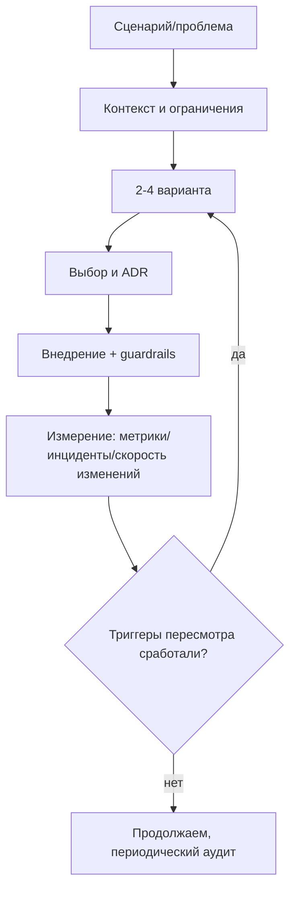

[← Назад к индексу части 35](index.md)

## 35.2 Баланс идеала и реальности

### Цель раздела

Понять, как принимать архитектурные решения, когда мир не идеален: сроки, legacy, ограниченная команда, политические и продуктовые компромиссы.

### В этом разделе главное

- «Идеальной архитектуры» не существует: есть **достаточно хорошая** под текущий контекст и **способность к эволюции**.
- Архитектура ломается не от «плохих паттернов», а от **непризнанных ограничений** и **нефиксированных решений**.
- **ADR** — это не бюрократия, а способ сохранить рациональность решения во времени.
- Лучший подход к legacy — **поэтапное улучшение** (Strangler Fig, canary, флаги), а не big‑bang.

### Термины

| Термин | Коротко |
| --- | --- |
| **Constraints** | Ограничения: сроки, люди, деньги, регуляторика, legacy. |
| **Evolvability** | Способность менять систему по частям без каскада поломок. |
| **Architectural debt** | Долг в архитектуре: решения, которые ускорили сейчас, но сделают дороже потом. |
| **Guardrail** | Ограничитель, который предотвращает деградацию (например, запрет циклов модулей). |

### Теория и правила

#### 1) «Достаточно хорошая» архитектура — это архитектура с траекторией

Идеальная архитектура часто недостижима из‑за ограничений. Но можно сделать другое:

- выбрать вариант, который **решает главные сценарии** и минимизирует риск;
- добавить **guardrails** (контракты, границы, тесты, наблюдаемость);
- определить, **какие признаки** скажут, что пора менять архитектуру (триггеры пересмотра).

Пример триггеров:

- появилось 2+ команд, которые блокируют друг друга;
- стало невозможно релизить без «общего окна»;
- время расследования инцидента выросло, потому что нет трассировки;
- данные стали «общими», и изменения схемы ломают всех.

#### 1.1 Признаки здоровой архитектуры (чек‑лист)

План требует явный пункт: **признаки здоровой архитектуры: понятные границы, документированные решения, возможность менять части без каскадных поломок**.

Это практичный чек‑лист. Если на большинство пунктов у тебя «да» — архитектура, скорее всего, здорова (даже если она не “модная”).

**Границы и ответственность**

- есть явные границы модулей/сервисов/фич (и они совпадают со смыслом домена);
- можно ответить на вопрос «кто владеет этим куском?» (команда/сервис/модуль);
- нет “общих” таблиц/кэшей/конфигов, которые все меняют без координации (или они очень осознанны и защищены).

**Контрактность**

- API/события имеют схему (OpenAPI/GraphQL schema/proto) и версионирование/совместимость;
- есть политика deprecation (как объявляем устаревание и когда удаляем);
- изменения на границе ловятся тестами (контрактные, интеграционные, хотя бы smoke).

**Изменяемость (evolvability)**

- можно менять внутренности модуля/сервиса, не заставляя всех потребителей релизиться синхронно;
- большие изменения делаются поэтапно (feature flags, canary, Strangler).

**Эксплуатация и диагностика**

- есть логи/метрики/трейсы (и корреляция по `trace_id`);
- есть понятные SLO или хотя бы “что считаем хорошим” по задержке/ошибкам;
- инциденты локализуются “в течение минут”, а не “в течение дней”.

**Безопасность**

- границы доверия обозначены (внешний интернет, внутренние сети, сервисы);
- секреты не живут в коде и логах;
- есть базовые защиты (rate limiting, authN/authZ, CSRF/XSS‑политики, аудит).

Если хочется «одну формулу»:

> **Здоровая архитектура — это та, где границы явны, договорённости проверяемы, а изменения не вызывают каскадных поломок.**

#### 2) Когда писать ADR (и когда не писать)

Пиши ADR, когда:

- выбираешь архитектурный стиль (монолит/микросервисы/BFF/SSR‑гибрид);
- вводишь новую технологию, влияющую на границы (broker, federation, service mesh);
- отказываешься от опции, которая «выглядела разумной» (важно объяснить почему).

Не нужно ADR на каждую мелочь (иначе ADR превращается в шум).

#### 2.1 Шаблон ADR, который реально работает (и не превращается в бюрократию)

Чтобы ADR был полезным, его нужно писать так, чтобы через 6–12 месяцев человек мог:

- восстановить **контекст** (почему вообще обсуждали),
- понять **почему** выбрали именно так,
- увидеть **последствия** (включая долги),
- увидеть **когда и как пересматривать**.

Мини‑шаблон (копируй как есть):

| Раздел ADR | Вопрос, на который отвечает |
| --- | --- |
| Контекст | Какая проблема/сценарий? Какие ограничения? |
| Цели | Что мы оптимизируем (скорость, безопасность, стоимость, UX)? |
| Варианты | Какие 2–4 варианта рассматривали? |
| Решение | Что выбрали (конкретно) |
| Последствия | Что выиграли / что усложнили / какие долги приняли |
| План эволюции | Если вырастем — что будет следующим шагом |
| Триггеры пересмотра | При каких событиях мы обязаны пересмотреть решение |

#### 2.1.1 Эталонные мини‑ADR (заполненные примеры, копируй как есть)

Ниже — **три “живых” мини‑ADR**. Их смысл: показать уровень конкретики, который делает ADR полезным через год, а не “для галочки”.

##### Мини‑ADR 1. Нужен ли BFF для веб‑клиента

| Раздел | Содержание |
| --- | --- |
| **Контекст** | Есть SPA + набор backend‑сервисов. На один экран 6–12 запросов, мобильная сеть/TTI страдают. После релизов бекенда иногда “ломаются” экраны из‑за изменений ответа. |
| **Цели** | Снизить число запросов “на экран”; стабилизировать контракт для клиента; улучшить диагностику на границе (единый `trace_id`, единые ошибки). |
| **Варианты** | (A) оставить прямые вызовы SPA → backend; (B) “жирный” универсальный REST `/screen/*`; (C) BFF (тонкий) как фасад + агрегация; (D) GraphQL как фасад. |
| **Решение** | Вводим **BFF для web** (начать тонким: агрегация+ошибки+auth политика), с контрактами на уровне “экранных” DTO. |
| **Последствия** | + меньше запросов и проще клиент; + единая политика ошибок/логирования; − новый hop и слой поддержки; − риск “BFF‑монолита” (ограничиваем: без доменных правил внутри BFF). |
| **План эволюции** | Если появится мобильный с иным профилем → выделить BFF‑mobile или расширить фасад per‑client. Если BFF раздувается → выделить контракты и “экранные” use cases, пересмотреть границы. |
| **Триггеры пересмотра** | (1) 2+ команды, конфликтующие за BFF; (2) p95 latency растёт из‑за BFF; (3) увеличилась доля деградаций/инцидентов на границе; (4) появилось 2+ независимых клиента с разными контрактами. |

##### Мини‑ADR 2. Выбор API‑подхода для публичного API: REST vs GraphQL vs gRPC

| Раздел | Содержание |
| --- | --- |
| **Контекст** | Нужен публичный API для интеграторов (партнёры). Клиенты разноязычные. Требования: простая документация, обратная совместимость, понятные ошибки, наблюдаемость. |
| **Цели** | Минимизировать трение интеграции (curl/Postman/SDK); обеспечить стабильную эволюцию без “ломаем и просим переписать”; иметь понятный мониторинг по операциям. |
| **Варианты** | (A) REST + OpenAPI; (B) GraphQL; (C) gRPC; (D) REST+внутренний gRPC (гибрид). |
| **Решение** | Для **публичного** API выбираем **REST + OpenAPI**; для **внутренних** вызовов между сервисами допускаем gRPC по необходимости. |
| **Последствия** | + интеграторам проще (HTTP экосистема); + кеш/лимиты/observability проще; − часть over/under‑fetching решаем на фасаде (BFF) или отдельными эндпоинтами; − нужно дисциплинированное versioning/deprecation. |
| **План эволюции** | Если появится много UI‑клиентов с разными графами данных → рассмотреть GraphQL **как BFF‑слой**, а не вместо публичного REST. |
| **Триггеры пересмотра** | (1) у интеграторов постоянно запрос “мне нужно по 10 полей из 5 ресурсов” и рост количества endpoint’ов; (2) стоимость поддержки версий REST стала выше выигрыша; (3) появился единый клиентский стек и контролируемый контракт (внутренний продукт). |

##### Мини‑ADR 3. Микросервисы сейчас или модульный монолит

| Раздел | Содержание |
| --- | --- |
| **Контекст** | 1–2 команды. Монолит релизится раз в 1–2 дня. Основная боль: путаница доменов, страх изменений, регрессии из‑за скрытых зависимостей. Нет on‑call/SLO, наблюдаемость базовая. |
| **Цели** | Ускорить безопасные изменения; снизить связанность; подготовить путь к сервисам без big‑bang. |
| **Варианты** | (A) сразу резать на микросервисы; (B) модульный монолит + правила зависимостей; (C) выделить 1 сервис по боли (strangler) параллельно с модульностью. |
| **Решение** | Выбираем **модульный монолит** как ближайшую цель + 1 “пилотный” вынос домена по Strangler только после стабилизации границ и контрактов. |
| **Последствия** | + получаем “львиную долю” пользы без сетевой цены; + уменьшаем риск distributed monolith; − не покупаем независимые релизы “сразу”; − нужна дисциплина границ/арх‑тестов. |
| **План эволюции** | Когда появится 3+ команды и независимый релиз станет критичен → вынос 1–2 доменов (payments/reco) в сервисы с database ownership и CDC/контрактами. |
| **Триггеры пересмотра** | (1) 2+ команды конфликтуют за релизы; (2) один домен стал “горячим” по нагрузке/изменениям; (3) появилась зрелая эксплуатация (31) и деплой‑платформа (20). |

#### 2.2 Визуальная схема: жизненный цикл решения (как ADR “живет”)



Смысл: архитектура — не “решили и забыли”, а **цикл**: решение → внедрение → измерение → пересмотр.

#### 3) Как работать с ограничениями (pragmatic architecture)

Типовой набор приёмов:

- **Сроки**: делай «вертикальный срез» (end‑to‑end), а не идеальные слои; потом укрепляй границы.
- **Legacy**: оборачивай и «души лианой» (Strangler Fig), не переписывай всё.
- **Нехватка навыков**: выбирай архитектуру, которую команда может поддерживать 24/7.
- **Сложные требования**: разрежь на итерации и зафиксируй «точки невозврата» (например, модель данных).

#### 3.1 Визуальная схема: как ограничения превращаются в компромиссы

Иногда текстом сложно “увидеть” компромисс. Вот простая мыслительная схема:

```
Сроки/люди/legacy
      |
      v
  Ограничивают варианты
      |
      v
Выбираем "достаточно хорошо"
      |
      +--> Guardrails (контракты, тесты, наблюдаемость)
      |
      +--> План эволюции (что улучшим потом и когда)
```

---

### Пошагово: как принять решение под реальность и не проиграть будущему

1) Назови ограничение вслух и запиши: «у нас 3 месяца и 3 разработчика».  
2) Выдели 1–2 риска, которые нельзя допустить (например, утечка данных, невозможность релиза).  
3) Выбери архитектуру, минимизирующую эти риски, даже если она не «самая красивая».  
4) Добавь guardrails:
   - контракты и версионирование,
   - наблюдаемость на границе,
   - запреты на циклы/смешение слоёв,
   - минимальный набор тестов на границах.
5) Запиши ADR и дату пересмотра (например, «пересмотреть через 3 месяца или при росте команды до 2 команд»).

---

### Простыми словами

Архитектура — это как план города. Нельзя построить идеальный город сразу: сначала люди хотят жильё и дороги, потом — метро, потом — развязки, потом — новые районы.  
Если пытаться построить «сразу метро на 10 линий», можно не построить даже дорогу.  
Но если строить дороги без плана и правил — получится хаос, который потом почти не переделать.

Зрелость — это уметь:

- строить **минимально жизнеспособную структуру** сейчас,
- и не мешать себе построить «метро» потом.

---

### Картинка в голове

**Идеал** — это как «хочу дом мечты сразу».  
**Реальность** — это «сейчас есть деньги на фундамент и первый этаж».  
Правильная архитектура — это когда фундамент выдержит второй этаж позже, а не когда ты рисуешь дворец на бумаге.

---

### Как запомнить

Три правила:

1) **Записывай решения** (ADR) — иначе команда забудет причины и повторит спор.  
2) **Строй guardrails** — иначе система деградирует.  
3) **Проектируй эволюцию** — иначе любое изменение станет переписыванием.

---

### Примеры

#### Пример: «надо быстрее в прод, но не хотим грязь»

Решение:

- делаем вертикальный срез: UI → API → БД;
- держим минимум правил:
  - слой домена не зависит от инфраструктуры,
  - внешние интеграции через адаптеры,
  - контракты API фиксируем в OpenAPI/Schema.

Это не «идеальная Clean Architecture», но уже достаточно, чтобы через 2–3 месяца не утонуть.

---

### Практика

1) Возьми одно решение из своего проекта («почему выбрали X») и попробуй оформить ADR на 1 страницу.  
2) Определи 2 guardrail’а, которые помогут не деградировать (например, «запрет циклов модулей» и «контрактные тесты для API»).  
3) Запиши 2 триггера пересмотра архитектуры.

---

### Типичные ошибки

- **«Перепишем всё с нуля»** вместо поэтапной эволюции.
- **«ADR — бюрократия»** → через полгода никто не помнит, почему так сделали, и спор начинается заново.
- **«Сначала сделаем красиво, потом запустим»** → продукт не выходит, контекст успевает измениться.
- **«Потом добавим наблюдаемость»** → в распределённой системе «потом» превращается в постоянный пожар.

---

### Что будет, если…

- **…не фиксировать решения?**  
  Ты потеряешь «память команды». Новые люди будут ломать систему, не понимая, зачем были ограничения.

- **…не иметь guardrails?**  
  Любая архитектура (даже микросервисы) деградирует в антипаттерн: общий кэш, общая БД, скрытые зависимости.

---

### Проверь себя

1. Назови 3 ситуации, когда ADR *точно* стоит написать.  
2. Что такое guardrail и приведёшь 2 примера?  
3. Почему «идеальная архитектура» может быть вредна на ранней стадии продукта?

<details><summary>Ответ</summary>

1. Выбор стиля/границ (монолит↔микросервисы, BFF, микрофронты), ввод/замена инфраструктурного компонента (broker, federation), отказ от заметной альтернативы (почему не выбрали GraphQL, например).  
2. Guardrail — ограничитель, предотвращающий деградацию. Примеры: (а) правило зависимостей слоёв, (б) запрет циклов модулей, (в) контрактные тесты, (г) обязательные таймауты и retry‑политики на границах.  
3. Потому что «идеал» обычно увеличивает время выхода и усложняет систему раньше, чем это нужно. Ты платишь сложностью до того, как получишь ценность.

</details>

---

### Запомните

**Зрелая архитектура — это не “идеальная схема”, а способность принимать решения под ограничения и эволюционировать без катастроф.**

---
