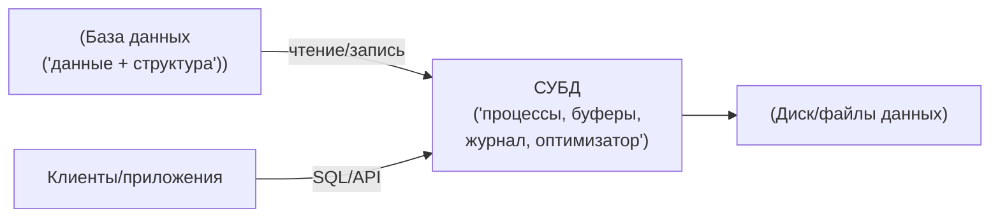
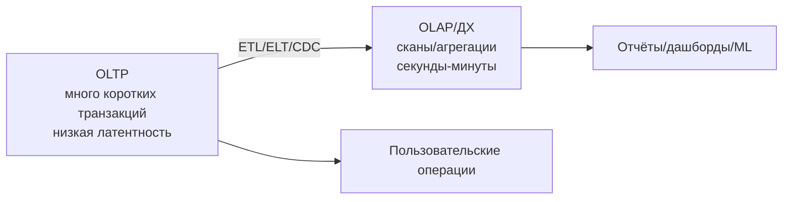
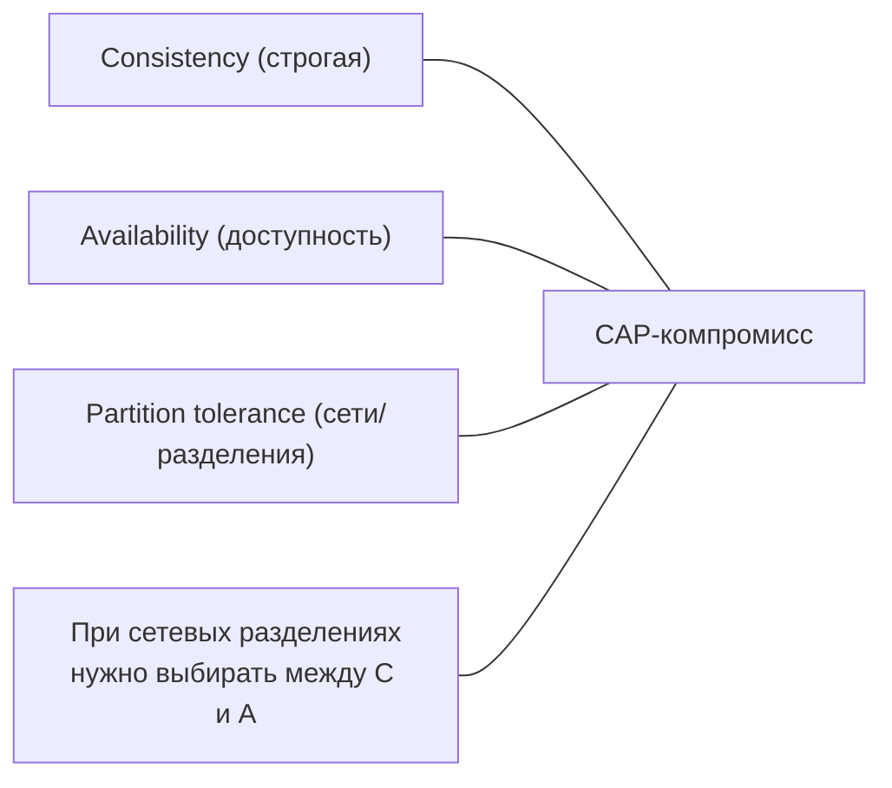
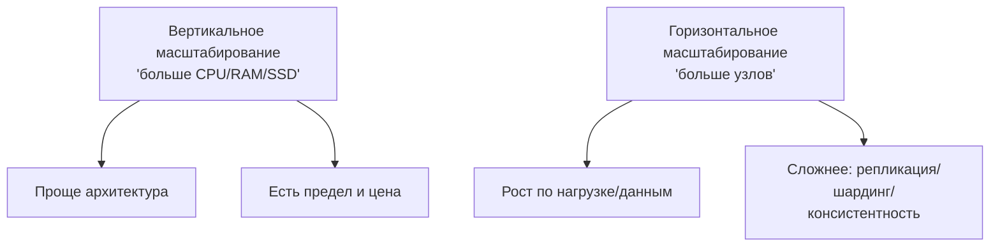

[← Назад к индексу части 0](index.md)

## 0.1. Что такое база данных на самом деле

#### 0.1.1. База данных и СУБД: различия и роли

**База данных (БД)** — это:

- **упорядоченное хранилище данных**;
- с **чётко определённой структурой хранения** (явной или неявной);
- с возможностью **надёжного добавления, изменения, удаления и поиска** данных;
- с целью **персистентного** (долговременного) хранения.

Важно различать:

- **База данных** — сами данные и логическая структура (таблицы, коллекции, индексы, файлы, сегменты и т.д.).
- **СУБД (Система Управления Базой Данных)** — программное обеспечение, которое:
  - управляет размещением данных на диске и в памяти;
  - обеспечивает параллельный доступ множества клиентов;
  - следит за целостностью и согласованностью;
  - выполняет запросы и оптимизирует их;
  - обеспечивает безопасность и контроль доступа;
  - занимается резервным копированием, восстановлением, репликацией и т.д.

Упрощённая аналогия:

- **База данных** — это «архив с папками и документами».
- **СУБД** — это «архивариус + система учёта + правила, по которым документы кладут и достают».

**Простыми словами**

- Представь, что у тебя дома есть **шкаф с папками**:
  - сами папки и бумаги в них — это **база данных**;
  - ты, со своими правилами «как всё раскладывать», — это **СУБД**.
- Если **шкаф сгорел** — пропали **данные**.
- Если **ты уехал в отпуск**, но шкаф цел — данные лежат, но **некому** их доставать и класть новые — «СУБД недоступна».

**Почему это важно**

- Когда мы говорим «перенесём БД», иногда речь о:
  - переносе **самих данных**;
  - а иногда — о **смене СУБД** (например, с MySQL на PostgreSQL).
- Если не разделять эти понятия, легко запутаться:
  - «мы мигрировали базу данных» может значить «поменяли СУБД, схему, формат хранения», а **данные** при этом логически остались теми же (те же заказы, пользователи).

Формально:

- PostgreSQL, MySQL, MongoDB, Redis — это **СУБД**.
- Конкретная `database`, `schema`, `коллекция` или `cluster` с данными — это **конкретная база данных**, которой СУБД управляет.

**Мини‑проверка для себя**

Попробуй вслух объяснить:

- чем отличается **PostgreSQL как программа** от **конкретной базы `shop_prod` внутри PostgreSQL**;
- что именно ты теряешь, если:
  - сломался установленный PostgreSQL, но диск с файлами БД цел;
  - наоборот, файлы с данными уничтожены, но сам PostgreSQL жив.

**Вопросы для самопроверки (0.1.1)**

1. Как ты своими словами отличишь **БД** и **СУБД** на бытовом примере со шкафом и архивариусом?  
   

Ответ

   База данных — это сами папки и документы в шкафу, а СУБД — это «архивариус с правилами», который решает, как складывать, как искать и как выдавать эти документы.
   

2. Что произойдёт в системе, если «архивариус» (СУБД) сломался, но сами файлы БД на диске целы? И наоборот — если программа жива, но файлы данных уничтожены?  
   

Ответ

   Если СУБД сломалась, но файлы целы — данные физически есть, но к ним нельзя нормально обратиться, пока не починишь или не переустановишь СУБД. Если же файлы БД потеряны, но СУБД жива — программа есть, но содержимое безвозвратно потеряно (если нет бэкапов).
   

3. Когда ты говоришь «мы перенесли базу данных», что именно разумнее уточнять — **данные**, **СУБД** или и то, и другое? Почему важно не путать эти понятия?  
   

Ответ

   Лучше явно разделять: «перенесли данные» (миграция содержимого) и «поменяли СУБД» (MySQL → PostgreSQL и т.п.). Иначе можно думать, что речь идёт о простом переносе, а на самом деле меняется целая система управления, формат хранения и поведение, что критично для архитектуры и миграций.
   

#### 0.1.2. Данные vs информация

Очень важное различие:

- **Данные** — это **сырые факты**, записанные в какой‑то форме.
  - Примеры: строка лога, строка таблицы `orders`, JSON‑документ о пользователе, точка измерения температуры.
- **Информация** — это **данные, которым мы придали смысл в контексте**.
  - Примеры: «за сегодня выручка 1 200 000 ₽», «95‑й перцентиль времени ответа — 350 мс», «конверсия выросла на 7%».

**Пример из жизни**

- Есть таблица `orders`:
  - каждая строка — один заказ, поля: сумма, клиент, дата и т.п.
  - это **данные**.
- Ты пишешь запрос:
  - «посчитать общую выручку за вчера по всем заказам»;
  - это уже превращение данных в **информацию** для бизнеса: «сколько мы заработали».
- Если менеджер смотрит на график выручки за месяц и думает «мы просели в выходные, надо акцию» — это уже **решение на основе информации**, но всё начинается с сырых строк в БД.

**Простыми словами**

- Данные без контекста — как куча чеков в пакете.
- Информация — это когда ты:
  - разложил чеки по дням;
  - посчитал итоги;
  - понял, где тратишь больше всего.

Ключевые моменты:

- **БД хранит данные, а не информацию.**
- **Информация появляется на уровне приложения, аналитики, отчётов, моделей.**
- Хорошая модель данных и правильно выбранная СУБД **упрощают превращение данных в информацию**, но сами по себе этого не делают.

Практическое следствие:

- Если в системе сложно получить нужные отчёты и метрики — это **не обязательно «плохой SQL»**, часто проблема глубже:
  - не та модель данных;
  - не тот тип БД;
  - не продуманы ключи, связи и хранимая детализация;
  - отсутствует разделение OLTP/OLAP (см. ниже).

**Вопросы для самопроверки (0.1.2)**

1. Приведи свой пример **данных** и пример **информации**, полученной из этих данных.  
   

Ответ

   Например, данные — это сырые записи о посещениях сайта: время, пользователь, страница. Информация — это вывод «за последнюю неделю 30% пользователей чаще всего заходили на страницу X, а конверсия в покупку с неё — 5%».
   

2. Почему нельзя требовать от БД «давать нам информацию», а нужно думать о приложении и аналитике?  
   

Ответ

   Потому что БД хранит только факты — строки и столбцы. Смысл им придаёт логика приложения, аналитические запросы, отчёты и модели. БД может помочь (правильная схема, индексы), но не знает бизнес‑контекста сама по себе.
   

3. Если отчёт «плохо считается» или его сложно написать, какие глубинные причины, кроме «плохого SQL», стоит проверить в первую очередь?  
   

Ответ

   Надо посмотреть: правильно ли спроектирована модель данных, подходит ли выбранный тип БД под задачу (OLTP vs OLAP), достаточно ли информации хранится (нет ли потерь детализации), и разделены ли транзакционная и аналитическая нагрузки.
   

#### 0.1.3. Персистентность: данные переживают процесс

**Персистентность** — это свойство системы **сохранять данные даже после завершения работы процесса или перезагрузки машины**.

- Персистентно:
  - запись на диск, в журнал транзакций, в реплику;
  - файл, который не исчезает при завершении программы;
  - строка в таблице PostgreSQL.
- Неперсистентно:
  - переменная в памяти процесса;
  - структура данных внутри приложения;
  - кэш, который можно в любой момент сбросить, не нарушив инварианты данных.

**Простыми словами**

- Представь, что ты ведёшь учёт расходов:
  - если ты просто **держишь суммы в голове** или в переменной в коде — это **неперсистентно**, достаточно вырубить свет или процесс, и всё забудется;
  - если ты **записал в тетрадь** или в файл на диск — это уже **персистентно**, запись переживёт перезапуск программы или компьютера (если диск жив).

**База данных — это всегда про персистентность.**

Отсюда важное различие:

- **БД** — «источник истины» (system of record).
- **Кэш** — «ускоритель», который:
  - можно перестроить из БД;
  - не обязан хранить полные данные;
  - может временно содержать неактуальные данные;
  - по определению **не является источником истины**.

Пример:

- PostgreSQL — основное хранилище заказов.
- Redis — кэш самых популярных товаров.
- Если Redis умрёт — система должна уметь восстановиться, прогрев кэш из PostgreSQL. Если погибнет PostgreSQL без бэкапа — бизнес может погибнуть.

**Очень приземлённая аналогия**

- БД — это **нотариально заверенный договор**.
- Кэш — это **быстрая шпаргалка на бумажке**, которую ты держишь под рукой, чтобы не лезть каждый раз к договору.
- Если сгорела шпаргалка — неприятно, но ты перепишешь её с договора.
- Если потерян оригинал договора — всё, можно судиться и доказывать, что там было.

**Вопросы для самопроверки (0.1.3)**

1. Приведи пример **персистентных** и **неперсистентных** данных из своего опыта (или воображаемого проекта).  
   

Ответ

   Персистентные: записи в таблице заказов в PostgreSQL, файлы на диске с загруженными документами. Неперсистентные: содержимое оперативной памяти процесса, кэш в Redis, который можно сбросить без потери «истины», локальные переменные в коде.
   

2. Почему кэш (Redis, in‑memory структуры) не должен считаться «источником истины»?  
   

Ответ

   Потому что его можно сбросить или потерять без катастрофы для бизнеса: правильная архитектура предполагает, что кэш всегда можно восстановить из настоящего хранилища (БД). Он ускоряет доступ, но не хранит единственную окончательную версию данных.
   

3. Представь, что у тебя в системе пропал кэш, но основная БД цела. Что должны уметь сделать разработчики и система, чтобы это было просто замедлением, а не катастрофой?  
   

Ответ

   Система должна уметь работать при «холодном» кэше: запросы идут в основную БД, кэш постепенно прогревается, нет потери данных. Разработчики должны не завязывать бизнес‑инварианты на кэш (например, не считать баланс счёта только по данным из кэша).
   

#### 0.1.4. Критичность: надёжность, бэкапы, восстановление

Раз БД — это «источник истины», сразу появляются вопросы:

- Что будет, если **сломается диск**?
- Что будет, если **ошибкой кода удалить половину таблицы**?
- Что будет, если **упадёт датацентр**?

Отсюда философия работы с БД:

- **Бдительность к потерям данных**:
  - продуманная стратегия бэкапов (полные, инкрементальные, точка во времени);
  - регулярные тесты восстановления («бэкап считается существующим только после успешного восстановления»);
  - репликация (master/replica, leader/follower).
- **Понимание стоимости простоя и потери данных**:
  - RPO (Recovery Point Objective) — «сколько данных по времени мы согласны потерять»;
  - RTO (Recovery Time Objective) — «как быстро мы обязаны поднять систему».

**Простыми словами**

- Если ты **не можешь спокойно вытереть пот со лба и сказать «ладно, восстановим»**, значит данные **критичны**.
- Для критичных данных **обязательны**:
  - регулярные бэкапы;
  - проверка, что бэкапы реально восстанавливаются;
  - продуманная стратегия работы при сбоях (реплики, фейловер).

На уровне инженера:

- Любое «опасное» изменение схемы или массовый `DELETE` нужно:
  - делать в транзакции, где это возможно;
  - делать с бэкапом и планом отката;
  - по возможности проводить в тестовой среде перед продом.

**Мини‑упражнение**

Возьми любую знакомую тебе систему (даже простую: заметки, трекер задач, интернет‑банк) и ответь:

- Что будет, если за последний день **потерять все данные**?
- Что будет, если система будет **лежать 4 часа**, но данные не потеряются?
- Это интуитивно и есть RPO/RTO, только в инженерных терминах.

**Вопросы для самопроверки (0.1.4)**

1. Чем отличаются RPO и RTO своими словами и почему они важны при проектировании работы с БД?  
   

Ответ

   RPO — это «сколько данных по времени мы готовы потерять» (например, не больше 5 минут транзакций), а RTO — «как быстро система должна быть восстановлена» (например, за 30 минут). Эти параметры задают требования к частоте бэкапов, репликации и процедурам восстановления.
   

2. Почему «делать бэкапы» недостаточно, если вы ни разу не пробовали восстановление?  
   

Ответ

   Потому что бэкапы могут оказаться битые, неполные или несогласованные. Пока вы хотя бы один раз не восстановили систему из них, вы не знаете, работоспособны ли они. Поэтому важны регулярные тесты восстановления, а не только создание бэкапов.
   

3. Какой простой практический шаг должен сделать инженер перед массовым `DELETE` или изменением схемы в проде?  
   

Ответ

   Сделать резервную копию (или убедиться, что свежий бэкап есть), по возможности проиграть операцию на тестовой среде, выполнить действие в транзакции и иметь понятный план отката на случай ошибки.
   

#### 0.1.5. OLTP vs OLAP: разные задачи, разные требования

**OLTP (Online Transaction Processing)** — транзакционная, «операционная» нагрузка:

- множество **коротких запросов**;
- обычные операции:
  - создать заказ;
  - обновить статус;
  - списать деньги;
  - получить профиль пользователя.
- типичные свойства:
  - **малые объёмы данных в одном запросе** (несколько строк);
  - требуются **низкие задержки** (миллисекунды);
  - жесткие требования к согласованности (ACID).

**OLAP (Online Analytical Processing)** — аналитическая нагрузка:

- **отчёты, дашборды, аналитика**;
- операции:
  - посчитать выручку за год по регионам;
  - построить распределение заказов;
  - посчитать retention, когорты;
  - строить фичи для моделей ML.
- типичные свойства:
  - **чтение большого объёма данных** (миллионы/миллиарды строк);
  - допускаются **большие задержки** (секунды, иногда минуты);
  - допустима устарелость данных на часы/дни;
  - чаще важнее скорость сканирования и агрегаций, чем строгие транзакции.

**Простая бытовая аналогия**

- **OLTP** — это **касса в магазине**:
  - каждый покупатель — отдельная маленькая транзакция;
  - кассир должен **быстро** пробить чек и не ошибиться;
  - операций много, но каждая — маленькая.
- **OLAP** — это **отдел аналитики в головном офисе**:
  - раз в день/неделю собирают данные **по всем магазинам**;
  - считают, какие товары продаются, какая маржа, какие акции сработали;
  - могут крутить отчёты несколько минут — это нормально, главное **точность картины и глубина анализа**.

**Типичная ошибка новичков**

- «У нас уже есть PostgreSQL, давайте на нём считать все отчёты по миллиардам строк».  
Иногда так можно, но часто:

- операционная БД начинает **задыхаться** от тяжёлых аналитических запросов;
- пользователи жалуются на медленные CRUD‑операции;
- в итоге всё равно приходится строить **отдельное хранилище данных**.

Ключевая мысль:

- **Пытаться одной и той же БД одинаково хорошо решать и OLTP, и OLAP — почти всегда ошибка архитектуры.**
- Обычно:
  - одна (или несколько) БД/кластеров обслуживают **OLTP** (PostgreSQL, MySQL, MongoDB и т.д.);
  - данные периодически **выгружаются (ETL/ELT)** в **хранилище данных / аналитическую БД** (ClickHouse, Snowflake, BigQuery и т.д.).

Это влияет на выбор:

- типов индексов;
- формата хранения (строчный vs колоночный);
- нормализации/денормализации;
- частоты обновления данных.

**Вопросы для самопроверки (0.1.5)**

1. Приведи по одному своему примеру задач для OLTP и для OLAP в какой‑нибудь системе (реальной или придуманной).  
   

Ответ

   OLTP: операции «создать заказ», «обновить статус», «списать деньги с баланса» в интернет‑магазине. OLAP: отчёт «выручка по регионам и категориям товаров за год», «какая конверсия по источникам трафика» на основе всех заказов за год.
   

2. Почему тяжёлые аналитические запросы не стоит крутить напрямую на продовой OLTP‑БД, если данных уже много?  
   

Ответ

   Потому что они забивают ресурсы (CPU, диск, память), из‑за чего страдают обычные транзакции: пользователи получают медленные ответы или ошибки. Лучше вынести аналитику в отдельное хранилище (колоночная/аналитическая БД), чтобы разделить нагрузки.
   

3. Если у тебя есть только одна БД и нужно и обслуживать пользователей, и считать отчёты, какие два простых шага стоит рассмотреть в первую очередь?  
   

Ответ

   Во‑первых, максимально оптимизировать запросы и индексы, не допуская «случайных» тяжёлых сканов в пике. Во‑вторых, настроить выгрузку данных (ETL/ELT) в отдельную аналитическую БД или хотя бы реплику, на которой будут крутиться тяжёлые отчёты.
   

#### 0.1.6. Консистентность vs доступность: фундаментальный компромисс

В распределённых системах часто приходится выбирать между:

- **Строгой консистентностью** — все клиенты видят **одни и те же данные в один и тот же момент**.
- **Eventual consistency (сходимостью)** — изменения **распространяются с задержкой**, и какое‑то время разные узлы могут видеть разные версии данных, но **в итоге система сойдётся**.

Интуитивно:

- Строгая консистентность = «лучше ответить медленнее или даже не ответить, чем ответить устаревшими данными».
- Eventual consistency = «лучше ответить быстро и почти всегда, чем вообще не ответить или ждать долго; мирится с временной рассинхронизацией».

**Простой образ**

- Представь, что у тебя есть **несколько копий одной тетради** в разных городах:
  - строгая консистентность — ты **разрешаешь запись только в одну тетрадь**, остальные копии обновляются синхронно; если город с главной тетрадью недоступен — **запись запрещена везде**, чтобы не было расхождений;
  - eventual consistency — ты позволяешь людям **временно писать в локальные тетради**, а потом кто‑то всё **сводит и разруливает конфликты**; у всех тетрадей какое‑то время могут быть **разные версии** записей.

На практике ты как инженер выбираешь:

- где ** обязателен единый «баланс счёта» прямо сейчас**;
- а где допустимо, что «лайк» не отразился у друга мгновенно.

На практике:

- **Транзакционная БД** (PostgreSQL/Oracle в одном датацентре) чаще ориентирована на **строгую консистентность**.
- **Глобально распределённые системы** (Cassandra, Dynamo‑подобные, многие облачные key‑value хранилища) делают ставку на **доступность и устойчивость к отказу части узлов**, допуская временную неконсистентность.

Главное:

- Консистентность vs доступность — не «вкус», а **архитектурный выбор в зависимости от домена**:
  - платёжные системы, баланс счетов, запасы на складе → ближе к строгой консистентности;
  - лайки, просмотры, счётчики, рекомендательные фиды → часто eventual consistency.

**Вопросы для самопроверки (0.1.6)**

1. Приведи по одному примеру задачи, где лучше выбрать строгую консистентность, и задачи, где можно жить с eventual consistency.  
   

Ответ

   Строгая консистентность: банковский перевод, списание денег со счёта, учёт остатков на складе критичного товара. Eventual consistency: количество лайков у поста, число просмотров видео, формирование новостной ленты или рекомендательного фида.
   

2. Почему в глобально распределённых системах (много датацентров, разные регионы) иногда приходится осознанно жертвовать строгой консистентностью ради доступности?  
   

Ответ

   Потому что сети и датацентры могут отваливаться. Если пытаться синхронно согласовать все реплики по всему миру, система либо будет очень медленной, либо часто недоступной. Поэтому для части задач выбирают модель, где важнее, чтобы сервис отвечал, даже если данные временно расходятся и потом «сходятся».
   

3. Как инженер ты должен уметь ответить на вопрос: «Где в моей системе я могу позволить себе eventual consistency, а где нет?» — какие критерии помогут тебе это понять?  
   

Ответ

   Надо смотреть, насколько критична ошибка и временное расхождение: если рассинхрон может привести к потере денег, юридическим проблемам или нарушению инвариантов (баланс, права доступа) — нужна строгая консистентность. Если же временное отличие затрагивает только удобство пользователя (лайки, просмотры, рейтинг) и потом выправится, можно жить с eventual consistency.
   

#### 0.1.7. Масштабирование: вертикальное и горизонтальное

Когда данных и запросов становится много, возникает вопрос **масштабирования**:

- **Вертикальное масштабирование**:
  - «дать серверу больше ресурсов» — больше CPU, RAM, более быстрый диск;
  - проще в настройке;
  - есть физический и экономический предел (железо дорого, нельзя расти бесконечно).
- **Горизонтальное масштабирование**:
  - «добавлять ещё узлы»;
  - требует:
    - **репликации** (копирование данных на несколько узлов);
    - **шардирования** (разделение данных между узлами);
  - усложняет модель консистентности и архитектуру.

**Простая аналогия с кафе**

- Вертикальное масштабирование:
  - у тебя один маленький кафе‑киоск → ты **расширяешь помещение**, ставишь **больше плит**, берёшь **лучшее оборудование**;
  - но рано или поздно упираешься: стена, пожарные нормы, денег нет.
- Горизонтальное масштабирование:
  - ты открываешь **второе, третье, десятое кафе** в других районах;
  - теперь нужно:
    - как‑то **распределять клиентов**;
    - **держать единый учёт денег и продуктов** (аналог консистентности);
    - решать, что делать, если одно кафе закроется.

Грубая стратегия:

1. Сначала **оптимизировать схему и запросы** (индексы, нормализация/денормализация, кэширование).
2. Затем максимально использовать **вертикальное масштабирование** в рамках разумного бюджета.
3. Потом переходить к **горизонтальному масштабированию**, если без него уже нельзя.

Ментальная модель:

- Одна мощная БД (вертикальный рост) → проще модель данных, но дороже и с пределом.
- Кластер из многих узлов (горизонтальный рост) → теоретически «безграничный» рост, но сложнее согласованность, запросы, администрирование.

**Вопросы для самопроверки (0.1.7)**

1. В чём практическая разница между вертикальным и горизонтальным масштабированием на примере одного сервера БД?  
   

Ответ

   Вертикальное масштабирование — это «усилить» существующий сервер: добавить CPU, RAM, ускорить диск. Горизонтальное — добавить ещё серверы и распределить между ними данные и нагрузку. Первое проще, но имеет предел; второе сложнее в реализации (репликация, шардинг, согласованность).
   

2. Почему не стоит сразу начинать с горизонтального масштабирования, если у тебя ещё нет проблем с производительностью на одном узле?  
   

Ответ

   Потому что распределённая система на порядок сложнее: больше мест для ошибок, сложнее отлаживать, поддерживать консистентность, обновлять схему. Часто разумнее сначала оптимизировать схему/запросы и выжать максимум из одного сервера, а уже потом усложнять архитектуру, когда это действительно нужно.
   

3. Назови по одному типу изменений, которые относятся к «оптимизировать схему и запросы» и к «перейти к горизонтальному масштабированию».  
   

Ответ

   Оптимизация схемы/запросов: добавить нужные индексы, переписать тяжёлый запрос, убрать лишние JOIN/подзапросы, денормализовать горячие части. Горизонтальное масштабирование: ввести шардинг по ключу (например, по пользователю), добавить реплики для чтения, распределить данные по нескольким нодам.
   

---

---

<!-- prev-next-nav -->
*[← Часть 0. Философия, границы и ментальные модели...](00_vvedenie_marshrut_i_oglavlenie.md) | [→ 0.2. Классификация баз данных: карта местности](02_0_2_klassifikatsiya_baz_dannyh_karta_mestnost.md)*
