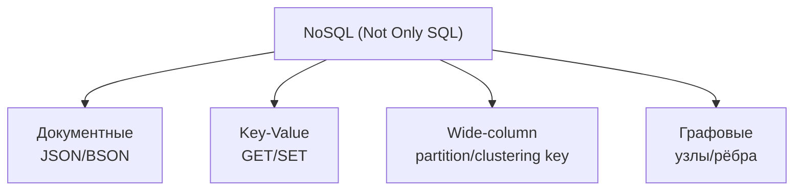
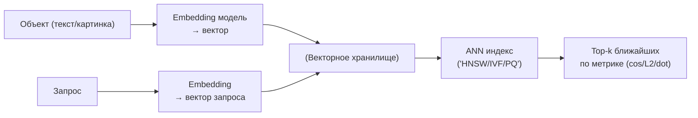
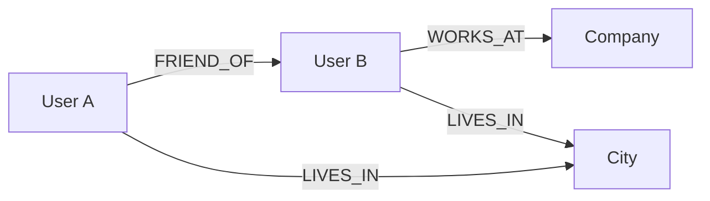
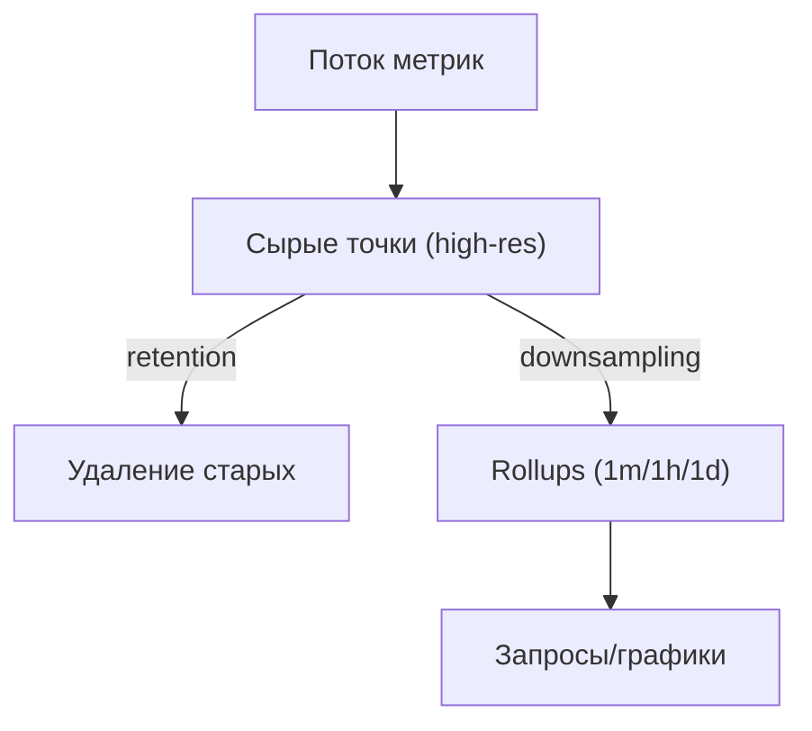
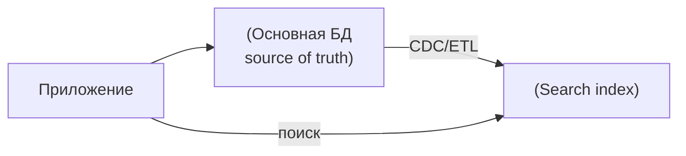
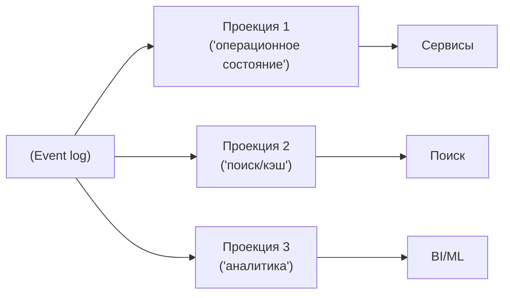

[← Назад к индексу части 0](index.md)

## 0.2. Классификация баз данных: карта местности

Вместо запоминания десятков названий СУБД полезно держать в голове **карту типов**: какие бывают модели хранения и под какие задачи они рождены.

#### 0.2.1. Реляционные БД (SQL)

**Модель:** данные хранятся в **таблицах** (отношениях), каждая строка — кортеж, столбцы — атрибуты, есть **схема** (описание структуры).

Типичные представители:

- PostgreSQL, MySQL/MariaDB, Oracle, SQL Server.

Ключевые свойства:

- **ACID‑транзакции** (Atomicity, Consistency, Isolation, Durability).
- **Строгая схема**: типы данных, ограничения, ключи.
- Мощный язык запросов **SQL**.
- Хорошо подходят под **OLTP** и **структурированные бизнес‑данные**:
  - заказы, пользователи, платежи, каталоги, договора, учётные системы.

Плюсы:

- Сильные гарантии целостности данных.
- Очень развитая теория (реляционная модель), много проверенных паттернов.
- Богатая экосистема инструментов (ORM, BI, ETL, драйверы).

Минусы:

- Сложнее масштабировать горизонтально (хотя есть решения — шардинг, NewSQL).
- Жёсткая схема может быть неудобна для сверхдинамичных структур документов (но есть JSON‑типы и гибридные подходы).

Ментальная модель:

- Представь **Excel‑таблицы**, но с:
  - строгим контролем типов;
  - связями между таблицами;
  - мощным языком запросов и транзакциями.

**Простыми словами**

- Реляционная БД — это как **очень умный Excel**, который:
  - не даёт тебе случайно положить строку «банан» в столбец «сумма»;
  - следит, чтобы в таблице заказов не появлялись ссылки на **несуществующих** пользователей;
  - умеет мгновенно находить нужные строки по индексам.
- Здесь всё жёстко:
  - заранее описывается, какие есть таблицы и столбцы;
  - если структура неправильная, БД может не дать сохранить данные.

**Пример**

- Интернет‑банк:
  - таблица `accounts` — счета клиентов;
  - таблица `transactions` — операции по счётам;
  - БД не даст тебе провести транзакцию по счёту, которого нет (FK), и не даст сделать баланс отрицательным, если ты так настроишь ограничения.

**Мини‑упражнение**

Представь свой личный учёт денег:

- если бы ты делал его в тетрадке, где **каждую строку можно писать как угодно**, это был бы бардак;
- реляционная БД заставила бы тебя:
  - сделать отдельные таблицы: «счета», «операции», «категории»;
  - всегда указывать счёт и категорию из списка.

**Вопросы для самопроверки (0.2.1)**

1. Почему реляционная БД хорошо подходит для финансовых операций (счета, транзакции), а «свободная» структура данных здесь опасна?  
   

Ответ

   Потому что в финансах критична целостность и однозначность записей: нужны строгие типы, ограничения, связи между таблицами. Свободная структура (как «тетрадка без правил») увеличивает риск ошибок, дублирования и противоречий, которые трудно обнаружить и исправить.
   

2. Как тебе помогает в понимании реляционной модели аналогия с «очень умным Excel»? Что в этой аналогии главное?  
   

Ответ

   Главное, что это таблицы со строгими правилами: каждый столбец имеет тип, есть связи между листами (FK), есть формулы/запросы, которые позволяют гибко комбинировать данные. Это помогает представить реляционную БД как знакомую таблицу, но с гораздо более жёстким контролем и мощными операциями.
   

3. Придумай пример, когда жёсткая схема реляционной БД может мешать (но всё равно иметь смысл) — в чём тут компромисс?  
   

Ответ

   Например, если структура данных часто меняется (разные типы анкет пользователей с разными наборами полей), приходится либо часто мигрировать схему, либо городить много nullable‑полей. Компромисс: ты получаешь контроль целостности и удобные запросы, но платишь сложностью эволюции схемы.
   

#### 0.2.2. NoSQL — «зонтик» для нереляционных моделей

Термин **NoSQL** означает не «против SQL», а чаще «**Not Only SQL**»: это **класс хранилищ, не следующих строго реляционной модели**.

Внутри этого зонтика:

- **Документные БД** (MongoDB, Couchbase):
  - единица хранения — **документ** (обычно JSON/BSON);
  - внутри документа могут быть вложенные структуры, массивы;
  - схема может быть гибкой («schema‑on‑read»);
  - удобно хранить агрегаты доменной модели, которые часто читаются целиком (профиль пользователя, заказ со всеми позициями).
- **Ключ–значение** (Redis, DynamoDB, Riak):
  - базовая операция: `GET key`, `SET key value`;
  - очень простая модель, высокая производительность;
  - иногда поддерживаются более сложные структуры (списки, хеши, множества).
- **Широкостолбцовые** (Cassandra, HBase, ScyllaDB):
  - данные организованы в строки, но у каждой строки может быть **очень разный набор столбцов**;
  - есть понятия **partition key** и **clustering key**, сильно влияющие на физическое распределение данных;
  - проектирование начинается **с шаблонов запросов**, а не со списка сущностей.
- **Графовые** (Neo4j, JanusGraph, Amazon Neptune) — о них отдельно ниже.

Общее:

- Обычно более гибкие по схеме.
- Часто ориентированы на **горизонтальное масштабирование и высокую доступность**.
- Чаще делают **осознанный компромисс по консистентности** (eventual consistency).

**Простыми словами**

- NoSQL — это как сказать: «давайте **не только таблицы**»:
  - иногда удобнее хранить **целый документ целиком**;
  - иногда нужна просто «большая распределённая мапа `ключ → значение`»;
  - иногда нужны специальные структуры под конкретные нагрузки.
- Это не значит «SQL плохой», это значит «в дополнение к SQL есть другие формы хранения».

**Бытовой пример**

- Если реляционная БД — это **аккуратный шкаф с папками и разделителями**,
- то NoSQL‑подходы — это:
  - **большая коробка с файлами**, где каждый файл — целый документ (`MongoDB`);
  - **гигантский телефонный справочник** `номер → имя` (`key‑value`);
  - **полка с папками, у которых внутри разный набор разделителей** (`wide‑column`).

**Когда думать о NoSQL**

- когда структура данных **часто меняется**;
- когда важнее **горизонтальное масштабирование и доступность**, чем строгая схема и жёсткие транзакции;
- когда ты заранее знаешь **конкретные шаблоны запросов** и можешь под них спроектировать хранилище.

**Вопросы для самопроверки (0.2.2)**

1. Приведи пример задачи, где документная БД будет удобнее реляционной, и объясни почему.  
   

Ответ

   Например, хранение профилей пользователей с очень разными наборами полей (социальные сети, сложные анкеты), где структура часто меняется. В документной БД один документ может содержать всю информацию о пользователе, и не нужно постоянно мигрировать схему таблиц.
   

2. Почему нельзя говорить просто «NoSQL лучше SQL» или наоборот, не уточнив контекст задачи?  
   

Ответ

   Потому что это разные модели с разными сильными сторонами: реляционные БД сильны в транзакциях и целостности, NoSQL — в гибкости схемы и масштабировании под определённые паттерны доступа. Без контекста «лучше/хуже» ничего не значит — важно, под какую нагрузку и модель данных выбирается хранилище.
   

3. Что общего у всех подтипов NoSQL (документные, key‑value, wide‑column, графовые) с точки зрения философии дизайна?  
   

Ответ

   Они отходят от строгой реляционной схемы ради удобства под конкретные паттерны использования: дают более гибкую структуру, позволяют легче масштабироваться горизонтально и часто жертвуют частью универсальности или консистентности ради производительности и доступности.
   

#### 0.2.3. Векторные БД

**Задача:** хранение и поиск **векторов признаков (эмбеддингов)** — больших числовых массивов, которые получаются, например, из нейросетей.

Примеры:

- отдельные СУБД: Pinecone, Weaviate, Qdrant;
- расширения к существующим: `pgvector` для PostgreSQL, векторные индексы в Elasticsearch, OpenSearch.

Ключевые идеи:

- Каждый объект (документ, картинка, пользователь) представлен **вектором** \(например, размерностью 256, 768, 1536\).
- Запрос «найти похожее» превращается в:
  - вычисление вектора для запроса;
  - поиск ближайших векторов по:
    - L2‑расстоянию;
    - косинусному расстоянию;
    - dot‑product и т.д.
- Обычные индексы по равенству/диапазону здесь бесполезны, нужны специальные структуры:
  - HNSW, IVF, PQ и другие ANN (Approximate Nearest Neighbors) структуры.

Применения:

- RAG (Retrieval‑Augmented Generation).
- Поиск похожих товаров/фильмов/пользователей.
- Дедупликация и кластеризация контента.

**Вопросы для самопроверки (0.2.3)**

1. В чём принципиальная разница между «поиском по равенству» (id, email) и «поиском по похожести» во векторной БД?  
   

Ответ

   Поиск по равенству отвечает на вопрос «найди объект с точным значением поля», а поиск по похожести — «найди объекты, которые находятся близко к заданному вектору в пространстве признаков», то есть не точно совпадают, а максимально похожи по смыслу или характеристикам.
   

2. Придумай пример задачи из реальной жизни, где поиск по похожести естественен, а обычный индекс по полю мало помогает.  
   

Ответ

   Например, рекомендация похожих товаров («похожий ноутбук/фильм/трек»), поиск изображений по образцу, подбор документов, похожих по смыслу на заданный текст. Здесь «id» или точная строка мало что дают, важна близость по скрытым признакам.
   

3. Почему векторные БД часто используют приблизительные алгоритмы поиска ближайших соседей (ANN), а не точный перебор по всем векторам?  
   

Ответ

   Потому что вектора обычно высокой размерности и их очень много, точный перебор по всем векторам слишком дорог по времени. ANN‑структуры (HNSW, IVF и т.п.) позволяют находить «почти лучшие» результаты значительно быстрее, что важно для практических систем.
   

**Простыми словами**

- Векторная БД — это как **огромный «пространственный» справочник**, который умеет отвечать на вопрос:
  - «что **похоже** на это?»
- Вместо чёткого равенства (`id = 123`) здесь важна **степень похожести**:
  - «этот товар похож на тот на 0.92»;
  - «этот текст похож на тот на 0.85».

**Бытовой пример**

- Представь, что у тебя есть:
  - плейлист с музыкой;
  - рекомендация «похожие треки».
- Где‑то внутри системы:
  - каждая песня преобразуется в **набор чисел** (вектор);
  - векторная БД хранит эти векторы и ищет ближайшие.

#### 0.2.4. Графовые БД

**Модель:** всё строится вокруг:

- **вершин (узлов)** — сущности: пользователь, компания, город;
- **рёбер** — связи между сущностями:
  - «подписан на», «состоит в», «работает в», «жил в».

Примеры:

- Neo4j, JanusGraph, Amazon Neptune, ArangoDB (как часть многомодельности).

Сила графовых БД:

- Хранение **богатых, глубоких сетей связей**.
- Очень быстрые и удобные запросы вида:
  - «друзья друзей»;
  - «рекомендовать компании людей, похожих на этого пользователя»;
  - «найти кратчайший путь между двумя сущностями»;
  - «поиск циклов, кластеров, сообществ».

Где полезно:

- Социальные сети, профессиональные графы.
- Графы знаний, онтологии.
- Модели прав доступа.
- Роутинг, дорожные сети.

В реляционной БД такие запросы часто означают кучу `JOIN`‑ов и рекурсивных CTE, а в графовой — это естественные операции обхода (`MATCH (a)-[:FRIEND_OF*2..3]->(b)` и т.п.).

**Вопросы для самопроверки (0.2.4)**

1. Какой тип задач особенно естественно моделировать в графовой БД, а в реляционной даётся тяжело? Приведи пример.  
   

Ответ

   Задачи с глубокими и гибкими связями, например социальные графы (друзья/подписки), графы знаний (сущности и отношения между ними), маршрутизация по дорогам или сетям. В реляционной БД это превращается в сложные JOIN‑ы и рекурсивные запросы, в графовой — в естественный обход графа.
   

2. Почему в описании графовой БД акцент смещается с «какие сущности» на «как они связаны»?  
   

Ответ

   Потому что во многих задачах важнее не сами объекты по отдельности, а структура их связей: кто с кем связан, через сколько шагов, по каким типам отношений. Графовая БД оптимизирована именно под хранение и обход связей как «первоклассных граждан».
   

3. Как ты объяснишь другу‑разработчику разницу между «табличным» и «графовым» взглядом на интернет‑магазин?  
   

Ответ

   Табличный взгляд: таблицы `users`, `orders`, `order_items`, `products` и связи FK — фокус на сущностях и их атрибутах. Графовый взгляд: вершины «пользователь», «товар», «категория», «бренд» и рёбра «покупал», «просматривал», «принадлежит к категории» — фокус на путях и рекомендациях по этому графу.
   

**Простыми словами**

- Графовая БД — это как **большая карта со стрелочками**:
  - кружочки — объекты (люди, города, компании);
  - стрелочки — связи между ними.
- Главное здесь — **не сами кружочки, а то, как они связаны**:
  - «кто чей друг»;
  - «кто где работает»;
  - «какой город соединён какой дорогой».

**Пример**

- Социальная сеть:
  - вершины — пользователи;
  - рёбра — «друзья», «подписан на», «заблокировал».
- Запрос: «показать друзей друзей, которых я ещё не добавил»:
  - в графовой БД — естественный обход;
  - в реляционной — куча JOIN‑ов, часто значительно сложнее мыслить.

#### 0.2.5. БД временных рядов

**Модель:** данные — это **точки измерений во времени**:

- метрики (CPU, память, количество запросов);
- финансовые котировки;
- телеметрия IoT‑устройств;
- лог событий.

Примеры:

- InfluxDB, TimescaleDB (расширение PostgreSQL), QuestDB, VictoriaMetrics.

Особенности:

- Оптимизированы под:
  - **быструю запись** большого потока точек;
  - хранение **огромных объёмов** с сжатием;
  - **агрегации по времени** (GROUP BY time_bucket, rollups).
- Есть встроенные концепции:
  - retention‑политик (как долго хранить сырые данные);
  - downsampling (автоматическая агрегация старых данных).

**Простыми словами**

- Это БД, которые «заточены» под фразу:
  - «каждую секунду/минуту мы меряем X, и нам это потом надо анализировать во времени».
- Примеры:
  - метрики серверов;
  - температуры датчиков в умном доме;
  - курсы валют по минутам.

**Почему не просто PostgreSQL**

- Можно всё складировать и в обычную БД, но:
  - в TSDB всё уже оптимизировано под «время»;
  - есть встроенные функции агрегаций по временным окнам;
  - есть механизмы автоматического удаления старых данных.

**Вопросы для самопроверки (0.2.5)**

1. Придумай пример данных, которые естественно хранить во временном ряду, и объясни почему им нужна именно такая модель.  
   

Ответ

   Например, метрики нагрузки сервера: каждая точка — время + загрузка CPU, память, количество запросов. Важно видеть динамику по времени, строить графики, агрегировать по интервалам (по минутам, часам, дням) и хранить большие объёмы с возможностью сжатия и удаления старых данных.
   

2. Почему хранить большие объёмы данных временных рядов в «обычной» реляционной таблице без спецоптимизаций может быть проблемой?  
   

Ответ

   Потому что таблица может стать огромной, вставки и чтение по времени будут замедляться, а удаление старых данных будет тяжёлым. TSDB оптимизированы под такую нагрузку: умеют эффективно писать большое количество точек, сжимать их и автоматически удалять или агрегировать старые данные.
   

3. В чём смысл retention‑политики для временных рядов и почему она почти всегда нужна?  
   

Ответ

   Retention‑политика задаёт, как долго хранятся сырые данные (например, месяц в детализации по минутам). Это важно, чтобы не захламлять хранилище бесконечно растущим объёмом данных: после какого‑то срока достаточно агрегированных значений (по часам/дням), а сырые точки можно удалить.
   

#### 0.2.6. Поисковые движки как БД

Поисковые системы вроде Elasticsearch/OpenSearch часто используют **как специализированные БД для текстового поиска**.

Характеристики:

- Индексирование текста с разбором:
  - токенизация, стемминг, нормализация;
  - inverted index (обратный индекс).
- Запросы:
  - полнотекстовый поиск;
  - сложное ранжирование;
  - фильтры по полям;
  - агрегации.

Типичный паттерн:

- Основная БД (реляционная или документная) — **источник истины**.
- Elasticsearch — **поисковый слой**, куда реплицируются только нужные для поиска данные.

**Простыми словами**

- Обычная БД:
  - хорошо находит по id, по точным полям, по диапазонам.
- Поисковый движок:
  - хорошо понимает **текст**, разные формы слова;
  - умеет выдавать «похожие» результаты и ранжировать их.

**Бытовой пример**

- Ты ищешь в интернет‑магазине «кроссы найк чёрные»:
  - в БД товары могут быть записаны как «кроссовки», «кеды», «Nike Air Max» и т.п.;
  - движок делает разбор текста и находит то, что **по смыслу** подходит.

**Вопросы для самопроверки (0.2.6)**

1. Почему для текстового поиска по товарам (с опечатками, разными формами слов) обычный индекс по колонке `name` в реляционной БД часто недостаточен?  
   

Ответ

   Потому что такой индекс хорошо работает по точным совпадениям или простым шаблонам, но плохо понимает морфологию, опечатки, синонимы и сложное ранжирование. Поисковые движки специально оптимизированы под анализ текста и гибкий поиск по смыслу.
   

2. Зачем обычно разделяют «основную БД» и «поисковый слой», а не хранят всё только в Elasticsearch?  
   

Ответ

   Основная БД — источник истины с транзакциями и строгой моделью данных. Поисковый слой — индекс для быстрых текстовых запросов, который можно перестроить или восстановить. Хранить всё только в поисковом движке рискованно: он не всегда даёт нужные транзакционные гарантии и семантику для бизнес‑операций.
   

3. Придумай пример запроса, который логично отправлять в поисковый движок, а не в транзакционную БД.  
   

Ответ

   Например: «найти все товары, связанные с запросом "лёгкие чёрные кроссовки для бега" с сортировкой по релевантности и популярности», либо «найти статьи, максимально похожие по тексту на этот абзац».
   

#### 0.2.7. In-memory БД

Примеры: Redis, Memcached, KeyDB.

Суть:

- Данные хранятся **в оперативной памяти**;
- Доступ — **очень быстрый**;
- Персистентность может быть:
  - отсутствующей (чистый кэш);
  - периодической (снапшоты, журналы).

Использование:

- Кэширование результатов запросов и рендеринга.
- Хранение сессий.
- Быстрые очереди и счетчики.
- Распределённые блокировки и координация.

Важно:

- In-memory БД **не обязана быть источником истины**.
- Её задача — **ускорять** и разгружать основную БД.

**Простыми словами**

- Это как **супер‑быстрый блокнот на столе**:
  - ты держишь там то, к чему часто обращаешься;
  - при пожаре блокнот сгорит, но **все официальные документы в сейфе** (основная БД).

**Типичные задачи**

- сохранять сессии пользователей, чтобы не лезть каждый раз в основную БД;
- кэшировать результаты тяжёлых запросов;
- держать счётчики (сколько раз пользователь сделал X за минуту).

**Вопросы для самопроверки (0.2.7)**

1. Приведи пример данных, которые логично хранить в in‑memory БД, и объясни, почему их можно потерять без катастрофы.  
   

Ответ

   Например, сессии пользователей или кэш результатов тяжёлых запросов. Потеря этих данных приведёт к тому, что пользователю придётся перелогиниться или запрос какое‑то время будет выполняться медленнее, но «истина» о заказах, платежах и т.п. не пострадает, потому что она хранится в основной БД.
   

2. Что важно помнить, если ты используешь Redis и при этом он хранит что‑то важнее, чем кэш?  
   

Ответ

   Нужно явно продумать персистентность (RDB/AOF), восстановление и то, что произойдёт при потере данных. Если Redis используется как источник истины (например, для очередей или хранилища состояния), к нему надо относиться как к серьёзной БД, а не как к «просто кэшу».
   

3. Почему попытка «засунуть всё в Redis, потому что он быстрый» часто заканчивается проблемами?  
   

Ответ

   Потому что Redis оптимизирован под определённые сценарии (ключ–значение, небольшие структуры в памяти) и не заменяет полнофункциональную транзакционную БД. Можно упереться в объём памяти, сложность управления, отсутствие нужных гарантий и функций, которые дают реляционные/другие СУБД.
   

#### 0.2.8. Встраиваемые БД

Примеры: SQLite, DuckDB, embedded‑режим LevelDB/RocksDB.

Свойства:

- БД работает **в том же процессе, что и приложение**;
- нет отдельного серверного процесса;
- данные хранятся в **локальном файле/файлах**;
- идеальны для:
  - настольных приложений;
  - мобильных приложений;
  - утилит и микросервисов без тяжёлой нагрузки;
  - аналитики на одной машине (DuckDB).

Плюсы:

- Простота развёртывания (часто один файл).
- Отличная производительность на одной машине.

Минусы:

- Нет или ограничена сетевой многопользовательский доступ.
- Масштабирование — в основном вертикальное.

**Простыми словами**

- Это БД, которая живёт **внутри программы**:
  - никакого отдельного сервера;
  - просто библиотека + один‑два файла на диске.

**Примеры из жизни**

- Мобильное приложение, которое хранит офлайн‑данные в SQLite.
- Аналитический скрипт, который в одной машине считывает CSV и складывает в DuckDB ради удобных SQL‑запросов.

**Вопросы для самопроверки (0.2.8)**

1. Почему для настольного или мобильного приложения часто удобно использовать встраиваемую БД, а не отдельный сервер PostgreSQL?  
   

Ответ

   Потому что встраиваемая БД идёт вместе с приложением и не требует отдельного сервера, администрирования и сетевого соединения. Это упрощает установку, обновление и использование на одном устройстве.
   

2. В чём основное ограничение встраиваемых БД по сравнению с «серверными»?  
   

Ответ

   Ограниченный многопользовательский сетевой доступ и масштабирование. Они хорошо работают на одной машине или в одном процессе, но не предназначены для обслуживания большого числа клиентов по сети и горизонтального масштабирования.
   

3. Придумай пример задачи, где сначала можно обойтись SQLite/DuckDB, а потом, при росте нагрузки, разумно перейти на «большую» серверную БД.  
   

Ответ

   Например, локальный инструмент аналитики/отчётов для одного аналитика сначала может хранить данные в DuckDB. Когда пользователей станет много и нужна будет совместная работа через сеть, логично вынести данные в серверную БД (PostgreSQL + отдельное хранилище для аналитики).
   

#### 0.2.9. Распределённые, колоночные и NewSQL

**Распределённые БД** (Cassandra, CockroachDB, TiDB, YugabyteDB, Google Spanner):

- Данные хранятся на **нескольких узлах**;
- обычно есть:
  - автоматическое шардирование;
  - репликация;
  - балансировка нагрузки.

**Колоночные БД** (ClickHouse, Snowflake, Vertica, BigQuery):

- Данные хранятся **по столбцам**, а не по строкам;
- потрясающе быстрые для:
  - сканов огромных таблиц по нескольким столбцам;
  - агрегаций;
  - аналитики.

**NewSQL**:

- попытка совместить:
  - **SQL + ACID** (как в реляционных БД);
  - **горизонтальное масштабирование** и распределённость (как в NoSQL).
- Примеры: CockroachDB, TiDB, YugabyteDB, Spanner.

**Простыми словами**

- **Распределённые БД**:
  - как если бы твоя одна большая БД **жила сразу на десятке серверов**;
  - данные автоматически размазаны по узлам;
  - система старается дать иллюзию одной БД.
- **Колоночные**:
  - как если бы ты хранил все значения одного столбца подряд;
  - читать «один столбец по всей таблице» становится очень дёшево и быстро.
- **NewSQL**:
  - попытка взять лучшее от SQL (транзакции, строгую модель) и от NoSQL (масштабирование).

**Вопросы для самопроверки (0.2.9)**

1. Почему распределённые БД сложнее в эксплуатации, чем одна большая монолитная БД, несмотря на их преимущества по масштабируемости?  
   

Ответ

   Потому что нужно решать задачи шардирования, репликации, согласованности между узлами, обработки частичных отказов. Это усложняет конфигурацию, отладку, обновления и понимание поведения системы, особенно в авариях.
   

2. Для какого типа запросов колоночные БД дают особенно сильный выигрыш и почему?  
   

Ответ

   Для аналитических запросов, которые читают небольшое число столбцов, но по очень большому числу строк (миллионы/миллиарды). Хранение по столбцам позволяет читать только нужные столбцы и эффективно их сжимать, что сильно ускоряет такие запросы.
   

3. Как кратко сформулировать цель NewSQL‑подхода?  
   

Ответ

   Дать знакомую модель SQL с транзакциями и сильной консистентностью, но при этом уметь горизонтально масштабироваться и быть распределённой системой, то есть совместить плюсы традиционных реляционных БД и NoSQL‑архитектур.
   

#### 0.2.10. Очереди и логи как персистентные хранилища

Классические примеры: Kafka, Pulsar, Redpanda.

Хотя формально это **стриминговые платформы/очереди**, они:

- **персистентно хранят события** на диск;
- предоставляют **API для чтения/перечитывания**;
- позволяют строить **материализованные представления** и derived‑state.

Их часто рассматривают как:

- **журнал событий (event log)**, на основании которого можно:
  - восстанавливать текущее состояние систем;
  - строить реплики и проекции;
  - кормить аналитические и ML‑системы.

**Простыми словами**

- Вместо того, чтобы хранить только «текущее состояние», мы храним **всю историю событий**:
  - «поступил заказ»;
  - «статус изменился»;
  - «товар отгружен».
- Потом из этого журнала можно:
  - пересобрать текущее состояние любой системы;
  - построить аналитику «как всё развивалось во времени».

**Бытовая аналогия**

- Представь, что у тебя есть:
  - только «итоговый баланс кошелька» — это обычная БД;
  - и **выписка по всем операциям за год** — это event log.

**Вопросы для самопроверки (0.2.10)**

1. В чём принципиальная разница между хранением только текущего состояния и хранением журнала событий (event log)?  
   

Ответ

   Текущее состояние даёт срез «как сейчас», но не говорит, как система к нему пришла. Журнал событий хранит всю историю изменений, из которой можно пересобрать текущее состояние, проанализировать эволюцию и построить разные проекции и реплики.
   

2. Придумай пример, где журнал событий особенно полезен для аналитики.  
   

Ответ

   Например, анализ воронки продаж: какие шаги проходил пользователь перед покупкой, где чаще всего «отваливался». Для этого нужны не только факты «купил/не купил», а последовательность событий (просмотры, клики, добавления в корзину и т.п.).
   

3. Почему event log часто не является единственным хранилищем, а используется вместе с материализованными проекциями?  
   

Ответ

   Потому что читать и агрегировать данные напрямую из бесконечно растущего журнала дорого. Проекции (materialized views) хранят уже посчитанное состояние для быстрых запросов, а журнал остаётся источником истины, из которого эти проекции можно пересобрать при необходимости.
   

---

---

<!-- prev-next-nav -->
*[← 0.1. Что такое база данных на самом деле](01_0_1_chto_takoe_baza_dannyh_na_samom_dele.md) | [→ 0.3. Ментальные модели: как думать о данных](03_0_3_mentalnye_modeli_kak_dumat_o_dannyh.md)*
