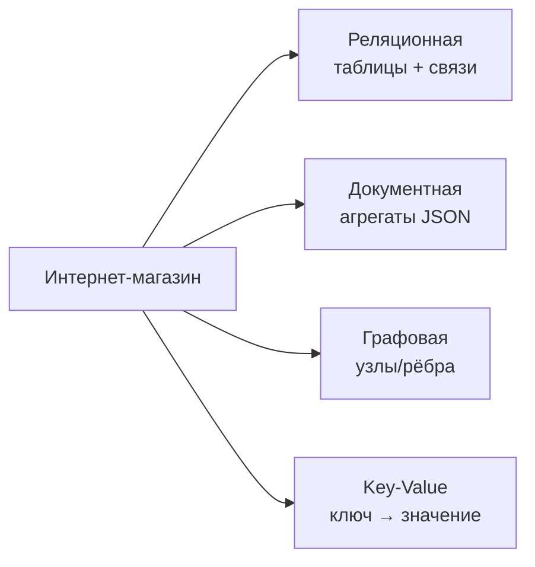
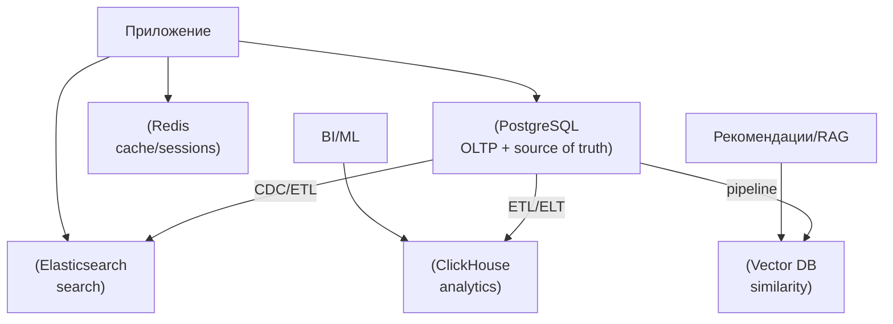
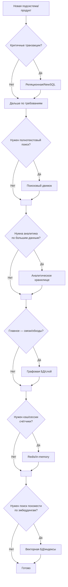

[← Назад к индексу части 0](index.md)

## 0.3. Ментальные модели: как думать о данных

Теперь, когда мы увидели карту типов БД, важно сформировать **простые ментальные модели**, которые помогут выбирать структуру и тип хранилища под конкретную задачу.

#### 0.3.1. Таблицы vs документы vs графы vs ключ–значение

Представим одну и ту же доменную область — **интернет‑магазин** — в четырёх моделях.

##### Табличная (реляционная) модель

Мысленно видим данные как:

- `users` — таблица пользователей;
- `orders` — таблица заказов;
- `order_items` — позиции заказа;
- `products` — товары;
- связи:
  - `orders.user_id` → `users.id`;
  - `order_items.order_id` → `orders.id`;
  - `order_items.product_id` → `products.id`.

Плюсы такой модели:

- Чёткая структура, легко выражать ограничения целостности.
- Отлично подходят запросы:
  - «все заказы пользователя за последний месяц»;
  - «суммарная выручка по товарам»;
  - «активные пользователи с более чем N заказами».

Минусы:

- Чтобы собрать «полный вид заказа», нужно JOIN нескольких таблиц.
- Структура данных жёстко зафиксирована схемой.

Когда думать так:

- когда домен хорошо описывается сущностями и связями с чёткими атрибутами;
- когда логика бизнес‑транзакций важна (деньги, запасы, статусы);
- когда данные нужно анализировать и агрегировать.

**Простыми словами**

- Это взгляд «**как на таблицы**»:
  - всё разложено по разным листам/таблицам;
  - связи между ними чётко определены;
  - ты можешь **гибко комбинировать данные** с помощью запросов.

**Мысленный эксперимент**

- Представь, что тебе нужно:
  - добавить новое поле «источник трафика» к заказам;
  - посмотреть выручку по источникам.
- В табличной модели:
  - добавляешь столбец;
  - пишешь один запрос с агрегацией;
  - БД делает всё остальное.

**Вопросы для самопроверки (0.3.1 — табличная модель)**

1. В чём главное преимущество табличного взгляда, когда тебе нужно делать сложные отчёты и аналитические запросы?  
   

Ответ

   В том, что данные чётко нормализованы по таблицам и связям, а язык запросов (SQL) позволяет гибко комбинировать эти таблицы через JOIN и агрегировать данные. Это упрощает построение отчётов, не требуя ручной сборки структур в коде.
   

2. Почему табличная модель может быть не самой удобной, если структура объекта часто меняется и сильно отличается от случая к случаю?  
   

Ответ

   Потому что для каждой новой разновидности данных нужно менять схему (добавлять/удалять столбцы, таблицы), либо держать много опциональных полей, что усложняет модель. В таких случаях документная модель с гибкой схемой может быть проще.
   

3. Придумай простой пример, когда табличная модель даёт тебе «почти бесплатно» то, что в коде пришлось бы долго программировать руками.  
   

Ответ

   Например, отчёт «количество заказов и сумма выручки по каждому пользователю за последний месяц»: в табличной модели это один запрос с GROUP BY, а в коде без БД пришлось бы вручную итерироваться по данным, группировать и суммировать.
   

##### Документная модель

Теперь представь, что **каждый заказ — один документ** в коллекции `orders`:

- документ содержит:
  - данные о пользователе (вложенный объект или ссылка);
  - массив позиций заказа;
  - историю статусов;
  - метаданные оплаты и доставки.

Плюсы:

- Очень удобно читать **«целиком заказ»** одной операцией.
- Можно хранить сложные, вложенные структуры.
- Гибкая схема: часть полей может появляться только у некоторых документов.

Минусы:

- Сложнее навязать жёсткие глобальные ограничения (например, уникальность на уровне всей системы).
- При изменении структуры часто нужно мигрировать документы или держать несколько версий схемы.
- Агрегации и аналитика могут быть менее эффективны, чем в реляционных БД.

Когда думать так:

- когда основной сценарий — работать с **целым агрегатом** (профиль, заказ, документ) как с единицей;
- когда требования к структуре данных часто меняются;
- когда бизнес‑логика хорошо ложится на DDD‑агрегаты.

**Простыми словами**

- Документная модель — это как **папка с делом клиента**, где:
  - внутри лежит всё сразу: анкета, договор, история писем;
  - ты часто берёшь **всю папку целиком**, а не отдельные бумажки.

**Плюс для мозга**

- Иногда проще мыслить **цельными объектами**:
  - «заказ» с вложенными позициями;
  - «пользователь» со всеми настройками.
- Документная модель это хорошо поддерживает.

**Вопросы для самопроверки (0.3.1 — документная модель)**

1. Приведи пример структуры данных, которую естественно хранить одним документом, а не разносить по многим таблицам.  
   

Ответ

   Например, заказ вместе со всеми позициями, адресом доставки, историей статусов и дополнительными полями. В документной модели это один JSON‑документ, который логично читать и писать целиком.
   

2. Какой компромисс ты принимаешь, выбирая документную модель вместо строго нормализованной табличной?  
   

Ответ

   Ты выигрываешь в удобстве работы с целыми агрегатами и гибкости схемы, но платишь более сложными глобальными ограничениями (уникальность, связи между документами) и иногда более тяжёлыми аналитическими запросами.
   

3. Почему изменение структуры документа (добавление нового поля, вложенного объекта) часто проще, чем изменение реляционной схемы?  
   

Ответ

   Потому что документная БД обычно не требует строгого описания всех полей заранее: старые документы могут просто не иметь нового поля. В реляционной БД изменения схемы требуют ALTER TABLE, могут блокировать таблицы и требуют более аккуратной миграции.
   

##### Графовая модель

Теперь мысленно рисуем **граф**:

- вершины:
  - пользователи;
  - товары;
  - категории;
  - бренды;
  - города.
- рёбра:
  - `USER -[BOUGHT]-> PRODUCT`;
  - `USER -[VIEWED]-> PRODUCT`;
  - `PRODUCT -[BELONGS_TO]-> CATEGORY`;
  - `USER -[LIVES_IN]-> CITY`.

Плюсы:

- Очень удобно решать задачи:
  - рекомендаций («похожие пользователи покупали…»);
  - анализа связей («кто с кем связан через N шагов»);
  - поиска сообществ и кластеров.
- Запросы пишутся естественным языком «обхода»:
  - «найти товары, которые покупали пользователи, похожие на этого».

Минусы:

- Не идеальны для простых CRUD‑операций по чётким сущностям (здесь реляционные БД проще).
- Сложнее интегрировать с классическими BI‑инструментами.

Когда думать так:

- когда **связи важнее самих сущностей**;
- когда нужно много переходов по графу;
- когда «плоская» модель плохо выражает предметную область.

**Простыми словами**

- Здесь ты думаешь не «таблицами», а **узлами и стрелками**:
  - кого с кем и что с чем связывает;
  - как по этим связям ходить.

**Мысленный эксперимент**

- В интернет‑магазине:
  - хочешь находить «людей, похожих на меня» по поведению;
  - хочешь смотреть, как по цепочке передаётся влияние: «кто кого пригласил».
- В таком контексте граф **естественнее** таблиц.

**Вопросы для самопроверки (0.3.1 — графовая модель)**

1. Почему запросы вида «друзья друзей» или «путь между двумя объектами» особенно хорошо ложатся на графовую модель?  
   

Ответ

   Потому что они естественны как обход графа по рёбрам: достаточно задать стартовую вершину и правило перехода, а СУБД выполняет обход. В таблицах это приводит к множеству JOIN‑ов или рекурсивным запросам, которые сложнее писать и понимать.
   

2. Придумай пример бизнес‑задачи в интернет‑магазине, где графовая модель даст явное преимущество над чисто табличной.  
   

Ответ

   Например, построение рекомендаций по социальным связям и поведению: «что покупают друзья моих друзей», «какие бренды чаще всего покупают пользователи, похожие на меня по истории просмотров и покупок».
   

3. Что будет, если попытаться реализовать сложный граф связей только в реляционной БД без осознания графовой модели?  
   

Ответ

   Скорее всего получится набор таблиц и JOIN‑ов, который трудно читать и расширять, а запросы станут медленными и сложными. Осознание графовой модели помогает спроектировать схему и запросы так, чтобы связи стали «первоклассными» и предсказуемыми.
   

##### Ключ–значение модель

Здесь мы видим данные как:

- `session:{session_id} -> JSON сессии`;
- `user:{user_id} -> JSON профиля`;
- `product_cache:{product_id} -> заранее собранный JSON для карточки товара`;
- `rate_limit:{ip} -> счётчики запросов`.

Плюсы:

- Простота, скорость, масштабируемость.
- Отлично подходит для:
  - кэшей;
  - простых lookup‑ов;
  - счётчиков и метрик;
  - feature‑флагов и конфигураций.

Минусы:

- Нет сложных запросов «из коробки» (JOIN, агрегации);
- Логику сложных выборок нужно реализовывать в приложении.

Когда думать так:

- когда ключи **естественно определяют объект**;
- когда операции — это в основном `GET`/`SET` по ключу;
- когда важны скорость и простота, а не богатый язык запросов.

**Простыми словами**

- Это как **огромный словарь**:
  - спрашиваешь по ключу → получаешь значение;
  - никаких сложных запросов внутри.

**Где удобно**

- сессии (`session:{id}`);
- кэш заранее собранных данных (`product_cache:{id}`);
- счётчики (`rate_limit:{ip}`).

**Вопросы для самопроверки (0.3.1 — key‑value модель)**

1. Почему key‑value модель так хорошо подходит для сессий и кэшей?  
   

Ответ

   Потому что для сессий и кэшей основной паттерн доступа — «по ключу получить значение». Нет необходимости в сложных запросах и связях; важно быстро записать и быстро прочитать данные по известному ключу.
   

2. Что ты теряешь, если пытаешься строить сложную аналитику только на key‑value хранилище?  
   

Ответ

   Теряешь удобные выборки и агрегаты: нет JOIN, GROUP BY, сложных фильтров. Приходится вытаскивать много данных в приложение и там вручную группировать и анализировать, что неэффективно и усложняет код.
   

3. Придумай пример, где key‑value и реляционная модель будут использоваться вместе в одной системе.  
   

Ответ

   Например, заказы и пользователи хранятся в PostgreSQL, а кэш заранее собранных карточек товаров или сессий пользователей — в Redis под ключами `product:{id}`, `session:{id}`. Реляционная БД — источник истины, Redis — ускоритель.
   

#### 0.3.2. Полиглот персистентности: не одна БД на всё

Исторически многие системы строились вокруг идеи:

> «У нас есть **одна большая реляционная БД**, в ней всё — от логов до рекомендаций».

Современный подход — **полиглот персистентности**:

- Использовать **несколько типов БД**, каждая из которых:
  - оптимальна под свою часть нагрузки;
  - хранит данные в подходящей модели.

Типичный пример:

- PostgreSQL:
  - заказы, пользователи, платежи, остатки на складе;
  - источник истины для финансов и бизнес‑сущностей.
- Redis:
  - кэш карточек товаров, сессии, счетчики;
  - ускорение чтения и статов.
- Elasticsearch:
  - полнотекстовый поиск по товарам и контенту.
- ClickHouse:
  - аналитика заказов, метрики, отчёты.
- Векторная БД:
  - эмбеддинги товаров и текстов для рекомендаций или RAG.

Главный тезис:

- **Нет «одной идеальной БД для всего».**
- Архитектура хранилища — это **композиция систем**, каждая из которых хороша в своей нише.

При этом:

- Должен быть **один (или несколько) источник(и) истины** для критичных данных.
- Остальные БД — чаще всего **производные хранилища** (реплики, кэши, проекции, аналитические слои).

**Простыми словами**

- Это идея «**разные инструменты для разных задач**»:
  - не пытаешься молотком крутить шурупы;
  - не пихаешь аналитические запросы туда же, где живут транзакции по деньгам.

**Мысленный образ**

- Представь мастерскую:
  - есть **основной сейф** с важными документами (реляционная БД);
  - есть **ящик с черновиками** (NoSQL, кэши);
  - есть **архив со статистикой** (аналитическая БД);
  - есть **полка с книгами‑справочниками** (поисковый движок).

**Вопросы для самопроверки (0.3.2)**

1. Почему в современной архитектуре часто выгоднее использовать несколько специализированных БД, а не одну «универсальную»?  
   

Ответ

   Потому что разные задачи требуют разных компромиссов: транзакции и целостность (OLTP), тяжёлая аналитика (OLAP), поиск, кэширование, графы связей и т.д. Одна универсальная БД редко даёт лучшие свойства сразу для всех типов нагрузок, а комбинация систем позволяет взять сильные стороны каждой.
   

2. Какой риск появляется при полиглот персистентности и что нужно обязательно продумать, чтобы его контролировать?  
   

Ответ

   Риск рассинхронизации между хранилищами и усложнение архитектуры (несколько источников данных, сложные потоки обновлений). Нужно чётко определить источник(и) истины, продумать механизмы репликации и обновления производных хранилищ, а также стратегии восстановления и мониторинга.
   

3. Придумай простой пример набора хранилищ для интернет‑магазина в духе полиглот персистентности.  
   

Ответ

   Например, PostgreSQL для заказов и пользователей (источник истины), Redis для кэша сессий и карточек, Elasticsearch для поиска по товарам, ClickHouse для аналитики заказов и поведения пользователей, векторная БД для рекомендаций.
   

#### 0.3.3. Как выбирать модель и тип БД: практический чек‑лист

Когда ты планируешь новую систему или модуль, задай себе следующие вопросы.

**1. Что является единицей согласованности?**

- Деньги на счёте?
- Остаток товара на складе?
- Договор с юридической силой?

Если ошибка здесь критична → **жёсткие транзакционные гарантии**, чаще реляционная БД / NewSQL.

**2. Какой основной тип нагрузки?**

- Много коротких транзакций → OLTP → реляционные/документные БД.
- Тяжёлая аналитика, много сканов и агрегаций → OLAP → колоночные БД.
- Много логов и метрик → временные ряды или columnstore.

**3. Какой основной способ доступа к данным?**

- По ключу (`id`, `email`, `session_id`) → подойдёт key‑value или реляционная БД с индексом.
- По сложным фильтрам и полнотекстовому поиску → поисковый движок или комбинированный подход.
- По связям между сущностями → возможно графовая БД.

**4. Насколько быстро и часто меняется схема?**

- Если структура относительно стабильна → реляционная модель даёт много плюсов.
- Если структура часто меняется, поля сильно различаются между объектами → документная модель может быть удобнее.

**5. Какие требования к масштабированию?**

- Ожидается ли очень быстрый рост нагрузки и данных?
- Сколько реально стоит простой или потеря части данных?
- Можно ли начать с одной БД и потом выделить отдельные хранилища под аналитику/поиск?

**6. Какой операционный и командный контекст?**

- Что команда умеет администрировать и оптимизировать?
- Есть ли опыт эксплуатации кластеров Cassandra/Elasticsearch/Kafka?
- Иногда **простой и понятный PostgreSQL** лучше, чем «идеальная по теории, но сложная в эксплуатации система».

**Простыми словами**

- Не надо сразу пытаться использовать «хайповые» БД:
  - если команда не умеет их обслуживать;
  - если реальные требования можно закрыть **одной хорошо настроенной реляционной БД**.

Лучше задать себе честные вопросы:

- какие у нас реально объёмы данных;
- какие у нас реально требования по времени отклика и доступности;
- какие компетенции у команды.

**Вопросы для самопроверки (0.3.3)**

1. Какие три вопроса ты бы задал себе в первую очередь, выбирая БД под новую систему?  
   

Ответ

   Например: (1) какие данные критичны и какая единица согласованности; (2) какой основной тип нагрузки — транзакции или аналитика; (3) какие паттерны доступа (по ключу, по тексту, по связям) будут основными.
   

2. Почему важно учитывать не только технические требования, но и опыт команды при выборе СУБД?  
   

Ответ

   Потому что даже «идеальная по теории» БД будет работать плохо, если команда не умеет её правильно настраивать, мониторить и отлаживать. Простой и понятный стек, с которым команда уже умеет работать, часто надёжнее экзотического решения.
   

3. Придумай пример, когда выбор слишком сложной БД без нужных компетенций привёл бы к реальным проблемам.  
   

Ответ

   Например, команда без опыта берёт распределённую СУБД вроде Cassandra «ради масштабирования», хотя нагрузка пока небольшая. В итоге получают сложную в эксплуатации систему, ошибки настройки репликации и консистентности и нестабильный прод, хотя можно было бы спокойно жить на одном PostgreSQL ещё долго.
   

#### 0.3.4. Пошаговая ментальная модель выбора

Можно свести выбор к упрощённому «дереву решений»:

1. **Критичные транзакционные данные?**
   - Да → начинай с **реляционной БД** (PostgreSQL/MySQL) или NewSQL, продумай схему.
2. **Нужен полнотекстовый поиск или сложное ранжирование?**
   - Да → добавляй **поисковый движок** (Elasticsearch/OpenSearch) как слой поверх основного хранилища.
3. **Нужна аналитика по большим объёмам данных?**
   - Да → выделяй **аналитическую БД/хранилище данных** (ClickHouse/Snowflake/BigQuery) и строй ETL/ELT.
4. **Есть граф задач, где главное — связи?**
   - Да → смотри в сторону **графовой БД** или как минимум продумай графовый слой.
5. **Нужны кэш, сессии, быстрые счётчики?**
   - Да → добавляй **in-memory хранилище** (Redis).
6. **Работаешь с эмбеддингами и поиском похожести?**
   - Да → используй **векторную БД** или векторные индексы.

Это не догма, а **ментальный шаблон**, который помогает не забыть ключевые измерения.

**Вопросы для самопроверки (0.3.4)**

1. Как бы ты кратко сформулировал для себя шаги выбора хранилищ по этой модели (1–2 предложения)?  
   

Ответ

   Сначала определить, где нужны строгие транзакции и взять под это реляционную/NewSQL БД, потом добавить поисковый слой при необходимости текста, выделить аналитическое хранилище под тяжёлые отчёты, подумать о графовой/векторной/in‑memory БД под специализированные задачи.
   

2. Почему полезно иметь в голове такую «деревянную» схему выбора, даже если в реальной жизни всё сложнее?  
   

Ответ

   Потому что она не даёт забыть важные измерения (транзакции, поиск, аналитика, графы, кэш) и помогает не хватать первую попавшуюся БД «по привычке». Это как чек‑лист пилота: реальность сложнее, но базовые шаги лучше пройти явно.
   

3. Придумай гипотетический проект и попробуй по шагам выбрать для него набор хранилищ, следуя схеме 0.3.4.  
   

Ответ

   Например, для сервиса заметок: реляционная БД (PostgreSQL) для пользователей и заметок как источника истины, полнотекстовый поиск (Elasticsearch) для поиска по тексту заметок, Redis для кэша популярных заметок и сессий. Если нужно — аналитическое хранилище для метрик использования.
   

---

---

<!-- prev-next-nav -->
*[← 0.2. Классификация баз данных: карта местности](02_0_2_klassifikatsiya_baz_dannyh_karta_mestnost.md) | [→ 0.4. Резюме и ожидания от дальнейших частей](04_0_4_rezyume_i_ozhidaniya_ot_dalnejshih_chaste.md)*
