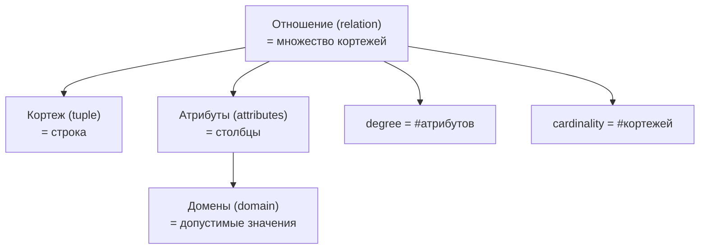
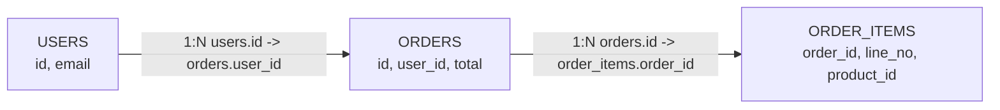
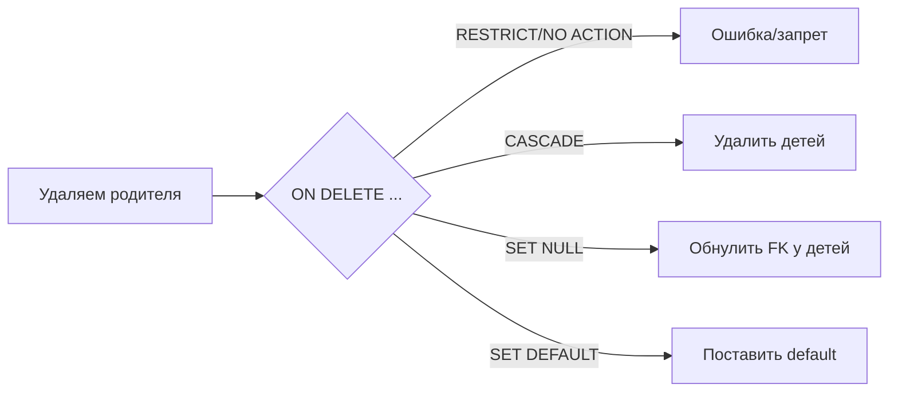

[← Назад к индексу части 1](index.md)

## 1. Реляционная модель

#### 1.1. Основные понятия

**Цель раздела.**  
Понять, как реляционная теория **формально** описывает привычные нам таблицы, строки и столбцы, и зачем вообще нужны такие строгие термины, если «и так понятно, что есть таблица».

##### Термины

- **Отношение (relation)** — абстрактная таблица, набор строк **одной и той же структуры**.  
  Важно: речь именно о **математическом множестве**, а не о «таблице в Excel».
- **Кортеж (tuple)** — одна строка отношения, то есть **набор значений атрибутов**.
- **Атрибут (attribute)** — один столбец отношения, имеет имя и домен значений.
- **Домен (domain)** — множество допустимых значений атрибута (по сути, тип + ограничения).  
  Примеры: «натуральные числа > 0», «строки с форматом email», «даты в XX–XXI веках».
- **Степень отношения (degree)** — число атрибутов (столбцов).
- **Кардинальность (cardinality)** — число кортежей (строк).



##### Правила и интуиция

- В теории **отношение — это множество кортежей**:
  - в нём **нет дубликатов строк** (множество, а не список);
  - порядок строк **не имеет значения**;
  - порядок столбцов тоже **не важен** — важны **имена атрибутов**.
- В реальных СУБД:
  - порядок строк и столбцов есть, но **логически** мы стараемся мыслить так, как будто порядок не важен;
  - дубликаты строк **допустимы**, но часто нежелательны, поэтому используют ключи и ограничения.
- Каждый атрибут:
  - должен иметь **один домен** (тип);
  - значение в каждой клетке — **атомарное** (важно для 1NF, см. ниже).

Попробуем это приземлить.

**Отношение как «идеальная таблица в голове».**

- Представь Excel‑таблицу, в которой:
  - нельзя завести две одинаковые строки «слово в слово» — если они есть, значит это **та же самая строка**, просто ты её скопировал по ошибке;
  - неважно, в каком порядке лежат строки: хоть сортируй по дате, хоть по имени — **смысл набора строк не меняется**;
  - можно физически переставлять столбцы местами (`email` слева или справа — неважно), пока **имена столбцов и их содержимое** остаются теми же.

Так вот, **отношение** — это как такая «идеальная» таблица в твоей голове, в которой:

- ты смотришь только на **набор строк** и их **структуру**;
- не думаешь о том, как конкретная СУБД их хранит на диске или в памяти.

**Кортеж как «один объект».**

- Одна строка в таблице `users` — это один пользователь.
- Одна строка в таблице `orders` — один заказ.
- Теория говорит: «давай договоримся называть это **кортежем**, чтобы отличать формальное понятие от просто слова “строка”».

**Домены и атрибуты — чтобы не было каши в колонках.**

- Если в колонке `email` можно положить всё, что угодно:
  - `vasya@example.com`
  - `123`
  - `когда уже отпуск`
  - пустую строку
- то ты **не можешь полагаться** на эту колонку:
  - нельзя нормально искать пользователей по email;
  - нельзя быть уверенным, что хотя бы часть строк корректна.

Поэтому теория говорит:

- у каждого атрибута есть **домен** — разрешённый набор значений;
- в БД это выражается через:
  - тип (`TEXT`, `INT`, `TIMESTAMPTZ` и т.д.);
  - ограничения (`NOT NULL`, `CHECK`, `UNIQUE` и т.д.).

**Пример.**  
Пусть есть отношения:

- `Users(id, email, full_name, created_at)`
- `Orders(id, user_id, total_amount, created_at)`

Здесь:

- `Users` и `Orders` — **отношения**;
- любая строка в `Users` — **кортеж** (конкретный пользователь);
- `email`, `full_name`, `created_at` — **атрибуты**;
- домены:
  - `email` — «строка с допустимым форматом email»;
  - `created_at` — «момент времени в UTC»;
  - `total_amount` — «неотрицательное денежное значение».

##### Простыми словами

- **Отношение** — это «таблица по правилам математики».
- **Кортеж** — «строка этой таблицы».
- **Атрибут** — «столбец с определённым типом».
- **Домен** — «какие именно значения этому столбцу разрешены».
- **Степень** — «сколько столбцов в таблице».
- **Кардинальность** — «сколько строк в таблице».

Если мыслишь так, легче обсуждать схемы без путаницы в терминах.

##### Типичные ошибки и граничные случаи

- Считать, что «отношение = таблица Postgres один к одному».  
  На практике есть нюансы: порядок, дубликаты, NULL и т.д.
- Не задавать себе вопрос «каков домен атрибута?».  
  В результате:
  - нет ограничений `CHECK`,
  - в поле «email» оказываются телефоны и произвольный текст.
- Пытаться «запихнуть два смысла в один атрибут» (например, «телефоны через запятую») — это уже нарушение нормальной формы, см. раздел о нормализации.

##### «Запомните» (1.1)

1. Отношение — это **множество строк фиксированной структуры**, а не просто «таблица в файловом смысле».
2. Атрибуты имеют **домены**, и ограничения на уровне типов и `CHECK` — это часть модели данных, а не «лишняя строгость».
3. Степень и кардинальность — просто числа столбцов и строк, но они помогают формализовать разговор о структуре.

##### Вопросы для самопроверки (1.1)

1. Чем **отношение в теории** отличается от «таблицы в Excel»?
   <details><summary>Ответ</summary>
   В отношении нет дубликатов строк, порядок строк и столбцов неважен, а каждая колонка имеет строго определённый домен значений; Excel‑таблица — произвольная сетка, где можно писать что угодно.
   </details>

2. Придумай для таблицы `users(id, email, age)` домены для каждого атрибута.
   <details><summary>Ответ</summary>
   `id`: целое положительное число, уникальное для пользователя. `email`: строка в формате email, ограниченной длины. `age`: целое число в диапазоне, например, 0–150.
   </details>

3. Почему важно, чтобы значение в каждой «клетке» было **атомарным**?
   <details><summary>Ответ</summary>
   Потому что реляционная модель и SQL‑операции (сравнения, группировки, индексация) предполагают работу с отдельными значениями; если в одной ячейке лежит список или закодированный JSON, теряются преимущества модели и усложняются запросы.
   </details>

4. Представь таблицу расходов:

```text
date       | items
-----------+-----------------------------
2024-01-01 | продукты:1000;такси:300
```

Почему эта таблица **не в 1NF** и чем она неудобна?

   <details><summary>Ответ</summary>
   В колонке `items` лежит сразу несколько значений, склеенных в строку, то есть значение не атомарно. Нельзя, например, простым SQL‑запросом посчитать сумму трат только по такси за месяц или найти все строки, где были траты на продукты больше 500, не разбирая строку вручную.
   </details>

---

#### 1.2. Ключи

**Цель раздела.**  
Понять, как в теории и практике задают **уникальность строк**, как различаются суперключ, кандидатный, первичный, внешний и альтернативный ключи, и почему это критично для целостности.

##### Термины

- **Суперключ** — любой набор атрибутов, который **однозначно определяет кортеж**.  
  Если у двух строк значения этих атрибутов совпали — это одна и та же строка.
- **Кандидатный ключ** — суперключ, который **минимален**: если из него удалить любой атрибут, он перестанет быть суперключом.
- **Первичный ключ (Primary Key)** — один из кандидатных ключей, который мы **выбираем как «главный»**. В реляционной теории — просто выбор, в СУБД — ограничение `PRIMARY KEY`.
- **Альтернативный ключ** — кандидатный ключ, который **не стал первичным**, но тоже может иметь уникальное ограничение.
- **Составной ключ** — ключ, состоящий **из нескольких атрибутов**.
- **Внешний ключ (Foreign Key)** — атрибут(ы), которые **ссылаются на ключ (обычно PK) другой таблицы** и обеспечивают ссылочную целостность.

##### Интуиция и примеры

Пусть есть таблица:

```sql
CREATE TABLE users (
    id         BIGSERIAL PRIMARY KEY,
    email      TEXT NOT NULL UNIQUE,
    phone      TEXT,
    created_at TIMESTAMPTZ NOT NULL DEFAULT now()
);
```

- Любой набор атрибутов, который позволяет **однозначно найти строку**, — суперключ.  
  Примеры суперключей:
  - `{id}`
  - `{email}`
  - `{id, email}`
  - `{id, created_at}` (технически да, если `id` уже уникален)
- **Кандидатные ключи** здесь:
  - `{id}` — минимален и однозначно идентифицирует пользователя;
  - `{email}` — тоже минимален и однозначно идентифицирует (если на нём `UNIQUE`).
- **Первичный ключ** — то, что мы пометили `PRIMARY KEY`, допустим `{id}`.
- **Альтернативный ключ** — `{email}`, если на нём есть `UNIQUE`, но он не выбран как PK.

**Составной ключ.**  
Пусть есть таблица «позиции заказа»:

```sql
CREATE TABLE order_items (
    order_id   BIGINT NOT NULL,
    line_no    INT    NOT NULL,
    product_id BIGINT NOT NULL,
    quantity   INT    NOT NULL,
    price      NUMERIC(12, 2) NOT NULL,
    PRIMARY KEY (order_id, line_no)
);
```

- Здесь ключ — пара `(order_id, line_no)`:
  - одна и та же строка заказа может иметь несколько позиций с разными `line_no`;
  - по одной только `order_id` строк **несколько**, поэтому это **не ключ**;
  - по паре `(order_id, line_no)` каждая строка **уникальна**.

**Внешние ключи.**

```sql
CREATE TABLE orders (
    id         BIGSERIAL PRIMARY KEY,
    user_id    BIGINT NOT NULL REFERENCES users(id),
    total      NUMERIC(12, 2) NOT NULL,
    created_at TIMESTAMPTZ NOT NULL DEFAULT now()
);
```

- `user_id` — внешний ключ:
  - его значения должны либо быть `NULL` (если так разрешено), либо указывать на существующий `users.id`;
  - это предотвращает появление «заказов призраков» без реального пользователя.



**Жизненная аналогия с паспортами и ссылками.**

- Представь базу данных «Госуслуги»:
  - есть таблица `citizens` — граждане;
  - есть таблица `passport_applications` — заявления на выдачу паспорта.
- Каждому гражданину можно выдать несколько паспортов за жизнь (смена фамилии, утеря и т.д.).
- Как связать заявление с конкретным человеком?
  - можно по ФИО и дате рождения, но у людей бывают однофамильцы;
  - поэтому вводят **уникальный идентификатор** — что‑то вроде `person_id`.
- Тогда:
  - `citizens.person_id` — **первичный ключ**;
  - `passport_applications.person_id` — **внешний ключ**, который всегда ссылается на `citizens.person_id`.

Если в заявке указан `person_id`, которого нет в `citizens`, это означает:

- кто‑то либо ошибся;
- либо данные повреждены;
- либо произошла попытка подделки.

В БД мы просто не позволяем создать такую строку.

##### Простыми словами

- **Ключ — это ответ на вопрос: «По чему мы однозначно узнаём строку?»**  
  Например, по номеру счёта, по номеру заказа, по комбинации `(order_id, line_no)`.
- **Суперключей может быть много**, но нас интересуют **минимальные** (кандидатные).
- **Первичный ключ** — просто **выбранный кандидатный**.  
  В БД его обозначают через `PRIMARY KEY`, часто на нём завязывают индексы, связи и т.д.
- **Внешний ключ** обеспечивает **согласованность ссылок между таблицами**.

Можно запомнить через образы:

- **первичный ключ** — это как **основной паспорт** объекта в системе;
- **альтернативные ключи** — как другие документы, по которым тоже можно однозначно идентифицировать (ИНН, СНИЛС, email), но основной — всё равно один;
- **внешний ключ** — это как «скрепка», которая прикрепляет один документ к другому: «эта запись про этого человека/этот заказ/этот аккаунт».

##### Типичные ошибки

- Делать `PRIMARY KEY` там, где он **не отражает бизнес‑семантику**:
  - слепо использовать «суррогатные ключи» (`id SERIAL`) везде, даже когда есть естественный ключ;
  - или наоборот — пытаться ключом сделать слишком большой текстовый столбец.
- Не определять явные `UNIQUE`/`PRIMARY KEY`, полагаясь «на сознательность разработчиков».  
  Результат — дубликаты, трудноисправимые баги и «магические» отличия строк.
- Отсутствие `FOREIGN KEY`:
  - «чтобы было быстрее» или «ORM само разберётся»;
  - в итоге: заказы с несуществующими пользователями, ссылки на удалённые сущности.

##### «Запомните» (1.2)

1. Суперключ — любой набор атрибутов, по которому **строка однозначно определяется**.
2. Кандидатный ключ — **минимальный** суперключ; первичный — один из кандидатных.
3. Внешние ключи — не «доп. опция», а **основа ссылочной целостности**; их отсутствие почти всегда мстит.

##### Вопросы для самопроверки (1.2)

1. Почему `{id, email}` — суперключ, но **не обязательно кандидатный ключ**?
   <details><summary>Ответ</summary>
   Потому что по `{id, email}` строка действительно однозначно определяется, но если уже один `id` сам по себе уникален, то подмножество `{id}` тоже суперключ. Значит, `{id, email}` не минимален и не кандидатный.
   </details>

2. Приведи пример **естественного** и **суррогатного** ключа для таблицы `products`.
   <details><summary>Ответ</summary>
   Естественный ключ: артикул товара (`sku`), если он уникален в бизнесе. Суррогатный: техническое поле `id BIGSERIAL`, не имеющее бизнес‑смысла, но удобное как первичный ключ.
   </details>

3. Что произойдёт, если в таблице `orders` убрать ограничение `FOREIGN KEY (user_id) REFERENCES users(id)`?
   <details><summary>Ответ</summary>
   БД перестанет проверять, что заказы ссылаются на существующих пользователей: можно будет создать заказ с `user_id`, которого нет в `users`, или удалить пользователя, у которого остались заказы. Это ломает целостность данных.
   </details>

4. Представь таблицу `cars(vin, reg_number, color)`:

   - `vin` — уникальный идентификатор машины (Vehicle Identification Number);
   - `reg_number` — регистрационный номер, который со временем может поменяться;
   - `color` — цвет.

   Какой атрибут логичнее сделать первичным ключом и почему?
   <details><summary>Ответ</summary>
   Логичнее сделать первичным ключом `vin`, потому что он привязан к машине навсегда и не меняется, в отличие от регистрационного номера и цвета. Это стабильный идентификатор сущности.
   </details>

---

#### 1.3. Целостность

**Цель раздела.**  
Понять, какие виды целостности существуют в реляционной модели и как они реализуются ограничениями в реальных БД.

##### Термины

- **Целостность сущности** — каждую сущность (строку) можно **однозначно идентифицировать**, первичный ключ не `NULL` и уникален.
- **Ссылочная целостность** — все ссылки (внешние ключи) **указывает на существующие строки** или равны `NULL`.
- **Целостность по домену** — значения атрибутов **принадлежат своим доменам** (типам и ограничениям).
- **Каскадное обновление / удаление** — поведение внешних ключей при изменении/удалении родительских строк.

##### Правила и связь с SQL

**Целостность сущности.**

- В SQL обеспечивается через:
  - `PRIMARY KEY` (не `NULL`, уникальность, индекс);
  - комбинации `NOT NULL` + `UNIQUE`.
- Без этого:
  - сложно ссылаться на строки;
  - появляются дубликаты, «псевдостроки», «непонятные» записи.

**Ссылочная целостность.**

```sql
CREATE TABLE users (
    id BIGSERIAL PRIMARY KEY
);

CREATE TABLE orders (
    id      BIGSERIAL PRIMARY KEY,
    user_id BIGINT REFERENCES users(id) ON DELETE CASCADE
);
```

- `REFERENCES users(id)` задаёт **ссылочную целостность**:
  - нельзя вставить заказ с `user_id`, которого нет в `users`;
  - нельзя удалить пользователя, если есть связанные заказы (если только не задан `ON DELETE CASCADE` или другое поведение).
- Опции поведения при удалении/обновлении:
  - `ON DELETE RESTRICT` / `NO ACTION` — запрещает удаление, если есть ссылки;
  - `ON DELETE CASCADE` — удаляет дочерние строки автоматически;
  - `ON DELETE SET NULL` — обнуляет FK;
  - `ON DELETE SET DEFAULT` — ставит дефолтное значение.



**Целостность по домену.**

- Задаётся через:
  - типы (`INT`, `NUMERIC(12,2)`, `DATE` и т.д.);
  - `NOT NULL`;
  - `CHECK`:

```sql
CREATE TABLE bank_accounts (
    id      BIGSERIAL PRIMARY KEY,
    balance NUMERIC(12, 2) NOT NULL CHECK (balance >= 0)
);
```

- Здесь домен `balance` — «неотрицательное денежное значение».

##### Простыми словами

- Целостность — это **набор правил, которые не дают данным превратиться в кашу**:
  - у каждой строки есть нормальный «паспорт» (PK);
  - все ссылки указывают на реальные объекты;
  - значения соответствуют здравому смыслу (типам, диапазонам, бизнес‑ограничениям).
- Вместо того чтобы «надеяться на код», мы **переносим инварианты в схему БД**.

##### Типичные ошибки

- Отключать или не задавать `FOREIGN KEY`, чтобы «ускорить загрузку», и не включать их обратно.
- Не использовать `CHECK`, всё валидировать только в приложении:
  - рано или поздно кто‑то обойдёт слой приложения (миграции, скрипты, другая служба) и положит мусор в БД.
- Злоупотреблять `ON DELETE CASCADE`, не понимая, сколько связанных сущностей будет удалено.

##### «Запомните» (1.3)

1. Целостность — это **ограничения, которые БД сама проверяет и не даёт их нарушить**.
2. Чем больше бизнес‑инвариантов описано в схеме (`PK`, `FK`, `CHECK`), тем меньше риск накопить «грязные» данные.
3. `ON DELETE CASCADE` и другие действия FK — мощный инструмент, но их нужно применять осознанно.

##### Вопросы для самопроверки (1.3)

1. Приведи пример инварианта, который **лучше описать в `CHECK`**, а не только в коде.
   <details><summary>Ответ</summary>
   Например, «баланс счёта не может быть отрицательным», «скидка не может быть больше 100%», «дата окончания не раньше даты начала». Эти ограничения одинаковы для всех приложений, поэтому логично зафиксировать их на уровне схемы.
   </details>

2. В чём разница между `ON DELETE RESTRICT` и `ON DELETE CASCADE`?
   <details><summary>Ответ</summary>
   `RESTRICT` (или `NO ACTION`) запрещает удалить родительскую строку, если на неё есть ссылки; `CASCADE` при удалении родителя автоматически удаляет все дочерние строки, ссылающиеся на него.
   </details>

3. Почему «валидировать всё только в приложении» опасно, если у БД нет своих ограничений?
   <details><summary>Ответ</summary>
   Потому что данные могут попасть в БД в обход приложения (скрипты, другая служба, ручные изменения), или в коде могут появиться баги. Если БД сама не проверяет инварианты, рано или поздно там окажутся противоречивые или мусорные данные.
   </details>

4. Представь, что в системе хранения билетов есть таблица `tickets(seat_no, row_no, status)`, и для каждого места в зале можно продать **ровно один билет** на конкретный сеанс. Какое ограничение целостности поможет это гарантировать?
   <details><summary>Ответ</summary>
   Уникальное ограничение или первичный ключ на комбинацию `(seat_no, row_no, show_id)` (если есть идентификатор сеанса). Это не даст создать две строки с одним и тем же местом на один и тот же показ.
   </details>

---

---

<!-- prev-next-nav -->
*[← Часть I. Теория и модели данных](00_vvedenie_marshrut_i_oglavlenie.md) | [→ 2. Нормализация](02_2_normalizatsiya.md)*
