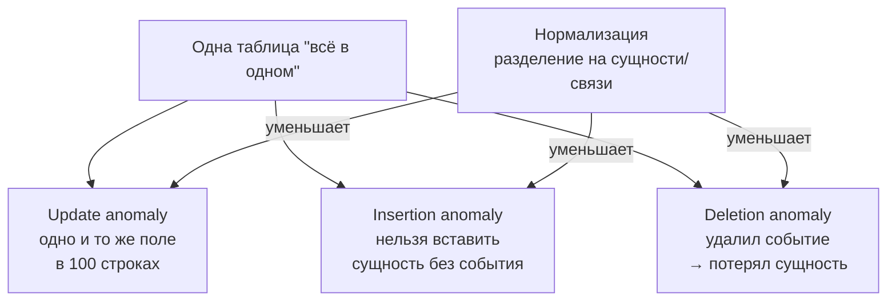
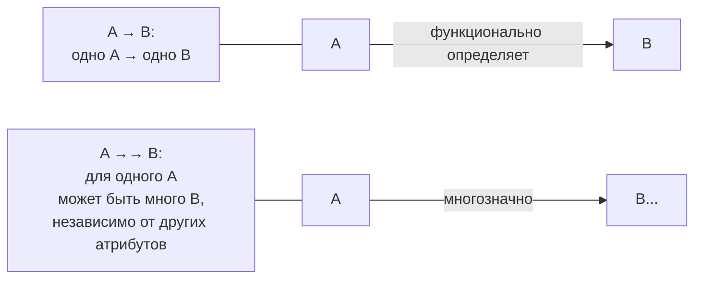
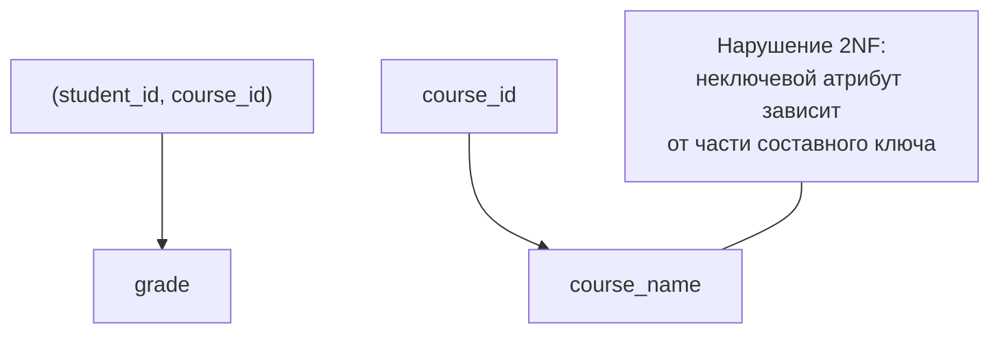
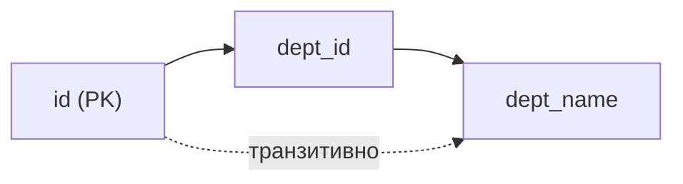
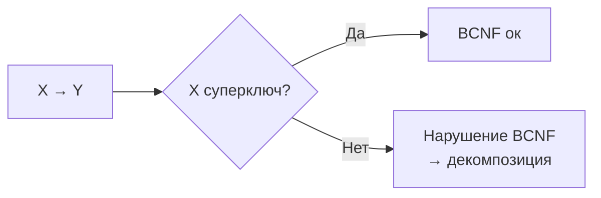
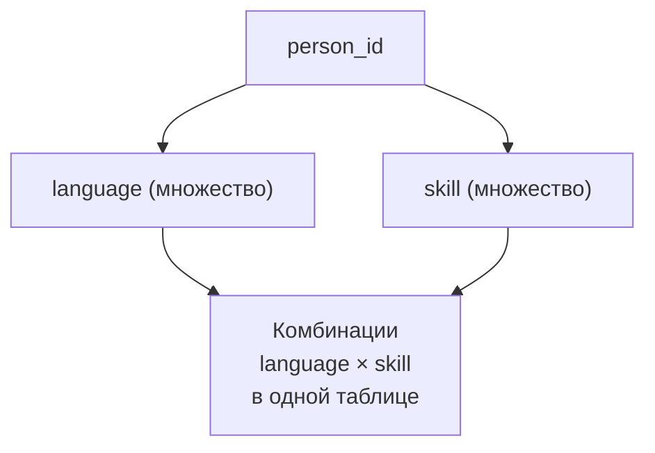

[← Назад к индексу части 1](index.md)

## 2. Нормализация

#### 2.1. Нормальные формы

**Цель раздела.**  
Понять, какие **проблемы решает нормализация**, что означают 1NF, 2NF, 3NF, BCNF и т.д., и как они связаны с **аномалиями обновления**.

##### Интуиция: зачем нормализация вообще нужна

Представь таблицу:

```sql
CREATE TABLE orders_raw (
    order_id      BIGINT,
    user_name     TEXT,
    user_email    TEXT,
    shipping_addr TEXT,
    items         TEXT,  -- "товар1:2;товар5:1;товар9:3"
    total_amount  NUMERIC(12, 2)
);
```

Проблемы:

- **Трудно изменять**:
  - если пользователь сменил email, его нужно менять во **всех заказах**;
- **Трудно добавлять**:
  - если хочешь завести пользователя без заказов — в этой схеме негде его хранить;
- **Трудно удалять**:
  - удалив последний заказ пользователя, ты «теряешь» данные о самом пользователе.

Это классические **аномалии обновления**:

- **аномалия изменения** (update anomaly);
- **аномалия вставки** (insertion anomaly);
- **аномалия удаления** (deletion anomaly).



Нормализация — это **процесс разбиения таблиц** так, чтобы:

- каждая таблица отвечала за **одну логическую сущность или связь**;
- зависимости между атрибутами были «правильными»;
- аномалии минимизировались.

##### Термины

- **Функциональная зависимость `A → B`** — по значению `A` можно **однозначно** восстановить `B`.  
  Пример: `email → user_name` (у каждого `email` ровно одно имя).
- **Детерминант** — левая часть функциональной зависимости (`A` в `A → B`).
- **Ключ** — множество атрибутов, чьё **замыкание** (все атрибуты, которые от них зависят) включает все атрибуты отношения, и которое минимально.
- **Многозначная зависимость `A →→ B`** — при фиксированном `A` набор значений `B` **независим** от других атрибутов.



**Как глазами искать функциональные зависимости в таблице (алгоритм для мозга).**

1. Сначала **забудь про формулы** и задай себе вопросы по‑человечески:
   - «Если я знаю **email**, могу ли я однозначно сказать, **как зовут** человека?»
   - «Если я знаю **номер заказа**, могу ли я однозначно сказать, **кто его сделал** и **какая сумма**?»
   - «Если я знаю **код товара**, могу ли я однозначно сказать, **как он называется** и **какой у него бренд**?»
2. Если ответ «да, по этому полю всегда можно восстановить то поле» — это кандидат на зависимость `A → B`.
3. Если нужно **несколько полей одновременно**, чтобы однозначно определить другое (`(student_id, course_id) → grade`), — это уже зависимость от **набора атрибутов**.
4. Проверь себя на контр‑примерах:
   - «Бывает ли такое, что **одинаковый A**, но **разный B**?»  
     Если да — зависимости `A → B` нет.
5. Старайся связывать зависимости с **правилами предметной области**, а не с текущими данными:
   - сейчас в таблице, может, у тебя нет двух людей с одинаковым email, но **по бизнесу** email обязан быть уникальным → зависимость `email → user`.

Так ты постепенно нащупываешь, какие атрибуты **определяют** другие, и можешь решать, где таблицу пора «разрезать».

##### 1NF — первая нормальная форма

**Определение.**  
Отношение в 1NF, если:

- каждое поле содержит **атомарное значение** (нет списков, массивов и т.п.);
- нет «повторяющихся групп столбцов» (типа `phone1`, `phone2`, `phone3`).

**Пример нарушения.**

- Поле `items` в `orders_raw` хранит **список товаров** в одной ячейке.

Другой частый пример нарушения 1NF:

```text
user_id | phone1      | phone2
--------+-------------+-------------
1       | +7...111    | +7...222
2       | +7...333    | NULL
```

- здесь у нас **повторяющиеся группы столбцов** (`phone1`, `phone2`);
- добавление третьего телефона приведёт к `phone3`, потом `phone4` и так далее;
- невозможно нормально обрабатывать «произвольное количество телефонов» без постоянного изменения схемы.

**Нормализация до 1NF.**

Разбиваем на:

```sql
CREATE TABLE orders (
    id           BIGSERIAL PRIMARY KEY,
    user_id      BIGINT NOT NULL,
    shipping_addr TEXT,
    total_amount NUMERIC(12, 2)
);

CREATE TABLE order_items (
    order_id   BIGINT NOT NULL,
    product_id BIGINT NOT NULL,
    quantity   INT    NOT NULL,
    PRIMARY KEY (order_id, product_id)
);
```

Теперь каждый `product_id` и `quantity` — **отдельные атомарные значения**.

```mermaid
flowchart LR
  Raw["orders_raw.items\n\#quot;товар1:2;товар5:1;...\#quot;"] --> Split["Разбить"]
  Split --> Orders["orders\n("order_id, user_id, ...")"]
  Split --> Items["order_items\n("order_id, product_id, quantity")"]
```

Аналогично с телефонами:

```sql
CREATE TABLE user_phones (
    user_id BIGINT NOT NULL,
    phone   TEXT   NOT NULL,
    PRIMARY KEY (user_id, phone)
);
```

- у одного пользователя может быть **любое количество телефонов**;
- запросы становятся проще:
  - найти всех пользователей с определённым телефоном;
  - посчитать, сколько телефонов в среднем у пользователя.

##### 2NF — вторая нормальная форма

**Идея.**  
2NF относится к таблицам с **составным ключом**.  
Требование: каждый **неключевой атрибут** зависит от **всего ключа целиком**, а не от его части.

**Формально.**

- Отношение в 2NF, если:
  - оно в 1NF;
  - нет **частичных функциональных зависимостей** вида  
    _(часть составного ключа) → (неключевой атрибут)_.

**Пример.**

```sql
CREATE TABLE enrollment (
    student_id  BIGINT,
    course_id   BIGINT,
    course_name TEXT,
    grade       TEXT,
    PRIMARY KEY (student_id, course_id)
);
```

- Ключ: `(student_id, course_id)`.
- Зависимости:
  - `(student_id, course_id) → grade` — хорошо, оценка зависит от пары;
  - `course_id → course_name` — **плохо**: `course_name` зависит только от части ключа (`course_id`).



Аномалия:

- если поменять название курса, нужно трогать **все строки** с этим `course_id`.

**Нормализация до 2NF.**

Разбиваем на:

```sql
CREATE TABLE courses (
    id   BIGINT PRIMARY KEY,
    name TEXT NOT NULL
);

CREATE TABLE enrollment (
    student_id BIGINT,
    course_id  BIGINT,
    grade      TEXT,
    PRIMARY KEY (student_id, course_id),
    FOREIGN KEY (course_id) REFERENCES courses(id)
);
```

Теперь:

- `course_id → course_name` живёт в `courses`;
- в `enrollment` неклюевые атрибуты зависят от **всего ключа** `(student_id, course_id)`.

Можно запомнить так:

- как только видишь таблицу с **составным первичным ключом** и неключевыми полями — сразу задавай себе вопрос:
  - «**каждое** неключевое поле точно зависит от **обоих** столбцов ключа?»
  - если нет — у тебя, вероятно, нарушение 2NF.

##### 3NF — третья нормальная форма

**Идея.**  
Убрать **транзитивные зависимости** от ключа: когда неключевой атрибут зависит не напрямую от ключа, а через другой неключевой атрибут.

**Формально.**

- Отношение в 3NF, если:
  - оно в 2NF;
  - нет зависимостей вида  
    `ключ → A → B`, где и `A`, и `B` — неключевые атрибуты.

**Пример.**

```sql
CREATE TABLE employees (
    id          BIGINT PRIMARY KEY,
    full_name   TEXT NOT NULL,
    dept_id     BIGINT NOT NULL,
    dept_name   TEXT NOT NULL
);
```

- `id → dept_id` (по сотруднику знаем отдел);
- `dept_id → dept_name` (по отделу знаем название);
- значит, `id → dept_name` **через** `dept_id` — транзитивная зависимость.



Аномалия:

- если переименовать отдел, нужно обновлять `dept_name` во всех сотрудниках этого отдела.

**Нормализация до 3NF.**

```sql
CREATE TABLE departments (
    id   BIGINT PRIMARY KEY,
    name TEXT NOT NULL
);

CREATE TABLE employees (
    id        BIGINT PRIMARY KEY,
    full_name TEXT NOT NULL,
    dept_id   BIGINT NOT NULL REFERENCES departments(id)
);
```

Теперь название отдела хранится **один раз**.

Ещё один пример транзитивной зависимости:

```sql
CREATE TABLE cities (
    id          BIGINT PRIMARY KEY,
    name        TEXT NOT NULL,
    country_id  BIGINT NOT NULL,
    country_name TEXT NOT NULL
);
```

- по `id` города знаем `country_id`;
- по `country_id` знаем `country_name`;
- значит, `id → country_name` через `country_id` — транзитивная зависимость.

Правильнее:

```sql
CREATE TABLE countries (
    id   BIGINT PRIMARY KEY,
    name TEXT NOT NULL
);

CREATE TABLE cities (
    id         BIGINT PRIMARY KEY,
    name       TEXT NOT NULL,
    country_id BIGINT NOT NULL REFERENCES countries(id)
);
```

##### BCNF — нормальная форма Бойса–Кодда

3NF не всегда достаточно, если в таблице **несколько кандидатных ключей**.  
BCNF усиливает требование:

- Для **каждой нетривиальной функциональной зависимости** `X → Y`  
  множество `X` должно быть **суперключом** (то есть определять всю строку).

Проще: **любой детерминант — ключ**.



BCNF устраняет более тонкие аномалии, но иногда требует разбиений, которые неудобны в практике; поэтому 3NF и BCNF часто обсуждают вместе и выбирают компромисс.

**Пример для интуиции.**

Представь таблицу аудиторий и курсов:

```sql
CREATE TABLE room_schedule (
    room      TEXT,
    time_slot TEXT,
    course    TEXT,
    teacher   TEXT
);
```

И допустим, что в нашей системе действуют правила:

- каждая пара `(room, time_slot)` однозначно определяет, **какой курс там идёт**;
- каждый `course` однозначно определяет, **какой `teacher` его ведёт**;
- и наоборот, каждый `teacher` однозначно ведёт **ровно один `course`**.

Тогда у нас могут быть зависимости:

- `(room, time_slot) → course`;
- `course → teacher`;
- `teacher → course`.

Могут возникать ситуации, когда:

- по `teacher` мы уже можем однозначно определить строку (если один препод ведёт один курс и в фиксированном слоте),  
  но при этом **он не является объявленным ключом** таблицы;
- или наоборот — ключом объявлена только пара `(room, time_slot)`, а зависимости через `course`/`teacher` создают дополнительные аномалии.

BCNF говорит: если у нас есть зависимость `teacher → course`, и `teacher` не объявлен как суперключ, это нарушение — значит, таблицу нужно **разбить так, чтобы любой «детерминант» стал ключом** в своей таблице.

Интуитивно:

- BCNF — это «ещё один шаг вперёд» по сравнению с 3NF, когда у тебя **много кандидатов на роль ключа**, и ты хочешь убрать аномалии, связанные с этим.

##### 4NF и 5NF (коротко)

- **4NF** борется с **многозначными зависимостями**:
  - когда при фиксированном `A` есть независимые множества `B` и `C` (пример: человек говорит на нескольких языках и имеет несколько навыков).
  - решение — разделить на два отношения: `(A, B)` и `(A, C)`.
- **5NF (PJ/NF)** касается случаев, когда отношение может быть **разбито на несколько** и потом восстановлено **только через соединения**, и при этом никаких «лишних» зависимостей нет.

В повседневной практике:

- чаще всего достаточно **3NF или BCNF**;
- 4NF/5NF нужны в более специальных случаях (сложные модели, хранилища данных и т.д.).

**Чуть подробнее про 4NF на простом примере.**

Пусть есть таблица:

```sql
CREATE TABLE person_profile (
    person_id BIGINT,
    language  TEXT,
    skill     TEXT
);
```

И допустим, что:

- набор языков, на которых говорит человек (`language`), **никак не зависит** от набора его навыков (`skill`);
- при этом для одного `person_id` мы можем хранить **несколько языков** и **несколько навыков**.

Тогда фактически в одной таблице мы храним **два независимых множества**:

- `(person_id, language)` — «человек → языки»;
- `(person_id, skill)` — «человек → навыки».

Это и есть многозначная зависимость: при фиксированном `person_id` мы можем независимо перечислять языки и навыки, и в таблице `person_profile` получаем «перемножение» комбинаций язык × навык.



4NF предлагает:

- вместо одной таблицы `person_profile(person_id, language, skill)`  
  сделать две:

```sql
CREATE TABLE person_languages (
    person_id BIGINT,
    language  TEXT,
    PRIMARY KEY (person_id, language)
);

CREATE TABLE person_skills (
    person_id BIGINT,
    skill     TEXT,
    PRIMARY KEY (person_id, skill)
);
```

- так мы устраняем лишнее дублирование комбинаций и аномалии при обновлениях.

##### Простыми словами

- 1NF — «в каждой клетке **одно значение**, никаких списков и повторяющихся групп».
- 2NF — «если ключ составной, все неключевые поля зависят от ключа **целиком**, а не от кусочка».
- 3NF — «неключевые поля не должны зависеть друг от друга через цепочки — только от ключа».
- BCNF — «любая «причина» (детерминант) какой‑то зависимости должна сама быть ключом».

Можно представить это как «поэтапную уборку»:

1. Сначала ты **разгребаешь шкаф**, чтобы в каждой коробке лежал **один тип вещей** (1NF: атомарность).
2. Потом следишь, чтобы в одной коробке не было вещей, которые логически относятся к **двум разным шкафам** (2NF: нет частичных зависимостей).
3. Затем убираешь ситуации, когда **одна коробка зависит от другой нелогично**, и вещи должны лежать отдельно (3NF: нет транзитивных зависимостей).

##### «Запомните» (2.1)

1. Нормальные формы — не «абстракция ради абстракции», а **способ убрать аномалии обновления**.
2. 1NF требует атомарности, 2NF и 3NF используют **функциональные зависимости**.
3. В большинстве прикладных систем «достаточно честно стремиться к 3NF», понимая, где и зачем ты от неё отступаешь.

##### Вопросы для самопроверки (2.1)

1. Приведи свой пример **аномалии изменения** в ненормализованной таблице.
   <details><summary>Ответ</summary>
   Например, в таблице заказов хранятся `user_email` и `user_name`. Если пользователь сменил email, нужно обновить его во всех заказах. Если где‑то забыли — в системе появляется два разных email для одного и того же человека.
   </details>

2. Почему таблица с составным ключом `(order_id, line_no)` и полем `product_name` может нарушать 2NF?
   <details><summary>Ответ</summary>
   Потому что `product_name` зависит только от `product_id` (части информации о позиции), а не от всей пары `(order_id, line_no)`. Это частичная зависимость неключевого атрибута от части ключа.
   </details>

3. В чём практическая выгода вынесения отделов в отдельную таблицу `departments`?
   <details><summary>Ответ</summary>
   Название отдела хранится один раз, его можно поменять в одном месте; легче ввести дополнительные атрибуты отдела (руководитель, бюджет и т.д.); не возникает противоречивых названий в разных строках сотрудников.
   </details>

4. В таблице `books(author_name, author_city, title)` автор может написать много книг, и в каждой строке повторяются `author_name` и `author_city`. Как можно нормализовать эту структуру и какой аномалии это поможет избежать?
   <details><summary>Ответ</summary>
   Вынести авторов в отдельную таблицу `authors(id, name, city)` и в `books` хранить `author_id`. Это убирает аномалию изменения: при смене города автора не нужно обновлять все строки с его книгами.
   </details>

---

#### 2.2. Денормализация

**Цель раздела.**  
Понять, **когда и почему мы сознательно нарушаем нормальные формы**, что такое денормализация и как делать её безопасно.

##### Идея

Чистая нормализация:

- хорошо для **целостности**;
- но может быть **дорога по производительности**:
  - много `JOIN`;
  - тяжёлые отчёты;
  - частые обращения к одним и тем же комбинациям данных.

**Денормализация** — это **осознанное дублирование данных или объединение сущностей** ради:

- ускорения чтения;
- упрощения типичных запросов;
- снижения нагрузки на БД.

##### Примеры денормализации

1. Хранить в `orders` не только `user_id`, но и **snapshot** пользователя:

```sql
CREATE TABLE orders (
    id              BIGSERIAL PRIMARY KEY,
    user_id         BIGINT NOT NULL,
    user_email_copy TEXT   NOT NULL,  -- копия на момент заказа
    total_amount    NUMERIC(12, 2) NOT NULL
);
```

- это **нарушает 3NF** (email дублируется);
- но имеет смысл, если:
  - аналитика нужна по email на момент заказа;
  - email может меняться в `users`, а в заказе нужен «исторический срез».

2. Создание агрегатных таблиц для отчётов:

```sql
CREATE TABLE daily_revenue (
    date        DATE PRIMARY KEY,
    total_sum   NUMERIC(14, 2),
    orders_cnt  BIGINT
);
```

- данные здесь **дублируют** информацию из `orders`;
- но отчёт «выручка по дням» считается намного быстрее.

3. Материализованные представления:

```sql
CREATE MATERIALIZED VIEW product_stats AS
SELECT
    p.id,
    COUNT(o.id)     AS orders_cnt,
    SUM(o.total)    AS total_revenue
FROM products p
LEFT JOIN orders o ON o.product_id = p.id
GROUP BY p.id;
```

- это тоже форма денормализации: **предрасчитанные** данные;
- их нужно **обновлять** (`REFRESH MATERIALIZED VIEW` или через триггеры/планировщик).

##### Риски денормализации

- **Расхождение копий данных**:
  - email в `users` и `orders.user_email_copy` может не совпадать;
  - агрегаты могут устареть.
- **Сложность обновления**:
  - приходится думать, как пересчитывать денормализованные данные;
  - нужны фоновые задачи, триггеры, cron‑джобы.

```mermaid
flowchart LR
  Truth["(Source of truth\nнормализованные таблицы)"] --> Deriv["Производные данные\n("агрегаты/MV/снэпшоты")"]
  Deriv --> Drift["Риск рассинхронизации"]
  Update["Процесс обновления\n("trigger/job/refresh")"] --> Deriv
```

**Практический алгоритм: как решать, нужна ли денормализация.**

1. **Сначала спроектируй и реализуй нормализованную схему** (до 3NF/BCNF):
   - не начинай с денормализации «на всякий случай»;
   - выпиши основные сущности и связи, как в части 1.1–2.1.
2. **Поживи с этой схемой в реальной нагрузке**:
   - посмотри, какие запросы реально выполняются чаще всего;
   - измерь, какие запросы действительно тормозят (профилирование, `EXPLAIN ANALYZE`).
3. Если видишь **повторяющиеся тяжёлые запросы**:
   - отчёты, которые каждый раз считают одно и то же по миллионам строк;
   - запросы, которые тянут 5–7 таблиц `JOIN` ради отображения одной «карточки» в UI;
   - запросы, которые читают «исторический срез» данных.
4. Для каждого такого запроса задай вопросы:
   - «Могу ли я **предрассчитать** нужный результат и хранить его отдельно?» (агрегаты, материализованные представления);
   - «Имеет ли смысл хранить **снэпшот** объекта на момент события (как `user_email_copy` в заказе)?»
5. Если ответ «да»:
   - чётко фиксируй, **что является источником истины** (обычно нормализованные таблицы);
   - описывай словами, **насколько данные могут быть устаревшими** (секунды/минуты/часы);
   - продумывай механизм обновления: триггеры, фоновые джобы, периодический пересчёт.
6. Только после этого **добавляй денормализованные структуры**:
   - отдельные агрегатные таблицы;
   - материализованные представления;
   - дополнительные дублирующие поля (снэпшоты).

Так ты избежишь ситуации, когда «сначала всё денормализовали, а потом год разгребали последствия».

##### Как делать денормализацию безопаснее

- Относиться к ней как к **оптимизационной технике**, а не «основной модели».
- Чётко понимать:
  - **кто источник истины** (обычно нормализованные таблицы);
  - какие таблицы/представления — **производные**.
- Держать в голове:
  - допустимое **устаревание** (секунды, минуты, часы);
  - как и когда происходит **пересчёт**.

##### «Запомните» (2.2)

1. Нормализация — про **правильность и целостность**, денормализация — про **производительность и удобство чтения**.
2. Денормализация всегда должна быть **осознанным компромиссом**, а не «мы так сделали, потому что лениво думать».
3. У денормализованных данных должен быть понятный **процесс обновления** и один **источник истины**.

##### Вопросы для самопроверки (2.2)

1. Придумай пример, когда денормализация по‑твоему оправдана.
   <details><summary>Ответ</summary>
   Например, предрасчитать ежедневную выручку и количество заказов в отдельной таблице, чтобы дашборд грузился мгновенно, а не выполнял тяжёлые агрегации по всем заказам каждый раз.
   </details>

2. Почему хранить `user_email_copy` в заказе может быть разумно, хотя это дублирование?
   <details><summary>Ответ</summary>
   Потому что заказ — исторический документ, и нам важен email, который был у пользователя на момент оформления, даже если он поменяется позже. Это осознанный snapshot, а не случайное дублирование.
   </details>

3. Что обязательно нужно решить до введения денормализованной таблицы с агрегатами?
   <details><summary>Ответ</summary>
   Кто источник истины (обычно исходные нормализованные таблицы), как часто агрегаты будут пересчитываться, как обрабатывать ошибки пересчёта и как понимать, что данные в агрегатной таблице устарели.
   </details>

---

---

<!-- prev-next-nav -->
*[← 1. Реляционная модель](01_1_relyatsionnaya_model.md) | [→ 3. Реляционная алгебра](03_3_relyatsionnaya_algebra.md)*
