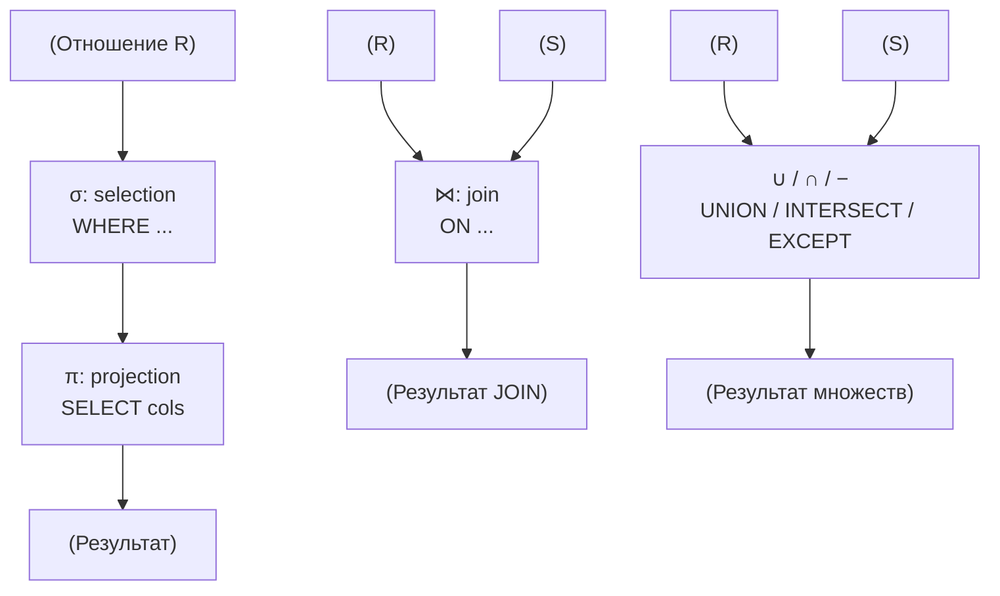
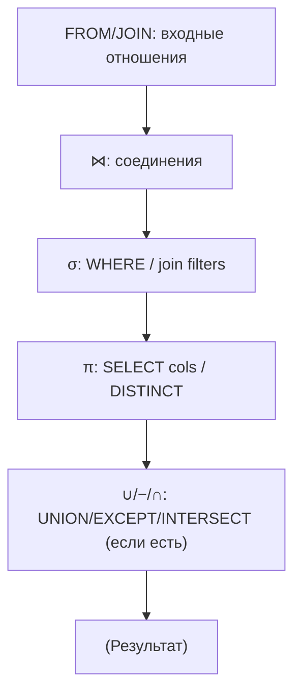
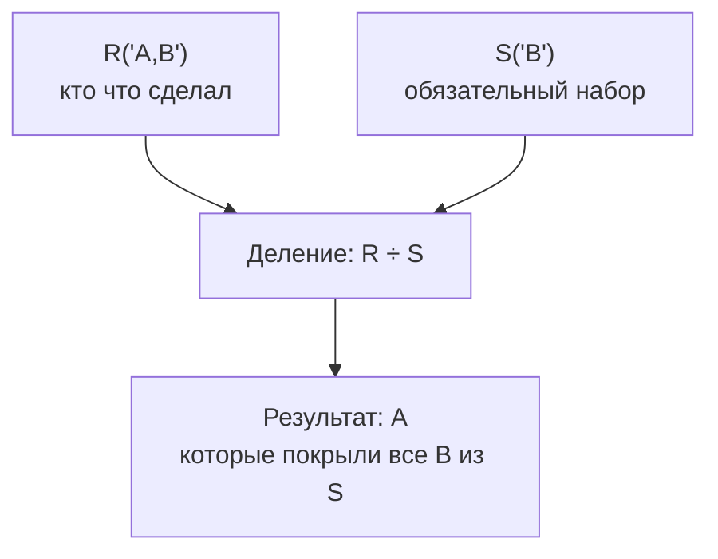
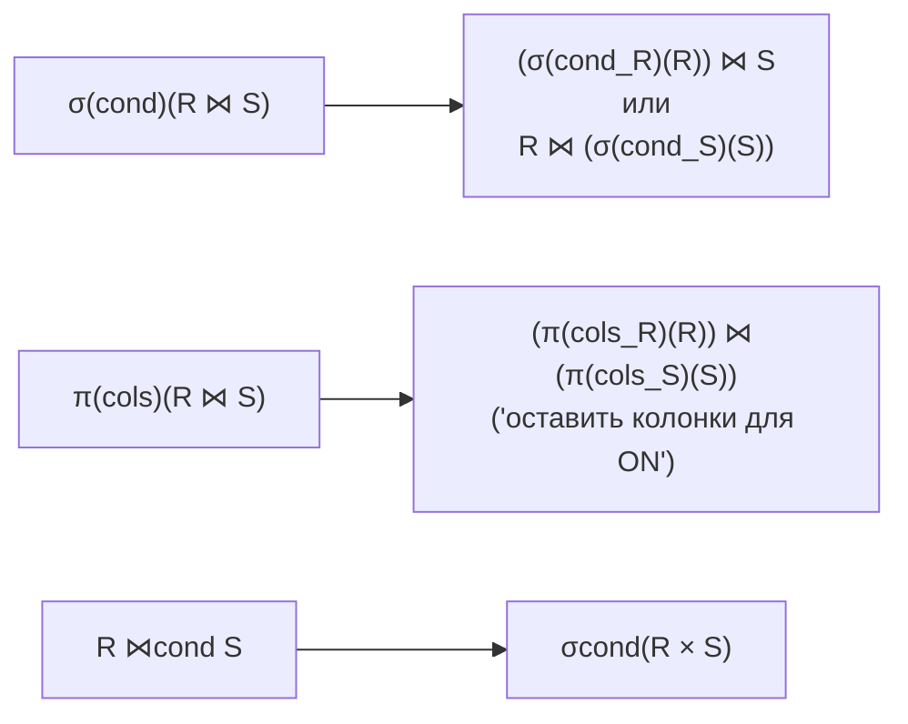

[← Назад к индексу части 1](index.md)

## 3. Реляционная алгебра

**Цель части 3.**  
Понять, что SQL‑запросы можно рассматривать как **последовательность операций над отношениями**, и увидеть соответствие между этими операциями и конструкциями SQL.

#### 3.1. Базовые операции

##### Термины

- **Выборка (selection, σ)** — отбор строк по условию (`WHERE`).
- **Проекция (projection, π)** — выбор подмножества столбцов (`SELECT col1, col2`).
- **Объединение (union, ∪)** — объединение строк двух отношений с одинаковой структурой.
- **Разность (difference, −)** — строки первого отношения, которых нет во втором.
- **Пересечение (intersection, ∩)** — строки, присутствующие в обоих отношениях.
- **Декартово произведение (cartesian product, ×)** — каждая строка первого отношения сочетается с каждой строкой второго.
- **Соединение (join, ⋈)** — декартово произведение с условием сопоставления строк.
- **Переименование (rename, ρ)** — смена имён атрибутов (или отношения). Нужно, когда при декартовом произведении или соединении у двух отношений совпадают имена столбцов и их нужно различать. В SQL этой операции соответствуют **псевдонимы** таблиц и столбцов (`AS`): `FROM users u`, `SELECT u.id AS user_id`.



##### Примеры соответствия SQL

Пусть есть:

- `Students(id, name, group_id)`
- `Groups(id, name)`

**Выборка σ.**

- Теория: `σ_{group_id = 10}(Students)` — все студенты из группы 10.
- SQL:

```sql
SELECT *
FROM students
WHERE group_id = 10;
```

**Проекция π.**

- Теория: `π_{name}(Students)` — множество имён студентов.
- SQL:

```sql
SELECT DISTINCT name
FROM students;
```

**Объединение ∪.**

```sql
SELECT email FROM newsletter_subscribers
UNION          -- по умолчанию без дубликатов
SELECT email FROM customers;
```

**Разность − (EXCEPT).**

```sql
SELECT email FROM customers
EXCEPT
SELECT email FROM newsletter_unsubscribed;
```

**Пересечение ∩ (INTERSECT).**

```sql
SELECT email FROM customers
INTERSECT
SELECT email FROM newsletter_subscribers;
```

**Декартово произведение ×.**

```sql
SELECT *
FROM students
CROSS JOIN groups;
```

**Соединение ⋈.**

- Теория: `Students ⋈_{Students.group_id = Groups.id} Groups`.
- SQL:

```sql
SELECT s.id, s.name AS student_name, g.name AS group_name
FROM students s
JOIN groups g ON g.id = s.group_id;
```

##### Простыми словами

- Любой SQL‑запрос (на уровне SELECT‑части) — это **комбинация этих операций**:
  - сначала БД «берёт отношения» (таблицы/подзапросы),
  - применяет к ним **фильтрации**, **соединения**, **проекции**, **агрегации** и т.д.
- Понимая этот набор операций, проще:
  - читать сложные запросы;
  - оптимизировать их;
  - превращать бизнес‑задачи в «последовательность операций над множествами».

Очень полезная привычка: **разбирать любой непонятный SELECT на шаги**:

1. Какие **отношения на входе** (какие таблицы и подзапросы в `FROM`/`JOIN`)?
2. Какие **соединения** между ними (по каким условиям, какие типы JOIN)?
3. Какие **фильтры (σ)** применяются (`WHERE`, условия в `JOIN`)?
4. Какие **проекции (π)** делаются (что в `SELECT`)?
5. Есть ли **операции над множествами** (`UNION`, `EXCEPT`, `INTERSECT`)?



Разберём пример по шагам.

```sql
SELECT DISTINCT u.id, u.email
FROM users u
JOIN orders o ON o.user_id = u.id
WHERE o.created_at >= current_date - INTERVAL '30 days'
  AND o.total_amount > 0;
```

- Шаг 1. Входные отношения:
  - `Users` и `Orders`.
- Шаг 2. Соединение:
  - `Users ⋈_{Users.id = Orders.user_id} Orders`.
- Шаг 3. Выборка (σ):
  - условие по дате (`o.created_at >= ...`);
  - условие по сумме (`o.total_amount > 0`).
- Шаг 4. Проекция (π):
  - берём только `u.id` и `u.email`.
- Шаг 5. Устранение дубликатов:
  - `DISTINCT` превращает результат в множество без повторов.

В терминах алгебры можно (очень грубо) представить это так:

- `π_{u.id, u.email} ( σ_{date & amount} ( Users ⋈ Orders ) )`.

##### «Запомните» (3.1)

1. SQL — это не «процедурный язык», а язык **описания необходимых операций над отношениями**.
2. Основные операции алгебры имеют **прямые аналоги** в SQL (`WHERE`, `SELECT`, `JOIN`, `UNION`, `EXCEPT`, `INTERSECT`).
3. **Переименование (ρ)** в алгебре — смена имён атрибутов или отношения; в SQL ему соответствуют псевдонимы таблиц и столбцов (`AS`).
4. Думать запросами как «последовательностью σ, π, ⋈, ρ, ∪, −» — полезная ментальная модель для сложных выборок.

##### Вопросы для самопроверки (3.1)

1. Какую реляционную операцию реализует `SELECT col1, col2 FROM table` (без `DISTINCT` и `WHERE`)?
   <details><summary>Ответ</summary>
   Это проекция (π) по столбцам `col1` и `col2`.
   </details>

2. Какой набор операций можно увидеть в запросе:

```sql
SELECT DISTINCT u.id
FROM users u
JOIN orders o ON o.user_id = u.id
WHERE o.created_at >= current_date - INTERVAL '30 days';
```

   <details><summary>Ответ</summary>
   Соединение (⋈) `users` и `orders` по `user_id`, выборка (σ) по условию даты `created_at >= ...`, проекция (π) по `u.id` и устранение дубликатов (как в алгебраическом `π` над множеством).
   </details>

3. Чем на уровне алгебры отличается `UNION ALL` от `UNION`?
   <details><summary>Ответ</summary>
   `UNION` соответствует объединению множеств без дубликатов, `UNION ALL` — объединению мультимножеств, где дубликаты сохраняются.
   </details>

4. Попробуй разложить по шагам такой запрос:

```sql
SELECT p.id, p.name
FROM products p
LEFT JOIN order_items oi ON oi.product_id = p.id
WHERE oi.id IS NULL;
```

Вопрос: какие здесь есть операции σ, π, ⋈ и что в итоге означает этот запрос?

   <details><summary>Ответ</summary>
   Здесь есть LEFT JOIN (соединение ⋈ особого вида) `products` и `order_items` по `product_id`, затем выборка σ по условию `oi.id IS NULL` (остаёмся только с теми строками, для которых не нашлось подходящих позиций заказа), и проекция π по `p.id, p.name`. Семантически это: «найти все товары, которые ни в одном заказе не фигурировали».
   </details>

---

#### 3.2. Операция деления (÷): «кто сделал всё из набора»

**Цель раздела.**  
Понять, что делает операция деления в реляционной алгебре, в каких задачах она естественна и как реализуется в SQL.

##### Интуиция

Операция деления отвечает на вопросы вида:

- «Найти всех студентов, которые сдали **все экзамены** из набора обязательных».
- «Найти поставщиков, которые поставляют **все детали** из списка».
- «Найти пользователей, которые купили **все товары** из набора промо‑товаров».

Это не просто «кто сделал хотя бы один из…», а именно «кто закрыл **весь перечень**».



##### Формально (но по‑простому)

Есть два отношения:

- `R(A, B)` — кто что сделал/имеет;
- `S(B)` — «набор того, что нужно закрыть полностью».

Операция деления `R ÷ S` даёт нам множество таких `A`, для которых:

- для **каждого** значения `B` из `S` в `R` есть строка `(A, B)`.

Другими словами:

- `A` попадает в результат, если он покрывает **все B** из списка `S`.

##### Пример: студенты и курсы

Пусть есть:

```text
Enrolled(student_id, course_id)
RequiredCourses(course_id)
```

- `Enrolled` — на какие курсы записан студент;
- `RequiredCourses` — список «обязательных» курсов.

Хотим: **найти студентов, которые записаны на все обязательные курсы**.

На уровне алгебры:

- `Result = Enrolled ÷ RequiredCourses`.

##### Как это выглядит в SQL (подход 1: GROUP BY + HAVING)

Идея:

1. Посчитать, сколько **разных обязательных курсов** есть в системе.
2. Для каждого студента посчитать, на сколько **разных обязательных** курсов он записан.
3. Оставить тех, у кого эти числа совпали.

```sql
-- 1. Сколько всего обязательных курсов?
SELECT COUNT(DISTINCT course_id) AS required_cnt
FROM required_courses;
```

Допустим, `required_cnt = 3`.

```sql
-- 2–3. Студенты, у которых есть все обязательные курсы
SELECT e.student_id
FROM enrolled e
JOIN required_courses r
  ON e.course_id = r.course_id
GROUP BY e.student_id
HAVING COUNT(DISTINCT e.course_id) =
       (SELECT COUNT(DISTINCT course_id) FROM required_courses);
```

- `JOIN` с `required_courses` отсекает курсы, которые нас не интересуют.
- `GROUP BY student_id` собирает для каждого студента его обязательные курсы.
- `HAVING COUNT(DISTINCT ...) = общее_количество` и есть реализация деления.

##### Как это выглядит в SQL (подход 2: NOT EXISTS)

Иногда проще думать так:

> Студент подходит, если **не существует ни одного обязательного курса**, которого он **не** записал.

```sql
SELECT s.id AS student_id
FROM students s
WHERE NOT EXISTS (
    SELECT 1
    FROM required_courses rc
    WHERE NOT EXISTS (
        SELECT 1
        FROM enrolled e
        WHERE e.student_id = s.id
          AND e.course_id = rc.course_id
    )
);
```

Внутренний `NOT EXISTS` говорит:

- «для этого студента **нет записи** `enrolled`, что он записан на обязательный курс `rc`»;

Внешний `NOT EXISTS` оборачивает это:

- «не существует **ни одного** обязательного курса, для которого студент не записан».

Это типичный SQL‑паттерн для деления.

##### Простыми словами

- Деление — это «**фильтр по полному покрытию набора**».
- Мы смотрим на пару отношений `R(A, B)` и `S(B)` и спрашиваем:
  - какие `A` **кроют все `B` из `S`**?

##### Вопросы для самопроверки (3.2)

1. Придумай свою задачу на деление:  
   «Найти X, которые имеют/сделали все Y из списка».  
   Опиши кратко отношения `R(A, B)` и `S(B)` для неё.
   <details><summary>Ответ</summary>
   Например: «Найти клиентов, купивших все товары из набора промо‑товаров». `R(customer_id, product_id)` — покупки клиентов, `S(product_id)` — промо‑товары.
   </details>

2. Почему нельзя решить задачу «все обязательные курсы» простым `IN (subquery)` по одному курсу?
   <details><summary>Ответ</summary>
   Потому что `IN` даёт «хотя бы один из списка», а нам нужно «все из списка». Деление учитывает сразу весь набор значений `B`, а не отдельные элементы.
   </details>

3. Какой из двух подходов (GROUP BY + HAVING или NOT EXISTS) тебе кажется более понятным и почему?
   <details><summary>Ответ</summary>
   Кому‑то проще думать в терминах «посчитали количество и сравнили со списком» (GROUP BY), кому‑то — в логике «нет ни одного пропущенного элемента» (NOT EXISTS). Важно понимать **обе** интуиции, потому что в реальном коде встречаются оба варианта.
   </details>

---

#### 3.3. Эквивалентности и переписывание выражений

**Цель раздела.**  
Понимать, что одни и те же запросы можно записывать по‑разному, и использовать простые законы реляционной алгебры для переписывания и оптимизации SQL.

##### Базовые «законы» (без формальной математики)

1. **Ассоциативность и коммутативность для множества операций.**
   - Объединение, пересечение и декартово произведение (а также многие виды JOIN) можно переставлять и группировать по‑разному:
     - `R ∪ S = S ∪ R`,
     - `(R ∪ S) ∪ T = R ∪ (S ∪ T)`,
     - `(R ⋈ S) ⋈ T = R ⋈ (S ⋈ T)` (если условия соединения согласованы).
2. **Проталкивание выборок (σ) внутрь.**
   - `σ_{cond}(R ⋈ S)` часто можно превратить в:
     - `(σ_{cond_R}(R)) ⋈ S`, если условие касается только `R`;
     - `R ⋈ (σ_{cond_S}(S))`, если условие касается только `S`.
   - Это уменьшает объём данных, участвующих в JOIN.
3. **Проталкивание проекций (π).**
   - `π_{cols}(R ⋈ S)` можно заменить на:
     - `(π_{cols_R}(R)) ⋈ (π_{cols_S}(S))`,
   - если аккуратно оставить все колонки, которые нужны для условий соединения.
4. **Соединение как фильтр над декартовым произведением.**
   - `R ⋈_{cond} S` = `σ_{cond}(R × S)`.



Эти законы используются оптимизатором СУБД автоматически, но полезно **держать их в голове** при написании запросов.

##### Пример: проталкивание `WHERE`

Допустим, у нас есть:

```sql
SELECT *
FROM orders o
JOIN order_items oi ON oi.order_id = o.id
WHERE o.created_at >= current_date - INTERVAL '7 days';
```

Логически это:

- взять `orders × order_items`,
- отфильтровать по `o.id = oi.order_id` и `created_at >= ...`,
- проецировать нужные столбцы.

Но мы можем мыслить так:

- сначала взять только **нужные заказы за неделю**:

```sql
WITH recent_orders AS (
    SELECT *
    FROM orders
    WHERE created_at >= current_date - INTERVAL '7 days'
)
SELECT *
FROM recent_orders o
JOIN order_items oi ON oi.order_id = o.id;
```

С точки зрения результата это **эквивалентные** запросы, но во втором случае:

- JOIN делает меньше работы, потому что в него попали только заказы за неделю.

##### Пример: эквивалентные формы с подзапросами и JOIN

Иногда запрос можно переписать из формы с подзапросом в форму с JOIN и обратно:

```sql
-- Вариант 1: подзапрос в WHERE
SELECT *
FROM orders o
WHERE o.user_id IN (
    SELECT id
    FROM users
    WHERE email LIKE '%@example.com'
);
```

Эквивалентен:

```sql
-- Вариант 2: явный JOIN
SELECT o.*
FROM orders o
JOIN users u ON u.id = o.user_id
WHERE u.email LIKE '%@example.com';
```

На уровне алгебры это одна и та же комбинация:

- `σ_{email LIKE ...}(Users) ⋈ Orders` с дальнейшей проекцией по полям заказа.

Понимание этой эквивалентности:

- помогает читать чужие запросы в разных стилях;
- иногда даёт возможность выбрать более понятную или лучше оптимизируемую форму.

##### Вопросы для самопроверки (3.3)

1. Приведи простой пример, где проталкивание фильтра (`WHERE`) **до JOIN** уменьшает объём данных для соединения.
   <details><summary>Ответ</summary>
   Например, если ты сначала отфильтруешь `users` по активным (`status = 'active'`), а потом будешь JOIN‑ить только их с заказами, вместо того чтобы соединять все `users` с `orders` и только затем фильтровать по статусу.
   </details>

2. Почему полезно знать, что `JOIN` часто можно переписать через подзапрос в `WHERE` и наоборот?
   <details><summary>Ответ</summary>
   Потому что это помогает понимать разный стиль написания запросов и выбирать форму, которая проще читается в конкретной ситуации или лучше оптимизируется СУБД.
   </details>

3. Какой из «законов» (проталкивание σ/π, ассоциативность JOIN) кажется тебе наиболее интуитивным и почему?
   <details><summary>Ответ</summary>
   Часто проще всего воспринимается проталкивание `WHERE`: естественно сначала «сузить» таблицу, а потом соединять только нужные строки. Ассоциативность JOIN помогает, когда много таблиц: мы можем мысленно группировать их в удобном порядке.
   </details>

---

---

<!-- prev-next-nav -->
*[← 2. Нормализация](02_2_normalizatsiya.md) | [→ 4. Другие модели данных](04_4_drugie_modeli_dannyh.md)*
