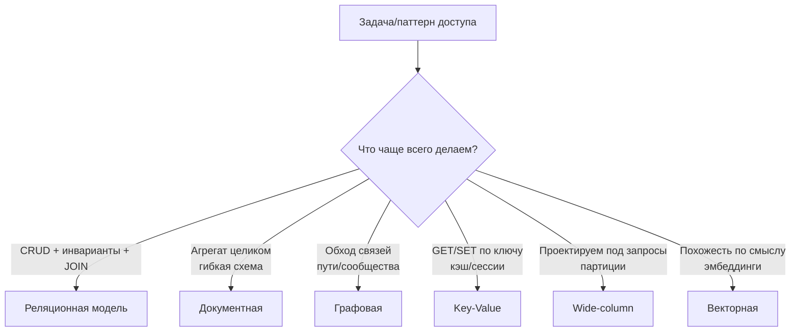
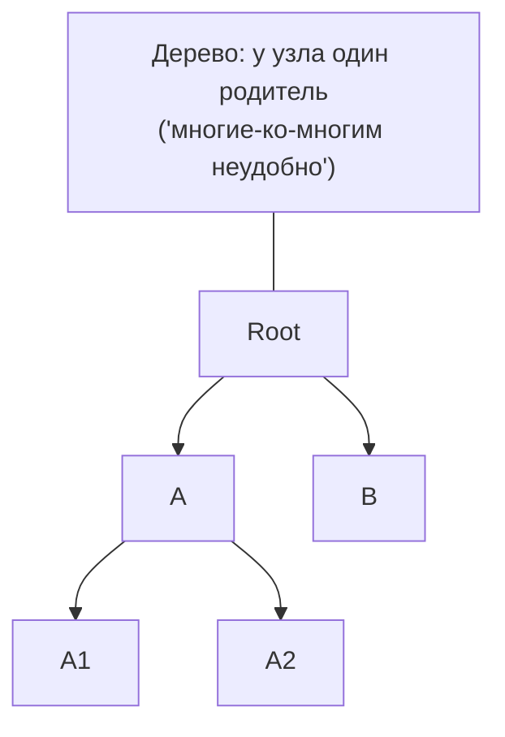
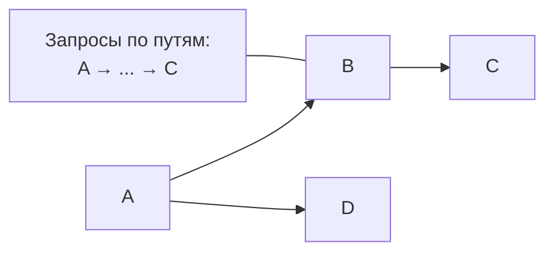
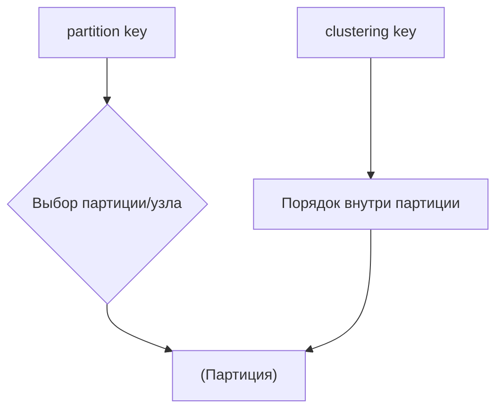

[← Назад к индексу части 1](index.md)

## 4. Другие модели данных

**Цель части 4.**  
Понять, как реляционная модель соотносится с **другими историческими и современными моделями**, зачем нужны все эти «NoSQL/графы/wide‑column/вектора» и как ER‑модель помогает проектировать схемы.



#### 4.1. Иерархическая и сетевая модели

##### Иерархическая модель

- Данные организованы как **дерево**: у каждой записи один родитель (кроме корня) и набор детей.
- Пример: старая модель IMS, файловые системы, XML‑деревья.
- Хорошо работает, когда:
  - структура «жёстко древовидная»;
  - каждую запись можно однозначно «положить» в одно место дерева.
- Плохо, когда:
  - нужны **многие‑ко‑многим** связи;
  - одна сущность логически принадлежит **нескольким веткам**.



**Приземлённый пример.**

- Дерево папок на диске:
  - у каждой папки есть **одна родительская папка** (кроме корневой);
  - внутри могут быть файлы и подпапки;
  - файл **не может одновременно лежать в двух разных папках** (если только не делать ярлык/ссылку, но это уже усложнение модели).

Такое дерево отлично подходит, когда:

- сущности действительно образуют «чистую иерархию»:
  - компания → отдел → команда → сотрудник;
  - страна → регион → город;
  - категория → подкатегория → товар.

##### Сетевая модель

- Обобщает иерархическую: сущности связаны **произвольным графом**.
- Ранние СУБД (CODASYL) использовали сложные **навигационные API**:
  - «перейти от записи этого типа по связи такого типа к той записи»;
  - запросы сильно зависят от физической структуры.

Если продолжать аналогию с папками:

- сетевая модель — это когда:
  - один и тот же «документ» может физически лежать **сразу в нескольких местах**;
  - есть разные типы связей: «лежит в папке», «ссылается на», «копия такого‑то документа»;
  - чтобы что‑то найти, нужно **ходить по этим связям**.


##### Связь с реляционной моделью

- Реляционная модель предложила:
  - **логический уровень** (отношения и операции над ними);
  - **отделение логики запросов от физической структуры хранения**.
- Пользователь больше не думает, как пройти по указателям; он описывает **что** нужно получить, а не **как** туда дойти.

##### «Запомните» (4.1)

1. Иерархическая и сетевая модели — важный исторический контекст: реляционная теория появилась как **ответ на их недостатки**.
2. Реляционная модель отделяет **что хотим получить** от **как это физически хранится**.

##### Вопросы для самопроверки (4.1)

1. Чем иерархическая модель ограничена по сравнению с реляционной?
   <details><summary>Ответ</summary>
   В иерархии у записи один родитель; трудно представить связи «многие ко многим» или сущность, принадлежащую нескольким веткам дерева. Реляционная модель не привязана к одной иерархии.
   </details>

2. Что такое навигационный доступ в контексте сетевой модели?
   <details><summary>Ответ</summary>
   Запросы строятся как «перейти от записи по связи такого типа к другой записи» — программист явно указывает, как пройти по указателям. Логика запроса завязана на физическую структуру хранения.
   </details>

3. Какую идею реляционная модель противопоставила иерархической и сетевой?
   <details><summary>Ответ</summary>
   Отделение логического уровня (отношения и операции над ними) от физического хранения. Пользователь описывает **что** нужно получить, а не **как** туда дойти по указателям.
   </details>

---

#### 4.2. Документная, графовая, key–value, wide‑column, векторная модели

Здесь мы коротко свяжем теорию из части 0 с теорией моделей данных.

##### Документная модель

- Единица хранения — **документ** (обычно JSON/BSON).
- Подходит, когда:
  - естественная единица — **агрегат** (заказ со всеми позициями, профиль пользователя);
  - структура внутри агрегата **сложная и может меняться**;
  - основная операция — «прочитать или записать документ целиком».
- Связь с реляционной моделью:
  - можно представить документ как «одну большую строку» с полем `data JSONB`, но тогда теряешь часть преимуществ реляционной модели;
  - нередко используют гибрид: ключевые поля — в колонках, остальное — в JSON.

**Бытовой образ.**

- Представь «дело клиента» в бумажном архиве:
  - на обложке — номер клиента и ФИО (это можно считать «колонками»);
  - внутри — анкеты, договоры, письма, комментарии;
  - чаще всего ты берёшь **всю папку целиком**, а не отдельные листы.

Документная БД позволяет хранить такие «папки» как **один документ**, не разрезая его жёстко на много таблиц.

```mermaid
flowchart TB
  Doc["orders документ"] --> Head["Обложка:\norder_id, user_id"]
  Doc --> Body["Внутри:\nitems["], statuses[], meta]
  Read["Частый доступ"] -->|1 чтение| Doc
```

**Типичные сценарии.**

- Профили пользователей с разными наборами полей.
- Документы/формы, структура которых меняется со временем.
- Агрегаты DDD (заказы, заявки, тикеты) с вложенными списками и историей.

**Типичные ошибки.**

- Пытаться строить **сложную аналитику только по документам**, не вынося ключевые поля в отдельные колонки.
- Использовать документную БД как «реляционную, только без схемы», не думая про структуру и индексы.

##### Графовая модель

- Мир описан как **узлы (вершины)** и **связи (рёбра)**:
  - `USER -[FRIEND_OF]-> USER`;
  - `USER -[BOUGHT]-> PRODUCT`.
- Удобна, когда:
  - главная ценность — **структура связей** (соцсети, графы знаний, маршрутизация);
  - много запросов вида «друзья друзей», «кратчайший путь», «рекомендации по графу».
- Теоретически графы можно хранить и в реляционной модели (таблицы `nodes`, `edges`), но:
  - запросы получаются сложнее;
  - производительность обхода связей часто хуже, чем в специализированной графовой БД.

**Образ.**

- Это как **огромная карта метро**:
  - станции — вершины;
  - линии и отрезки между станциями — рёбра.
- Вопросы к такой модели естественные:
  - «как доехать из точки А в точку Б?» — кратчайший путь;
  - «через какие станции чаще всего проходят маршруты?» — «важность» вершин;
  - «кто находится рядом с кем по одному/двум шагам связей?» — «друзья друзей».



**Типичные сценарии.**

- Социальные сети и профессиональные связи.
- Графы знаний (сущности и отношения: «X связан с Y таким‑то образом»).
- Роутинг (дороги, маршруты), права доступа («кто через какие роли имеет доступ к чему»).

**Типичные ошибки.**

- Пытаться хранить **чисто табличные данные** (платежи, остатки, заказы) только в графовой БД.
- Не продумывать модель связей и уровни глубины, из‑за чего запросы становятся крайне тяжёлыми.

##### Key–value модель

- Массив пар `ключ → значение`.
- Отлично подходит для:
  - сессий;
  - кэшей;
  - счётчиков;
  - простых lookup‑ов.
- В теоретическом смысле:
  - можно рассматривать как отношение `(key, value)` с ключом `key`;
  - но обычно дополнительные операции (JOIN, сложные запросы) не поддерживаются.

**Образ.**

- Это буквально **огромный словарь/хеш‑таблица**:
  - по ключу `session:{id}` быстро получают JSON сессии;
  - по ключу `product_cache:{id}` — заранее собранную карточку товара.

Главное: модель очень простая, за счёт этого **очень быстрая**, но «глупая» в смысле сложных запросов.

**Типичные сценарии.**

- Кэш карточек товаров, результатов тяжёлых запросов, отрисованных страниц.
- Сессии пользователей, токены авторизации.
- Быстрые счётчики (rate limiting, метрики).

**Типичные ошибки.**

- Использовать key–value хранилище как **основную транзакционную БД**, где нужна сложная логика и связи.
- Хранить в одном значении «огромные документы», которые потом постоянно перезаписывать целиком из‑за мелких изменений.

##### Wide‑column (широкостолбцовая) модель

- Строка может иметь **разный набор столбцов** (разреженная структура).
- Организовано вокруг:
  - **partition key** — определяет, на каком узле хранятся данные;
  - **clustering key** — задаёт порядок внутри партиции.
- Запросы проектируют исходя из **ключей и шаблонов доступа**, а не из списка сущностей.



**Образ (упрощённо).**

- Представь, что у тебя есть миллионы сенсоров, каждый из которых посылает показания:
  - для одного сенсора могут приходить много разных типов показаний;
  - для другого — только пара типов;
  - не хочется создавать столбец на каждый возможный тип показаний.
- Wide‑column модель позволяет:
  - для каждой строки (сенсора) хранить **разный набор колонок**;
  - при этом эффективно распределять строки по узлам по `partition key`.

**Типичные сценарии.**

- Журналы событий и телеметрия с разными типами полей.
- Большие разреженные таблицы, где у разных сущностей может быть свой набор свойств.

**Типичные ошибки.**

- Проектировать схему, **исходя из сущностей, а не из запросов** (забывая, что «from queries first» — основной принцип wide‑column БД).
- Подходить к wide‑column как к «реляционной БД с NULL‑ами», не учитывая особенности партиционирования и кластеризации.

##### Векторная модель

- Объекты представлены **векторами признаков**; задача: найти «ближайшие» векторы.
- Теоретически:
  - можно думать о векторе как о точке в пространстве \(\mathbb{R}^n\);
  - запрос — это поиск ближайших точек по метрике (L2, косинусная и т.д.).

**Простой образ.**

- Каждую сущность (товар, текст, пользователя) мы представляем как **точку в многомерном пространстве**.
- Запрос «найти похожее» становится:
  - «найди точки, которые ближе всего к вот этой точке по выбранной метрике».

Поэтому векторные БД особенно полезны там, где мы говорим «похожий по смыслу», а не «точно такой же по значению поля».

**Типичные сценарии.**

- RAG/поиск похожих документов по смыслу.
- Рекомендации «похожие товары/фильмы/трековые плейлисты».
- Дедупликация контента (поиск почти одинаковых текстов/картинок).

**Типичные ошибки.**

- Пытаться использовать векторную БД как **единственное хранилище**, а не как дополнительный слой к основной БД.
- Не нормализовать/не подготавливать данные перед построением эмбеддингов, ожидать «магии» от модели.

##### «Запомните» (4.2)

1. Все эти модели — **альтернативные способы представить данные**, которые лучше подходят под определённые типы запросов и нагрузок.
2. Реляционную модель не нужно «насильно натягивать» на задачи, где, например, графовая или документная модель естественнее.

##### Вопросы для самопроверки (4.2)

1. Когда документная модель удобнее реляционной?
   <details><summary>Ответ</summary>
   Когда естественная единица — целый агрегат (заказ со всеми позициями, профиль пользователя), структура внутри сложная и может меняться, а основная операция — прочитать или записать документ целиком.
   </details>

2. Зачем использовать графовую БД вместо таблиц nodes и edges в реляционной СУБД?
   <details><summary>Ответ</summary>
   Когда главная ценность — структура связей и много запросов «друзья друзей», кратчайший путь, рекомендации по графу. Специализированная графовая БД обычно даёт более простой язык запросов и лучшую производительность обхода связей.
   </details>

3. Что общего у key–value хранилища с реляционной моделью и в чём принципиальное ограничение key–value?
   <details><summary>Ответ</summary>
   Теоретически key–value можно рассматривать как отношение (key, value) с ключом key. Ограничение: обычно нет JOIN и сложных запросов — только быстрый lookup по ключу; подходит для кэша, сессий, счётчиков, а не для основной транзакционной логики.
   </details>

---

#### 4.3. ER‑модель и уровни проектирования

##### ER‑модель (сущности–связи)

- **Сущность** — тип объектов (Пользователь, Заказ, Товар).
- **Атрибуты** — свойства сущностей (имя, сумма, дата).
- **Связи**:
  - 1:1 — один к одному;
  - 1:N — один ко многим;
  - N:M — многие ко многим.

ER‑диаграммы помогают:

- пройти путь от **бизнес‑требований** к **логической модели**;
- до того, как мы начнём думать в терминах конкретных таблиц и типов СУБД.


**Простой пример ER‑модели для интернет‑магазина.**

- Сущности:
  - `User` — покупатель;
  - `Order` — заказ;
  - `Product` — товар;
  - `Category` — категория товара.
- Связи:
  - `User` 1:N `Order` — один пользователь может сделать много заказов; каждый заказ принадлежит одному пользователю;
  - `Order` N:M `Product` — в заказе может быть много товаров, и один товар может входить в много заказов;
  - `Product` N:1 `Category` — товар относится к одной категории, в категории много товаров.

В виде ER:

- `User (id, email, name, ...)`
- `Order (id, created_at, total_amount, ...)`
- `Product (id, name, price, ...)`
- `Category (id, name, ...)`
- `User` —(1:N)— `Order`
- `Order` —(N:M)— `Product` (через отдельную сущность `OrderItem`)
- `Category` —(1:N)— `Product`

Потом это превращается в реляционную схему:

```text
users(id PK, email, name, ...)

orders(
    id PK,
    user_id FK → users.id,
    created_at,
    total_amount,
    ...
)

products(
    id PK,
    category_id FK → categories.id,
    name,
    price,
    ...
)

categories(
    id PK,
    name,
    ...
)

order_items(
    order_id  FK → orders.id,
    product_id FK → products.id,
    quantity,
    price_at_moment,
    PK(order_id, product_id)
)
```

- Связь `User` 1:N `Order` реализуется через `orders.user_id FK → users.id`.
- Связь N:M `Order` ↔ `Product` реализуется через **промежуточную таблицу** `order_items`.
- Связь 1:N `Category` ↔ `Product` реализуется через `products.category_id`.

##### Уровни проектирования

- **Концептуальный уровень**:
  - разговор с бизнесом: какие сущности есть, какие связи между ними;
  - ER‑диаграммы, описание инвариантов словами.
- **Логический уровень**:
  - конкретная **модель данных** (реляционная, документная, графовая и т.д.);
  - для реляционной: список отношений, ключей, ограничений.
- **Физический уровень**:
  - конкретная СУБД и физическое хранение:
  - типы индексов, партиционирование, распределённость, настройки.

##### Паттерны моделирования

- **Звёздная схема (star schema)** — факт + измерения:
  - факт: `fact_sales(order_id, product_id, date_id, amount, qty, ...)`;
  - измерения: `dim_product`, `dim_customer`, `dim_date`, …;
  - хорошо для хранилищ данных и аналитики.
- **Снежинка (snowflake)** — нормализованная звезда (измерения разбиты по нескольким таблицам).
- **Агрегат (DDD)** — единица согласованности и изменений в предметной области:
  - заказ со всеми позициями;
  - пользователь с профилем и настройками.
  - В реляционной БД агрегат обычно реализуется через несколько связанных таблиц.

##### Пошаговый алгоритм проектирования схемы (упрощённый)

1. **Собери требования «по‑человечески».**

   - Список того, что нужно хранить: пользователи, заказы, товары, платежи, категории, роли и т.п.
   - Какие вопросы система должна уметь отвечать:
     - «Какие заказы сделал пользователь X за месяц?»
     - «Какие товары чаще всего покупают вместе?»
     - «Сколько у нас выручки по категориям?»

2. **Выдели сущности и их атрибуты (концептуальный уровень).**

   - Для каждой сущности выпиши:
     - «что это за объект в мире?»;
     - «какие у него основные свойства?»;
     - «что из этого — обязательно, а что — опционально?».

3. **Определи связи и их кратность (1:1, 1:N, N:M).**

   - Вопросы:
     - «Сколько заказов может быть у одного пользователя?» → 1:N.
     - «Сколько товаров может быть в одном заказе и наоборот?» → N:M.
     - «Сколько категорий может быть у товара?» → 1:N или N:M в зависимости от требований.

4. **Разверни N:M связи через отдельные сущности.**

   - `Order` N:M `Product` → таблица `OrderItem` (или `order_items`).
   - В ER‑модели это называется **ассоциативной сущностью**.

5. **Перейди к логическому уровню (реляционная модель).**

   - Каждой сущности → таблица.
   - Каждой связи 1:N → внешний ключ на стороне «многих».
   - Каждой связи N:M → отдельная таблица с двумя FK.
   - Определи первичные ключи (естественные или суррогатные).

6. **Проверь нормальные формы (1NF–3NF/BCNF).**

   - 1NF: нет списков/повторов в одной ячейке (`phone1`, `phone2` → отдельная таблица).
   - 2NF: при составных ключах все неключевые поля зависят от ключа **целиком**.
   - 3NF/BCNF: нет транзитивных зависимостей и «странных» детерминантов.

7. **Продумай физический уровень.**
   - Какие индексы нужны под основные запросы.
   - Нужны ли партиции по дате/ключу.
   - Какие поля критичны по размеру/частоте обновлений.

Этот процесс в реальных проектах итеративный: ты несколько раз проходишь эти шаги, уточняешь сущности, связи и схему по мере появления новых требований.

##### Мини‑упражнение на ER‑моделирование

Представь сервис онлайн‑курсов:

- пользователи записываются на курсы;
- у курса есть модули (несколько штук);
- в каждом модуле есть уроки;
- у пользователя по каждому уроку может быть состояние: «не начат», «в процессе», «завершён».

Попробуй:

1. Выделить сущности и связи (концептуальный уровень).
2. Нарисовать (в голове или на бумаге) ER‑диаграмму с 1:1, 1:N, N:M.
3. Перевести её в таблицы с ключами и внешними ключами.

<details><summary>Один из возможных вариантов</summary>

Сущности:

- `User (id, email, name, ...)`
- `Course (id, title, ...)`
- `Module (id, course_id, title, order_index, ...)`
- `Lesson (id, module_id, title, order_index, ...)`
- `LessonProgress (user_id, lesson_id, status, updated_at, ...)`

Связи:

- `User` N:M `Course` (можно через `Enrollment(user_id, course_id, ...)`, если нужна сущность «запись на курс»);
- `Course` 1:N `Module` (FK `module.course_id`);
- `Module` 1:N `Lesson` (FK `lesson.module_id`);
- `User` N:M `Lesson` через `LessonProgress` (каждый пользователь может иметь состояние по каждому уроку).

Таблицы:

- `users(id PK, ...)`
- `courses(id PK, ...)`
- `modules(id PK, course_id FK → courses.id, ...)`
- `lessons(id PK, module_id FK → modules.id, ...)`
- `lesson_progress(user_id FK → users.id, lesson_id FK → lessons.id, status, updated_at, PK(user_id, lesson_id))`

Дальше можно проверять нормальные формы и думать о денормализации (например, считать прогресс по курсу в отдельной агрегатной таблице).

</details>

##### «Запомните» (4.3)

1. ER‑модель — это **мост между бизнес‑языком и реляционной схемой**.
2. Концептуальное, логическое и физическое проектирование — понятные уровни детализации одной и той же модели.
3. Паттерны вроде «звёздной схемы» и «агрегатов» помогают не изобретать велосипед при типичных задачах.

##### Вопросы для самопроверки (4.3)

1. Как в реляционной схеме реализуется связь N:M между Order и Product?
   <details><summary>Ответ</summary>
   Через промежуточную таблицу (ассоциативную сущность), например order_items с полями order_id (FK → orders), product_id (FK → products) и, при необходимости, quantity, price_at_moment. Первичный ключ — пара (order_id, product_id).
   </details>

2. Чем концептуальный уровень проектирования отличается от логического?
   <details><summary>Ответ</summary>
   Концептуальный — разговор с бизнесом: сущности, связи, инварианты (ER‑диаграммы, описание словами). Логический — конкретная модель данных: для реляционной это список отношений, ключей и ограничений, без привязки к конкретной СУБД.
   </details>

3. Что такое звёздная схема (star schema) и когда она уместна?
   <details><summary>Ответ</summary>
   Факт-таблица (например, fact_sales с измерениями по ключам и метриками) плюс таблицы измерений (dim_product, dim_customer, dim_date и т.д.). Уместна для хранилищ данных и аналитики, где типичны запросы по срезам и агрегатам.
   </details>

---

---

<!-- prev-next-nav -->
*[← 3. Реляционная алгебра](03_3_relyatsionnaya_algebra.md) | [→ Справочник по части I](05_spravochnik_voprosy_rezyume.md)*
