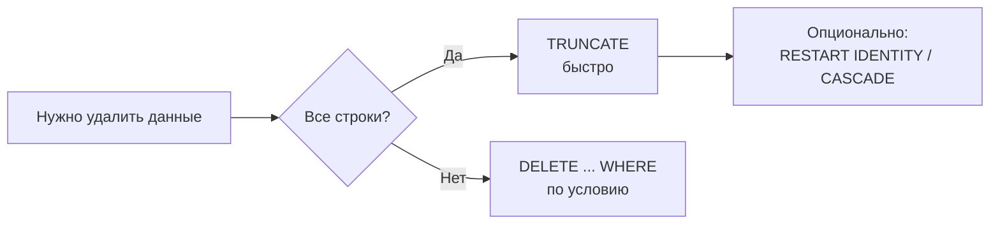
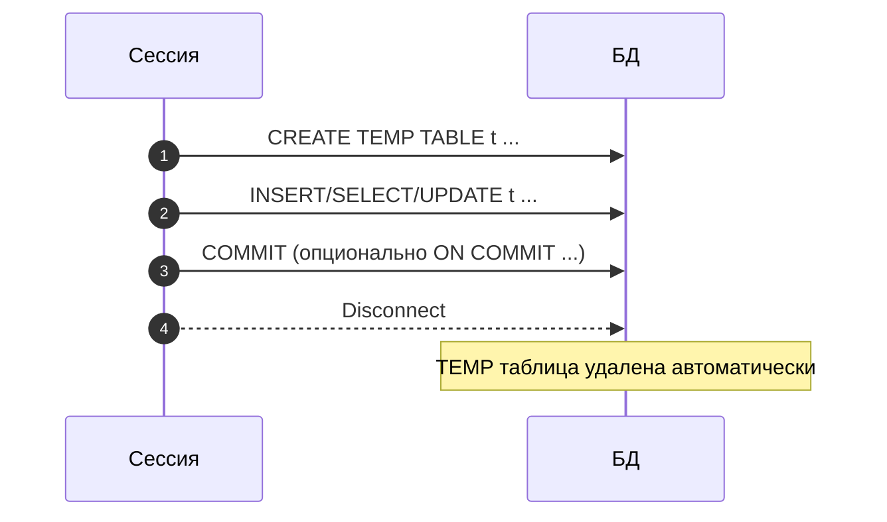

[← Назад к индексу части 2](index.md)

## 5. DDL: структура таблиц

### 5.1. Типы данных

**Цель раздела.**  
Понять, какие типы данных есть в SQL (особенно в PostgreSQL), как выбирать подходящий тип и чего стоит избегать. Неправильный тип — это не просто «некрасиво»: это лишний расход памяти, потеря точности, неочевидные баги и неэффективные индексы.

---

#### Зачем вообще нужны типы данных

В базе данных каждая колонка таблицы имеет **тип**. Тип говорит СУБД и тебе:

- **Какие значения можно туда писать** (например, только целые числа, только даты, только текст).
- **Как хранить значение** (сколько байт, в каком формате).
- **Какие операции допустимы** (с числами можно складывать, с датами — вычитать и получать разницу во времени).

Если бы типов не было, база не могла бы понять: «100» — это число сто, строка «100» или что-то ещё. От выбора типа зависит и корректность расчётов (деньги нельзя хранить в «плавающей точке» — будут копейки теряться), и скорость, и возможность строить индексы.

**Простыми словами:** тип данных — это «правила игры» для ячейки: что туда можно положить и как с этим можно работать.

```mermaid
flowchart TB
  Type[Тип данных] --> Store[Как хранить\n(размер/формат)]
  Type --> Ops[Какие операции\nдопустимы]
  Type --> Valid[Какие значения\nразрешены]
  Valid --> Cons[Ограничения/домены\n(NOT NULL/CHECK/DOMAIN)]
```

---

#### Термины

- **Тип данных (data type)** — множество допустимых значений и операций над ними. Например, `INTEGER` — целые числа от −2 147 483 648 до 2 147 483 647.
- **Домен (domain)** — тип + дополнительные ограничения. Например, «сумма заказа — `NUMERIC(12,2)`, и всегда ≥ 0».
- **Точность (precision)** — число значащих цифр. Для `NUMERIC(10,2)` это 10 знаков всего, из них 2 после запятой.
- **Масштаб (scale)** — число цифр после запятой.
- **Символьный тип** — строки. `TEXT`, `VARCHAR(n)`, `CHAR(n)`.
- **Двоичный тип** — `BYTEA` в PostgreSQL; хранит произвольные байты.
- **Составной тип (composite type)** — PostgreSQL поддерживает пользовательские типы, в которых несколько полей объединены в одно.

**Простыми словами:** когда мы пишем «колонка типа INTEGER», мы говорим: «здесь только целые числа в таком-то диапазоне». Когда пишем «NUMERIC(12,2)» — «число с фиксированной точностью: всего до 12 цифр, из них 2 после запятой (для копеек)».

---

#### Правила и синтаксис

##### Числовые типы

| Тип | Размер | Диапазон / Особенности |
|-----|--------|------------------------|
| `SMALLINT` | 2 байта | −32 768 … 32 767 |
| `INTEGER` (`INT`) | 4 байта | −2 147 483 648 … 2 147 483 647 |
| `BIGINT` | 8 байт | −9 × 10¹⁸ … 9 × 10¹⁸ |
| `NUMERIC(p, s)` / `DECIMAL(p, s)` | Переменный | Точный; **p** — всего значащих цифр (precision), **s** — из них после запятой (scale). Например, NUMERIC(10,2) — до 10 цифр всего, 2 после запятой: от -99 999 999.99 до 99 999 999.99 |
| `REAL` | 4 байта | ~6 знаков; IEEE 754, **неточный** |
| `DOUBLE PRECISION` (`FLOAT8`) | 8 байт | ~15 знаков; IEEE 754, **неточный** |
| `SERIAL` | 4 байта | `INTEGER` + sequence; устаревший способ автонумерации |
| `BIGSERIAL` | 8 байт | `BIGINT` + sequence; устаревший |

**Почему для денег нельзя использовать REAL и DOUBLE PRECISION (float).**

Числа с плавающей точкой (float) хранятся в памяти **приближённо**: компьютер представляет их в двоичной системе, и такие дроби, как 0.1 или 0.2, в двоичном виде становятся бесконечной дробью. Поэтому при сложении 0.1 + 0.2 получается не ровно 0.3, а что-то вроде 0.30000000000000004. В обычных расчётах это часто незаметно, но при тысячах операций копейки «уплывают», и в бухгалтерии это недопустимо.

**Что делать:** для любых денежных сумм, процентов, курсов — используй тип **NUMERIC** (или DECIMAL — это то же самое). Он хранит число **точно**, как ты его ввёл: фиксированное количество цифр до и после запятой. Сложение, вычитание, умножение дают ровно тот результат, который ожидается в математике.

**Пошагово на примере:**

1. Ты хранишь цену товара: 19.99 руб.
2. С FLOAT: внутри может храниться 19.989999999999998 или 20.000000000000004 — при выводе округлится, но при суммировании 1000 таких цен ошибка накопится.
3. С NUMERIC(10,2): хранится ровно 19.99. Сумма 1000 таких цен будет точной.

```sql
-- Плохо: потеря точности (проверь у себя в БД!)
SELECT 0.1::FLOAT8 + 0.2::FLOAT8;
-- Результат: 0.30000000000000004

-- Хорошо: точный результат
SELECT 0.1::NUMERIC + 0.2::NUMERIC;
-- Результат: 0.3
```

**Простыми словами:** целые числа (INTEGER, BIGINT) — для счётчиков, ID, количества штук. NUMERIC — для денег и всего, где важна точность до копейки. REAL/DOUBLE — только для научных расчётов, графиков, где небольшая погрешность допустима.

##### Строковые типы

| Тип | Особенности |
|-----|-------------|
| `TEXT` | Строка произвольной длины. В PostgreSQL это **предпочтительный** строковый тип. |
| `VARCHAR(n)` | Строка до n символов; если длина не указана — то же что TEXT. |
| `CHAR(n)` | Строка фиксированной длины, дополняется пробелами. Редко нужен. |

**В чём разница на практике.**

- **TEXT** — «строка любой длины». Имя пользователя, описание товара, комментарий — всё это TEXT. В PostgreSQL под капотом он хранится так же эффективно, как VARCHAR, поэтому смело используй TEXT везде, где не нужно жёстко ограничивать длину.
- **VARCHAR(n)** — «строка не длиннее n символов». Удобно, когда есть бизнес-правило: «код валюты ровно 3 буквы», «артикул не более 20 символов». Если вставишь длиннее — будет ошибка. Если не указать n (VARCHAR без числа) — в PostgreSQL это по сути то же, что TEXT.
- **CHAR(n)** — «ровно n символов; если меньше — дополняется пробелами справа». Например, CHAR(5) для значения «abc» сохранит «abc  » (два пробела). При сравнении и выводе это часто путает: кажется, что сравниваешь «abc» и «abc», а на самом деле «abc  » и «abc  ». В реальных проектах почти всегда достаточно TEXT или VARCHAR(n).

**Простыми словами:** для текста бери TEXT. Если нужно ограничение «не больше N символов» — VARCHAR(n). CHAR(n) лучше не трогать, пока не встретишь очень старый код или спецификацию, которая его требует.

```sql
-- В PostgreSQL TEXT и VARCHAR хранятся одинаково
CREATE TABLE example (
    name    TEXT,          -- предпочтительно
    code    VARCHAR(10),   -- ограничение длины явно
    status  CHAR(1)        -- почти никогда не нужен
);
```

##### Типы даты и времени

| Тип | Описание |
|-----|----------|
| `DATE` | Только дата: `2025-01-15` |
| `TIME` | Только время: `14:30:00` |
| `TIME WITH TIME ZONE` (`TIMETZ`) | Время + смещение; **редко нужен** |
| `TIMESTAMP` | Дата + время, **без часового пояса** |
| `TIMESTAMP WITH TIME ZONE` (`TIMESTAMPTZ`) | Дата + время, **хранится в UTC**, показывается в локальном TZ сессии |

**Почему для «момента времени» лучше TIMESTAMPTZ, а не TIMESTAMP.**

Представь: пользователь в Москве создаёт событие «встреча 15 июня 2025, 10:00». Сервер может быть в другом часовом поясе. Если сохранить это как **TIMESTAMP без часового пояса**, в базе будет просто «2025-06-15 10:00:00» — без привязки к месту. Когда пользователь из Владивостока откроет это событие, он увидит те же «10:00», хотя в его поясе это уже другое время. При смене сервера на летнее/зимнее время старые записи «поедут» — один и тот же момент времени может отображаться по-разному.

**TIMESTAMPTZ** решает это так: в базу всегда сохраняется **один и тот же момент времени в UTC** (всемирное координированное время). При вставке ты можешь указать время в любом поясе (например, `2025-06-15 10:00:00+03` — Москва); PostgreSQL переведёт в UTC и сохранит. При выборке СУБД покажет время в часовом поясе текущей сессии (или в том, который ты укажешь). То есть «момент» один — отображение зависит от того, кто смотрит и откуда.

**Пошагово:** 1) Пользователь вводит «10:00 Москва». 2) В БД хранится UTC (например, 07:00 UTC). 3) Другой пользователь в другом городе видит то же событие, но в своём времени (например, 12:00 у него). Все смотрят на один и тот же момент — просто в разных «часовых рамках».

```mermaid
flowchart LR
  In[Ввод: 2025-06-15 10:00 +03] --> UTC[Хранение: 07:00 UTC\n(TIMESTAMPTZ)]
  UTC --> Out1[Показ: +03 → 10:00]
  UTC --> Out2[Показ: +10 → 17:00]
```

**Простыми словами:** DATE — «какой день» (без времени). TIMESTAMPTZ — «точный момент в времени» с учётом часовых поясов; для логов, событий, «создано в» всегда бери TIMESTAMPTZ. **INTERVAL** — это не момент времени, а **длительность** (например, «2 часа 30 минут», «1 день», «3 месяца»). Удобен для длительности события, срока подписки или для вычислений с датой: `now() - INTERVAL '7 days'` — «неделю назад». Записывается строками вроде `'2 hours'`, `'1 day 12 hours'`, `'30 minutes'`.

```sql
-- Создание таблицы с датами
CREATE TABLE events (
    id          BIGINT GENERATED ALWAYS AS IDENTITY PRIMARY KEY,
    event_date  DATE,
    starts_at   TIMESTAMPTZ NOT NULL,
    duration    INTERVAL                 -- интервал времени: '2 hours 30 minutes', '1 day', хранится как «длина» промежутка
);

-- Вставка и преобразование
INSERT INTO events (event_date, starts_at, duration)
VALUES (
    '2025-06-15',
    '2025-06-15 10:00:00+03',
    '1 hour 30 minutes'
);
```

##### BOOLEAN

Тип «да/нет»: только три возможных значения — `TRUE`, `FALSE` и `NULL` (NULL = «неизвестно»). Удобен для флагов: включена ли опция, подтверждён ли заказ, удалён ли объект (soft delete). Часто колонку делают `NOT NULL DEFAULT FALSE`, чтобы не было неоднозначности с NULL.

**Простыми словами:** BOOLEAN — это «галочка»: да, нет или неизвестно.

```sql
-- TRUE, FALSE, NULL — три состояния
CREATE TABLE feature_flags (
    feature_name  TEXT PRIMARY KEY,
    is_enabled    BOOLEAN NOT NULL DEFAULT FALSE
);

INSERT INTO feature_flags VALUES ('dark_mode', TRUE);
INSERT INTO feature_flags VALUES ('beta_ui', FALSE);
```

##### UUID

UUID (Universally Unique Identifier) — 128-битный идентификатор, выглядящий как `550e8400-e29b-41d4-a716-446655440000`.

**Зачем:** UUID позволяет генерировать уникальные идентификаторы на стороне клиента без обращения к БД, что удобно в распределённых системах.

**Подводный камень:** случайные UUID (v4) ухудшают производительность B-tree индексов из-за хаотичной вставки. В PostgreSQL 17+ и через расширение `pg_idkit` есть UUID v7, который монотонно возрастает.

```sql
-- Подключить расширение для генерации UUID
CREATE EXTENSION IF NOT EXISTS "pgcrypto";

CREATE TABLE users (
    id         UUID DEFAULT gen_random_uuid() PRIMARY KEY,
    email      TEXT NOT NULL UNIQUE,
    created_at TIMESTAMPTZ NOT NULL DEFAULT now()
);

-- Вставка: UUID генерируется автоматически
INSERT INTO users (email) VALUES ('alice@example.com');
```

##### JSON и JSONB

В PostgreSQL два типа для JSON-документов:

| Тип | Хранение | Поиск по ключу | Индексы |
|-----|----------|----------------|---------|
| `JSON` | Текст «как есть», дубликаты ключей сохраняются | Медленно (парсинг каждый раз) | Нет GIN |
| `JSONB` | Бинарный разобранный формат | Быстро | GIN по всему документу |

**Правило:** почти всегда используй `JSONB`. `JSON` нужен только если важно сохранить точный исходный текст (с дублирующимися ключами или специфическим форматом). **GIN** (упомянут в таблице) — это тип индекса в PostgreSQL, который позволяет быстро искать по ключам и значениям внутри JSONB-документа; без такого индекса поиск «все товары, у которых color = blue» потребовал бы полного перебора строк.

```sql
CREATE TABLE products (
    id       BIGINT GENERATED ALWAYS AS IDENTITY PRIMARY KEY,
    name     TEXT NOT NULL,
    metadata JSONB                     -- атрибуты товара: цвет, размер и т.д.
);

-- Вставка JSONB-документа
INSERT INTO products (name, metadata) VALUES (
    'Куртка',
    '{"color": "blue", "sizes": ["S", "M", "L"], "brand": "Acme"}'
);

-- Запрос по ключу
SELECT name, metadata->>'color' AS color
FROM products
WHERE metadata @> '{"color": "blue"}';   -- @> = «содержит»
-- -> берёт значение по ключу и возвращает JSON/JSONB; ->> возвращает текст (удобно для вывода и сравнения). Например, metadata->'sizes' — массив как JSONB, metadata->>'color' — строка 'blue'.
```

##### Массивы

PostgreSQL поддерживает массивы любого типа: `INTEGER[]`, `TEXT[]`, `TIMESTAMPTZ[]` и т.д.

```sql
CREATE TABLE posts (
    id       BIGINT GENERATED ALWAYS AS IDENTITY PRIMARY KEY,
    title    TEXT NOT NULL,
    tags     TEXT[]          -- массив тегов
);

INSERT INTO posts (title, tags) VALUES
    ('SQL для начинающих', ARRAY['sql', 'database', 'tutorial']),
    ('PostgreSQL tips',    '{postgresql, performance, tips}');
-- Два способа записать массив: ARRAY['a', 'b'] (функция ARRAY) или '{a, b}' (литерал в фигурных скобках). Оба дают один и тот же тип (TEXT[]).

-- Поиск: массив содержит тег 'sql'
SELECT title FROM posts WHERE 'sql' = ANY(tags);   -- ANY: значение равно одному из элементов массива

-- Поиск: пересечение массивов (есть общий элемент)
SELECT title FROM posts WHERE tags && ARRAY['sql', 'python'];   -- &&: массивы пересекаются
```

**Когда использовать массивы:** если нужно хранить небольшой фиксированный набор простых значений (теги, роли), и вы не планируете JOIN по этим значениям. Для более сложных связей лучше выделить отдельную таблицу.

##### ENUM

`ENUM` — перечисление: тип с фиксированным набором строковых значений. Хранится компактно (4 байта, как `OID`).

```sql
-- Создание типа (один раз для всей БД)
CREATE TYPE order_status AS ENUM (
    'pending', 'confirmed', 'shipped', 'delivered', 'cancelled'
);

CREATE TABLE orders (
    id      BIGINT GENERATED ALWAYS AS IDENTITY PRIMARY KEY,
    status  order_status NOT NULL DEFAULT 'pending'
);

-- Добавление нового значения (нельзя удалить!)
ALTER TYPE order_status ADD VALUE 'refunded' AFTER 'delivered';
```

**Подводный камень:** из ENUM нельзя удалить значение без пересоздания типа. Часто проще использовать `TEXT` с `CHECK`-ограничением, если список может меняться.

**Когда выбирать ENUM, когда TEXT + CHECK.** ENUM удобен, когда набор значений **фиксирован** и редко меняется (статус заказа, тип пола), и ты готов добавлять новые значения только в конец через ALTER TYPE. Если значения могут удаляться или порядок важен для миграций — лучше колонка `TEXT` и ограничение `CHECK (status IN ('pending', 'paid', ...))`: тогда список можно менять через ALTER TABLE DROP/ADD CONSTRAINT без пересоздания типа.

##### Диапазонные типы

Типы диапазонов хранят «от и до»: интервал дат, интервал времени, интервал целых чисел. Удобны для бронирований (комната + период), расписаний, периодов действия скидок. Можно проверять пересечение (`&&`), вхождение точки в диапазон и т.д. В отличие от двух отдельных колонок (date_start, date_end), диапазон гарантирует, что «начало ≤ конец» и с ним удобно работать как с одним значением.

**Простыми словами:** диапазонный тип — «одно значение = отрезок» (например, с 1 июня по 10 июня). Используй, когда важно хранить именно отрезок и проверять пересечения или вхождение.

PostgreSQL имеет встроенные типы диапазонов:

| Тип | Описание |
|-----|----------|
| `int4range` | Диапазон целых чисел |
| `int8range` | Диапазон BIGINT |
| `numrange` | Диапазон NUMERIC |
| `daterange` | Диапазон дат |
| `tsrange` | Диапазон TIMESTAMP |
| `tstzrange` | Диапазон TIMESTAMPTZ |

```sql
-- Бронирование номеров в отеле
CREATE TABLE room_bookings (
    room_id     INTEGER NOT NULL,
    period      daterange NOT NULL,
    guest_name  TEXT NOT NULL
);

-- Проверка пересечения: нельзя забронировать дважды
SELECT * FROM room_bookings
WHERE room_id = 101
  AND period && '[2025-06-01, 2025-06-10)'::daterange;

-- Оператор && = перекрытие диапазонов
-- Запись диапазона: [ или ( — включить начало/конец, ] или ) — исключить.
-- [2025-06-01, 2025-06-10) = с 1 июня включительно по 10 июня исключительно (до 00:00 10-го).
```

##### Домен (CREATE DOMAIN)

**Домен** в SQL — это именованный тип с дополнительными ограничениями. По сути ты берёшь базовый тип (например, `NUMERIC(12,2)`) и добавляешь к нему проверку (например, «не меньше нуля»). Домен можно использовать как тип колонки в нескольких таблицах — тогда правило «сумма денег, не отрицательная» задаётся в одном месте и переиспользуется.

**Зачем:** чтобы не повторять один и тот же тип и CHECK в каждой таблице (например, «цена» или «процент» во многих таблицах). Изменил домен — все колонки этого домена автоматически подхватывают новое определение.

**Простыми словами:** домен — «тип с именем и встроенной проверкой», который можно подставлять вместо обычного типа в колонках.

```sql
-- Создать домен: сумма в рублях (неотрицательная, два знака после запятой)
CREATE DOMAIN rub_amount AS NUMERIC(15, 2)
    CHECK (VALUE >= 0);

-- Использовать как тип колонки
CREATE TABLE orders (
    id     BIGINT GENERATED ALWAYS AS IDENTITY PRIMARY KEY,
    total  rub_amount NOT NULL   -- то же, что NUMERIC(15,2) CHECK (total >= 0)
);

INSERT INTO orders (total) VALUES (99.99);   -- OK
INSERT INTO orders (total) VALUES (-1);       -- ошибка: нарушение CHECK домена
```

В Части II достаточно знать, что домен существует; углублённо типы и домены разбираются в Части IX (§66).

##### Составной тип (composite type)

**Составной тип** в PostgreSQL — это тип, объединяющий несколько полей в одно значение. Одна колонка может хранить, например, «точку» (x, y) или «адрес» (улица, город, индекс) как единое значение. Создаётся через `CREATE TYPE ... AS (поле тип, ...)`.

**Зачем:** когда логически «несколько полей» всегда идут вместе и ты хочешь передавать их одной переменной или возвращать одной колонкой из функции. В таблицах составные типы используются реже, чем отдельные колонки; чаще — в функциях и в некоторых системных каталогах PostgreSQL.

**Простыми словами:** составной тип — «одно значение из нескольких частей» (как структура в программировании).

```sql
-- Создать составной тип: координаты точки
CREATE TYPE point_2d AS (
    x NUMERIC,
    y NUMERIC
);

-- Таблица с колонкой составного типа
CREATE TABLE landmarks (
    id   BIGINT PRIMARY KEY,
    name TEXT NOT NULL,
    pos  point_2d
);

INSERT INTO landmarks (id, name, pos) VALUES (1, 'Башня', (10.5, 20.3));
-- Обращение к полям: pos.x, pos.y
SELECT name, (pos).x, (pos).y FROM landmarks;
```

Для уровня «основы» достаточно знать, что такие типы есть; на практике чаще используют отдельные колонки или JSONB.

---

#### Граничные случаи и типичные ошибки

- **`CHAR(n)` и пробелы.** `CHAR(5)` хранит `'abc'` как `'abc  '` (дополняет пробелами справа до 5 символов). При сравнении PostgreSQL считает `'abc'` и `'abc  '` равными для типа CHAR — это по стандарту SQL, но часто сбивает с толку. Ошибка: ожидаешь, что «короткая» строка не равна «длинной». Как не ошибиться: не используй CHAR; для кодов фиксированной длины лучше VARCHAR(n) с CHECK (length(col) = n) или просто VARCHAR(n).
- **`FLOAT` для денег.** Реальная ошибка в продакшне: хранили сумму в DOUBLE PRECISION, после тысяч транзакций сумма по счету не сходилась на копейки. Никогда не используй REAL/DOUBLE PRECISION для денег, процентов, курсов. Всегда NUMERIC(p, s), например NUMERIC(15,2) для сумм в рублях с копейками.
- **`TIMESTAMP` без TZ.** Если приложение работает с пользователями из разных городов или сервер может переехать в другой датацентр — данные, сохранённые в TIMESTAMP без пояса, могут «сдвинуться» при смене timezone сервера. Один и тот же момент будет отображаться по-разному. Решение: для любых «моментов времени» используй TIMESTAMPTZ.
- **UUID v4 и производительность.** UUID v4 (случайный) при вставке в B-tree индекс даёт почти случайный лист; индекс сильно ветвится, страницы редко переиспользуются. На таблицах в десятки миллионов строк вставки замедляются, индекс занимает больше места. Если нужны UUID — рассмотри UUID v7 (время-сортированный) или для внутренних ID используй BIGINT IDENTITY.
- **Большие JSON-документы.** Если в одной колонке JSONB хранятся документы по 50–100 КБ, то при `SELECT *` база вынуждена поднимать эти данные; запросы тормозят, память растёт. Храни в JSONB только то, по чему реально ищешь/фильтруешь; большие «болванки» лучше в отдельном хранилище или сжимать.

**Часто путают:** «пустая строка» и NULL. Пустая строка `''` — это значение (строка нулевой длины). NULL — «значения нет». В базе они различаются: `WHERE col = ''` и `WHERE col IS NULL` — разные условия.

---

#### Запомните

- Для строк — `TEXT` (если не нужно ограничение длины) или `VARCHAR(n)`.
- Для денег и точных дробей — `NUMERIC(p, s)`, не `FLOAT`.
- Для временных меток с часовым поясом — `TIMESTAMPTZ`.
- Для JSON-документов — `JSONB` (почти всегда).
- Для UUID автогенерации — `gen_random_uuid()` или `GENERATED ALWAYS AS IDENTITY`.
- `CHAR(n)` — практически никогда не нужен.
- `ENUM` — удобен, но нельзя удалить значение без пересоздания.
- **Домен** (CREATE DOMAIN) — именованный тип с CHECK; переиспользуется в нескольких таблицах.
- **Составной тип** — тип из нескольких полей (как структура); в основах встречается редко.

##### Вопросы для самопроверки (5.1)

1. Почему для хранения суммы заказа в рублях с копейками нельзя использовать `REAL` или `DOUBLE PRECISION`?  
   <details><summary>Ответ</summary>
   Типы с плавающей точкой хранят числа приближённо; при накоплении операций копейки «уплывают». Для денег нужен точный тип — `NUMERIC(p, s)` (или `DECIMAL`).
   </details>

2. В чём разница между `TIMESTAMP` и `TIMESTAMPTZ` и когда какой использовать?  
   <details><summary>Ответ</summary>
   `TIMESTAMP` хранит дату и время «как введено», без привязки к часовому поясу. `TIMESTAMPTZ` хранит момент в UTC и при выводе показывает в часовом поясе сессии. Для «момента времени» (создано в, произошло в) всегда используй `TIMESTAMPTZ`.
   </details>

3. Когда в PostgreSQL лучше выбрать `TEXT`, а когда `VARCHAR(n)`?  
   <details><summary>Ответ</summary>
   `TEXT` — строка любой длины, в PostgreSQL предпочтителен для произвольного текста. `VARCHAR(n)` — когда есть явное ограничение «не длиннее n символов» (артикул, код валюты). Хранятся одинаково эффективно.
   </details>

---

### 5.2. CREATE TABLE

**Цель раздела.**  
Научиться писать оператор `CREATE TABLE` правильно: объявлять колонки с типами, inline-ограничения, table-level ограничения и схемы.

---

#### Термины

- **DDL (Data Definition Language)** — подъязык SQL для определения структуры: CREATE, ALTER, DROP, TRUNCATE. То есть команды, которые **меняют схему** (структуру таблиц), а не сами данные в строках.
- **Inline constraint** — ограничение, объявленное прямо рядом с колонкой: `id INTEGER PRIMARY KEY`. Удобно для одного столбца.
- **Table constraint** — ограничение, объявленное после списка всех колонок: `CONSTRAINT pk_orders PRIMARY KEY (id)`. Нужно, когда ограничение касается нескольких столбцов (составной ключ) или когда хочешь дать ему явное имя.
- **Схема (schema)** — пространство имён в базе данных. Таблица `public.users` — это таблица с именем `users` в схеме `public`. Схемы помогают разнести объекты по логическим группам (например, `analytics.reports`, `app.users`).
- **`IF NOT EXISTS`** — безопасное создание: если таблица с таким именем уже есть, команда не выдаст ошибку, а просто ничего не сделает. Очень полезно в скриптах миграций и при повторном запуске.

**Простыми словами:** CREATE TABLE — это «нарисовать пустую таблицу с колонками и правилами». DDL — всё, что меняет «чертёж» базы (создать/удалить/изменить таблицу), а не содержимое ячеек.

---

#### Как читать CREATE TABLE по шагам

1. **Заголовок:** `CREATE TABLE [IF NOT EXISTS] имя_таблицы` — создаём таблицу с таким именем; IF NOT EXISTS страхует от падения, если она уже есть.
2. **Скобки `( ... )`** — внутри перечислены все колонки и ограничения.
3. **Каждая строка-колонка:** `имя_колонки тип [NOT NULL] [DEFAULT значение] [ограничения]`. Сначала имя, потом тип — это обязательно; остальное по необходимости.
4. **Ограничения на уровне таблицы** — в конце, через запятую, вида `CONSTRAINT имя PRIMARY KEY (колонка)` или `UNIQUE (col1, col2)`. Они относятся к таблице в целом (например, «первичный ключ — пара (user_id, role_id)»).

Когда видишь готовый CREATE TABLE, читай сверху вниз: какие колонки есть, какие у них типы, есть ли NOT NULL и DEFAULT, затем какие общие ограничения (PK, UNIQUE, CHECK, FK).

```mermaid
flowchart TB
  H[CREATE TABLE name] --> Cols[Колонки:\nname type [NOT NULL] [DEFAULT] ...]
  Cols --> CInline[Inline constraints\n(на 1 колонку)]
  Cols --> CTable[Table constraints\n(PK/UNIQUE/CHECK/FK\nв конце)]
```

---

#### Правила и синтаксис

```sql
CREATE TABLE [IF NOT EXISTS] [schema_name.]table_name (
    column_name  data_type  [column_constraint ...],
    column_name  data_type  [column_constraint ...],
    ...
    [table_constraint, ...]
);
```

Полный пример таблицы заказов:

```sql
CREATE TABLE orders (
    -- Автонумерация через IDENTITY (современный подход)
    id              BIGINT GENERATED ALWAYS AS IDENTITY,

    -- UUID версии 4 как альтернативный ключ
    external_id     UUID NOT NULL DEFAULT gen_random_uuid(),

    -- Внешний ключ (inline)
    user_id         BIGINT NOT NULL REFERENCES users(id) ON DELETE CASCADE,

    -- Перечисление через тип
    status          order_status NOT NULL DEFAULT 'pending',

    -- Точная сумма
    total_amount    NUMERIC(12, 2) NOT NULL,

    -- Временные метки с TZ
    created_at      TIMESTAMPTZ NOT NULL DEFAULT now(),
    updated_at      TIMESTAMPTZ NOT NULL DEFAULT now(),

    -- Необязательное поле с NULL
    shipped_at      TIMESTAMPTZ,

    -- Дополнительные атрибуты
    metadata        JSONB,

    -- Ограничения на уровне таблицы
    CONSTRAINT pk_orders         PRIMARY KEY (id),
    CONSTRAINT uq_orders_ext_id  UNIQUE (external_id),
    CONSTRAINT chk_amount_positive CHECK (total_amount >= 0)
);
```

##### Inline и table-level: когда что писать

**Inline-ограничение** — когда оно относится к **одной** колонке и пишется сразу после её типа, в той же строке. Примеры: `id BIGINT PRIMARY KEY`, `email TEXT NOT NULL UNIQUE`, `price NUMERIC(10,2) CHECK (price >= 0)`. Так удобно объявлять «эта колонка — первичный ключ» или «эта колонка не пустая».

**Table-level (ограничение на уровне таблицы)** — когда ограничение затрагивает **несколько колонок** или ты хочешь дать ему явное имя. Оно пишется после перечисления всех колонок, через запятую. Примеры: составной первичный ключ `PRIMARY KEY (user_id, role_id)` — одна колонка не может быть ключом, ключом является пара; составной UNIQUE `UNIQUE (product_id, currency)`; CHECK по нескольким столбцам `CHECK (status != 'paid' OR paid_at IS NOT NULL)`. **Важно:** составной PRIMARY KEY или составной UNIQUE нельзя объявить inline, только на уровне таблицы.

**Простыми словами:** если правило про одну колонку — можно написать рядом с ней (inline). Если правило про две и больше колонок или хочешь подписать ограничение именем — пиши в конце списка колонок (table-level).

##### Именование ограничений

Давай ограничениям явные имена через `CONSTRAINT name`. Это позволяет:
- читать внятные сообщения об ошибках (`violates constraint "chk_amount_positive"` лучше, чем `violates check constraint`);
- удалять/изменять конкретное ограничение по имени (`ALTER TABLE ... DROP CONSTRAINT chk_amount_positive`).

Соглашение об именах:
- `pk_<table>` — PRIMARY KEY
- `uq_<table>_<col>` — UNIQUE
- `fk_<table>_<ref_table>` — FOREIGN KEY
- `chk_<table>_<описание>` — CHECK

##### Создание таблицы из запроса

```sql
-- Создать таблицу и сразу заполнить данными из другой таблицы
CREATE TABLE orders_archive AS
    SELECT * FROM orders WHERE created_at < '2024-01-01';

-- Создать только структуру без данных
CREATE TABLE orders_archive AS
    SELECT * FROM orders WHERE FALSE;
```

**Важно:** `CREATE TABLE AS SELECT` не переносит ограничения (PRIMARY KEY, CHECK и т.д.) — только типы столбцов и данные. Если нужна полная копия структуры с ключами — создай новую таблицу через обычный CREATE TABLE с теми же колонками и ограничениями, затем перенеси данные: `INSERT INTO new_table SELECT * FROM old_table WHERE ...`.

**Что мы сделали в примере с orders (пошагово):** Сначала объявили колонки: `id` с автонумерацией, `external_id` как UUID по умолчанию, `user_id` со ссылкой на пользователя, `status` из перечисления, суммы и даты. Часть полей обязательные (NOT NULL), у части есть DEFAULT. В конце добавили ограничения на уровне таблицы: один первичный ключ, один уникальный ключ по external_id и проверку, что сумма не отрицательная. Так таблица сразу описывает и структуру, и правила целостности.

---

#### Граничные случаи и типичные ошибки

- **Забыть `IF NOT EXISTS`:** если скрипт создания запускается повторно (например, в CI/CD), без этого ключевого слова он упадёт с ошибкой.
- **Смешивать схемы:** таблица создаётся в `search_path` (обычно `public`). Если нужна конкретная схема — укажи явно: `CREATE TABLE myschema.users (...)`.
- **Inline vs table constraint:** для одной колонки можно писать inline; для составного ограничения (например, PRIMARY KEY из двух колонок) — только table constraint.

---

#### Запомните

- `CREATE TABLE IF NOT EXISTS` — безопасно для повторного запуска.
- Давай ограничениям явные имена (`CONSTRAINT name ...`).
- Составные ограничения (составной PK, составной UNIQUE) объявляй на уровне таблицы.
- `CREATE TABLE AS SELECT` копирует данные, но не ограничения.

##### Вопросы для самопроверки (5.2)

1. Чем inline-ограничение отличается от table-level ограничения и когда нужен второй?  
   <details><summary>Ответ</summary>
   Inline — объявляется рядом с колонкой (например, `id INTEGER PRIMARY KEY`). Table-level — после списка колонок. Для составного ключа (PK из двух колонок) или явного имени ограничения нужен table-level.
   </details>

2. Зачем использовать `CREATE TABLE IF NOT EXISTS`?  
   <details><summary>Ответ</summary>
   Чтобы при повторном запуске скрипта (миграции, деплой) команда не падала с ошибкой «таблица уже существует» — СУБД просто ничего не сделает.
   </details>

3. Копирует ли `CREATE TABLE new_t AS SELECT * FROM old_t` ограничения (PK, CHECK, FK) из исходной таблицы?  
   <details><summary>Ответ</summary>
   Нет. Копируются только структура колонок и данные. Ограничения нужно добавлять отдельно (ALTER TABLE или пересоздать таблицу с нужными ограничениями).
   </details>

---

### 5.3. ALTER TABLE, DROP, TRUNCATE

**Цель раздела.**  
Научиться изменять структуру существующих таблиц, удалять таблицы и быстро очищать их. Понять разницу между `DELETE` (DML) и `TRUNCATE` (DDL).

---

#### Термины

- **`ALTER TABLE`** — изменение структуры таблицы: добавление/удаление/переименование колонок, добавление/удаление ограничений.
- **`DROP TABLE`** — удаление таблицы вместе со всеми данными и ограничениями.
- **`TRUNCATE`** — быстрое удаление **всех строк** таблицы. Операция DDL: она не пишет каждую удалённую строку в WAL (журнал изменений) по одной, а помечает таблицу как пустую «оптом», поэтому значительно быстрее `DELETE FROM table` без WHERE.
- **`CASCADE`** (в DROP/TRUNCATE) — автоматически удалить/очистить зависимые объекты.
- **`RESTRICT`** — отказать, если есть зависимые объекты (поведение по умолчанию).

**Простыми словами:** ALTER — «переделать таблицу (добавить колонку, переименовать и т.д.)». DROP — «удалить таблицу полностью, вместе с данными». TRUNCATE — «оставить таблицу, но выкинуть все строки разом и очень быстро».

---

#### Правила и синтаксис

##### Добавление колонки

```sql
ALTER TABLE orders
    ADD COLUMN note TEXT;                            -- nullable, без умолчания

ALTER TABLE orders
    ADD COLUMN priority INTEGER NOT NULL DEFAULT 0;  -- с умолчанием
```

**Важно:** в PostgreSQL 11+ добавление колонки с `NOT NULL DEFAULT <константа>` — мгновенная операция (не переписывает строки). В более ранних версиях — полная перезапись таблицы.

**Если в таблице уже есть данные и ты добавляешь колонку NOT NULL без DEFAULT:** команда выдаст ошибку — существующим строкам нечего подставить в новую колонку. Что делать по шагам: 1) Добавь колонку как nullable или с DEFAULT: `ADD COLUMN new_col TEXT` или `ADD COLUMN new_col TEXT NOT NULL DEFAULT 'unknown'`. 2) Если добавил nullable — заполни пропуски: `UPDATE table SET new_col = 'value' WHERE new_col IS NULL`. 3) Когда во всех строках есть значение — сделай колонку NOT NULL: `ALTER TABLE table ALTER COLUMN new_col SET NOT NULL`.

##### Удаление колонки

```sql
ALTER TABLE orders
    DROP COLUMN note;

-- Если на колонку ссылаются другие объекты (индексы, ограничения) — можно форсировать
ALTER TABLE orders
    DROP COLUMN note CASCADE;
```

##### Изменение типа колонки

```sql
-- Изменение типа — может потребовать перезапись всех строк!
ALTER TABLE orders
    ALTER COLUMN priority TYPE BIGINT;

-- Если тип несовместим — нужен USING для явного преобразования
ALTER TABLE orders
    ALTER COLUMN status TYPE TEXT USING status::TEXT;
-- USING указывает, как превратить старое значение в новое (например, enum в текст — status::TEXT). Без USING СУБД попытается автоматическое приведение; если его нет — будет ошибка.
```

**Осторожно:** изменение типа блокирует таблицу на время операции. На больших таблицах это проблема. Используй стратегии zero-downtime migration (тема продвинутого уровня).

##### Переименование

```sql
ALTER TABLE orders RENAME TO purchase_orders;

ALTER TABLE purchase_orders RENAME COLUMN note TO customer_note;
```

##### Добавление/удаление ограничений

```sql
-- Добавить CHECK
ALTER TABLE orders
    ADD CONSTRAINT chk_priority CHECK (priority BETWEEN 1 AND 5);

-- Удалить ограничение по имени
ALTER TABLE orders
    DROP CONSTRAINT chk_priority;

-- Сделать колонку NOT NULL
ALTER TABLE orders
    ALTER COLUMN customer_name SET NOT NULL;

-- Снять NOT NULL
ALTER TABLE orders
    ALTER COLUMN customer_name DROP NOT NULL;
```

##### DROP TABLE

```sql
-- Простое удаление
DROP TABLE orders;

-- Безопасное удаление (не падает, если таблица не существует)
DROP TABLE IF EXISTS orders;

-- Удалить вместе с зависимыми объектами (представления, FK)
DROP TABLE orders CASCADE;
```

##### TRUNCATE vs DELETE

| Критерий | `DELETE FROM t` | `TRUNCATE t` |
|----------|----------------|--------------|
| Скорость | Медленно (по строке) | Очень быстро |
| WAL | Каждая строка в WAL | Нет per-row WAL |
| Триггеры | `BEFORE/AFTER DELETE` срабатывают | Только `TRUNCATE`-триггеры |
| Транзакционность | Да (можно ROLLBACK) | Да (в PostgreSQL) |
| MVCC | Строки видны другим транзакциям до COMMIT | Нет, данные исчезают сразу для всех |
| Автоинкремент | Не сбрасывается | Сбрасывается с `RESTART IDENTITY` |
| WHERE | Поддерживает | Не поддерживает |

**Когда что использовать.** Нужно удалить **все** строки из таблицы и тебе не нужны построчные триггеры и не важен порядок/атомарность по строкам — используй **TRUNCATE**: быстрее и меньше нагрузка на WAL. Нужно удалить **только часть** строк по условию (например, «все заказы старше 5 лет») — только **DELETE** с WHERE. Никогда не пиши DELETE без WHERE, если не хочешь очистить всю таблицу: это частая причина потери данных.



```sql
-- Очистить таблицу и сбросить счётчик ID
TRUNCATE TABLE orders RESTART IDENTITY;

-- Очистить таблицу + связанные (через FK) таблицы
TRUNCATE TABLE orders CASCADE;
```

---

#### Граничные случаи и типичные ошибки

- **DROP TABLE без CASCADE:** если на таблицу ссылается внешний ключ из другой таблицы, команда упадёт с ошибкой. Это защита — не игнорируй её. Сначала удали зависимые таблицы или FK-ограничения.
- **ALTER COLUMN TYPE на живой таблице:** блокирует таблицу. На продакшне это критично.
- **TRUNCATE и транзакции:** в PostgreSQL TRUNCATE транзакционна. Но после TRUNCATE в транзакции, если другая сессия делала COMMIT между началом транзакции и TRUNCATE — поведение может удивить.
- **TRUNCATE сбрасывает SEQUENCE:** при `RESTART IDENTITY` счётчик обнуляется, и следующий INSERT получит id=1. Если у тебя WHERE-то хранятся старые ID — будет коллизия.

---

#### Запомните

- `ALTER TABLE ADD COLUMN` с константным DEFAULT — быстро в PG 11+.
- `ALTER COLUMN TYPE` — медленно на больших таблицах, блокирует.
- `DROP TABLE CASCADE` — опасно, удаляет зависимые объекты.
- `TRUNCATE` намного быстрее `DELETE FROM t` без WHERE, но нет фильтрации и нет per-row триггеров.
- `TRUNCATE ... RESTART IDENTITY` — сбрасывает счётчики последовательностей.

##### Вопросы для самопроверки (5.3)

1. В чём главное отличие TRUNCATE от DELETE FROM table?  
   <details><summary>Ответ</summary>
   TRUNCATE — DDL: удаляет все строки «оптом», без записи каждой в WAL, очень быстро; не поддерживает WHERE. DELETE — DML: удаляет по строкам, можно с WHERE; триггеры DELETE срабатывают.
   </details>

2. Можно ли добавить колонку NOT NULL к таблице, где уже есть строки, без DEFAULT?  
   <details><summary>Ответ</summary>
   Нет. Существующим строкам нечего подставить. Сначала добавь колонку nullable или с DEFAULT, заполни данные, затем ALTER COLUMN ... SET NOT NULL.
   </details>

3. Что делает TRUNCATE ... RESTART IDENTITY?  
   <details><summary>Ответ</summary>
   Очищает таблицу и сбрасывает связанные последовательности (SERIAL/IDENTITY), так что следующий INSERT получит id=1 (или начальное значение последовательности).
   </details>

---

### 5.4. Временные таблицы

**Цель раздела.**  
Разобраться, когда и зачем использовать временные таблицы, как они работают и в чём их ограничения.

---

#### Термины

- **Временная таблица (temporary table)** — таблица, которая существует только в рамках текущей сессии (или транзакции) и автоматически удаляется при её завершении.
- **Сессия** — одно соединение клиента с сервером СУБД.
- **`ON COMMIT`** — поведение временной таблицы при завершении транзакции.

**Простыми словами:** временная таблица живёт только пока открыто твоё подключение к базе (или до конца транзакции, если указано ON COMMIT DROP). Другие пользователи её не видят. Удобно для промежуточных расчётов в скрипте или для временного склада данных перед вставкой в постоянные таблицы. После отключения от БД таблица исчезает.



---

#### Правила и синтаксис

```sql
-- Создать временную таблицу
CREATE TEMPORARY TABLE temp_calculation (
    user_id   BIGINT,
    total     NUMERIC(12,2)
);

-- Сокращённое ключевое слово
CREATE TEMP TABLE temp_calc2 (id BIGINT);

-- Поведение при COMMIT транзакции:
-- ON COMMIT PRESERVE ROWS  — строки остаются (по умолчанию)
-- ON COMMIT DELETE ROWS    — строки удаляются, таблица остаётся
-- ON COMMIT DROP           — таблица удаляется

CREATE TEMP TABLE session_cache (
    key   TEXT,
    value TEXT
) ON COMMIT DELETE ROWS;
```

##### Когда использовать

```sql
-- 1. Промежуточные вычисления в сложном запросе
CREATE TEMP TABLE top_users AS
    SELECT user_id, SUM(amount) AS total
    FROM orders
    GROUP BY user_id
    ORDER BY total DESC
    LIMIT 100;

-- Затем использовать в другом запросе
SELECT u.name, t.total
FROM top_users t
JOIN users u ON u.id = t.user_id;

-- 2. Staging при массовой загрузке
CREATE TEMP TABLE import_staging (
    raw_data TEXT
);

COPY import_staging FROM '/tmp/data.csv';

-- Очистить и нормализовать данные перед вставкой в основную таблицу
INSERT INTO products (name, price)
SELECT
    trim(split_part(raw_data, ',', 1)),
    trim(split_part(raw_data, ',', 2))::NUMERIC
FROM import_staging
WHERE raw_data IS NOT NULL;
```

##### Особенности в PostgreSQL

- Временные таблицы видны **только** текущей сессии.
- Они создаются в специальной схеме `pg_temp` (автоматически).
- На временные таблицы **нельзя** создавать внешние ключи из постоянных таблиц.
- Временные таблицы **не** попадают в репликацию.
- `autovacuum` не работает на временных таблицах (сессия завершается — таблица удаляется).

---

#### Граничные случаи и типичные ошибки

- **Конфликт имён:** если создать `TEMP TABLE users`, то внутри сессии `users` будет ссылаться на временную таблицу, а не на постоянную (схема `pg_temp` приоритетна). Это может скрыть баги.
- **Размер:** временные таблицы хранятся в `temp_tablespace`. При больших объёмах данных (миллионы строк) проверь, достаточно ли места.
- **CTE как альтернатива:** CTE (Common Table Expression) — это конструкция `WITH имя AS (SELECT ...)` в начале запроса: подзапросу даётся имя, и дальше к нему можно обращаться как к таблице. Временную таблицу при этом создавать не нужно. Но CTE по умолчанию может вычисляться заново при каждом обращении; для тяжёлых промежуточных результатов временная таблица (один раз посчитал — несколько раз использовал) иногда выгоднее.

---

#### Запомните

- Временная таблица живёт в рамках сессии (или транзакции, если `ON COMMIT DROP`).
- Используй для промежуточных вычислений и staging.
- Не забывай: имя временной таблицы имеет приоритет над постоянной таблицей с тем же именем.

##### Вопросы для самопроверки (5.4)

1. Чем временная таблица отличается от обычной по видимости и времени жизни?  
   <details><summary>Ответ</summary>
   Временная таблица видна только в текущей сессии; после отключения от БД (или при ON COMMIT DROP — до конца транзакции) она исчезает. Другие сессии её не видят.
   </details>

2. Что означает ON COMMIT DROP ROWS для временной таблицы?  
   <details><summary>Ответ</summary>
   В конце транзакции (COMMIT/ROLLBACK) все строки из таблицы удаляются, но сама таблица остаётся; при следующей транзакции она снова пустая.
   </details>

3. Работает ли autovacuum на временных таблицах?  
   <details><summary>Ответ</summary>
   Нет. Временные таблицы при завершении сессии удаляются, поэтому autovacuum для них не запускается.
   </details>

---

**Связь с разделом 6.** Ограничения (раздел 6) — это те самые «правила» для таблиц и колонок: уникальность (PK, UNIQUE), обязательность полей (NOT NULL), проверки (CHECK) и ссылки на другие таблицы (FOREIGN KEY). Сначала ты научился объявлять колонки и типы (раздел 5); теперь — как запретить некорректные данные с помощью ограничений.

**Перед тем как переходить к разделу 6 (Ограничения), проверь себя.** Можешь ли ты: назвать тип для денег и объяснить, почему не FLOAT; объяснить, зачем для «момента времени» нужен TIMESTAMPTZ; написать CREATE TABLE с несколькими колонками и одним PRIMARY KEY; сказать, в чём разница между ALTER TABLE, DROP TABLE и TRUNCATE и когда что использовать? Если что-то из этого «плывёт» — перечитай блок «Запомните» в разделах 5.1–5.4 и примеры с комментариями.

---

---

<!-- prev-next-nav -->
*[← Часть II. SQL — основы](00_vvedenie_marshrut_i_oglavlenie.md) | [→ 6. Ограничения](02_6_ogranicheniya.md)*
