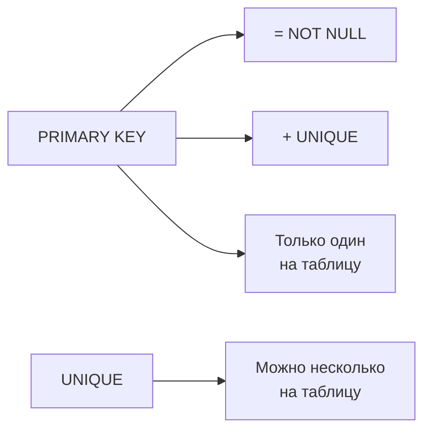
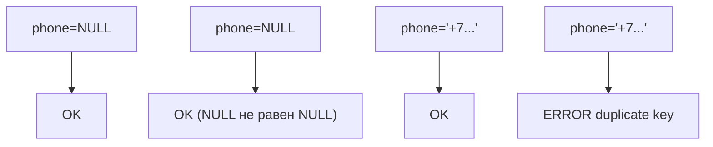
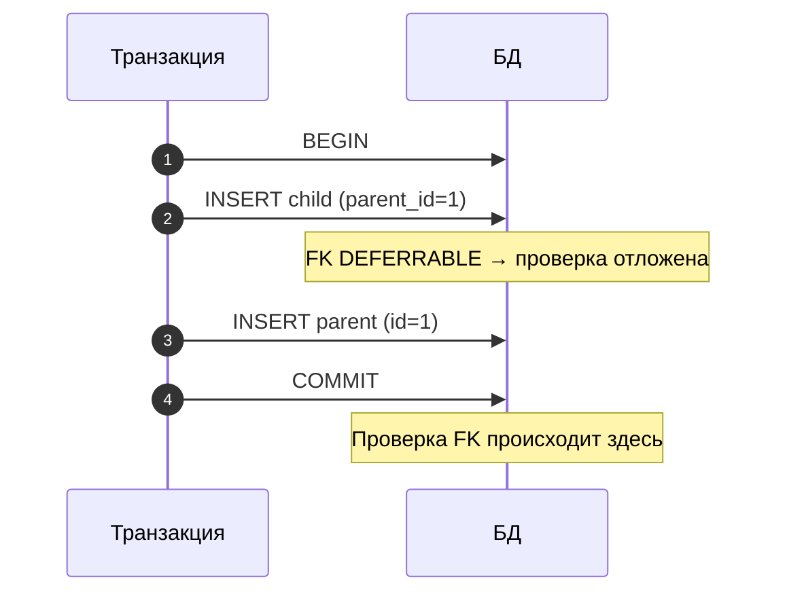
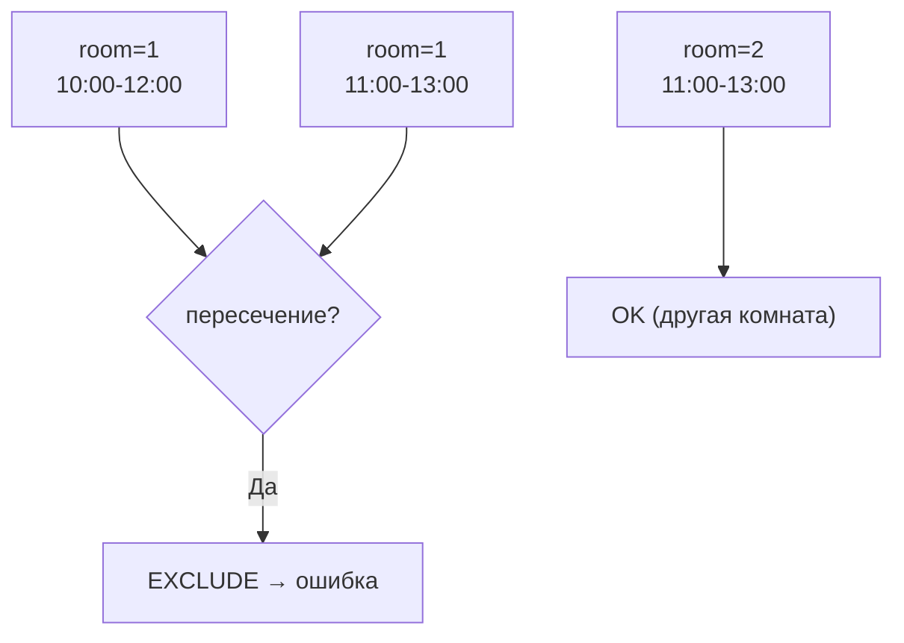

[← Назад к индексу части 2](index.md)

## 6. Ограничения

### 6.1. PRIMARY KEY и UNIQUE

**Цель раздела.**  
Понять, как СУБД обеспечивает уникальность строк, чем отличаются PRIMARY KEY и UNIQUE и как работают составные ключи.

---

#### Термины

- **PRIMARY KEY (первичный ключ)** — ограничение, которое одновременно означает `NOT NULL` + `UNIQUE`. В таблице может быть **только один** PRIMARY KEY. По нему СУБД и приложение однозначно идентифицируют строку («заказ № 42», «пользователь с id=7»). Автоматически создаётся **B-tree индекс** для быстрого поиска по этому ключу (B-tree — структура данных, позволяющая быстро искать по значению и по диапазону без перебора всех строк).
- **UNIQUE** — ограничение уникальности: в столбце (или комбинации столбцов) не может быть двух одинаковых значений. В одной таблице может быть **несколько** UNIQUE-ограничений (например, уникальный email и уникальный номер паспорта). NULL-значения **не** считаются дублями друг друга — два NULL в UNIQUE-столбце допустимы.
- **Составной ключ (composite key)** — ключ из двух и более столбцов. Например, первичный ключ таблицы «заказ–товар» — пара (order_id, product_id): одна и та же пара не может встретиться дважды.
- **Суррогатный ключ** — искусственный идентификатор (BIGINT IDENTITY, UUID), не несущий бизнес-смысла. Нужен только чтобы отличать строки друг от друга.
- **Естественный ключ** — ключ из данных предметной области (email, ИНН, код товара). Удобен, когда такое значение и так уникально и не меняется.

**Простыми словами:** PRIMARY KEY — «главный способ назвать строку одной фразой» (один такой способ на таблицу). UNIQUE — «это поле (или комбинация полей) не должно повторяться», таких правил может быть несколько. Составной ключ — когда «уникальна не одна колонка, а пара или тройка».



---

#### Правила и синтаксис

```sql
-- PRIMARY KEY inline (один столбец)
CREATE TABLE users (
    id    BIGINT GENERATED ALWAYS AS IDENTITY PRIMARY KEY,
    email TEXT NOT NULL UNIQUE
);

-- PRIMARY KEY на уровне таблицы (явное именование)
CREATE TABLE users (
    id    BIGINT GENERATED ALWAYS AS IDENTITY,
    email TEXT NOT NULL,

    CONSTRAINT pk_users     PRIMARY KEY (id),
    CONSTRAINT uq_users_email UNIQUE (email)
);

-- Составной PRIMARY KEY (связующая таблица N:M)
CREATE TABLE user_roles (
    user_id  BIGINT NOT NULL REFERENCES users(id),
    role_id  BIGINT NOT NULL REFERENCES roles(id),

    CONSTRAINT pk_user_roles PRIMARY KEY (user_id, role_id)
);

-- Составной UNIQUE
CREATE TABLE product_prices (
    product_id   BIGINT NOT NULL,
    currency     CHAR(3) NOT NULL,
    price        NUMERIC(12,4) NOT NULL,

    -- Одна цена на продукт/валюту
    CONSTRAINT uq_price_per_currency UNIQUE (product_id, currency)
);
```

##### NULL в UNIQUE

В SQL выражение `NULL = NULL` даёт не TRUE, а **NULL** (неизвестно). Поэтому «два NULL» с точки зрения уникальности не считаются «одинаковыми значениями»: база не может сказать, что они равны. По стандарту SQL в UNIQUE-столбце может быть много строк с NULL — они не нарушают ограничение уникальности.

**Пошагово:** 1) Вставляем первую строку с phone = NULL — OK. 2) Вставляем вторую строку тоже с phone = NULL — в большинстве СУБД (в т.ч. PostgreSQL) это тоже OK, потому что «второй NULL» не считается дубликатом первого. 3) Вставляем phone = '+79001234567' — OK. 4) Пытаемся вставить ещё раз '+79001234567' — ошибка: дубликат уникального значения.



```sql
CREATE TABLE contacts (
    id     BIGINT GENERATED ALWAYS AS IDENTITY PRIMARY KEY,
    phone  TEXT UNIQUE    -- NULL-значения не считаются дублями
);

-- Оба INSERT пройдут, т.к. NULL != NULL в контексте UNIQUE
INSERT INTO contacts (phone) VALUES (NULL);
INSERT INTO contacts (phone) VALUES (NULL);

-- А это вызовет ошибку:
INSERT INTO contacts (phone) VALUES ('+79001234567');
INSERT INTO contacts (phone) VALUES ('+79001234567');  -- ERROR: duplicate key
```

---

#### Граничные случаи и типичные ошибки

- **Два PRIMARY KEY:** в одной таблице может быть только один первичный ключ. Если попытаться добавить второй (например, ещё один столбец с PRIMARY KEY или второе ограничение CONSTRAINT pk2 PRIMARY KEY (...)) — СУБД выдаст ошибку. Для других полей, которые должны быть уникальными (email, номер паспорта), используй ограничение **UNIQUE**. UNIQUE-ограничений может быть несколько.
- **Составной PK и FK:** если первичный ключ составной (например, (user_id, role_id)), то внешний ключ из другой таблицы должен ссылаться на **обе** колонки: `FOREIGN KEY (user_id, role_id) REFERENCES user_roles(user_id, role_id)`. Нельзя ссылаться только на одну часть составного ключа — ссылка должна однозначно указывать на строку родителя.
- **UNIQUE и NULL:** стандарт SQL допускает несколько NULL в UNIQUE-столбце (т.к. NULL ≠ NULL). В PostgreSQL это так и работает.
- **Индекс при PK:** PRIMARY KEY автоматически создаёт индекс. UNIQUE тоже. Не нужно создавать отдельный `CREATE INDEX` для этих полей.

---

#### Запомните

- PRIMARY KEY = NOT NULL + UNIQUE, только один на таблицу.
- UNIQUE допускает несколько NULL (они не считаются дублями).
- Составные ключи объявляются только на уровне таблицы.
- PK и UNIQUE автоматически создают B-tree индекс.

##### Вопросы для самопроверки (6.1)

1. Сколько PRIMARY KEY может быть у одной таблицы и чем UNIQUE от него отличается в этом смысле?  
   <details><summary>Ответ</summary>
   PRIMARY KEY — только один на таблицу. UNIQUE-ограничений может быть несколько (несколько полей или комбинаций полей могут быть уникальными).
   </details>

2. Как в PostgreSQL ведёт себя UNIQUE-столбец по отношению к NULL?  
   <details><summary>Ответ</summary>
   В UNIQUE-столбце допускается несколько строк с NULL: NULL не считается равным NULL, поэтому дубликатом не является.
   </details>

3. Где объявляется составной первичный ключ — inline у колонки или на уровне таблицы?  
   <details><summary>Ответ</summary>
   Только на уровне таблицы: CONSTRAINT pk_name PRIMARY KEY (col1, col2). Inline PRIMARY KEY применим только к одной колонке.
   </details>

---

### 6.2. NOT NULL и CHECK

**Цель раздела.**  
Научиться запрещать NULL-значения там, где они не имеют смысла, и задавать произвольные условия на значения столбцов.

---

#### Термины

- **NULL** — отсутствие значения (не пустая строка и не 0). NULL требует особой логики (трёхзначная логика, см. Часть III).
- **`NOT NULL`** — ограничение, запрещающее NULL в столбце.
- **`CHECK`** — ограничение с произвольным булевым выражением. Строка проходит проверку, если выражение возвращает TRUE или NULL (не FALSE).
- **Именованное ограничение** — ограничение с явным именем (`CONSTRAINT name CHECK (...)`), что помогает при отладке.

**Простыми словами:** NOT NULL — «эта ячейка обязательно должна быть заполнена». CHECK — «значение (или комбинация значений) должно удовлетворять условию» (например, цена ≥ 0, статус из списка). Важно: CHECK не считает NULL нарушением — если нужно запретить и NULL, добавляй NOT NULL отдельно.

```mermaid
flowchart LR
  Col["col"] --> NN2{"NOT NULL?"}
  NN2 -->|NULL| ErrNN["Ошибка"]
  NN2 -->|не NULL| Check["CHECK("expr")"]
  Check --> Pass{"expr = FALSE?"}
  Pass -->|Да| ErrChk["Ошибка"]
  Pass -->|Нет (TRUE или NULL)| Ok["OK"]
```

---

#### Правила и синтаксис

```sql
-- NOT NULL inline
CREATE TABLE employees (
    id          BIGINT GENERATED ALWAYS AS IDENTITY PRIMARY KEY,
    first_name  TEXT NOT NULL,
    last_name   TEXT NOT NULL,
    email       TEXT NOT NULL UNIQUE,
    salary      NUMERIC(12, 2) NOT NULL,
    birth_date  DATE,                         -- nullable: может быть неизвестна
    department  TEXT NOT NULL DEFAULT 'General'
);

-- CHECK inline
CREATE TABLE products (
    id     BIGINT GENERATED ALWAYS AS IDENTITY PRIMARY KEY,
    name   TEXT NOT NULL,
    price  NUMERIC(12, 2) NOT NULL CHECK (price >= 0),
    stock  INTEGER NOT NULL CHECK (stock >= 0)
);

-- CHECK с именем и на уровне таблицы
CREATE TABLE payments (
    id          BIGINT GENERATED ALWAYS AS IDENTITY,
    amount      NUMERIC(12, 2) NOT NULL,
    currency    CHAR(3) NOT NULL,
    paid_at     TIMESTAMPTZ,
    status      TEXT NOT NULL DEFAULT 'pending',

    CONSTRAINT pk_payments         PRIMARY KEY (id),
    CONSTRAINT chk_amount_positive CHECK (amount > 0),
    CONSTRAINT chk_currency_code   CHECK (currency ~ '^[A-Z]{3}$'),  -- ровно 3 латинские заглавные буквы (код валюты)
    CONSTRAINT chk_valid_status    CHECK (status IN ('pending', 'paid', 'failed', 'refunded')),

    -- CHECK, использующий несколько столбцов
    CONSTRAINT chk_paid_has_date   CHECK (
        status != 'paid' OR paid_at IS NOT NULL
    )
);
```

##### Добавление/удаление NOT NULL и CHECK после создания

```sql
-- Добавить NOT NULL (требует, чтобы в колонке не было NULL!)
ALTER TABLE employees ALTER COLUMN department SET NOT NULL;

-- Снять NOT NULL
ALTER TABLE employees ALTER COLUMN department DROP NOT NULL;

-- Добавить CHECK
ALTER TABLE employees
    ADD CONSTRAINT chk_salary_positive CHECK (salary > 0);

-- Удалить CHECK
ALTER TABLE employees
    DROP CONSTRAINT chk_salary_positive;
```

##### Важный нюанс: CHECK и NULL

В SQL сравнение с NULL даёт не TRUE и не FALSE, а **NULL** («неизвестно»). Правило для CHECK: строка **не проходит** проверку только если выражение вернуло **FALSE**. Если выражение вернуло TRUE — ок. Если вернуло **NULL** — это тоже считается «не FALSE», и строка **проходит** проверку. Поэтому при `price = NULL` выражение `price >= 0` даёт NULL, и ограничение CHECK не срабатывает — в таблицу можно вставить NULL в колонке price. Чтобы запретить и NULL, и отрицательные значения, нужно два ограничения: **NOT NULL** (запрет пустого значения) и **CHECK (price >= 0)** (запрет отрицательного).

**Как запомнить:** CHECK отсекает только явное FALSE. NULL в условии даёт NULL — и строка не отсекается. Значит, «запрет NULL» — это всегда отдельно NOT NULL.

---

#### Граничные случаи и типичные ошибки

- **`CHECK` не ловит NULL:** `CHECK (col = 'active')` не запрещает NULL — нужен отдельный `NOT NULL`.
- **Межтабличная проверка в CHECK:** CHECK не может ссылаться на другие таблицы (например, `CHECK (user_id IN (SELECT id FROM users))`). Для этого используй FOREIGN KEY или триггеры.
- **NOT NULL при добавлении колонки:** если добавляешь колонку `NOT NULL` без DEFAULT к таблице с данными — получишь ошибку. Сначала добавь колонку с DEFAULT или nullable, заполни данные, потом поставь NOT NULL.
- **Именование CHECK:** без явного имени СУБД генерирует `"payments_status_check"` или похожее. При ошибке понять, какой именно CHECK сработал, сложнее.

---

#### Запомните

- NOT NULL запрещает NULL; добавляй везде, где NULL не имеет смысла.
- CHECK проверяет условие; при значении NULL условие не считается нарушенным (оно даёт NULL, а не FALSE).
- Давай CHECK-ограничениям явные имена.
- CHECK не может ссылаться на другие таблицы.

##### Вопросы для самопроверки (6.2)

1. Запрещает ли ограничение CHECK (price >= 0) вставку NULL в колонку price?  
   <details><summary>Ответ</summary>
   Нет. В SQL сравнение с NULL даёт NULL; CHECK отсекает только FALSE. Чтобы запретить и NULL, и отрицательные значения, нужны NOT NULL и CHECK (price >= 0).
   </details>

2. Зачем давать CHECK-ограничениям явные имена (CONSTRAINT name CHECK (...))?  
   <details><summary>Ответ</summary>
   При нарушении ограничения в сообщении об ошибке будет указано имя; так проще понять, какое именно условие не выполнилось, и удалить/изменить ограничение по имени.
   </details>

3. Может ли CHECK ссылаться на другую таблицу (например, проверить, что user_id есть в users)?  
   <details><summary>Ответ</summary>
   Нет. CHECK не может содержать подзапросы к другим таблицам. Для такой проверки используют FOREIGN KEY или триггеры.
   </details>

---

### 6.3. FOREIGN KEY и каскады

**Цель раздела.**  
Понять, как FOREIGN KEY обеспечивает ссылочную целостность и что происходит при удалении/обновлении родительских строк.

---

#### Кто «родитель», кто «дочерняя» таблица

**Родительская (референсная) таблица** — та, **на которую** ссылаются. В ней хранится «источник истины»: например, таблица `users` с id пользователей. **Дочерняя таблица** — та, **в которой** стоит столбец с внешним ключом: например, таблица `orders`, в ней колонка `user_id` ссылается на `users(id)`. То есть: заказ «принадлежит» пользователю; пользователь — родитель, заказы — дети. Запомни: FK всегда объявляется в дочерней таблице и указывает на родительскую (REFERENCES родитель(колонка)).

---

#### Термины

- **FOREIGN KEY (FK, внешний ключ)** — ограничение, которое гарантирует: значение в столбце либо NULL, либо **существует** в указанной колонке родительской таблицы. Нельзя вставить в заказы user_id = 999, если пользователя с id = 999 нет.
- **Референсная (родительская) таблица** — та, на которую ссылается FK (например, `users`).
- **Дочерняя таблица** — та, в которой объявлен FK (например, `orders` с колонкой `user_id`).
- **Ссылочная целостность (referential integrity)** — состояние БД, в котором нет «висячих» ссылок: все значения во внешних ключах указывают на существующие строки.
- **Каскадное действие** — что СУБД делает с дочерними строками, когда удаляют или обновляют родительскую строку (удалить заказы? обнулить user_id? запретить удаление?).

---

#### Правила и синтаксис

```sql
-- Базовый пример
CREATE TABLE users (
    id    BIGINT GENERATED ALWAYS AS IDENTITY PRIMARY KEY,
    name  TEXT NOT NULL
);

CREATE TABLE orders (
    id       BIGINT GENERATED ALWAYS AS IDENTITY PRIMARY KEY,
    user_id  BIGINT NOT NULL,

    CONSTRAINT fk_orders_user FOREIGN KEY (user_id)
        REFERENCES users(id)
        ON DELETE RESTRICT      -- по умолчанию
        ON UPDATE NO ACTION     -- по умолчанию
);
```

##### Варианты поведения (`ON DELETE` / `ON UPDATE`)

| Опция | Что происходит с дочерними строками |
|-------|-------------------------------------|
| `NO ACTION` | Ошибка при попытке удалить/обновить родителя, если есть дочерние строки. Проверка откладывается до конца оператора (позволяет цепочки обновлений в одном запросе). |
| `RESTRICT` | То же, что NO ACTION по эффекту (запрет при наличии дочерних), но проверка выполняется **сразу** в момент команды, не откладывается. На практике для FK чаще используют RESTRICT или CASCADE. |
| `CASCADE` | Удаление/обновление родителя каскадируется на дочерние строки. |
| `SET NULL` | FK-поле в дочерних строках устанавливается в NULL. |
| `SET DEFAULT` | FK-поле устанавливается в DEFAULT-значение столбца. |

**Что происходит при удалении родителя (по шагам).** Допустим, удаляем пользователя с id = 1. В таблице `orders` есть заказы с user_id = 1. Варианты: **RESTRICT/NO ACTION** — удаление пользователя отменяется с ошибкой, пока есть такие заказы. **CASCADE** — вместе с пользователем удаляются все заказы с user_id = 1. **SET NULL** — у этих заказов user_id станет NULL (колонка должна допускать NULL). **SET DEFAULT** — у заказов user_id станет значением по умолчанию для этой колонки. Выбор зависит от бизнеса: «удалить пользователя — удалить его заказы» (CASCADE) или «не давать удалять, пока есть заказы» (RESTRICT).

```mermaid
flowchart LR
  Parent["(users)"] -->|PK id| Child["(orders.user_id FK)"]
  Del["DELETE users("id=1")"] --> Mode{"ON DELETE ..."}
  Mode -->|RESTRICT/NO ACTION| Stop["Запретить"]
  Mode -->|CASCADE| DelC["Удалить orders"]
  Mode -->|SET NULL| NullC["orders.user_id = NULL"]
  Mode -->|SET DEFAULT| DefC["orders.user_id = DEFAULT"]
```

```sql
-- Примеры разных стратегий:

-- CASCADE: удалить пользователя → удалить все его заказы
CREATE TABLE orders (
    id       BIGINT GENERATED ALWAYS AS IDENTITY PRIMARY KEY,
    user_id  BIGINT REFERENCES users(id) ON DELETE CASCADE
);

-- SET NULL: удалить сотрудника → обнулить его как ответственного (заказы остаются)
CREATE TABLE orders (
    id              BIGINT GENERATED ALWAYS AS IDENTITY PRIMARY KEY,
    responsible_id  BIGINT REFERENCES employees(id) ON DELETE SET NULL
);

-- RESTRICT: нельзя удалить категорию, пока есть товары
CREATE TABLE products (
    id          BIGINT GENERATED ALWAYS AS IDENTITY PRIMARY KEY,
    category_id BIGINT NOT NULL REFERENCES categories(id) ON DELETE RESTRICT
);
```

##### Составной FOREIGN KEY

```sql
-- Если PK в родительской таблице составной:
CREATE TABLE order_items (
    order_id    BIGINT NOT NULL,
    product_id  BIGINT NOT NULL,
    quantity    INTEGER NOT NULL CHECK (quantity > 0),

    CONSTRAINT pk_order_items PRIMARY KEY (order_id, product_id),
    CONSTRAINT fk_order_items_order   FOREIGN KEY (order_id)   REFERENCES orders(id),
    CONSTRAINT fk_order_items_product FOREIGN KEY (product_id) REFERENCES products(id)
);
```

##### Что происходит при нарушении FK

```sql
-- Попытка вставить строку с несуществующим user_id
INSERT INTO orders (user_id) VALUES (9999999);
-- ERROR: insert or update on table "orders" violates foreign key constraint
-- DETAIL: Key (user_id)=(9999999) is not present in table "users".

-- Попытка удалить пользователя, у которого есть заказы (без CASCADE)
DELETE FROM users WHERE id = 1;
-- ERROR: update or delete on table "users" violates foreign key constraint
-- DETAIL: Key (id)=(1) is still referenced from table "orders".
```

---

#### Граничные случаи и типичные ошибки

- **NULL в FK:** если FK-столбец содержит NULL — ограничение не проверяется. NULL означает «нет ссылки», и это валидно. Если хочешь обязательную ссылку — добавь `NOT NULL`.
- **Порядок создания таблиц:** FK ссылается на уже существующую таблицу. Если таблицы зависят друг от друга циклически — создай их сначала без FK, потом добавь `ALTER TABLE ... ADD CONSTRAINT`.
- **Производительность:** при DELETE из родительской таблицы СУБД должна проверить: есть ли в дочерней таблице строки с таким же значением во внешнем ключе. Если на столбце дочерней таблицы (например, orders.user_id) нет индекса, база будет перебирать **все** строки дочерней таблицы (**Seq Scan** — последовательное чтение всей таблицы) для каждой удаляемой строки родителя. На больших таблицах это очень медленно. **Всегда создавай индекс на FK-столбцы в дочерних таблицах** (например, `CREATE INDEX idx_orders_user_id ON orders(user_id)`).
- **CASCADE и непреднамеренное удаление:** `ON DELETE CASCADE` очень мощный инструмент, и он может удалить неожиданно много строк. Используй осознанно.

---

#### Запомните

- FK = ссылочная целостность: нельзя вставить ссылку на несуществующую строку.
- NULL в FK-столбце допускается (означает «нет ссылки»).
- `CASCADE` — удаляет дочерние строки; `SET NULL` — обнуляет FK; `RESTRICT` — запрещает удаление родителя.
- Индексируй FK-столбцы в дочерних таблицах.

##### Вопросы для самопроверки (6.3)

1. В какой таблице объявляется внешний ключ — в родительской или в дочерней?  
   <details><summary>Ответ</summary>
   В дочерней. Столбец с FK находится в таблице, которая «ссылается» на другую (родительскую); ограничение REFERENCES указывает на родительскую таблицу.
   </details>

2. Что произойдёт при попытке удалить строку из родительской таблицы, на которую ссылаются дочерние, если у FK указано ON DELETE RESTRICT?  
   <details><summary>Ответ</summary>
   Удаление будет запрещено с ошибкой: RESTRICT не позволяет удалить родителя, пока на него есть ссылки.
   </details>

3. Зачем индексировать столбец с внешним ключом в дочерней таблице?  
   <details><summary>Ответ</summary>
   При удалении/обновлении родителя СУБД проверяет наличие дочерних строк. Без индекса по FK-столбцу будет полное сканирование дочерней таблицы — на больших объёмах это очень медленно.
   </details>

---

### 6.4. DEFERRABLE ограничения

**Цель раздела.**  
Понять, что такое отложенная проверка ограничений, когда она нужна и как её настраивать.

---

#### Термины

- **DEFERRABLE** — ограничение можно перевести в режим «проверяй не сейчас, а в конце транзакции».
- **INITIALLY IMMEDIATE** — по умолчанию проверяется немедленно (после каждого оператора).
- **INITIALLY DEFERRED** — по умолчанию откладывается до `COMMIT`.
- **`SET CONSTRAINTS`** — оператор для переключения режима прямо внутри транзакции.

**Простыми словами:** обычно ограничения (например, FK) проверяются сразу после каждой команды. DEFERRABLE позволяет отложить проверку до конца транзакции (до COMMIT). Зачем: когда вставляешь данные, которые ссылаются друг на друга (например, узел с parent_id и сам родитель в той же таблице), без отложенной проверки пришлось бы вставлять в строго определённом порядке. С DEFERRED можно вставить сначала дочернюю запись, потом родительскую — и проверка пройдёт в момент COMMIT, когда все строки уже на месте.



---

#### Правила и синтаксис

```sql
CREATE TABLE nodes (
    id        BIGINT PRIMARY KEY,
    parent_id BIGINT,

    CONSTRAINT fk_node_parent FOREIGN KEY (parent_id)
        REFERENCES nodes(id)
        DEFERRABLE INITIALLY DEFERRED    -- проверяем только при COMMIT
);

-- Теперь можно вставить узлы в произвольном порядке:
BEGIN;
    INSERT INTO nodes (id, parent_id) VALUES (2, 1);  -- parent ещё не существует!
    INSERT INTO nodes (id, parent_id) VALUES (1, NULL);
COMMIT;  -- только здесь проверится FK → всё в порядке
```

Без `DEFERRABLE` второй INSERT нарушил бы FK, т.к. `id=1` ещё нет в таблице.

```sql
-- Переключить конкретное ограничение внутри транзакции
BEGIN;
    SET CONSTRAINTS fk_node_parent DEFERRED;
    -- ... выполнить операции ...
COMMIT;

-- Или переключить все ограничения сразу
BEGIN;
    SET CONSTRAINTS ALL DEFERRED;
    -- ... массовая вставка ...
COMMIT;
```

---

#### Граничные случаи и типичные ошибки

- **По умолчанию NOT DEFERRABLE:** без слова `DEFERRABLE` ограничение всегда проверяется немедленно.
- **PRIMARY KEY не может быть DEFERRABLE в PostgreSQL** (при создании через `CONSTRAINT pk PRIMARY KEY` — можно, при inline синтаксисе — нет).
- **DEFERRABLE нужен при:** взаимных ссылках (A → B, B → A), древовидных структурах (parent_id → id), при перестановке порядков.

---

#### Запомните

- `DEFERRABLE INITIALLY DEFERRED` — проверка откладывается до COMMIT.
- Используй при взаимных FK или при вставке иерархических данных.
- `SET CONSTRAINTS ALL DEFERRED` — удобный способ массовой загрузки с FK.

##### Вопросы для самопроверки (6.4)

1. Зачем нужны DEFERRABLE ограничения?  
   <details><summary>Ответ</summary>
   Чтобы отложить проверку ограничения до конца транзакции (COMMIT). Нужно при взаимных ссылках или иерархических данных, когда порядок вставки неудобен — можно вставить «в неправильном» порядке, а проверка пройдёт, когда все строки уже на месте.
   </details>

2. В чём разница между INITIALLY IMMEDIATE и INITIALLY DEFERRED?  
   <details><summary>Ответ</summary>
   INITIALLY IMMEDIATE — ограничение проверяется после каждого оператора. INITIALLY DEFERRED — проверка откладывается до COMMIT (в пределах одной транзакции).
   </details>

3. Как внутри транзакции переключить все отложенные ограничения в режим «проверять при COMMIT»?  
   <details><summary>Ответ</summary>
   SET CONSTRAINTS ALL DEFERRED; тогда все DEFERRABLE-ограничения в этой транзакции будут проверяться только при COMMIT.
   </details>

---

### 6.5. EXCLUDE: исключающие ограничения

**Цель раздела.**  
Узнать о PostgreSQL-специфичном ограничении EXCLUDE, которое запрещает «перекрывающиеся» записи — например, двойное бронирование.

**Что происходит по шагам.** У тебя есть таблица бронирований: комната и период (диапазон дат/времени). Нужно запретить две брони одной и той же комнаты с пересекающимися периодами. Обычный UNIQUE не подходит: он запрещает одинаковые значения, а периоды могут быть разными, но перекрываться (10:00–12:00 и 11:00–13:00). EXCLUDE говорит: «запретить пару строк, у которых совпадает room_id И периоды пересекаются (оператор &&)». При каждой вставке или обновлении СУБД проверяет: нет ли уже строки с тем же room_id и периодом, пересекающимся с новым. Если есть — ошибка. Разные комнаты или непересекающиеся периоды — конфликта нет.

**Простыми словами:** EXCLUDE — это «нельзя, чтобы выполнялось такое-то условие между двумя строками». Для бронирований: «нельзя двум записям с одной комнатой иметь пересекающиеся интервалы времени». Реализуется через специальный индекс (GiST) и расширение btree_gist, если в условии участвуют и обычные столбцы (например, room_id).



---

#### Термины

- **EXCLUDE** — ограничение PostgreSQL, запрещающее существование двух строк, для которых указанный оператор возвращает TRUE.
- **GiST индекс** — обобщённый поисковой индекс; используется EXCLUDE для геометрических и диапазонных типов.
- **Оператор `&&`** — пересечение (overlap) диапазонов или геометрий.

---

#### Правила и синтаксис

```sql
-- Подключить расширение для работы с диапазонами в EXCLUDE
CREATE EXTENSION IF NOT EXISTS btree_gist;

-- Запрет двойного бронирования переговорной комнаты
CREATE TABLE room_reservations (
    room_id    INTEGER NOT NULL,
    period     tstzrange NOT NULL,
    booked_by  TEXT NOT NULL,

    -- Нельзя, чтобы для одной комнаты пересекались периоды
    CONSTRAINT excl_no_double_booking
        EXCLUDE USING gist (
            room_id WITH =,        -- room_id должен совпадать
            period  WITH &&        -- и периоды не должны перекрываться
        )
);

-- Попытка вставить пересекающееся бронирование:
INSERT INTO room_reservations VALUES
    (1, '[2025-06-10 10:00, 2025-06-10 12:00)', 'Alice');

INSERT INTO room_reservations VALUES
    (1, '[2025-06-10 11:00, 2025-06-10 13:00)', 'Bob');
-- ERROR: conflicting key value violates exclusion constraint

-- Другая комната — не конфликт:
INSERT INTO room_reservations VALUES
    (2, '[2025-06-10 11:00, 2025-06-10 13:00)', 'Bob');  -- OK
```

---

#### Запомните

- `EXCLUDE` — мощный инструмент для диапазонов (брони, расписания, интервалы без пересечений).
- Требует GiST индекс; для целых чисел/текста нужен `btree_gist`.
- Аналога в стандартном SQL нет — это PostgreSQL-расширение.

##### Вопросы для самопроверки (6.5)

1. Для какой задачи подходит ограничение EXCLUDE и почему UNIQUE недостаточно?  
   <details><summary>Ответ</summary>
   EXCLUDE нужен, когда надо запретить «перекрывающиеся» значения (например, два бронирования одной комнаты с пересекающимися периодами). UNIQUE запрещает только полное совпадение значений; периоды могут быть разными, но пересекаться — UNIQUE это не ловит.
   </details>

2. Какой тип индекса используется для EXCLUDE с диапазонами и обычными столбцами (например, room_id)?  
   <details><summary>Ответ</summary>
   GiST; для комбинации обычных типов (integer, text) с диапазонами нужно расширение btree_gist.
   </details>

3. Что означает оператор `&&` в контексте EXCLUDE?  
   <details><summary>Ответ</summary>
   Пересечение (overlap): два диапазона или интервала перекрываются. EXCLUDE USING gist (period WITH &&) запрещает две строки с перекрывающимися периодами.
   </details>

---

---

<!-- prev-next-nav -->
*[← 5. DDL: структура таблиц](01_5_ddl_struktura_tablits.md) | [→ 7. DML: изменение данных](03_7_dml_izmenenie_dannyh.md)*
