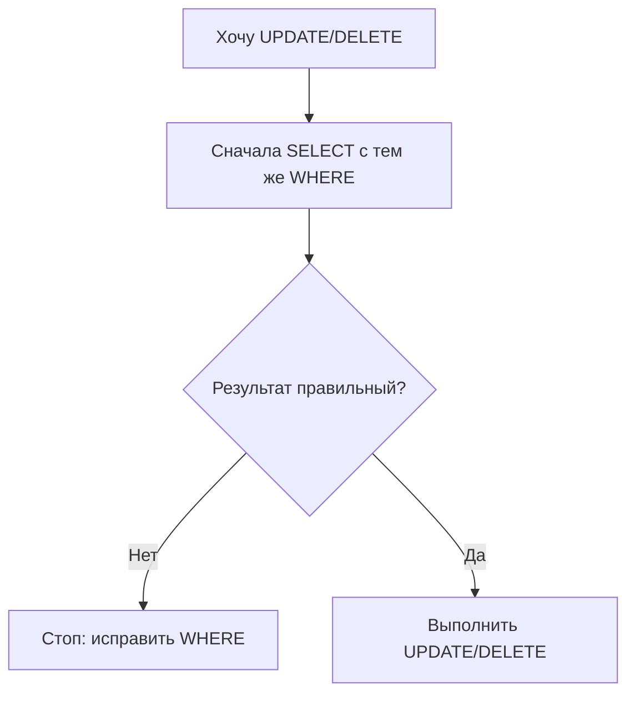
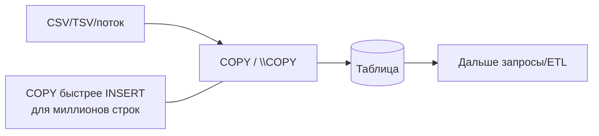

[← Назад к индексу части 2](index.md)

## 7. DML: изменение данных

Когда структура таблиц и ограничения заданы (разделы 5–6), следующий шаг — **заполнять таблицы и изменять данные**: вставлять строки, обновлять и удалять их. Этим занимается DML (Data Manipulation Language). В этом разделе — INSERT, UPDATE, DELETE, UPSERT, RETURNING, последовательности и массовая загрузка (COPY).

---

### 7.1. INSERT

**Цель раздела.**  
Научиться вставлять одну строку, несколько строк сразу, данные из другой таблицы и возвращать вставленные данные через `RETURNING`.

---

#### Термины

- **DML (Data Manipulation Language)** — подъязык SQL для работы с данными: INSERT, UPDATE, DELETE, MERGE. В отличие от DDL (создание/изменение структуры), DML меняет **содержимое** таблиц.
- **Multi-row INSERT** — вставка нескольких строк одним оператором (одна команда, несколько пар скобок в VALUES). Эффективнее, чем выполнять много одиночных INSERT подряд: меньше обращений к серверу и к WAL. (**WAL** — Write-Ahead Log, журнал изменений: СУБД сначала записывает изменения в лог, потом на диск; при массовой вставке один multi-row INSERT создаёт меньше записей в WAL, чем много одиночных.)
- **`DEFAULT`** — в этой позиции подставить значение по умолчанию для колонки (то, что задано в CREATE TABLE). Удобно, когда не хочешь указывать текущее время или авто-номер вручную.
- **`RETURNING`** — после вставки (или обновления, удаления) вернуть клиенту значения указанных столбцов из затронутых строк. Например, вставил строку — сразу получил сгенерированный id без отдельного запроса.

**Что происходит при INSERT по шагам (упрощённо):** 1) СУБД проверяет типы и ограничения (NOT NULL, UNIQUE, CHECK, FK). 2) Если у колонки есть DEFAULT и ты не указал значение — подставляется default. 3) Строка записывается в таблицу. 4) Если указан RETURNING — вычисляются и возвращаются запрошенные столбцы (например, id и created_at). 5) При COMMIT транзакции изменения закрепляются.

```mermaid
flowchart TB
  In[INSERT] --> Check[Проверить типы/ограничения\n(NOT NULL/UNIQUE/CHECK/FK)]
  Check --> Def[Подставить DEFAULT\n(если нужно)]
  Def --> Write[Записать строку]
  Write --> Ret{RETURNING?}
  Ret -->|Да| Out[Вернуть значения]
  Ret -->|Нет| Done[Готово]
  Out --> Done
```

**Разбор первой команды INSERT по частям.** Возьмём `INSERT INTO users (name, email) VALUES ('Alice', 'alice@example.com');`. По частям: **INSERT INTO** — ключевые слова «вставить в». **users** — имя таблицы, куда вставляем. **(name, email)** — список колонок, в которые подставляем значения; порядок важен: первое значение пойдёт в name, второе в email. **VALUES** — ключевое слово «значения такие». **('Alice', 'alice@example.com')** — одна скобка = одна строка; значения через запятую в том же порядке, что и колонки. Колонки id или created_at не указаны — в них подставится DEFAULT (автономер, текущее время), если он задан в таблице. Так читается любая вставка: в какую таблицу, в какие колонки, какие значения.

---

#### Правила и синтаксис

```sql
-- Вставка одной строки
INSERT INTO users (name, email) VALUES ('Alice', 'alice@example.com');

-- Вставка нескольких строк (эффективнее нескольких INSERT)
INSERT INTO users (name, email) VALUES
    ('Bob',   'bob@example.com'),
    ('Carol', 'carol@example.com'),
    ('Dave',  'dave@example.com');

-- Явное указание DEFAULT
INSERT INTO users (name, email, created_at) VALUES
    ('Eve', 'eve@example.com', DEFAULT);   -- created_at = now() (по умолчанию)

-- Вставка из запроса (INSERT ... SELECT): вставляем не константы, а результат другого запроса
INSERT INTO users_archive (id, name, email, archived_at)
    SELECT id, name, email, now()
    FROM users
    WHERE created_at < '2024-01-01';
-- Удобно для копирования данных между таблицами, архивирования, заполнения из другой БД или подзапроса.

-- Вставка без указания столбцов (порядок = порядок определения в таблице)
-- ПЛОХАЯ ПРАКТИКА: если схема изменится — сломается
INSERT INTO users VALUES (DEFAULT, 'Frank', 'frank@example.com', now());
```

##### RETURNING — получить данные вставленных строк

**Зачем RETURNING в приложении.** После вставки строки часто нужен сгенерированный id или дата создания — чтобы сразу использовать их в коде (например, перенаправить пользователя на страницу «созданный заказ № …» или записать в лог). Без RETURNING пришлось бы делать второй запрос (SELECT с тем же условием или по какому-то уникальному полю). RETURNING возвращает нужные столбцы из только что вставленных (или обновлённых, удалённых) строк в ответе на ту же команду — один круг обмена с БД вместо двух.

```sql
-- Получить автогенерированный ID после вставки
INSERT INTO users (name, email)
VALUES ('Grace', 'grace@example.com')
RETURNING id;

-- Вернуть несколько столбцов
INSERT INTO orders (user_id, total_amount)
VALUES (1, 150.00)
RETURNING id, created_at;

-- Вставить несколько строк и получить все ID
INSERT INTO tags (name) VALUES ('sql'), ('postgresql'), ('database')
RETURNING id, name;
```

---

#### Граничные случаи и типичные ошибки

- **INSERT без указания столбцов:** если добавить новую колонку в таблицу, INSERT без перечисления столбцов сломается. Всегда указывай список столбцов явно.
- **Производительность:** 1000 отдельных INSERT в цикле намного медленнее, чем один multi-row INSERT или COPY. При массовой загрузке — используй COPY.
- **RETURNING и INSERT ... SELECT:** RETURNING работает и с `INSERT ... SELECT`, возвращая данные всех вставленных строк.

---

#### Запомните

- Всегда указывай список столбцов в INSERT (не надейся на порядок).
- Multi-row INSERT быстрее, чем много одиночных.
- `RETURNING` — удобный способ получить автогенерированные значения.

##### Вопросы для самопроверки (7.1)

1. Зачем в INSERT всегда указывать явный список столбцов?  
   <details><summary>Ответ</summary>
   Порядок колонок в таблице может измениться (миграции); при добавлении новой колонки INSERT без списка столбцов может сломаться или подставить значения не в те поля.
   </details>

2. Как вставить несколько строк одним оператором INSERT?  
   <details><summary>Ответ</summary>
   Несколько наборов в VALUES через запятую: INSERT INTO t (a, b) VALUES (1, 'x'), (2, 'y'), (3, 'z'); — один запрос быстрее, чем три отдельных INSERT.
   </details>

3. Что возвращает предложение RETURNING в INSERT?  
   <details><summary>Ответ</summary>
   Строки (значения столбцов) вставленных строк — например, сгенерированный id, created_at и т.д. Удобно для получения автогенерированных полей без отдельного запроса.
   </details>

---

### 7.2. UPDATE и DELETE

**Цель раздела.**  
Научиться обновлять и удалять строки, понимать, почему WHERE критически важен, и освоить `UPDATE ... FROM`.

**Из чего состоит команда UPDATE.** Формула: **UPDATE** *таблица* **SET** *колонка = значение, ...* **WHERE** *условие*. Сначала указываешь таблицу, в которой меняются данные. Потом **SET** — какие колонки во что менять (можно несколько: `col1 = val1, col2 = val2`). В **WHERE** — условие на строки: обновляются **только** те строки, для которых условие истинно. Если WHERE не написать, условие будет «все строки» — обновится вся таблица. В SET можно писать выражения: `price = price * 1.1`, `updated_at = now()`.

**Из чего состоит команда DELETE.** Формула: **DELETE FROM** *таблица* **WHERE** *условие*. Указываешь таблицу и условие — удаляются только строки, подходящие под условие. Без WHERE удаляются все строки таблицы.

---

#### Правила и синтаксис

##### UPDATE

```sql
-- Базовое обновление
UPDATE users
SET name = 'Alice Smith'
WHERE id = 1;

-- Обновить несколько столбцов
UPDATE orders
SET
    status     = 'shipped',
    shipped_at = now(),
    updated_at = now()
WHERE id = 42;

-- Обновить с вычислением
UPDATE products
SET price = price * 1.10     -- повышение цены на 10%
WHERE category_id = 5;

-- Обновить на основе данных из другой таблицы (UPDATE ... FROM)
UPDATE orders o
SET status = 'confirmed'
FROM payments p
WHERE p.order_id = o.id
  AND p.status = 'paid'
  AND o.status = 'pending';
-- Смысл: присоединяем к orders таблицу payments; обновляем только те заказы (o), для которых есть оплата (p) и заказ ещё pending. FROM задаёт вторую таблицу и связь с ней.

-- RETURNING в UPDATE
UPDATE users
SET email = 'newemail@example.com'
WHERE id = 1
RETURNING id, email, updated_at;
```

##### DELETE

```sql
-- Удалить конкретные строки
DELETE FROM users WHERE id = 42;

-- Удалить на основе данных из другой таблицы (DELETE ... USING)
DELETE FROM orders o
USING payments p
WHERE p.order_id = o.id
  AND p.status = 'fraud';
-- Удаляем из orders только те строки, которые связаны с мошеннической оплатой в payments. USING — «учитывай эту таблицу в условии», чтобы в WHERE можно было ссылаться на p.

-- RETURNING в DELETE
DELETE FROM users
WHERE last_login < now() - INTERVAL '2 years'
RETURNING id, email;
```

---

#### Граничные случаи и типичные ошибки

- **UPDATE/DELETE без WHERE:** обновит или удалит **все** строки таблицы. Это одна из самых распространённых катастрофических ошибок. В интерфейсах и скриптах легко случайно выполнить `UPDATE users SET name = 'test'` без WHERE — обновятся все пользователи. **Привычка на всю жизнь:** перед любым UPDATE или DELETE с WHERE сначала выполни SELECT с тем же WHERE и посмотри, какие строки затронутся. Только убедившись, что список правильный — выполняй изменение.


  ```sql
  -- Сначала проверь, что вернёт SELECT с этим же WHERE:
  SELECT * FROM users WHERE id = 42;
  -- Убедился, что это правильная строка? Теперь UPDATE:
  UPDATE users SET ... WHERE id = 42;
  ```
  **Не путай:** «хочу обновить одну строку» — ты обязан написать WHERE, иначе обновится вся таблица. Если пишешь UPDATE/DELETE без WHERE осознанно (редкий случай «очистить всё»), лучше явно добавить комментарий в код и по возможности использовать TRUNCATE для полной очистки вместо DELETE.
- **UPDATE ... FROM и дублирование:** если в подзапросе FROM несколько строк совпадают с одной строкой основной таблицы — поведение неопределённое (обновится одна из них, непредсказуемо). Используй подзапрос с `DISTINCT` или `LIMIT 1`.
- **Блокировки:** UPDATE и DELETE блокируют изменяемые строки (row-level lock): пока одна транзакция меняет строку, другая не может её изменить или в некоторых режимах — прочитать «старую» версию. Длинные транзакции с большим числом обновлений могут держать много блокировок и мешать другим запросам. (В PostgreSQL по умолчанию используется MVCC — читатели обычно видят снимок данных без ожидания, но писатели конкурируют за одни и те же строки.)

---

#### Запомните

- **Всегда** пиши WHERE в UPDATE и DELETE (если не хочешь изменить все строки).
- Перед обновлением проверяй условие через SELECT.
- `UPDATE ... FROM` — PostgreSQL-синтаксис для обновления на основе другой таблицы.
- `RETURNING` работает в UPDATE и DELETE так же, как в INSERT.

##### Вопросы для самопроверки (7.2)

1. Что произойдёт, если выполнить UPDATE users SET name = 'test' без WHERE?  
   <details><summary>Ответ</summary>
   Обновятся все строки таблицы users — поле name станет 'test' у каждой строки. Это типичная катастрофическая ошибка; в UPDATE и DELETE всегда указывай WHERE, если не хочешь затронуть все строки.
   </details>

2. Для чего нужен UPDATE ... FROM?  
   <details><summary>Ответ</summary>
   Чтобы обновлять строки одной таблицы на основе данных другой: присоединяем вторую таблицу в FROM и в WHERE задаём связь; обновляются только те строки, для которых условие выполняется (например, «обновить статус заказа, если есть оплата»).
   </details>

3. Как безопасно проверить, какие строки затронет UPDATE или DELETE?  
   <details><summary>Ответ</summary>
   Сначала выполнить SELECT с тем же WHERE и убедиться, что список строк правильный; только потом выполнять UPDATE/DELETE.
   </details>

---

### 7.3. UPSERT, MERGE и RETURNING

**Цель раздела.**  
Разобраться с операцией «вставить или обновить» (UPSERT) и со стандартным оператором MERGE.

---

#### Термины

- **UPSERT** — «UPDATE or INSERT»: вставить строку, а если она уже существует (конфликт) — обновить.
- **`ON CONFLICT`** — PostgreSQL-синтаксис для UPSERT.
- **`MERGE`** — стандартный SQL:2003 оператор для слияния источника с целевой таблицей; поддерживается в PostgreSQL 15+.
- **Конфликт** — нарушение UNIQUE или PRIMARY KEY при INSERT. То есть ты вставляешь строку, а в таблице уже есть строка с таким же значением в уникальном столбце (или комбинации столбцов).

**Что происходит при ON CONFLICT по шагам.** 1) Ты выполняешь INSERT с конкретными значениями (например, sku = 'SKU-001'). 2) СУБД пытается вставить строку. 3) Если в таблице уже есть строка с sku = 'SKU-001' (нарушается UNIQUE или PRIMARY KEY), возникает **конфликт**. 4) Вместо ошибки СУБД смотрит, что ты написал после ON CONFLICT: **DO NOTHING** — тогда вставка просто отменяется для этой строки, как будто ты ничего не делал. **DO UPDATE SET ...** — тогда существующая строка **обновляется** указанными полями; в SET ты можешь использовать `EXCLUDED.column`, чтобы подставить значение из «отклонённой» вставки. В итоге: одна команда делает и «вставь, если нет», и «обнови, если уже есть» — без двух отдельных запросов и без гонок между проверкой и вставкой.

```mermaid
flowchart TB
  Ins[INSERT ...] --> Try[Попытка вставки]
  Try --> Conflict{Конфликт UNIQUE/PK?}
  Conflict -->|Нет| Ok[Вставлено]
  Conflict -->|Да| Handler{ON CONFLICT ...}
  Handler -->|DO NOTHING| Skip[Пропустить строку]
  Handler -->|DO UPDATE| Upd[Обновить существующую\n(можно EXCLUDED.*)]
```

**Простыми словами:** UPSERT = «если такой записи нет — вставь, если уже есть — обнови». ON CONFLICT — способ в PostgreSQL сказать: «при конфликте по уникальному ключу не падай с ошибкой, а сделай то-то (ничего или обновление)».

---

#### Правила и синтаксис

##### ON CONFLICT DO NOTHING

```sql
-- Вставить, если не существует; игнорировать при конфликте
INSERT INTO tags (name)
VALUES ('postgresql')
ON CONFLICT (name) DO NOTHING;
```

##### ON CONFLICT DO UPDATE (настоящий UPSERT)

```sql
-- Обновить цену товара, если товар уже существует в каталоге
INSERT INTO product_catalog (sku, name, price, updated_at)
VALUES ('SKU-001', 'Куртка зимняя', 4999.00, now())
ON CONFLICT (sku) DO UPDATE SET
    name       = EXCLUDED.name,      -- EXCLUDED = «строка, которую пытались вставить»
    price      = EXCLUDED.price,
    updated_at = EXCLUDED.updated_at;

-- Обновить только если новая цена отличается
INSERT INTO product_catalog (sku, name, price, updated_at)
VALUES ('SKU-001', 'Куртка зимняя', 5499.00, now())
ON CONFLICT (sku) DO UPDATE SET
    price      = EXCLUDED.price,
    updated_at = now()
WHERE product_catalog.price <> EXCLUDED.price;
```

##### Указание конфликта по ограничению

```sql
-- По имени ограничения (более явно)
INSERT INTO users (id, email)
VALUES (1, 'alice@example.com')
ON CONFLICT ON CONSTRAINT pk_users DO UPDATE SET
    email = EXCLUDED.email;
```

##### MERGE (PostgreSQL 15+)

```sql
-- Источник данных для загрузки
MERGE INTO product_catalog AS target
USING (
    VALUES
        ('SKU-001', 'Куртка', 4999.00),
        ('SKU-002', 'Шапка',   999.00),
        ('SKU-003', 'Шарф',    599.00)
) AS source(sku, name, price)
ON target.sku = source.sku

WHEN MATCHED AND target.price <> source.price THEN
    UPDATE SET price = source.price, updated_at = now()

WHEN MATCHED THEN
    DO NOTHING

WHEN NOT MATCHED THEN
    INSERT (sku, name, price, updated_at)
    VALUES (source.sku, source.name, source.price, now());
```

`MERGE` мощнее `ON CONFLICT`: он умеет обрабатывать несколько условий (MATCHED/NOT MATCHED) и выполнять разные действия. **Когда использовать MERGE, когда ON CONFLICT:** ON CONFLICT проще и покрывает типичный случай «вставь или обнови по одному уникальному ключу». MERGE удобен, когда источник данных — подзапрос или набор строк из другой таблицы и нужно за один проход и вставлять новые, и обновлять существующие по разным правилам (например, при MATCHED обновить только если цена изменилась, при NOT MATCHED — вставить). В PostgreSQL 15+ MERGE доступен; в более старых версиях делают несколько INSERT/UPDATE или используют ON CONFLICT в цикле по строкам.

---

#### Граничные случаи и типичные ошибки

- **`EXCLUDED`:** в `ON CONFLICT DO UPDATE` ключевое слово `EXCLUDED` — это псевдотаблица, представляющая «строку, которую пытались вставить». Не путать с реальным именем таблицы.
- **Гонка условий (race condition):** `ON CONFLICT` атомарен — не нужно писать «проверь, потом вставь» в приложении.
- **Отсутствие уникального ограничения:** `ON CONFLICT (col)` работает только если на `col` есть `UNIQUE` или `PRIMARY KEY`.
- **MERGE и несколько строк источника:** если несколько строк источника совпадают с одной строкой цели — ошибка. Дедуплицируй источник.

---

#### Запомните

- `ON CONFLICT DO NOTHING` — игнорировать вставку при конфликте.
- `ON CONFLICT DO UPDATE SET ... WHERE ...` — обновить при конфликте, опционально с дополнительным условием.
- `EXCLUDED` — псевдотаблица с отклонёнными данными.
- `MERGE` (PG 15+) — стандартный оператор слияния, мощнее ON CONFLICT.

---

### 7.4. Последовательности, SERIAL, IDENTITY и COPY

**Цель раздела.**  
Понять, как организовать автонумерацию строк и как эффективно загружать большие объёмы данных.

---

#### Термины

- **SEQUENCE (последовательность)** — объект БД, генерирующий возрастающие числа.
- **SERIAL** — устаревший синтаксис PostgreSQL для автонумерации (создаёт SEQUENCE под капотом).
- **IDENTITY** — стандартный SQL:2003 способ автонумерации; предпочтительный в современном PostgreSQL.
- **`GENERATED ALWAYS AS IDENTITY`** — значение всегда генерируется СУБД; нельзя вставить вручную без `OVERRIDING SYSTEM VALUE`.
- **`GENERATED BY DEFAULT AS IDENTITY`** — можно вставить вручную; СУБД использует SEQUENCE только если значение не указано.
- **COPY** — команда PostgreSQL для высокопроизводительной загрузки/выгрузки данных из файлов.



---

#### Правила и синтаксис

##### SEQUENCE напрямую

```sql
-- Создать последовательность
CREATE SEQUENCE order_id_seq
    START 1
    INCREMENT 1
    NO MAXVALUE
    CACHE 10;         -- кеш из 10 значений на сервере

-- Использовать в INSERT
INSERT INTO orders (id, user_id) VALUES (nextval('order_id_seq'), 1);

-- Функции работы с последовательностью
SELECT nextval('order_id_seq');   -- следующее значение (изменяет состояние)
SELECT currval('order_id_seq');   -- текущее значение (без изменения)
SELECT lastval();                 -- последнее nextval в этой сессии

-- Сбросить значение
SELECT setval('order_id_seq', 1000);
```

##### SERIAL (устаревший, но часто встречается в коде)

```sql
-- SERIAL — синтаксический сахар: создаёт sequence + DEFAULT nextval
CREATE TABLE old_style (
    id    SERIAL PRIMARY KEY,    -- = INTEGER + sequence
    name  TEXT
);

-- BIGSERIAL для больших таблиц
CREATE TABLE big_table (
    id    BIGSERIAL PRIMARY KEY,
    data  TEXT
);

-- Проблема SERIAL: sequence создаётся отдельно, и при DROP TABLE
-- sequence нужно удалять отдельно (если не CASCADE).
-- Также: INSERT можно вставить любое число в id, обходя sequence.
```

##### IDENTITY (современный подход)

```sql
-- GENERATED ALWAYS: нельзя вставить ID вручную
CREATE TABLE users (
    id    BIGINT GENERATED ALWAYS AS IDENTITY PRIMARY KEY,
    name  TEXT NOT NULL
);

INSERT INTO users (name) VALUES ('Alice');       -- OK: id = 1
INSERT INTO users (id, name) VALUES (99, 'Bob'); -- ERROR: нельзя вставить id

-- Если всё же нужно вставить вручную (например, при восстановлении):
INSERT INTO users (id, name) VALUES (99, 'Bob')
    OVERRIDING SYSTEM VALUE;

-- GENERATED BY DEFAULT: можно вставить вручную
CREATE TABLE products (
    id    BIGINT GENERATED BY DEFAULT AS IDENTITY PRIMARY KEY,
    name  TEXT NOT NULL
);

INSERT INTO products (name) VALUES ('Chair');    -- id = 1
INSERT INTO products (id, name) VALUES (100, 'Table');  -- OK

-- Настройка параметров IDENTITY
CREATE TABLE events (
    id BIGINT GENERATED ALWAYS AS IDENTITY
        (START WITH 1000 INCREMENT BY 1)
    PRIMARY KEY
);
```

##### COPY — массовая загрузка

```sql
-- Загрузить данные из CSV-файла (только на сервере)
COPY users (name, email) FROM '/tmp/users.csv' CSV HEADER;

-- Загрузить с разделителем-табуляцией
COPY users FROM '/tmp/users.tsv' DELIMITER E'\t';

-- Выгрузить данные в файл
COPY users TO '/tmp/users_export.csv' CSV HEADER;

-- COPY с клиентского файла (psql-клиент)
\COPY users (name, email) FROM 'local_file.csv' CSV HEADER;

-- COPY из stdin (полезно в приложении)
COPY users (name, email) FROM STDIN CSV;
```

**COPY vs INSERT:** COPY загружает данные значительно быстрее INSERT — нет разбора SQL на каждую строку, минимальное WAL. Для загрузки миллионов строк разница может быть 10-50x. **Когда использовать COPY:** импорт из CSV/TSV, выгрузка в файл, загрузка больших объёмов из приложения через stdin. **\COPY vs COPY:** команда **COPY** (без обратного слэша) выполняется на **сервере** — файл должен быть доступен с той машины, где запущен PostgreSQL (путь типа `/tmp/data.csv` — это путь на сервере). Команда **\COPY** — это клиентская команда psql: она читает/пишет файл на **твоём компьютере** (где запущен psql) и передаёт данные серверу. В скриптах и приложениях обычно используют COPY ... FROM STDIN и передают данные потоком.

---

#### Граничные случаи и типичные ошибки

- **Разрывы в SEQUENCE:** если транзакция откатилась, взятое из sequence значение «потеряно» — в ID-колонке будет разрыв (1, 2, 4, 7...). Это нормально — sequence не транзакционна по дизайну: значение выдаётся сразу при nextval и не откатывается при ROLLBACK, иначе при массовых вставках пришлось бы блокировать sequence на время транзакции и терять производительность. Не строй бизнес-логику на непрерывности ID (например, «всего заказов = max(id)» — неверно при разрывах).
- **SERIAL и права:** sequence, созданный через SERIAL, принадлежит определённому пользователю. При копировании таблицы вместе с sequence могут быть проблемы с правами.
- **COPY и ограничения:** COPY проверяет ограничения (NOT NULL, CHECK, UNIQUE), но **медленнее** при большом числе нарушений. Для staging лучше загружать в таблицу без ограничений, а потом фильтровать.
- **`\COPY` vs `COPY`:** `COPY` работает с файлами **на сервере**; `\COPY` — с файлами на **клиенте** (psql-команда).

---

#### Запомните

- `GENERATED ALWAYS AS IDENTITY` — современный, предпочтительный способ автонумерации.
- `SERIAL` — устаревший, но широко встречается в старом коде.
- Разрывы в ID-последовательностях — нормальны, не чини их.
- `COPY` намного быстрее INSERT для массовой загрузки данных.

##### Вопросы для самопроверки (7.4)

1. Чем GENERATED ALWAYS AS IDENTITY отличается от GENERATED BY DEFAULT AS IDENTITY при вставке?  
   <details><summary>Ответ</summary>
   ALWAYS — вставить значение вручную нельзя (только через OVERRIDING SYSTEM VALUE). BY DEFAULT — можно явно указать id при INSERT; sequence используется только если значение не задано.
   </details>

2. Почему разрывы в ID (1, 2, 4, 7...) после отката транзакций — это нормально?  
   <details><summary>Ответ</summary>
   Sequence не откатывается при ROLLBACK — значение выдаётся при nextval и «теряется» при откате. Так сделано для производительности; не стоит полагаться на непрерывность ID.
   </details>

3. В чём разница между COPY и \COPY при загрузке из файла?  
   <details><summary>Ответ</summary>
   COPY выполняется на сервере — файл должен быть доступен по пути на сервере. \COPY — команда psql, читает/пишет файл на клиенте и передаёт данные серверу.
   </details>

---

**Перед тем как переходить к разделу 8 (SELECT), проверь себя.** Ты понимаешь: зачем в INSERT указывать список столбцов; почему в UPDATE/DELETE обязательно проверять WHERE; что делает ON CONFLICT (вставить или обновить при конфликте по уникальному ключу); в чём разница между SEQUENCE/SERIAL и IDENTITY и когда использовать COPY? Если нет — вернись к «Запомните» в разделах 7.1–7.4.

---

---

<!-- prev-next-nav -->
*[← 6. Ограничения](02_6_ogranicheniya.md) | [→ 8. SELECT: выборка данных](04_8_select_vyborka_dannyh.md)*
