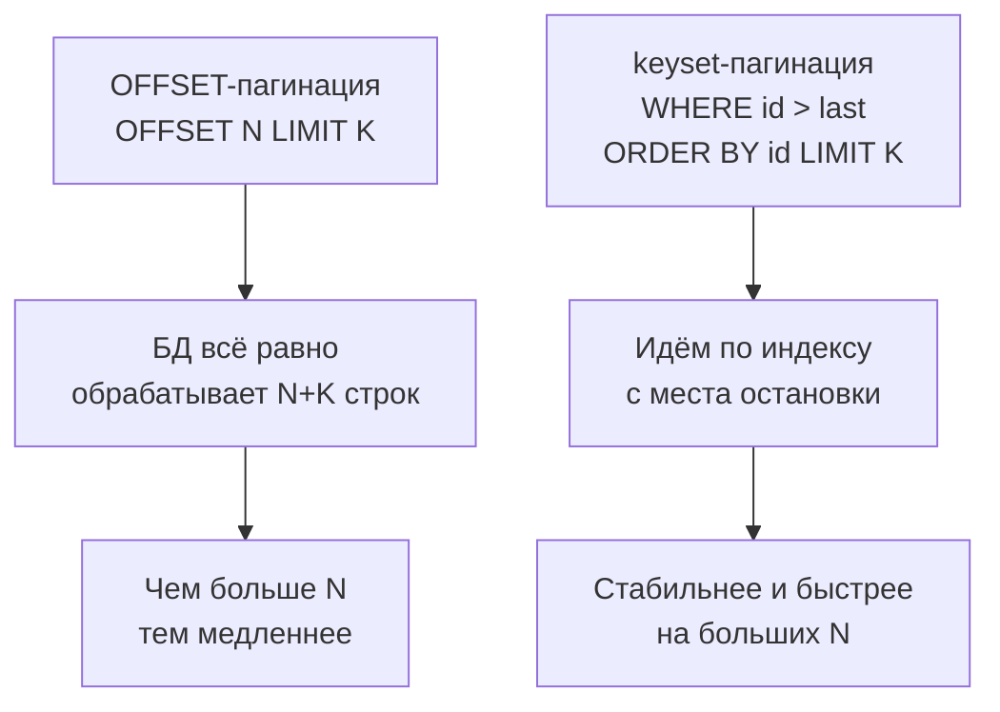

[← Назад к индексу части 2](index.md)

## 8. SELECT: выборка данных

Умение описывать структуру (5–6) и менять данные (7) дополняется умением **читать** данные: выбирать нужные строки из таблиц, фильтровать их по условиям, сортировать и ограничивать вывод. Всему этому посвящён раздел 8. SELECT не меняет данные — только возвращает результат запроса.

---

### 8.1. Базовый SELECT

**Цель раздела.**  
Освоить структуру оператора SELECT: как выбрать столбцы, откуда взять данные, как фильтровать, сортировать и ограничивать количество строк.

---

#### Термины

- **`SELECT`** — оператор чтения данных; не изменяет данные в таблице, только возвращает результат.
- **`FROM`** — источник данных: из какой таблицы (или подзапроса, CTE) брать строки.
- **`WHERE`** — условие фильтрации: какие строки оставить (только те, для которых условие истинно). Выполняется **до** группировки и агрегации.
- **`ORDER BY`** — в каком порядке выдать строки результата (по какому столбцу, по возрастанию или убыванию).
- **`LIMIT`** — выдать не больше N строк (например, «топ-10»).
- **`OFFSET`** — пропустить первые N строк (для пагинации: «вторая страница» = пропустить первые 10, выдать следующие 10).
- **Предикат** — условие в WHERE, возвращающее TRUE, FALSE или NULL (например, `status = 'paid'`).

**Простыми словами:** SELECT — «что показать», FROM — «откуда брать», WHERE — «какие строки оставить», ORDER BY — «в каком порядке», LIMIT — «сколько штук выдать», OFFSET — «сколько штук в начале пропустить». **Пагинация** — это когда большой результат разбивают на «страницы»: первая страница — первые 10 строк (LIMIT 10 OFFSET 0), вторая — следующие 10 (LIMIT 10 OFFSET 10), третья — LIMIT 10 OFFSET 20. Пользователь или API запрашивает номер страницы — в запрос подставляется соответствующий OFFSET.

---

#### Правила и синтаксис

##### Порядок выполнения SELECT (логический, не синтаксический)

В тексте запроса ты пишешь сначала SELECT, потом FROM, потом WHERE... Но **логически** СУБД обрабатывает части в другом порядке: сначала решает, **откуда** брать данные, потом **фильтрует**, потом **группирует**, потом **считает итоговые столбцы**, потом **сортирует** и **обрезает** результат. Это важно, потому что на этапе WHERE ещё «не существует» псевдонимов из SELECT и агрегатных функций — они появляются позже.

Порядок по шагам:

1. **FROM** — выбираем таблицу (или соединение таблиц); получаем «исходный набор» строк.
2. **WHERE** — из этого набора оставляем только строки, для которых условие истинно.
3. **GROUP BY** — если есть, группируем оставшиеся строки по указанным столбцам.
4. **HAVING** — если есть, оставляем только те группы, для которых условие по агрегатам истинно.
5. **SELECT** — для каждой строки (или группы) вычисляем итоговые столбцы; здесь же задаются псевдонимы.
6. **DISTINCT** — если есть, убираем дубликаты строк в результате.
7. **ORDER BY** — сортируем результат.
8. **LIMIT и OFFSET** — обрезаем результат: сколько строк выдать и сколько пропустить в начале.

```mermaid
flowchart LR
  F[FROM / JOIN] --> W[WHERE (σ)]
  W --> G[GROUP BY]
  G --> H[HAVING]
  H --> S[SELECT (π) + aliases]
  S --> D[DISTINCT]
  D --> O[ORDER BY]
  O --> L[LIMIT / OFFSET]
```

**Почему нельзя использовать псевдоним из SELECT в WHERE:** на шаге 2 (WHERE) псевдонимы из шага 5 (SELECT) ещё не определены. Поэтому в WHERE нужно писать исходное выражение или имя столбца из таблицы, а не алиас.

##### Операторы в WHERE: когда что использовать

- **Сравнение:** `=`, `<>` (не равно), `<`, `>`, `<=`, `>=` — для чисел, дат, строк. Для проверки на NULL используй **IS NULL** / **IS NOT NULL**, а не `= NULL` (в SQL `NULL = NULL` не TRUE).
- **IN (список):** «значение равно одному из перечисленных». Вместо `status = 'a' OR status = 'b'` пиши `status IN ('a', 'b', 'c')`. Удобно для списка id или кодов.
- **BETWEEN a AND b:** «значение в отрезке [a, b] включительно». Для дат: `BETWEEN '2024-01-01' AND '2024-12-31'` включает только начало 31 декабря; для полного года лучше `>= '2024-01-01' AND < '2025-01-01'`.
- **LIKE и ILIKE:** поиск по шаблону. `%` — любое количество символов, `_` — ровно один. Пример: `name LIKE 'Alice%'` — имена, начинающиеся с Alice. **ILIKE** в PostgreSQL — без учёта регистра. Если шаблон начинается с `%` (например, `%something`), индекс по столбцу чаще всего не используется.
- **AND / OR:** условия связываются через **AND** (оба должны выполниться) и **OR** (достаточно одного). Порядок задаётся скобками: `(a = 1 OR a = 2) AND b > 0`.

**Простыми словами:** сравниваешь с одним значением — `=`, `<`, `>`. Выбираешь из списка — IN. Отрезок — BETWEEN. Часть строки — LIKE/ILIKE. «Пусто» — IS NULL.

##### Примеры

```sql
-- Базовый SELECT: все столбцы
SELECT * FROM users;

-- Выбрать конкретные столбцы
SELECT id, name, email FROM users;

-- Фильтрация
SELECT id, name, email
FROM users
WHERE created_at > '2024-01-01';

-- Несколько условий
SELECT id, name
FROM orders
WHERE status = 'pending'
  AND total_amount > 1000
  AND created_at >= now() - INTERVAL '7 days';

-- Условие OR
SELECT id, name
FROM users
WHERE email LIKE '%@gmail.com'
   OR email LIKE '%@yahoo.com';

-- IS NULL / IS NOT NULL
SELECT id, name
FROM users
WHERE last_login IS NULL;          -- никогда не заходили

-- IN — вместо нескольких OR
SELECT id, name
FROM orders
WHERE status IN ('pending', 'confirmed', 'shipped');

-- BETWEEN (включительно с обеих сторон)
SELECT id, total_amount
FROM orders
WHERE total_amount BETWEEN 100 AND 500;

-- LIKE и ILIKE (ILIKE — case-insensitive, только в PostgreSQL)
SELECT id, name
FROM users
WHERE name ILIKE 'alice%';    -- alice, Alice, ALICE...

-- Сортировка (ASC = по возрастанию, DESC = по убыванию)
SELECT id, name, created_at
FROM users
ORDER BY created_at DESC;     -- от новых к старым

-- Несколько критериев сортировки (сначала по status, при равенстве — по total_amount убывание)
SELECT id, status, total_amount
FROM orders
ORDER BY status ASC, total_amount DESC;

-- Ограничение строк
SELECT id, name FROM users LIMIT 10;

-- Пагинация (стандартная, но с проблемами на больших таблицах)
SELECT id, name FROM users ORDER BY id LIMIT 10 OFFSET 20;  -- страница 3
```

---

#### Граничные случаи и типичные ошибки

- **`SELECT *` в продакшне:** удобен при отладке, но в продакшн-коде опасен. Если добавить колонку в таблицу — запрос вернёт больше данных. Всегда указывай явный список столбцов.
- **LIKE и производительность:** `LIKE '%something'` (% в начале) — индекс не используется, Seq Scan. `LIKE 'something%'` — индекс используется.
- **OFFSET на больших таблицах:** когда ты пишешь `OFFSET 100000 LIMIT 10`, ты хочешь «страницу 10001» — 10 строк, пропустив первые 100 000. Но СУБД **сначала** должна отсортировать результат (если есть ORDER BY), **потом** прочитать и отбросить первые 100 000 строк и только потом вернуть следующие 10. То есть она фактически обрабатывает 100 010 строк, а отдаёт тебе 10. Чем больше OFFSET, тем дольше запрос и тем больше нагрузка на базу. Для «глубокой» пагинации (далёкие страницы) лучше использовать **keyset-пагинацию**: вместо «пропусти 100 000 строк» — «покажи следующие 10 строк, у которых id больше последнего увиденного id» (например, `WHERE id > 12345 ORDER BY id LIMIT 10`). Тогда база может использовать индекс и не перебирать сотни тысяч строк.


- **`BETWEEN` и даты:** `BETWEEN '2024-01-01' AND '2024-12-31'` для TIMESTAMP включает `2024-12-31 00:00:00`, но не `2024-12-31 23:59:59`. Используй `>= '2024-01-01' AND < '2025-01-01'` для полного диапазона.

---

#### Запомните

- Логический порядок: FROM → WHERE → GROUP BY → HAVING → SELECT → DISTINCT → ORDER BY → LIMIT.
- В WHERE нельзя использовать псевдонимы из SELECT (они ещё не вычислены).
- `SELECT *` удобен при разработке, опасен в продакшне.
- `OFFSET` на больших таблицах — медленно; используй keyset-пагинацию.

##### Вопросы для самопроверки (8.1)

1. В каком логическом порядке СУБД обрабатывает части SELECT (FROM, WHERE, GROUP BY, HAVING, SELECT, ORDER BY, LIMIT)?  
   <details><summary>Ответ</summary>
   FROM → WHERE → GROUP BY → HAVING → SELECT → DISTINCT → ORDER BY → LIMIT (и OFFSET). Псевдонимы из SELECT и агрегаты доступны только начиная с этапа SELECT и далее, поэтому в WHERE их использовать нельзя.
   </details>

2. Почему в WHERE нельзя писать псевдоним из SELECT?  
   <details><summary>Ответ</summary>
   WHERE выполняется до вычисления выражений и псевдонимов в SELECT; на этапе WHERE псевдоним ещё не определён.
   </details>

3. Чем плох большой OFFSET для пагинации и что лучше использовать?  
   <details><summary>Ответ</summary>
   При OFFSET N СУБД всё равно обрабатывает (сортирует и читает) первые N строк, затем отбрасывает их. Чем больше OFFSET, тем медленнее. Лучше keyset-пагинация: WHERE id > last_seen_id ORDER BY id LIMIT 10.
   </details>

---

### 8.2. DISTINCT и DISTINCT ON

**Цель раздела.**  
Научиться убирать дублирующиеся строки из результата и выбирать первую строку из каждой группы с помощью `DISTINCT ON`.

---

#### Что происходит по шагам: DISTINCT

У тебя в результате запроса может получиться несколько **полностью одинаковых** строк (все столбцы совпадают). **DISTINCT** говорит: «оставь из таких одинаковых только по одной». СУБД сравнивает строки целиком (все столбцы из SELECT) и убирает дубликаты. Порядок строк после этого не гарантирован — если нужен определённый порядок, используй ORDER BY после DISTINCT.

**Пример:** в таблице заказов статус повторяется много раз. Запрос `SELECT status FROM orders` вернёт сотни строк с одинаковым значением `pending`, `paid` и т.д. Запрос `SELECT DISTINCT status FROM orders` вернёт **по одной строке на каждый уникальный статус**: pending, paid, shipped, cancelled — без повторов.

---

#### Что происходит по шагам: DISTINCT ON

**DISTINCT ON (столбец)** — это «для каждого уникального значения этого столбца оставь **одну** строку — ту, которая первая по ORDER BY». Сначала СУБД сортирует результат согласно ORDER BY. Потом для каждого значения в столбце из DISTINCT ON оставляет только первую встретившуюся строку. **Важно:** ORDER BY должен начинаться с тех же столбцов, что и DISTINCT ON, иначе непонятно, какая строка «первая» в группе, и PostgreSQL выдаст ошибку или неожиданный результат.

**Пример:** таблица заказов, у каждого заказа есть user_id и created_at. Задача: «один последний заказ каждого пользователя». Пишем: `SELECT DISTINCT ON (user_id) user_id, id, created_at, total_amount FROM orders ORDER BY user_id, created_at DESC`. Сначала сортировка: по user_id, внутри пользователя — по дате убывания (свежие сверху). Потом для каждого user_id оставляем только первую строку — то есть самый свежий заказ. В итоге получаем ровно одну строку на пользователя.

---

#### Термины

- **`DISTINCT`** — убирает строки-дубликаты из результата (сравнивает **все** столбцы SELECT; две строки считаются дублем, только если совпадают все значения).
- **`DISTINCT ON (выражение)`** — PostgreSQL-расширение: «разбей результат на группы по значению выражения; в каждой группе оставь только **первую** строку» (первая — по порядку ORDER BY).

**Простыми словами:** DISTINCT — «покажи уникальные комбинации значений» (без повторов). DISTINCT ON (col) — «для каждого значения col покажи одну строку — ту, которая первая после сортировки».

---

#### Правила и синтаксис

```sql
-- DISTINCT: убрать дубли
SELECT DISTINCT status FROM orders;

-- DISTINCT по нескольким столбцам (комбинация уникальна)
SELECT DISTINCT user_id, status FROM orders;

-- DISTINCT ON (PostgreSQL): первый заказ каждого пользователя
SELECT DISTINCT ON (user_id)
    user_id, id AS order_id, created_at, total_amount
FROM orders
ORDER BY user_id, created_at ASC;   -- для каждого user_id — самый ранний заказ

-- Последний заказ каждого пользователя
SELECT DISTINCT ON (user_id)
    user_id, id AS order_id, created_at, total_amount
FROM orders
ORDER BY user_id, created_at DESC;  -- для каждого user_id — самый свежий
```

**Важное правило для `DISTINCT ON`:** первый столбец ORDER BY должен совпадать с выражением в `DISTINCT ON`. Иначе ошибка или неожиданный результат.

```sql
-- Ошибка/неожиданное: ORDER BY не начинается с user_id
SELECT DISTINCT ON (user_id) user_id, created_at
FROM orders
ORDER BY created_at DESC;   -- ОШИБКА: ORDER BY expression must match DISTINCT ON
```

---

#### Граничные случаи и типичные ошибки

- **`DISTINCT` дорого:** СУБД должна сортировать или хешировать все строки для поиска дублей. Если дубли возникают из-за JOIN — лучше переписать JOIN.
- **`DISTINCT ON` vs GROUP BY + агрегат:** `DISTINCT ON` более декларативен для задачи «первый/последний по группе», но GROUP BY + агрегатные функции (MIN, MAX) гибче.

---

#### Запомните

- `DISTINCT` удаляет полностью одинаковые строки.
- `DISTINCT ON (col)` оставляет первую строку из каждой группы по `col` (первую по ORDER BY).
- ORDER BY для `DISTINCT ON` должен начинаться с тех же столбцов, что в DISTINCT ON.

##### Вопросы для самопроверки (8.2)

1. Чем DISTINCT отличается от DISTINCT ON (col)?  
   <details><summary>Ответ</summary>
   DISTINCT убирает полностью одинаковые строки (все столбцы совпадают). DISTINCT ON (col) оставляет по одной строке на каждое уникальное значение col — «первую» по ORDER BY в каждой группе.
   </details>

2. Почему для DISTINCT ON порядок в ORDER BY должен начинаться с тех же столбцов?  
   <details><summary>Ответ</summary>
   Иначе не определено, какая строка «первая» в группе по col; PostgreSQL требует, чтобы ORDER BY начинался с выражений из DISTINCT ON.
   </details>

3. Как получить «последний заказ каждого пользователя» одним запросом?  
   <details><summary>Ответ</summary>
   SELECT DISTINCT ON (user_id) user_id, id, created_at, ... FROM orders ORDER BY user_id, created_at DESC; для каждого user_id остаётся первая строка после сортировки — то есть с максимальной датой.
   </details>

---

### 8.3. Псевдонимы и выражения

**Цель раздела.**  
Научиться переименовывать столбцы и таблицы, вычислять новые значения в SELECT, использовать CASE.

---

#### Зачем нужны псевдонимы (AS)

**Псевдоним столбца** — это имя, которое ты даёшь результату выражения в SELECT. Без псевдонима колонка «salary * 12» так и отобразится в результате с таким заголовком; с `AS annual_salary` в выводе будет понятная колонка `annual_salary`. В приложении по имени псевдонима удобнее обращаться к значению. Кроме того, в ORDER BY и в подзапросах можно ссылаться на псевдоним (но не в WHERE — там он ещё не определён).

**Псевдоним таблицы** — короткое имя таблицы в запросе (например, `FROM users u` или `FROM orders o`). Удобно в длинных запросах и при JOIN: писать `o.user_id` вместо `orders.user_id`. Не меняет данные — только упрощает запись.

**Простыми словами:** псевдоним — это «назови результат так-то». Для столбца — чтобы в результате и в ORDER BY было понятное имя. Для таблицы — чтобы короче писать в условиях и при соединениях.

---

#### Правила и синтаксис

```sql
-- Псевдоним столбца
SELECT
    id,
    first_name || ' ' || last_name AS full_name,   -- || — оператор конкатенации строк в SQL
    salary * 12                    AS annual_salary,
    UPPER(email)                   AS email_upper
FROM employees;

-- Псевдоним таблицы (особенно полезен при JOIN)
SELECT e.id, e.name, d.name AS department_name
FROM employees AS e
JOIN departments AS d ON d.id = e.department_id;

-- Сокращённый синтаксис без AS (допустим, но менее читаем)
SELECT id, name n FROM users u;

-- CASE: условное выражение (два варианта)
-- 1) Поисковый CASE: проверяем условия подряд (как цепочка IF)
SELECT
    id,
    total_amount,
    CASE
        WHEN total_amount >= 10000 THEN 'VIP'
        WHEN total_amount >= 1000  THEN 'Regular'
        ELSE                            'Small'
    END AS order_tier,

    -- 2) Простой CASE: сравниваем одно выражение с несколькими значениями (как switch)
    CASE status
        WHEN 'pending'   THEN 'Ожидает'
        WHEN 'confirmed' THEN 'Подтверждён'
        WHEN 'shipped'   THEN 'Отправлен'
        ELSE                  'Другой'
    END AS status_ru

FROM orders;
-- Когда какой CASE: если одно значение сравниваешь с несколькими вариантами (status = 'a' или 'b' или 'c') — удобен простой CASE (CASE col WHEN ...). Если условия сложнее (диапазоны, несколько колонок, выражения) — поисковый CASE (CASE WHEN условие THEN ...).

-- Математические выражения
SELECT
    product_name,
    price,
    quantity,
    price * quantity             AS line_total,
    price * quantity * 0.20      AS vat,
    price * quantity * 1.20      AS total_with_vat
FROM order_items;

-- Функции в SELECT
SELECT
    id,
    name,
    LOWER(email)                 AS email,
    LENGTH(name)                 AS name_length,
    DATE_PART('year', created_at) AS join_year,   -- DATE_PART извлекает часть даты (год, месяц, день и т.д.)
    now() - created_at           AS account_age
FROM users;
```

---

#### Граничные случаи и типичные ошибки

- **Псевдонимы в WHERE:** нельзя использовать псевдоним из SELECT в WHERE (WHERE выполняется раньше). Используй исходное выражение или подзапрос.
  ```sql
  -- Ошибка:
  SELECT salary * 12 AS annual FROM employees WHERE annual > 100000;

  -- Правильно:
  SELECT salary * 12 AS annual FROM employees WHERE salary * 12 > 100000;
  -- Или через подзапрос:
  SELECT * FROM (
      SELECT salary * 12 AS annual FROM employees
  ) sub WHERE annual > 100000;
  ```
- **CASE без ELSE:** если ELSE не указан и ни одно условие не совпало — результат NULL.
- **NULL в выражениях:** любая операция с NULL даёт NULL. `NULL + 1 = NULL`, `'text' || NULL = NULL`.

---

#### Запомните

- `AS` для псевдонимов необязателен, но делает код читаемее.
- `CASE WHEN ... THEN ... ELSE ... END` — стандартное условное выражение в SQL.
- Псевдонимы недоступны в WHERE и HAVING (только в ORDER BY).
- Операции с NULL дают NULL — используй `COALESCE(val, 0)` при необходимости.

##### Вопросы для самопроверки (8.3)

1. Где можно использовать псевдоним столбца из SELECT — в WHERE, в ORDER BY или в обоих?  
   <details><summary>Ответ</summary>
   В ORDER BY — можно. В WHERE — нельзя, потому что WHERE выполняется раньше SELECT, псевдоним ещё не вычислен.
   </details>

2. Чем поисковый CASE (CASE WHEN ... THEN ...) отличается от простого (CASE col WHEN ...)?  
   <details><summary>Ответ</summary>
   Поисковый — произвольные условия подряд (как IF-цепочка). Простой — одно выражение сравнивается с несколькими значениями (как switch); удобен для status = 'a' OR 'b' OR 'c'.
   </details>

3. Что вернёт CASE без ELSE, если ни одно условие не выполнилось?  
   <details><summary>Ответ</summary>
   NULL.
   </details>

---

### 8.4. Сортировка с NULL: NULLS FIRST/LAST

**Цель раздела.**  
Понять, как NULL влияет на сортировку и как управлять его позицией.

**Простыми словами:** при сортировке NULL не считается «больше» или «меньше» обычных значений — он «вне сравнения». В PostgreSQL по умолчанию при сортировке по возрастанию NULL оказывается в конце, по убыванию — в начале. Если нужно иначе (например, «сначала показать тех, у кого нет даты входа»), явно укажи NULLS FIRST или NULLS LAST в ORDER BY.

---

#### Правила и синтаксис

По умолчанию в PostgreSQL:
- `ORDER BY col ASC` → NULL идут **последними** (NULLS LAST)
- `ORDER BY col DESC` → NULL идут **первыми** (NULLS FIRST)

Это интуитивно: NULL «больше всего» в ASC и «меньше всего» в DESC. Но часто это не то поведение, которое нужно.

```sql
-- По умолчанию: NULL в конце при ASC
SELECT id, name, last_login
FROM users
ORDER BY last_login ASC;         -- NULL в конце (никогда не заходили — в конце)

-- Принудительно: NULL в начале при ASC
SELECT id, name, last_login
FROM users
ORDER BY last_login ASC NULLS FIRST;  -- сначала тех, кто никогда не заходил

-- NULL в конце при DESC
SELECT id, name, last_login
FROM users
ORDER BY last_login DESC NULLS LAST;  -- от недавних к старым, NULL в конце

-- Составная сортировка с NULL-управлением
SELECT id, category, priority, name
FROM tasks
ORDER BY
    category ASC NULLS LAST,
    priority DESC NULLS LAST;
```

---

#### Запомните

- По умолчанию PostgreSQL: ASC → NULL последними; DESC → NULL первыми.
- `NULLS FIRST` / `NULLS LAST` — явное управление позицией NULL.
- Используй явное указание при любом сомнении в ожидаемом поведении.

##### Вопросы для самопроверки (8.4)

1. Где по умолчанию в PostgreSQL оказываются NULL при ORDER BY col ASC и при ORDER BY col DESC?  
   <details><summary>Ответ</summary>
   При ASC — NULL последними (NULLS LAST). При DESC — NULL первыми (NULLS FIRST).
   </details>

2. Как показать сначала пользователей, у которых last_login IS NULL (никогда не заходили)?  
   <details><summary>Ответ</summary>
   ORDER BY last_login ASC NULLS FIRST — тогда NULL окажутся в начале результата.
   </details>

3. Зачем явно указывать NULLS FIRST или NULLS LAST?  
   <details><summary>Ответ</summary>
   Чтобы не зависеть от поведения по умолчанию и сделать запрос однозначным при чтении кода и при смене СУБД (в стандарте SQL порядок NULL при сортировке implementation-defined).
   </details>

---

**Перед разделом 9 (Агрегация) проверь себя.** Понимаешь ли ты: порядок выполнения SELECT (FROM → WHERE → … → ORDER BY → LIMIT); зачем нужны псевдонимы столбцов и таблиц; почему в WHERE нельзя использовать псевдоним из SELECT; в чём разница между DISTINCT и DISTINCT ON и почему для DISTINCT ON порядок ORDER BY должен начинаться с тех же столбцов? Если что-то неясно — перечитай «Запомните» в 8.1–8.4.

---

---

<!-- prev-next-nav -->
*[← 7. DML: изменение данных](03_7_dml_izmenenie_dannyh.md) | [→ 9. Агрегация](05_9_agregatsiya.md)*
