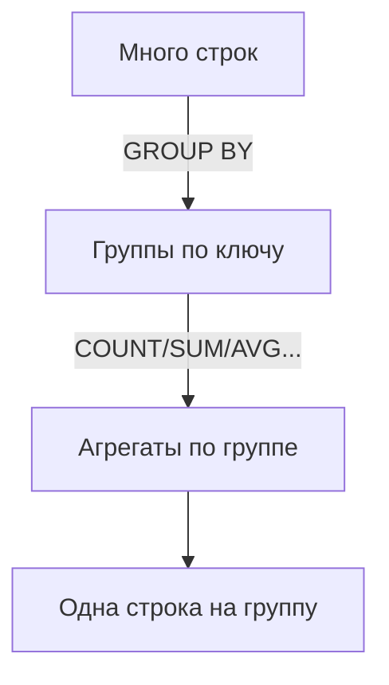

[← Назад к индексу части 2](index.md)

## 9. Агрегация

Выборка по строкам (раздел 8) отвечает на вопрос «**какие** строки». Часто нужен ответ на вопрос «**сколько всего**», «**сумма по группам**», «**среднее**» — для этого служит агрегация. GROUP BY разбивает строки на группы, агрегатные функции (COUNT, SUM, AVG, MIN, MAX) считают по каждой группе одно значение. В результате из многих строк получается сводка: по одной строке на группу.



---

### 9.1. GROUP BY и агрегатные функции

**Цель раздела.**  
Научиться группировать строки и применять к ним агрегатные функции: считать, суммировать, находить минимум и максимум.

---

#### Что такое группировка (GROUP BY) пошагово

У тебя есть таблица заказов: у каждого заказа есть статус (pending, paid, shipped...) и сумма. Ты хочешь получить **не список всех заказов**, а **сводку по статусам**: сколько заказов в каждом статусе и какая общая сумма по каждому статусу.

**Шаг 1.** Ты говоришь: «разбей строки на группы по значению столбца status». Получаются группы: все pending вместе, все paid вместе, все shipped вместе и т.д.

**Шаг 2.** Для каждой группы ты применяешь агрегатные функции: COUNT(*) — сколько строк в группе, SUM(total_amount) — сумма полей total_amount в этой группе. В результате из многих строк получается **одна строка на группу**: один статус + подсчитанные числа.

```mermaid
flowchart LR
  G[Одна группа] --> C[COUNT(*)]
  G --> S[SUM(total_amount)]
  G --> A[AVG(total_amount)]
```

**Итог:** GROUP BY превращает «много строк» в «мало строк» — по одной на каждое уникальное значение группировочного столбца (или комбинации столбцов), а агрегаты (COUNT, SUM, AVG...) дают сводные числа по каждой группе.

**Простыми словами:** GROUP BY — «объедини строки с одинаковым значением в группе и посчитай по каждой группе что нужно» (сколько штук, сумма, среднее и т.д.). Агрегатная функция — «функция, которая из нескольких значений делает одно» (COUNT — количество, SUM — сумма, AVG — среднее).

---

#### Термины

- **Агрегатная функция** — функция, которая принимает набор строк (или значений в столбце) и возвращает одно значение: `COUNT`, `SUM`, `AVG`, `MIN`, `MAX`.
- **`GROUP BY`** — разбить строки на группы по значению одного или нескольких столбцов. Агрегатная функция применяется к каждой группе отдельно; в результате получается одна строка на группу.
- **Неагрегированный столбец** — столбец в SELECT, который не обёрнут в агрегат (не COUNT, не SUM...). Такой столбец **обязательно** должен входить в GROUP BY, иначе СУБД не поймёт, какое значение вывести: в группе может быть несколько разных значений этого столбца.

---

#### Правила и синтаксис

```sql
-- Количество строк
SELECT COUNT(*) FROM orders;           -- все строки
SELECT COUNT(user_id) FROM orders;     -- строки, где user_id IS NOT NULL
SELECT COUNT(DISTINCT user_id) FROM orders;  -- уникальные пользователи

-- Сумма, среднее, минимум, максимум
SELECT
    SUM(total_amount)   AS total_revenue,
    AVG(total_amount)   AS avg_order,
    MIN(total_amount)   AS min_order,
    MAX(total_amount)   AS max_order
FROM orders
WHERE status = 'paid';

-- GROUP BY: итоги по группам
SELECT
    status,
    COUNT(*)            AS order_count,
    SUM(total_amount)   AS total_revenue,
    AVG(total_amount)   AS avg_order
FROM orders
GROUP BY status;

-- GROUP BY по нескольким столбцам
SELECT
    user_id,
    DATE_TRUNC('month', created_at)  AS month,   -- DATE_TRUNC обнуляет день/время, оставляя год-месяц для группировки
    COUNT(*)                          AS order_count,
    SUM(total_amount)                 AS monthly_total
FROM orders
GROUP BY user_id, DATE_TRUNC('month', created_at)
ORDER BY user_id, month;

-- GROUP BY с выражением
SELECT
    DATE_PART('year', created_at)  AS year,
    COUNT(*)                        AS new_users
FROM users
GROUP BY DATE_PART('year', created_at)
ORDER BY year;
```

##### COUNT(*) vs COUNT(col) vs COUNT(DISTINCT col)

| Форма | Что считает |
|-------|-------------|
| `COUNT(*)` | Все строки (включая с NULL) |
| `COUNT(col)` | Строки, где `col IS NOT NULL` |
| `COUNT(DISTINCT col)` | Уникальные ненулевые значения col |

```sql
-- Пример разницы
SELECT
    COUNT(*)                   AS total_rows,
    COUNT(email)               AS rows_with_email,
    COUNT(DISTINCT email)      AS unique_emails
FROM users;
```

---

#### Граничные случаи и типичные ошибки

- **Неагрегированный столбец без GROUP BY:** это ошибка в большинстве СУБД. PostgreSQL выдаст: `column must appear in the GROUP BY clause or be used in an aggregate function`. Почему так: при `GROUP BY user_id` в одной группе могут быть несколько строк с разными `status`. В результате должна быть одна строка на группу; для этой строки нужно вывести одно значение `status`, а их несколько — СУБД не знает, какое выбрать. Поэтому правило: либо добавь `status` в GROUP BY (тогда группа = пара user_id + status), либо не выводи status в SELECT, либо оберни в агрегат (например, MAX(status) — но тогда смысл меняется). Пример правильного варианта — добавить status в GROUP BY.
  ```sql
  -- Ошибка:
  SELECT user_id, status, COUNT(*) FROM orders GROUP BY user_id;
  -- status нет в GROUP BY и не обёрнут в агрегат

  -- Правильно:
  SELECT user_id, status, COUNT(*) FROM orders GROUP BY user_id, status;
  ```
- **`AVG` и NULL:** AVG игнорирует NULL-значения. `AVG(col)` = `SUM(col) / COUNT(col)` (не COUNT(*)). То есть в знаменателе только строки, где col не NULL.
- **`GROUP BY` по порядковому номеру:** `GROUP BY 1, 2` — работает в PostgreSQL, но нечитаемо и хрупко. Лучше писать имена.

---

#### Запомните

- В SELECT с GROUP BY можно использовать только столбцы из GROUP BY и агрегатные функции.
- `COUNT(*)` — все строки; `COUNT(col)` — строки без NULL.
- `AVG` игнорирует NULL; `SUM` тоже игнорирует NULL (суммирует только не-NULL).
- `COUNT(DISTINCT col)` — уникальные ненулевые значения.

##### Вопросы для самопроверки (9.1)

1. Какие столбцы можно выводить в SELECT при наличии GROUP BY?  
   <details><summary>Ответ</summary>
   Только столбцы (или выражения), входящие в GROUP BY, и агрегатные функции. Любой другой столбец должен быть либо в GROUP BY, либо обёрнут в агрегат.
   </details>

2. В чём разница между COUNT(*) и COUNT(col)?  
   <details><summary>Ответ</summary>
   COUNT(*) считает все строки группы. COUNT(col) считает только строки, где col IS NOT NULL.
   </details>

3. Учитывает ли AVG(col) строки с NULL в col?  
   <details><summary>Ответ</summary>
   Нет. AVG считает среднее только по ненулевым значениям; знаменатель — COUNT(col), не COUNT(*).
   </details>

---

### 9.2. HAVING

**Цель раздела.**  
Понять разницу между WHERE и HAVING и научиться фильтровать группы по результатам агрегации.

---

#### Термины

- **`HAVING`** — фильтрация **после** GROUP BY, по результатам агрегатных функций. Аналог WHERE, но применяется не к отдельным строкам, а к уже посчитанным группам (можно писать условия типа «COUNT(*) > 5», «SUM(amount) < 1000»).

**Почему нельзя писать агрегат в WHERE:** порядок выполнения такой: сначала WHERE (фильтрация строк), потом GROUP BY (группировка), потом агрегаты считаются. На этапе WHERE агрегатов ещё нет — строки не сгруппированы, поэтому «COUNT(*) > 5» в WHERE не имеет смысла. Для фильтра по результатам агрегации как раз и нужен HAVING — он выполняется после группировки и подсчёта.

**Простыми словами:** WHERE — «какие строки брать в расчёт» (до группировки). HAVING — «какие группы оставить в результате» (после того как посчитали по группам). Пример: «показать только тех пользователей, у которых больше 5 заказов» — группируем по user_id, считаем COUNT(*), в HAVING пишем COUNT(*) > 5.

```mermaid
flowchart TB
  From[FROM] --> Where[WHERE\nфильтр строк]
  Where --> Group[GROUP BY\nгруппы]
  Group --> Having[HAVING\nфильтр групп\n(агрегаты)]
  Having --> Out[Результат]
```

---

#### Правила и синтаксис

```sql
-- Найти пользователей с более чем 5 заказами
SELECT
    user_id,
    COUNT(*) AS order_count,
    SUM(total_amount) AS total_spent
FROM orders
GROUP BY user_id
HAVING COUNT(*) > 5
ORDER BY order_count DESC;

-- Найти месяцы, в которые выручка превысила 1 000 000
SELECT
    DATE_TRUNC('month', created_at) AS month,
    SUM(total_amount) AS monthly_revenue
FROM orders
WHERE status = 'paid'                -- WHERE: фильтруем строки ПЕРЕД группировкой
GROUP BY DATE_TRUNC('month', created_at)
HAVING SUM(total_amount) > 1000000  -- HAVING: фильтруем группы ПОСЛЕ
ORDER BY month;
```

##### WHERE vs HAVING: когда что использовать

| | WHERE | HAVING |
|--|-------|--------|
| Когда выполняется | До GROUP BY | После GROUP BY |
| Может фильтровать | Отдельные строки | Агрегированные группы |
| Может использовать агрегаты | Нет | Да |
| Производительность | Лучше (меньше строк для группировки) | Хуже (группируем всё, потом фильтруем) |

**Правило:** если условие не зависит от агрегата — ставь в WHERE, а не HAVING. Это быстрее.

```sql
-- Неэффективно (WHERE быстрее):
SELECT status, COUNT(*)
FROM orders
GROUP BY status
HAVING status = 'paid';    -- фильтр по не-агрегированному значению

-- Эффективно:
SELECT status, COUNT(*)
FROM orders
WHERE status = 'paid'      -- убрали лишние строки ДО группировки
GROUP BY status;
```

---

#### Запомните

- `HAVING` — это WHERE для групп (результатов агрегации).
- Фильтр без агрегата ставь в WHERE (быстрее).
- Фильтр по агрегату (`COUNT(*) > 10`) — только в HAVING.

##### Вопросы для самопроверки (9.2)

1. Почему условие с агрегатом (например, COUNT(*) > 5) нельзя писать в WHERE?  
   <details><summary>Ответ</summary>
   WHERE выполняется до GROUP BY и агрегации; на этапе WHERE группы ещё не посчитаны, агрегатов нет.
   </details>

2. Где писать условие «только пользователи с более чем 10 заказами» — в WHERE или в HAVING?  
   <details><summary>Ответ</summary>
   В HAVING: GROUP BY user_id, затем HAVING COUNT(*) > 10. Это фильтр по результату агрегации.
   </details>

3. Если условие не использует агрегат (например, status = 'paid'), куда его лучше ставить — в WHERE или в HAVING и почему?  
   <details><summary>Ответ</summary>
   В WHERE. Так отфильтруются строки до группировки — меньше строк для группировки, быстрее запрос.
   </details>

---

### 9.3. FILTER в агрегатах

**Цель раздела.**  
Научиться делать условные агрегаты — считать/суммировать только строки, удовлетворяющие условию, в рамках одного GROUP BY.

---

#### Что делает FILTER по шагам

У тебя одна группа (например, все заказы одного пользователя). Ты хочешь в одной строке результата получить и **общее** количество заказов, и количество **только оплаченных**, и количество **отменённых**, и сумму **только по оплаченным**. Без FILTER пришлось бы писать несколько подзапросов или громоздкие `SUM(CASE WHEN status = 'paid' THEN 1 ELSE 0 END)`. **FILTER (WHERE условие)** при агрегате говорит: «применяй эту агрегатную функцию только к тем строкам группы, для которых условие истинно». То есть `COUNT(*) FILTER (WHERE status = 'paid')` — считай только строки с status = 'paid' внутри каждой группы; остальные строки группы в этот подсчёт не попадают. Группировка одна (например, по user_id), а агрегатов с разными фильтрами может быть несколько в одном SELECT.

**Простыми словами:** FILTER — это «считай (или суммируй) не по всей группе, а только по тем строкам группы, которые подходят под условие». Один GROUP BY — несколько «подсчётов с условием» в одной строке результата.

```mermaid
flowchart TB
  Group2[Одна группа (user_id=...)] --> All[COUNT(*)\nвсе строки]
  Group2 --> Paid[COUNT(*) FILTER\nstatus='paid']
  Group2 --> Canc[COUNT(*) FILTER\nstatus='cancelled']
  Group2 --> Rev[SUM(amount) FILTER\nstatus='paid']
```

---

#### Правила и синтаксис

```sql
-- Без FILTER (приходится использовать CASE внутри SUM — громоздко):
SELECT
    user_id,
    COUNT(*) AS total_orders,
    SUM(CASE WHEN status = 'paid' THEN 1 ELSE 0 END) AS paid_orders,
    SUM(CASE WHEN status = 'cancelled' THEN 1 ELSE 0 END) AS cancelled_orders
FROM orders
GROUP BY user_id;

-- С FILTER (чище, быстрее):
SELECT
    user_id,
    COUNT(*)                                    AS total_orders,
    COUNT(*) FILTER (WHERE status = 'paid')     AS paid_orders,
    COUNT(*) FILTER (WHERE status = 'cancelled') AS cancelled_orders,
    SUM(total_amount) FILTER (WHERE status = 'paid') AS paid_revenue
FROM orders
GROUP BY user_id;

-- Пример: подсчёт событий по категориям в одном запросе
SELECT
    DATE_TRUNC('day', created_at)               AS day,
    COUNT(*)                                    AS total,
    COUNT(*) FILTER (WHERE source = 'mobile')   AS from_mobile,
    COUNT(*) FILTER (WHERE source = 'web')      AS from_web,
    COUNT(*) FILTER (WHERE source = 'api')      AS from_api
FROM events
GROUP BY DATE_TRUNC('day', created_at)
ORDER BY day;
```

`FILTER (WHERE ...)` стандартизирован в SQL:2003 и поддерживается в PostgreSQL, DuckDB, SQLite (3.30+). В MySQL/Oracle используют `CASE WHEN ... THEN ... ELSE NULL END` внутри агрегата.

---

#### Запомните

- `COUNT(*) FILTER (WHERE cond)` — считает только строки, где `cond` истинно.
- Это чище и быстрее, чем `SUM(CASE WHEN cond THEN 1 ELSE 0 END)`.
- Работает с любой агрегатной функцией: `SUM`, `AVG`, `MAX`, `MIN`, `COUNT`.

##### Вопросы для самопроверки (9.3)

1. Что делает COUNT(*) FILTER (WHERE status = 'paid')?  
   <details><summary>Ответ</summary>
   Считает только строки группы, у которых status = 'paid'; остальные строки группы в этот подсчёт не попадают.
   </details>

2. Чем FILTER выгоднее SUM(CASE WHEN cond THEN 1 ELSE 0 END) для условного подсчёта?  
   <details><summary>Ответ</summary>
   Код короче и читаемее; планировщик может оптимизировать FILTER эффективнее.
   </details>

3. Можно ли использовать FILTER с SUM и AVG?  
   <details><summary>Ответ</summary>
   Да. FILTER (WHERE ...) применим к любой агрегатной функции: COUNT, SUM, AVG, MIN, MAX.
   </details>

---

### 9.4. GROUPING SETS, ROLLUP, CUBE

**Цель раздела.**  
Научиться за один проход таблицы получать агрегаты по нескольким уровням группировки — без UNION ALL.

**Что это даёт по шагам.** Обычный GROUP BY даёт одну «сетку» группировки: например, по региону и товару — одна строка на пару (region, product_id) с суммой. Но в отчётах часто нужны ещё **итоги**: по региону без разбивки по товару, и общий итог по всей таблице. Без GROUPING SETS / ROLLUP / CUBE пришлось бы писать несколько запросов с разным GROUP BY и склеивать их через UNION ALL. Эти конструкции позволяют в **одном** запросе получить и детальные строки, и «суперитоги» — строки, где часть размерностей свёрнута (в таких строках в группировочных столбцах будет NULL). ROLLUP — иерархия (всё по (A,B,C), потом по (A,B), по (A), потом общий итог). CUBE — все комбинации размерностей. GROUPING SETS — ты сам перечисляешь, какие комбинации нужны.

**Простыми словами:** суперитог — это строка результата, в которой «посчитано не по одной группе, а по многим» (например, сумма по всему региону, а не по региону и товару). В таких строках в «свёрнутых» столбцах стоит NULL. GROUPING SETS / ROLLUP / CUBE позволяют за один запрос получить и детализацию, и такие итоговые строки. GROUPING(col) помогает отличить «настоящий NULL в данных» от «NULL потому что это суперитог».

```mermaid
flowchart TB
  Base[(sales)] --> One[GROUP BY (region, product)]
  Base --> Reg[GROUP BY (region)]
  Base --> All[GROUP BY ()\nобщий итог]
  Note[GROUPING SETS/ROLLUP/CUBE\nделают это за один проход] --- Base
```

---

#### Термины

- **`GROUPING SETS`** — явно перечислить, какие комбинации GROUP BY нужны.
- **`ROLLUP`** — иерархическое суммирование: группировка по (A, B, C), (A, B), (A), ().
- **`CUBE`** — все возможные комбинации группировок.
- **`GROUPING(col)`** — функция, возвращающая 1 если данная строка является «суперитогом» по col, 0 — если это обычная группа.

---

#### Правила и синтаксис

##### GROUPING SETS

```sql
-- Без GROUPING SETS — нужно три запроса + UNION ALL:
SELECT region, product_id, SUM(revenue) FROM sales GROUP BY region, product_id
UNION ALL
SELECT region, NULL,       SUM(revenue) FROM sales GROUP BY region
UNION ALL
SELECT NULL,   NULL,       SUM(revenue) FROM sales;

-- С GROUPING SETS — один запрос:
SELECT
    region,
    product_id,
    SUM(revenue) AS total_revenue
FROM sales
GROUP BY GROUPING SETS (
    (region, product_id),   -- итог по паре
    (region),               -- итог только по региону
    ()                      -- общий итог
)
ORDER BY region NULLS LAST, product_id NULLS LAST;
```

В строках «суперитогов» значение группировочного столбца будет NULL.

##### ROLLUP

```sql
-- ROLLUP(year, quarter, month) = GROUP BY:
-- (year, quarter, month), (year, quarter), (year), ()

SELECT
    EXTRACT(YEAR  FROM order_date) AS year,
    EXTRACT(QUARTER FROM order_date) AS quarter,
    EXTRACT(MONTH FROM order_date) AS month,
    SUM(revenue) AS total_revenue
FROM sales
GROUP BY ROLLUP (
    EXTRACT(YEAR FROM order_date),
    EXTRACT(QUARTER FROM order_date),
    EXTRACT(MONTH FROM order_date)
)
ORDER BY year NULLS LAST, quarter NULLS LAST, month NULLS LAST;
```

Результат: строки по месяцам + строки-итоги по кварталам + строки-итоги по годам + общий итог.

```mermaid
flowchart TB
  R1[(year, quarter, month)] --> R2[(year, quarter)]
  R2 --> R3[(year)]
  R3 --> R4[()]
  NoteR[ROLLUP: "сворачиваем" справа налево] --- R1
```

##### CUBE

```sql
-- CUBE(region, category) = GROUP BY:
-- (region, category), (region), (category), ()

SELECT
    region,
    category,
    SUM(revenue) AS total_revenue
FROM sales
GROUP BY CUBE (region, category)
ORDER BY region NULLS LAST, category NULLS LAST;
```

```mermaid
flowchart TB
  C0[(region, category)] --> C1[(region)]
  C0 --> C2[(category)]
  C0 --> C3[()]
  NoteC[CUBE: все комбинации размерностей] --- C0
```

##### GROUPING() — отличить суперитог от NULL в данных

```sql
SELECT
    region,
    product_id,
    SUM(revenue) AS total_revenue,
    GROUPING(region)     AS is_region_total,    -- 1 = суперитог по region
    GROUPING(product_id) AS is_product_total    -- 1 = суперитог по product_id
FROM sales
GROUP BY GROUPING SETS (
    (region, product_id),
    (region),
    ()
);

-- Использование GROUPING для читаемых меток:
SELECT
    CASE GROUPING(region)
        WHEN 1 THEN 'ALL REGIONS'
        ELSE region
    END AS region_label,
    SUM(revenue) AS total
FROM sales
GROUP BY ROLLUP(region);
```

---

#### Граничные случаи и типичные ошибки

- **NULL в данных vs NULL-суперитог:** если в столбце есть настоящие NULL, `GROUPING()` позволяет отличить их от NULL в суперитогах.
- **Производительность CUBE:** для N столбцов CUBE создаёт 2^N группировок. При N=5 — это 32 GROUP BY-вычисления. Используй осторожно.
- **ORDER BY с суперитогами:** строки суперитогов идут с NULL в группировочных столбцах. `ORDER BY col NULLS LAST` помещает итоги в конец — обычно это нужное поведение.

---

#### Запомните

- `GROUPING SETS` — явный список нужных комбинаций.
- `ROLLUP(A, B, C)` — иерархия: (A,B,C), (A,B), (A), ().
- `CUBE(A, B)` — все комбинации: (A,B), (A), (B), ().
- `GROUPING(col)` — 1 если это суперитог по col.
- В строках суперитогов NULL в столбцах группировки.

##### Вопросы для самопроверки (9.4)

1. Чем ROLLUP отличается от CUBE?  
   <details><summary>Ответ</summary>
   ROLLUP даёт иерархию: группировки (A,B,C), (A,B), (A), () — «свёртка справа налево». CUBE даёт все комбинации: (A,B), (A), (B), () — каждая размерность может быть либо в группировке, либо свёрнута.
   </details>

2. Зачем нужна функция GROUPING(col)?  
   <details><summary>Ответ</summary>
   Чтобы отличить «настоящий NULL в данных» от NULL в строке-суперитоге (где столбец свёрнут). GROUPING(col) = 1 для суперитога по этому столбцу, 0 для обычной группы.
   </details>

3. Что такое суперитог в контексте GROUPING SETS / ROLLUP / CUBE?  
   <details><summary>Ответ</summary>
   Строка результата, в которой агрегат посчитан по «свёрнутой» группировке (например, сумма по всему региону без разбивки по товару). В свёрнутых столбцах в такой строке — NULL.
   </details>

---

### 9.5. string_agg и другие строковые агрегаты

**Цель раздела.**  
Научиться склеивать строки внутри группы и собирать агрегированные коллекции.

**Зачем это нужно.** При группировке по user_id ты получаешь одну строку на пользователя и агрегаты (COUNT, SUM). Но иногда нужно в одной ячейке получить **список** значений из группы: например, перечень названий товаров, которые купил этот пользователь, через запятую. Или список id через запятую. Для этого служат **string_agg** (склеить значения в одну строку с разделителем) и **array_agg** (собрать значения в массив). Порядок элементов можно задать через ORDER BY внутри агрегата.

**Простыми словами:** string_agg — «по группе склей значения столбца в одну строку через разделитель» (например, «Куртка, Шапка, Шарф»). array_agg — «собери значения в массив» (удобно, когда дальше в приложении или в SQL нужен именно массив, а не строка).

**В других СУБД и стандарте SQL.** В PostgreSQL для склейки строк используется **string_agg**. В стандарте SQL и в Oracle есть аналог — **listagg** (синтаксис чуть другой: `LISTAGG(col, sep) WITHIN GROUP (ORDER BY ...)`). Идея та же: собрать значения группы в одну строку с разделителем. Если будешь писать под Oracle — ищи listagg; в PostgreSQL используй string_agg.

---

#### Правила и синтаксис

```sql
-- string_agg: склеить строки через разделитель
SELECT
    user_id,
    string_agg(product_name, ', ')           AS products,
    string_agg(product_name, ', ' ORDER BY product_name) AS products_sorted
FROM order_items
JOIN products ON products.id = order_items.product_id
GROUP BY user_id;

-- Результат:
-- user_id | products
--       1 | Куртка, Шапка, Шарф
--       2 | Перчатки

-- array_agg: собрать значения в массив PostgreSQL
SELECT
    user_id,
    array_agg(product_id ORDER BY created_at)  AS product_ids
FROM order_items
GROUP BY user_id;

-- array_agg с DISTINCT (убрать дубли)
SELECT
    category_id,
    array_agg(DISTINCT tag_name ORDER BY tag_name) AS tags
FROM product_tags
GROUP BY category_id;

-- Комбинация агрегатов
SELECT
    status,
    COUNT(*)                                    AS order_count,
    SUM(total_amount)                           AS total_revenue,
    ROUND(AVG(total_amount), 2)                 AS avg_order,
    string_agg(DISTINCT user_id::TEXT, ', ')    AS user_ids
FROM orders
GROUP BY status;
-- user_id::TEXT — приведение числа к строке, т.к. string_agg склеивает именно текст. DISTINCT убирает повторы user_id внутри группы.
```

##### Порядок внутри агрегата

```sql
-- ORDER BY внутри агрегатной функции определяет порядок конкатенации
SELECT
    department_id,
    string_agg(name, ' → ' ORDER BY hire_date) AS seniority_chain
FROM employees
GROUP BY department_id;
```

---

#### Запомните

- `string_agg(col, sep)` — склеивает строки через разделитель (PostgreSQL).
- `string_agg(col, sep ORDER BY ...)` — с контролем порядка.
- `array_agg(col)` — собирает значения в PostgreSQL-массив.
- `array_agg(DISTINCT col)` — без дублей в массиве.
- В Oracle/стандарте SQL аналог склейки строк — **listagg**; в PostgreSQL — string_agg.

##### Вопросы для самопроверки (9.5)

1. Как в PostgreSQL склеить значения столбца группы в одну строку через запятую?  
   <details><summary>Ответ</summary>
   string_agg(col, ', ') — первый аргумент столбец или выражение, второй — разделитель. Для упорядоченной склейки: string_agg(col, ', ' ORDER BY col).
   </details>

2. Чем array_agg(col) отличается от string_agg(col, sep)?  
   <details><summary>Ответ</summary>
   array_agg собирает значения в массив PostgreSQL (тип array). string_agg склеивает в одну строку с заданным разделителем. Оба — по одной строке на группу.
   </details>

3. Как получить склейку без дубликатов значений в группе?  
   <details><summary>Ответ</summary>
   array_agg(DISTINCT col) — массив уникальных значений. Для строки с разделителем в PostgreSQL можно использовать string_agg из подзапроса с DISTINCT или array_to_string(array_agg(DISTINCT col), ', ').
   </details>

---

---

<!-- prev-next-nav -->
*[← 8. SELECT: выборка данных](04_8_select_vyborka_dannyh.md) | [→ Справочник по части II](06_spravochnik_voprosy_rezyume.md)*
