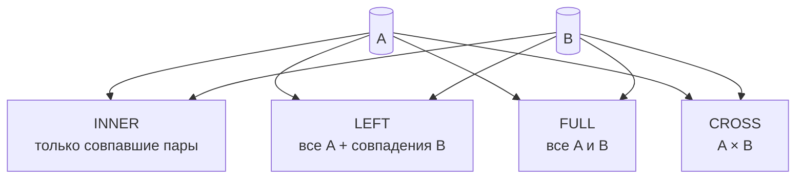

[← Назад к индексу части 3](index.md)

## 10. JOIN — соединение таблиц

**Цель раздела.**  
Научиться соединять две (и более) таблицы по условию: оставлять только совпадающие строки (INNER), сохранять все строки одной или обеих сторон с NULL там, где нет пары (OUTER), использовать декартово произведение (CROSS), соединять таблицу с собой (self-join) и применять LATERAL и USING. Понимать, когда какой тип JOIN использовать и как это связано с реляционной алгеброй.

**Простыми словами: о чём этот раздел.**  
Здесь мы учимся **склеивать две таблицы** по условию (чаще всего «ключ слева = ключ справа»). Варианты: **только пары** (INNER — заказ + клиент, без «сирот»); **все слева + справа или пусто** (LEFT — все клиенты, у кого есть заказ — с заказом, у кого нет — справа NULL); **все комбинации подряд** (CROSS — даты × смены); **одна таблица с собой** (self-join — сотрудник + его руководитель); и **«кого нет в списке»** (анти-join: пользователи без заказов — LEFT + WHERE справа NULL). Всё это — разные способы «собрать данные из двух таблиц в один результат».



**Теоретическая основа.**  
В реляционной алгебре операция **соединения (join)** по условию θ записывается как R ⋈θ S: берётся декартово произведение R × S, затем применяется выборка по условию θ. Если θ — равенство атрибутов (например, R.a = S.a), соединение называется **экви-соединением (equi-join)**. **Внутреннее соединение (inner join)** — это именно такое соединение: в результате только те пары строк, где условие истинно. **Внешнее соединение (outer join)** расширяет результат: добавляются строки одной или обеих сторон, для которых не нашлось пары; недостающие атрибуты заполняются NULL. В SQL это выражается ключевыми словами INNER JOIN, LEFT OUTER JOIN, RIGHT OUTER JOIN, FULL OUTER JOIN и условием ON или USING.

---

### 10.1. INNER JOIN

**Термины**

- **JOIN (соединение)** — операция, которая комбинирует строки двух таблиц на основе условия. Результат содержит столбцы обеих таблиц (или выбранные), и каждая строка результата соответствует паре строк (одна из первой таблицы, одна из второй), для которых условие истинно.
- **INNER JOIN** — соединение, при котором в результат попадают **только** те строки, для которых условие в ON (или USING) выполняется в обеих таблицах. Строки без пары отбрасываются.
- **Условие соединения (join condition)** — выражение в ON, обычно равенство столбцов (например, `a.id = b.foreign_id`). Может быть составным: несколько равенств через AND.
- **Экви-join (equi-join)** — соединение по равенству атрибутов: `ON table1.col = table2.col`.

**Простыми словами:** INNER JOIN — «покажи только те комбинации строк из двух таблиц, где условие (чаще всего «ключ слева = внешний ключ справа») выполняется». Все заказы без клиента или все клиенты без заказов в результат не попадут.

**Картинка в голове (как это представить).**  
Представь две таблицы: слева — заказы (каждая строка с полем «чей заказ», user_id), справа — пользователи (id, имя). INNER JOIN говорит: «для каждой строки слева найди строку справа, где id пользователя совпадает с user_id заказа. Если нашёл — выведи одну строку результата (заказ + данные пользователя). Если не нашёл — эту строку заказа вообще не выводи». В итоге в результате **только те заказы, у которых есть пара в таблице пользователей**, и **только те пользователи, которые встретились в заказах**. Ни «заказ-сирота» (user_id на несуществующего), ни «пользователь без заказов» в результате не появятся.

**Правила и синтаксис**

```sql
SELECT ...
FROM table1
[INNER] JOIN table2 ON table1.col = table2.col
[INNER] JOIN table3 ON ...
WHERE ...
```

Слово `INNER` можно опускать: `JOIN` без указания типа по умолчанию означает INNER JOIN.

**Порядок выполнения запроса с JOIN (чтобы понимать, где что писать).**  
Логически СУБД сначала обрабатывает FROM и JOIN (строит декартово произведение и применяет условие ON), затем WHERE (фильтрует уже соединённые строки), затем GROUP BY, HAVING, SELECT, ORDER BY, LIMIT. Поэтому: условие **связи между таблицами** (как соединять) пишут в **ON** — оно применяется при соединении. Условие **фильтрации по уже соединённым данным** (например, «только заказы больше 1000») пишут в **WHERE** — оно применяется после соединения. Для INNER JOIN результат часто тот же, если написать условие связи в WHERE, но для LEFT JOIN разница критична: условие в ON сохраняет «все слева», условие в WHERE отсекает строки с NULL справа.

```mermaid
flowchart LR
  Join[FROM + JOIN (ON)] --> Where[WHERE]
  Where --> Group[GROUP BY/HAVING]
  Group --> Select[SELECT/ORDER/LIMIT]
  NoteON[ON = связь таблиц] --- Join
  NoteW[WHERE = фильтр результата] --- Where
```

**Пример: заказы и клиенты**

Пусть есть таблицы `orders` (id, user_id, total, created_at) и `users` (id, name, email). Нужно вывести заказы с именами клиентов.

```sql
SELECT o.id AS order_id, o.total, o.created_at, u.name AS user_name, u.email
FROM orders o
INNER JOIN users u ON u.id = o.user_id
ORDER BY o.created_at DESC;
```

**Разбор запроса по частям (что за что отвечает).**  
- `SELECT o.id AS order_id, o.total, ...` — какие столбцы вывести в результат; `o.` и `u.` показывают, из какой таблицы столбец (алиасы из FROM).  
- `FROM orders o` — основная таблица (слева); `o` — короткое имя для ссылок.  
- `INNER JOIN users u ON u.id = o.user_id` — присоединяем таблицу users (алиас u); условие соединения: «id пользователя = user_id заказа». Только строки, где это условие истинно, попадают в результат.  
- `ORDER BY o.created_at DESC` — сортировка результата по дате заказа по убыванию.  
Если бы мы написали фильтр «только заказы за 2024 год», его нужно было бы добавить в **WHERE**: `WHERE o.created_at >= '2024-01-01'` — он применяется **после** соединения.

Как это работает по шагам:
1. СУБД берёт таблицу `orders` (с алиасом `o`).
2. Для каждой строки из `orders` ищет в `users` строку, где `users.id = orders.user_id`.
3. Если такая строка найдена — пара (строка заказа, строка пользователя) попадает в результат.
4. Если не найдена — строка заказа в результат не попадает.

Если у какого-то заказа `user_id` ссылается на несуществующего пользователя (нарушение ссылочной целостности) или NULL, такая строка заказа при INNER JOIN не получит пару и будет отброшена.

**Мини-пример «до и после» (чтобы точно запомнить).**

Допустим таблица `orders`: (id=1, user_id=10, total=100), (id=2, user_id=20, total=200), (id=3, user_id=99, total=50). Таблица `users`: (id=10, name='Вася'), (id=20, name='Петя'). Запрос: `FROM orders o INNER JOIN users u ON u.id = o.user_id`.

- Строка заказа 1: user_id=10 → в users есть id=10 (Вася) → **пара есть** → в результат попадёт одна строка: заказ 1 + Вася.
- Строка заказа 2: user_id=20 → в users есть id=20 (Петя) → **пара есть** → в результат попадёт: заказ 2 + Петя.
- Строка заказа 3: user_id=99 → в users нет id=99 → **пары нет** → эта строка заказа **не попадёт** в результат.

Итого в результате **две строки** (заказы 1 и 2 с именами Вася и Петя). Заказ 3 исчез, потому что INNER JOIN оставляет только строки с парой.

**Как запомнить раз и навсегда.**  
INNER = «внутренний» = только то, что **внутри** пересечения двух таблиц. Есть совпадение по условию ON — строка в результате есть. Нет совпадения — строки в результате нет. Две фразы-шпаргалки: «INNER — только пары» и «нет пары — нет строки».

**Связь с реляционной алгеброй.** В алгебре экви-соединение по атрибуту `A` записывается как R ⋈ R.A = S.A S: сначала декартово произведение R × S, затем выборка σ по условию R.A = S.A. INNER JOIN в SQL — прямая реализация этой операции. Внешнее соединение (LEFT/RIGHT/FULL) в чистой алгебре выражается через объединение с «дополненными» кортежами (с NULL в недостающих атрибутах); в SQL это встроенные конструкции, которые оптимизатор преобразует в эффективный план (часто через hash join или merge join, а не через реальное декартово произведение).

**Ещё пример: три таблицы**

Заказы, пользователи и статусы заказов (таблица `order_statuses`: id, name). В заказах есть `status_id`.

```sql
SELECT o.id, o.total, u.name AS customer, s.name AS status_name
FROM orders o
INNER JOIN users u ON u.id = o.user_id
INNER JOIN order_statuses s ON s.id = o.status_id
WHERE o.created_at >= '2024-01-01';
```

Сначала соединяются `orders` и `users`, затем результат соединяется с `order_statuses`. Порядок таблиц в JOIN с точки зрения результата (при одних и тех же условиях) не меняет множества строк — меняться может только план выполнения и производительность.

**Что будет, если… (частые ситуации).**  
- **Забыть условие ON в JOIN:** если написать `FROM orders o JOIN users u` без ON, в большинстве СУБД это будет трактоваться как CROSS JOIN (декартово произведение) — получишь все пары заказ–пользователь, что почти всегда не то, что нужно. Всегда пиши ON (или USING) для INNER/LEFT/RIGHT/FULL JOIN.  
- **Написать условие связи в WHERE вместо ON при LEFT JOIN:** при INNER JOIN результат тот же. При LEFT JOIN — уже нет: сначала LEFT JOIN даёт все строки слева с NULL справа где нет пары, потом WHERE отфильтровывает строки. Условие `WHERE u.id = o.user_id` отбросит все строки, где o.user_id NULL (т.е. пользователей без заказов). В итоге получишь по сути INNER JOIN — «все слева» потеряются. Поэтому для LEFT JOIN условие связи **всегда в ON**.  
- **В правой таблице несколько строк с одним ключом:** одна строка слева «размножится» — в результате будет несколько строк с одними и теми же данными слева и разными справа. Чтобы этого не было, JOIN делают по уникальному ключу правой таблицы (чаще всего по первичному ключу).

**Граничные случаи**

- **Дубликаты по ключу в одной из таблиц:** если в правой таблице несколько строк с одним и тем же значением ключа (например, дубликат user_id в какой-то таблице), одна строка слева размножится: в результате будет несколько строк с одним и тем же заказом и разными «правыми» строками. Поэтому JOIN обычно делают по уникальному ключу одной стороны (часто по первичному ключу родителя).
- **NULL в ключе соединения:** условие `NULL = что_угодно` в SQL даёт NULL (не TRUE). Строка с NULL в `user_id` не совпадёт ни с одной строкой пользователя и при INNER JOIN отбросится.

**Почему условие пишут в ON, а не в WHERE?**  
Условие соединения (связь между таблицами) пишут в ON. Фильтр по уже соединённым данным (например, «только заказы больше 1000») — в WHERE. Если написать условие связи в WHERE (например, `WHERE u.id = o.user_id`), при INNER JOIN результат будет тот же, но при LEFT JOIN — уже нет: в WHERE мы отфильтровываем строки **после** соединения, и строки с NULL справа (где пары не было) отсекутся по `u.id = o.user_id` (NULL = что-то даёт не TRUE). Поэтому для LEFT JOIN условие связи **обязательно** в ON, чтобы «все строки слева» сохранялись до фильтрации.

**Запомните**

- INNER JOIN оставляет в результате только строки, для которых условие ON истинно в обеих таблицах.
- JOIN без слова LEFT/RIGHT/FULL — это INNER JOIN.
- Условие связи обычно пишут в ON; фильтр по одной таблице можно выносить в WHERE.
- Шпаргалка: «INNER — только пары; нет пары — нет строки».

**Вопросы для самопроверки (10.1)**  
1. Что попадает в результат INNER JOIN — только строки с парой по ON или все строки левой таблицы?  
   <details><summary>Ответ</summary> Только строки, для которых условие ON истинно в **обеих** таблицах. Строки без пары отбрасываются. </details>  
2. Куда писать условие связи таблиц (например, u.id = o.user_id) — в ON или в WHERE?  
   <details><summary>Ответ</summary> Условие связи пишут в **ON**. Фильтр по уже соединённым данным — в WHERE. </details>  
3. Если написать JOIN без слова INNER, LEFT, RIGHT или FULL — что это по умолчанию?  
   <details><summary>Ответ</summary> По умолчанию это **INNER JOIN** (только совпадающие строки). </details>

**Проверь себя перед переходом к 10.2.**  
Ответь вслух: (1) INNER JOIN оставляет в результате только строки с парой или все строки одной таблицы? (2) Если у заказа user_id указывает на несуществующего пользователя, попадёт ли этот заказ в результат INNER JOIN с users? Если ответил «только с парой» и «нет, не попадёт (пары нет)» — можно идти к LEFT JOIN.

---

### 10.2. LEFT, RIGHT, FULL OUTER JOIN

**Термины**

- **LEFT [OUTER] JOIN** — соединение, при котором в результат попадают **все строки левой** таблицы. Для каждой строки слева ищется пара справа по условию ON. Если пара найдена — строка результата содержит данные обеих таблиц. Если не найдена — строка всё равно попадает в результат, а столбцы правой таблицы заполняются **NULL**.
- **RIGHT [OUTER] JOIN** — то же, но «главная» таблица — правая: все строки справа сохраняются, при отсутствии пары слева в столбцах левой таблицы — NULL.
- **FULL [OUTER] JOIN** — сохраняются все строки обеих таблиц: где есть пара — полная строка, где нет — NULL в недостающей части.

**Простыми словами:** LEFT JOIN — «все из левой таблицы плюс что удалось подставить из правой; если не удалось — справа NULL». Нужен, когда важно не потерять объекты «слева» (например, всех клиентов), даже если у них нет заказов.

**Картинка в голове.**  
LEFT = «левая таблица главная». Представь: у тебя список всех пользователей (слева). Для каждого пользователя ты ищешь заказы (справа) по условию «заказ.user_id = пользователь.id». Если заказы нашлись — выводишь строку с данными пользователя и заказа. Если не нашлось ни одного заказа — **всё равно выводишь строку**: пользователь остаётся, а вместо данных заказа подставляешь «пусто» (NULL). Так ты не теряешь ни одного пользователя: и тех, у кого есть заказы, и тех, у кого нет.

**Мини-пример «до и после».**

Таблица `users`: (id=1, name='Аня'), (id=2, name='Боря'). Таблица `orders`: (id=101, user_id=1, total=500). Запрос: `FROM users u LEFT JOIN orders o ON o.user_id = u.id`.

- Пользователь Аня (id=1): в orders есть заказ с user_id=1 → **пара есть** → в результат попадёт строка: Аня + заказ 101.
- Пользователь Боря (id=2): в orders нет заказов с user_id=2 → **пары нет** → в результат **всё равно** попадёт строка: Боря + NULL, NULL (столбцы заказа пустые).

Итого **две строки**: одна с заказом, одна без. Боря не исчез — это и есть смысл LEFT JOIN.

**Как запомнить.**  
LEFT = левая таблица «в приоритете». Все строки слева остаются; справа подставляем что есть, а если нет — NULL. Фраза: «LEFT — все слева, справа что найдётся или NULL».

**Правила и синтаксис**

```sql
FROM left_table
LEFT JOIN right_table ON left_table.key = right_table.key
```

**Пример: все пользователи и их заказы (включая без заказов)**

```sql
SELECT u.id, u.name, u.email, o.id AS order_id, o.total
FROM users u
LEFT JOIN orders o ON o.user_id = u.id
ORDER BY u.name, o.id;
```

Пользователи без заказов появятся в выводе ровно один раз: с `order_id = NULL`, `total = NULL`. Пользователи с несколькими заказами — несколько строк (по одной на заказ).

**Проверка «кто без заказов»**

Оставить только те строки, где справа «ничего не подставилось» — т.е. правая часть NULL:

```sql
SELECT u.id, u.name, u.email
FROM users u
LEFT JOIN orders o ON o.user_id = u.id
WHERE o.id IS NULL;
```

**Почему в WHERE пишем именно o.id IS NULL, а не u.id?**  
LEFT JOIN сохраняет все строки из users (u). Для каждого пользователя мы ищем заказы (o), где o.user_id = u.id. Если заказов нет — строка из orders не подставляется, и **все столбцы из таблицы orders (o)** в этой строке результата будут NULL. Поэтому «справа ничего не подставилось» означает: столбцы правой таблицы (o) равны NULL. Проверять нужно столбец **правой** таблицы — например, o.id. У пользователя id всегда есть (u.id не NULL), а вот o.id при отсутствии заказа как раз NULL. Итого: WHERE **o**.id IS NULL — «оставить только те строки, где в правой части (заказы) ничего нет».

Это типичный приём: LEFT JOIN + WHERE right.key IS NULL даёт «строки слева, для которых нет пары справа» (анти-join через outer join).

**RIGHT JOIN**

Тот же результат, что и LEFT, можно получить, поменяв таблицы местами и используя RIGHT JOIN:

```sql
SELECT u.id, u.name, o.id AS order_id
FROM orders o
RIGHT JOIN users u ON o.user_id = u.id
WHERE o.id IS NULL;
```

На практике LEFT JOIN используют чаще: порядок «главная таблица слева» читается проще. RIGHT JOIN полезен, когда цепочка JOIN длинная и «главная» таблица по смыслу справа.

**Как запомнить: когда RIGHT, когда FULL.**  
**RIGHT JOIN** = «главная таблица справа» — то же по смыслу, что LEFT JOIN с переставленными таблицами (все строки правой таблицы + совпадения слева или NULL). Вместо RIGHT JOIN чаще пишут LEFT JOIN, поставив «главную» таблицу слева — так читается привычнее. **FULL OUTER JOIN** = «все строки с обеих сторон»: и все слева, и все справа; где пары нет — NULL. Нужен редко: когда важно увидеть и совпадения, и «только в первой таблице», и «только во второй» (например, сравнение двух списков: кто в обоих, кто только в A, кто только в B). Фраза: «LEFT — все слева; RIGHT — все справа; FULL — все с обеих сторон».

**FULL OUTER JOIN**

Все строки из обеих таблиц; где пары нет — NULL.

```sql
SELECT u.id AS user_id, u.name, o.id AS order_id, o.total
FROM users u
FULL OUTER JOIN orders o ON o.user_id = u.id;
```

В результате будут и пользователи без заказов (order_id NULL), и заказы без пользователя (user_id NULL), если такие есть. FULL OUTER JOIN реже применяется, чем LEFT; нужен для задач вида «объединить два списка и показать совпадения и несовпадения».

**Почему «кто без заказов» делают именно LEFT JOIN + WHERE o.id IS NULL?**  
LEFT JOIN даёт все строки пользователей; там, где заказа не было, в столбцах заказа (например, o.id) стоят NULL. Чтобы оставить **только** тех, у кого заказа нет, мы отфильтровываем строки: «оставить только там, где справа ничего не подставилось», т.е. где o.id IS NULL. Так мы получаем ровно тех пользователей, для которых не нашлось ни одного заказа. Это называется анти-join (через outer join).

**Запомните**

- LEFT JOIN сохраняет все строки слева; при отсутствии пары справа — NULL в столбцах правой таблицы.
- RIGHT JOIN — то же для правой таблицы.
- FULL OUTER JOIN сохраняет все строки обеих таблиц.
- LEFT JOIN + WHERE right.key IS NULL — типичный способ выбрать «те, для кого нет пары».
- Шпаргалка: «LEFT — все слева; нет пары — справа NULL».

**Вопросы для самопроверки (10.2)**  
1. Кто «главный» в LEFT JOIN — левая таблица или правая? Что происходит со строками «главной» стороны, если пары нет?  
   <details><summary>Ответ</summary> Главная — **левая** таблица. Её строки **всегда** остаются в результате; при отсутствии пары справа в столбцах правой таблицы подставляется **NULL**. </details>  
2. Почему для «пользователей без заказов» в WHERE пишут o.id IS NULL, а не u.id IS NULL?  
   <details><summary>Ответ</summary> Потому что проверяем «справа ничего не подставилось»: при LEFT JOIN отсутствие пары даёт **NULL в столбцах правой** таблицы (o). Столбец левой (u.id) всегда заполнен. </details>  
3. Чем FULL OUTER JOIN отличается от LEFT JOIN по составу результата?  
   <details><summary>Ответ</summary> LEFT — все строки **слева** + совпадения справа (или NULL). FULL OUTER — все строки **обеих** таблиц: и «только слева», и «только справа», и совпадения; где пары нет — NULL. </details>

**Проверь себя перед переходом к 10.3.**  
Ответь вслух: (1) Кто «главный» в LEFT JOIN — левая таблица или правая? (2) Что будет в столбцах правой таблицы для строки слева, если пары не нашлось? Если ответил «левая» и «NULL» — можно идти дальше.

---

### 10.3. CROSS JOIN

**Термины**

- **CROSS JOIN** — декартово произведение: каждая строка первой таблицы комбинируется с **каждой** строкой второй. Условия ON не используется (если написать ON 1=1 — по смыслу то же, но CROSS JOIN явно выражает намерение).
- **Декартово произведение** — множество всех пар (a, b), где a — элемент первого множества, b — второго.

**Простыми словами:** CROSS JOIN даёт все возможные пары «строка из таблицы A» и «строка из таблицы B». Если в A 10 строк и в B 5, в результате 50 строк. Используется редко: для генерации сеток (даты × продукты), тестовых данных и т.п.

**Как запомнить.**  
CROSS = «крест» = декартово произведение: каждая строка первой таблицы «скрещивается» с **каждой** строкой второй. Условия ON нет — мы не фильтруем пары, берём все. Число строк результата = (число строк в A) × (число строк в B). Пример: 3 дня × 2 смены = 6 комбинаций (день1+утро, день1+день, день2+утро, …).

**Мини-пример «до и после» (CROSS JOIN по числам).**  
Таблица A: 3 строки (id=1, 2, 3). Таблица B: 2 строки (name='X', name='Y'). Запрос: `FROM A CROSS JOIN B`.  
- Каждая строка из A комбинируется с **каждой** строкой из B. Строка A(1) даёт пары (1,X) и (1,Y). Строка A(2) — (2,X) и (2,Y). Строка A(3) — (3,X) и (3,Y).  
Итого **6 строк** в результате (3 × 2 = 6). Никакого условия «где совпало» нет — все пары подряд. Если бы в A было 10 строк и в B 5 — получилось бы 50 строк. Запомни: **число строк результата = число строк слева × число строк справа**.

**Синтаксис и пример**

```sql
SELECT *
FROM table_a
CROSS JOIN table_b;
```

Пример: таблица «дни» (даты за неделю) и таблица «смены» (утро, день, вечер) — получить все комбинации день–смена.

```sql
SELECT d.day_date, s.shift_name
FROM (VALUES ('2024-01-01'::date), ('2024-01-02'), ('2024-01-03')) AS d(day_date)
CROSS JOIN (VALUES ('morning'), ('afternoon'), ('evening')) AS s(shift_name);
```

**Запомните**

- CROSS JOIN = декартово произведение, условие ON не задаётся.
- Число строк в результате = число строк в A × число строк в B.

**Вопросы для самопроверки (10.3)**  
1. Есть ли в CROSS JOIN условие ON? Что получается в результате?  
   <details><summary>Ответ</summary> Условия ON **нет**. В результате — **декартово произведение**: каждая строка первой таблицы с **каждой** строкой второй. </details>  
2. Как посчитать число строк результата CROSS JOIN двух таблиц?  
   <details><summary>Ответ</summary> Число строк = (число строк в первой таблице) **×** (число строк во второй). Например, 4 × 5 = 20. </details>  
3. Когда уместно использовать CROSS JOIN?  
   <details><summary>Ответ</summary> Когда нужны **все комбинации**: даты × смены, тестовые данные, сетки. Для связи по ключу (заказы–клиенты) используют INNER или LEFT с ON. </details>

**Проверь себя перед переходом к 10.4.**  
Ответь вслух: (1) Есть ли в CROSS JOIN условие ON? (2) Если в таблице A 4 строки и в B 5 строк, сколько строк в результате CROSS JOIN? Если ответил «нет условия ON» и «20 строк (4 × 5)» — можно идти к self-join.

---

### 10.4. Self-join и составные ключи

**Self-join** — соединение таблицы с собой. Нужны разные алиасы, чтобы различать «левый» и «правый» экземпляр одной и той же таблицы.

**Простыми словами.**  
Self-join — это когда одна и та же таблица участвует в запросе **дважды**, под разными именами (алиасами). Зачем? Чтобы связать строки этой таблицы **между собой** по какому-то полю. Классический пример: таблица сотрудников, у каждого есть manager_id (id руководителя). Чтобы вывести имя сотрудника и имя его руководителя, нужно «подключить» ту же таблицу сотрудников второй раз: один раз как «сотрудник» (e), второй раз как «руководитель» (m), и связать их условием m.id = e.manager_id.

**Картинка в голове.**  
Представь одну таблицу employees: в ней есть id, name, manager_id. Ты мысленно «копируешь» эту таблицу: одна копия — «я сотрудник» (алиас e), вторая — «мой босс» (алиас m). Для каждой строки из e ты ищешь в m строку, где m.id = e.manager_id, и подставляешь имя из m. Так ты получаешь пары «сотрудник — его руководитель» из одной таблицы.

**Пример: сотрудники и их руководители**

Таблица `employees`: id, name, manager_id (ссылка на id того же таблицы).

```sql
SELECT e.id, e.name AS employee_name, m.name AS manager_name
FROM employees e
LEFT JOIN employees m ON m.id = e.manager_id
ORDER BY e.name;
```

Сотрудники без руководителя (manager_id NULL) останутся в результате с manager_name = NULL благодаря LEFT JOIN.

**Мини-пример «до и после» (self-join сотрудник — руководитель).**  
Таблица employees: (id=1, name='Директор', manager_id=NULL), (id=2, name='Менеджер', manager_id=1), (id=3, name='Сотрудник', manager_id=2). Запрос: `FROM employees e LEFT JOIN employees m ON m.id = e.manager_id`.  
- Строка e(1, Директор, NULL): ищем в m строку с m.id = 1 — есть (Директор). Но у Директора manager_id=NULL, мы ищем m.id = e.manager_id = NULL; в SQL NULL = что угодно даёт не TRUE, поэтому **пары нет**. При LEFT JOIN строка e всё равно остаётся: результат (1, Директор, NULL, NULL) — manager_name пусто.  
- Строка e(2, Менеджер, 1): ищем m.id = 1 — находим (Директор). Результат: (2, Менеджер, 1, Директор).  
- Строка e(3, Сотрудник, 2): ищем m.id = 2 — находим (Менеджер). Результат: (3, Сотрудник, 2, Менеджер).  
Итого три строки: у каждой «сотрудника» (e) подставлено имя «руководителя» (m) по связи manager_id → id. Self-join — одна таблица дважды (e и m), связаны по полю «кто чей начальник».

**Составные ключи в ON**

Если связь идёт по **нескольким столбцам** (составной первичный ключ или уникальная пара), в ON перечисляют **все** условия через AND. Пример: продукт однозначно задаётся парой (product_id, region) — тогда соединение с order_items по одной колонке product_id даст неверные пары (один product_id может быть в разных region). Нужно писать ON p.product_id = oi.product_id **AND** p.region = oi.region — так пара (product_id, region) совпадает целиком. Запомни: **составной ключ = несколько равенств в ON через AND**; если забыть одно условие, строк может «размножиться» или получишь неверные совпадения.

Пример (связь по двум столбцам):

```sql
SELECT ...
FROM order_items oi
INNER JOIN products p ON p.product_id = oi.product_id AND p.region = oi.region
WHERE oi.order_id = 100;
```

Или таблица подписок: (user_id, plan_id) — уникальная пара.

```sql
SELECT u.name, s.plan_id, p.title
FROM users u
INNER JOIN subscriptions s ON s.user_id = u.id AND s.plan_id = p.id
INNER JOIN plans p ON p.id = s.plan_id;
```

**Типичная ошибка.**  
Забыть второй алиас и написать `FROM employees e JOIN employees ON ...` — будет ошибка: таблица employees упоминается дважды без различения. Всегда пиши два алиаса: `FROM employees e JOIN employees m ON m.id = e.manager_id`.

**Запомните**

- Self-join: одна и та же таблица дважды с разными алиасами.
- Составной ключ в ON: несколько условий через AND.
- Шпаргалка: «одна таблица, два алиаса — e и m (или left/right)».

**Вопросы для самопроверки (10.4)**  
1. Что такое self-join и зачем нужны два алиаса?  
   <details><summary>Ответ</summary> Self-join — соединение **одной и той же таблицы** с собой. Два алиаса (например, e и m) нужны, чтобы различать «левый» и «правый» экземпляр и писать условие связи (например, m.id = e.manager_id). </details>  
2. Как в ON задать связь по нескольким столбцам (составной ключ)?  
   <details><summary>Ответ</summary> Перечислить **все** условия через **AND**, например: ON p.product_id = oi.product_id AND p.region = oi.region. </details>  
3. Что будет, если забыть один из столбцов в составном ключе соединения?  
   <details><summary>Ответ</summary> Строк может «размножиться» или появятся неверные совпадения (один product_id может быть в разных region). </details>

---

### 10.5. USING и NATURAL JOIN

Если столбцы соединения называются одинаково в обеих таблицах, можно сократить запись с помощью **USING**.

**Простыми словами.**  
USING — это короткий способ написать «соединить по этому столбцу, причём столбец один и тот же в обеих таблицах». Вместо `ON o.order_id = oi.order_id` пишешь `USING (order_id)`. В результате в выводе столбец order_id будет **один раз** (не дублируется), а условие соединения то же. NATURAL JOIN делает то же автоматически по **всем** одноимённым столбцам — удобно звучит, но опасно: добавил новый столбец с тем же именем — соединение изменилось. Поэтому NATURAL JOIN лучше не использовать.

**USING (column_list)**

```sql
FROM orders o
INNER JOIN order_items oi USING (order_id);
```

Эквивалентно:

```sql
FROM orders o
INNER JOIN order_items oi ON o.order_id = oi.order_id;
```

В результате столбец `order_id` будет один (не дублируется). Для нескольких столбцов: `USING (a, b)` ↔ `ON t1.a = t2.a AND t1.b = t2.b`.

**Мини-пример: зачем USING — один столбец вместо двух.**  
При `ON o.order_id = oi.order_id` в результате будут **два** столбца: o.order_id и oi.order_id (с одинаковыми значениями). При `USING (order_id)` в результате столбец order_id будет **один** — СУБД «склеивает» пару столбцов с одним именем в один. Так результат не раздувается дубликатами столбца; условие соединения то же. Запомни: USING — когда имя столбца в обеих таблицах **одинаковое** и не хочешь видеть его дважды в выводе.

**NATURAL JOIN**

NATURAL JOIN соединяет таблицы по **всем** одноимённым столбцам. Синтаксис короткий, но опасный: при добавлении в таблицу нового столбца с тем же именем, что и в другой таблице, условие соединения изменится. Поэтому **NATURAL JOIN обычно не рекомендуют** в продакшене; явный ON или USING предпочтительнее.

**Запомните**

- USING (col) — короткая запись для ON left.col = right.col; общий столбец в результате один.
- NATURAL JOIN — по всем одноимённым столбцам; использовать с осторожностью.

**Вопросы для самопроверки (10.5)**  
1. Чем USING (order_id) отличается от ON o.order_id = oi.order_id по результату?  
   <details><summary>Ответ</summary> Условие соединения то же. Разница: при USING столбец order_id в результате **один** (не дублируется); при ON — два столбца (o.order_id и oi.order_id). </details>  
2. Почему NATURAL JOIN не рекомендуют в продакшене?  
   <details><summary>Ответ</summary> Он соединяет по **всем** одноимённым столбцам. Добавили в таблицу новый столбец с тем же именем — условие соединения изменилось неожиданно. Лучше явный ON или USING. </details>  
3. Когда удобно писать USING вместо ON?  
   <details><summary>Ответ</summary> Когда имя столбца связи **одинаковое** в обеих таблицах и не нужно видеть этот столбец дважды в выводе. </details>

---

### 10.6. LATERAL

**Термины**

- **LATERAL** — ключевое слово перед подзапросом в FROM, позволяющее подзапросу ссылаться на столбцы строки таблицы, стоящей слева. Подзапрос выполняется **для каждой строки** левой таблицы (как зависимый от контекста вызов).
- **Lateral subquery** — такой подзапрос; по смыслу похож на цикл по строкам слева.

**Простыми словами:** Обычный подзапрос в FROM не «видит» таблицы сбоку. LATERAL даёт «для каждой строки слева выполнить подзапрос и подставить результат». Удобно для «топ-N по группе» и расчётов, зависящих от текущей строки.

**Картинка в голове.**  
Представь цикл: для каждой строки таблицы слева (например, каждого пользователя) ты выполняешь отдельный запрос «возьми последние 3 заказа этого пользователя» и подставляешь результат рядом с этой строкой. LATERAL — это как раз такое «подзапрос для каждой строки», причём внутри подзапроса можно ссылаться на столбцы текущей строки слева (например, u.id). Без LATERAL подзапрос в FROM не может использовать u.id — он «не видит» таблицу users.

**Как запомнить.**  
LATERAL = «боковой» = подзапрос «сбоку» от таблицы, который **зависит от текущей строки** слева. Один раз на каждую строку слева выполняется подзапрос, и результат подставляется. Фраза: «LATERAL — подзапрос по строкам слева, внутри можно ссылаться на левую таблицу».

**Синтаксис**

```sql
FROM left_table,
LATERAL ( SELECT ... FROM some_table WHERE some_table.x = left_table.id ) AS sub
```

В PostgreSQL можно писать и так:

```sql
FROM left_table
CROSS JOIN LATERAL ( SELECT ... ) AS sub
```

или `LEFT JOIN LATERAL ... ON true`, если нужно сохранять строки слева при пустом результате подзапроса.

**Пример: последние три заказа по каждому пользователю**

```sql
SELECT u.id, u.name, lat.order_id, lat.total, lat.created_at
FROM users u
CROSS JOIN LATERAL (
    SELECT id AS order_id, total, created_at
    FROM orders o
    WHERE o.user_id = u.id
    ORDER BY o.created_at DESC
    LIMIT 3
) AS lat
ORDER BY u.name, lat.created_at DESC;
```

Для каждого `u` подзапрос возвращает не более трёх последних заказов этого пользователя. Без LATERAL ссылаться на `u.id` внутри подзапроса в FROM нельзя.

**Разбор по шагам (как работает LATERAL).**  
СУБД обрабатывает запрос так: берёт таблицу слева (users) и **для каждой строки** пользователя выполняет подзапрос справа, подставляя в него значения из этой строки (например, u.id). Для пользователя с id=1 подзапрос вернёт до трёх последних заказов с user_id=1; для пользователя с id=2 — до трёх заказов с user_id=2; и т.д. Результаты подзапроса «приклеиваются» к строке пользователя (как JOIN). В итоге для каждого пользователя в выводе будет от 0 до 3 строк (по одной на каждый заказ из подзапроса). Без LATERAL подзапрос в FROM не мог бы использовать u.id — он выполняется один раз для всего запроса и «не видит» отдельные строки слева. С LATERAL подзапрос «видит» текущую строку слева и выполняется для каждой такой строки.

**Запомните**

- LATERAL позволяет подзапросу в FROM использовать столбцы таблицы слева.
- Подзапрос выполняется по строкам слева; удобно для «топ-N по группе» и подобных задач.

**Вопросы для самопроверки (10.6)**  
1. Чем LATERAL-подзапрос в FROM отличается от обычного подзапроса в FROM?  
   <details><summary>Ответ</summary> LATERAL позволяет подзапросу **ссылаться на столбцы** таблицы слева (например, u.id). Обычный подзапрос в FROM не может их использовать — выполняется один раз для всего запроса. </details>  
2. Сколько раз выполняется подзапрос при CROSS JOIN LATERAL?  
   <details><summary>Ответ</summary> **Для каждой строки** левой таблицы — по разу. Результаты «приклеиваются» к строке слева. </details>  
3. Для какой задачи типично используют LATERAL?  
   <details><summary>Ответ</summary> «Топ-N по группе»: для каждого пользователя взять последние N заказов; для каждой строки слева подзапрос возвращает свой набор строк. </details>

---

### 10.7. JOIN по неравенству и анти-join

**JOIN по неравенству (non-equi join)** — в ON задаётся не только равенство, а например диапазон: `ON b.date BETWEEN a.start_date AND a.end_date`. Такой JOIN даёт много комбинаций и может быть тяжёлым; применяйте с осторожностью и при необходимости ограничивайте через WHERE.

**Мини-пример: когда нужен JOIN по неравенству (диапазон).**  
Таблица периодов (id, start_date, end_date) и таблица событий (id, event_date). Задача: «к какому периоду относится каждое событие?» — событие попадает в период, если event_date BETWEEN start_date AND end_date. Пишем JOIN с условием `ON event_date BETWEEN start_date AND end_date`. Это не равенство ключей, а «значение в диапазоне» — комбинаций может быть много (несколько периодов на одно событие или наоборот), поэтому такой запрос часто ограничивают WHERE или делают по индексам. Для обычной связи «заказ — клиент» достаточно равенства (ON order.user_id = user.id); неравенство — для диапазонов и специальных задач.

**Простыми словами (анти-join).**  
Анти-join — это «найти тех, кого **нет** в другом списке». Пример: «все пользователи, у которых **нет** ни одного заказа». Реализуется так: делаем LEFT JOIN (все пользователи + заказы где есть); там, где заказа не было, в столбцах заказа будет NULL; фильтр WHERE o.id IS NULL оставляет только такие строки — то есть пользователей без заказов. Альтернатива: NOT EXISTS (подзапрос «есть ли заказ у этого пользователя» возвращает пусто — тогда пользователь подходит).

**Анти-join** — «строки из A, для которых нет пары в B по условию». Реализуется как:
- `LEFT JOIN B ON ... WHERE B.key IS NULL`, или
- `WHERE NOT EXISTS (SELECT 1 FROM B WHERE ...)`, или
- `WHERE id NOT IN (SELECT id FROM B)` (осторожно с NULL в подзапросе: если в B есть NULL, NOT IN может дать пустой результат).

**Как запомнить (анти-join).**  
Анти-join = «кого **нет** в другом списке». Два способа: (1) LEFT JOIN + WHERE right.key IS NULL — «все слева оставили, справа где пусто — те и есть «кого нет»»; (2) NOT EXISTS (подзапрос «есть ли пара?») — если подзапрос пустой, пара не найдена, строка подходит. NOT IN (подзапрос) звучит похоже, но при NULL в подзапросе «ломается» — лучше NOT EXISTS. Фраза: «анти = нет в списке → LEFT + IS NULL или NOT EXISTS».

**Запомните**

- JOIN по неравенству возможен, но часто дорог по производительности.
- Анти-join: LEFT JOIN + IS NULL или NOT EXISTS; NOT IN чувствителен к NULL.

**Вопросы для самопроверки (10.7)**  
1. Что такое анти-join и как его реализовать через JOIN?  
   <details><summary>Ответ</summary> Анти-join — «строки из A, для которых **нет** пары в B». Реализация: **LEFT JOIN B ON ... WHERE B.key IS NULL** (все строки A остаются; где пары нет — справа NULL; фильтр оставляет только такие). </details>  
2. Почему для «кого нет в списке» предпочтительнее NOT EXISTS, а не NOT IN?  
   <details><summary>Ответ</summary> При **NULL** в подзапросе NOT IN даёт неожиданный результат (пустой или неверный): сравнение с NULL даёт UNKNOWN. NOT EXISTS ведёт себя предсказуемо. </details>  
3. Когда уместен JOIN по неравенству (например, ON b.date BETWEEN a.start AND a.end)?  
   <details><summary>Ответ</summary> Когда нужно сопоставить по **диапазону** (событие в периоде, цена в вилке). Такой JOIN даёт много комбинаций — часто тяжёлый; ограничивать WHERE или индексами. </details>

---

### 10.8. Граничные случаи и производительность JOIN

- **Порядок таблиц:** с точки зрения результата (при одних и тех же ON/WHERE) порядок таблиц в INNER JOIN не меняет множество строк. СУБД сама выбирает порядок выполнения (план запроса).
- **Индексы:** соединение по столбцам без индекса на правой таблице часто приводит к полному сканированию. Индекс по столбцу, по которому идёт равенство в ON, сильно ускоряет поиск пар.
- **Пустая таблица:** INNER JOIN с пустой таблицей даёт пустой результат. LEFT JOIN с пустой таблицей справа даёт все строки слева с NULL справа.

**Простыми словами: что будет при пустой таблице.**  
- **INNER JOIN с пустой таблицей (справа или слева):** для каждой строки одной таблицы мы ищем пару в другой. Если в другой таблице **ноль строк** — пар ни для кого нет. В результате **ноль строк**. Пример: заказы INNER JOIN users, но users пустая — заказов в выводе не будет.  
- **LEFT JOIN с пустой таблицей справа:** все строки слева остаются (LEFT = «главная слева»), но справа подставить нечего — в столбцах правой таблицы везде **NULL**. Пример: users LEFT JOIN orders, но orders пустая — в результате все пользователи, у каждого order_id = NULL, total = NULL. Запомни: пустая справа при LEFT = «все слева, справа везде NULL».

**Чтение плана запроса (EXPLAIN).**  
Чтобы понять, как СУБД выполняет запрос (и почему он может быть медленным), используют **EXPLAIN** (в PostgreSQL — `EXPLAIN ANALYZE` для реального выполнения и времени). Пример: `EXPLAIN SELECT o.*, u.name FROM orders o INNER JOIN users u ON u.id = o.user_id;`  
В выводе плана смотри на: (1) **Seq Scan** (последовательное сканирование таблицы) — читаются все строки; на больших таблицах это дорого. (2) **Index Scan** / **Index Only Scan** — поиск по индексу; обычно быстрее, если фильтр или соединение по индексированному столбцу. (3) **Hash Join** / **Nested Loop** / **Merge Join** — способ соединения таблиц; Hash Join часто хорош при больших объёмах. (4) **cost** и **rows** — оценка стоимости и числа строк; рост cost при большом rows подсказывает узкие места. Для JOIN важно: индекс по столбцу, по которому идёт условие ON (например, users.id или orders.user_id), сильно ускоряет поиск пар; без индекса СУБД может делать Seq Scan по одной из таблиц. Запомни: **EXPLAIN показывает план выполнения; смотри на Seq Scan vs Index Scan и на способ Join** — это подскажет, где добавить индекс или переписать запрос.

**Сводка: когда какой JOIN использовать (чтобы не путать).**  
- Нужны **только совпадения** (заказы с клиентами, без «сирот» и без клиентов без заказов) → **INNER JOIN**.  
- Нужны **все строки одной таблицы** плюс данные из другой там, где есть пара (все клиенты, включая без заказов) → **LEFT JOIN** (главная таблица слева).  
- Нужны **все строки обеих таблиц** (совпадения + «только слева» + «только справа») → **FULL OUTER JOIN** (редко).  
- Нужны **все комбинации** без условия (даты × смены, тестовые данные) → **CROSS JOIN**.  
- Нужно **связать строки одной таблицы между собой** (сотрудник — руководитель) → **Self-join** (одна таблица дважды с разными алиасами).  
- Нужно **«кого нет в списке»** (пользователи без заказов) → **LEFT JOIN + WHERE right.key IS NULL** или **NOT EXISTS**.

**Вопросы для самопроверки (10.8)**  
1. Что получится при LEFT JOIN, если правая таблица пустая?  
   <details><summary>Ответ</summary> Все строки **левой** таблицы останутся в результате; в столбцах правой таблицы везде будет **NULL** (подставить нечего). </details>  
2. Зачем при соединении по ключу полезен индекс на правой таблице?  
   <details><summary>Ответ</summary> Без индекса СУБД часто делает **полное сканирование** правой таблицы для каждой строки слева. Индекс по столбцу из ON сильно ускоряет поиск пар. </details>  
3. Как по плану запроса (EXPLAIN) понять, в каком порядке выполняются таблицы?  
   <details><summary>Ответ</summary> План показывает порядок **выполнения** (вложенность узлов), а не порядок таблиц в тексте запроса. Внутренние узлы выполняются раньше внешних. </details>

**Резюме раздела 10 в одном абзаце.**  
JOIN соединяет две таблицы по условию (обычно равенство ключей). INNER JOIN оставляет только строки с парой в обеих таблицах; LEFT JOIN оставляет все строки слева и подставляет справа что найдётся (или NULL). CROSS JOIN даёт все пары без условия. Self-join — одна таблица дважды с разными алиасами, чтобы связать строки между собой. USING сокращает ON при одинаковых именах столбцов. LATERAL позволяет подзапросу справа использовать строку слева — «для каждой строки слева выполнить подзапрос». Анти-join («кого нет в списке») — LEFT JOIN + WHERE right.key IS NULL или NOT EXISTS.

**Вопросы для самопроверки (раздел 10)**

1. Чем INNER JOIN отличается от LEFT JOIN по составу результата?  
   <details><summary>Ответ</summary>  
   **INNER JOIN** оставляет в результате **только** те строки, для которых нашлась пара в обеих таблицах по условию ON. Строки без пары (слева или справа) отбрасываются. **LEFT JOIN** оставляет **все строки левой** таблицы; для каждой строки слева ищется пара справа по ON. Если пара найдена — в результат попадает строка с данными обеих таблиц. Если пара не найдена — строка всё равно попадает в результат, а столбцы правой таблицы заполняются NULL. Итого: INNER = «только совпадения»; LEFT = «все слева + совпадения справа или NULL».  
   </details>

2. Как получить «всех пользователей, у которых нет ни одного заказа»?  
   <details><summary>Ответ</summary>  
   Вариант 1: `FROM users u LEFT JOIN orders o ON o.user_id = u.id WHERE o.id IS NULL`. Смысл: соединяем пользователей с заказами по user_id; все пользователи остаются (LEFT). Там, где заказа не было, в столбцах заказа (например, o.id) будет NULL. Фильтр WHERE o.id IS NULL оставляет только такие строки — то есть пользователей без заказов. Вариант 2: `WHERE NOT EXISTS (SELECT 1 FROM orders o WHERE o.user_id = u.id)` — «нет ни одной строки в orders с таким user_id».  
   </details>

3. Что делает CROSS JOIN и когда его уместно использовать?  
   <details><summary>Ответ</summary>  
   CROSS JOIN даёт **декартово произведение**: каждая строка первой таблицы комбинируется с **каждой** строкой второй. Условия ON нет. Число строк результата = (число строк в первой) × (число строк во второй). Уместен когда нужны **все комбинации**: например, таблица дат × таблица смен (день1+утро, день1+день, день2+утро, …), генерация тестовых данных, сетки. Для обычной связи по ключу (заказы–пользователи) CROSS JOIN не используют — там нужен INNER или LEFT с условием ON.  
   </details>

---

---

<!-- prev-next-nav -->
*[← Часть III. SQL — средний уровень](00_vvedenie_marshrut_i_oglavlenie.md) | [→ 11. Подзапросы](02_11_podzaprosy.md)*
