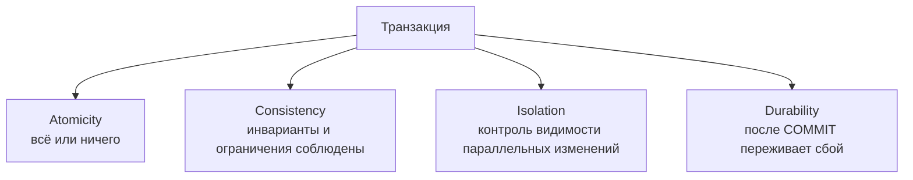
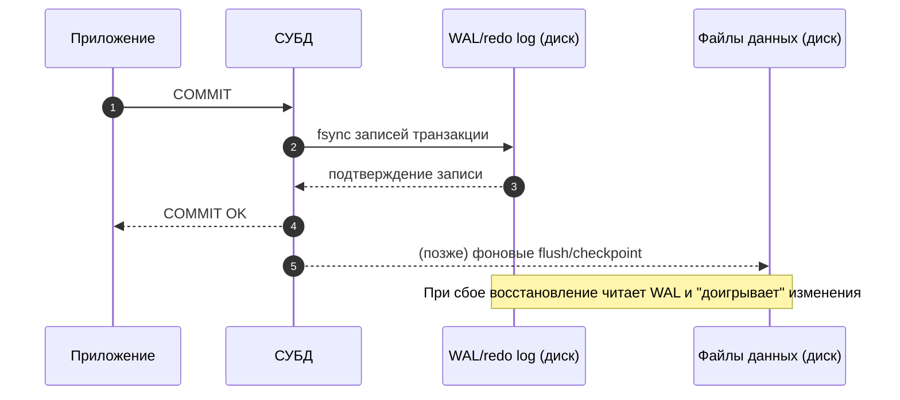
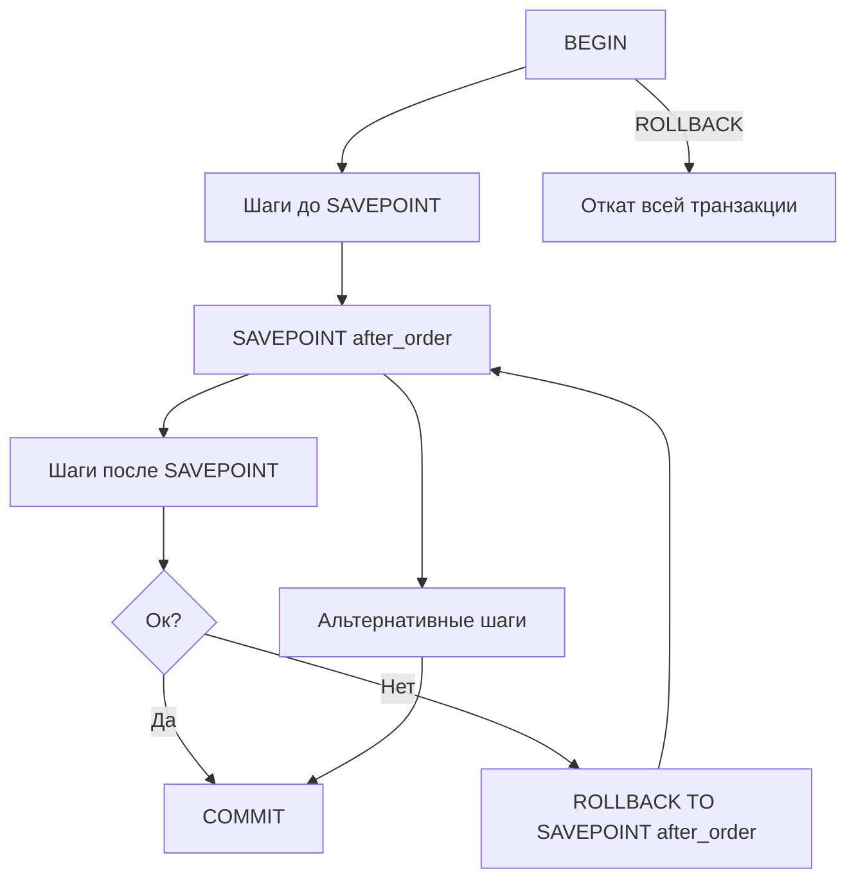

[← Назад к индексу части 4](index.md)

## 16. ACID и управление транзакциями

### 16.1. Что такое транзакция

**Цель раздела.**  
Понять транзакцию как **единицу работы** над базой данных: у неё есть границы (начало и конец), и с точки зрения логики она либо выполняется целиком, либо не выполняется вовсе.

#### Термины

- **Транзакция (transaction)** — последовательность одной или нескольких операций над данными (чтение, вставка, обновление, удаление), которая рассматривается как **единое целое**. Либо все операции транзакции вступают в силу (фиксируются), либо ни одна.
- **Границы транзакции** — момент начала (неявно или явно через `BEGIN` / `START TRANSACTION`) и момент завершения (`COMMIT` — успех, `ROLLBACK` — отмена).
- **Единица работы (unit of work)** — синоним транзакции в контексте «что мы считаем одним неделимым шагом с точки зрения приложения».

#### Теория и правила

- В реляционной модели и в SQL транзакция — это не «один запрос», а **набор запросов**, объединённых в одну логическую единицу. Типичный пример: перевод денег с одного счёта на другой — два UPDATE должны либо оба примениться, либо оба отмениться.
- СУБД гарантирует для транзакции свойства **ACID** (см. следующий подраздел): атомарность, согласованность, изоляцию, долговечность. Без транзакций при сбое или конкуренции мы могли бы получить «полузаписанное» состояние (деньги списали, но не зачислили).
- Транзакция начинается:
  - **неявно** — при первой команде в сессии, если включён автокоммит и предыдущая транзакция уже завершена;
  - **явно** — по команде `BEGIN` или `START TRANSACTION`.
- Транзакция заканчивается:
  - **успешно** — `COMMIT` (изменения сохраняются);
  - **отменой** — `ROLLBACK` (все изменения в рамках этой транзакции отменяются);
  - **при сбое** — СУБД сама откатывает незавершённую транзакцию при восстановлении после падения.

#### Примеры

**Пример 1: одна операция как транзакция (неявно).**

В режиме автокоммита каждый отдельный запрос — уже транзакция:

```sql
-- Включён autocommit (по умолчанию в большинстве драйверов).
UPDATE accounts SET balance = balance - 100 WHERE id = 1;
-- Сразу после выполнения эта одна команда закоммитилась.
-- Если бы после этого сервер упал, изменение уже сохранено.
```

**Пример 2: несколько операций — одна транзакция (явные границы).**

Перевод с счёта 1 на счёт 2:

```sql
BEGIN;
UPDATE accounts SET balance = balance - 100 WHERE id = 1;
UPDATE accounts SET balance = balance + 100 WHERE id = 2;
-- Если здесь вызвать ROLLBACK — оба UPDATE отменятся.
COMMIT;
```

Если после первого `UPDATE` произойдёт сбой или приложение вызовет `ROLLBACK`, второй `UPDATE` не применится — деньги не пропадут и не появятся «из ниоткуда».

#### Простыми словами

Транзакция — это **«пакет изменений»**: либо применяем весь пакет, либо ни одной части. Так мы избегаем ситуаций, когда полдела сделано (например, списали деньги, но не зачислили на другой счёт).

**Аналогия из жизни.** Представь, что ты переводишь деньги с одной карты на другую в приложении банка. «Списать с карты А» и «зачислить на карту Б» — это два шага. Если после списания приложение упадёт или отключится свет, банк не оставит деньги «в воздухе»: либо оба шага выполнены (деньги ушли с А и пришли на Б), либо оба отменены (ничего не произошло). В базе данных транзакция — это как раз такой «пакет»: либо все операции внутри неё сохраняются (COMMIT), либо все отменяются (ROLLBACK).

#### Картинка в голове

- **Начало транзакции** (BEGIN) — мы «открыли пакет»: все следующие команды относятся к этому пакету.
- **Команды внутри** — INSERT, UPDATE, DELETE и т.д. Пока мы не сказали COMMIT, другие пользователи базы **не видят** наших изменений (в зависимости от уровня изоляции).
- **COMMIT** — «запечатали пакет»: все изменения стали постоянными и видимыми всем.
- **ROLLBACK** — «выбросили пакет»: все изменения внутри транзакции отменены, база вернулась к состоянию на момент BEGIN.

```mermaid
flowchart LR
  A[BEGIN] --> B[Команды внутри транзакции<br/>(UPDATE/INSERT/DELETE/SELECT)]
  B --> C{Завершение}
  C -->|COMMIT| D[Изменения становятся<br/>видимыми другим и долговечными]
  C -->|ROLLBACK / сбой| E[Откат к состоянию<br/>на момент BEGIN]

  subgraph "Что видят другие сессии (типично)"
    B -. незакоммиченное обычно не видно .-> B
  end
```

#### Пошагово: что происходит при переводе денег

1. Ты выполняешь `BEGIN` — транзакция началась.
2. Ты выполняешь `UPDATE accounts SET balance = balance - 100 WHERE id = 1` — на счёте 1 баланс уменьшился **в рамках твоей транзакции**. Другие сессии пока не видят это изменение (если уровень изоляции не READ UNCOMMITTED).
3. Ты выполняешь `UPDATE accounts SET balance = balance + 100 WHERE id = 2` — на счёте 2 баланс увеличился в рамках твоей транзакции.
4. Ты выполняешь `COMMIT` — **только сейчас** оба изменения становятся постоянными и видимыми всем. База перешла в новое согласованное состояние.

Если на шаге 2 или 3 произойдёт ошибка (или ты сознательно сделаешь ROLLBACK), то **ни одно** из изменений не сохранится: и счёт 1, и счёт 2 останутся в старом состоянии. В этом и смысл «всё или ничего».

#### Что будет, если НЕ использовать транзакцию (явные границы)

Представь: ты делаешь два отдельных запроса **без** BEGIN/COMMIT (каждый запрос в режиме автокоммита — сам по себе транзакция).

1. Выполнился `UPDATE accounts SET balance = balance - 100 WHERE id = 1` — и сразу закоммитился. Деньги списаны с счёта 1.
2. В этот момент сервер падает, сеть обрывается или в приложении исключение. Второй запрос `UPDATE accounts SET balance = balance + 100 WHERE id = 2` **не выполнился**.
3. Итог: деньги ушли с счёта 1, но не пришли на счёт 2. Они «потерялись» с точки зрения пользователя. Так бывает, когда два действия не объединены в одну транзакцию.

**Вывод:** для операций, которые логически должны быть «одним целым» (перевод, создание заказа с позициями и т.д.), нужно явно открывать транзакцию (BEGIN), делать все шаги и закрывать её одним COMMIT (или ROLLBACK при ошибке).

#### Типичная ошибка

Забыли вызвать COMMIT после BEGIN и сделали несколько изменений. Пока транзакция не закрыта, изменения видны только в этой сессии; при закрытии соединения СУБД откатит незавершённую транзакцию — и все эти изменения пропадут. Всегда завершай транзакцию явно: либо COMMIT, либо ROLLBACK.

#### Как запомнить

**Одна фраза:** транзакция — это «пакет изменений» с началом (BEGIN) и концом (COMMIT или ROLLBACK); внутри пакета либо всё применяется, либо ничего.

#### Проверь себя (16.1)

Перевод денег: два UPDATE без BEGIN (каждый запрос в автокоммите). Первый UPDATE выполнился и закоммитился, потом сервер упал. Второй UPDATE не выполнился. Что в итоге с деньгами?  
<details><summary>Ответ</summary> Деньги **списались** с первого счёта (первый UPDATE уже закоммитился) и **не зачислились** на второй (второй не выполнился). Деньги «потерялись» с точки зрения пользователя. Поэтому для перевода нужен **один** BEGIN, оба UPDATE, потом один COMMIT — тогда либо оба применятся, либо оба отменятся.</details>

#### Запомните

- Транзакция — единица работы: набор операций с началом и концом.
- Либо все изменения транзакции фиксируются (`COMMIT`), либо все отменяются (`ROLLBACK` или сбой).
- Границы задаются явно (`BEGIN` … `COMMIT`/`ROLLBACK`) или неявно (один запрос при автокоммите).
- Для операций из нескольких шагов, которые должны быть «одним целым», всегда используй явный BEGIN … COMMIT (или ROLLBACK при ошибке).

---

### 16.2. ACID: четыре свойства

**Цель раздела.**  
Чётко понимать, что означают **атомарность**, **согласованность**, **изоляция** и **долговечность** и как они проявляются в работе СУБД.

#### Термины

- **Атомарность (Atomicity)** — транзакция выполняется **целиком или не выполняется**. Нет «половины транзакции»: при откате отменяются все изменения транзакции.
- **Согласованность (Consistency)** — транзакция переводит базу из **одного корректного состояния в другое**. Корректность задаётся схемой (ограничениями, инвариантами). СУБД проверяет ограничения и при их нарушении откатывает транзакцию.
- **Изоляция (Isolation)** — параллельные транзакции **изолированы** друг от друга: степень «видимости» незавершённых и чужих изменений зависит от уровня изоляции. Цель — избежать аномалий при одновременной работе.
- **Долговечность (Durability)** — после успешного **COMMIT** изменения **сохранены на диске** (через журнал — WAL/redo) и не теряются при сбое питания или падении процесса.

#### Теория и правила

- **Атомарность** обеспечивается механизмом отката (undo): СУБД запоминает «что менять обратно» и при ROLLBACK или сбое отменяет все действия транзакции.
- **Согласованность** — это не только «сумма не плавает», а соблюдение **всех** объявленных правил: PRIMARY KEY, UNIQUE, CHECK, FOREIGN KEY. Если в конце транзакции какое-то ограничение нарушено, СУБД откатывает транзакцию.
- **Изоляция** реализуется уровнями изоляции (READ COMMITTED, REPEATABLE READ, SERIALIZABLE и т.д.) и механизмами вроде блокировок и MVCC. Чем выше уровень, тем меньше аномалий, но тем больше накладных расходов.
- **Долговечность** обеспечивается записью в **журнал упреждающей записи (WAL)** до сброса изменённых страниц на диск. После COMMIT запись в WAL считается достаточной для восстановления при сбое.

#### Примеры

**Атомарность:**  
В транзакции выполняются три INSERT. После второго происходит ошибка (например, нарушение UNIQUE). При откате отменяется и первый INSERT — в таблице не остаётся «половины» транзакции.

**Согласованность:**  
Ограничение: `CHECK (balance >= 0)`. Транзакция делает `balance = -100`. СУБД откатывает транзакцию, состояние остаётся корректным.

**Изоляция:**  
При уровне READ COMMITTED мы не видим незакоммиченные изменения другой транзакции; при REPEATABLE READ не видим и новых закоммиченных изменений после нашего первого чтения (в рамках одной транзакции).

**Долговечность:**  
После `COMMIT` сервер выключили. После запуска данные восстанавливаются по WAL — изменения не теряются.

#### Простыми словами

- **Атомарность** — «всё или ничего»: либо все операции транзакции применились, либо ни одна.
- **Согласованность** — «правила схемы не нарушаются»: после транзакции база в допустимом состоянии (ограничения соблюдены).
- **Изоляция** — «параллельные транзакции не мешают друг другу видеть мусор»: что именно видит каждая транзакция, зависит от уровня изоляции.
- **Долговечность** — «после коммита данные уже не потеряются при сбое»: они записаны на диск через журнал (WAL).



**Картинка в голове (ACID в одном предложении на букву):**  
- **A** — «пакет» изменений: либо отправили **целиком** (COMMIT), либо **выбросили целиком** (ROLLBACK); половинки пакета не бывает.  
- **C** — после транзакции в базе **всё по правилам** (нет отрицательного баланса, дубликатов, «висячих» ссылок); если правило нарушено — транзакция откатывается.  
- **I** — я не вижу **чужие черновики** (незакоммиченное); что именно вижу от других — задаётся уровнем изоляции.  
- **D** — нажал «сохранить» (COMMIT) — данные **уже записаны на диск** (через WAL); сбой после этого их не сотрёт.

#### Разбираем каждое свойство подробно

**А — Атомарность (Atomicity)**

- **Что это значит по-русски:** транзакция ведёт себя как **один неделимый шаг**. Либо выполняются **все** операции внутри неё, либо **ни одна**. Нет состояния «половина транзакции выполнена».
- **Как это обеспечивается:** СУБД ведёт журнал отката (undo): запоминает, что нужно «отменить», если транзакция прервётся. При ROLLBACK или при сбое СУБД откатывает все действия этой транзакции по этому журналу.
- **Пример:** В транзакции три INSERT. После второго произошла ошибка (например, нарушение UNIQUE). СУБД откатывает и первый INSERT — в таблице не остаётся одной вставленной строки «из этой транзакции».
- **Как запомнить:** «Атом» не делится — и транзакция не делится: всё или ничего.

**C — Согласованность (Consistency)**

- **Что это значит по-русски:** транзакция переводит базу из **одного корректного состояния в другое**. «Корректное» задаётся твоей схемой: PRIMARY KEY, UNIQUE, CHECK, FOREIGN KEY и т.д. В конце транзакции все эти правила должны выполняться.
- **Важно:** согласованность — это не только «сумма не плавает». Это **все** объявленные ограничения. Если ты в транзакции нарушил CHECK (например, balance &lt; 0) или UNIQUE, СУБД откатит транзакцию и оставит базу в старом (согласованном) состоянии.
- **Пример:** Ограничение `CHECK (balance >= 0)`. Транзакция пытается сделать `balance = -100`. СУБД откатывает транзакцию целиком — отрицательного баланса не будет.
- **Как запомнить:** после транзакции база всегда в «правильном» состоянии по правилам схемы.

**I — Изоляция (Isolation)**

- **Что это значит по-русски:** параллельные транзакции **изолированы** друг от друга: то, что видит одна транзакция, не обязательно совпадает с тем, что видит другая в тот же момент. Степень изоляции задаётся **уровнем изоляции** (READ COMMITTED, REPEATABLE READ, SERIALIZABLE и т.д.).
- **Зачем:** без изоляции одна транзакция могла бы видеть незакоммиченные или частичные изменения другой — «грязное» чтение, неповторяющееся чтение, фантомы. Уровни изоляции как раз ограничивают, какие «странности» возможны.
- **Как запомнить:** изоляция — это «не мешать друг другу»: каждая транзакция видит согласованную картину в рамках выбранного уровня.

**D — Долговечность (Durability)**

- **Что это значит по-русски:** после того как ты сделал **COMMIT**, изменения **сохранены на диске** и не пропадут при сбое питания, падении процесса или перезагрузке сервера.
- **Как это обеспечивается:** СУБД использует **журнал упреждающей записи (WAL — Write-Ahead Log)**. Изменения сначала записываются в этот журнал на диск, и только потом (позже) переносятся в основные файлы данных. После COMMIT считается, что в WAL уже есть всё необходимое, чтобы восстановить эти изменения при аварии. Поэтому «после коммита данные не потеряются».
- **Пример:** Ты сделал COMMIT. Через секунду сервер выключили без корректного завершения. После включения СУБД восстанавливает данные по WAL — твои закоммиченные изменения на месте.
- **Как запомнить:** долговечность = «закоммитил — значит, записано на диск и переживёт сбой».



#### Что будет, если какого-то свойства нет

- **Без атомарности:** могло бы остаться «половина» транзакции (деньги списали, но не зачислили) — потеря или появление денег из ниоткуда.
- **Без согласованности:** в базе могли бы появиться отрицательные балансы, дубликаты по UNIQUE, «висячие» ссылки по FK — хаос в данных.
- **Без изоляции:** транзакции видели бы чужие незакоммиченные или частичные изменения — грязное чтение, потеря обновлений, неверные решения на основе «мусора».
- **Без долговечности:** после коммита при сбое данные могли бы пропасть — пользователь думает, что платёж прошёл, а после перезапуска его нет.

#### Другими словами (одна фраза на букву)

- **A** — «всё сделалось или ничего»; откат отменяет всё в транзакции.
- **C** — «правила схемы не нарушаются»; в конце транзакции все ограничения выполняются.
- **I** — «что я вижу от других — зависит от уровня изоляции»; не вижу «мусор» от чужих незавершённых транзакций.
- **D** — «закоммитил — значит, записано на диск»; сбой не сотрёт закоммиченное.

#### Проверь себя (16.2)

После COMMIT сервер выключили без корректного завершения. После включения данные из последней транзакции на месте. Какое свойство ACID это обеспечило?  
<details><summary>Ответ</summary> **Долговечность (Durability)**. После COMMIT изменения считаются записанными в журнал (WAL) на диск. При восстановлении после сбоя СУБД воспроизводит WAL — закоммиченные данные восстанавливаются.</details>

#### Запомните

- ACID — атомарность, согласованность, изоляция, долговечность.
- Атомарность = целиком или откат всего.
- Согласованность = переход между допустимыми состояниями (ограничения проверяются).
- Изоляция = степень видимости чужих изменений (зависит от уровня изоляции).
- Долговечность = после COMMIT данные сохранены на диске через WAL.

---

### 16.3. BEGIN, COMMIT, ROLLBACK

**Цель раздела.**  
Научиться явно начинать, завершать и отменять транзакцию с помощью `BEGIN`, `COMMIT`, `ROLLBACK`.

#### Термины

- **BEGIN** (или **START TRANSACTION**) — начать новую транзакцию. Все последующие команды до `COMMIT` или `ROLLBACK` выполняются в её контексте.
- **COMMIT** — завершить текущую транзакцию **успешно**; все изменения становятся постоянными и видимыми другим сессиям.
- **ROLLBACK** — **отменить** текущую транзакцию; все изменения, сделанные в этой транзакции, отменяются.

#### Синтаксис (PostgreSQL)

```sql
BEGIN;                    -- или START TRANSACTION;
-- команды
COMMIT;                    -- зафиксировать

-- либо
BEGIN;
-- команды
ROLLBACK;                  -- отменить
```

В MySQL допустимы `START TRANSACTION` и `BEGIN` (в InnoDB). После `ROLLBACK` или `COMMIT` транзакция завершена; следующая команда начнёт новую транзакцию (если снова не вызвать `BEGIN`).

#### Пошагово: что происходит при BEGIN → команды → COMMIT

1. **BEGIN** — СУБД «открывает» новую транзакцию. Все последующие команды в этой сессии до COMMIT или ROLLBACK выполняются **внутри** этой транзакции. Изменения пока не видны другим сессиям (при обычных уровнях изоляции).
2. **Команды** (INSERT, UPDATE, DELETE, SELECT и т.д.) — выполняются как обычно, но их эффект (изменения данных) **привязан к этой транзакции**. Другие сессии не видят твои незакоммиченные изменения (при READ COMMITTED и выше).
3. **COMMIT** — СУБД «закрывает» транзакцию **успешно**. Все изменения этой транзакции становятся **постоянными** и **видимыми** всем остальным сессиям. Транзакция закончена; следующая команда начнёт новую транзакцию (если не вызвать снова BEGIN).

#### Пошагово: что происходит при ROLLBACK

1. **ROLLBACK** — СУБД **отменяет** все изменения, сделанные в **текущей** транзакции (с момента последнего BEGIN). База возвращается к состоянию на момент BEGIN. Транзакция закончена; следующая команда начнёт новую транзакцию.

**Важно:** ROLLBACK отменяет **только** изменения **текущей** транзакции. То, что уже было закоммичено ранее (в других транзакциях), не трогается.

#### Примеры

**Успешное завершение:**

```sql
BEGIN;
INSERT INTO log (msg) VALUES ('start');
UPDATE accounts SET balance = balance - 50 WHERE id = 1;
UPDATE accounts SET balance = balance + 50 WHERE id = 2;
COMMIT;
```

После COMMIT все три операции (один INSERT и два UPDATE) стали постоянными. Другие сессии видят новые данные.

**Откат при ошибке (в приложении):**

```sql
BEGIN;
UPDATE accounts SET balance = balance - 50 WHERE id = 1;
-- приложение обнаружило ошибку (например, недостаточно средств)
ROLLBACK;
-- баланс счёта 1 не изменился — откатился весь UPDATE
```

**Откат из-за нарушения ограничения:**

```sql
BEGIN;
INSERT INTO users (id, email) VALUES (1, 'a@b.com');
INSERT INTO users (id, email) VALUES (2, 'a@b.com');  -- нарушение UNIQUE
-- СУБД откатывает транзакцию целиком (включая первую вставку)
-- В таблице users не остаётся ни строки (1, 'a@b.com'), ни (2, 'a@b.com')
```

#### Простыми словами

- **BEGIN** — «начинаем пакет изменений».
- **COMMIT** — «сохраняем пакет навсегда».
- **ROLLBACK** — «выбрасываем пакет, ничего не меняем».

#### Типичная ошибка

Сделали BEGIN, выполнили несколько команд и **забыли** вызвать COMMIT. Пока транзакция открыта, изменения видны только в твоей сессии. Когда соединение закроется (или таймаут), СУБД откатит незавершённую транзакцию — и все эти изменения пропадут. **Всегда** завершай транзакцию явно: либо COMMIT (успех), либо ROLLBACK (отмена).

**Путать ROLLBACK с «отменить последнюю команду».** ROLLBACK отменяет **всю** текущую транзакцию — **все** изменения с момента последнего BEGIN, а не только последнюю команду. Если ты сделал три UPDATE и хочешь отменить только третий — так нельзя; нужно было использовать SAVEPOINT перед третьим UPDATE и ROLLBACK TO SAVEPOINT.

#### Проверь себя (16.3)

В транзакции выполнены: UPDATE accounts SET balance = 100 WHERE id = 1; UPDATE accounts SET balance = 200 WHERE id = 2; потом вызван ROLLBACK. Что произойдёт с балансами на id=1 и id=2?  
<details><summary>Ответ</summary> **Оба** изменения отменятся. ROLLBACK отменяет **всю** текущую транзакцию — все изменения с момента BEGIN. Балансы на id=1 и id=2 вернутся к тем значениям, которые были до начала этой транзакции.</details>

#### Запомните

- `BEGIN` — начало транзакции; `COMMIT` — сохранить изменения; `ROLLBACK` — отменить все изменения транзакции.
- После `COMMIT` или `ROLLBACK` транзакция закрыта; следующая команда будет в новой транзакции (при автокоммите — неявной).
- Всегда явно завершай транзакцию (COMMIT или ROLLBACK), иначе при закрытии соединения изменения откатятся.

---

### 16.4. SAVEPOINT и вложенный откат

**Цель раздела.**  
Использовать **точки сохранения (SAVEPOINT)** внутри транзакции, чтобы откатывать только часть работы, не отменяя всю транзакцию.

#### Термины

- **SAVEPOINT имя** — пометить текущую точку внутри транзакции. Позже можно откатиться к ней, не отменяя всё с самого `BEGIN`.
- **ROLLBACK TO SAVEPOINT имя** — откатить все изменения **после** этой точки сохранения; сама точка сохранения остаётся (можно снова откатиться к ней).
- **RELEASE SAVEPOINT имя** — удалить точку сохранения (изменения не откатываются). В PostgreSQL после `RELEASE` откатиться к этому SAVEPOINT уже нельзя.

#### Синтаксис

```sql
BEGIN;
UPDATE accounts SET balance = balance - 100 WHERE id = 1;
SAVEPOINT first_step;
UPDATE accounts SET balance = balance + 100 WHERE id = 2;
-- что-то пошло не так с id = 2
ROLLBACK TO SAVEPOINT first_step;
-- теперь состояние: первый UPDATE есть, второй отменён
UPDATE accounts SET balance = balance + 100 WHERE id = 3;
COMMIT;
```

#### Пример

Сложная логика с «пробным» шагом:

```sql
BEGIN;
INSERT INTO orders (user_id, total) VALUES (1, 100) RETURNING id;
-- допустим, вернулся id = 101
SAVEPOINT after_order;
INSERT INTO order_items (order_id, product_id, qty) VALUES (101, 5, 2);
-- проверка: если товара нет или ошибка —
ROLLBACK TO SAVEPOINT after_order;
-- заказ (101) остаётся, строки в order_items от этого шага отменены
-- можно попробовать другой товар или откатить весь BEGIN через ROLLBACK
COMMIT;
```

#### Простыми словами

SAVEPOINT — это **«закладка» внутри транзакции**. Ты делаешь часть работы, ставишь закладку (SAVEPOINT), потом делаешь ещё работу. Если что-то пошло не так, можно «вернуться к закладке» (ROLLBACK TO SAVEPOINT) — отменятся только изменения **после** закладки, а не вся транзакция. Транзакция при этом остаётся открытой: можно попробовать другой путь или в конце сделать COMMIT.



**Когда полезно:** сложная логика в одной транзакции, где один из шагов может «не пройти» (например, вставка в дочернюю таблицу), и ты хочешь откатить только этот шаг, а не весь BEGIN.

**Картинка в голове:** транзакция — это «книга», которую ты заполняешь. SAVEPOINT — **закладка** на странице: «здесь я остановился». Ты продолжаешь писать дальше. Если следующий абзац получился неудачным, ты не выбрасываешь всю книгу — ты **возвращаешься к закладке** (ROLLBACK TO SAVEPOINT): стираешь только то, что написал **после** закладки. Всё, что было **до** закладки, остаётся. Книга (транзакция) при этом **не закрыта** — можно писать заново после закладки и в конце «опубликовать» (COMMIT) или выбросить всё (ROLLBACK).

#### Пошагово: что происходит с SAVEPOINT

1. **BEGIN** — транзакция началась.
2. **Команды до SAVEPOINT** — например, `UPDATE accounts SET balance = balance - 100 WHERE id = 1`. Эти изменения уже «в пакете».
3. **SAVEPOINT first_step** — мы пометили точку: «здесь состояние такое-то». Сама транзакция не закрыта.
4. **Команды после SAVEPOINT** — например, `UPDATE accounts SET balance = balance + 100 WHERE id = 2`. Если id = 2 не существует или ошибка — мы можем откатиться к first_step.
5. **ROLLBACK TO SAVEPOINT first_step** — отменяются **только** изменения после first_step (например, второй UPDATE). Первый UPDATE (до SAVEPOINT) **остаётся** в транзакции. Транзакция по-прежнему открыта.
6. Дальше можно сделать другой UPDATE (например, на id = 3) и **COMMIT** — тогда сохранятся изменения до SAVEPOINT плюс новые после ROLLBACK TO SAVEPOINT.

**Важно:** после ROLLBACK TO SAVEPOINT сама точка сохранения **остаётся**. Можно снова откатиться к ней. RELEASE SAVEPOINT удаляет точку (отката при этом нет).

#### Типичная ошибка

**Забыть, что после ROLLBACK TO SAVEPOINT транзакция не закрыта.** Ты откатился к закладке — часть изменений отменена, но транзакция **по-прежнему открыта**. Если после этого ничего не сделать и закрыть соединение, СУБД откатит **всю** транзакцию — в том числе изменения **до** SAVEPOINT. Поэтому после ROLLBACK TO SAVEPOINT нужно либо сделать новые шаги и **COMMIT**, либо сознательно сделать **ROLLBACK** (без TO), чтобы отменить всю транзакцию.

**Путать ROLLBACK TO SAVEPOINT с ROLLBACK.** ROLLBACK TO SAVEPOINT отменяет только то, что **после** точки; ROLLBACK (без TO) отменяет **всю** транзакцию с самого BEGIN.

#### Проверь себя (16.4)

После `ROLLBACK TO SAVEPOINT first_step` транзакция закрыта или ещё открыта? Нужно ли после этого вызывать COMMIT или ROLLBACK?  
<details><summary>Ответ</summary> Транзакция **ещё открыта**. Отменились только изменения после first_step; изменения до SAVEPOINT остались в транзакции. Нужно либо сделать новые команды и **COMMIT**, либо **ROLLBACK** (без TO), чтобы отменить всё и закрыть транзакцию.</details>

#### Запомните

- `SAVEPOINT name` создаёт точку, к которой можно откатиться.
- `ROLLBACK TO SAVEPOINT name` отменяет только изменения после этой точки; транзакция остаётся открытой.
- `RELEASE SAVEPOINT name` убирает точку без отката.
- После ROLLBACK TO SAVEPOINT не забывай завершить транзакцию (COMMIT или ROLLBACK).

---

### 16.5. Автокоммит и неявное начало транзакции

**Цель раздела.**  
Понять, когда транзакция начинается **неявно** и что такое **автокоммит**.

#### Термины

- **Автокоммит (autocommit)** — режим, при котором после каждой успешно выполненной команды СУБД автоматически выполняет `COMMIT`. Каждая одна команда — отдельная транзакция.
- **Неявное начало транзакции** — если автокоммит включён и предыдущая транзакция уже завершена, следующая команда начинает новую транзакцию без явного `BEGIN`.

#### Правила

- В PostgreSQL каждая сессия по умолчанию ведёт себя так: если не было `BEGIN`, то каждая отдельная команда выполняется в своей неявной транзакции и по завершении автоматически коммитится (режим «по одной команде»).
- После `BEGIN` автокоммит для этой сессии по сути «отключён» до `COMMIT` или `ROLLBACK`.
- В MySQL переменная `autocommit` по умолчанию `ON`; при `START TRANSACTION` автокоммит откладывается до конца транзакции.

#### Простыми словами

**Автокоммит включён (по умолчанию):** каждая одна команда — это как бы «мини-транзакция»: СУБД неявно делает «начало транзакции» перед командой и «COMMIT» после неё. Поэтому два отдельных запроса без BEGIN — это **две отдельные транзакции**. Если первый закоммитился, а второй не выполнился (сбой, ошибка), откатить первый уже нельзя.

**Явный BEGIN:** ты говоришь «теперь все команды до COMMIT/ROLLBACK — одна транзакция». Автокоммит для этой сессии «выключен» до конца транзакции.

#### Как запомнить

- Без явного BEGIN при автокоммите: **один запрос = одна транзакция** (неявно).
- С явным BEGIN: **все запросы до COMMIT/ROLLBACK = одна транзакция**.

#### Что будет, если не использовать BEGIN для многошаговой операции

Если ты делаешь **два запроса** (например, списать с одного счёта и зачислить на другой) **без** BEGIN — каждый запрос в режиме автокоммита сам по себе транзакция. Первый запрос выполнился и **сразу закоммитился**. Если после этого произойдёт сбой, ошибка в приложении или второй запрос не отправится — второй шаг не выполнится. Итог: деньги списались с первого счёта, но не зачислились на второй — «потеря» с точки зрения пользователя. **Вывод:** для любой операции из нескольких шагов, которые должны быть «одним целым», всегда используй **BEGIN** в начале, все шаги, затем **COMMIT** (или ROLLBACK при ошибке).

#### Проверь себя (16.5)

Автокоммит включён. Ты выполняешь два запроса подряд **без** BEGIN: первый — UPDATE счёта 1 (списать 100), второй — UPDATE счёта 2 (зачислить 100). Первый запрос выполнился и закоммитился; сразу после этого соединение разорвалось, второй запрос не выполнился. Что в итоге с деньгами? Почему так вышло и как правильно?  
<details><summary>Ответ</summary> Деньги **списались** с счёта 1 (первый UPDATE уже закоммитился) и **не зачислились** на счёт 2 (второй не выполнился) — деньги «потерялись». **Почему:** при автокоммите каждый запрос — отдельная транзакция; первый запрос сам по себе закоммитился. **Как правильно:** одна транзакция: BEGIN → UPDATE счёта 1 → UPDATE счёта 2 → COMMIT. Тогда либо оба выполнятся и закоммитятся вместе, либо при сбое откатятся оба.</details>

#### Запомните

- При включённом автокоммите каждая команда — отдельная транзакция (неявный BEGIN перед командой и COMMIT после).
- Явный `BEGIN` открывает транзакцию и удерживает её до `COMMIT`/`ROLLBACK`.
- Для многошаговых операций (перевод, заказ с позициями и т.д.) всегда явно открывай транзакцию (BEGIN).

---

**Краткое повторение раздела 16 (если бежишь по тексту):**  
Транзакция — «пакет изменений» с BEGIN и COMMIT/ROLLBACK; либо всё применяется, либо ничего (атомарность). ACID — атомарность, согласованность (правила схемы), изоляция (что видим от других), долговечность (после COMMIT — на диске). Явно управляем: BEGIN → команды → COMMIT или ROLLBACK; SAVEPOINT — закладка внутри транзакции, ROLLBACK TO SAVEPOINT отменяет только изменения после точки. Без явного BEGIN при автокоммите каждый запрос — отдельная транзакция; для многошаговых операций всегда BEGIN.

---

---

<!-- prev-next-nav -->
*[← Часть IV. Транзакции и согласованность](00_vvedenie_marshrut_i_oglavlenie.md) | [→ 17. Уровни изоляции](02_17_urovni_izolyatsii.md)*
