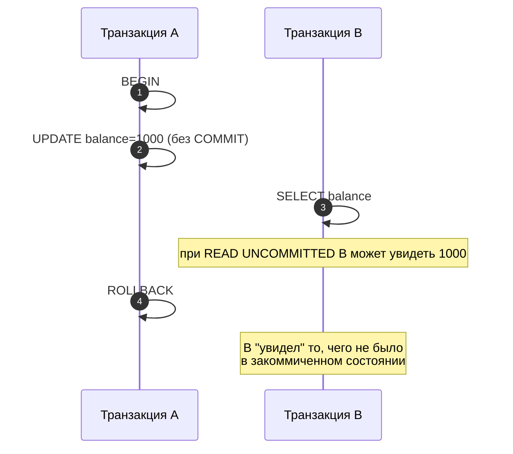
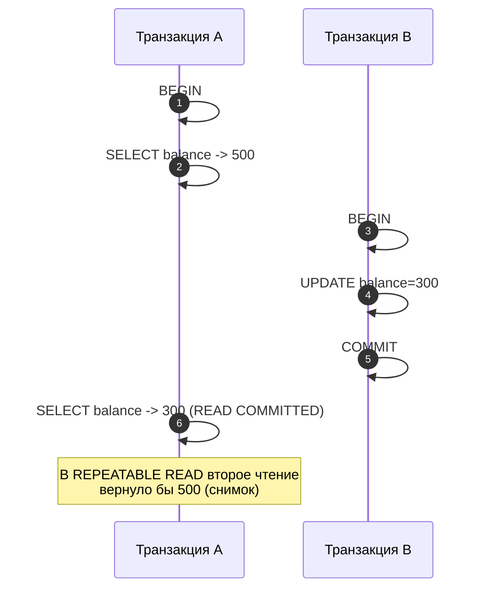
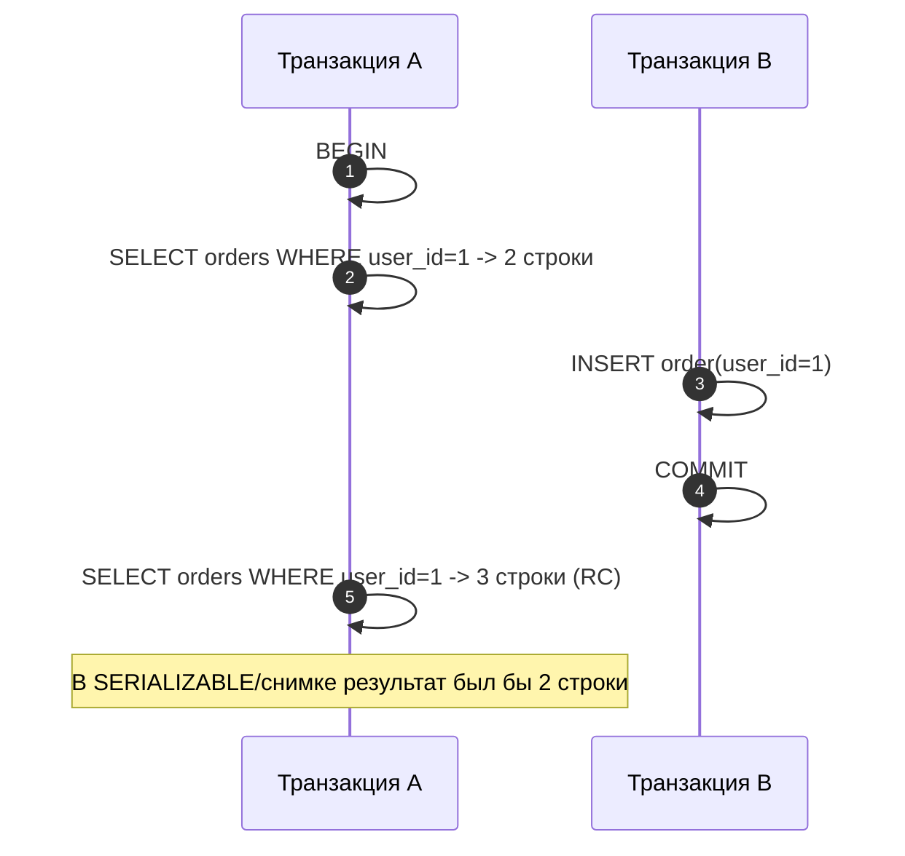

[← Назад к индексу части 4](index.md)

## 17. Уровни изоляции

### 17.1. Зачем нужна изоляция

**Цель раздела.**  
Понять конфликт между **параллелизмом** (много пользователей одновременно) и **предсказуемостью** (каждый хочет видеть согласованную картину данных). Уровни изоляции — это компромисс между ними.

#### Термины

- **Изоляция транзакций** — степень, в которой одна транзакция «не видит» незавершённые или частичные результаты другой.
- **Аномалия** — ситуация при параллельном выполнении, когда результат чтения или последовательность событий выглядят неинтуитивно или нарушают ожидания приложения (грязное чтение, неповторяющееся, фантом).

#### Теория

Чем выше изоляция, тем меньше аномалий, но тем больше блокировок или откатов и ниже пропускная способность. СУБД предлагают несколько уровней; приложение выбирает подходящий.

#### Простыми словами

**Параллелизм** — это когда много пользователей (или много запросов) работают с базой **одновременно**. Это нужно, чтобы система не «подвисала» и обрабатывала много запросов в секунду.

**Предсказуемость** — каждый хочет видеть **согласованную** картину: не «полузаписанные» данные, не «то 500, то 300 в одной транзакции», не «то 2 строки, то 3 при одном и том же запросе».

**Проблема:** если бы все транзакции видели все изменения друг друга «на лету», мы бы столкнулись с грязным чтением, неповторяющимся чтением и фантомами — логика приложения сломалась бы. Если бы мы «запирали» всю базу на время каждой транзакции, параллелизма бы не было — все бы ждали друг друга.

**Решение:** уровни изоляции. Мы **ограничиваем**, что именно одна транзакция «видит» из изменений других (незакоммиченные не видим при READ COMMITTED; закоммиченные после нашего начала не видим при REPEATABLE READ и т.д.). Так мы получаем и параллелизм, и разумную предсказуемость. Чем выше уровень изоляции, тем меньше «странностей», но тем дороже это обходится (блокировки, откаты, ожидания).

#### Как запомнить

Изоляция — это «правила видимости»: что наша транзакция может видеть из чужих изменений. Уровень изоляции задаёт эти правила и тем самым — компромисс между скоростью и предсказуемостью.

#### Запомните

- Изоляция нужна, чтобы параллельные транзакции не создавали путаницу.
- Уровень изоляции — компромисс между корректностью и производительностью.

#### Проверь себя (17.1)

Зачем вообще нужна изоляция транзакций? Ответ одной фразой: что будет без изоляции и что даёт изоляция.  
<details><summary>Ответ</summary> **Без изоляции** параллельные транзакции видели бы чужие незакоммиченные или частичные изменения — грязное чтение, потеря обновлений, неверные решения. **Изоляция** ограничивает, что одна транзакция «видит» из изменений других (по уровню изоляции), чтобы параллельная работа не приводила к путанице и ошибкам в логике приложения.</details>

---

### 17.2. Четыре уровня изоляции по SQL

**Цель раздела.**  
Знать четыре уровня изоляции по стандарту SQL и что каждый из них разрешает или запрещает.

#### Термины

- **READ UNCOMMITTED** — самый слабый уровень; допускается чтение **незакоммиченных** данных другой транзакции (грязное чтение).
- **READ COMMITTED** — видны только **закоммиченные** данные; грязное чтение невозможно; возможно неповторяющееся чтение.
- **REPEATABLE READ** — транзакция видит снимок данных на момент своего первого чтения (или начала); неповторяющееся чтение той же строки исключено; в стандарте фантомы возможны, в PostgreSQL при REPEATABLE READ фантомов нет за счёт snapshot.
- **SERIALIZABLE** — результат как при **последовательном** выполнении транзакций; полная изоляция от аномалий; реализуется через строгие блокировки или SSI (serializable snapshot isolation).

#### Таблица по стандарту

| Уровень           | Грязное чтение | Неповторяющееся чтение | Фантомное чтение |
|-------------------|----------------|------------------------|------------------|
| READ UNCOMMITTED  | возможно       | возможно               | возможно         |
| READ COMMITTED    | нет            | возможно               | возможно         |
| REPEATABLE READ   | нет            | нет                    | возможно         |
| SERIALIZABLE      | нет            | нет                    | нет              |

```mermaid
flowchart LR
  RU[READ UNCOMMITTED] --> RC[READ COMMITTED] --> RR[REPEATABLE READ] --> SZ[SERIALIZABLE]

  RU --- d1[грязное чтение: возможно]
  RU --- n1[неповторяющееся: возможно]
  RU --- p1[фантомы: возможно]

  RC --- d2[грязное: нет]
  RC --- n2[неповторяющееся: возможно]
  RC --- p2[фантомы: возможно]

  RR --- d3[грязное: нет]
  RR --- n3[неповторяющееся: нет]
  RR --- p3[фантомы: (по стандарту) возможно]

  SZ --- d4[грязное: нет]
  SZ --- n4[неповторяющееся: нет]
  SZ --- p4[фантомы: нет]
```

#### Простыми словами

- **READ UNCOMMITTED** — «вижу всё подряд», в том числе чужие незакоммиченные изменения (грязное чтение). Почти не используется.
- **READ COMMITTED** — «вижу только то, что уже закоммитили». Грязного чтения нет; но если в одной транзакции дважды прочитать одну строку, между чтениями кто-то мог её изменить и закоммитить — второе чтение вернёт другое значение (неповторяющееся чтение).
- **REPEATABLE READ** — «вижу снимок на момент начала транзакции». В одной транзакции одна и та же строка при повторном чтении даёт то же значение; новые закоммиченные изменения других транзакций после нашего начала не видны. В стандарте фантомы возможны; в PostgreSQL за счёт снимка фантомов в типичных запросах нет.
- **SERIALIZABLE** — «результат как будто транзакции выполнялись по очереди, одна за другой». Полная изоляция от аномалий; реализуется через строгие блокировки или SSI (serializable snapshot isolation). Дороже по производительности.

#### Как запомнить

Уровни идут «снизу вверх»: каждый следующий уровень **дополнительно** запрещает ещё одну группу аномалий. READ UNCOMMITTED — почти ничего не запрещает; SERIALIZABLE — запрещает всё.

#### Картинка в голове (как выбрать уровень)

- **READ COMMITTED** — «вижу только то, что уже закоммитили». Хватает для большинства приложений: нет грязного чтения, но при повторном чтении одной строки значение может измениться. Дефолт в PostgreSQL.
- **REPEATABLE READ** — «вижу снимок на момент начала транзакции». Нужен, когда в одной транзакции ты несколько раз читаешь одни и те же данные и ожидаешь, что они не изменятся (например, отчёт за период).
- **SERIALIZABLE** — «результат как при поочерёдном выполнении». Нужен, когда критична полная изоляция и возможны сложные пересечения чтений/записей; в PostgreSQL при этом возможна ошибка serialization failure — транзакцию нужно повторять.

#### Что будет, если выбрать уровень не тот

**Слишком низкий (например, READ COMMITTED, когда нужен REPEATABLE READ):** в одной транзакции при повторном чтении той же строки получишь другое значение — неповторяющееся чтение; логика «я дважды прочитал — данные те же» нарушится. **Слишком высокий (SERIALIZABLE везде):** больше откатов (serialization failure в PostgreSQL) и ожиданий — производительность ниже; используй SERIALIZABLE только там, где действительно нужна полная изоляция.

#### Проверь себя (17.2)

Какой уровень изоляции по стандарту SQL **полностью запрещает** фантомное чтение? Запрещает ли фантомы уровень REPEATABLE READ по стандарту?  
<details><summary>Ответ</summary> По стандарту SQL фантомное чтение **полностью запрещает только SERIALIZABLE**. Уровень **REPEATABLE READ** по стандарту фантомы **допускает** (в таблице в разделе 17.2 у REPEATABLE READ в колонке «Фантомное чтение» — «возможно»). В **PostgreSQL** REPEATABLE READ реализован через snapshot isolation, поэтому в типичных запросах фантомов нет — это особенность реализации, а не требование стандарта.</details>

#### Запомните

- READ UNCOMMITTED → READ COMMITTED → REPEATABLE READ → SERIALIZABLE: каждый следующий уровень запрещает ещё одну группу аномалий.
- В реальных СУБД (PostgreSQL, MySQL) реализации могут отличаться от «буквы» стандарта (например, REPEATABLE READ в PostgreSQL даёт snapshot и блокирует фантомы в типичных сценариях).

---

### 17.3. Аномалии: грязное, неповторяющееся, фантомное чтение

**Цель раздела.**  
Чётко различать три классические аномалии и понимать их на примерах.

#### Термины

- **Грязное чтение (dirty read)** — чтение строки, изменённой другой транзакцией, которая **ещё не сделала COMMIT**. Если та транзакция откатится, мы прочитали «несуществующие» данные.
- **Неповторяющееся чтение (non-repeatable read)** — в одной транзакции мы **дважды** читаем одну и ту же строку по одному и тому же ключу, а между чтениями другая транзакция **изменила и закоммитила** эту строку. Второе чтение возвращает другие данные.
- **Фантомное чтение (phantom read)** — в одной транзакции мы **дважды** выполняем один и тот же запрос по диапазону/условию; между выполнениями другая транзакция **вставила или удалила** строки, попадающие под условие. Второй запуск возвращает другой набор строк (появились или исчезли «фантомные» строки).

```mermaid
flowchart TB
  A[Аномалии конкурентного доступа] --> DR[Dirty read<br/>чтение незакоммиченного]
  A --> NR[Non-repeatable read<br/>одна строка → разные значения]
  A --> PR[Phantom read<br/>один запрос → разный набор строк]

  DR --> Hint1[Лечится: минимум READ COMMITTED]
  NR --> Hint2[Лечится: REPEATABLE READ (снимок)]
  PR --> Hint3[Лечится: SERIALIZABLE<br/>или snapshot+range/gap locks (в зависимости от СУБД)]
```

#### Примеры и пошаговые таймлайны

**1. Грязное чтение (dirty read) — возможно при READ UNCOMMITTED**

Что происходит по шагам (по времени):

| Момент | Транзакция A | Транзакция B | Состояние в БД (id=1) |
|--------|--------------|--------------|------------------------|
| T1 | BEGIN | — | balance = 500 (старое) |
| T2 | UPDATE accounts SET balance = 1000 WHERE id = 1; (не COMMIT) | — | В A видно 1000; на диске ещё может быть 500 до сброса |
| T3 | — | BEGIN (если нужно) | — |
| T4 | — | SELECT balance FROM accounts WHERE id = 1; | **B видит 1000** (прочитал незакоммиченное!) |
| T5 | ROLLBACK; | — | balance снова 500; изменение A отменено |
| T6 | — | Дальше B решает что-то сделать, думая, что balance = 1000 | **Проблема:** B строил логику на значении 1000, которого «никогда не было» в закоммиченном состоянии. Данные «грязные». |

**Итог:** B прочитал **незакоммиченные** данные A. A откатился — значит, то, что видел B, «исчезло». Это и есть грязное чтение: читаем «грязные» (неподтверждённые) данные.

**При READ COMMITTED и выше** на шаге T4 транзакция B **не увидела бы** 1000 — она увидела бы старые закоммиченные 500. Поэтому грязное чтение при READ COMMITTED невозможно.



---

**2. Неповторяющееся чтение (non-repeatable read) — возможно при READ COMMITTED**

Что происходит по шагам:

| Момент | Транзакция A | Транзакция B | Что видит A при чтении id=1 |
|--------|--------------|--------------|-----------------------------|
| T1 | BEGIN | — | — |
| T2 | SELECT balance FROM accounts WHERE id = 1; | — | **500** (первое чтение) |
| T3 | — | BEGIN; UPDATE accounts SET balance = 300 WHERE id = 1; COMMIT; | — |
| T4 | SELECT balance FROM accounts WHERE id = 1; (второй раз) | — | **300** (второе чтение) |
| T5 | COMMIT или дальше работа | — | — |

**Итог:** в **одной и той же** транзакции A мы **дважды** прочитали одну и ту же строку (id = 1). Первый раз — 500, второй раз — 300. Значение «не повторилось» — между чтениями другая транзакция B изменила и закоммитила эту строку. Это неповторяющееся чтение.

**Почему это может мешать:** A мог принять решение на основе первого чтения (500), а потом прочитать снова и увидеть другое значение — логика «в рамках одной транзакции одна и та же строка не меняется» нарушена.

**При REPEATABLE READ** (в PostgreSQL — снимок на начало транзакции) второе чтение в A по-прежнему вернуло бы **500** — A не видит коммиты B после своего начала. Поэтому неповторяющееся чтение при REPEATABLE READ исключено.



---

**3. Фантомное чтение (phantom read)**

Что происходит по шагам:

| Момент | Транзакция A | Транзакция B | Результат SELECT * FROM orders WHERE user_id = 1 в A |
|--------|--------------|--------------|------------------------------------------------------|
| T1 | BEGIN | — | — |
| T2 | SELECT * FROM orders WHERE user_id = 1; | — | **2 строки** (первый запуск запроса) |
| T3 | — | INSERT INTO orders (user_id, ...) VALUES (1, ...); COMMIT; | — |
| T4 | SELECT * FROM orders WHERE user_id = 1; (второй раз тот же запрос) | — | **3 строки** (второй запуск) |
| T5 | COMMIT или дальше | — | — |

**Итог:** в одной транзакции A один и тот же запрос (по одному и тому же условию user_id = 1) выполнен **дважды**. Первый раз — 2 строки, второй раз — 3 строки. Появилась «фантомная» строка — её вставила и закоммитила B между двумя чтениями A. Это фантомное чтение.

**Почему «фантом»:** новая строка «появилась из ниоткуда» с точки зрения транзакции A — при первом чтении её не было, при втором есть.

**При SERIALIZABLE** (и в PostgreSQL при REPEATABLE READ за счёт снимка) второй запуск в A по-прежнему вернул бы **2 строки** — A не видит новые закоммиченные строки, вставленные после начала его транзакции. Фантомов нет.



#### Простыми словами

- **Грязное чтение** — читаем то, что другая транзакция ещё не закоммитила; она может откатиться — и мы «видели то, чего не было».
- **Неповторяющееся чтение** — в одной транзакции дважды читаем одну и ту же строку и получаем **разные значения**, потому что между чтениями кто-то её изменил и закоммитил.
- **Фантомное чтение** — в одной транзакции дважды выполняем один и тот же запрос по условию и получаем **разный набор строк** (появились или исчезли строки), потому что между запусками кто-то вставил или удалил строки.

#### Как запомнить (одна фраза на аномалию)

- **Грязное** — «прочитал чужой черновик, а он потом стёр».
- **Неповторяющееся** — «прочитал строку два раза — значения разные».
- **Фантом** — «прочитал список два раза — количество строк разное».

**Картинка в голове (по одной на аномалию):**  
- **Грязное чтение** — ты открыл **чужой черновик** (другой ещё не нажал «сохранить»). Он потом стёр черновик (ROLLBACK) — а ты уже принял решение по нему. Ты опирался на то, чего «официально» не было.  
- **Неповторяющееся чтение** — ты **дважды** посмотрел в **одну и ту же ячейку** таблицы (например, баланс счёта id=1). В первый раз там было 500, во второй раз — 300. Одна ячейка, два взгляда — **разные числа**. Кто-то между твоими взглядами изменил и закоммитил.  
- **Фантом** — ты **дважды** выполнил один и тот же запрос («все заказы пользователя 1»). В первый раз — 2 строки, во второй раз — 3. **Список изменился**: появилась «фантомная» строка, которую вставил другой между твоими запросами. Один запрос, два запуска — **разное количество строк**.

#### Другими словами (если всё ещё путаешь)

- **Грязное чтение** = я прочитал то, что другой **ещё не подтвердил** (не сделал COMMIT). Он может откатиться — и то, что я прочитал, «исчезнет». Как будто я прочитал черновик, а не итоговый документ.
- **Неповторяющееся чтение** = я в **одной** своей транзакции **дважды** прочитал **одну строку** (по одному ключу). Ожидал увидеть одно и то же. Увидел **разные значения** — потому что между моими чтениями кто-то успел изменить эту строку и закоммитить.
- **Фантом** = я в одной транзакции **дважды** выполнил **один и тот же запрос** (например, «все заказы пользователя 1»). Ожидал один и тот же список. Получил **разное количество строк** — потому что между запусками кто-то вставил или удалил строки, попадающие под условие.

#### Проверь себя (17.3)

Чем отличается неповторяющееся чтение от фантомного? В обоих случаях мы дважды что-то читаем в одной транзакции и получаем разный результат.  
<details><summary>Ответ</summary> **Неповторяющееся чтение** — мы дважды читаем **одну и ту же строку** (по одному ключу, например id=1) и получаем **разные значения в этой строке** (например, сначала 500, потом 300). **Фантомное чтение** — мы дважды выполняем **один и тот же запрос по условию** (например, все заказы user_id=1) и получаем **разный набор строк** (сначала 2 строки, потом 3) — изменилось **количество** или состав строк, а не значение одной строки.</details>

#### Запомните

- **Грязное** — читаем незакоммиченное (может исчезнуть при ROLLBACK).
- **Неповторяющееся** — одна строка меняется между двумя чтениями в одной транзакции.
- **Фантом** — один и тот же запрос возвращает разный набор строк (появились/исчезли строки).

---

### 17.4. Установка уровня изоляции

**Цель раздела.**  
Уметь задавать уровень изоляции для сессии или транзакции.

#### Синтаксис (PostgreSQL)

```sql
-- для следующей транзакции (в рамках сессии)
SET TRANSACTION ISOLATION LEVEL READ COMMITTED;
SET TRANSACTION ISOLATION LEVEL REPEATABLE READ;
SET TRANSACTION ISOLATION LEVEL SERIALIZABLE;

-- или в начале транзакции
BEGIN TRANSACTION ISOLATION LEVEL REPEATABLE READ;
```

Уровень нужно устанавливать **до** начала транзакции (до первой команды, меняющей данные, или до явного BEGIN). В PostgreSQL по умолчанию используется **READ COMMITTED**.

**MySQL:**

```sql
SET SESSION TRANSACTION ISOLATION LEVEL REPEATABLE READ;
-- по умолчанию в MySQL (InnoDB) — REPEATABLE READ
```

#### Типичная ошибка

**Установить уровень изоляции после BEGIN.** Уровень изоляции действует на **текущую** транзакцию. Если ты уже сделал BEGIN, транзакция уже началась — и уровень изоляции для неё уже зафиксирован (по умолчанию READ COMMITTED в PostgreSQL). Команда `SET TRANSACTION ISOLATION LEVEL REPEATABLE READ` после BEGIN **не применится** к этой транзакции; она применится к **следующей**. Поэтому порядок такой: сначала SET TRANSACTION ISOLATION LEVEL (или BEGIN TRANSACTION ISOLATION LEVEL ...), **потом** команды транзакции.

#### Простыми словами

Уровень изоляции задаётся **один раз на транзакцию** — в её начале. В PostgreSQL: либо `SET TRANSACTION ISOLATION LEVEL ...` (для следующей транзакции), либо `BEGIN TRANSACTION ISOLATION LEVEL REPEATABLE READ` (сразу начать транзакцию с нужным уровнем). В MySQL — `SET SESSION TRANSACTION ISOLATION LEVEL ...`; уровень действует на следующие транзакции в этой сессии.

#### Пошагово: правильный порядок (уровень изоляции + транзакция)

1. **Сначала** задаёшь уровень изоляции: `SET TRANSACTION ISOLATION LEVEL REPEATABLE READ` (или `BEGIN TRANSACTION ISOLATION LEVEL REPEATABLE READ`).
2. **Потом** выполняешь команды транзакции (SELECT, UPDATE и т.д.).
3. **В конце** — COMMIT или ROLLBACK.  
Если сделать наоборот — сначала BEGIN, потом SET TRANSACTION — уровень **не применится** к уже открытой транзакции; он применится к **следующей**. Текущая транзакция останется с уровнем по умолчанию (READ COMMITTED в PostgreSQL).

#### Проверь себя (17.4)

В каком порядке нужно выполнить команды: сначала SET TRANSACTION ISOLATION LEVEL REPEATABLE READ, потом BEGIN — или сначала BEGIN, потом SET TRANSACTION ISOLATION LEVEL? Почему?  
<details><summary>Ответ</summary> **Сначала** SET TRANSACTION ISOLATION LEVEL (или сразу BEGIN TRANSACTION ISOLATION LEVEL REPEATABLE READ), **потом** команды транзакции. Если сделать **сначала BEGIN**, транзакция уже началась и уровень изоляции для неё зафиксирован (по умолчанию READ COMMITTED). Команда SET TRANSACTION ISOLATION LEVEL после BEGIN применится к **следующей** транзакции, а не к текущей. Поэтому уровень задают **до** начала транзакции.</details>

#### Запомните

- `SET TRANSACTION ISOLATION LEVEL ...` задаёт уровень для следующей транзакции.
- В PostgreSQL по умолчанию — READ COMMITTED; в MySQL (InnoDB) — REPEATABLE READ.
- Уровень нужно задавать **до** начала транзакции (до BEGIN или до первой команды).

---

### 17.5. PostgreSQL и MySQL: отличия реализации

**Цель раздела.**  
Понимать основные отличия реализации уровней изоляции в PostgreSQL и MySQL.

#### Кратко

- **PostgreSQL**
  - READ UNCOMMITTED трактуется как READ COMMITTED (грязного чтения нет).
  - REPEATABLE READ реализован через **snapshot isolation**: снимок на начало транзакции, фантомов в типичных запросах нет.
  - SERIALIZABLE реализован через **SSI** (serializable snapshot isolation): при обнаружении rw-конфликта — serialization failure и повтор.
- **MySQL (InnoDB)**
  - REPEATABLE READ обеспечивается снимком + **gap locks** (блокировки «промежутков»), что предотвращает вставку в диапазон и фантомы.
  - SERIALIZABLE добавляет блокировки так, что по сути каждый SELECT ведёт себя как SELECT ... LOCK IN SHARE MODE.

Эти отличия важно учитывать при переносе приложений между СУБД и при настройке повторных попыток (например, при serialization failure в PostgreSQL).

#### Простыми словами

**PostgreSQL:** даже если ты поставишь READ UNCOMMITTED, грязного чтения не будет — СУБД ведёт себя как READ COMMITTED. REPEATABLE READ реализован через **снимок на начало транзакции**: ты «видишь» базу такой, какой она была в момент BEGIN; новые закоммиченные изменения других не видны, фантомов в обычных запросах нет. SERIALIZABLE реализован через **SSI**: СУБД отслеживает «кто что прочитал и кто что потом изменил»; если обнаруживается несериализуемый порядок, одна из транзакций получает ошибку **serialization failure** и откатывается — приложение должно повторить транзакцию.

**MySQL (InnoDB):** REPEATABLE READ достигается снимком **плюс блокировками «промежутков» (gap locks)** — так блокируются «дыры» между строками, и вставка в этот диапазон не проходит, пока транзакция не закончится; фантомов нет. SERIALIZABLE усиливает блокировки так, что по сути каждый SELECT ведёт себя как «заблокировать на чтение» — параллелизм ниже, чем в PostgreSQL при SERIALIZABLE.

**Практический вывод:** в PostgreSQL при SERIALIZABLE нужно в коде обрабатывать serialization failure (повтор транзакции). В MySQL при REPEATABLE READ блокировок больше, чем в PostgreSQL при REPEATABLE READ — возможны больше ожиданий.

#### Проверь себя (17.5)

В PostgreSQL при уровне изоляции SERIALIZABLE транзакция иногда завершается с ошибкой (не «успех», а исключение). Как называется эта ошибка и что должно сделать приложение?  
<details><summary>Ответ</summary> Ошибка называется **serialization failure**. СУБД обнаружила возможный несериализуемый порядок (rw-конфликт) и откатила транзакцию. **Приложение должно:** откатить транзакцию (ROLLBACK), если ещё не откатила СУБД, и **повторить транзакцию целиком** (retry) — снова BEGIN и те же запросы. Обычно делают ограниченное число попыток (например, 3) с небольшой паузой.</details>

#### Как запомнить

PostgreSQL: REPEATABLE READ = снимок (без лишних блокировок); SERIALIZABLE = SSI (при конфликте — serialization failure, повтор). MySQL: REPEATABLE READ = снимок + gap locks; SERIALIZABLE = ещё больше блокировок.

#### Запомните

- В PostgreSQL нет настоящего READ UNCOMMITTED; REPEATABLE READ = snapshot; SERIALIZABLE = SSI.
- В MySQL REPEATABLE READ использует gap locks; SERIALIZABLE усиливает блокировки.

---

**Краткое повторение раздела 17 (если бежишь по тексту):**  
Уровни изоляции — компромисс между параллелизмом и предсказуемостью. READ UNCOMMITTED → READ COMMITTED → REPEATABLE READ → SERIALIZABLE: каждый следующий запрещает ещё аномалии. Три аномалии: грязное чтение (незакоммиченное), неповторяющееся (одна строка — разные значения), фантом (разный набор строк). Уровень задаётся до начала транзакции (SET TRANSACTION ISOLATION LEVEL или BEGIN TRANSACTION ISOLATION LEVEL). В PostgreSQL REPEATABLE READ = snapshot, SERIALIZABLE = SSI; в MySQL REPEATABLE READ = snapshot + gap locks.

---

---

<!-- prev-next-nav -->
*[← 16. ACID и управление транзакциями](01_16_acid_i_upravlenie_tranzaktsiyami.md) | [→ 18. Блокировки](03_18_blokirovki.md)*
