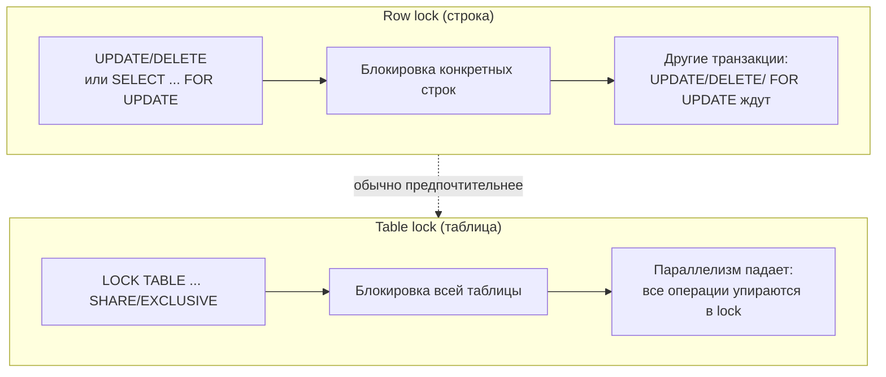
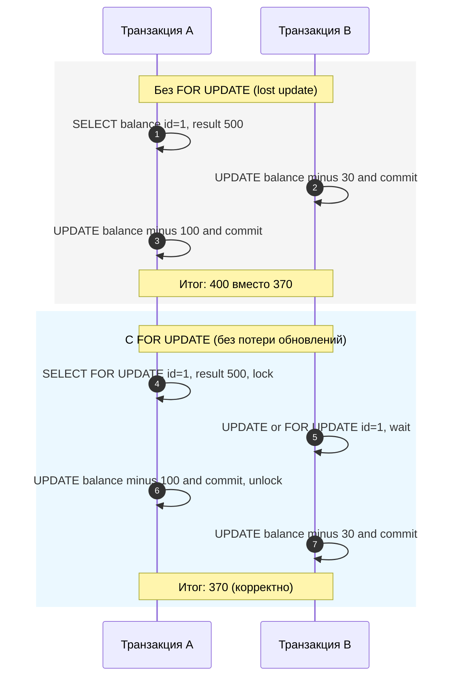
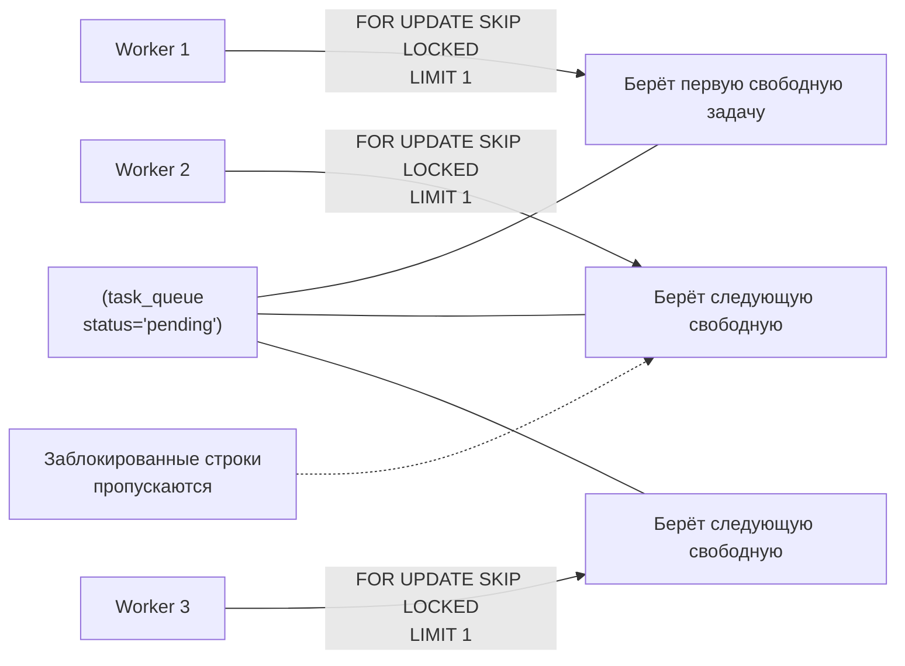
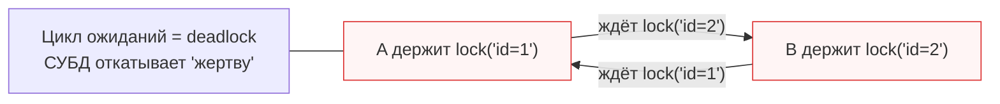

[← Назад к индексу части 4](index.md)

## 18. Блокировки

**Зачем этот блок.** Уровни изоляции (раздел 17) задают, **что** видит транзакция из чужих изменений. Но чтобы **гарантированно** изменить строку и не получить lost update (когда две транзакции перезаписывают друг друга), нужно **явно заблокировать** строку перед изменением — например, `SELECT ... FOR UPDATE`. Блокировки позволяют «зарезервировать» строку или таблицу до конца транзакции. Здесь мы разбираем: когда СУБД блокирует сама (при UPDATE/DELETE), когда блокируем мы явно (FOR UPDATE, FOR SHARE, LOCK TABLE), как не ждать чужие блокировки (SKIP LOCKED, NOWAIT), прикладные блокировки (advisory) и взаимную блокировку (deadlock).

---

### 18.1. Блокировки строк и таблиц

**Цель раздела.**  
Понять, когда СУБД блокирует **строки** и **таблицы** и какие режимы блокировок бывают.

#### Термины

- **Блокировка строки (row lock)** — при UPDATE или DELETE строка помечается как заблокированная этой транзакцией до COMMIT/ROLLBACK. Другая транзакция не может изменить ту же строку (и в зависимости от уровня изоляции — может или не может её читать по-другому).
- **Блокировка таблицы (table lock)** — блокировка всей таблицы. Режимы в PostgreSQL: **SHARE** (совместное чтение, нельзя менять данные) и **EXCLUSIVE** (монопольный доступ на изменение).

#### Синтаксис блокировки таблицы (PostgreSQL)

```sql
LOCK TABLE table_name IN SHARE MODE;      -- другие могут читать, не могут писать
LOCK TABLE table_name IN EXCLUSIVE MODE;  -- другие не могут ни читать с блокировкой, ни писать
```

Блокировка таблицы держится до конца транзакции. Обычно приложение блокирует строки (`SELECT FOR UPDATE`), а не целые таблицы, чтобы не убивать параллелизм.

**Картинка в голове:** UPDATE или DELETE — это как «взять строку под замок». Пока ты не сделал COMMIT или ROLLBACK, замок висит на этой строке. Другой пользователь хочет изменить ту же строку — подходит и **ждёт** у замка. Как только ты сделал COMMIT (или ROLLBACK), замок снимается — следующий может изменить строку. LOCK TABLE — «замок на всю комнату (таблицу)»: пока ты держишь ключ, никто не может менять ни одну строку в этой таблице (при EXCLUSIVE) или менять данные (при SHARE). Поэтому LOCK TABLE используют редко — блокирует всех.



#### Простыми словами

- **Блокировка строки** — при UPDATE или DELETE СУБД «помечает» затронутые строки как «занятые этой транзакцией» до COMMIT или ROLLBACK. Другая транзакция не может изменить ту же строку (будет ждать или получит ошибку при NOWAIT).
- **Блокировка таблицы** — «занята» вся таблица. SHARE — другие могут читать, но не менять; EXCLUSIVE — монопольный доступ на изменение. Используется редко (например, массовое обновление по всей таблице), потому что блокирует всех остальных.

#### Как запомнить

Строку блокируют при UPDATE/DELETE автоматически; таблицу блокируют явно через LOCK TABLE, когда нужен доступ ко всей таблице целиком.

#### Типичная ошибка

**Блокировать всю таблицу (LOCK TABLE), когда достаточно заблокировать несколько строк.** LOCK TABLE блокирует **всех** остальных: никто не может изменить ни одну строку таблицы (при EXCLUSIVE) или менять данные (при SHARE) до твоего COMMIT/ROLLBACK. Параллелизм падает. Обычно достаточно заблокировать только нужные строки — через UPDATE/DELETE (блокируются затронутые строки) или SELECT ... FOR UPDATE (явно блокируем выбранные строки). LOCK TABLE используй только когда действительно нужна операция по **всей** таблице (например, массовое обновление с особыми требованиями).

#### Проверь себя (18.1)

Когда строка таблицы блокируется — при выполнении SELECT * FROM t WHERE id = 1 или при выполнении UPDATE t SET ... WHERE id = 1? Объясни в одной фразе.  
<details><summary>Ответ</summary> Строка блокируется при **UPDATE** (и при DELETE) — СУБД помечает затронутые строки как заблокированные этой транзакцией до COMMIT/ROLLBACK. Обычный **SELECT** (без FOR UPDATE) **не блокирует** строки в типичной реализации с MVCC — он просто читает версию по снимку. Чтобы явно заблокировать строку при чтении, нужен **SELECT ... FOR UPDATE**.</details>

#### Запомните

- UPDATE/DELETE блокируют затронутые строки до конца транзакции.
- `LOCK TABLE ... IN SHARE MODE / EXCLUSIVE MODE` блокирует всю таблицу до COMMIT/ROLLBACK.
- Не блокируй всю таблицу, если достаточно заблокировать нужные строки (FOR UPDATE по условию).

---

### 18.2. SELECT FOR UPDATE и FOR SHARE

**Цель раздела.**  
Использовать явную блокировку строк при чтении, чтобы потом безопасно их обновить.

#### Термины

- **SELECT FOR UPDATE** — выбрать строки и **заблокировать их для обновления**. Другие транзакции не смогут их изменить или также заблокировать FOR UPDATE до конца нашей транзакции; они будут ждать или получат ошибку (если используется NOWAIT).
- **SELECT FOR SHARE** — заблокировать строки в режиме «для чтения»: другие могут тоже читать (FOR SHARE), но не могут менять (FOR UPDATE) до нашего COMMIT/ROLLBACK.

#### Синтаксис

```sql
SELECT * FROM accounts WHERE id = 1 FOR UPDATE;
-- далее в той же транзакции безопасно:
UPDATE accounts SET balance = balance - 100 WHERE id = 1;
COMMIT;
```

```sql
SELECT * FROM documents WHERE status = 'draft' FOR SHARE;
-- другие сессии могут тоже делать FOR SHARE, но не UPDATE
```

#### Пример: перевод с проверкой баланса

```sql
BEGIN;
SELECT balance FROM accounts WHERE id = 1 FOR UPDATE;
-- если balance < 100, делаем ROLLBACK
UPDATE accounts SET balance = balance - 100 WHERE id = 1;
UPDATE accounts SET balance = balance + 100 WHERE id = 2;
COMMIT;
```

Без `FOR UPDATE` между SELECT и UPDATE другая транзакция могла бы изменить строку (lost update).

#### Пошагово: зачем нужен FOR UPDATE при переводе

1. **Без FOR UPDATE:**  
   Транзакция A: `SELECT balance FROM accounts WHERE id = 1;` → 500.  
   Транзакция B: тоже `SELECT ... WHERE id = 1` → 500, потом `UPDATE ... SET balance = balance - 30 WHERE id = 1; COMMIT;` → баланс стал 470.  
   Транзакция A: `UPDATE accounts SET balance = balance - 100 WHERE id = 1;` — она считает от 500, делает balance = 400, и коммитит. **Итог:** на счёте 400, хотя B уже снял 30 (должно было быть 370). Обновление B «потерялось» (lost update).  

2. **С FOR UPDATE:**  
   Транзакция A: `SELECT balance FROM accounts WHERE id = 1 FOR UPDATE;` → 500, **и строка id=1 заблокирована**.  
   Транзакция B: `SELECT ... WHERE id = 1 FOR UPDATE;` (или просто UPDATE) — **ждёт**, пока A не сделает COMMIT или ROLLBACK.  
   Транзакция A: `UPDATE ... SET balance = balance - 100 WHERE id = 1; COMMIT;` → баланс 400, блокировка снята.  
   Транзакция B: теперь получает строку (баланс уже 400), снимает 30, коммитит → 370. **Итог:** обновления не теряются, порядок предсказуем.



**Вывод:** FOR UPDATE нужен, когда ты **читаешь строку, чтобы потом её обновить** и не хочешь, чтобы между чтением и обновлением кто-то её изменил (защита от lost update).

#### Типичная ошибка

**Сделать SELECT ... FOR UPDATE и надолго «забыть» про транзакцию.** Пока ты держишь блокировку (не сделал COMMIT или ROLLBACK), другие сессии **ждут** при попытке изменить или заблокировать ту же строку. Если после FOR UPDATE приложение делает долгие вычисления, обращается к внешнему API или ждёт ввода пользователя — блокировка держится всё это время. Итог: другие пользователи получают таймауты или долгие ожидания. **Правило:** держи транзакцию с FOR UPDATE **короткой**: прочитал → проверил → обновил → сразу COMMIT (или ROLLBACK). Не делай между SELECT FOR UPDATE и UPDATE долгих операций вне БД.

#### Простыми словами

- **FOR UPDATE** — «я эту строку собираюсь менять, пока я не закончу — её никто не трогай».
- **FOR SHARE** — «я её только читаю, но менять нельзя, пока я не закончу» (другие тоже могут читать с FOR SHARE).

#### Запомните

- `SELECT ... FOR UPDATE` — блокируем строки для последующего обновления; другие не могут их изменить до нашего COMMIT.
- `SELECT ... FOR SHARE` — блокируем «на чтение»; другие не могут обновлять, но могут FOR SHARE.
- Используй FOR UPDATE, когда читаешь строку, чтобы потом её обновить, и не хочешь lost update.

---

### 18.3. SKIP LOCKED и NOWAIT

**Цель раздела.**  
Использовать **SKIP LOCKED** и **NOWAIT** чтобы не ждать чужие блокировки: либо пропускать заблокированные строки, либо сразу получать ошибку.

#### Термины

- **FOR UPDATE SKIP LOCKED** — выбрать строки и заблокировать только те, которые **сейчас не заблокированы** другой транзакцией; заблокированные строки **пропускаются** (не ждём).
- **FOR UPDATE NOWAIT** — если хотя бы одна из выбираемых строк уже заблокирована, **сразу** вернуть ошибку вместо ожидания.

#### Пример: очередь задач без ожидания

Несколько воркеров берут задачи из одной таблицы:

```sql
BEGIN;
SELECT * FROM task_queue
WHERE status = 'pending'
ORDER BY created_at
FOR UPDATE SKIP LOCKED
LIMIT 1;
-- получили одну незаблокированную строку; остальные воркеры получат другие строки
UPDATE task_queue SET status = 'running', worker_id = ... WHERE id = ...;
COMMIT;
```

Без SKIP LOCKED все воркеры могли бы ждать одну и ту же строку. С SKIP LOCKED каждый берёт свою.



#### Типичная ошибка

**Строить очередь задач на одной таблице без SKIP LOCKED.** Несколько воркеров делают `SELECT * FROM task_queue WHERE status = 'pending' ORDER BY created_at FOR UPDATE LIMIT 1` **без** SKIP LOCKED. Все воркеры получают **одну и ту же** первую строку (по ORDER BY created_at) и пытаются её заблокировать. Первый захватывает блокировку, остальные **ждут** освобождения этой строки. Параллелизма нет — все стоят в очереди за одной задачей. **Правило:** для очереди задач используй **FOR UPDATE SKIP LOCKED** — тогда каждый воркер получит **первую незаблокированную** строку, и воркеры будут обрабатывать разные задачи параллельно.

#### Проверь себя (18.3)

Зачем в очереди задач (несколько воркеров берут задачи из одной таблицы) нужен именно SKIP LOCKED, а не просто FOR UPDATE? Одна фраза.  
<details><summary>Ответ</summary> Без SKIP LOCKED все воркеры **ждут одну и ту же** первую строку (по ORDER BY created_at LIMIT 1) — кто первый захватил, остальные ждут. С **SKIP LOCKED** каждый воркер получает **первую свободную** (не заблокированную другим) строку — воркеры берут **разные** задачи и работают параллельно.</details>

#### Простыми словами

- **SKIP LOCKED** — «не жди заблокированные строки, пропусти их и возьми следующие». Удобно для очередей: несколько воркеров берут задачи из одной таблицы; каждый получает первую **свободную** задачу, не ожидая освобождения одной и той же.
- **NOWAIT** — «если хотя бы одна из выбираемых строк уже заблокирована — сразу верни ошибку, не жди». Удобно, когда ждать нельзя (например, быстрый ответ пользователю «попробуйте позже»).

#### Как запомнить

SKIP LOCKED = «пропустить занятые»; NOWAIT = «не ждать ни секунды».

#### Запомните

- `SKIP LOCKED` — не ждать заблокированные строки, пропускать их.
- `NOWAIT` — не ждать; при блокировке сразу ошибка.

---

### 18.4. Advisory locks

**Цель раздела.**  
Понять **прикладные (advisory)** блокировки: блокировка по числу или строке, заданной приложением, а не по строке таблицы.

#### Термины

- **Advisory lock** — блокировка, ключ которой задаётся приложением (например, идентификатор ресурса или имя задачи). Используется для координации между сессиями без создания отдельной таблицы «блокировок».

#### Синтаксис (PostgreSQL)

```sql
SELECT pg_advisory_lock(12345);   -- заблокировать по числу
-- другая сессия: pg_advisory_lock(12345) будет ждать
SELECT pg_advisory_unlock(12345); -- снять блокировку

SELECT pg_advisory_xact_lock(12345); -- блокировка до конца транзакции (авто-unlock при COMMIT/ROLLBACK)
```

Есть и варианты для строкового ключа (хеш от строки). Важно снимать блокировку в той же сессии и не забывать про deadlock (порядок захвата блокировок).

#### Простыми словами

**Advisory lock** — это блокировка не «по строке таблицы», а **по числу или строке, которую задаёт приложение**. Например, «заблокировать ресурс с id = 12345» или «заблокировать задачу с именем "nightly-report"». СУБД не знает смысла этого числа — она просто даёт блокировку по ключу. Другая сессия, запросившая блокировку по тому же ключу, будет ждать, пока первая не снимет блокировку. Так можно координировать несколько приложений (или несколько воркеров) без создания отдельной таблицы «блокировок»: не нужно хранить строки вида «кто заблокировал что» — достаточно вызвать pg_advisory_lock(ключ).

**Когда полезно:** «выполнить задачу по имени один раз в кластере» (например, только один воркер должен запустить ночной отчёт — блокировка по имени задачи); блокировка по ID внешнего ресурса (например, «обрабатываю пользователя 777»). Важно снимать блокировку в той же сессии (unlock) и соблюдать один и тот же порядок захвата ключей во всех сессиях, чтобы не было deadlock.

#### Пример: «только один воркер выполняет задачу»

```sql
-- Воркер 1:
SELECT pg_advisory_lock(hashtext('nightly-report'));
-- выполняем задачу nightly-report
SELECT pg_advisory_unlock(hashtext('nightly-report'));

-- Воркер 2 (одновременно):
SELECT pg_advisory_lock(hashtext('nightly-report'));  -- будет ждать, пока Воркер 1 не сделает unlock
-- после получения блокировки выполняем задачу
SELECT pg_advisory_unlock(hashtext('nightly-report'));
```

#### Типичная ошибка

**Забыть снять advisory lock (unlock) или снимать в другом порядке, чем захватывал.** Если ты вызвал `pg_advisory_lock(123)` и не вызвал `pg_advisory_unlock(123)` в той же сессии (например, из-за исключения в коде), блокировка будет висеть до закрытия соединения. Другие сессии, ждущие этот ключ, будут ждать до бесконечности или до таймаута. Если в одной сессии ты захватываешь ключи в порядке 1 → 2, а в другой — 2 → 1, возможен **deadlock** (взаимное ожидание). **Правило:** всегда снимай блокировки в **обратном** порядке захвата и используй try/finally (или аналог), чтобы unlock вызывался даже при ошибке. Для блокировки до конца транзакции используй `pg_advisory_xact_lock` — тогда снятие произойдёт автоматически при COMMIT/ROLLBACK.

#### Проверь себя (18.4)

Зачем нужна advisory lock (прикладная блокировка), если уже есть SELECT FOR UPDATE? Одна фраза.  
<details><summary>Ответ</summary> **FOR UPDATE** блокирует **конкретные строки таблицы** — нужна таблица и строки. **Advisory lock** блокирует по **произвольному ключу** (число или строка), который задаёт приложение — не нужна отдельная таблица «блокировок». Удобно для координации по имени задачи («nightly-report»), по ID внешнего ресурса или «один раз в кластере выполнить задачу» без создания строк в БД.</details>

#### Как запомнить

Advisory lock = «блокировка по своему ключу» (число или строка), не по строке в таблице. Удобно для координации по имени задачи или ID ресурса.

#### Запомните

- Advisory lock — блокировка по прикладному ключу (число/строка).
- Удобно для «один раз в кластере выполнить задачу по имени» или блокировки по ID ресурса.

---

### 18.5. Deadlock

**Цель раздела.**  
Понять, что такое **взаимная блокировка (deadlock)** и как её избегать.

#### Термины

- **Deadlock (взаимная блокировка)** — две (или более) транзакции ждут друг друга: A держит блокировку, нужную B, а B держит блокировку, нужную A. Без вмешательства они ждали бы бесконечно.
- **Обнаружение deadlock (deadlock detection)** — СУБД периодически строит граф ожиданий и при обнаружении цикла **откатывает одну из транзакций** (жертву), чтобы остальные могли завершиться.

#### Как избегать

- **Одинаковый порядок блокировок**: всегда блокировать ресурсы в одной и той же последовательности (например, по возрастанию id). Тогда цикл «A ждёт B, B ждёт A» не возникнет.
- Короткие транзакции: меньше времени удержания блокировок — меньше шанс столкнуться с кем-то.
- Избегать блокировки нескольких ресурсов в разном порядке в разных частях приложения.

#### Пример deadlock: пошагово по времени

| Момент | Транзакция A | Транзакция B | Кто что держит / ждёт |
|--------|--------------|--------------|------------------------|
| T1 | BEGIN; UPDATE accounts SET ... WHERE id = 1; | — | A держит блокировку на строку **id=1** |
| T2 | — | BEGIN; UPDATE accounts SET ... WHERE id = 2; | A держит id=1; B держит **id=2** |
| T3 | UPDATE accounts SET ... WHERE id = 2; | — | A **ждёт** блокировку на id=2 (её держит B) |
| T4 | (ждёт) | UPDATE accounts SET ... WHERE id = 1; | B **ждёт** блокировку на id=1 (её держит A) |

**Цикл:** A ждёт B (освободить id=2), B ждёт A (освободить id=1). Они ждут друг друга **бесконечно**. Это и есть deadlock (взаимная блокировка).

**Что делает СУБД:** периодически строит граф «кто кого ждёт». Обнаруживает цикл (A → B → A). **Откатывает одну** из транзакций (например, B). Тогда A получает блокировку на id=2 и может завершиться. B приложение должно **повторить** (retry).



#### Простыми словами

Deadlock — это как два человека в узком коридоре: один ждёт, пока другой отойдёт, другой ждёт, пока первый отойдёт. Никто не двигается. СУБД «разруливает» ситуацию: одного «откатывает» (отменяет его транзакцию), чтобы другой мог пройти. Откатанную транзакцию приложение может повторить.

#### Как избегать deadlock: практические правила

1. **Одинаковый порядок блокировок.** Всегда блокируй ресурсы (строки, таблицы) в **одной и той же** последовательности во всех транзакциях. Например, всегда по возрастанию id: сначала id=1, потом id=2, потом id=3. Тогда цикл «A держит 1 и ждёт 2, B держит 2 и ждёт 1» не возникнет — тот, кто первым захватит меньший id, потом захватит больший; второй будет ждать первого, а не наоборот.
2. **Короткие транзакции.** Чем меньше времени транзакция держит блокировки, тем меньше шанс, что другая транзакция «упрётся» в неё и получится цикл.
3. **Не блокировать много ресурсов в разном порядке.** Если в одной части приложения блокируют сначала таблицу X, потом Y, а в другой — сначала Y, потом X, риск deadlock высок. Унифицируй порядок.

**Что будет, если не соблюдать один порядок блокировок:** в разных местах кода транзакции будут блокировать одни и те же ресурсы (строки, таблицы) в **разном порядке**. Тогда легко возникает **цикл**: A держит 1 и ждёт 2, B держит 2 и ждёт 1. СУБД обнаружит deadlock и **откатит одну** из транзакций — пользователь получит ошибку, операция не выполнилась. Приложение должно **повторить** транзакцию (retry). Если такой порядок типичен, deadlock будет случаться **часто** — много откатов, повторов, недовольных пользователей и лишняя нагрузка. **Правило:** во всём приложении договорись об **одном** порядке блокировок (например, всегда по возрастанию id или сначала таблица X, потом Y) и соблюдай его везде.

#### Проверь себя (18.5)

Транзакция A блокирует сначала строку id=1, потом id=2. Транзакция B блокирует сначала id=2, потом id=1. Может ли возникнуть deadlock? Как изменить порядок, чтобы deadlock был невозможен?  
<details><summary>Ответ</summary> **Да**, может. A держит 1 и ждёт 2; B держит 2 и ждёт 1 — цикл. Чтобы deadlock был невозможен, **обе** транзакции должны блокировать в **одном и том же** порядке, например всегда сначала меньший id: A и B сначала блокируют id=1, потом id=2. Тогда тот, кто первым захватит id=1, потом захватит id=2; второй будет ждать первого — цикла не будет.</details>

#### Запомните

- Deadlock — взаимное ожидание; СУБД находит цикл и откатывает одну транзакцию.
- Чтобы снизить риск: один и тот же порядок блокировок во всех транзакциях, короткие транзакции.
- Приложение должно обрабатывать ошибку deadlock и повторять откатанную транзакцию (retry).

---

**Краткое повторение раздела 18 (если бежишь по тексту):**  
UPDATE/DELETE блокируют затронутые строки; LOCK TABLE — вся таблица (SHARE/EXCLUSIVE). SELECT ... FOR UPDATE — явно блокируем строки для обновления (защита от lost update); FOR SHARE — блокируем на чтение. SKIP LOCKED — пропускать занятые строки (очереди задач); NOWAIT — не ждать, сразу ошибка. Advisory lock — блокировка по прикладному ключу (число/строка). Deadlock — взаимное ожидание; избегать: один порядок блокировок, короткие транзакции; приложение обрабатывает ошибку и повторяет.

---

---

<!-- prev-next-nav -->
*[← 17. Уровни изоляции](02_17_urovni_izolyatsii.md) | [→ 19. MVCC](04_19_mvcc.md)*
