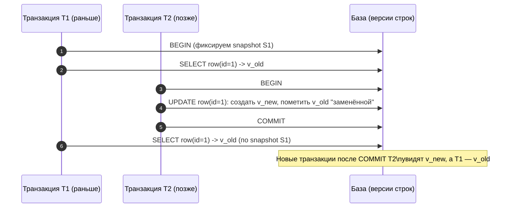
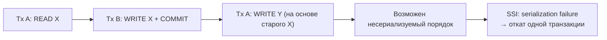
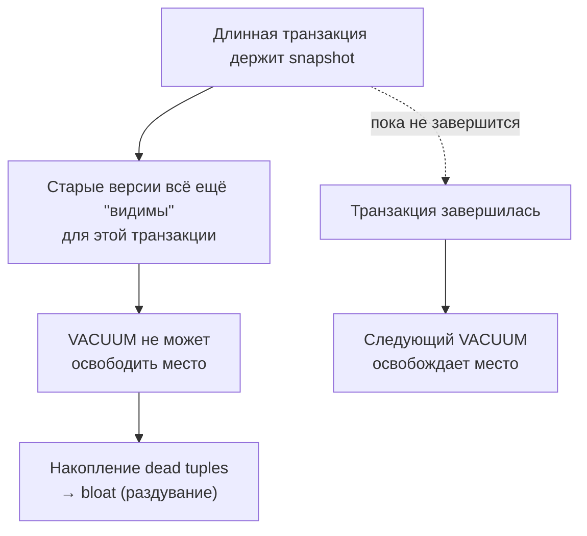

[← Назад к индексу части 4](index.md)

## 19. MVCC

**Зачем этот блок.** В разделах 17–18 мы разобрали уровни изоляции и блокировки. Блокировки позволяют «запереть» строку, но тогда читатели и писатели ждут друг друга — параллелизма мало. **MVCC** — другой способ обеспечить изоляцию: хранить **несколько версий** одной строки и показывать каждой транзакции «свою» версию по снимку. Тогда читатели не блокируют писателей и наоборот — параллелизма больше. В PostgreSQL уровни REPEATABLE READ и SERIALIZABLE реализованы с использованием MVCC (снимок + версии строк).

---

### 19.1. Идея многоверсионности

**Цель раздела.**  
Понять основную идею **MVCC**: хранить несколько версий одной строки, чтобы читатели не блокировали писателей и наоборот.

#### Термины

- **MVCC (Multiversion Concurrency Control)** — механизм параллелизма, при котором для одной логической строки может существовать **несколько версий** (например, старая и новая после UPDATE). Каждая транзакция видит только те версии, которые для неё «видимы» по правилам изоляции.
- **Snapshot (снимок)** — согласованное состояние данных на какой-то момент; транзакция при уровне REPEATABLE READ или SERIALIZABLE обычно видит снимок на момент своего начала.

#### Теория

- При UPDATE не обязательно сразу перезаписывать строку: можно оставить старую версию и добавить новую. Читатели, которые начали до коммита обновления, продолжают видеть старую версию; новые читатели (после коммита) видят новую.
- Чтение не устанавливает блокировок на строки (в классической реализации MVCC), поэтому запросы на выборку не блокируют обновления и наоборот — высокая параллельность.

#### Простыми словами

**Без MVCC (только блокировки):** чтобы прочитать строку, пришлось бы её «заблокировать на чтение». Тогда писатель не мог бы её обновить, пока читатель не закончит. Читатели и писатели бы постоянно ждали друг друга — мало параллелизма.

**С MVCC:** для одной логической строки в базе может храниться **несколько версий** (старая и новая после UPDATE). Каждая транзакция при чтении видит **ту версию**, которая для неё «видима» по правилам (например, по снимку на начало транзакции). Читатель смотрит на старую версию, писатель пишет новую — они не блокируют друг друга. Поэтому читатели не мешают писателям и наоборот — параллелизма больше.

**Аналогия:** вместо одной «доски» с одним текстом есть несколько «снимков» доски в разные моменты. Кто начал раньше — видит старый снимок; кто начал позже — видит новый. Никто никого не блокирует.

#### Как запомнить

MVCC = «несколько версий одной строки»; каждый видит свою версию по снимку — читатели и писатели не блокируют друг друга.

#### Картинка в голове

- Транзакция 1 в 10:00:00 прочитала строку (увидела версию «на 10:00:00»).
- Транзакция 2 в 10:00:01 обновила эту строку и закоммитила — в базе теперь две версии: старая (которую видела транзакция 1) и новая.
- Транзакция 1 в 10:00:02 снова читает эту строку — по-прежнему видит **старую** версию (снимок на 10:00:00). Транзакция 3, начавшаяся в 10:00:02, видит **новую** версию. Один и тот же «объект» в базе представлен разными версиями для разных транзакций.



#### Проверь себя (19.1)

Чем MVCC отличается от «просто блокировок»? Почему при MVCC читатели и писатели мешают друг другу меньше?  
<details><summary>Ответ</summary> При **только блокировках** читатель должен «заблокировать» строку на чтение — тогда писатель не может её изменить до конца чтения; писатель блокирует на запись — читатель ждёт. При **MVCC** для одной строки хранится **несколько версий** (старая и новая после UPDATE). Читатель видит **ту версию**, которая ему подходит по снимку (например, старую); писатель пишет **новую** версию. Они не блокируют друг друга — читатель смотрит на старую копию, писатель создаёт новую. Поэтому параллелизма больше.</details>

#### Запомните

- MVCC = несколько версий строки; видимость версии зависит от транзакции и момента снимка.
- Читатели и писатели мешают друг другу меньше, чем при только блокировках.

---

### 19.2. Версионирование строк: xmin, xmax

**Цель раздела.**  
Узнать, как в **PostgreSQL** в заголовке строки хранятся идентификаторы транзакций для определения видимости версии.

#### Термины

- **xmin** — идентификатор транзакции, которая **вставила** эту версию строки. Строка видна транзакции T, если xmin закоммичен до снимка T и не «в прошлом» по отношению к T.
- **xmax** — идентификатор транзакции, которая **удалила** или **обновила** эту версию (оставила её «мёртвой»). Если xmax не установлен или не видим для T, версия для T считается «живой».

Правила видимости сложнее (учитываются статусы транзакций, снимки и т.д.), но идея такая: по xmin/xmax и снимку транзакции СУБД решает, видеть ли эту версию строки.

#### Простыми словами

В **PostgreSQL** у каждой версии строки в заголовке хранятся два номера транзакций: **xmin** (кто «создал» эту версию — вставил строку или записал эту версию при UPDATE) и **xmax** (кто «удалил» эту версию — удалил строку или обновил её, оставив эту версию «мёртвой»). По правилам видимости СУБД решает: для данной транзакции эта версия «живая» (её видим) или «мёртвая» (не видим). Так одна логическая строка может быть представлена несколькими версиями в хранилище; каждая транзакция видит только подходящие по xmin/xmax версии. Детали правил видимости (когда xmin «видим», когда xmax «видим») описываются в документации PostgreSQL; для понимания MVCC достаточно идеи: «версия привязана к транзакциям создания и удаления, видимость определяется по снимку транзакции».

**Картинка в голове:** у каждой **версии строки** в PostgreSQL — как бы **две бирки**: «создал транзакция №X» (xmin) и «удалил/заменил транзакция №Y» (xmax; если ещё не удаляли — бирки нет). Когда наша транзакция читает данные, СУБД смотрит на **снимок** (какие транзакции на момент нашего BEGIN уже закоммичены и т.д.) и на эти бирки: «эта версия создана транзакцией, которую мы видим как завершённую до нашего снимка? удалена транзакцией, которую мы видим как завершённую?» — и решает: показывать эту версию или нет. Так одна строка в таблице может существовать в нескольких «экземплярах» (старая и новая версия после UPDATE); каждая транзакция видит только подходящий по xmin/xmax и снимку экземпляр.

#### Пример (концептуально)

После `INSERT` у строки заполнен xmin (id вставившей транзакции). После `UPDATE` у старой версии строки заполняется xmax (id обновившей транзакции), а новая версия получает свой xmin. Транзакция, начавшаяся до коммита UPDATE, по снимку не видит xmax закоммиченным и продолжает видеть старую версию.

```mermaid
flowchart TB
  subgraph "Одна логическая строка id=1"
    V1["Версия v1 (старая)\n xmin=10\n xmax=20"] -->|UPDATE| V2["Версия v2 (новая)\n xmin=20\n xmax=∅"]
  end

  S1["Транзакция A\nsnapshot до commit("xmax=20")"] -. видит .-> V1
  S2["Транзакция B\nsnapshot после commit("20")"] -. видит .-> V2

  Note1["Идея: xmin/xmax + snapshot\n→ правило видимости версии"] --- V1
```

#### Проверь себя (19.2)

Зачем в PostgreSQL в каждой версии строки хранятся поля **xmin** и **xmax**? Одна фраза.  
<details><summary>Ответ</summary> **xmin** и **xmax** нужны, чтобы **определить видимость** этой версии строки для данной транзакции: xmin — кто создал версию (вставил или записал при UPDATE), xmax — кто «удалил» её (DELETE или UPDATE). По снимку транзакции и статусам этих транзакций СУБД решает: эта версия для нас «живая» (видим) или «мёртвая» (не видим). Так реализуется MVCC без блокировок читателей.</details>

#### Запомните

- В PostgreSQL в заголовке строки есть xmin (кто вставил) и xmax (кто удалил/обновил).
- Видимость версии для транзакции определяется по снимку и статусам этих транзакций.

---

### 19.3. Snapshot isolation

**Цель раздела.**  
Понять **snapshot isolation**: транзакция работает с согласованным снимком данных на момент своего начала.

#### Термины

- **Snapshot isolation** — модель изоляции, при которой транзакция видит **согласованное состояние базы на момент начала** транзакции (или первого чтения). Изменения, закоммиченные после этого момента, для неё не видны.
- В PostgreSQL уровень **REPEATABLE READ** реализован через snapshot isolation: снимок берётся в начале транзакции.

#### Следствия

- Нет неповторяющегося чтения: повторное чтение той же строки даёт те же данные.
- В типичных сценариях нет и фантомов: набор строк по одному запросу не меняется, так как мы смотрим на снимок.
- При конфликте записи (две транзакции меняют одни и те же строки) одна из них может быть откатана (в зависимости от политики).

#### Простыми словами

**Snapshot isolation** — это когда транзакция «видит» базу **как на фотографии**, сделанной в момент её начала (BEGIN). Всё, что другие транзакции закоммитили **после** этого момента, для нашей транзакции **не существует**. Мы дважды читаем одну и ту же строку — видим одно и то же значение. Мы дважды выполняем один и тот же запрос — получаем один и тот же набор строк. Никаких «фантомов» и «неповторяющегося чтения» внутри одной транзакции, потому что мы смотрим на статичный снимок, а не на «текущее» состояние базы.

**В PostgreSQL** уровень REPEATABLE READ как раз реализован через snapshot isolation: в начале транзакции фиксируется снимок, и все последующие чтения в этой транзакции видят данные по этому снимку.

#### Пошагово: что видит транзакция при snapshot isolation

1. Транзакция A в 10:00:00 делает BEGIN — **снимок на 10:00:00** зафиксирован.
2. В 10:00:01 транзакция B обновляет строку id=1 и делает COMMIT — в базе уже новое значение.
3. Транзакция A в 10:00:02 читает строку id=1 — видит **старое** значение (по снимку 10:00:00), не новое от B.
4. Транзакция A в 10:00:03 снова читает id=1 — снова **то же** старое значение. Неповторяющегося чтения нет.
5. Транзакция A в 10:00:04 выполняет запрос по диапазону — видит только те строки, которые существовали на 10:00:00. Новые строки, вставленные B после 10:00:00, для A не видны — фантомов нет.

```mermaid
sequenceDiagram
  autonumber
  participant A as Транзакция A (snapshot 10:00:00)
  participant B as Транзакция B
  participant DB as База

  A->>DB: BEGIN (S=10:00:00)
  B->>DB: UPDATE id=1; COMMIT (10:00:01)
  A->>DB: SELECT id=1 -> старое значение (по S)
  A->>DB: SELECT range -> набор строк как в 10:00:00
  Note over A: Внутри A "фото" не меняется до COMMIT/ROLLBACK
```

**Картинка в голове:** в момент BEGIN транзакция «фотографирует» всю базу. Дальше все чтения в этой транзакции — как просмотр **этой фотографии**: что на ней есть, то и видно; что произошло в базе **после** съёмки (другие закоммитили изменения), на фотографии нет. Поэтому повторное чтение той же строки даёт то же значение (неповторяющегося чтения нет), и новые строки «не появляются» (фантомов нет). Фотография не меняется до конца транзакции.

#### Как запомнить

Snapshot isolation = «фотография базы на момент BEGIN»; всё чтение в транзакции — по этой фотографии.

#### Проверь себя (19.3)

При уровне REPEATABLE READ в PostgreSQL транзакция A в 10:00 сделала BEGIN, в 10:01 прочитала строку id=1 (значение 100). В 10:02 транзакция B обновила эту строку на 200 и закоммитила. В 10:03 транзакция A снова читает строку id=1. Что она увидит — 100 или 200? Почему?  
<details><summary>Ответ</summary> A увидит **100**. При REPEATABLE READ в PostgreSQL используется **snapshot isolation**: снимок берётся в начале транзакции (в 10:00). Все чтения в транзакции A видят данные **по этому снимку**. Изменение B (100 → 200) закоммитилось после начала A — для A оно «не существует». Поэтому повторное чтение даёт то же значение 100 (неповторяющееся чтение исключено).</details>

#### Запомните

- Snapshot isolation = транзакция видит снимок на момент начала.
- REPEATABLE READ в PostgreSQL = snapshot isolation; неповторяющееся и фантомное чтение в обычных запросах исключены.

---

### 19.4. SSI — Serializable Snapshot Isolation

**Цель раздела.**  
Понять, как в PostgreSQL уровень **SERIALIZABLE** реализован через **SSI**: сериализуемость без тяжёлых блокировок, но с возможным serialization failure.

#### Термины

- **SSI (Serializable Snapshot Isolation)** — механизм, который поверх snapshot isolation отслеживает **rw-конфликты** (read-write): если транзакция A прочитала данные, которые потом изменила транзакция B, и наоборот — возможен несериализуемый порядок. В таком случае одна из транзакций прерывается с ошибкой **serialization failure**.
- **Serialization failure** — ошибка при уровне SERIALIZABLE, когда СУБД обнаружила, что продолжение транзакции могло бы нарушить сериализуемость. Стандартная стратегия — откатить транзакцию и **повторить** её целиком.

#### Простыми словами

**SSI (Serializable Snapshot Isolation)** — это способ добиться **полной сериализуемости** (результат как при последовательном выполнении транзакций) **без** того, чтобы всё запирать тяжёлыми блокировками. Идея: каждая транзакция по-прежнему работает со снимком (snapshot isolation), но СУБД дополнительно отслеживает **rw-конфликты** (read-write): «транзакция A прочитала строку X, транзакция B потом изменила строку X (и закоммитилась)». Если при этом B «зависит» от чего-то, что прочитала A, может возникнуть несериализуемый порядок. В таком случае одна из транзакций **прерывается** с ошибкой **serialization failure** — как будто СУБД говорит: «если я позволю тебе продолжить, результат перестанет быть эквивалентен никакому последовательному выполнению». Откатанную транзакцию приложение должно **повторить целиком** (retry). Обычно делают ограниченное число попыток (например, 3) с небольшой паузой между ними.

**rw-конфликт (упрощённо):** A прочитала данные, B их изменила и закоммитила. Если A теперь попытается что-то записать, опираясь на прочитанное, порядок «сначала B, потом A» может дать другой результат — конфликт. SSI такие ситуации обнаруживает и прерывает одну из транзакций.



**Картинка в голове:** при SERIALIZABLE каждая транзакция по-прежнему видит свой снимок (как при REPEATABLE READ). Но СУБД «следит за перекрёстными» действиями: A прочитала, B потом изменила и закоммитила. Если A теперь напишет что-то на основе старого чтения — результат может не соответствовать ни одному «последовательному» порядку выполнения. Тогда СУБД **останавливает** одну из транзакций (serialization failure) — как светофор: «стоп, твой ход приведёт к противоречию». Откатанную транзакцию приложение повторяет — при повторной попытке снимок уже новый и конфликт часто исчезает.

#### Пример: когда возможен serialization failure

Транзакция A: прочитала «сумму заказов пользователя 1» = 1000. Транзакция B: добавила заказ пользователю 1 на 500 и закоммитилась. Транзакция A: хочет записать «итого 1000» куда-то (или принять решение на основе 1000). Если A закоммитится, мы получим результат, основанный на «старых» 1000, хотя уже есть новый заказ — несериализуемый порядок. SSI обнаруживает такой rw-конфликт и прерывает A (serialization failure). A при повторной попытке прочитает уже 1500 и примет решение на актуальных данных.

#### Проверь себя (19.4)

При уровне изоляции SERIALIZABLE в PostgreSQL транзакция получила ошибку **serialization failure**. Что должно сделать приложение? Одна фраза.  
<details><summary>Ответ</summary> Приложение должно **откатить транзакцию** (ROLLBACK) и **повторить её целиком** (retry) — с самого начала: снова BEGIN, те же запросы. Обычно делают ограниченное число попыток (например, 3) с небольшой паузой между ними. Serialization failure означает, что СУБД обнаружила возможный несериализуемый порядок и откатила транзакцию; повтор с новым снимком часто проходит успешно.</details>

#### Как запомнить

SERIALIZABLE в PostgreSQL = SSI: снимок + отслеживание rw-конфликтов; при конфликте — serialization failure, повтор транзакции.

#### Запомните

- В PostgreSQL SERIALIZABLE реализован через SSI: обнаружение rw-конфликтов и откат одной из транзакций (serialization failure).
- Приложение должно обрабатывать serialization failure и повторять транзакцию.

---

### 19.5. Мёртвые строки и VACUUM

**Цель раздела.**  
Понять, что такое **мёртвые (dead) строки** и зачем нужен **VACUUM**.

#### Термины

- **Мёртвая строка (dead tuple)** — версия строки, которую **больше ни одна активная или будущая транзакция не должна видеть** (например, старая версия после UPDATE или строка после DELETE). Она занимает место, но не участвует в видимости.
- **VACUUM** — процесс, который помечает место, занятое мёртвыми строками, как пригодное для повторного использования (в PostgreSQL — не обязательно возвращает место ОС без VACUUM FULL), обновляет статистику и карты видимости.
- **Bloat (раздувание)** — когда в таблице или индексе накапливается много мёртвых версий и размер объекта растёт; VACUUM (и autovacuum) уменьшают bloat.

#### Простыми словами

**Мёртвая строка (dead tuple)** — это версия строки, которую **больше ни одна активная транзакция не должна видеть**. Например: мы сделали UPDATE — старая версия строки «умерла» (её заменила новая версия). Или мы сделали DELETE — сама строка «умерла». Эти версии ещё **лежат в таблице** и занимают место, но для всех активных транзакций они «невидимы» — по правилам видимости их никто не видит. Такие версии называются мёртвыми (dead). **VACUUM** — это процесс, который **помечает место**, занятое мёртвыми строками, как пригодное для повторного использования (в PostgreSQL обычный VACUUM не обязательно возвращает место операционной системе — это делает VACUUM FULL). VACUUM также обновляет статистику и карты видимости, нужные для планировщика и index-only scan.

**Почему длинные транзакции мешают:** пока есть **хотя бы одна** транзакция, которая **началась до** того, как мы обновили/удалили строку, она по своему снимку **может видеть** старую версию. Значит, эту версию **нельзя** считать мёртвой — VACUUM не может её трогать. Длинная транзакция «держит» снимок на момент своего начала — все старые версии, созданные до этого момента и удалённые/обновлённые позже, для неё ещё «живые». Поэтому VACUUM не может освободить место под ними — они накапливаются, таблица и индексы **раздуваются (bloat)**.

**Картинка в голове:** после UPDATE или DELETE в таблице остаётся **старая версия** строки — она уже никому не нужна (никто по правилам видимости её не видит), но место она **занимает**. Это «мусор» (мёртвые строки). **VACUUM** — это «уборка»: помечает место под мусором как свободное для повторного использования. Но если в доме (базе) ещё живёт человек (длинная транзакция), который «помнит», что в углу лежала старая вещь (по снимку на момент своего начала), уборщик (VACUUM) **не может** выбросить эту вещь — она для него ещё «живая». Только когда этот человек ушёл (транзакция завершилась), уборщик может освободить место. Чем дольше человек сидит (длинная транзакция), тем больше мусора накапливается — **bloat**.



#### Пошагово: почему длинная транзакция = bloat

1. В 10:00:00 транзакция A делает BEGIN — снимок на 10:00:00.
2. В 10:00:01 транзакция B обновляет миллион строк и делает COMMIT — в таблице миллион старых версий (мёртвых для всех, кто начал после 10:00:01).
3. Транзакция A **ещё не закончилась** — она по снимку 10:00:00 **может видеть** эти старые версии (они были «живые» на 10:00:00). Поэтому СУБД не может считать их мёртвыми.
4. VACUUM запускается — не может удалить эти миллион версий, потому что транзакция A их «держит». Таблица раздута (bloat).
5. Транзакция A наконец делает COMMIT в 12:00:00 — только теперь эти версии становятся «мёртвыми для всех». Следующий VACUUM сможет освободить место.

**Вывод:** чем дольше живёт транзакция, тем больше старых версий она «держит» и тем сильнее bloat.

#### Проверь себя (19.5)

Почему VACUUM не может удалить мёртвые строки, пока живёт длинная транзакция? Ответ одной фразой, со словом «снимок».  
<details><summary>Ответ</summary> Длинная транзакция **держит снимок** на момент своего начала. Все старые версии строк, которые по этому снимку ещё «живые» (видны этой транзакции), **не считаются мёртвыми** — VACUUM не может их удалить, пока эта транзакция не завершится. После COMMIT/ROLLBACK снимок освобождается — эти версии становятся мёртвыми — VACUUM сможет освободить место.</details>

#### Как запомнить

Мёртвые строки = версии, которые никто не видит; VACUUM их убирает. Длинная транзакция = «держит» старые версии по снимку → VACUUM не может их убрать → bloat.

#### Запомните

- Мёртвые строки — версии, которые больше никто не видит; они удаляются VACUUM.
- Длинные транзакции удерживают старые версии и увеличивают bloat.

---

### 19.6. Transaction ID wraparound

**Цель раздела.**  
Понять риск **исчерпания номера транзакции** (transaction ID wraparound) и зачем нужен **freeze** и своевременный VACUUM.

#### Термины

- **Transaction ID** — уникальный номер транзакции; в PostgreSQL он ограничен разрядностью (32 бита). После переполнения счётчика старые номера снова используются (wraparound).
- **Freeze** — помечение старых версий строк как «замороженных»: они считаются видимыми всем транзакциям независимо от номера, что позволяет безопасно переиспользовать номера транзакций.
- **Autovacuum** в PostgreSQL выполняет в том числе freeze; при угрозе wraparound он усиливает работу. Если база долго не вакуумится и есть очень длинные транзакции, возможна ситуация, когда СУБД переходит в режим принудительного завершения транзакций для защиты от потери данных.

#### Простыми словами

В PostgreSQL каждая транзакция получает **уникальный номер (transaction ID)**. Номер хранится в ограниченном объёме (32 бита) — значит, количество возможных номеров **конечно**. Рано или поздно счётчик «обернётся» (wraparound): старые номера начнут использоваться снова. Чтобы при этом не перепутать «очень старую» транзакцию с «новой», старые версии строк должны быть **заморожены (freeze)**: они считаются видимыми **всем** транзакциям независимо от номера, так что по ним уже не нужно смотреть на transaction ID. **Autovacuum** в PostgreSQL выполняет **freeze** старых версий; при приближении к wraparound он усиливает работу. Если база очень долго не вакуумится (или есть очень длинные транзакции, мешающие VACUUM), счётчик может «подойти к краю» — тогда СУБД переходит в режим принудительного завершения транзакций, чтобы освободить место для freeze и не потерять данные. На практике при нормальной работе autovacuum и коротких транзакциях wraparound не случается.

**Картинка в голове:** номера транзакций — как **одометр** (счётчик километров) в машине: цифр конечное число, рано или поздно он «обернётся» (999999 → 000000). Чтобы после оборота не перепутать «очень старую» версию строки с «новой» (у обеих может оказаться похожий номер), старые версии **замораживают (freeze)**: по ним уже не смотрят на номер — они считаются «всегда видимыми». Тогда счётчик номеров можно безопасно обнулять и использовать снова. **Autovacuum** делает freeze; если база долго не вакуумится или длинные транзакции мешают — счётчик может «подойти к краю», и СУБД начнёт принудительно завершать транзакции. В нормальной работе этого не бывает.

```mermaid
flowchart LR
  XID["Transaction ID (32-bit)"] --> Near["Подходим к лимиту"]
  Near --> Freeze["FREEZE старых версий\n("видимы всем")"]
  Freeze --> Safe["Можно безопасно\n#quot;обернуть#quot; счётчик"]
  Near -->|нет VACUUM / есть длинные tx| Risk["Риск wraparound"]
  Risk --> Protect["PostgreSQL защищается:\nусиленный autovacuum,\nвплоть до stop-the-world"]
```

**Что будет, если не делать VACUUM и freeze (или мешать им длинными транзакциями):** счётчик номеров транзакций **конечен**. Если старые версии строк не замораживать (freeze), при «обороте» счётчика СУБД не сможет отличить очень старую транзакцию от новой — возможна **потеря данных** или некорректная видимость. Поэтому при приближении к wraparound PostgreSQL **принудительно** завершает транзакции и усиливает работу autovacuum. На практике при **нормальной** работе (autovacuum включён, транзакции короткие) wraparound не случается. **Риск растёт**, если: отключить autovacuum, держать очень длинные транзакции или перегружать базу так, что VACUUM не успевает. **Правило:** не отключай autovacuum; держи транзакции короткими; следи за длинными транзакциями в мониторинге.

#### Как запомнить

Transaction ID конечен → при «обороте» счётчика старые версии должны быть заморожены (freeze). Autovacuum делает freeze; длинные транзакции и отложенный VACUUM увеличивают риск.

#### Проверь себя (19.6)

Что такое **freeze** (заморозка) старых версий строк одной фразой? Зачем он нужен при transaction ID wraparound?  
<details><summary>Ответ</summary> **Freeze** — помечение старых версий строк как «замороженных»: они считаются видимыми **всем** транзакциям независимо от номера (transaction ID). **Зачем при wraparound:** номера транзакций конечны; когда счётчик «оборачивается», старые номера используются снова. Чтобы не перепутать «очень старую» транзакцию с «новой», старые версии должны быть заморожены — по ним уже не смотрят на номер транзакции. Autovacuum в PostgreSQL выполняет freeze.</details>

#### Запомните

- Номера транзакций конечны; при wraparound старые версии должны быть «заморожены» (freeze).
- Autovacuum делает freeze; длинные транзакции и отложенный VACUUM увеличивают риск wraparound.

---

**Краткое повторение раздела 19 (если бежишь по тексту):**  
MVCC = несколько версий строки; читатели не блокируют писателей; видимость по снимку. В PostgreSQL xmin/xmax в заголовке строки — кто создал/удалил версию. Snapshot isolation = транзакция видит снимок на момент BEGIN; REPEATABLE READ в PostgreSQL = snapshot. SERIALIZABLE в PostgreSQL = SSI; при rw-конфликте — serialization failure, повтор транзакции. Мёртвые строки убирает VACUUM; длинные транзакции «держат» старые версии → bloat. Transaction ID wraparound — номера конечны; freeze старых версий; autovacuum делает freeze.

---

---

<!-- prev-next-nav -->
*[← 18. Блокировки](03_18_blokirovki.md) | [→ 20. Двухфазный коммит и длинные транзакции](05_20_dvuhfaznyj_kommit_i_dlinnye_tranzaktsii.md)*
