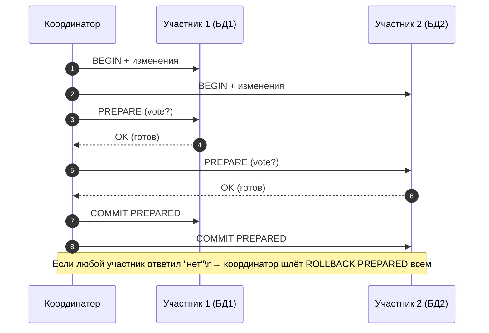
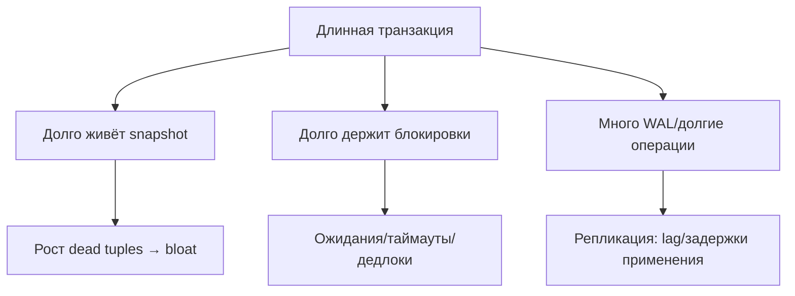
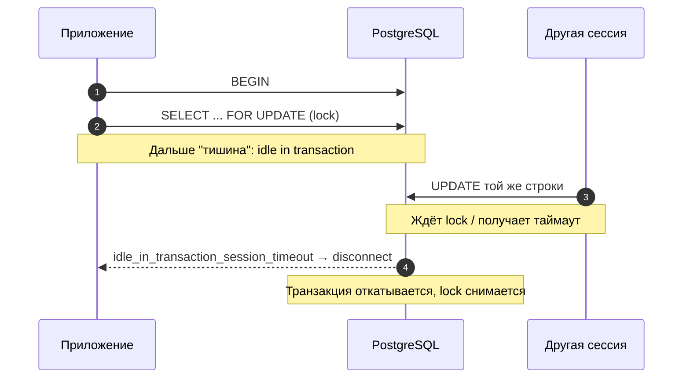

[← Назад к индексу части 4](index.md)

## 20. Двухфазный коммит и длинные транзакции

**Зачем этот блок.** В разделах 16–19 мы разобрали транзакции, изоляцию, блокировки и MVCC в рамках **одной** базы. Здесь — два следующих шага: (1) как «закоммитить атомарно» в **нескольких** местах (две базы, база + очередь) — **двухфазный коммит (2PC)** и стандарт **XA**; (2) почему **длинные транзакции** вредны — они «держат» снимок и старые версии строк (раздел 19), из-за чего растёт bloat, отстаёт репликация, другие сессии дольше ждут блокировок. Плюс **idle in transaction** — открытая транзакция без активности и как с ней бороться (таймаут, короткие транзакции).

---

### 20.1. Двухфазный коммит (2PC)

**Цель раздела.**  
Понять идею **двухфазного коммита** для распределённых транзакций: сначала все участники «подготавливаются», затем координатор решает — все коммитить или все откатывать.

#### Термины

- **Двухфазный коммит (2PC, Two-Phase Commit)** — протокол, при котором участники транзакции сначала голосуют «готов ли я закоммитить» (фаза подготовки), а затем по решению координатора все делают COMMIT или все делают ROLLBACK.
- **PREPARE TRANSACTION** (PostgreSQL) — перевести текущую транзакцию в состояние «подготовлена»; после этого сессия может отключиться, а транзакция остаётся в БД до COMMIT PREPARED или ROLLBACK PREPARED.
- **COMMIT PREPARED** / **ROLLBACK PREPARED** — завершить ранее подготовленную транзакцию по её идентификатору.

#### Синтаксис (PostgreSQL)

```sql
BEGIN;
-- изменения
PREPARE TRANSACTION 'tx_123';
-- сессия может закрыться
-- другая сессия или координатор:
COMMIT PREPARED 'tx_123';
-- или ROLLBACK PREPARED 'tx_123';
```

Используется при распределённых транзакциях, когда несколько баз или ресурсов должны закоммитить атомарно. Координатор (приложение или промежуточный слой) запрашивает подготовку у всех участников, затем при успехе всех — COMMIT PREPARED, иначе — ROLLBACK PREPARED.

#### Пошагово: как работает 2PC с двумя базами

1. **Координатор** открывает транзакции в обеих базах (или в базе и в очереди).
2. Выполняются изменения в каждой (INSERT/UPDATE в базе 1, запись в базе 2).
3. **Фаза подготовки:** координатор отправляет каждой базе «подготовься» (в PostgreSQL — PREPARE TRANSACTION 'id'). Каждая база сохраняет изменения в «подготовленном» состоянии: закоммитить их ещё нельзя откатить без команды координатора.
4. Если **все** ответили «готов» — координатор отправляет **COMMIT PREPARED** каждой. Тогда изменения в обеих базах фиксируются. Если **хотя бы один** не готов или ошибка — координатор отправляет **ROLLBACK PREPARED** всем — все откатывают подготовленную транзакцию.
5. **Итог:** либо закоммитилось везде, либо откатилось везде. Нет ситуации «в одной базе закоммитилось, в другой — нет».



**Картинка в голове:** два банка должны перевести деньги «одновременно»: списание с одного счёта и зачисление на другой. Координатор спрашивает оба банка: «Вы готовы закоммитить?» (PREPARE). Только когда **оба** ответили «готовы», координатор говорит: «Всем коммитить» (COMMIT PREPARED). Если хотя бы один сказал «не готов» или упал — координатор говорит: «Всем откатить» (ROLLBACK PREPARED). Так не получится «в одном банке списали, в другом не зачислили» — либо оба закоммитили, либо оба откатили. 2PC = «сначала все голосуют „готовы“, потом все вместе коммитят или откатывают».

#### Простыми словами

**Двухфазный коммит (2PC)** — способ «закоммитить атомарно» в **нескольких** местах (две базы, база + очередь сообщений и т.д.). Идея: сначала **все** участники говорят «я готов закоммитить» (фаза подготовки — PREPARE). Только когда **все** сказали «готов», координатор даёт команду «всем коммитить» (COMMIT PREPARED). Если хотя бы один не готов — всем откат (ROLLBACK PREPARED). Так мы не получаем ситуацию «в одной базе закоммитилось, в другой — нет». В PostgreSQL одна из сторон — PREPARE TRANSACTION (подготовить текущую транзакцию и «отвязать» её от сессии), потом из другой сессии или с другой машины — COMMIT PREPARED или ROLLBACK PREPARED по идентификатору.

#### Как запомнить

2PC = «сначала все готовы (PREPARE), потом все коммитят (COMMIT PREPARED) или все откатывают (ROLLBACK PREPARED)».

#### Проверь себя (20.1)

Что такое двухфазный коммит (2PC) одной фразой? Зачем он нужен?  
<details><summary>Ответ</summary> **2PC** — способ «закоммитить атомарно» в **нескольких** ресурсах (две базы, база + очередь): сначала **все** участники говорят «готов закоммитить» (PREPARE), затем координатор даёт команду «всем коммитить» (COMMIT PREPARED) или «всем откатить» (ROLLBACK PREPARED). **Зачем:** чтобы не получилось «в одной базе закоммитилось, в другой — нет» — либо все закоммитили, либо все откатили.</details>

#### Запомните

- 2PC: фаза подготовки (PREPARE) у всех участников, затем общий COMMIT или ROLLBACK.
- В PostgreSQL: PREPARE TRANSACTION, затем COMMIT PREPARED / ROLLBACK PREPARED.

---

### 20.2. XA транзакции

**Цель раздела.**  
Представить стандарт **XA** для распределённых транзакций с внешним координатором.

#### Термины

- **XA** — стандарт (X/Open) для распределённых транзакций. Есть **координатор (transaction manager)** и **ресурс-менеджеры** (например, СУБД). Координатор вызывает у каждого ресурса: begin, prepare, commit/rollback.
- Ресурс-менеджер (СУБД) поддерживает XA-интерфейс; драйвер приложения или промежуточное ПО выступает координатором.

Использование XA сложнее и дороже (блокировки на время двух фаз, отказы при сбое координатора). Часто вместо глобальных распределённых транзакций используют паттерны без 2PC (saga, outbox, идемпотентность).

**Картинка в голове:** **координатор** — как **дирижёр**, **ресурсы** (базы, очереди) — как **музыканты**. Дирижёр даёт команды всем: «начали» (begin), «подготовились» (prepare), «все вместе — коммит» (commit) или «все вместе — откат» (rollback). Никто не коммитит сам по себе — только по команде дирижера. Так «все закоммитили или все откатили» между разными системами. Минус: пока идёт подготовка и решение, музыканты (ресурсы) «держат» блокировки; если дирижёр (координатор) упал, могут остаться «зависшие» подготовленные транзакции. Поэтому часто вместо XA используют другие схемы (saga, outbox, идемпотентность).

```mermaid
flowchart TB
  TM[Transaction Manager<br/>(координатор)] --> RM1[Resource Manager 1<br/>(СУБД/очередь)]
  TM --> RM2[Resource Manager 2<br/>(СУБД/очередь)]
  TM --> RM3[Resource Manager 3<br/>(...)]

  TM -. begin .-> RM1
  TM -. prepare .-> RM2
  TM -. commit / rollback .-> RM3
```

#### Простыми словами

**XA** — это **стандарт** (X/Open) для распределённых транзакций, когда участвуют **несколько ресурсов** (например, две разные базы данных или база + очередь сообщений). Есть **внешний координатор (transaction manager)** — отдельный компонент (часто часть приложения или промежуточного ПО), который **управляет** транзакцией: у каждого ресурса вызывает «начать», «подготовиться (prepare)», «закоммитить» или «откатить». Каждый ресурс (СУБД, очередь и т.д.) выступает **ресурс-менеджером**: поддерживает интерфейс XA (begin, prepare, commit/rollback). Координатор сначала запрашивает prepare у всех; если все ответили «готов» — даёт команду commit всем; иначе — rollback всем. Так достигается атомарность «все закоммитили или все откатили» между разными системами. **Минусы:** сложнее в настройке и отладке; блокировки держатся на время двух фаз; при сбое координатора возможны «зависшие» подготовленные транзакции. Поэтому часто вместо XA используют паттерны без глобального 2PC: saga (компенсирующие транзакции), outbox (гарантия доставки сообщений через таблицу outbox), идемпотентность (повторная обработка безопасна).

#### Как запомнить

XA = стандарт распределённых транзакций с **внешним координатором**; координатор вызывает prepare/commit у каждого ресурса. Сложнее и дороже; часто заменяют saga, outbox, идемпотентностью.

#### Проверь себя (20.2)

Чем **XA** отличается от «просто» двухфазного коммита (2PC) в одной базе PostgreSQL? Одна-две фразы.  
<details><summary>Ответ</summary> **2PC в одной базе** (PREPARE TRANSACTION, COMMIT PREPARED) — это механизм **внутри одной СУБД**: одна транзакция переводится в состояние «подготовлена» и может быть завершена из другой сессии. **XA** — это **стандарт для распределённых** транзакций: участвуют **несколько ресурсов** (разные базы, база + очередь), а **внешний координатор** (transaction manager) управляет всеми участниками: вызывает у каждого begin, prepare, commit/rollback. XA = 2PC между **разными** системами под управлением координатора.</details>

#### Запомните

- XA — стандарт распределённых транзакций с внешним координатором и prepare/commit на каждой СУБД.
- Поддержка есть в многих СУБД и драйверах; применение оправдано только когда действительно нужна атомарность между разными ресурсами.

---

### 20.3. Длинные транзакции: влияние на bloat и репликацию

**Цель раздела.**  
Понять, чем плохи **длинные транзакции** для bloat и репликации.

#### Теория

- **Bloat**: пока транзакция не завершилась, все версии строк, которые она могла бы видеть по своему снимку, не могут быть удалены VACUUM. Длинная транзакция «замораживает» много старых версий → рост размера таблиц и индексов.
- **Репликация**: на реплике применяется WAL. Длинная транзакция на primary откладывает появление «окончательного» состояния; кроме того, длинные запросы в одной транзакции могут держать блокировки и замедлять репликацию или создавать задержки.
- **Блокировки**: длинная транзакция дольше держит блокировки → другие сессии дольше ждут → возможны таймауты и deadlock.

#### Простыми словами

**Длинная транзакция** — это транзакция, которая живёт **много времени** (секунды, минуты, часы) от BEGIN до COMMIT/ROLLBACK. Чем дольше она живёт, тем хуже:

**Картинка в голове:** транзакция — это **открытый пакет** с изменениями. Пока пакет открыт, СУБД не может **вынести мусор** (удалить старые версии строк), потому что по «правилам видимости» этот «мусор» ещё может понадобиться этой транзакции (она «видит» его по своему снимку). Чем дольше пакет открыт, тем больше мусора накапливается — **раздувание (bloat)**. Плюс если ты держишь **замок** (FOR UPDATE), другие стоят в очереди у замка. **Короткая транзакция** = открыл пакет → положил изменения → сразу закрыл (COMMIT/ROLLBACK) → мусор можно вынести, замок снят.



1. **Bloat:** она «держит» снимок на момент своего начала. Все старые версии строк, которые по этому снимку ещё «живые», не могут быть удалены VACUUM. Они накапливаются → таблицы и индексы раздуваются (bloat) → больше места на диске, медленнее запросы.
2. **Репликация:** на реплике применяется WAL. Длинная транзакция на primary откладывает «окончательное» состояние; кроме того, длинные запросы внутри транзакции могут держать блокировки и замедлять применение WAL на реплике или увеличивать lag.
3. **Блокировки:** если транзакция держит блокировки (например, FOR UPDATE), другие сессии **ждут** до COMMIT/ROLLBACK. Долгое ожидание → таймауты в приложении, риск deadlock, недовольные пользователи.

**Что делать:** держи транзакции **короткими**: открыл (BEGIN) → сделал работу → сразу COMMIT или ROLLBACK. Не держи транзакцию открытой «на всякий случай» (например, пока пользователь заполняет форму в браузере).

#### Другими словами

Длинная транзакция = «пакет изменений» открыт долго. Пока он открыт, СУБД не может выбросить старые версии строк (они ещё «видны» по снимку этой транзакции) → таблицы раздуваются. Реплика отстаёт. Блокировки держатся → другие ждут. Короткая транзакция = открыл пакет → положил изменения → сразу закрыл (COMMIT/ROLLBACK). Тогда старые версии быстрее становятся «мёртвыми», VACUUM их убирает, bloat меньше, реплика и другие сессии не страдают.

#### Проверь себя (20.3)

Почему длинная транзакция увеличивает bloat (раздувание таблиц)? Свяжи ответ с понятием «снимок» и «мёртвые строки».  
<details><summary>Ответ</summary> Длинная транзакция **держит снимок** на момент своего начала (при REPEATABLE READ / SERIALIZABLE). Все версии строк, которые по этому снимку ещё «живые» (видны транзакции), **не могут быть удалены** VACUUM — они не считаются «мёртвыми», пока эта транзакция не завершится. Чем дольше транзакция живёт, тем больше таких версий накапливается → таблица и индексы **раздуваются** (bloat). После COMMIT/ROLLBACK снимок освобождается — эти версии становятся мёртвыми — следующий VACUUM сможет освободить место.</details>

#### Что будет, если не сокращать транзакции

Таблицы и индексы будут раздуваться (bloat) — место на диске закончится быстрее, запросы станут медленнее. Реплика может отставать (lag). Другие сессии будут дольше ждать блокировок — возможны таймауты и ошибки в приложении. В крайних случаях — риск transaction ID wraparound (PostgreSQL принудительно завершит транзакции).

#### Как запомнить

Длинная транзакция = bloat + lag репликации + долгие ожидания блокировок. Решение: короткие транзакции, не держать BEGIN без дела.

#### Запомните

- Длинные транзакции увеличивают bloat (VACUUM не может убрать старые версии), ухудшают репликацию и дольше держат блокировки.
- Рекомендация: короткие транзакции; не держать соединение с открытой транзакцией без активности.

---

### 20.4. Idle in transaction и рекомендации

**Цель раздела.**  
Понять проблему **idle in transaction** и меры против неё.

#### Термины

- **Idle in transaction** — транзакция открыта (`BEGIN` выполнен), но запросов давно не было. Соединение «висит» с открытой транзакцией: блокировки (если были) держатся, снимок (в REPEATABLE READ/SERIALIZABLE) не даёт VACUUM убирать старые версии.
- **idle_in_transaction_session_timeout** (PostgreSQL) — параметр: разорвать сессию, если она дольше заданного времени в состоянии «idle in transaction».

#### Рекомендации

- Делать транзакции короткими: открыли → сделали работу → COMMIT/ROLLBACK.
- Не держать транзакцию открытой «на всякий случай» (например, пока пользователь заполняет форму).
- Включить `idle_in_transaction_session_timeout` в production, чтобы «забытые» транзакции автоматически закрывались.

#### Типичная ошибка

**Открывать транзакцию в начале «редактирования» и держать её открытой, пока пользователь заполняет форму в браузере.** Приложение при нажатии «Редактировать» делает BEGIN и SELECT ... FOR UPDATE (чтобы заблокировать строку). Пользователь думает, заполняет поля, уходит на обед — транзакция висит часами. Блокировка держится — другие не могут изменить эту запись. Снимок живёт — VACUUM не может убрать старые версии → bloat. **Правило:** не привязывай длину жизни транзакции к действиям пользователя в UI. Открывай транзакцию **только в момент отправки формы**: получили данные с формы → BEGIN → проверили → UPDATE → COMMIT. Либо используй оптимистичную блокировку (version) без долгой блокировки.

#### Простыми словами

**Idle in transaction** — это когда транзакция **уже открыта** (выполнен BEGIN), но **запросов давно не было**. Соединение «висит»: пользователь ушёл на обед, приложение зависло, или в коде забыли вызвать COMMIT/ROLLBACK после операций. При этом: если транзакция держала блокировки (например, FOR UPDATE), они **продолжают держаться** — другие сессии ждут. Если уровень изоляции REPEATABLE READ или SERIALIZABLE, снимок транзакции **продолжает жить** — VACUUM не может удалить старые версии, которые эта транзакция «видит» по снимку → bloat растёт. **idle_in_transaction_session_timeout** (PostgreSQL) — параметр сервера: если сессия дольше заданного времени (например, 5 минут) находится в состоянии «idle in transaction», сервер **разрывает соединение**. Транзакция откатывается, блокировки снимаются, снимок освобождается — bloat перестаёт расти от этой сессии. В production этот таймаут обычно включают (например, 5–10 минут), чтобы «забытые» транзакции не висели часами.

#### Пример: что происходит при idle in transaction

1. Пользователь нажал «Редактировать заказ» — приложение сделало BEGIN и SELECT ... FOR UPDATE (заблокировало строку).
2. Пользователь отвлёкся на час — соединение открыто, транзакция не закрыта, блокировка держится.
3. Другие пользователи не могут изменить этот заказ (ждут блокировку). VACUUM не может удалить старые версии, которые «видит» эта транзакция по снимку — bloat растёт.
4. С включённым idle_in_transaction_session_timeout = 5 min через 5 минут сервер разорвёт соединение, транзакция откатится, блокировка снимется.



#### Что будет, если не включать idle_in_transaction_session_timeout

«Забытые» транзакции (пользователь закрыл вкладку, приложение упало, забыли COMMIT) будут **висеть часами**. Блокировки (если были FOR UPDATE) продолжают держаться — другие сессии ждут или получают таймауты. Снимок транзакции живёт — VACUUM не может удалить старые версии, которые эта транзакция «видит» → **bloat растёт**. При большом числе таких сессий таблицы и индексы раздуваются, место на диске и производительность страдают. **Рекомендация:** в production включить `idle_in_transaction_session_timeout` (например, 5–10 минут), чтобы такие сессии автоматически разрывались.

#### Проверь себя (20.4)

Что такое «idle in transaction» одной фразой? Чем это вредно и какой параметр PostgreSQL помогает?  
<details><summary>Ответ</summary> **Idle in transaction** — транзакция **открыта** (BEGIN выполнен), но **запросов давно не было** (соединение «висит» с открытой транзакцией). **Вред:** блокировки (если были) держатся — другие ждут; снимок транзакции живёт — VACUUM не может убрать старые версии → bloat растёт. **Параметр:** `idle_in_transaction_session_timeout` (PostgreSQL) — разорвать сессию, если она дольше заданного времени в состоянии «idle in transaction». Тогда транзакция откатится, блокировки снимаются, bloat перестаёт расти от этой сессии.</details>

#### Как запомнить

Idle in transaction = «транзакция открыта, но ничего не делаем» — вредно для bloat и блокировок. Решение: idle_in_transaction_session_timeout и короткие транзакции.

#### Запомните

- Idle in transaction — открытая транзакция без активности; вредна для bloat и блокировок.
- Использовать idle_in_transaction_session_timeout и проектировать короткие транзакции.

---

**Краткое повторение раздела 20 (если бежишь по тексту):**  
2PC — сначала все PREPARE, потом все COMMIT PREPARED или ROLLBACK PREPARED; в PostgreSQL: PREPARE TRANSACTION, COMMIT PREPARED / ROLLBACK PREPARED. XA — стандарт распределённых транзакций с внешним координатором. Длинные транзакции увеличивают bloat (VACUUM не может убрать старые версии), lag репликации, время ожидания блокировок — держи транзакции короткими. Idle in transaction — открытая транзакция без активности; вредна для bloat и блокировок; idle_in_transaction_session_timeout разрывает такие сессии.

---

---

<!-- prev-next-nav -->
*[← 19. MVCC](04_19_mvcc.md) | [→ 21. Оптимистичная и пессимистичная блокировка](06_21_optimistichnaya_i_pessimistichnaya_blokiro.md)*
