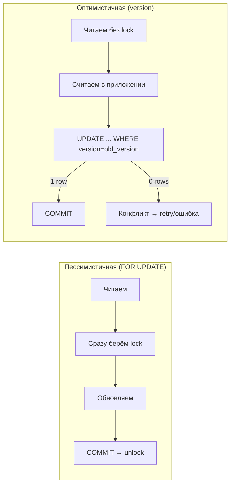
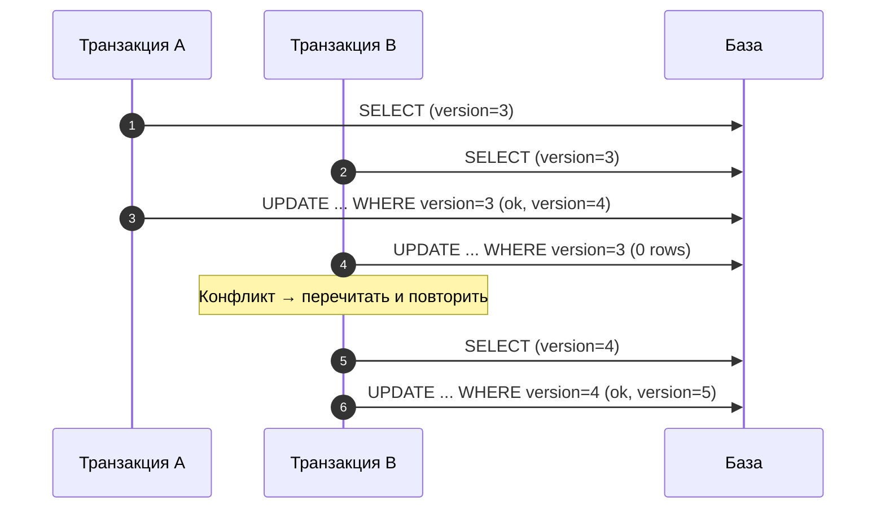
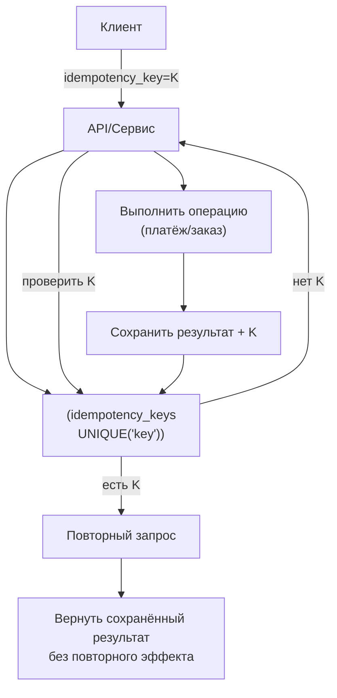

[← Назад к индексу части 4](index.md)

## 21. Оптимистичная и пессимистичная блокировка

**Зачем этот блок.** В разделе 18 мы разобрали **явные** блокировки (FOR UPDATE, FOR SHARE) — это **пессимистичная** стратегия: блокируем строку заранее. Но блокировки снижают параллелизм: другие ждут. **Оптимистичная** стратегия — не блокировать при чтении, а при записи проверять, что строка не изменилась (например, по полю version); при конфликте — повтор или сообщение пользователю. Здесь мы сравниваем обе стратегии, разбираем **lost update** (две транзакции перезаписывают друг друга) и способы защиты, а также **идемпотентность** — когда повторный вызов операции не дублирует эффект (важно для платежей, двойного клика, повторной отправки запроса).



---

### 21.1. Пессимистичная блокировка

**Цель раздела.**  
Закрепить понятие **пессимистичной блокировки**: мы заранее блокируем строку (например, `SELECT FOR UPDATE`), чтобы никто не мог её изменить до нашего COMMIT.

**Пессимистичная блокировка** — «сначала заблокируем, потом работаем». Гарантия: пока мы держим блокировку, другая транзакция не изменит строку. Минус: если мы долго обрабатываем после SELECT, другие ждут.

Пример уже приведён выше (перевод с проверкой баланса с `SELECT ... FOR UPDATE`).

#### Картинка в голове

Ты **первым** подходишь к строке и «вешаешь замок» (SELECT ... FOR UPDATE). Пока ты не сделал COMMIT или ROLLBACK, замок висит. Другой пользователь подходит к той же строке и тоже хочет её изменить — он **ждёт** у замка, пока ты не освободишь. Ты прочитал → проверил → обновил → COMMIT — замок снят. Теперь второй пользователь получает строку (уже с твоими изменениями), делает своё обновление и коммитит. Никто никого не перезаписал — порядок очевидный. **Минус:** пока ты держишь замок, все остальные ждут; если ты долго «думаешь» после SELECT FOR UPDATE, параллелизм падает.

#### Простыми словами

Мы **пессимистично** предполагаем, что кто-то ещё захочет изменить ту же строку. Поэтому **сразу** при чтении блокируем её (SELECT ... FOR UPDATE). Пока мы не сделаем COMMIT или ROLLBACK, никто не сможет её изменить — будет ждать. Так мы гарантированно избегаем lost update: между нашим чтением и обновлением никто не влезет. Минус: другие транзакции **ждут** нас; если наша транзакция длинная, параллелизм падает.

#### Как запомнить

Пессимистичная = «сначала замок (FOR UPDATE), потом работаем».

#### Проверь себя (21.1)

В каком случае разумнее использовать пессимистичную блокировку (SELECT FOR UPDATE), а не оптимистичную (поле version)? Одна фраза.  
<details><summary>Ответ</summary> Пессимистичная блокировка разумнее, когда **конфликты по одной и той же строке частые** — много транзакций одновременно пытаются изменить одни и те же строки. Тогда FOR UPDATE гарантирует порядок (второй ждёт первого), а при оптимистичной блокировке было бы много повторов (часто 0 rows updated). Оптимистичная разумнее, когда конфликты **редкие** — много чтений, мало одновременных обновлений одной строки; тогда нет лишних блокировок при чтении.</details>

#### Запомните

- Пессимистичная блокировка = явная блокировка до изменения (обычно SELECT FOR UPDATE).
- Надёжно, но блокировки держатся до конца транзакции; длинные транзакции плохи.
- Используй пессимистичную, когда конфликты по одной строке частые; оптимистичную — когда редкие.

---

### 21.2. Оптимистичная блокировка

**Цель раздела.**  
Понять **оптимистичную блокировку**: не блокируем заранее, но при обновлении проверяем, что строка не изменилась (например, по столбцу `version` или `updated_at`).

#### Термины

- **Оптимистичная блокировка** — мы читаем строку (без FOR UPDATE), делаем расчёты в приложении, затем обновляем с условием «версия не изменилась». Если между чтением и записью кто-то обновил строку, наш UPDATE не затронет ни одной строки (WHERE version = :old_version не сработает) — приложение обрабатывает конфликт (повтор или сообщение пользователю).
- **Версия** — обычно целое число или timestamp в таблице; при каждом UPDATE увеличивается/обновляется.

#### Пример

Таблица с версией:

```sql
CREATE TABLE product (
  id INT PRIMARY KEY,
  name TEXT,
  stock INT,
  version INT DEFAULT 0
);
```

Обновление с проверкой версии:

```sql
-- прочитали: id=1, stock=10, version=3
UPDATE product SET stock = stock - 1, version = version + 1
WHERE id = 1 AND version = 3;
-- если updated count = 0 — кто-то уже изменил, повторяем или сообщаем об ошибке
```

#### Пошагово: что происходит при оптимистичной блокировке

1. Транзакция A: `SELECT id, stock, version FROM product WHERE id = 1` → stock=10, **version=3**.
2. Транзакция B: тоже читает id=1 → stock=10, version=3. Никто никого не блокирует.
3. Транзакция A: `UPDATE product SET stock = 9, version = 4 WHERE id = 1 AND version = 3` → 1 row updated, COMMIT. В таблице теперь stock=9, version=4.
4. Транзакция B: `UPDATE product SET stock = 8, version = 4 WHERE id = 1 AND version = 3` → **0 rows updated** (в таблице уже version=4, условие version=3 не выполняется). Приложение видит «0 строк обновлено» — конфликт: кто-то уже изменил строку.
5. Приложение B: повторяет операцию — снова читает строку (теперь stock=9, version=4), пересчитывает (stock - 1 = 8), делает `UPDATE ... WHERE id = 1 AND version = 4` → 1 row updated, COMMIT. Итог: stock=8, version=5. Lost update нет.

**Вывод:** при оптимистичной блокировке мы не ждём при чтении; конфликт обнаруживается при записи (0 rows updated). Тогда повторяем: прочитать заново → пересчитать → снова UPDATE.



#### Типичная ошибка

**Не проверять, обновилась ли строка (updated count / row count).** При оптимистичной блокировке мы делаем UPDATE с условием `WHERE id = ? AND version = ?`. Если между нашим чтением и записью кто-то уже обновил строку, **version** в таблице уже другой — наш UPDATE **не затронет ни одной строки** (0 rows updated). Если приложение не проверяет это и считает, что «всё прошло», мы теряем обновление или сохраняем неверное состояние. **Правило:** после такого UPDATE всегда проверяй количество обновлённых строк. Если 0 — конфликт: повтори операцию (прочитать заново, пересчитать, снова UPDATE) или вернуть пользователю ошибку «данные изменились, обновите страницу».

#### Простыми словами

Мы **оптимистично** предполагаем, что никто не изменит строку между нашим чтением и записью. Поэтому **не блокируем** при чтении. При обновлении проверяем: «версия та же?» (WHERE id = ? AND version = ?). Если да — записываем и увеличиваем version. Если нет — наш UPDATE не затронет ни одной строки (кто-то уже изменил); приложение обрабатывает конфликт (повторяет операцию или сообщает пользователю). Плюс: нет блокировок при чтении, высокая параллельность. Минус: при частых конфликтах много повторов.

#### Как запомнить

Оптимистичная = «читаем без замка, при записи проверяем версию; при конфликте — повтор или ошибка».

#### Запомните

- Оптимистичная блокировка = без блокировки при чтении; при UPDATE проверяем версию (или timestamp); при конфликте обрабатываем в приложении.
- Подходит когда конфликты редки; при частых конфликтах пессимистичная может быть проще.

---

### 21.3. Lost update и защита

**Цель раздела.**  
Чётко понять **lost update** и два основных способа защиты.

#### Термины

- **Lost update (потерянное обновление)** — две транзакции прочитали одну и ту же строку, обе вычислили новое значение на основе прочитанного и записали. Вторая запись перезаписала первую; изменения первой транзакции «потерялись».

**Пример:** баланс 100. Транзакция A: прочитала 100, снимает 30 → пишет 70. Транзакция B: прочитала 100, снимает 20 → пишет 80. Итог: 80 (потеряно обновление A).

**Защита:**

1. **Пессимистичная:** `SELECT ... FOR UPDATE` перед изменением; вторая транзакция подождёт и прочитает уже обновлённые данные.
2. **Оптимистичная:** столбец `version`; при UPDATE проверяем `WHERE id = ... AND version = :read_version` и увеличиваем version; если строки не обновилось — конфликт, повтор или отказ.

#### Пошагово: как возникает lost update (без защиты)

Исходное состояние: строка id=1, balance=100.

| Момент | Транзакция A | Транзакция B | balance в БД (id=1) |
|--------|--------------|--------------|---------------------|
| T1 | SELECT balance FROM accounts WHERE id = 1; → 100 | — | 100 |
| T2 | — | SELECT balance FROM accounts WHERE id = 1; → 100 | 100 |
| T3 | UPDATE accounts SET balance = 100 - 30 WHERE id = 1; COMMIT; | — | **70** (A снял 30) |
| T4 | — | UPDATE accounts SET balance = 100 - 20 WHERE id = 1; COMMIT; | **80** (B записал «100 - 20») |

**Итог:** B считал от **старых** 100 и записал 80. Обновление A (70) **потерялось**. В итоге balance = 80, хотя должно было быть 50 (100 - 30 - 20). Это и есть lost update: две транзакции читают одно и то же значение, обе считают новое и пишут; вторая перезаписывает первую.

**Защита 1 — пессимистичная:** A и B делают `SELECT ... FOR UPDATE` перед изменением. Тогда B **ждёт**, пока A не сделает COMMIT; B прочитает уже 70 и сделает 70 - 20 = 50. Lost update не будет.

**Защита 2 — оптимистичная:** в таблице есть столбец `version`. При чтении читаем version; при UPDATE пишем `WHERE id = 1 AND version = 3` и увеличиваем version. Если между чтением и записью кто-то обновил строку, наш UPDATE не затронет ни одной строки (version уже не 3) — приложение обработает конфликт (повтор или сообщение пользователю).

#### Проверь себя (21.3)

Исходный баланс 100. Транзакция A прочитала 100, сняла 30, записала 70 и закоммитила. Транзакция B прочитала 100 (до коммита A), сняла 20 и записала 80 и закоммитила. Какой итоговый баланс? Правильный ли он? Как называется эта ситуация?  
<details><summary>Ответ</summary> Итоговый баланс **80** (последний записавший — B). Правильный был бы **50** (100 − 30 − 20). Ситуация называется **lost update** (потерянное обновление): обновление A (70) потерялось, потому что B перезаписала значение, считая от старых 100. Защита: FOR UPDATE при чтении (пессимистичная) или проверка version при UPDATE (оптимистичная).</details>

#### Простыми словами

Lost update — когда **два человека** прочитали одно и то же число, оба вычли своё и записали обратно. Второй записал «поверх» первого — изменение первого потерялось. Защита: либо «заблокировать строку» (FOR UPDATE), чтобы второй ждал первого, либо проверять «версию» при записи и при конфликте повторять или сообщать об ошибке.

#### Что будет, если не защищаться от lost update

При одновременном изменении одной и той же строки (например, баланс счёта, остаток товара) **итоговое значение будет неверным**: одна из транзакций перезапишет другую. Пример: баланс 100, два снятия по 30 и 20 — без защиты может получиться 80 вместо 50; один из снятий «потеряется». В кассе, складе, биллинге это приводит к потерям денег, неверным остаткам и жалобам. **Правило:** если читаешь строку, чтобы потом её обновить (по прочитанному значению), используй либо **FOR UPDATE** (пессимистично), либо **version** при UPDATE и проверку row count (оптимистично).

#### Запомните

- Lost update = две транзакции перезаписывают друг друга по одному и тому же значению.
- Защита: FOR UPDATE (пессимистично) или проверка версии при UPDATE (оптимистично).

---

### 21.4. Идемпотентность

**Цель раздела.**  
Понять **идемпотентность** операций и как её достигать в БД.

#### Термины

- **Идемпотентность (idempotency)** — повторный вызов операции даёт **тот же результат**, что и однократный. Для API и повторных запросов это важно: сеть может доставить запрос дважды; приложение не должно создать два заказа или два списания.
- **Идемпотентный ключ (idempotency key)** — уникальный ключ запроса (например, UUID), который клиент передаёт в заголовке. Сервер сохраняет его в таблице (UNIQUE) и при повторной передаче того же ключа не выполняет операцию заново, а возвращает сохранённый результат.

#### Примеры в SQL

- **Вставка «один раз»:** уникальный ключ по полю (например, email). При повторной вставке — конфликт; в PostgreSQL `INSERT ... ON CONFLICT (email) DO NOTHING` или `DO UPDATE` для upsert.
- **Идемпотентная таблица:** таблица `idempotency_keys (key UNIQUE, response_json, created_at)`. Перед выполнением операции проверяем ключ; если есть — возвращаем сохранённый ответ; если нет — выполняем, сохраняем ответ и ключ.

#### Простыми словами

**Идемпотентность** — когда ты **повторно** делаешь одну и ту же операцию (тот же запрос, тот же платёж, тот же «создать заказ»), результат **не меняется** и **не дублируется**. Один раз нажал «Оплатить» — заказ оплачен. Второй раз нажал «Оплатить» (из-за двойного клика или повторной отправки запроса) — заказ по-прежнему оплачен один раз, а не два. Это и есть идемпотентность.

**Картинка в голове:** один «билет» (идемпотентный ключ) = одна операция. Клиент при «Оплатить» получает билет с номером (UUID). Первый запрос с этим билетом — кассир выполняет оплату и кладёт билет в ящик «уже использованы». Второй запрос с тем же билетом — кассир смотрит в ящик: «такой билет уже был», не выполняет оплату снова, а возвращает тот же результат («уже оплачено»). Два запроса — одна оплата. Без билета кассир не знал бы, что это повтор, и списал бы дважды.



**Зачем:** сеть и браузеры могут отправить запрос дважды; пользователь может дважды нажать кнопку. Если операция не идемпотентна, повтор приведёт к дубликату (два списания, два заказа). Идемпотентность защищает от этого.

**Как достичь в БД:**

- **Уникальный ключ + ON CONFLICT:** при вставке используй уникальное поле (например, idempotency_key или email). При повторной вставке с тем же ключом — конфликт; в PostgreSQL `ON CONFLICT (key) DO NOTHING` или `DO UPDATE` не создаёт дубликат.
- **Идемпотентный ключ в API:** клиент отправляет уникальный ключ запроса (например, UUID). Сервер сохраняет его в таблице (UNIQUE). При повторной передаче того же ключа сервер не выполняет операцию заново, а возвращает сохранённый результат.

#### Пошагово: как идемпотентный ключ защищает от двойной оплаты

1. Пользователь нажал «Оплатить»; клиент сгенерировал ключ `idempotency_key = 'pay-abc-123'` и отправил запрос на сервер с этим ключом в заголовке.
2. Сервер **первый раз** видит ключ `pay-abc-123`. В таблице `idempotency_keys` такого ключа нет. Сервер выполняет оплату (списание, запись в историю), сохраняет результат и ключ `pay-abc-123` в таблицу (UNIQUE), возвращает клиенту «Оплата успешна».
3. Из-за двойного клика или повторной отправки **второй** запрос с тем же ключом `pay-abc-123` приходит на сервер.
4. Сервер видит ключ `pay-abc-123` — в таблице он **уже есть**. Сервер **не выполняет** оплату повторно, а возвращает сохранённый результат («Оплата успешна», тот же id заказа и т.д.). Клиент получает тот же ответ, но списание произошло **один раз**. Идемпотентность достигнута.

#### Типичная ошибка

**Не использовать идемпотентный ключ для платежей и «создать заказ».** Если клиент (браузер, мобильное приложение) может отправить запрос дважды (двойной клик, повторная отправка при таймауте), без идемпотентности сервер обработает оба запроса — два списания, два заказа. Пользователь жалуется; приходится делать ручные возвраты. **Правило:** для операций, которые нельзя выполнять дважды (оплата, создание заказа, списание бонусов), клиент должен отправлять уникальный ключ запроса (idempotency key); сервер сохраняет ключ и при повторном ключе возвращает сохранённый результат без повторного выполнения.

#### Пример: идемпотентная вставка (PostgreSQL)

```sql
-- Клиент отправил запрос с idempotency_key = 'abc-123'
INSERT INTO orders (idempotency_key, user_id, total)
VALUES ('abc-123', 1, 100)
ON CONFLICT (idempotency_key) DO NOTHING
RETURNING id;
-- При первом вызове — вставка, возвращается id. При повторном с тем же ключом — конфликт, вставки нет, RETURNING ничего не вернёт (или можно DO UPDATE SET ... RETURNING * для возврата существующей строки).
```

#### Что будет, если не делать операцию идемпотентной

При повторной отправке того же запроса (двойной клик, повтор из-за таймаута, сетевой повтор) сервер выполнит операцию **ещё раз**. Итог: **два списания** с карты, **два заказа** вместо одного, **два начисления** бонусов. Пользователь видит двойное списание; поддержка разбирает возвраты. **Правило:** для операций с «деньгами» и «созданием сущностей» (платёж, заказ, списание) всегда делай идемпотентность: уникальный ключ запроса (idempotency key) на клиенте, на сервере — сохранение ключа и возврат сохранённого результата при повторе; в БД — UNIQUE по ключу, ON CONFLICT DO NOTHING/UPDATE.

#### Запомните

- Идемпотентность = повторный вызов не меняет результат (или не дублирует эффект).
- Достигается уникальными ключами, ON CONFLICT DO NOTHING/UPDATE, идемпотентными ключами в API.
- Важно для платежей, создания заказов и любых операций, которые могут быть отправлены повторно (двойной клик, повторная отправка запроса).

---

**Краткое повторение раздела 21 (если бежишь по тексту):**  
Пессимистичная блокировка = SELECT FOR UPDATE заранее; другие ждут; когда конфликты по одной строке частые. Оптимистичная = читаем без блокировки, при UPDATE проверяем version; при конфликте — повтор или ошибка; когда конфликты редкие. Lost update = две транзакции перезаписывают друг друга; защита — FOR UPDATE или version. Идемпотентность = повторный вызов не дублирует эффект; ON CONFLICT, идемпотентный ключ в API; важно для платежей и повторных запросов.

---

#### Проверь себя (21.4)

Пользователь дважды нажал кнопку «Оплатить» (двойной клик). Запрос ушёл на сервер дважды. Без идемпотентности что может произойти? Как идемпотентный ключ (idempotency key) решает проблему?  
<details><summary>Ответ</summary> **Без идемпотентности:** сервер обработает оба запроса — может произойти **два списания** (двойная оплата) или создание двух заказов. **С идемпотентным ключом:** клиент отправляет с каждым запросом уникальный ключ (например, UUID), один и тот же для «этой» операции оплаты. Сервер сохраняет ключ в таблице (UNIQUE). При **первом** запросе с этим ключом — выполняет оплату, сохраняет результат и ключ. При **втором** запросе с тем же ключом — видит, что ключ уже есть, **не выполняет** оплату повторно, а возвращает сохранённый результат. Итог: одна оплата, один ответ — идемпотентность.</details>

---

---

<!-- prev-next-nav -->
*[← 20. Двухфазный коммит и длинные транзакции](05_20_dvuhfaznyj_kommit_i_dlinnye_tranzaktsii.md) | [→ Справочник по части IV](07_spravochnik_voprosy_rezyume.md)*
