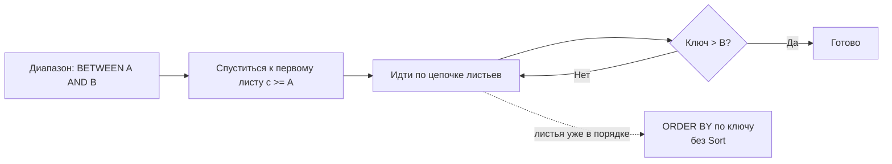

[← Назад к индексу части 6](index.md)

## 30. B-tree

### 30.1. Структура B-tree

**Цель раздела.**  
Понять **B-tree** как сбалансированное дерево поиска: все листья на одном уровне; узлы содержат ключи и указатели на дочерние узлы или на строки; поиск за O(log N) шагов. После раздела ты будешь чётко представлять, как устроено «дерево» индекса и почему поиск по нему быстрый даже на миллионах записей.

#### Термины (расшифровка)

- **B-tree (B-дерево)** — сбалансированное дерево поиска, в котором **данные** (или указатели на строки таблицы — TID) хранятся в **листьях**; **внутренние узлы** содержат только ключи и указатели на дочерние узлы (поддеревья). «Сбалансированное» значит: **все листья находятся на одном уровне** (одинаковая глубина от корня). Поэтому путь от корня до любого листа всегда одной длины — поиск предсказуем и быстрый, не зависит от порядка вставки.
- **Корень (root)** — единственный узел верхнего уровня; с него **всегда** начинается обход при поиске. Один корень на весь индекс.
- **Лист (leaf)** — узел нижнего уровня; в B-tree индексе в листьях хранятся **пары (ключ, TID)** или (ключ, список TID для неуникального индекса). Листья часто связаны друг с другом в **цепочку** (следующий/предыдущий лист по порядку ключей) — это нужно для диапазонных запросов (BETWEEN, >, <) и для ORDER BY: можно читать листья подряд.

```mermaid
flowchart TB
  R["(Root)"]
  I1["(Internal)"]
  I2["(Internal)"]
  L1["(Leaf)"]
  L2["(Leaf)"]
  L3["(Leaf)"]
  L4["(Leaf)"]

  R --> I1
  R --> I2
  I1 --> L1
  I1 --> L2
  I2 --> L3
  I2 --> L4

  L1 <--> L2
  L2 <--> L3
  L3 <--> L4

  Note1["Внутренние узлы:\nключи-разделители + указатели"] --- R
  Note2["Листья:\n("ключ, TID") и цепочка для диапазонов"] --- L2
```

#### Теория и правила (подробно)

- **Структура узла:** каждый узел B-tree — это **одна страница** (обычно 8 KB в PostgreSQL). В узле хранится **упорядоченный набор ключей** и между ними — **указатели**. В **внутреннем** узле указатели ведут на **дочерние узлы** (другие страницы индекса). В **листе** указатели ведут на **строки таблицы** (TID: номер страницы heap + смещение) или на следующий лист в цепочке. Количество ключей в одном узле ограничено размером страницы и размером ключа — обычно сотни ключей в узле, поэтому дерево «широкое» и неглубокое.
- **Поиск:** по значению ключа **спускаемся от корня**: в каждом узле сравниваем искомый ключ с ключами узла и по указателю переходим в нужное поддерево (влево или вправо), пока не дойдём до **листа**. В листе ищем ключ (и читаем TID) или убеждаемся, что ключа нет. Число шагов = **глубина дерева** = O(log N), где N — число записей в индексе. При миллионе записей глубина обычно **3–4** — то есть 3–4 чтения страниц индекса.
- **Вставка:** находим лист для нового ключа (как при поиске); вставляем ключ и TID в лист. Если лист **переполняется** (ключей больше, чем помещается в страницу), выполняется **разделение (split)**: создаётся новый лист, ключи делятся пополам между старым и новым листом; в родительский узел поднимается **средний** ключ и два указателя (на старый и новый лист). При переполнении внутреннего узла — аналогичное разделение. Так **все листья остаются на одном уровне** — баланс сохраняется.

#### Пошагово: поиск по B-tree (ключ 42, с числами)

Допустим, в индексе миллион записей (ключи от 1 до 1 000 000). Глубина дерева — 3 уровня: корень → внутренний слой → листья.

1. **Шаг 1 — корень.** Читаем **страницу корня** (одно чтение). В корне ключи-разделители, например: [250000, 500000, 750000]. Сравниваем 42: 42 < 250000 → идём по **первому** указателю (в поддерево для ключей от 1 до 250000).
2. **Шаг 2 — внутренний узел.** Читаем **вторую страницу** индекса (внутренний узел). В нём ключи, например: [50000, 100000, 150000, 200000]. 42 < 50000 → идём по первому указателю (в поддерево для ключей 1–50000).
3. **Шаг 3 — лист.** Читаем **третью страницу** индекса — это **лист**. В листе пары (ключ, TID) упорядочены: (1, TID1), (2, TID2), …, (42, TID42), … Находим ключ 42, читаем **TID42** (например: страница таблицы 5000, смещение 200).
4. **Шаг 4 — таблица.** По TID42 читаем **страницу таблицы** 5000, по смещению 200 получаем строку. Возвращаем её запросу.


**Итог:** **3 чтения страниц индекса** + **1 чтение страницы таблицы** = 4 чтения всего. Без индекса пришлось бы прочитать **все** страницы таблицы (сотни тысяч). Разница — в десятки тысяч раз по числу прочитанных страниц.

> **Важно.** B-tree называется **сбалансированным**, потому что все листья на **одной глубине**. Не бывает «длинной ветки» с одной стороны и «короткой» с другой — путь от корня до любого листа всегда одинаковой длины. Поэтому поиск по любому ключу занимает одно и то же число шагов (глубина дерева).

#### Что будет, если дерево не сбалансировать

Если бы при вставке мы просто «подвешивали» новые ключи в конец (как список), дерево могло бы выродиться в **цепочку**: корень → узел → узел → … → лист. Тогда поиск по последнему ключу требовал бы обхода **всех** узлов — O(N) вместо O(log N). В B-tree за счёт правил разделения узлов (split) дерево всегда остаётся сбалансированным — все листья на одном уровне.

#### Простыми словами

**B-tree** — это «многоуровневый указатель»: на верхнем уровне грубое деление (диапазоны ключей), на следующем уровне — более мелкое, и так до листьев, где лежат сами ключи и указатели на строки. Все листья на одной глубине — поэтому поиск всегда занимает примерно одно и то же число шагов (логарифм от числа записей). Так устроен основной тип индекса в PostgreSQL и во многих СУБД.

#### Картинка в голове

Папки на полке: на корешке первой папки «А–К», второй «Л–Я». Открыл «А–К» — внутри подпапки «А–В», «Г–Е», «Ж–К». Открыл «Г–Е» — там листы с фамилиями Григорьев, Дмитриев, Егоров и номерами страниц. Чтобы найти «Дмитриев», нужно открыть только три «уровня» (полка → папка → подпапка → лист). B-tree — так же: корень → внутренние узлы → лист с ключами и TID.

#### Как запомнить

**B-tree** = сбалансированное дерево; **все листья на одном уровне**; поиск за **O(log N)**. Узлы = ключи + указатели (на дочерние узлы или на строки в листьях). Вставка с разделением узлов при переполнении сохраняет баланс.

#### Проверь себя (30.1)

1. Почему в B-tree все листья на одном уровне и что это даёт?  
<details><summary>Ответ</summary> **Баланс** сохраняется при вставке за счёт правил разделения узлов: при переполнении листа он делится, и в родителя поднимается средний ключ; при переполнении внутреннего узла — аналогично. В результате глубина всех листьев одинакова. Это даёт **предсказуемую стоимость поиска**: путь от корня до любого листа имеет длину O(log N), не зависит от порядка вставки. В сбалансированном дереве нет «длинных веток» с одной стороны.</details>

2. Сколько примерно шагов нужно для поиска по B-tree в индексе на 1 млн записей?  
<details><summary>Ответ</summary> Глубина B-tree примерно **log₂(N)** при ветвлении 2, но в реальности в одном узле помещается много ключей (сотни), поэтому основание логарифма больше. Типичная глубина для миллиона записей — **3–4 уровня** (корень → 2–3 внутренних узла → лист). То есть 3–4 чтения страниц индекса плюс чтение страницы(й) таблицы по TID.</details>

3. Где в B-tree хранятся указатели на строки таблицы (TID)?  
<details><summary>Ответ</summary> В **листьях**. Внутренние узлы хранят только ключи и указатели на **дочерние узлы** (страницы индекса). В листовых узлах хранятся пары (ключ, TID) или (ключ, список TID для неуникального индекса). По TID из листа СУБД затем читает страницу heap и получает строку.</details>

4. Почему «все листья на одном уровне» важно для скорости поиска?  
<details><summary>Ответ</summary> Потому что **путь от корня до любого листа** тогда имеет **одинаковую длину** (глубину дерева). Поиск по любому ключу — это всегда одно и то же число шагов (3–4 для миллиона записей). Не бывает «коротких» и «длинных» путей: ни один ключ не «спрятан» глубоко в одной ветке. Это даёт **предсказуемую** и **минимальную** стоимость поиска.</details>

**Три пункта, чтобы не забыть (B-tree).** 1) **Сбалансированность:** все листья на **одном уровне** (одинаковая глубина от корня); путь от корня до любого листа = одно и то же число шагов (3–4 для миллиона записей) — поиск O(log N). 2) **Корень** — одна страница, с неё начинается каждый поиск; **внутренние узлы** — ключи + указатели на дочерние узлы; **листья** — ключи + TID (указатели на строки таблицы). 3) При **переполнении** узла при вставке он **разделяется** (split) — дерево остаётся сбалансированным; без этого дерево могло бы выродиться в цепочку и поиск стал бы O(N).

#### Запомните

- **B-tree** — сбалансированное дерево поиска; все листья на одном уровне; поиск O(log N).
- Узлы содержат ключи и указатели: во внутренних узлах — на дочерние узлы; в листьях — на строки таблицы (TID).
- Вставка с разделением узлов при переполнении сохраняет баланс.

**Ещё раз самыми простыми словами:** B-tree — это «многоэтажный указатель». На верхнем этаже (корень) — грубое деление («ключи от 1 до 250000 — в эту дверь»). На следующем этаже — более мелкое деление. На нижнем этаже (листья) — сами ключи и номера страниц таблицы (TID). Чтобы найти ключ, спускаемся с этажа на этаж — всегда одно и то же число шагов (3–4 для миллиона записей). Все «нижние этажи» (листья) на одной высоте — дерево сбалансировано.

---

### 30.2. Листья и диапазонные запросы

**Цель раздела.**  
Понять, что **листья B-tree упорядочены по ключу** и связаны в цепочку (следующий/предыдущий лист). Поэтому запросы по **диапазону** (BETWEEN, >, <) и **ORDER BY по ключу** выполняются эффективно: обход листьев по порядку без полной сортировки. После раздела ты будешь чётко представлять, почему B-tree подходит не только для «найти ровно одно значение», но и для «все за январь» и «отсортировать по дате».

#### Термины (расшифровка)

- **Диапазонный запрос (range query)** — условие вида `WHERE col BETWEEN a AND b`, `WHERE col > x`, `WHERE col < y` и т.п. B-tree по этому столбцу позволяет найти **начальный** лист (где лежит первое значение в диапазоне) и затем читать листья **подряд** по цепочке до конца диапазона — не нужно обходить всё дерево и не нужна отдельная сортировка.
- **Ordered scan (упорядоченное сканирование)** — чтение данных **в порядке ключа индекса**. Листья B-tree упорядочены по ключу; при обходе «слева направо» по цепочке листьев мы получаем ключи (и TID) уже в **возрастающем** порядке. Поэтому ORDER BY по тому же столбцу(ам) выполняется **без отдельной операции Sort** — данные приходят из индекса уже в нужном порядке.
- **Листовая цепочка** — в реализации B-tree листья связаны указателями «следующий лист» / «предыдущий лист» по порядку ключей. По диапазону мы один раз спускаемся к **начальному** листу, а дальше просто идём по цепочке вперёд (или назад), не поднимаясь к корню. Это быстро и предсказуемо.

#### Теория и правила (подробно)

- **BETWEEN, >, <, >=, <=:** планировщик может выбрать **Index Scan** или **Bitmap Index Scan** по B-tree. Алгоритм: спуск по дереву от корня к **первому листу**, где может быть начало диапазона; затем чтение листьев **последовательно** по цепочке, пока не выйдем за конец диапазона. Количество прочитанного пропорционально **размеру результата** (сколько строк попало в диапазон) плюс несколько страниц индекса на спуск к первому листу. Весь индекс читать не нужно.
- **ORDER BY col [ASC|DESC]:** если порядок сортировки в запросе **совпадает** с порядком ключа индекса (ASC или DESC), индекс может отдавать строки уже в нужном порядке — узел **Sort** в плане не нужен. Это экономит память (work_mem) и время. Если ORDER BY по **другому** столбцу — сортировка по индексу не поможет, понадобится отдельная Sort.
- **Составной ключ (a, b):** диапазон по первому столбцу и равенство по второму (WHERE a BETWEEN ... AND ... AND b = 5) тоже эффективны: в дереве обходим листья в порядке (a, b), отбор по b = 5 делаем на ходу.



#### Пошагово: диапазонный запрос (с числами)

Запрос: все заказы за январь 2024, отсортированные по дате. Индекс по **created_at**. В таблице 10 млн заказов; за январь 2024 — 50 000 строк.

1. Планировщик выбирает **Index Scan** по индексу на created_at (или Bitmap Index Scan — зависит от оценки).
2. Спуск по B-tree от корня к **первому листу**, где может быть ключ '2024-01-01' (или ближайший после него). Читаем **3–4 страницы индекса** (корень → внутренние → лист).
3. В листе находим начало диапазона (первый ключ >= '2024-01-01'). Дальше читаем **листья по цепочке** подряд: каждый следующий лист содержит ключи по возрастанию даты. Читаем только те листья, где ключи попадают в [2024-01-01, 2024-01-31]. Допустим, это 20 листов индекса (50 000 записей / ~2500 записей на лист).
4. По TID из индекса читаем страницы таблицы (или сначала собираем TID в bitmap и читаем страницы таблицы по порядку — Bitmap Heap Scan). Данные уже приходят **в порядке created_at** — отдельная сортировка не нужна.

**Итог:** прочитано ~24 страницы индекса + страницы таблицы только для 50 000 строк. Без индекса пришлось бы прочитать **всю** таблицу (миллионы страниц) и потом **сортировать** 50 000 строк в памяти или на диске. B-tree даёт и фильтрацию по диапазону, и порядок «бесплатно».

> **Важно.** Листья B-tree **упорядочены по ключу** и **связаны в цепочку**. Поэтому «все значения от A до B» — это не «перебрать весь индекс», а «найти лист с A и идти по цепочке до B». И «отсортировать по этому столбцу» — просто читать листья по порядку, без отдельной операции Sort.

#### Пример: диапазонный запрос

```sql
-- B-tree по created_at
SELECT * FROM orders
WHERE created_at BETWEEN '2024-01-01' AND '2024-01-31'
ORDER BY created_at;
```

План: Index Scan по индексу на created_at; начальный ключ '2024-01-01', конечный '2024-01-31'; листья читаются по цепочке; порядок уже по created_at — Sort не нужен.

#### Простыми словами

Листья B-tree **упорядочены по ключу** и связаны «цепочкой». Поэтому «найти все строки, где значение между A и B» — это найти начало диапазона в дереве и затем **идти по листьям подряд** до конца диапазона. И «выдать строки отсортированными по этому столбцу» тоже делается без отдельной сортировки — мы просто читаем листья по порядку. B-tree поэтому хорош не только для точечного поиска (=), но и для диапазонов и ORDER BY по ключу.

#### Картинка в голове

Листья — как страницы книги, выложенные по порядку дат. Чтобы выписать все заказы за январь, открываешь страницу с 1 января и листаешь подряд до 31 января — не нужно прыгать по всей книге. ORDER BY по дате — ты уже листаешь в порядке дат. B-tree так и устроен: листья упорядочены и связаны.

#### Как запомнить

**Листья B-tree упорядочены и связаны.** Диапазон (BETWEEN, >, <) = найти начало + идти по листьям до конца диапазона. **ORDER BY по ключу** = читать листья по порядку, **Sort не нужен**.

#### Проверь себя (30.2)

1. Почему B-tree эффективен для запроса WHERE col BETWEEN a AND b?  
<details><summary>Ответ</summary> Потому что листья B-tree **упорядочены по ключу** и связаны в цепочку. СУБД находит лист, где начинается диапазон [a, b] (спуск по дереву от корня), и затем читает листья **последовательно** по цепочке, пока не дойдёт до ключа b. Читаются только листья, попадающие в диапазон, а не весь индекс. Количество прочитанного пропорционально размеру результата плюс логарифм для поиска начала.</details>

2. Зачем при ORDER BY created_at использовать индекс по created_at?  
<details><summary>Ответ</summary> Потому что при чтении индекса по порядку ключа мы получаем строки **уже в порядке created_at**. Отдельная операция **Sort** (сортировка результата) не нужна — данные приходят отсортированными из индекса. Это экономит память (work_mem для сортировки) и время. Если индекс по (status, created_at), то ORDER BY status, created_at тоже может быть без Sort при подходящем плане.</details>

3. Поддерживает ли Hash-индекс диапазонные запросы и ORDER BY?  
<details><summary>Ответ</summary> **Нет.** Hash-индекс вычисляет хеш от ключа и даёт доступ только по **равенству** (WHERE key = constant). Внутри нет порядка ключей — нет «следующего» и «предыдущего». Диапазоны (BETWEEN, >, <) и ORDER BY по ключу для Hash не поддерживаются; для них нужен B-tree (или другой упорядоченный индекс).</details>

4. Зачем листья B-tree связывать в цепочку? Что было бы без цепочки?  
<details><summary>Ответ</summary> **Цепочка** позволяет по диапазону, найдя начальный лист (один спуск по дереву), дальше **идти по листьям подряд** (следующий лист → следующий → …), не возвращаясь к корню. **Без цепочки** для перехода к «следующему» ключу пришлось бы каждый раз подниматься к родителю и искать следующий указатель — обход диапазона стал бы сложным и медленным. Цепочка даёт простой последовательный обход листьев по порядку ключей.</details>

**Три пункта, чтобы не забыть (листья и диапазоны).** 1) **Листья** B-tree **упорядочены по ключу** и связаны «следующий/предыдущий» — поэтому «все значения от A до B» = найти лист с A и идти по цепочке до B, без обхода всего дерева. 2) **ORDER BY** по столбцу(ам) ключа индекса выполняется **без Sort** — данные приходят из индекса уже в порядке; запрос просто читает листья подряд. 3) **Hash-индекс** не хранит порядок ключей — диапазоны (BETWEEN, >, <) и ORDER BY по ключу для Hash **не поддерживаются**; для них только B-tree (или другой упорядоченный индекс).

#### Запомните

- **Листья B-tree упорядочены по ключу** и связаны; диапазонные запросы (BETWEEN, >, <) выполняются обходом от начала диапазона по цепочке листьев.
- **ORDER BY по ключу индекса** может выполняться без Sort — данные читаются из индекса в нужном порядке.
- **Hash-индекс** не поддерживает диапазоны и сортировку — только равенство.

**Ещё раз самыми простыми словами:** листья индекса — как страницы книги по порядку дат. «Все заказы за январь» = открыл страницу с 1 января и листаешь подряд до 31 января. «Отсортировать по дате» = ты уже листаешь в порядке дат, отдельно сортировать не нужно. B-tree устроен так, что листья упорядочены и связаны — поэтому и диапазоны, и сортировка по ключу делаются без перебора всего индекса и без отдельной сортировки.

---

### 30.3. Составные ключи и порядок столбцов

**Цель раздела.**  
Понять **правило левого префикса**: составной индекс (a, b, c) полезен для условий WHERE по **a**, по **a AND b**, по **a AND b AND c**, но **не** для одного **b** или **c** без **a**. Порядок столбцов в определении индекса важен. После раздела ты будешь правильно выбирать порядок столбцов в индексе под свои запросы.

#### Термины (расшифровка)

- **Составной индекс (composite index)** — индекс по **нескольким столбцам** в заданном порядке, например (status, created_at). Ключ индекса — кортеж (значение первого столбца, значение второго, …). Записи в B-tree упорядочены **сначала** по первому столбцу, **затем** по второму при равенстве первого и т.д.
- **Правило левого префикса (left-prefix rule)** — составной индекс (a, b, c) может использоваться для условий по **левому префиксу** ключа: только **a**; **a AND b**; **a AND b AND c**. Он **не** может эффективно использоваться для условия только по **b** или только по **c** (или по b AND c без a), потому что в дереве записи не упорядочены по **b** отдельно — порядок по b только внутри групп с одинаковым **a**.
- **Селективность и порядок столбцов** — выгодно ставить **более селективный** столбец первым (тот, который сильнее отсекает строки), если запросы часто идут по нему. Но порядок должен соответствовать типичным условиям: если чаще запрос WHERE status = ? AND created_at > ?, то индекс (status, created_at) подходит; если чаще только created_at > ?, то отдельный индекс по created_at или порядок (created_at, status) для такого запроса.

#### Теория и правила

- **Индекс (a, b):** в B-tree записи упорядочены по (a, b). Запрос **WHERE a = 5** — находим в дереве поддерево/листья с a = 5; полезен. Запрос **WHERE a = 5 AND b = 10** — находим точку (5, 10); полезен. Запрос **WHERE b = 10** — в дереве нет порядка «только по b» (значения b перемешаны для разных a); индекс по (a, b) **не подходит** для поиска только по b без a. Планировщик может выбрать sequential scan или отдельный индекс по b.
- **Порядок столбцов:** индекс (status, created_at) хорош для WHERE status = 'active' AND created_at > ... и для ORDER BY status, created_at. Индекс (created_at, status) хорош для WHERE created_at > ... AND status = 'active' и для ORDER BY created_at, status. Выбор порядка зависит от того, какие условия и порядки сортировки чаще в запросах.
- **Покрывающий индекс (covering):** если все столбцы запроса входят в индекс (включая INCLUDE в PostgreSQL), возможен **index-only scan** — чтение только из индекса без обращения к таблице. Составной индекс (a, b) с INCLUDE (c, d) даёт ключ (a, b) и в листьях хранятся также c, d — запрос SELECT a, b, c, d WHERE a = ? может быть выполнен только по индексу.

#### Пошагово: поиск по составному индексу (a, b)

Индекс **(status, created_at)**. Запрос: `WHERE status = 'active' AND created_at > '2024-01-01'`.

1. В B-tree записи упорядочены **сначала по status**, при равенстве status — по created_at. Поэтому все ключи с status = 'active' образуют **непрерывный блок** в дереве: (active, 2024-01-01), (active, 2024-01-02), …, (active, 2024-12-31), затем (closed, …).
2. Планировщик спускается по дереву к первому ключу (active, 2024-01-01) и дальше читает **листья по цепочке** только в пределах status = 'active', пока created_at в диапазоне. Остальные ветки дерева (status = 'closed' и т.д.) **не читаются**.
3. Если бы в запросе было только **WHERE created_at > '2024-01-01'** (без status), в дереве нет «непрерывного» куска по created_at — для разных status даты перемешаны по разным веткам. Пришлось бы обойти все листья — индекс (status, created_at) для такого условия не подходит.

**Итог:** левый префикс (status) задан — используем индекс эффективно. Без левого префикса индекс для поиска только по created_at не пригоден.

#### Примеры

```sql
-- Составной индекс (status, created_at)
CREATE INDEX idx_orders_status_created ON orders (status, created_at);

-- Используется: WHERE status = 'active'
-- Используется: WHERE status = 'active' AND created_at > '2024-01-01'
-- Используется: ORDER BY status, created_at (при подходящем WHERE по status)
-- НЕ используется для одного: WHERE created_at > '2024-01-01' (нет status в условии — левый префикс нарушен для эффективного поиска по created_at)
```

Для запроса **только** по created_at нужен **отдельный** индекс по created_at или индекс (created_at, ...).

> **Важно.** Порядок столбцов в индексе **(a, b)** — это порядок **сортировки** в дереве: сначала все по **a**, внутри одинаковых a — по **b**. Поэтому «найти все, где a = 5» — легко (один кусок дерева). «Найти все, где b = 10» — трудно: значения b для разных a разбросаны по всему дереву. **Левый префикс** = использовать индекс «слева направо»: сначала первый столбец, потом второй. Пропускать столбец нельзя — иначе порядок в дереве не совпадает с запросом.

#### Что будет, если искать только по b при индексе (a, b)

В B-tree записи упорядочены так: (a=1, b=10), (a=1, b=20), (a=2, b=5), (a=2, b=15), (a=3, b=10), … То есть **сначала** группировка по **a**, внутри каждой группы — по **b**. Если нужны «все строки, где b = 10», они **разбросаны** по дереву: (a=1, b=10), (a=3, b=10), (a=5, b=10), … Нет одного непрерывного «блока» по b. Чтобы найти все такие строки по индексу (a, b), пришлось бы **обойти всё дерево** — это не быстрее полного скана. Поэтому для запроса `WHERE b = 10` без a планировщик выберет sequential scan или отдельный индекс по b.

#### Типичная ошибка

Сделали составной индекс **(status, created_at)**, потому что часто ищут «активные заказы за период» (WHERE status = 'active' AND created_at > ?). Но в приложении **ещё есть** частый запрос «все заказы за период» **без** условия по status (WHERE created_at > ?). По индексу (status, created_at) такой запрос **не идёт** — левый префикс (status) не задан, в дереве нет непрерывного диапазона по created_at. В итоге для второго запроса — sequential scan, хотя индекс есть. **Исправление:** либо завести **отдельный индекс по created_at** для запросов без status, либо пересмотреть порядок столбцов (например, (created_at, status), если запросы только по дате чаще). Всегда смотри, по каким **реальным** условиям ищешь: составной индекс (a, b) помогает только когда в запросе есть **хотя бы a**.

#### Простыми словами

**Составной индекс (a, b)** — как указатель в книге «сначала по фамилии, потом по имени». Искать «все Ивановы» — можно (левый префикс «Иванов»). Искать «все Ивановы с именем Пётр» — можно. Искать «всех Петров» **без фамилии** — по этому указателю нельзя: Петры есть у Ивановых, Сидоровых и т.д., они не сгруппированы. Порядок столбцов в индексе = порядок «сначала по первому, потом по второму» — от него зависит, для каких условий индекс подойдёт.

#### Картинка в голове

Указатель в книге: «Фамилия → Имя → Страница». Найти «Иванов» — открываешь раздел «Иванов». Найти «Иванов Пётр» — в разделе «Иванов» ищешь «Пётр». Найти «всех Петров» по этому указателю нельзя — Петры есть у Ивановых, Сидоровых и т.д., они не сгруппированы. **Левый префикс** = использовать индекс «слева направо»: сначала первый столбец, потом второй.

#### Как запомнить

**Составной индекс (a, b, c):** полезен для WHERE по **a**; по **a AND b**; по **a AND b AND c**. **Не** для одного **b** или **c** без **a**. **Порядок столбцов важен** — должен соответствовать типичным условиям и ORDER BY.

#### Проверь себя (30.3)

1. Почему индекс (status, created_at) не используется для запроса WHERE created_at > '2024-01-01' (без status)?  
<details><summary>Ответ</summary> Потому что в B-tree записи упорядочены **сначала по status**, потом по created_at внутри каждой группы status. Значения **created_at** для разных status перемешаны по дереву (сначала все 'active' по датам, потом все 'closed' по датам и т.д.). Нет непрерывного «диапазона» created_at по всему индексу — чтобы найти все строки с created_at > '2024-01-01', пришлось бы обойти все листья (все комбинации status). Это не эффективнее полного скана таблицы; планировщик выберет sequential scan. Для поиска только по created_at нужен отдельный индекс по created_at.</details>

2. Для каких условий полезен составной индекс (user_id, created_at)?  
<details><summary>Ответ</summary> Полезен для **WHERE user_id = ?** (все записи пользователя); для **WHERE user_id = ? AND created_at > ?** (записи пользователя за период); для **ORDER BY user_id, created_at** при подходящем WHERE. **Не** полезен для одного **WHERE created_at > ?** без user_id — левый префикс (user_id) не задан.</details>

3. Что такое правило левого префикса одной фразой?  
<details><summary>Ответ</summary> **Составной индекс можно использовать только по столбцам с начала**: (a, b, c) — по a; по a и b; по a, b и c. Нельзя эффективно искать только по b или только по c без a.</details>

4. Есть индекс (user_id, created_at). Для каких из запросов он подойдёт: (A) WHERE user_id = 5; (B) WHERE user_id = 5 AND created_at > '2024-01-01'; (C) WHERE created_at > '2024-01-01' (без user_id)?  
<details><summary>Ответ</summary> **(A)** и **(B)** — подойдут. (A): левый префикс user_id задан — ищем поддерево user_id = 5. (B): оба столбца заданы — ищем в поддереве user_id = 5 диапазон по created_at. **(C)** — не подойдёт: в условии нет user_id, левый префикс не задан. В дереве значения created_at для разных user_id перемешаны; эффективно искать только по created_at по этому индексу нельзя. Для (C) нужен отдельный индекс по created_at.</details>

**Три пункта, чтобы не забыть (составной индекс).** 1) Использовать индекс можно **только с начала**: (a, b) — по a или по a и b; по одному b **нельзя**. 2) **Порядок столбцов** в индексе = порядок «сначала первый, потом второй»; подбирай под типичные запросы (какой столбец чаще в WHERE первым — тот и первым в индексе). 3) Если часто ищешь **только по второму** столбцу без первого — нужен **отдельный** индекс по этому столбцу или другой порядок столбцов в составном.

#### Запомните

- **Составной индекс (a, b, c)** полезен для условий по **левому префиксу**: a; a AND b; a AND b AND c. Не для одного b или c без a.
- **Порядок столбцов** в определении индекса важен; должен соответствовать типичным WHERE и ORDER BY.

**Ещё раз самыми простыми словами:** составной индекс (a, b) — как «сначала фамилия, потом имя». Искать по фамилии — можно. По фамилии и имени — можно. Только по имени без фамилии — нельзя по этому указателю: имена разбросаны по разным фамилиям. Поэтому порядок столбцов в индексе выбирают под типичные запросы: какой столбец чаще в условии первым — тот и первым в индексе (если запросы по одному столбцу — тот первым; если по двум — порядок (первый, второй)).

---

### 30.4. INCLUDE — покрывающий индекс

**Цель раздела.**  
Понять **покрывающий индекс (covering index)**: индекс, в котором **все столбцы**, нужные запросу, присутствуют (ключ + при необходимости INCLUDE). Тогда возможен **index-only scan** — чтение только из индекса без обращения к таблице (heap), меньше I/O. После раздела ты будешь понимать, зачем выносить «лишние» столбцы в INCLUDE, а не в ключ, и когда запрос реально выполняется без обращения к таблице.

#### Термины (расшифровка)

- **Покрывающий индекс (covering index)** — индекс, содержащий **все** столбцы, которые запрос **выбирает** (SELECT) и по которым **фильтрует** (WHERE). Тогда СУБД может ответить на запрос, не читая страницы таблицы — только листья индекса. В PostgreSQL это делают ключевыми столбцами плюс **INCLUDE (col1, col2, ...)**: дополнительные столбцы хранятся **в листьях** индекса (в каждой записи листа), но **не входят в ключ** B-tree — по ним не ищут и не сортируют. Пример: запрос `SELECT id, status, created_at FROM orders WHERE status = 'active'` при индексе **(status) INCLUDE (id, created_at)** может получить id, status, created_at только из индекса.
- **Index-only scan** — способ выполнения, при котором данные читаются **только из индекса**; страницы таблицы (heap) не читаются. Возможен, если: 1) все нужные столбцы есть в индексе (покрывающий индекс); 2) для затронутых страниц таблицы в **visibility map** помечено «все строки на странице видимы» — иначе СУБД обращается к heap для проверки видимости (Heap Fetches). Подробнее — в §34.2.
- **INCLUDE** — в определении индекса: **CREATE INDEX ... ON t (a, b) INCLUDE (c, d)**. Столбцы c, d хранятся **только в листьях**; в ключ B-tree (по которому идёт поиск и порядок) они не входят. Нужны только чтобы «покрыть» запрос (SELECT c, d) и не ходить в heap.

#### Теория и правила (подробно)

- **Зачем INCLUDE, а не «всё в ключ»:** ключ B-tree определяет **порядок** записей в дереве и **размер** каждой записи в узлах. Чем **больше ключ** (много столбцов или широкие типы), тем **меньше** ключей помещается в один узел (страницу 8 KB) — дерево становится **выше**, поиск — чуть дороже. Столбцы, по которым мы **не ищем** и **не сортируем**, а только «выводим» в SELECT, выгодно держать **вне ключа** — в **INCLUDE**. Они попадают только в листья; ключ остаётся маленьким, дерево не раздувается.
- **Index-only scan и visibility map:** даже при покрывающем индексе для каждой строки нужно знать, **видима** ли она текущей транзакции (не удалена, не скрыта другой транзакцией). Эта информация в PostgreSQL хранится в **heap** (xmin, xmax в заголовке строки). Если для страницы таблицы в **visibility map** установлен бит «все строки на странице видимы всем», СУБД не обращается к heap — считает строки видимыми. Если бит не установлен — выполняется **heap fetch** (чтение страницы таблицы). После **VACUUM** страницы помечаются в visibility map; при частых обновлениях часть страниц не помечена — будут Heap Fetches. Подробнее в §34.2.
- **Пример:** `SELECT id, status, created_at FROM orders WHERE status = 'active'`. Индекс **(status) INCLUDE (id, created_at)** — покрывающий: в ключе status (по нему WHERE), в листьях ещё id и created_at (SELECT). Если visibility map актуальна — index-only scan, без чтения таблицы.

> **Важно.** В **ключ** индекса имеет смысл включать только столбцы, по которым **ищем** (WHERE) или **сортируем** (ORDER BY). Столбцы, которые нужны только для **вывода** (SELECT), лучше класть в **INCLUDE** — тогда индекс остаётся компактным по ключу, но запрос всё равно «покрыт» и возможен index-only scan.

#### Пошагово: как запрос обслуживается покрывающим индексом (с числами)

Запрос: `SELECT id, status, created_at FROM orders WHERE status = 'active'`. Индекс: **(status) INCLUDE (id, created_at)**. В листьях индекса для каждой строки хранится: ключ status + id + created_at (и TID).

1. Планировщик выбирает **Index Only Scan** по этому индексу: в индексе есть status (WHERE), id и created_at (SELECT) — запрос покрыт.
2. Обходим индекс по ключу status = 'active'; из каждого листа читаем **id, status, created_at** (и TID). Данные для ответа уже есть в индексе — **в таблицу можно не ходить**, если страницы таблицы помечены в visibility map.
3. Для каждого TID проверяем **visibility map**: страница таблицы помечена «все видимы»? Если **да** — heap не читаем, отдаём строку из индекса. Если **нет** — делаем heap fetch (читаем страницу таблицы для проверки xmin/xmax).
4. Итог: при полной visibility map читаются **только страницы индекса** (например, 50 страниц индекса на 10 000 строк). Без покрывающего индекса пришлось бы читать те же 50 страниц индекса **плюс** страницы таблицы по каждому TID (ещё тысячи страниц heap). Покрывающий индекс даёт большое сокращение I/O.

#### Что будет, если все «лишние» столбцы добавить в ключ, а не в INCLUDE

Если сделать индекс **(status, id, created_at)** — все три столбца в **ключе** — то поиск по status = 'active' по-прежнему работает (левый префикс), но **ключ** каждой записи в B-tree станет длиннее (status + id + created_at). В одном узле (странице 8 KB) поместится **меньше** ключей → дерево станет **выше** → чуть больше чтений страниц индекса при поиске. Плюс при ORDER BY только по status порядок в индексе (status, id, created_at) может использоваться не так эффективно, как (status) с INCLUDE. **Итог:** для столбцов «только для вывода» INCLUDE предпочтительнее — ключ не раздувается.

#### Пример (PostgreSQL)

```sql
-- Покрывающий индекс: ключ status, в листьях ещё id и created_at
CREATE INDEX idx_orders_status_covering ON orders (status) INCLUDE (id, created_at);

-- Запрос может быть выполнен как Index Only Scan по этому индексу
-- (если visibility map помечает страницы таблицы как «все видимы»)
SELECT id, status, created_at FROM orders WHERE status = 'active';
```

#### Простыми словами

**Покрывающий индекс** — такой индекс, в котором есть **все** столбцы, которые нужны запросу. Тогда база может ответить на запрос, **не открывая саму таблицу** — только листая индекс. Это быстрее (меньше I/O). В PostgreSQL для этого используют **INCLUDE**: в ключ индекса входят только столбцы для поиска/сортировки, а остальные нужные столбцы перечисляются в INCLUDE и хранятся в листьях. **Index-only scan** — когда план «читаю только индекс» возможен (и visibility map позволяет не проверять видимость по таблице).

#### Картинка в голове

Книга (таблица) и указатель в конце (индекс). Обычно: по указателю находишь номер страницы и идёшь в книгу читать строку. **Покрывающий индекс** — в указателе уже выписано не только «страница 45», но и сама нужная строка (все нужные столбцы). Тогда в книгу можно не ходить — всё есть в указателе. INCLUDE — это «дописать в указатель ещё столбцы», не меняя порядок указателя (по фамилии).

#### Как запомнить

**Покрывающий индекс** = все столбцы запроса в индексе (ключ + INCLUDE). **Index-only scan** = чтение только из индекса, без heap; возможно при покрытии и актуальной visibility map. **INCLUDE** = столбцы в листьях индекса без участия в ключе.

#### Проверь себя (30.4)

1. Зачем нужен INCLUDE в определении индекса?  
<details><summary>Ответ</summary> Чтобы хранить в **листьях** индекса дополнительные столбцы для **покрытия** запроса, не включая их в **ключ** B-tree. Ключ определяет порядок поиска и размер узлов; больший ключ — меньше ключей в узле, выше дерево. Столбцы в INCLUDE не участвуют в поиске и сортировке — они только в листьях, чтобы запрос мог получить все нужные данные из индекса и не обращаться к таблице (index-only scan).</details>

2. При каком условии возможен index-only scan?  
<details><summary>Ответ</summary> 1) **Все столбцы**, которые запрос выбирает и по которым фильтрует, должны быть в индексе (покрывающий индекс, в т.ч. через INCLUDE). 2) Для страниц таблицы, на которые указывают TID из индекса, в **visibility map** должно быть помечено «все строки на странице видимы всем» — иначе СУБД вынуждена обращаться к heap для проверки видимости (xmin/xmax) и index-only scan превращается в index scan с чтением heap.</details>

3. В чём разница между столбцом в ключе индекса (a, b) и столбцом в INCLUDE (c)?  
<details><summary>Ответ</summary> **Ключ (a, b):** столбцы a и b входят в ключ B-tree; по ним выполняется поиск и порядок записей в дереве; они участвуют в правиле левого префикса (индекс полезен для WHERE a = ?, WHERE a = ? AND b = ?). **INCLUDE (c):** столбец c хранится только в **листьях** индекса (в каждой записи листа); по нему не ищут и не сортируют; он нужен только чтобы «покрыть» запрос (SELECT c) и не читать heap. Ключ раздувать лишними столбцами невыгодно; для покрытия используют INCLUDE.</details>

4. Запрос SELECT a, b, c FROM t WHERE a = 5. Индекс (a) INCLUDE (b, c). Почему такой индекс может быть выгоднее индекса (a, b, c) с теми же столбцами в ключе?  
<details><summary>Ответ</summary> При **INCLUDE (b, c)** ключ B-tree — только **(a)**. В узлах дерева (корень, внутренние узлы) хранятся только ключи по **a**; в листьях — a + b + c. Узлы компактные, в одной странице помещается **больше** ключей → дерево **ниже** → меньше чтений при поиске по a. При индексе **(a, b, c)** ключ длиннее; в узлах больше данных → дерево может быть выше, поиск чуть дороже. Плюс столбцы b и c по запросу не участвуют в WHERE и ORDER BY — держать их в ключе нет выгоды; в INCLUDE они только «покрывают» SELECT и не раздувают ключ.</details>

**Три пункта, чтобы не забыть (покрывающий индекс, INCLUDE).** 1) **Покрывающий индекс** = в индексе есть **все** столбцы из SELECT и WHERE; тогда возможен **index-only scan** — ответ без чтения таблицы (если ещё и visibility map помечает страницы «все видимы»). 2) **INCLUDE (col1, col2)** — эти столбцы хранятся **только в листьях**, не в ключе; ключ остаётся маленьким → дерево ниже, поиск быстрее; столбцы в INCLUDE не для поиска/сортировки, а только чтобы «покрыть» запрос. 3) В ключ клади только то, по чему **ищешь** (WHERE) или **сортируешь** (ORDER BY); то, что только **выводишь** (SELECT), — в INCLUDE.

#### Запомните

- **Покрывающий индекс** — все нужные запросу столбцы в индексе (ключ + INCLUDE в PostgreSQL). **Index-only scan** — чтение только из индекса; возможен при покрытии и актуальной visibility map.
- **INCLUDE** — столбцы хранятся в листьях индекса, не входят в ключ; не раздувают дерево, но позволяют покрыть запрос.

**Ещё раз самыми простыми словами:** покрывающий индекс — когда в индексе есть **всё**, что нужно запросу (и для WHERE, и для SELECT). Тогда таблицу можно не открывать — ответ собирается из индекса. INCLUDE — способ «добавить в индекс» столбцы только для вывода, не засовывая их в ключ поиска: ключ остаётся маленьким, дерево быстрым, а запрос всё равно покрыт.

---

### 30.5. Уникальный индекс и порядок сортировки

**Цель раздела.**  
Понять **уникальный индекс (UNIQUE)** — не более одной записи на ключ; и влияние **порядка сортировки** (ASC/DESC) в определении индекса на запросы с ORDER BY.

#### Термины

- **Уникальный индекс (UNIQUE)** — индекс с ограничением: в индексе не может быть двух записей с одинаковым значением ключа. В B-tree для каждого ключа хранится не более одной записи (или одна запись с одним TID для уникального ключа). PRIMARY KEY подразумевает уникальный индекс. UNIQUE используется для обеспечения уникальности (email, логин) и для ускорения поиска по этому столбцу.
- **ASC / DESC в индексе** — в определении индекса можно указать порядок по каждому столбцу: **CREATE INDEX ... ON t (a ASC, b DESC)**. Листья B-tree будут упорядочены по (a возрастание, b убывание). Запрос ORDER BY a ASC, b DESC может быть выполнен без Sort; ORDER BY a DESC, b ASC — наоборот, может потребовать обратного обхода или Sort. В PostgreSQL по умолчанию ASC; для ORDER BY col DESC выгоден индекс с DESC по этому столбцу (или обратный обход индекса, если поддерживается).

#### Теория и правила

- **UNIQUE:** при вставке или обновлении, приводящем к дубликату ключа, СУБД выдаёт ошибку (нарушение уникального ограничения). Уникальный индекс используется планировщиком так же, как обычный B-tree — для поиска и сортировки; плюс гарантия единственности.
- **Порядок ASC/DESC:** в PostgreSQL индекс (a ASC, b DESC) хранит записи в порядке «a по возрастанию, при равенстве a — b по убыванию». Запрос ORDER BY a ASC, b DESC может использовать индекс без Sort. Запрос ORDER BY a DESC, b ASC — планировщик может использовать тот же индекс с обратным обходом листьев (Backward Index Scan), если реализация это поддерживает; иначе — Sort. Для максимальной эффективности ORDER BY с разными направлениями иногда создают два индекса (один ASC, другой DESC) или полагаются на обратный обход.

#### Пример

```sql
-- Уникальный индекс по email
CREATE UNIQUE INDEX idx_users_email ON users (email);

-- Индекс с разным порядком по столбцам (для ORDER BY created_at DESC, id ASC)
CREATE INDEX idx_orders_created_id ON orders (created_at DESC, id ASC);
```

#### Простыми словами

**Уникальный индекс** — «одна запись на одно значение ключа»; и поиск быстрый, и дубликаты запрещены. **Порядок в индексе (ASC/DESC)** — в каком порядке лежат ключи в листьях; если ORDER BY в запросе совпадает с этим порядком, сортировка не нужна. Для ORDER BY col DESC часто полезен индекс с DESC по этому столбцу.

#### Картинка в голове

**Уникальный индекс** — как **алфавитный указатель, где у каждой фамилии ровно один номер страницы**: «Иванов — стр. 5». Второй «Иванов — стр. 12» в таком указателе быть не может (дубликат запрещён). И искать быстро, и данные целостные. **ASC/DESC** — как порядок записей в указателе: «от А к Я» (ASC) или «от Я к А» (DESC). Если тебе нужен список «сначала последние по дате», а в указателе записи уже лежат «последние сначала» (DESC), ты просто читаешь указатель подряд — отдельно сортировать не нужно. Если порядок в указателе другой — пришлось бы читать с конца или сортировать результат.

#### Как запомнить

**UNIQUE** = не более одной записи на ключ; используется для уникальности и для поиска. **ASC/DESC в индексе** = порядок ключей в листьях; совпадение с ORDER BY даёт отказ от Sort (или обратный обход).

#### Проверь себя (30.5)

1. Чем уникальный индекс отличается от обычного B-tree с точки зрения планировщика?  
<details><summary>Ответ</summary> С точки зрения **поиска и сортировки** уникальный индекс ведёт себя так же — B-tree, поиск O(log N), диапазоны, ORDER BY. Отличие — **гарантия единственности**: для каждого ключа не более одной записи (одна строка в таблице). Планировщик может использовать это (например, знать, что поиск по уникальному ключу вернёт не более одной строки). При вставке/обновлении СУБД проверяет отсутствие дубликата и при нарушении выдаёт ошибку.</details>

2. Зачем указывать DESC в определении индекса для столбца created_at?  
<details><summary>Ответ</summary> Чтобы листья индекса были упорядочены по **убыванию** created_at. Запросы с **ORDER BY created_at DESC** (например, «последние заказы сначала») тогда могут выполняться **без Sort** — данные читаются из индекса уже в нужном порядке (с начала листьев, если листья связаны от больших к меньшим). Без DESC в индексе листья упорядочены по возрастанию; для ORDER BY created_at DESC пришлось бы обходить индекс с конца или сортировать результат.</details>

3. PRIMARY KEY и UNIQUE — оба дают уникальность. В чём разница с точки зрения индекса?  
<details><summary>Ответ</summary> **PRIMARY KEY** подразумевает уникальный индекс по ключу и дополнительно ограничение NOT NULL на столбцы ключа; в таблице только один PRIMARY KEY. **UNIQUE** — один или несколько уникальных индексов по другим наборам столбцов; NULL обычно допускается (в PostgreSQL несколько NULL считаются разными, т.е. уникальность не нарушают). С точки зрения **индекса** оба — уникальный B-tree; планировщик использует их одинаково для поиска и сортировки. Отличие — семантика (главный ключ vs дополнительная уникальность) и ограничения (NOT NULL для PK).</details>

**Три пункта, чтобы не забыть (уникальный индекс, ASC/DESC).** 1) **UNIQUE** = в индексе не больше **одной записи на ключ**; при вставке/обновлении дубликата — ошибка; планировщик использует индекс так же, как обычный B-tree (поиск, диапазоны, ORDER BY). 2) **ASC/DESC** в определении индекса = в каком порядке ключи лежат в **листьях**; если ORDER BY в запросе совпадает с этим порядком — **Sort не нужен** (или обратный обход). 3) Для **ORDER BY col DESC** часто выгоден индекс с **DESC** по этому столбцу — тогда листья уже «от больших к меньшим», читаем подряд без сортировки.

#### Запомните

- **Уникальный индекс (UNIQUE)** — не более одной записи на ключ; обеспечивает уникальность и ускоряет поиск.
- **ASC/DESC в индексе** — порядок ключей в листьях; совпадение с ORDER BY позволяет избежать Sort (или использовать обратный обход).

---

---

<!-- prev-next-nav -->
*[← 29. Назначение индексов](01_29_naznachenie_indeksov.md) | [→ 31. Специализированные индексы: Hash, GiST, GIN...](03_31_spetsializirovannye_indeksy_hash_gist_gin_.md)*
