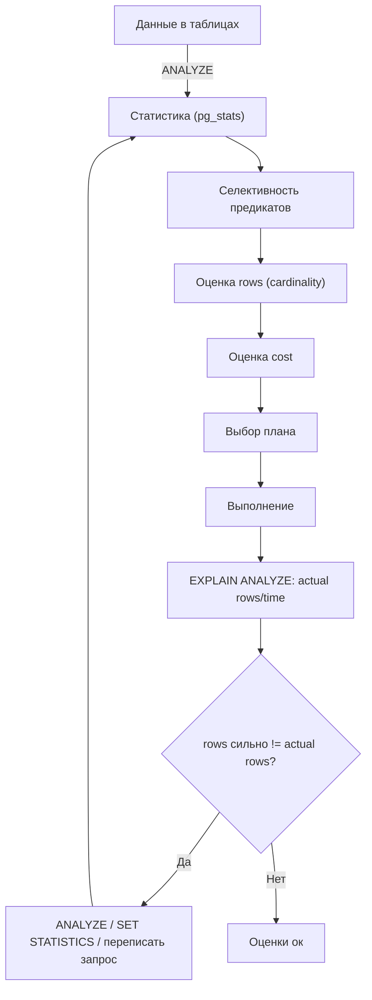
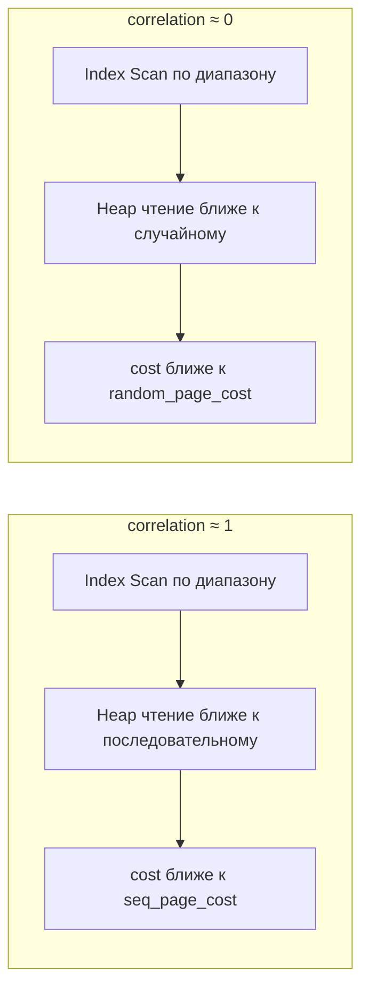

[← Назад к индексу части 7](index.md)

## 37. Статистика

### 37.1. ANALYZE и сбор статистики

**Цель раздела.**  
Понять, зачем нужен **ANALYZE** (сбор статистики по таблицам) и как он связан с качеством планов. Различать ручной и автоматический сбор (autovacuum analyzer). После раздела ты будешь знать, когда вызывать ANALYZE вручную и почему после массовых изменений данных план может «плыть».

**В этом разделе главное (три строки).** 1) **ANALYZE** собирает по таблице **статистику**: сколько строк, как распределены значения по столбцам (гистограммы, частые значения). Этой статистикой пользуется **планировщик** для оценки rows и cost. 2) Без актуальной статистики планировщик строит планы по **старым** цифрам — после массовых INSERT/UPDATE/DELETE или после CREATE INDEX статистика устаревает, планы становятся плохими. 3) **Когда делать:** после **массовой загрузки** и после **CREATE INDEX** всегда выполняй ANALYZE по нужной таблице; при «странном» плане тоже проверь и при необходимости сделай ANALYZE.



#### Термины (расшифровка)

- **ANALYZE** — команда SQL (в PostgreSQL: `ANALYZE [таблица]`), которая **собирает статистику** по таблице: распределение значений в столбцах, число строк, число страниц, гистограммы по выбранным столбцам. Статистика сохраняется в системных каталогах (например, pg_statistic, pg_stats) и используется **планировщиком** для оценки числа строк (rows) и стоимости (cost). Без актуальной статистики оценки неверны — план может быть неоптимальным.
- **Автоанализатор (autovacuum analyzer)** — фоновый процесс в PostgreSQL, который **автоматически** запускает ANALYZE для таблиц, в которых накопилось достаточно изменений (вставок/обновлений/удалений). Порог и частота настраиваются (autovacuum_analyze_threshold, autovacuum_analyze_scale_factor). На сильно обновляемых таблицах автоанализатор может не успевать — тогда стоит запускать ANALYZE вручную после массовых загрузок или миграций.
- **Гистограмма (histogram)** — представление распределения значений столбца в виде «корзин» (диапазонов). Планировщик использует гистограмму для оценки **селективности** условий (WHERE col > ?, BETWEEN и т.д.): какая доля строк попадёт в диапазон. Гистограмма строится по выборке строк при ANALYZE; точность зависит от числа корзин (настраивается через ALTER TABLE ... SET STATISTICS).

#### Теория и правила (подробно)

- **Когда вызывать ANALYZE вручную:** после **массовых** INSERT/UPDATE/DELETE (загрузка данных, миграция, очистка), после **CREATE INDEX** (статистика по таблице уже есть, но при создании индекса она не обновляется отдельно — лучше ANALYZE таблицы после индекса), при подозрении на **устаревшую статистику** (план неожиданно плохой, оценки rows сильно расходятся с actual rows в EXPLAIN ANALYZE).
- **ANALYZE не блокирует** таблицу на длительное время: он читает выборку строк и строит статистику; параллельные SELECT/INSERT/UPDATE возможны. В отличие от VACUUM FULL, ANALYZE не перезаписывает таблицу и не освобождает место — только обновляет метаданные для планировщика.
- **Масштаб:** ANALYZE по умолчанию читает **выборку** строк (не всю таблицу), чтобы уложиться по времени; для очень больших таблиц статистика — приближённая. Увеличить точность по столбцу можно через ALTER TABLE ... SET STATISTICS n (больше целевое число значений в гистограмме).

#### Пошагово: когда и как делать ANALYZE (с числами)

**Шаг 1. После массовой загрузки.**  
Загрузили **миллион строк** в таблицу `orders`. Без нового ANALYZE планировщик будет считать таблицу **старой** (например, 10 000 строк). Тогда cost Seq Scan он посчитает в 100 раз **ниже**, чем на самом деле — или выберет Nested Loop, думая, что внешняя таблица маленькая. **Что делать:** сразу после загрузки выполнить `ANALYZE orders;` — планировщик получит актуальные оценки (rows ≈ 1 000 000, распределение по столбцам).

**Шаг 2. После CREATE INDEX.**  
Создали индекс по столбцу. Статистика по **индексу** собирается при создании, но общая статистика по **таблице** (число строк, распределение по другим столбцам) при этом **не обновляется** автоматически. Рекомендуется: `ANALYZE таблица;` после создания индекса.

**Шаг 3. Проверка устаревшей статистики.**  
В EXPLAIN ANALYZE видишь: оценка **rows=100**, **actual rows=100000**. Это признак устаревшей статистики. Решение: `ANALYZE таблица;` и повторить запрос — оценка rows приблизится к факту, планировщик может выбрать другой план.

#### Что будет, если не делать ANALYZE после массовой загрузки

Планировщик будет опираться на **старую** статистику (число строк, распределение). Он посчитает **cost** по неверным данным и может выбрать **плохой план** (например, Nested Loop при большой внешней таблице из-за заниженной оценки rows). Запрос может выполняться минуты вместо секунд. **Итог:** после массовых изменений **всегда** делай ANALYZE.

#### Простыми словами

**ANALYZE** — «пересчитать справку» о таблице: сколько строк, как распределены значения по столбцам. Этой справкой пользуется планировщик. Если справка старая (после массовых изменений не обновили), он «думает» по старым данным и выбирает плохой план. **Автоанализатор** обновляет справку сам, но после больших загрузок лучше вызвать ANALYZE вручную.

#### Картинка в голове

Статистика — как **описание склада**: сколько ящиков, в каких полках что лежит. Планировщик по этому описанию решает, куда идти первым. Если описание устарело (половину ящиков переставили и не обновили описание), маршрут получится неоптимальным. ANALYZE — «обойти склад и обновить описание».

#### Как запомнить

**ANALYZE** — собрать **статистику** по таблице (число строк, распределение, гистограммы) для планировщика. После **массовых** INSERT/UPDATE/DELETE и после **CREATE INDEX** — вызывать ANALYZE вручную. Без актуальной статистики планы строятся по старым данным — плохие планы.

#### Проверь себя (37.1)

1. Зачем нужен ANALYZE и что будет, если его не делать после массовой вставки?  
<details><summary>Ответ</summary> **ANALYZE** собирает **статистику** по таблице (число строк, распределение значений, гистограммы), которую планировщик использует для оценки **rows** и **cost**. Если после массовой вставки не сделать ANALYZE, планировщик будет опираться на **старую** статистику (мало строк, старое распределение). Оценки rows и cost станут неверными — он может выбрать **плохой план** (например, Nested Loop при большой таблице, полный скан там, где выгоден индекс). Решение — вызвать ANALYZE после массовых изменений.</details>

2. Блокирует ли ANALYZE таблицу для записи?  
<details><summary>Ответ</summary> **Нет.** ANALYZE читает **выборку** строк из таблицы и строит статистику; он не перезаписывает таблицу и не держит эксклюзивную блокировку. Обычно используется блокировка, позволяющая параллельным сессиям читать и писать (в PostgreSQL — ShareUpdateExclusiveLock). INSERT/UPDATE/DELETE и SELECT могут выполняться во время ANALYZE.</details>

3. Что такое автоанализатор и когда всё равно нужен ручной ANALYZE?  
<details><summary>Ответ</summary> **Автоанализатор** — фоновый процесс, который **автоматически** запускает ANALYZE для таблиц при накоплении достаточного числа изменений. **Ручной ANALYZE** нужен: сразу после **массовой загрузки** или миграции (не ждать срабатывания автоанализатора); после **CREATE INDEX** (обновить статистику по таблице); при **подозрении на устаревшую статистику** (план плохой, rows сильно расходится с actual rows).</details>

4. В EXPLAIN ANALYZE у узла rows=50, actual rows=80000. Что это значит и что сделать?  
<details><summary>Ответ</summary> Это значит, что **оценка** планировщика (rows=50) **сильно занижена** по сравнению с **фактом** (actual rows=80000). Планировщик строил план в расчёте на 50 строк, а получил 80 000 — возможно, выбрал Nested Loop или другой план, который при 80 000 строк оказался очень медленным. **Причина:** скорее всего **устаревшая статистика** по таблице (после массовых изменений не делали ANALYZE). **Что сделать:** выполнить **ANALYZE** по затронутой таблице (ANALYZE имя_таблицы;), затем повторить запрос. После обновления статистики оценка rows должна приблизиться к факту, и планировщик может выбрать более подходящий план.</details>

**Три пункта, чтобы не забыть (ANALYZE).** 1) **ANALYZE** собирает **статистику** по таблице (число строк, распределение, гистограммы) для планировщика; без актуальной статистики **оценки rows и cost неверны** — планы могут быть плохими. 2) После **массовых** INSERT/UPDATE/DELETE и после **CREATE INDEX** — вызывать **ANALYZE вручную**; в остальных случаях обычно срабатывает автоанализатор. 3) ANALYZE **не блокирует** таблицу надолго и **не освобождает** место — только обновляет метаданные для планировщика.

#### Запомните

- **ANALYZE** собирает статистику по таблице (строки, распределение, гистограммы) для планировщика; без актуальной статистики планы могут быть неоптимальными.
- После массовых INSERT/UPDATE/DELETE и после CREATE INDEX рекомендуется вызывать **ANALYZE** вручную; в остальных случаях обычно срабатывает автоанализатор.
- ANALYZE не блокирует таблицу надолго и не освобождает место — только обновляет метаданные для планировщика.

**Ещё раз самыми простыми словами:** ANALYZE — «пересчитать справку» о таблице: сколько строк, как распределены значения. Этой справкой пользуется планировщик. Если справка старая (после больших изменений не обновили), он «думает» по старым цифрам и выбирает плохой план. После больших загрузок и после создания индекса всегда делай ANALYZE.

**Одна фраза (если забыл всё):** ANALYZE собирает статистику по таблице; без неё планировщик строит планы по старым цифрам. После массовой загрузки и после CREATE INDEX — всегда выполняй ANALYZE по нужной таблице.

---

### 37.2. pg_stats и cardinality

**Цель раздела.**  
Понять, где хранится статистика (**pg_stats** в PostgreSQL) и как планировщик оценивает **cardinality** (число строк на выходе узла). Разобрать поля **n_distinct**, **histogram_bounds**, **most_common_vals**. После раздела ты будешь знать, откуда планировщик берёт оценки rows и как проверить статистику по столбцу.

**В этом разделе главное (три строки).** 1) **pg_stats** — это «справка» по каждому столбцу: сколько уникальных значений (n_distinct), какие самые частые (most_common_vals), как значения разбросаны по диапазонам (гистограмма). 2) По этой справке планировщик **оценивает rows** (cardinality) для каждого узла плана: для равенства — по частым значениям или по 1/n_distinct, для диапазона — по гистограмме. 3) Если в плане оценки rows «странные» (сильно не сходятся с actual rows) — смотри pg_stats по затронутым столбцам и при необходимости делай ANALYZE или SET STATISTICS.

#### Термины (расшифровка)

- **pg_stats** — системное представление в PostgreSQL, в котором для каждого **столбца** таблицы хранится собранная при ANALYZE статистика: **n_distinct** (оценка числа уникальных значений), **histogram_bounds** (границы корзин гистограммы), **most_common_vals** и **most_common_freqs** (наиболее частые значения и их доли), **correlation** (корреляция между физическим порядком строк и логическим по значению столбца). Планировщик использует эти данные для оценки **rows** по условиям WHERE и JOIN.
- **Cardinality (кардинальность)** — в контексте плана запроса это **оценка числа строк** на выходе узла (то же, что **rows** в плане). Планировщик оценивает cardinality по статистике: для условия `col = constant` — по доле этого значения (MCV) или по n_distinct; для диапазона — по гистограмме.
- **n_distinct** — оценка числа **уникальных** значений в столбце. Если n_distinct отрицательное (например, -0.5), это интерпретируется как доля от числа строк (например, 0.5 = половина строк уникальна). Используется для оценки селективности условия равенства: при равномерном распределении селективность ≈ 1/n_distinct.

#### Теория и правила (подробно)

- **Просмотр статистики:** запрос к **pg_stats**: `SELECT * FROM pg_stats WHERE tablename = 'orders' AND attname = 'user_id';` — увидишь n_distinct, histogram_bounds, most_common_vals, correlation для столбца user_id таблицы orders.
- **Оценка rows:** для `WHERE user_id = 5` планировщик смотрит: есть ли 5 в most_common_vals — тогда берёт частоту из most_common_freqs; иначе оценивает по n_distinct (доля примерно 1/n_distinct). Для `WHERE created_at BETWEEN a AND b` использует **гистограмму**: какая доля корзин попадает в [a, b].
- **Неточность:** статистика строится по **выборке** строк; на больших таблицах и при неравномерном распределении оценка может отличаться от факта. Увеличение целевого числа значений в гистограмме (ALTER TABLE ... SET STATISTICS n) повышает точность, но увеличивает время ANALYZE и размер pg_statistic.

#### correlation: зачем нужна и как влияет на план

**correlation** в pg_stats — число от **-1 до 1**, показывающее, насколько **физический порядок строк** в таблице (порядок на диске) совпадает с **логическим порядком** по значению столбца. **1** — строки на диске расположены примерно так же, как по возрастанию значения столбца (например, столбец created_at — строки записаны по времени, «свежие» в конце). **-1** — обратный порядок. **0** — связи нет (значения вперемешку).

**Зачем это планировщику.** При **Index Scan по диапазону** (WHERE col BETWEEN a AND b или col > a) планировщик оценивает не только **сколько** строк попадёт (по гистограмме), но и **как** они будут читаться с диска. Если **correlation близка к 1**, страницы таблицы при обходе индекса по порядку ключа будут читаться в основном **последовательно** — cost считается ближе к **seq_page_cost** (дешевле). Если **correlation близка к 0 или отрицательная**, при обходе по индексу чтение страниц таблицы по TID будет **случайным** — cost считается ближе к **random_page_cost** (дороже). Поэтому при **высокой correlation** планировщик чаще выбирает **Index Scan** для диапазонных условий (читаем «почти подряд»); при низкой — Index Scan по диапазону может оказаться в модели дороже Seq Scan, и будет выбран полный скан. **Итог:** correlation используется для **уточнения стоимости Index Scan** при диапазонах: чем выше correlation, тем «последовательнее» чтение и тем выгоднее индекс для таких запросов.



#### Пошагово: как планировщик оценивает rows по pg_stats (с числами)

**Шаг 1. Условие равенства: WHERE user_id = 5.**  
Таблица orders: 1 млн строк. Планировщик открывает **pg_stats** для столбца user_id. Смотрит **most_common_vals**: там, допустим, (1, 2, 3, 4, 10, 20, …) — самые частые user_id. Есть ли **5** в этом списке? Если **да** — берёт **most_common_freqs**: например, для user_id=5 частота 0.08 (8% строк). Тогда оценка rows = 1 000 000 × 0.08 = **80 000 строк**. Если **5 нет** в most_common_vals — планировщик предполагает равномерное распределение: селективность ≈ **1/n_distinct**. Допустим, n_distinct = -500 (отрицательное значит «примерно 500 уникальных user_id»). Тогда селективность ≈ 1/500 = 0.002, оценка rows = 1 000 000 × 0.002 = **2 000 строк**. **Итог:** по pg_stats планировщик получает **оценку числа строк** (cardinality) — от неё зависит cost узла и выбор плана.

```mermaid
flowchart TB
  Eq["WHERE user_id = 5"] --> Stats["pg_stats("user_id")"]
  Stats --> MCV{"5 ∈ most_common_vals?"}
  MCV -->|Да| Sel1["sel = most_common_freqs index 5"]
  MCV -->|Нет| Sel2["sel ≈ 1 / n_distinct"]
  Sel1 --> Rows["rows ≈ sel * reltuples"]
  Sel2 --> Rows
```

**Шаг 2. Диапазон: WHERE created_at BETWEEN '2024-01-01' AND '2024-01-31'.**  
Планировщик смотрит **histogram_bounds** для столбца created_at — это границы **корзин** гистограммы (например, 100 корзин по умолчанию). В каждой корзине примерно одинаковое число строк. Он определяет: **какие корзины** попадают в диапазон [2024-01-01, 2024-01-31]? Допустим, попадают 8 корзин из 100. Тогда селективность ≈ 8/100 = 0.08, оценка rows = 1 000 000 × 0.08 = **80 000 строк**. Без гистограммы пришлось бы гадать (равномерное распределение по времени) — оценка могла бы быть сильно неверной.

```mermaid
flowchart TB
  Rg["WHERE created_at BETWEEN a AND b"] --> Hist["histogram_bounds"]
  Hist --> Buckets["Доля корзин в [a,b"]]
  Buckets --> Sel["sel ≈ доля"]
  Sel --> Rows2["rows ≈ sel * reltuples"]
```

#### Что будет, если не смотреть pg_stats при «плохих» оценках rows

Если в плане **rows** сильно расходится с **actual rows** и ты не знаешь, откуда планировщик берёт оценку — сложно понять **причину**. Запрос к **pg_stats** (SELECT * FROM pg_stats WHERE tablename = 'orders' AND attname = 'user_id';) покажет: **n_distinct** (сколько уникальных user_id), **most_common_vals** и **most_common_freqs** (есть ли твоё значение в частых и какая у него доля), **histogram_bounds** (для диапазонов). По ним видно, **на чём** основана оценка. Если, например, value 5 **нет** в most_common_vals и n_distinct устарел — оценка будет неверной. **Итог:** при плохих оценках rows смотри pg_stats по затронутым столбцам — поймёшь, откуда берётся число, и решишь: обновить ANALYZE или увеличить SET STATISTICS по столбцу.

#### Простыми словами

**pg_stats** — «справка» по каждому столбцу: сколько уникальных значений (n_distinct), какие значения самые частые (most_common_vals, most_common_freqs), как значения распределены по диапазонам (гистограмма). По этой справке планировщик считает **rows** (cardinality): сколько строк отфильтруется по условию. Если справка неточная или устарела — оценка rows будет неточной и план может быть плохим.

#### Картинка в голове

**pg_stats** — как **справочник по складу**: «по столбцу user_id у тебя 500 разных значений; чаще всего user_id=1 (10% строк), user_id=2 (8%), user_id=5 (3%)…» и «по столбцу created_at значения разбросаны от 2020 до 2025, вот границы корзин». Планировщик листает этот справочник: «ищу user_id=5 — в справочнике 3%, значит строк будет ~30 000». Если справочник старый или грубый — цифра неверная, план плохой.

#### Как запомнить

**pg_stats** хранит по столбцам: **n_distinct**, **histogram_bounds**, **most_common_vals**, **most_common_freqs**, **correlation**. По ним планировщик оценивает **cardinality (rows)**. Для равенства — MCV или 1/n_distinct; для диапазона — гистограмма.

#### Проверь себя (37.2)

1. Для чего планировщику нужны most_common_vals и most_common_freqs?  
<details><summary>Ответ</summary> **most_common_vals** — список наиболее частых значений в столбце; **most_common_freqs** — их доли (частоты). Для условия **WHERE col = constant** планировщик проверяет: есть ли constant в most_common_vals. Если да — берёт точную частоту из most_common_freqs и оценивает rows как (частота × число строк таблицы). Это даёт более точную оценку, чем равномерное предположение 1/n_distinct.</details>

2. Что такое n_distinct и как он используется в оценке?  
<details><summary>Ответ</summary> **n_distinct** — оценка числа **уникальных** значений в столбце. При оценке селективности условия равенства (WHERE col = ?), если значение не в most_common_vals, планировщик предполагает равномерное распределение: селективность ≈ **1/n_distinct** (одна из n_distinct «корзин»). Тогда оценка rows ≈ (число строк таблицы) / n_distinct.</details>

3. Как посмотреть статистику по столбцу user_id таблицы orders?  
<details><summary>Ответ</summary> Запрос к представлению **pg_stats**: `SELECT * FROM pg_stats WHERE tablename = 'orders' AND attname = 'user_id';` — увидишь для столбца user_id таблицы orders: **n_distinct**, **histogram_bounds**, **most_common_vals**, **most_common_freqs**, **correlation** и другие поля. По ним планировщик оценивает rows для условий WHERE user_id = ? и т.д.</details>

4. Почему оценка rows может быть неточной даже после ANALYZE?  
<details><summary>Ответ</summary> Статистика строится по **выборке** строк (ANALYZE не читает всю таблицу целиком), поэтому на очень больших таблицах и при **неравномерном** распределении оценка может отличаться от факта. Плюс **число корзин** гистограммы ограничено (по умолчанию 100 — задаётся SET STATISTICS). Для сложных условий (несколько AND, корреляция столбцов) планировщик перемножает селективности и допускает независимость — это тоже даёт погрешность. **Улучшение:** увеличить **SET STATISTICS** по проблемному столбцу (больше корзин и MCV) и выполнить ANALYZE.</details>

5. Что такое correlation в pg_stats и как планировщик её использует?  
<details><summary>Ответ</summary> **correlation** — число от -1 до 1, показывающее связь **физического порядка строк** на диске с **логическим порядком** по значению столбца (1 — порядок совпадает, 0 — вперемешку). Планировщик использует correlation для **оценки стоимости Index Scan при диапазонных условиях** (BETWEEN, >): при **высокой** correlation чтение страниц таблицы по индексу считается более **последовательным** (ближе к seq_page_cost — дешевле); при **низкой** — более **случайным** (ближе к random_page_cost — дороже). Поэтому при высокой correlation Index Scan по диапазону чаще выбирается; при низкой может быть выбран Seq Scan.</details>

**Три пункта, чтобы не забыть (pg_stats и cardinality).** 1) **pg_stats** хранит по каждому столбцу: **n_distinct**, **histogram_bounds**, **most_common_vals**, **most_common_freqs**, **correlation** — по ним планировщик оценивает **rows** (cardinality). 2) Для **равенства** (col = x) — смотрим, есть ли x в **most_common_vals**; если да — берём частоту из **most_common_freqs**; если нет — селективность ≈ **1/n_distinct**. Для **диапазона** (BETWEEN, >) — **гистограмма**: какая доля корзин попадает в диапазон. 3) Неточная или устаревшая статистика → неверная cardinality → плохой план. Смотреть pg_stats при диагностике «плохих» оценок rows.

#### Запомните

- **pg_stats** хранит по столбцам: n_distinct, histogram_bounds, most_common_vals, most_common_freqs, correlation; по ним планировщик оценивает **cardinality (rows)**.
- **Cardinality** в плане — это оценка числа строк на выходе узла; точность зависит от актуальности и детальности статистики.

**Ещё раз самыми простыми словами:** pg_stats — это «справка» по каждому столбцу: сколько разных значений, какие самые частые, как разбросаны по диапазонам. Планировщик по этой справке прикидывает: «по этому условию выйдет столько-то строк». Если справка неточная — прикидка неверная — план плохой. При странных оценках rows смотри pg_stats по затронутым столбцам.

**Одна фраза (если забыл всё):** pg_stats хранит по каждому столбцу n_distinct, гистограмму, частые значения; по ним планировщик оценивает rows. Странные оценки в плане — смотри pg_stats и при необходимости ANALYZE или SET STATISTICS.

**Если прочитал и всё равно не понял.** Суть в одном: планировщику нужна **«справка»** по каждому столбцу — сколько там разных значений и как они распределены. Эта справка лежит в **pg_stats**. По ней он прикидывает: «по условию user_id = 5 выйдет столько-то строк» (это и есть **rows** в плане). Если справка старая или грубая — прикидка врет — план получается плохой. **Что делать:** при странных числах в плане (rows сильно не сходится с actual rows) выполни запрос к pg_stats по затронутому столбцу (см. «Как посмотреть статистику» в разделе) и при необходимости сделай ANALYZE или SET STATISTICS. Перечитай блоки **«Пошагово: как планировщик оценивает rows по pg_stats»** (с числами для равенства и диапазона) и **«Картинка в голове»** — там та же мысль про «справочник по складу».

---

### 37.3. Селективность

**Цель раздела.**  
Понять **селективность** условия: доля строк, удовлетворяющих условию; как планировщик оценивает селективность по гистограмме и MCV и как это влияет на оценку rows и выбор плана. После раздела ты будешь понимать, почему «плохие» оценки rows часто связаны с селективностью.

**В этом разделе главное (три строки).** 1) **Селективность** — это **доля** строк (от 0 до 1), которые «пройдут» условие WHERE: например, 0.1 = 10% строк. 2) Планировщик считает **rows** так: rows = селективность × число строк таблицы; селективность он берёт из **частых значений (MCV)** для равенства и из **гистограммы** для диапазона (BETWEEN, >, <). 3) Если селективность оценена неверно (старая или грубая статистика) — rows неверный → cost неверный → план плохой; решение — ANALYZE и при необходимости SET STATISTICS по столбцу.

#### Термины (расшифровка)

- **Селективность (selectivity)** — **доля** строк таблицы, удовлетворяющих условию (предикату). Значение от 0 до 1. Например, условие `user_id = 5` на таблице в 1 млн строк отбирает 100 строк — селективность = 100/1_000_000 = 0.0001. Планировщик оценивает селективность по статистике и умножает её на число строк таблицы, получая **оценку rows**.
- **Гистограмма (histogram_bounds)** — разбиение диапазона значений столбца на **корзины** (buckets). В каждой корзине примерно одинаковое число строк. Для условия `col BETWEEN a AND b` планировщик смотрит, какая доля корзин попадает в [a, b], и оценивает селективность. Чем больше корзин (STATISTICS), тем точнее оценка для сложных диапазонов.
- **MCV (Most Common Values)** — наиболее частые значения (most_common_vals) и их частоты (most_common_freqs). Для условия `col = constant` если constant в MCV — селективность берётся как частота этого значения; иначе используется оценка по n_distinct (равномерное 1/n_distinct).

#### Теория и правила (подробно)

- **Условие равенства:** `col = x`. Если x в most_common_vals — селективность = соответствующая частота из most_common_freqs. Иначе селективность ≈ 1/n_distinct (при допущении равномерности).
- **Диапазон:** `col BETWEEN a AND b` или `col > a`. По гистограмме: какая доля корзин лежит в заданном диапазоне — эта доля и есть оценка селективности. Линейная интерполяция внутри корзины.
- **Несколько условий (AND):** селективности перемножаются (при допущении независимости). Например, sel(A) × sel(B). Это может давать заниженную оценку при корреляции столбцов.
- **Устаревшая или грубая статистика:** после массовых изменений распределение могло измениться — селективность оценивается неверно, rows «плывёт», план плохой. Решение — ANALYZE и при необходимости SET STATISTICS.

#### Пошагово: как считается селективность (с числами)

**Условие равенства: WHERE status = 'active'.**  
Таблица orders: 1 млн строк. Планировщик смотрит **most_common_vals** для status: допустим, ('active', 'closed', 'pending'). **most_common_freqs**: (0.7, 0.2, 0.05) — 70% строк со status='active', 20% 'closed', 5% 'pending'. Для **status = 'active'** селективность = **0.7** (70%). Оценка rows = 1 000 000 × 0.7 = **700 000 строк**. Если бы 'active' **не был** в most_common_vals, планировщик использовал бы n_distinct: допустим, 3 уникальных значения → селективность ≈ 1/3 ≈ 0.33 — оценка была бы 330 000 вместо 700 000. **Итог:** для равенства селективность берётся из MCV (точнее) или как 1/n_distinct (грубее).

**Диапазон: WHERE created_at BETWEEN '2024-01-01' AND '2024-06-30'.**  
Гистограмма по created_at разбивает диапазон значений на **корзины** (например, 100 корзин). В каждой корзине примерно **одинаковое число строк** (1% строк в каждой). Планировщик смотрит **histogram_bounds**: какие границы попадают в [2024-01-01, 2024-06-30]? Допустим, в этот период попадает **50 корзин** из 100. Селективность = 50/100 = **0.5** (50%). Оценка rows = 1 000 000 × 0.5 = **500 000 строк**. **Итог:** для диапазона селективность = (доля корзин в диапазоне), с линейной интерполяцией внутри корзины.

#### Что будет, если селективность оценена неверно

Если планировщик **занизил** селективность (думает, что условие отфильтрует мало строк, а на деле много) — он может выбрать **Nested Loop**, поставив эту таблицу «внешней»: дешёвый доступ к «малой» таблице, потом внутренняя. На деле строк снаружи **много** — 100 000 обращений к внутренней таблице, запрос «висит». Если **завысил** селективность (думает, что выйдет много строк, а выйдет мало) — может выбрать **Hash Join** или **Seq Scan** там, где выгоднее был бы **Index Scan** по малому результату. **Итог:** неверная селективность → неверные rows → неверный cost → плохой план. Решение: актуальная статистика (ANALYZE), при необходимости SET STATISTICS по столбцу.

#### Простыми словами

**Селективность** — «какая **доля** строк подходит под условие» (от 0 до 1). Планировщик оценивает её по гистограмме (для диапазонов: какая доля корзин в [a, b]) и по частым значениям (для равенства: частота этого значения в MCV или 1/n_distinct). По селективности он считает **rows** = селективность × число строк таблицы. Если селективность оценена неверно (старая статистика или мало корзин), rows неверный — план плохой.

#### Картинка в голове

**Селективность** — как ответ на вопрос: «если я применю это условие, **какая часть** таблицы останется?» 10% — селективность 0.1; половина — 0.5. Планировщик смотрит в «справку» (гистограмму и частые значения) и прикидывает: «для status='active' в справке 70% — значит, останется 70% строк». Если справка неточная — прикидка неверная — план плохой.

#### Как запомнить

**Селективность** = доля строк по условию (0–1). Оценка по **MCV** (равенство) и **гистограмме** (диапазон). **rows** = селективность × число строк таблицы. Неверная селективность → неверные rows → плохой план.

#### Проверь себя (37.3)

1. Как планировщик оценивает селективность для WHERE col = 5?  
<details><summary>Ответ</summary> Смотрит, есть ли значение 5 в **most_common_vals**. Если **да** — селективность берётся из **most_common_freqs** (доля этого значения). Если **нет** — предполагается равномерное распределение: селективность ≈ **1/n_distinct**. Оценка rows = селективность × число строк таблицы.</details>

2. Зачем нужна гистограмма для оценки селективности диапазона (BETWEEN, >)?  
<details><summary>Ответ</summary> Гистограмма разбивает диапазон значений столбца на **корзины** с примерно равным числом строк. Для условия `col BETWEEN a AND b` планировщик определяет, **какая доля корзин** попадает в [a, b] (с линейной интерполяцией внутри корзины). Эта доля и есть оценка селективности. Без гистограммы пришлось бы предполагать равномерное распределение — для неравномерных данных (например, даты с «горбами») оценка была бы неточной.</details>

3. Два условия в WHERE: status = 'active' AND created_at > '2024-01-01'. Как планировщик оценивает селективность?  
<details><summary>Ответ</summary> При допущении **независимости** условий планировщик **перемножает** селективности: sel(status = 'active') × sel(created_at > '2024-01-01'). Например, 0.7 × 0.3 = 0.21 — оценка rows = 21% строк таблицы. Если столбцы **коррелированы** (например, активные заказы чаще свежие), реальная доля может отличаться — оценка может быть занижена или завышена. Это ограничение модели.</details>

**Три пункта, чтобы не забыть (селективность).** 1) **Селективность** — **доля** строк, удовлетворяющих условию (0–1). Планировщик оценивает по **MCV** (равенство) и **гистограмме** (диапазон). 2) **rows** = селективность × число строк таблицы. Неверная селективность → неверные rows → неверный cost → плохой план. 3) Для **нескольких условий (AND)** селективности перемножаются (при допущении независимости); при корреляции столбцов оценка может быть неточной.

#### Запомните

- **Селективность** — доля строк, удовлетворяющих условию; планировщик оценивает её по MCV (равенство) и гистограмме (диапазон).
- Оценка rows = селективность × число строк таблицы; неверная селективность (устаревшая или грубая статистика) ведёт к неверным rows и к плохому плану.

**Ещё раз самыми простыми словами:** Селективность — «какая часть таблицы пройдёт фильтр». Планировщик смотрит в справку (частые значения и гистограмму) и прикидывает эту долю. По ней считает: «выйдет столько-то строк». Если прикидка неверная — план плохой. Обновляй статистику (ANALYZE) и при необходимости увеличивай детализацию (SET STATISTICS).

**Одна фраза (если забыл всё):** Селективность = доля строк по условию (0–1). Оценка по MCV (равенство) и гистограмме (диапазон). rows = селективность × число строк. Неверная селективность → плохой план → ANALYZE, при необходимости SET STATISTICS.

**Если прочитал и всё равно не понял.** Перечитай только эти четыре блока в этом разделе: **«Пошагово: как считается селективность»** (с числами), **«Простыми словами»**, **«Картинка в голове»** и **«Ещё раз самыми простыми словами»** — в них одна и та же мысль без формул: селективность = какая доля строк подходит под условие; по ней считают rows; если доля оценена неверно — план плохой.

---

### 37.4. Устаревшая статистика

**Цель раздела.**  
Понять, что такое **устаревшая статистика**: когда она возникает, как проявляется (плохой план, расхождение rows и actual rows) и как исправить (ANALYZE, SET STATISTICS). После раздела ты будешь уметь распознавать проблему по плану и устранять её.

**В этом разделе главное (три строки).** 1) **Устаревшая статистика** — когда данные в таблице сильно изменились (массовая загрузка, удаления, обновления), а **статистика** для планировщика ещё **старая**; планировщик строит планы по неверным оценкам rows и cost. 2) **Признак в плане:** в EXPLAIN ANALYZE **rows** (оценка) **сильно не совпадает** с **actual rows** (факт) — например, rows=100, actual rows=50000. 3) **Решение:** выполнить **ANALYZE таблица;** по затронутым таблицам; после массовых изменений — всегда. Если расхождение остаётся по одному столбцу — рассмотреть SET STATISTICS по этому столбцу и снова ANALYZE.

#### Термины (расшифровка)

- **Устаревшая статистика (stale statistics)** — статистика в pg_stats/pg_statistic, собранная **до** значительных изменений данных (массовые INSERT/UPDATE/DELETE). Распределение значений и число строк в таблице изменились, а метаданные планировщика — нет. Планировщик строит планы по **старым** данным — оценки rows и cost становятся неверными, выбирается **неоптимальный** план.
- **Признаки в плане:** в EXPLAIN ANALYZE — **rows** (оценка) сильно отличается от **actual rows** (факт). Например, rows=100, actual rows=50000. Или наоборот: rows=100000, actual rows=10. Такое расхождение — повод заподозрить устаревшую статистику (или сложный предикат, который статистика плохо оценивает).
- **Решение:** выполнить **ANALYZE таблица;** (или ANALYZE без аргументов — все таблицы). После массовых загрузок и миграций вызывать ANALYZE вручную; настроить автоанализатор (autovacuum_analyze_*) так, чтобы он чаще обновлял критические таблицы.

#### Теория и правила (подробно)

- **Когда статистика устаревает:** после большого числа INSERT (новая таблица или дозагрузка); после массового UPDATE столбцов, по которым есть индексы или условия в запросах; после массового DELETE. Автоанализатор срабатывает по порогу изменений; при очень быстрых загрузках порог может не достигать между загрузками — статистика «отстаёт».
- **Почему план плохой:** планировщик выбирает порядок JOIN и способ доступа (seq vs index) по **оценкам** rows и cost. Если rows занижена для одной таблицы — он может выбрать Nested Loop, считая внешнюю таблицу маленькой; на деле она большая — получается огромное число обращений. Если rows завышена — может выбрать Hash Join и выделить много work_mem под большую сторону, хотя фактически строк мало.
- **Проверка:** после ANALYZE повторить запрос с EXPLAIN ANALYZE и сравнить rows с actual rows. Если расхождение остаётся по одному столбцу — рассмотреть ALTER TABLE ... SET STATISTICS n (увеличить число целевых значений в гистограмме для этого столбца).

#### Пошагово: как распознать и устранить устаревшую статистику (с числами)

**Шаг 1. Признак в плане.**  
Выполняешь `EXPLAIN ANALYZE SELECT * FROM orders WHERE user_id = 5;`. В плане у узла: **rows=100** (оценка планировщика), **actual rows=95000** (факт после выполнения). Оценка **в 950 раз** меньше факта — это **сильное расхождение**. Плюс недавно был массовый импорт в orders или массовое обновление user_id — ANALYZE после этого не вызывали. **Вывод:** скорее всего **устаревшая статистика** по таблице orders (и/или по столбцу user_id).

**Шаг 2. Что делать.**  
Выполнить **ANALYZE orders;** — СУБД пересоберёт статистику по таблице orders (число строк, n_distinct, гистограммы, MCV по столбцам). Затем **повторить** тот же запрос с EXPLAIN ANALYZE. Сравнить **rows** и **actual rows** снова: оценка должна **приблизиться** к факту (например, rows=90000 вместо 100). План может **поменяться** (например, с Nested Loop на Hash Join) и запрос ускориться.

**Шаг 3. Если после ANALYZE расхождение остаётся.**  
Если по одному столбцу (например, user_id) оценка по-прежнему сильно неверна — гистограммы из 100 корзин может не хватать (много уникальных значений, неравномерное распределение). Тогда **увеличить детализацию** по этому столбцу: `ALTER TABLE orders ALTER COLUMN user_id SET STATISTICS 500;` затем снова `ANALYZE orders;`. После этого оценка по user_id должна стать точнее.

#### Что будет, если игнорировать устаревшую статистику

Планировщик будет строить планы по **старым** цифрам: мало строк, старое распределение. Он выберет **порядок JOIN** и **способ доступа** (seq vs index) под эти цифры. На реальных данных объёмы другие — план окажется **медленным**: Nested Loop при большой внешней таблице, Seq Scan там, где выгоден Index Scan, или наоборот. Запросы будут «висеть» секунды или минуты. **Итог:** после любых массовых изменений данных **обязательно** делай ANALYZE — иначе планы строятся «вслепую».

#### Простыми словами

**Устаревшая статистика** — «справка» о таблице устарела: данных стало больше/меньше или распределение изменилось, а планировщик всё ещё думает по старой справке. Он выбирает план под «старые» данные — на реальных данных план оказывается медленным. **Признак** — в плане оценки rows сильно не совпадают с actual rows (в разы). **Решение** — обновить справку: ANALYZE; при необходимости SET STATISTICS по столбцу.

#### Картинка в голове

**Устаревшая статистика** — как ехать по **старой карте**: на карте деревня из 10 домов, а на деле уже город на 10 000 домов. Ты выбираешь маршрут «объеду деревню» — а оказывается, объезжаешь город, маршрут неоптимальный. **ANALYZE** — «обновить карту»: пересчитать, сколько домов и как они расположены. После этого маршрут (план) выбирается заново и становится адекватным.

#### Как запомнить

**Устаревшая статистика** — статистика собрана **до** значительных изменений данных. **Признак:** в EXPLAIN ANALYZE сильное расхождение **rows** и **actual rows**. **Решение:** ANALYZE таблица; после массовых изменений — всегда; при сохранении расхождения по столбцу — SET STATISTICS + ANALYZE.

#### Проверь себя (37.4)

1. Как по плану (EXPLAIN ANALYZE) заподозрить устаревшую статистику?  
<details><summary>Ответ</summary> Смотреть на **расхождение** между **rows** (оценка планировщика) и **actual rows** (факт после выполнения). Если они отличаются в **разы** (например, rows=100, actual rows=50000 или наоборот) — статистика, по которой считались rows, скорее всего устарела или не подходит под предикат. Дополнительно: недавно были массовые INSERT/UPDATE/DELETE и ANALYZE не вызывался.</details>

2. После массового импорта данных запросы стали медленными. Что сделать в первую очередь?  
<details><summary>Ответ</summary> В первую очередь выполнить **ANALYZE** по загруженным таблицам (ANALYZE имя_таблицы; или ANALYZE; для всех). После массового импорта статистика (число строк, распределение) не соответствует новым данным — планировщик строит планы по старой статистике и выбирает неоптимальные планы. Обновление статистики через ANALYZE обычно сразу улучшает планы.</details>

3. После ANALYZE в плане всё ещё rows=100, actual rows=50000. Что делать дальше?  
<details><summary>Ответ</summary> Расхождение по одному столбцу может означать, что **гистограммы и MCV** по этому столбцу слишком **грубые** (мало корзин, мало частых значений). **Дальше:** увеличить детализацию статистики по этому столбцу: `ALTER TABLE таблица ALTER COLUMN столбец SET STATISTICS 500;` (или 1000), затем снова **ANALYZE таблица;** Повторить запрос с EXPLAIN ANALYZE — оценка rows должна приблизиться к actual rows.</details>

**Три пункта, чтобы не забыть (устаревшая статистика).** 1) **Устаревшая статистика** — статистика собрана **до** массовых INSERT/UPDATE/DELETE; планировщик строит планы по **старым** оценкам rows и cost — план может быть **плохим**. 2) **Признак:** в EXPLAIN ANALYZE **сильное расхождение** rows и actual rows (в разы). 3) **Решение:** **ANALYZE таблица;** после массовых изменений — всегда. Если расхождение остаётся по одному столбцу — **SET STATISTICS** по этому столбцу + ANALYZE.

#### Запомните

- **Устаревшая статистика** — статистика собрана до значительных изменений данных; планировщик строит планы по старым оценкам — план может быть плохим.
- **Признак:** в EXPLAIN ANALYZE сильное расхождение rows и actual rows. **Решение:** ANALYZE таблица; после массовых изменений вызывать ANALYZE вручную.

**Ещё раз самыми простыми словами:** Устаревшая статистика — когда «справка» о таблице старая: данных стало больше или по-другому распределены, а планировщик всё ещё думает по старым цифрам. Признак — в плане оценка строк (rows) сильно не совпадает с фактом (actual rows). Лечение — обновить справку: ANALYZE. После больших загрузок и изменений всегда делай ANALYZE.

**Одна фраза (если забыл всё):** Устаревшая статистика = планировщик строит планы по старым данным. Признак: rows в плане сильно не совпадает с actual rows. Решение: ANALYZE по затронутым таблицам.

**Если прочитал и всё равно не понял.** Суть в одном: у планировщика есть **«справка»** по каждой таблице: сколько строк, как распределены значения. Он по этой справке прикидывает, сколько строк выйдет по условию (это **rows** в плане) и какой план дешевле. Если данные в таблице **сильно изменились** (массовая загрузка, удаления), а справку **не обновили** — планировщик «думает по-старому» и выбирает **плохой план** (например, Nested Loop при огромной внешней таблице). **Признак:** в EXPLAIN ANALYZE **rows** (оценка) и **actual rows** (факт) **сильно расходятся** (в разы). **Что делать:** выполнить **ANALYZE** по затронутым таблицам — справка обновится, планы улучшатся. Если после ANALYZE расхождение остаётся по одному столбцу — увеличить детализацию (**SET STATISTICS** по этому столбцу) и снова ANALYZE. Перечитай **«Пошагово: как распознать и устранить»** и **«Картинка в голове»** (старая карта vs обновить карту).

---

### 37.5. SET STATISTICS

**Цель раздела.**  
Понять, зачем и как увеличивать **целевое число значений статистики** по столбцу через **ALTER TABLE ... SET STATISTICS n**. Когда это нужно (сложное распределение, составные условия) и какой эффект даёт. После раздела ты будешь знать, как повысить точность оценок по отдельному столбцу без пересборки всей таблицы.

**В этом разделе главное (три строки).** 1) **SET STATISTICS** — команда **ALTER TABLE таблица ALTER COLUMN столбец SET STATISTICS n;** увеличивает **целевое число** значений в гистограмме и в списке частых значений (MCV) по этому столбцу; по умолчанию n=100. 2) Нужно, когда по **одному столбцу** оценки rows в плане **сильно врут** и обычный ANALYZE не помог (сложное или неравномерное распределение). 3) После изменения **обязательно** выполнить **ANALYZE таблица;** — иначе новая настройка не применится, статистика не пересоберётся.

#### Термины (расшифровка)

- **SET STATISTICS** — в PostgreSQL: **ALTER TABLE таблица ALTER COLUMN столбец SET STATISTICS n;** где **n** — целевое число значений в гистограмме и в списке MCV для этого столбца. По умолчанию n=100. Увеличение n (например, до 1000) заставляет ANALYZE собирать **более детальную** гистограмму и больше наиболее частых значений — планировщик получает более точные оценки селективности по этому столбцу. Следующий ANALYZE применит новое значение.
- **Когда увеличивать:** столбец участвует в условиях WHERE/JOIN с **диапазонами** или **равенством** по многим разным значениям, и в плане видно **сильное расхождение** rows и actual rows именно из-за этого столбца; после ANALYZE расхождение остаётся. Или столбец с **неравномерным** распределением (например, даты с пиками) — стандартной гистограммы из 100 корзин может не хватать.
- **Компромисс:** больше n — больше время ANALYZE и больше место в pg_statistic. Обычно повышают STATISTICS только для **проблемных** столбцов (1–2 на таблицу), а не для всех.

#### Теория и правила (подробно)

- **Как применить:** `ALTER TABLE orders ALTER COLUMN created_at SET STATISTICS 500;` затем `ANALYZE orders;`. Старая статистика перезаписывается с новым целевым числом.
- **Проверка:** после ANALYZE посмотреть pg_stats: histogram_bounds станет с большим числом границ. Повторить проблемный запрос с EXPLAIN ANALYZE — сравнить rows и actual rows; оценка должна стать ближе к факту.
- **Типичные значения n:** 100 (по умолчанию), 200–500 для «важных» столбцов с диапазонами, до 1000 для очень неравномерных или критичных для плана столбцов.

#### Пошагово: как применить SET STATISTICS (с числами)

**Шаг 1. Когда нужно.**  
В EXPLAIN ANALYZE по запросу `SELECT * FROM orders WHERE created_at BETWEEN '2024-01-01' AND '2024-06-30'` видишь: **rows=5000** (оценка планировщика), **actual rows=200000** (факт). Оценка **в 40 раз** меньше факта — по столбцу **created_at** оценка явно неверна. Обычный **ANALYZE orders;** уже делали — расхождение остаётся. **Причина:** гистограмма по created_at по умолчанию содержит **100 корзин**; для неравномерного распределения (много заказов в 2024 году) этого мало — планировщик плохо оценивает долю строк в диапазоне. **Решение:** увеличить **целевое число** значений в гистограмме и в MCV по столбцу created_at.

**Шаг 2. Как применить.**  
Выполнить: `ALTER TABLE orders ALTER COLUMN created_at SET STATISTICS 500;` — это **меняет целевое значение** для следующего сбора статистики по столбцу created_at (500 корзин вместо 100, больше наиболее частых значений). Саму статистику **ещё не пересобрали**. Затем выполнить: `ANALYZE orders;` — при следующем ANALYZE СУБД соберёт по created_at **более детальную** гистограмму (500 корзин) и больше MCV. После ANALYZE повторить запрос с EXPLAIN ANALYZE — оценка rows должна **приблизиться** к actual rows (например, rows=180000 вместо 5000).

**Шаг 3. Компромисс.**  
Больше n (500, 1000) — **точнее** оценки по этому столбцу, но **дольше** выполняется ANALYZE и **больше** место в pg_statistic. Обычно повышают STATISTICS только для **1–2 проблемных** столбцов на таблицу, а не для всех.

#### Что будет, если не делать ANALYZE после SET STATISTICS

**SET STATISTICS** только **меняет целевое значение** (n) для следующего сбора статистики. Сама статистика в pg_stats **не обновляется** до следующего **ANALYZE**. Если после `ALTER TABLE ... SET STATISTICS 500` не выполнить **ANALYZE таблица;** — в pg_stats останется **старая** статистика (со 100 корзинами). Новое значение n применится **только при следующем ANALYZE**. **Итог:** после SET STATISTICS **обязательно** выполнить ANALYZE — иначе детализация не изменится.

#### Простыми словами

**SET STATISTICS** — «собрать по этому столбцу **более подробную** справку»: больше корзин в гистограмме и больше частых значений (MCV). Нужно, когда по одному столбцу оценки **явно неточные** (rows сильно не сходится с actual rows) и обычный ANALYZE не помог. После изменения **обязательно** снова запустить **ANALYZE** — иначе новая детализация не применится.

#### Картинка в голове

**SET STATISTICS** — как сказать: «по этому столбцу сделай справку **поподробнее**»: не 100 «полок», а 500 — чтобы точнее прикинуть, какая доля строк попадает в диапазон. После команды справку ещё **не переписали** — нужно явно сказать «пересобери справку» (ANALYZE), тогда появится новая, более детальная.

#### Как запомнить

**ALTER TABLE ... ALTER COLUMN ... SET STATISTICS n** — задать **целевое число** корзин гистограммы и MCV по столбцу (по умолчанию 100). **Следующий ANALYZE** применит новое значение. Используй для столбцов, по которым оценки rows систематически неверны; после SET STATISTICS **обязательно** ANALYZE.

#### Проверь себя (37.5)

1. Для чего используется ALTER TABLE ... SET STATISTICS n?  
<details><summary>Ответ</summary> Чтобы задать **целевое число значений** в гистограмме и в списке MCV для этого столбца. По умолчанию n=100. **Увеличение n** (например, 500) заставляет при следующем **ANALYZE** строить более детальную гистограмму и хранить больше наиболее частых значений — планировщик получает **более точные** оценки селективности по этому столбцу. Используется, когда по одному столбцу оценки rows систематически неверны и обычный ANALYZE не устраняет расхождение.</details>

2. После SET STATISTICS нужно ли что-то ещё делать?  
<details><summary>Ответ</summary> **Да.** SET STATISTICS только **меняет целевое значение** для следующего сбора статистики. Саму статистику нужно пересобрать: выполнить **ANALYZE таблица;** (или ANALYZE). Без повторного ANALYZE старая (менее детальная) статистика останется в силе.</details>

3. Для какого столбца имеет смысл увеличивать SET STATISTICS?  
<details><summary>Ответ</summary> Для столбца, по которому в плане **систематически неверная** оценка rows (rows сильно расходится с actual rows) **и** обычный ANALYZE уже делали — расхождение **остаётся**. Обычно это столбец с **диапазонными** условиями (BETWEEN, >, <) или с **многими уникальными** значениями и неравномерным распределением (например, created_at с «горбами» по годам). Не повышай STATISTICS для всех столбцов подряд — только для **1–2 проблемных** на таблицу, иначе ANALYZE станет дольше и pg_statistic разрастётся.</details>

**Три пункта, чтобы не забыть (SET STATISTICS).** 1) **SET STATISTICS n** — задать **целевое число** корзин гистограммы и MCV по столбцу (по умолчанию 100); увеличение n даёт **более точные** оценки селективности по этому столбцу. 2) **После SET STATISTICS обязательно ANALYZE** — иначе новая детализация не применится (статистика пересобирается только при ANALYZE). 3) Используй только для **проблемных** столбцов (оценки rows систематически неверны после обычного ANALYZE); не для всех столбцов — иначе дольше ANALYZE и больше место.

#### Запомните

- **ALTER TABLE ... ALTER COLUMN ... SET STATISTICS n** увеличивает детализацию статистики по столбцу (гистограмма и MCV); следующий ANALYZE применит новое значение.
- Используй для столбцов, по которым оценки rows систематически неверны; после изменения обязательно выполнить ANALYZE.

**Ещё раз самыми простыми словами:** SET STATISTICS — «по этому столбцу собери справку поподробнее» (больше корзин в гистограмме). Нужно, когда по одному столбцу оценки строк явно врут и обычный ANALYZE не помог. После команды **обязательно** сделай ANALYZE — иначе справка не пересоберётся.

**Одна фраза (если забыл всё):** SET STATISTICS — больше корзин в гистограмме по столбцу; когда оценки rows врут по одному столбцу и ANALYZE не помог. После ALTER TABLE ... SET STATISTICS n обязательно ANALYZE.

---

---

<!-- prev-next-nav -->
*[← 36. Планы выполнения (EXPLAIN)](01_36_plany_vypolneniya_explain.md) | [→ 38. Cost-based оптимизатор](03_38_cost_based_optimizator.md)*
