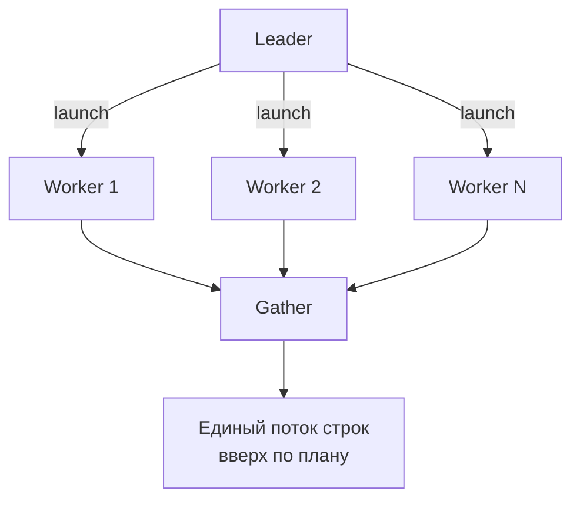
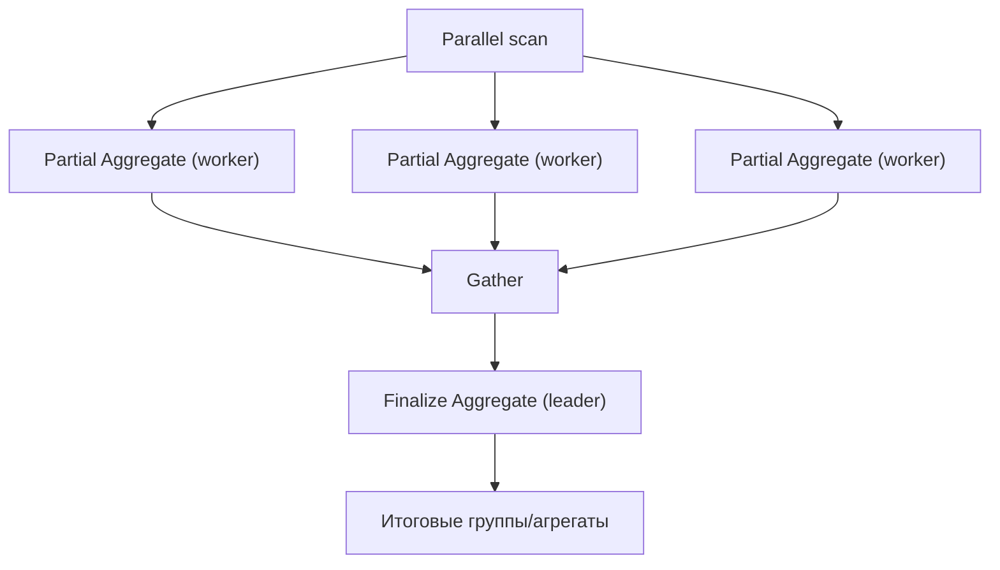

[← Назад к индексу части 7](index.md)

## 39. Параллельное выполнение и JIT

### 39.1. Gather и workers

**Цель раздела.**  
Понять узел **Gather** в плане: объединение результатов **параллельных worker-процессов**; как планировщик решает, использовать ли параллельное выполнение и сколько workers. После раздела ты будешь по плану видеть параллельный план и понимать, от чего зависит число workers.

**В этом разделе главное (три строки).** 1) **Gather** — узел плана, который **собирает** результаты от нескольких **worker-процессов**; каждый worker выполняет свою часть работы (например, свою часть блоков таблицы при Parallel Seq Scan). 2) Число workers ограничено настройками **max_parallel_workers_per_gather** (на один запрос) и **max_parallel_workers** (всего в системе); планировщик выбирает параллельный план, только если его **cost ниже** последовательного. 3) В EXPLAIN ANALYZE смотри **Workers Launched:** если 0 — workers не удалось запустить (исчерпан лимит), весь запрос выполнил один процесс.



#### Термины (расшифровка)

- **Gather** — узел плана в PostgreSQL, который **собирает** результаты от нескольких **worker-процессов**, выполняющих один и тот же подплан параллельно. Родительский процесс (leader) запускает workers, каждый worker выполняет свою часть работы (например, параллельный Seq Scan по разным блокам таблицы), затем leader **собирает** строки от workers в один поток. В плане видно: **Gather** с дочерним узлом (например, Parallel Seq Scan).
- **Worker (воркер)** — фоновый процесс, выполняющий **часть** плана запроса параллельно с другими workers и с leader. Число workers ограничено настройками **max_parallel_workers_per_gather** (сколько workers на один Gather) и **max_parallel_workers** (общий лимит параллельных workers в системе). Планировщик решает, использовать ли параллелизм, по оценке cost: параллельный план должен быть **дешевле** последовательного.
- **Parallel Seq Scan** — последовательное сканирование таблицы, разбитое между workers: каждый worker читает **свои блоки** таблицы; результаты собираются в Gather. Выгодно для **больших** таблиц, когда один полный скан дорог.

#### Теория и правила (подробно)

- **Когда планировщик выбирает параллельный план:** когда оценка cost **параллельного** варианта (с учётом накладных расходов на запуск workers и сбор результатов) **ниже** cost последовательного плана. Обычно для тяжёлых операций: большой Seq Scan, большой Hash Join, большая агрегация. Для маленьких таблиц и лёгких запросов параллелизм не выбирается — накладные расходы не окупаются.
- **Число workers:** планировщик оценивает оптимальное число workers (не больше max_parallel_workers_per_gather) и строит план с этим числом. Фактическое число workers видно в плане (Workers Planned: N) и при EXPLAIN ANALYZE (Workers Launched: N).
- **Ограничения:** не все узлы поддерживают параллелизм; например, параллельными могут быть Seq Scan, Hash Join, Aggregate. Nested Loop и некоторые другие — нет. Транзакция с изменениями данных может ограничивать параллелизм.

#### Пошагово: как работает Gather и от чего зависит число workers (с числами)

**Шаг 1. Что видно в плане.**  
Запрос с большим Seq Scan по таблице на 100 000 страниц. В плане: **Gather** (Workers Planned: 2) → **Parallel Sequential Scan** по таблице. Это значит: планировщик решил использовать **2 worker-процесса** плюс **leader** (который тоже может участвовать в скане). Каждый worker сканирует свою часть блоков таблицы (например, worker 1 — блоки 1–33333, worker 2 — 33334–66666, leader — 66667–100000). Результаты передаются в Gather, который объединяет строки в один поток для клиента.

**Шаг 2. Почему не 8 workers.**  
Число workers ограничено: **max_parallel_workers_per_gather** (по умолчанию 2) — сколько workers на **один** Gather; **max_parallel_workers** (по умолчанию 8) — сколько всего параллельных workers в **системе** (на все запросы). Планировщик ещё оценивает cost: параллельный план имеет накладные расходы (запуск процессов, передача данных). Для таблицы в 1000 страниц параллельный план может быть **дороже** последовательного — тогда в плане будет обычный Seq Scan без Gather. Для **большой** таблицы cost параллельного варианта ниже — Gather появляется в плане.

**Шаг 3. Фактическое число workers.**  
В **EXPLAIN ANALYZE** смотри **Workers Launched: N**. Оно может быть меньше Workers Planned, если во время выполнения не хватило свободных worker-процессов (исчерпан max_parallel_workers из-за других запросов). Тогда часть работы выполняет только leader — запрос может быть медленнее ожидаемого.

#### Что будет, если max_parallel_workers_per_gather = 0

Параллельные планы **не будут** выбираться для запросов — планировщик не сможет построить план с Gather. Тяжёлые полные сканы, большие Hash Join и агрегации будут выполняться **только в одном процессе** — на многоядерной машине часть ядер будет простаивать, запросы дольше. **Итог:** для нагрузок с тяжёлыми запросами по большим таблицам имеет смысл разрешить параллелизм (max_parallel_workers_per_gather ≥ 1, max_parallel_workers ≥ 1) и подстроить под число ядер.

#### Картинка в голове

**Gather** — бригадир: раздал участки работы трём рабочим (workers), каждый обработал свою часть таблицы, потом бригадир **собрал** все результаты в один отчёт и отдал заказчику. Без параллелизма один рабочий обходил бы всю таблицу сам — дольше. Число рабочих ограничено правилами (max_parallel_workers_per_gather) и общим лимитом на стройке (max_parallel_workers).

#### Простыми словами

**Gather** — «собрать ответы от нескольких рабочих». Несколько worker-процессов делают одну и ту же работу по частям (например, сканируют разные куски таблицы), а главный процесс **собирает** результаты в один поток. Планировщик выбирает параллельный план, когда это **дешевле** по cost. Число workers ограничено настройками.

#### Проверь себя (39.1)

1. Что делает узел Gather в плане?  
<details><summary>Ответ</summary> **Gather** **собирает** результаты от нескольких **worker-процессов**, выполняющих подплан параллельно. Leader запускает workers; каждый worker выполняет свою часть (например, Parallel Seq Scan по своей части таблицы); leader получает строки от workers и объединяет их в один результат для клиента.</details>

2. От чего зависит число workers в параллельном плане?  
<details><summary>Ответ</summary> Число workers ограничено настройками: **max_parallel_workers_per_gather** (максимум workers на один Gather) и **max_parallel_workers** (общий лимит в системе). Планировщик **оценивает** оптимальное число workers по cost (параллельный план должен быть дешевле последовательного) и не превышает эти лимиты. В плане видно Workers Planned; при EXPLAIN ANALYZE — Workers Launched.</details>

3. В плане Gather, но Workers Launched: 0. Что это значит?  
<details><summary>Ответ</summary> Планировщик **запланировал** параллельное выполнение (Gather в плане), но в момент выполнения **не удалось** запустить ни одного worker (например, исчерпан **max_parallel_workers** из-за других параллельных запросов). Весь подплан выполнил **leader** в одиночку — запрос мог быть медленнее, чем при реальном параллелизме. Решение: увеличить max_parallel_workers или снизить параллелизм других запросов; либо разнести тяжёлые запросы по времени.</details>

4. Почему по запросу к маленькой таблице (1000 строк) в плане нет Gather, а только Seq Scan?  
<details><summary>Ответ</summary> Планировщик выбирает **параллельный** план только если его **cost ниже** последовательного. У параллельного плана есть **накладные расходы**: запуск worker-процессов, передача данных в Gather. Для **маленькой** таблицы (мало страниц) полный скан быстрый — cost последовательного плана невелик. Cost параллельного варианта с учётом накладных может оказаться **выше** — тогда планировщик выбирает обычный Seq Scan без Gather. Параллелизм выгоден для **больших** объёмов данных, когда работа между несколькими процессами окупает накладные расходы.</details>

**Как запомнить.** Gather = собрать результаты от нескольких worker-процессов; workers выполняют подплан по частям (например, Parallel Seq Scan). Число workers ограничено max_parallel_workers_per_gather и max_parallel_workers; планировщик выбирает параллельный план, если его cost ниже последовательного.

**Три пункта, чтобы не забыть (Gather и workers).** 1) **Gather** — узел плана, который **собирает** результаты от нескольких **worker-процессов**; каждый worker выполняет свою часть работы (например, свою часть блоков таблицы). 2) Число workers ограничено **max_parallel_workers_per_gather** (на один запрос) и **max_parallel_workers** (всего в системе). 3) Параллельный план выбирается, когда его **cost** ниже последовательного; для маленьких таблиц параллелизм не выбирается — накладные расходы не окупаются.

#### Запомните

- **Gather** — узел, собирающий результаты от **параллельных workers**; workers выполняют подплан по частям.
- Число workers ограничено **max_parallel_workers_per_gather** и **max_parallel_workers**; планировщик выбирает параллельный план, если его cost ниже последовательного.

**Ещё раз самыми простыми словами:** Gather — это «собрать ответы от нескольких рабочих», которые параллельно обрабатывают части таблицы или операции. Сколько рабочих можно — задаётся настройками; планировщик пускает параллельный план только если он по оценке дешевле одного процесса. Если workers не запустились (Workers Launched: 0) — весь запрос выполнил один процесс.

**Одна фраза (если забыл всё):** Gather собирает результаты от workers; число workers ограничено max_parallel_workers_per_gather и max_parallel_workers. Параллельный план выбирается, если его cost ниже последовательного.

**Если прочитал и всё равно не понял.** Главное: **Gather** — это когда один запрос делают **не один процесс**, а **несколько** (workers), каждый свою часть (например, свои куски таблицы), а потом результаты **собирают** в один ответ. Так быстрее на больших таблицах. Сколько таких «помощников» можно — задаётся настройками (max_parallel_workers_per_gather — на один запрос, max_parallel_workers — всего в системе). Если в плане есть Gather, но **Workers Launched: 0** — помощников не хватило (лимит занят другими запросами), и весь запрос делал один процесс. Перечитай **«Картинка в голове»** (бригадир и рабочие) и **«Пошагово»** (что видно в плане, почему не 8 workers, фактическое число workers).

---

### 39.2. Параллельные операции

**Цель раздела.**  
Узнать, какие **операции** могут выполняться параллельно: **Parallel Seq Scan**, **Parallel Hash Join**, **Parallel Aggregate** и др. Понимать, когда в плане появляются параллельные узлы и как они сочетаются с Gather. После раздела ты будешь по названию узла понимать, что операция идёт параллельно.

**В этом разделе главное (три строки).** 1) **Параллельными** могут быть: **Parallel Seq Scan** (таблица сканируется по частям разными workers), **Parallel Hash Join** (построение хеша и/или проба параллельно), **Parallel Aggregate** (частичная агрегация в каждом worker, затем объединение в leader). 2) В плане параллельный узел виден по слову **«Parallel»** в названии; результаты собираются в **Gather** (и для агрегации — **Finalize Aggregate** поверх Partial Aggregate). 3) Параллелизм выбирается для **тяжёлых** запросов по большим таблицам, когда cost параллельного варианта ниже; для маленьких таблиц параллелизм не включают — накладные расходы не окупаются.

#### Термины (расшифровка)

- **Parallel Seq Scan** — полное сканирование таблицы, **разделённое** между workers: каждый worker сканирует **свою часть** блоков таблицы. Результаты передаются в Gather. В плане: **Parallel Sequential Scan** (или Parallel Seq Scan) как дочерний узел Gather.
- **Parallel Hash Join** — Hash Join, при котором построение хеша и/или проба выполняются **параллельно** (каждый worker обрабатывает свою часть данных). Результаты объединяются в Gather.
- **Parallel Aggregate** — агрегация (GROUP BY, COUNT/SUM и т.д.) выполняется **частично** в каждом worker (каждый считает свои частичные агрегаты), затем leader **объединяет** частичные результаты в итоговые. В плане может быть **Finalize Aggregate** (объединение) поверх **Partial Aggregate** (в workers).

#### Теория и правила (подробно)

- **Parallel Seq Scan:** таблица «режется» по блокам между workers; каждый читает свои блоки. Выгодно для больших таблиц без подходящего индекса или когда полный скан дешевле индексного доступа.
- **Parallel Hash Join:** одна или обе стороны разбиваются между workers; хеш строится параллельно или проба выполняется параллельно. Ограничено work_mem на worker.
- **Parallel Aggregate:** каждый worker считает агрегаты по своей части строк (Partial Aggregate); leader выполняет Finalize Aggregate (объединение частичных сумм/счётчиков). Для простых агрегатов (COUNT(*), SUM) масштабируется хорошо.

#### Пошагово: как выглядят параллельные узлы в плане (с числами)

**Шаг 1. Parallel Seq Scan.**  
Запрос: `SELECT * FROM big_table WHERE status = 1;` Таблица 50 000 страниц. В плане: **Gather** → **Parallel Sequential Scan on big_table**. Каждый из, например, 2 workers сканирует свою часть блоков (по ~25 000 страниц на процесс); leader может тоже сканировать часть. Строки с status = 1 передаются в Gather. **Actual time** на Parallel Sequential Scan может быть в 2–3 раза меньше, чем на обычном Seq Scan при том же объёме — за счёт нескольких ядер.

**Шаг 2. Parallel Hash Join.**  
Запрос с JOIN двух больших таблиц без индекса по ключу соединения. В плане: **Gather** → **Parallel Hash Join** → два дочерних **Parallel Seq Scan** (или один Parallel, один обычный). Построение хеша и проба разбиваются между workers; каждый worker обрабатывает свою часть одной таблицы и пробивает в общий или локальный хеш. Ограничение — **work_mem** действует **на каждый worker**; суммарно память может быть N × work_mem.

**Шаг 3. Partial Aggregate и Finalize Aggregate.**  
Запрос: `SELECT category_id, COUNT(*), SUM(amount) FROM orders GROUP BY category_id;` В плане под Gather: **Finalize Aggregate** → **Gather** → **Partial Aggregate** в каждом worker → сканы. Каждый worker считает **частичные** COUNT и SUM по своей части строк (Partial Aggregate); leader получает частичные результаты и **объединяет** их по group by ключу (Finalize Aggregate). Итоговые группы и суммы формируются в leader.



#### Что будет, если все запросы будут параллельными с большим числом workers

При **max_parallel_workers = 8** и **max_parallel_workers_per_gather = 4** два тяжёлых запроса могут занять 4+4 = 8 workers — другие параллельные запросы получат Workers Launched: 0 и выполнятся в одном процессе. При слишком большом max_parallel_workers (больше ядер) начнётся **конкуренция** за CPU — контекстные переключения, кэш-промахи; общая пропускная способность может **снизиться**. **Итог:** настраивать параллелизм под число ядер (например, max_parallel_workers_per_gather = 25–50% ядер) и учитывать смешанную нагрузку.

#### Картинка в голове

**Параллельные операции** — как конвейер: несколько станций (workers) одновременно обрабатывают разные куски деталей (блоки таблицы, части хеша, частичные агрегаты), а в конце сборочный пункт (Gather / Finalize Aggregate) собирает результат. В плане «Parallel» в названии узла = эта операция разбита между workers. Nested Loop параллельным не бывает — там порядок «для каждой строки снаружи — поиск внутри» неудобно резать по частям.

#### Простыми словами

**Параллельные операции** — Seq Scan, Hash Join, Aggregate и др. могут выполняться **несколькими workers** одновременно: каждый обрабатывает свою часть данных, результаты собираются в Gather. В плане видно «Parallel» в названии узла. Выгодно для тяжёлых запросов по большим таблицам.

#### Проверь себя (39.2)

1. Какие узлы в плане могут быть параллельными?  
<details><summary>Ответ</summary> В PostgreSQL параллельными могут быть, в частности: **Parallel Seq Scan** (сканирование таблицы по частям), **Parallel Hash Join** (параллельное построение хеша и/или проба), **Parallel Aggregate** (частичная агрегация в workers, финализация в leader). Также **Parallel Bitmap Heap Scan** и др. Узлы без поддержки параллелизма (например, Nested Loop, некоторые Sort) выполняются только в leader или в одном worker.</details>

2. Что такое Partial Aggregate и Finalize Aggregate?  
<details><summary>Ответ</summary> **Partial Aggregate** — агрегация выполняется **в каждом worker** по своей части строк (каждый worker считает свои частичные COUNT/SUM/AVG и т.д.). **Finalize Aggregate** — узел в **leader**, который **объединяет** частичные результаты от workers в итоговый результат (суммирует частичные суммы, объединяет группы и т.д.). Так агрегация масштабируется на несколько ядер.</details>

3. Почему Nested Loop Join обычно не параллельный?  
<details><summary>Ответ</summary> **Nested Loop** устроен как «для каждой строки внешней таблицы — поиск во внутренней». Внутренний доступ часто **зависит** от значения с внешней стороны (индекс по ключу JOIN). Разбить такую работу «по кускам» между workers сложно: каждый worker должен бы обрабатывать свой кусок внешних строк, но тогда нужна согласованность по общему индексу и данным. В PostgreSQL Nested Loop не выносится в параллельные workers; параллельными делаются операции, которые естественно режутся по блокам или по партициям данных (Seq Scan, Hash Join, Aggregate).</details>

**Как запомнить.** В плане «Parallel» в названии узла = операция разбита между workers (Parallel Seq Scan, Parallel Hash Join, Parallel Aggregate). Результаты собираются в Gather; для агрегации — Partial Aggregate в workers, Finalize Aggregate в leader. Параллельные узлы выбираются, когда cost параллельного варианта ниже.

**Три пункта, чтобы не забыть (параллельные операции).** 1) **Parallel Seq Scan**, **Parallel Hash Join**, **Parallel Aggregate** — операции, которые выполняются **несколькими workers** по частям; результаты собирает **Gather** (и **Finalize Aggregate** для агрегации). 2) В плане параллельный узел виден по слову **Parallel** в названии. 3) **Nested Loop** и некоторые другие узлы **не** параллельные — планировщик выбирает параллелизм только там, где это реализовано и выгодно по cost.

#### Запомните

- **Parallel Seq Scan**, **Parallel Hash Join**, **Parallel Aggregate** и др. — операции, разбитые между workers; результаты собираются в **Gather** (и при необходимости **Finalize Aggregate**).
- Параллельные узлы появляются в плане, когда планировщик считает параллельный вариант дешевле последовательного.

**Ещё раз самыми простыми словами:** Параллельные операции — когда несколько процессов делают одну и ту же работу по кускам (сканирование таблицы, хеш-соединение, подсчёт сумм), а результат потом собирается. В плане это видно по слову «Parallel». Так быстрее на больших объёмах; для маленьких таблиц параллелизм не включают — накладные расходы не окупаются.

**Одна фраза (если забыл всё):** Parallel Seq Scan, Parallel Hash Join, Parallel Aggregate — работа по частям между workers, результат в Gather. В плане видно «Parallel» в названии узла.

---

### 39.3. JIT

**Цель раздела.**  
Понять **JIT (Just-In-Time)** компиляцию в PostgreSQL: когда она включается, что компилируется (выражения, WHERE, агрегаты) и как это влияет на производительность тяжёлых запросов. После раздела ты будешь знать параметры **jit_above_cost** и **jit_inline_above_cost** и когда JIT даёт выигрыш.

**В этом разделе главное (три строки).** 1) **JIT** — компиляция частей запроса (выражения, условия, агрегаты) в **машинный код** во время выполнения вместо интерпретации; снижает накладные расходы на **тяжёлых** запросах с большим числом строк и сложными выражениями. 2) JIT включается, когда **total cost** плана **выше** порога **jit_above_cost** (по умолчанию 100000) и **jit = on**. 3) Для **лёгких** запросов (мало строк, простые условия) JIT не включается или не окупается — время компиляции может быть сопоставимо с временем выполнения; не снижай jit_above_cost «до нуля».

```mermaid
flowchart LR
  Q["Запрос"] --> Cost["Посчитать total cost"]
  Cost --> Gate{"cost > jit_above_cost?\njit on"}
  Gate -->|Да| Compile["JIT: компиляция выражений\n→ машинный код"]
  Gate -->|Нет| Interp["Обычное выполнение\n("интерпретация")"]
  Compile --> Run["Выполнение"]
  Interp --> Run
```

#### Термины (расшифровка)

- **JIT (Just-In-Time компиляция)** — компиляция частей запроса (выражения, предикаты WHERE, агрегатные функции) в **машинный код** во время выполнения запроса, вместо интерпретации байткода. Снижает накладные расходы на интерпретацию и может дать ускорение на **тяжёлых** запросах с большим числом обрабатываемых строк и сложными выражениями.
- **jit_above_cost** — порог **total cost** плана запроса, выше которого JIT компиляция **включается** (если JIT включён в системе: jit = on). По умолчанию 100000. Запросы с cost выше этого порога компилируются; ниже — выполняются без JIT. Увеличивая порог, отключаешь JIT для «средних» запросов; уменьшая — включаешь JIT для более лёгких запросов (часто невыгодно из-за накладных расходов на компиляцию).
- **jit_inline_above_cost** — порог cost, выше которого функции в запросе **инлайнятся** (подставляются в тело запроса) перед JIT-компиляцией. По умолчанию 500000. Инлайнинг увеличивает объём компилируемого кода, но может убрать вызовы функций и ускорить выполнение.

#### Теория и правила (подробно)

- **Когда JIT полезен:** запросы с **большим** числом обрабатываемых строк и **сложными** выражениями (много вычислений в SELECT/WHERE, агрегаты). На лёгких запросах (мало строк, простые выражения) накладные расходы на компиляцию могут **перевесить** выигрыш — JIT не включается по умолчанию для cost < jit_above_cost.
- **Включение/отключение:** параметр **jit** = on/off (по умолчанию on в PostgreSQL 11+ при наличии LLVM). Для отключения JIT глобально: jit = off. Для одного запроса: SET LOCAL jit = off;
- **В плане:** при использовании JIT в плане (EXPLAIN ANALYZE) может отображаться **JIT: ...** с временем компиляции и функциями (e.g. Inlining, Optimization, Emission).

#### Пошагово: когда JIT включается и когда даёт выигрыш (с числами)

**Шаг 1. Порог jit_above_cost.**  
По умолчанию **jit_above_cost = 100000**. Планировщик считает **total cost** плана запроса. Если total cost **> 100000** и **jit = on**, для этого запроса включается JIT-компиляция: выражения (WHERE, SELECT), агрегаты компилируются в машинный код (через LLVM). Запрос с cost = 50000 JIT **не** получит — выполнение пойдёт через интерпретацию. Запрос с cost = 200000 — получит. Время на **компиляцию** (первые миллисекунды) добавляется к первому выполнению; при одном выполнении тяжёлого запроса выигрыш от JIT может быть 10–30% и больше при миллионах строк.

**Шаг 2. Когда JIT выгоден.**  
Запрос обрабатывает **миллионы** строк и в нём **сложные** выражения: много вычислений в SELECT (формулы, вызовы функций), тяжёлые условия в WHERE, агрегаты с выражениями. Интерпретация байткода тратит время на каждую строку; скомпилированный код выполняется быстрее. Запрос на 100 строк с простым WHERE id = 5 — JIT почти не даёт выигрыша, а время компиляции может быть сравнимо с временем выполнения; такие запросы обычно имеют cost ниже jit_above_cost и JIT не включается.

**Шаг 3. Отключение JIT.**  
Для одного запроса: `SET LOCAL jit = off;` в транзакции перед запросом. Глобально: в postgresql.conf **jit = off**. Полезно для отладки (сравнить время с JIT и без) или если на сервере нет LLVM и JIT всё равно недоступен.

#### Что будет, если поставить jit_above_cost очень маленьким (например, 100)

JIT будет включаться для **почти всех** запросов, включая лёгкие (мало строк, простые выражения). Время на компиляцию (несколько миллисекунд) будет тратиться на каждый такой запрос — при тысячах коротких запросов в секунду накладные расходы на JIT могут **перевесить** выигрыш и **ухудшить** общую производительность. **Итог:** jit_above_cost оставлять таким, чтобы JIT включался только для **тяжёлых** запросов (по умолчанию 100000 разумно).

#### Картинка в голове

**JIT** — как перевести инструкцию «как готовить блюдо» с общего языка (интерпретация) на родной язык повара (машинный код): один раз потратил время на перевод, зато каждый раз готовить быстрее. Если блюдо готовишь один раз и оно простое — перевод не окупается. Если готовишь тысячу порций по сложному рецепту — перевод окупается. Порог jit_above_cost — «если рецепт сложнее этой границы — переводим».

#### Простыми словами

**JIT** — «перевести части запроса в машинный код на лету», чтобы не интерпретировать их построчно. Выгодно для **тяжёлых** запросов (много строк, сложные формулы). Для лёгких запросов компиляция не окупается. Порог задаётся **jit_above_cost**: запросы с cost выше порога компилируются.

#### Проверь себя (39.3)

1. Когда JIT компиляция включается в PostgreSQL?  
<details><summary>Ответ</summary> JIT включается, когда **jit = on** (по умолчанию при наличии LLVM) и **total cost** плана запроса **выше** порога **jit_above_cost** (по умолчанию 100000). Для запросов с cost ниже порога JIT не используется — выполнение идёт без компиляции. Таким образом, JIT применяется к «тяжёлым» запросам, где выигрыш от компиляции перевешивает накладные расходы.</details>

2. Для каких запросов JIT обычно даёт выигрыш, а для каких — нет?  
<details><summary>Ответ</summary> **Выигрыш** — запросы с **большим** числом обрабатываемых строк и **сложными** выражениями (много вычислений в SELECT/WHERE, агрегаты). Интерпретация байткода даёт накладные расходы на каждую строку; JIT компилирует код один раз и выполняет быстрее. **Нет выигрыша** (или даже проигрыш) — **лёгкие** запросы (мало строк, простые выражения): время компиляции может быть сопоставимо с временем выполнения; cost таких запросов обычно ниже jit_above_cost, и JIT для них не включается.</details>

3. В плане внизу есть строка JIT: Inlining 12 ms, Optimization 8 ms. Что это?  
<details><summary>Ответ</summary> Это **время**, потраченное на JIT-компиляцию частей запроса: **Inlining** — подстановка тел функций в код запроса; **Optimization** — оптимизация сгенерированного машинного кода. Эти миллисекунды добавляются к **первому** выполнению запроса (или к каждому, если план не кэшируется). Для тяжёлого запроса, выполняющегося секунды, 20 ms на JIT — мелочь; для запроса в 5 ms — компиляция может «съесть» заметную долю времени.</details>

**Как запомнить.** JIT = компиляция частей запроса в машинный код на лету; включается при **total cost > jit_above_cost** (по умолчанию 100000). Выгоден для тяжёлых запросов (много строк, сложные выражения); для лёгких не включается или не окупается.

**Три пункта, чтобы не забыть (JIT).** 1) **JIT** — Just-In-Time компиляция выражений и частей запроса в машинный код; снижает накладные расходы интерпретации на **тяжёлых** запросах. 2) Включается при **jit = on** и **cost плана > jit_above_cost** (по умолчанию 100000). 3) Для **лёгких** запросов (мало строк, простые условия) JIT не включается или время компиляции не окупается — не снижай jit_above_cost «до нуля».

#### Запомните

- **JIT** — компиляция частей запроса в машинный код; включается при cost плана выше **jit_above_cost** (если jit = on).
- JIT выгоден для **тяжёлых** запросов с большим числом строк и сложными выражениями; для лёгких запросов не включается или не окупается.

**Ещё раз самыми простыми словами:** JIT — когда база «переводит» части запроса в машинный код, чтобы выполнять их быстрее. Это делается только для достаточно тяжёлых запросов (порог jit_above_cost). Для простых и коротких запросов JIT не включают — компиляция заняла бы больше времени, чем выигрыш.

**Одна фраза (если забыл всё):** JIT включается при cost плана выше jit_above_cost; выгоден для тяжёлых запросов с большим числом строк и сложными выражениями. Для лёгких запросов не включается.

---

### 39.4. Subplan и Initplan

**Цель раздела.**  
Закрепить различие **SubPlan** и **InitPlan** в плане: InitPlan выполняется **один раз**, SubPlan — **для каждой строки** (или группы) внешнего запроса. Понимать, почему SubPlan при большом числе строк — узкое место и как переписать запрос (JOIN, IN с некоррелированным подзапросом). После раздела ты будешь по плану сразу видеть «один раз» vs «на каждую строку».

**В этом разделе главное (три строки).** 1) В плане **InitPlan** = подзапрос выполнился **один раз**, результат подставили; **SubPlan** = подзапрос выполняется **на каждую строку** (смотри в EXPLAIN ANALYZE поле **loops** — сколько раз выполнился). 2) **SubPlan с большим loops** (тысячи и больше) — типичная причина медленного запроса; это **коррелированный** подзапрос (зависит от строки внешней таблицы). 3) **Решение:** переписать запрос так, чтобы подзапрос **не зависел** от строки внешней таблицы — **JOIN** или **IN (некоррелированный подзапрос)**; тогда будет один проход вместо N выполнений.

#### Термины (расшифровка)

- **InitPlan** — подплан, выполняемый **один раз** до основного запроса. Результат (скаляр или набор значений) кэшируется и подставляется в основной план. В плане отображается как **InitPlan 1 (returns ...)**. Типично для **некоррелированного** подзапроса в WHERE или в SELECT (например, `WHERE col = (SELECT ... LIMIT 1)` без ссылок на внешнюю таблицу).
- **SubPlan** — подплан, выполняемый **для каждой строки** (или для каждой группы) внешнего запроса. Типично для **коррелированного** подзапроса (подзапрос ссылается на столбец внешней таблицы). В плане — **SubPlan 1**; при большом числе строк снаружи выполняется много раз — возможное узкое место.
- **Коррелированный подзапрос** — подзапрос, в котором есть ссылка на столбец **внешней** таблицы (например, `WHERE EXISTS (SELECT 1 FROM orders o WHERE o.user_id = users.id)`). Для каждой строки users подзапрос выполняется заново с текущим users.id.

#### Теория и правила (подробно)

- **Как отличить в плане:** InitPlan перечисляется в начале плана (выполняется один раз). SubPlan вложен в узел (например, Nested Loop) и выполняется при каждой итерации. В EXPLAIN ANALYZE у SubPlan будет **loops = N**, где N — число итераций (часто равно числу строк внешней таблицы).
- **Оптимизация:** коррелированный подзапрос (SubPlan) часто переписывают в **JOIN** или в **IN (подзапрос)** с некоррелированным подзапросом, чтобы планировщик мог применить один проход (Hash Join, semi-join) вместо N выполнений подзапроса.
- **Materialize:** планировщик может **материализовать** подзапрос (выполнить один раз и читать как таблицу); тогда в плане будет узел **Materialize** и подзапрос не будет SubPlan с большим числом loops.

#### Пошагово: как по плану отличить InitPlan от SubPlan (с числами)

**Шаг 1. Где в плане InitPlan.**  
**InitPlan** перечисляются **в начале** плана (или в блоке «InitPlan»), до основного дерева. Пример: `InitPlan 1 (returns $0) ... SubPlan 1 ...` — значение $0 вычисляется один раз и подставляется. В **EXPLAIN ANALYZE** у InitPlan будет **loops = 1** (или не показывается отдельно по числу выполнений) — выполнился один раз. Ищи в тексте плана «InitPlan» и «returns» — это скаляр или набор, подставленный в основной план.

**Шаг 2. Где в плане SubPlan и loops.**  
**SubPlan** вложен **внутри** узла (часто Nested Loop или подобного). В **EXPLAIN ANALYZE** у узла, содержащего SubPlan, смотри **loops = N**. Если N = 10000 — подзапрос выполнился **10 000 раз**. Это признак **коррелированного** подзапроса: для каждой из 10 000 строк внешней таблицы подзапрос выполнялся заново. Такое число loops — главный индикатор узкого места.

**Шаг 3. Что делать при большом loops у SubPlan.**  
Переписать запрос так, чтобы подзапрос **не зависел** от строки внешней таблицы. Пример: вместо `SELECT * FROM users u WHERE EXISTS (SELECT 1 FROM orders o WHERE o.user_id = u.id)` написать `SELECT u.* FROM users u WHERE u.id IN (SELECT user_id FROM orders)` — подзапрос один раз вернёт список user_id, и проверка «u.id IN (...)» делается одним проходом (Hash Join или semi-join). В плане тогда будет Join, а не SubPlan с 10 000 loops.

#### Что будет, если не обращать внимание на SubPlan с большим loops

Запрос будет выполняться минуты при большом числе строк: каждый loop — обращение к индексу или скан. Нагрузка на БД возрастёт (много коротких подзапросов), другие запросы могут ждать. **Итог:** при разборе медленного запроса **всегда** смотреть в плане на **SubPlan** и **loops**; если loops = тысячи и больше — первая кандидатура на переписывание в JOIN или IN с некоррелированным подзапросом.

#### Картинка в голове

**InitPlan** — один раз позвонил, узнал ответ, записал на бумажку; дальше для каждой строки только смотришь на бумажку. **SubPlan** — для **каждого** человека из списка звонишь и спрашиваешь отдельно (10 000 человек = 10 000 звонков). В плане «loops = 10000» у SubPlan = «звонков было 10 000». Чтобы ускорить — сделать один общий запрос (одна «рассылка» или один JOIN) вместо 10 000 звонков.

#### Простыми словами

**InitPlan** — подзапрос выполнился **один раз**, результат подставили. **SubPlan** — подзапрос выполняется **на каждую строку** внешнего запроса (коррелированный). В плане у SubPlan будет много **loops** — столько раз он и выполнился. Если loops большое — это узкое место; переписать в JOIN или IN с некоррелированным подзапросом.

#### Проверь себя (39.4)

1. В плане SubPlan 1 с loops=10000. Что это значит и что делать?  
<details><summary>Ответ</summary> Это значит, что подзапрос (SubPlan 1) выполнился **10 000 раз** — по разу на каждую строку (или группу) внешнего запроса. Это **коррелированный** подзапрос. При 10 000 итерациях он может быть основным узким местом. **Что делать:** переписать запрос так, чтобы подзапрос выполнялся **один раз** или чтобы вместо него использовалось **соединение** (JOIN или semi-join). Например, заменить `WHERE EXISTS (SELECT 1 FROM ... WHERE ... = outer.col)` на JOIN с подзапросом или на IN с некоррелированным подзапросом, который планировщик развернёт в один проход.</details>

2. Как в плане отличить InitPlan от SubPlan по месту в выводе?  
<details><summary>Ответ</summary> **InitPlan** обычно перечисляется **отдельно в начале** плана (блок InitPlan или в верхней части дерева) с пометкой «returns» — результат подставляется в основной план. **SubPlan** находится **внутри** узла (например, внутри Nested Loop) как дочерний узел; в EXPLAIN ANALYZE у него будет **loops = N** — число выполнений. Большое N (тысячи) — SubPlan, выполняющийся на каждую строку.</details>

3. Запрос переписан с EXISTS (подзапрос с ссылкой на внешнюю таблицу) на IN (подзапрос без ссылки). В новом плане SubPlan нет, есть Hash Join. Почему быстрее?  
<details><summary>Ответ</summary> **EXISTS** с коррелированным подзапросом — SubPlan выполняется **на каждую строку** внешней таблицы (N раз). **IN** с **некоррелированным** подзапросом — подзапрос выполняется **один раз**, результат (список значений) используется для проверки вхождения; планировщик строит **Hash Join** (или semi-join): один проход по данным вместо N выполнений подзапроса. Меньше итераций — меньше время и нагрузка.</details>

**Как запомнить.** InitPlan = один раз (в плане в начале, returns); SubPlan = на каждую строку (вложен в узел, loops = N). SubPlan с большим loops — узкое место; переписать в JOIN или IN с некоррелированным подзапросом.

**Три пункта, чтобы не забыть (Subplan и Initplan).** 1) **InitPlan** выполняется **один раз**, результат подставляется (в плане — в начале, «returns»). **SubPlan** выполняется **на каждую строку** (в плане — внутри узла, **loops = N**). 2) **SubPlan с большим loops** (тысячи) — типичное узкое место; запрос тормозит из-за многократного выполнения подзапроса. 3) **Решение:** переписать коррелированный подзапрос в **JOIN** или **IN (некоррелированный подзапрос)** — тогда один проход вместо N выполнений.

#### Запомните

- **InitPlan** — один раз; **SubPlan** — на каждую строку (коррелированный). В плане SubPlan с большим **loops** — узкое место.
- Решение: переписать коррелированный подзапрос в **JOIN** или **IN** с некоррелированным подзапросом.

**Ещё раз самыми простыми словами:** InitPlan — подзапрос выполнился один раз, результат подставили. SubPlan — подзапрос крутится на каждую строку (коррелированный); в плане смотри loops — если там тысячи, это и есть причина тормозов. Переделай запрос в JOIN или IN так, чтобы подзапрос не зависел от строки внешней таблицы — тогда будет один проход вместо тысяч выполнений.

**Одна фраза (если забыл всё):** В плане InitPlan = один раз, SubPlan = на каждую строку (loops = N). Большой loops у SubPlan — переписать в JOIN или IN с некоррелированным подзапросом.

**Если прочитал и всё равно не понял.** Суть в одном: в плане смотри на **loops** у подзапроса. Если там **тысячи** — подзапрос выполнился тысячи раз (по разу на каждую строку снаружи), это и есть причина тормозов. Что делать: переписать запрос так, чтобы **не было** подзапроса, зависящего от строки внешней таблицы — заменить на **JOIN** или на **IN (подзапрос без ссылки на внешнюю таблицу)**. Перечитай блоки **«Пошагово: как по плану отличить InitPlan от SubPlan»**, **«Картинка в голове»** и **«Ещё раз самыми простыми словами»** — там та же мысль.

---

---

<!-- prev-next-nav -->
*[← 38. Cost-based оптимизатор](03_38_cost_based_optimizator.md) | [→ 40. Антипаттерны запросов](05_40_antipatterny_zaprosov.md)*
