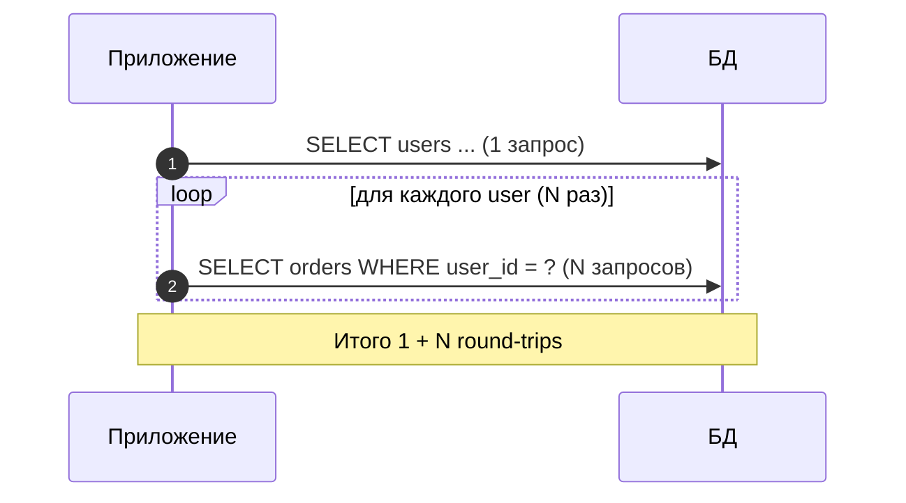
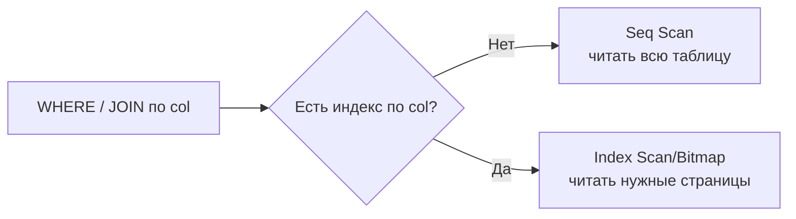

[← Назад к индексу части 7](index.md)

## 40. Антипаттерны запросов

### 40.1. N+1

**Цель раздела.**  
Понять антипаттерн **N+1**: один запрос за «родителями» и **N запросов** в цикле за «детьми» (или наоборот). Почему это медленно и как исправить: **один запрос с JOIN** или **один запрос с IN** и сборка в приложении. После раздела ты будешь распознавать N+1 в коде и в логах и заменять на batch-запрос.

**В этом разделе главное (три строки).** 1) **N+1** — это когда делаешь **один** запрос (например, список из 100 пользователей), а потом в **цикле** по каждому пользователю ещё **один запрос** (например, его заказы): итого 1 + 100 = **101 запрос** к БД вместо одного или двух. 2) Это **медленно**, потому что каждый запрос — это round-trip (сеть, парсинг, планирование); при тысячах записей получаются тысячи запросов и секунды задержки. 3) **Исправление:** один запрос с **JOIN** (все данные сразу) или один запрос за родителями + один запрос «все дочерние по списку id» (**IN**) и собрать в приложении по родителю; в ORM — **eager loading** (prefetch, include).



#### Термины (расшифровка)

- **N+1** — антипаттерн доступа к данным: выполняется **1 запрос** (например, список пользователей) и затем **N запросов** в цикле по каждому пользователю (например, заказы каждого пользователя). Итого **1 + N** запросов к БД вместо **одного** запроса с JOIN или с IN. При большом N число обращений к БД и задержка сети растут — запросы становятся очень медленными.
- **Eager loading (жадная загрузка)** — подход, при котором связанные данные загружаются **одним** (или немногими) запросом: JOIN или отдельный запрос с IN (список id) и сборка в приложении. Противоположность N+1.
- **Решение в SQL:** один запрос с **JOIN** (SELECT users.*, orders.* FROM users JOIN orders ON orders.user_id = users.id WHERE users.id IN (...)) или два запроса: один — список пользователей, второй — все заказы с user_id IN (id1, id2, ...) и сборка по user_id в приложении.

#### Теория и правила (подробно)

- **Почему медленно:** каждый запрос к БД — это round-trip (сеть + парсинг + планирование + выполнение). При N+1 round-trips = 1 + N; при N = 1000 это 1001 обращение. Даже при 1 ms на запрос — уже больше секунды только на сеть. Один запрос с JOIN или с IN — 1–2 round-trip и один раз планирование.
- **Как распознать:** в логах или в pg_stat_activity видно **много одинаковых** запросов с разными параметрами (например, SELECT * FROM orders WHERE user_id = $1) подряд; в коде — цикл по коллекции с запросом внутри цикла.
- **ORM:** многие ORM по умолчанию делают «ленивую» загрузку связей (при обращении к user.orders выполняется запрос). Нужно явно использовать **eager load** (JOIN или отдельный batch-запрос) при загрузке списка с связями.

#### Типичная ошибка

Думать, что «у меня всего 50 записей, N+1 не страшно». При 50 записях 51 запрос — может, 100–200 ms; но код **масштабируется**: завтра станет 500 записей — 501 запрос, страница начнёт «подвисать»; при 5000 — десятки секунд. Привычка писать запрос **внутри цикла** по коллекции из БД приводит к N+1 при любом росте данных. Лучше сразу делать один запрос с JOIN или batch IN — и при 50, и при 5000 записей будет 1–2 запроса. В ORM по умолчанию часто «ленивая» загрузка: обращение к связи (user.orders) дергает запрос — при выводе списка пользователей с заказами в цикле получается N+1; нужно явно указать **eager loading** (prefetch_related, include и т.п.) при загрузке списка.

#### Пошагово: как выглядит N+1 и почему это медленно (с числами)

**Шаг 1. Как выглядит N+1 в коде.**  
Приложение загружает **список пользователей** (1000 записей) одним запросом: `SELECT * FROM users WHERE region = 'EU';` — **1 запрос**. Затем в **цикле** по каждому пользователю загружаются его заказы: для user_id=1 выполняется `SELECT * FROM orders WHERE user_id = 1;`, для user_id=2 — `SELECT * FROM orders WHERE user_id = 2;`, … для user_id=1000 — `SELECT * FROM orders WHERE user_id = 1000;`. **Итого:** 1 запрос за пользователями + **1000 запросов** за заказами = **1001 запрос** к БД. Это и есть **N+1**: один запрос за «родителями» и **N запросов** в цикле за «детьми».

**Шаг 2. Почему это медленно.**  
Каждый запрос к БД — это **round-trip**: приложение отправляет запрос по сети, СУБД парсит, планирует, выполняет и возвращает результат. Даже если один запрос выполняется за **1 ms**, 1001 запрос — это **1001 ms ≈ 1 секунда** только на сеть и накладные расходы. При задержке сети 5 ms — уже **5 секунд**. При 10 000 пользователей — **10 001 запрос** — десятки секунд. **Один** запрос с JOIN (`SELECT u.*, o.* FROM users u LEFT JOIN orders o ON o.user_id = u.id WHERE u.region = 'EU'`) или **два** запроса (один — пользователи, второй — все заказы с `WHERE user_id IN (1,2,...,1000)`) дают **1–2 round-trip** и один раз планирование — время в разы меньше.

**Шаг 3. Как распознать в логах.**  
В логе запросов или в **pg_stat_activity** видно подряд **много одинаковых** запросов с разными параметрами: `SELECT * FROM orders WHERE user_id = $1` с параметром 1, затем 2, затем 3, … — сотни или тысячи раз. Это типичный признак N+1. В коде ищи **цикл** по коллекции (users), внутри которого выполняется запрос к БД (orders по user_id).

#### Что будет, если не исправить N+1

При росте числа «родителей» (пользователей, категорий, статей) число запросов растёт **линейно**: 100 пользователей — 101 запрос, 10 000 пользователей — 10 001 запрос. Время ответа страницы и нагрузка на БД растут. При 10 000 пользователей и 5 ms на запрос — **50 секунд** только на запросы к БД; страница будет «висеть», пользователи уйдут. БД будет обрабатывать **тысячи** мелких запросов в секунду вместо **десятков** крупных — соединения, парсинг, планирование съедают ресурсы. **Итог:** N+1 нужно исправлять **обязательно** при загрузке списков с связями — один запрос с JOIN или batch с IN.

#### Простыми словами

**N+1** — «сначала взял список (1 запрос), потом для **каждого** элемента списка по одному запросу (N запросов)». Вместо одного запроса с JOIN или с IN получается **1 + N запросов** к БД. При большом N это **очень медленно** (тысячи round-trips, секунды задержки). **Исправление:** один запрос с **JOIN** (все данные сразу) или один запрос за родителями + один запрос «все дочерние по списку id» (**IN**) и собрать в приложении по родителю.

#### Проверь себя (40.1)

1. Что такое N+1 и почему это плохо?  
<details><summary>Ответ</summary> **N+1** — это выполнение **одного** запроса (например, список из N записей) и затем **N запросов** в цикле по каждой записи (например, связанные данные). Итого **1 + N** запросов к БД. Плохо из-за **числа round-trips**: каждый запрос — задержка сети, парсинг, планирование. При N = 1000 это 1001 обращение; один запрос с JOIN или IN сделал бы то же за 1–2 обращения. Запросы становятся очень медленными и нагружают БД.</details>

2. Как исправить N+1 в коде?  
<details><summary>Ответ</summary> **Вариант 1:** один запрос с **JOIN** — получить родителей и детей одним запросом и сгруппировать в приложении по родителю. **Вариант 2:** один запрос за родителями; второй запрос — за **всеми** детьми с условием parent_id IN (id1, id2, ...); собрать в приложении по parent_id. В ORM использовать **eager loading** (include/join/prefetch), чтобы связанные данные подгружались одним или двумя запросами, а не в цикле.</details>

3. В логе видно 500 одинаковых запросов SELECT * FROM orders WHERE user_id = $1 с разными параметрами. Что это и что делать?  
<details><summary>Ответ</summary> Это типичный признак **N+1**: приложение загрузило список (например, 500 пользователей) одним запросом, а затем в **цикле** по каждому пользователю выполняет запрос за его заказами — 500 запросов к БД. **Что делать:** заменить на один запрос с **JOIN** (SELECT users.*, orders.* FROM users JOIN orders ON orders.user_id = users.id WHERE ...) или на два запроса: один — пользователи, второй — все заказы с **user_id IN (id1, id2, ..., id500)** и собрать в приложении по user_id. В ORM включить **eager loading** (prefetch_related, include и т.п.) для связи users → orders.</details>

4. Почему один запрос с JOIN (все заказы и пользователи сразу) быстрее, чем 1 запрос за пользователями + 500 запросов за заказами, если данные те же?  
<details><summary>Ответ</summary> Каждый запрос к БД — это **round-trip**: сеть, парсинг, планирование, выполнение, ответ. При 501 запросе таких round-trip’ов **501**; при одном JOIN — **1**. Даже если один запрос выполняется за 2 ms, 501 × 2 ms ≈ **1 секунда** только на накладные расходы. Плюс планировщик один раз строит план для JOIN и один раз читает данные; при 500 отдельных запросах он 500 раз планирует и 500 раз обращается к индексу/таблице. Один запрос с JOIN или с IN по списку id даёт **меньше обращений к БД** и **меньше работы планировщика** — поэтому быстрее при тех же данных.</details>

**Три пункта, чтобы не забыть (N+1).** 1) **N+1** — один запрос за списком «родителей» + **N запросов** в цикле за «детьми» (связанными данными); при N=1000 это **1001 запрос** к БД — очень медленно. 2) **Исправление:** один запрос с **JOIN** (все данные сразу) или один запрос за родителями + один запрос за **всеми** детьми с **IN (id1, id2, ...)** и сборка в приложении. 3) В ORM использовать **eager loading** (prefetch, include), чтобы связанные данные подгружались одним или двумя запросами, а не в цикле.

#### Как запомнить

**N+1** = 1 запрос + N запросов в цикле; при большом N — тысячи round-trips, страница «висит». Исправление: **JOIN** или **batch IN** + сборка в приложении; в ORM — eager load.

#### Запомните

- **N+1** — один запрос + N запросов в цикле; при большом N очень медленно. Исправление: **один запрос с JOIN** или **batch с IN** и сборка в приложении.

**Ещё раз самыми простыми словами:** N+1 — когда «взял список людей, а потом для каждого человека по одному разу сходил в базу за его заказами». Вместо тысячи походов — один поход: либо одним запросом с JOIN забрать всех и заказы сразу, либо одним запросом забрать все заказы по списку id и разложить по людям в приложении. В коде не делай запрос к БД **внутри цикла** по коллекции — вынеси в один или два запроса снаружи.

**Одна фраза (если забыл всё):** N+1 = один запрос за списком + N запросов в цикле за каждым элементом. Исправление: один запрос с JOIN или один запрос с IN (список id) и сборка в приложении; в ORM — eager loading.

**Если прочитал и всё равно не понял.** Суть в одном: **N+1** — это когда ты **один раз** запросил список (например, 100 пользователей), а потом в **цикле** для каждого пользователя делаешь ещё один запрос (его заказы). Получается 1 + 100 = **101 запрос** к базе вместо одного или двух. Каждый запрос — это поход в базу (сеть, планирование); 101 поход медленнее, чем 1–2. **Исправление:** либо **один** запрос с JOIN (забрать пользователей и заказы сразу и в приложении разложить по пользователям), либо один запрос за пользователями и **один** запрос «все заказы, где user_id IN (id1, id2, …, id100)» — потом в приложении собрать по user_id. В коде **не делай запрос к БД внутри цикла** по списку — вынеси запросы наружу. Перечитай **«Пошагово: как выглядит N+1»** (с числами 1000 запросов) и **«Картинка в голове»** (тысяча походов vs один поход).

---

### 40.2. Отсутствие индексов

**Цель раздела.**  
Закрепить: условие в **WHERE** или ключ **JOIN** по столбцу **без индекса** ведёт к **полному сканированию** таблицы (Seq Scan). На больших таблицах это основная причина медленных запросов. После раздела ты будешь проверять планы на Seq Scan по большим таблицам и добавлять индексы под реальные условия.

**В этом разделе главное (три строки).** 1) Если в **WHERE** или в ключе **JOIN** участвует столбец, по которому **нет индекса**, планировщик вынужден выбирать **Seq Scan** — чтение **всей таблицы** подряд; на больших таблицах это **медленно** (миллионы строк, секунды). 2) **Признак в плане:** Seq Scan по большой таблице с **Filter** по столбцу (или Join Cond по столбцу) — кандидат на создание индекса по этому столбцу. 3) **Решение:** **CREATE INDEX** по столбцу (на живой таблице — **CREATE INDEX CONCURRENTLY**), затем **ANALYZE таблица;** чтобы планировщик начал использовать новый индекс.



#### Термины (расшифровка)

- **Отсутствие индекса (missing index)** — столбец участвует в WHERE, ORDER BY, GROUP BY или в ключе JOIN, но по нему **нет индекса**. Планировщик вынужден выбирать **Seq Scan** по таблице (или по одной из сторон JOIN). На больших таблицах cost Seq Scan высокий — запрос медленный.
- **Проверка:** в плане (EXPLAIN ANALYZE) смотреть на узлы **Seq Scan** по **большим** таблицам (много rows). Если условие по столбцу есть (Filter или Join Cond), но индекс не используется — кандидат на создание индекса по этому столбцу (или составного индекса с этим столбцом в левом префиксе).

#### Теория и правила (подробно)

- **Когда добавлять индекс:** столбец часто участвует в WHERE (равенство, диапазон), в ORDER BY, в GROUP BY или в ключе JOIN; таблица **не маленькая** (иначе Seq Scan может быть дешевле индекса). После создания индекса выполнить **ANALYZE** таблицы.
- **Компромисс:** индексы ускоряют чтение, но замедляют INSERT/UPDATE/DELETE (обновление индексов). На таблицах с частой записью не индексировать «всё подряд» — только под реальные запросы (см. Часть VI).

#### Пошагово: как обнаружить отсутствие индекса и что сделать (с числами)

**Шаг 1. Признак в плане.**  
Запрос: `SELECT * FROM orders WHERE user_id = 5;`. В плане (EXPLAIN ANALYZE) видишь: **Seq Scan on orders** с **Filter: (user_id = 5)**. Условие по **user_id** есть, но **индекс не используется** — планировщик выбрал **полное сканирование** таблицы. Узел показывает **actual rows=1** (или 10, 100 — мало строк по факту), но **прочитана вся таблица** (actual time большое, в BUFFERS — shared read на всю таблицу). Таблица orders, допустим, **1 млн строк**, 40 000 страниц — прочитано **40 000 страниц** вместо 3–4 страниц индекса + 1–2 страниц таблицы при Index Scan. **Вывод:** по столбцу **user_id** нет подходящего индекса (или он не выбран из-за устаревшей статистики / несоответствия типов).

**Шаг 2. Что сделать.**  
Создать индекс: `CREATE INDEX idx_orders_user_id ON orders (user_id);` — B-tree по умолчанию, подходит для равенства и диапазонов. Затем **обновить статистику**: `ANALYZE orders;` — чтобы планировщик знал о новом индексе и мог корректно сравнивать cost Seq Scan и Index Scan. Повторить запрос с EXPLAIN ANALYZE — планировщик должен выбрать **Index Scan using idx_orders_user_id**; actual time и число прочитанных страниц (BUFFERS) должны **сильно уменьшиться**.

**Шаг 3. На живой таблице.**  
Если таблица под нагрузкой, создавать индекс лучше **без блокировки записи**: `CREATE INDEX CONCURRENTLY idx_orders_user_id ON orders (user_id);` — дольше, но INSERT/UPDATE/DELETE не блокируются на время создания индекса.

#### Типичная ошибка

Думать, что «на каждое условие в WHERE нужен индекс». На **маленьких** таблицах (несколько тысяч строк, десятки страниц) **Seq Scan** часто **дешевле** Index Scan — планировщик сам выберет полный скан. Индексы нужны под **реальные** запросы по **большим** таблицам и под ключи JOIN; не создавай индексы «на все столбцы подряд» — они замедляют запись (INSERT/UPDATE/DELETE). Сначала смотри план: Seq Scan по **большой** таблице с Filter по столбцу — тогда кандидат на индекс.

#### Что будет, если не добавить индекс по столбцу в WHERE/JOIN

Планировщик будет вынужден выбирать **Seq Scan** по таблице (или по одной из сторон JOIN). На **маленькой** таблице (несколько страниц) это приемлемо. На **большой** таблице (десятки тысяч страниц, миллионы строк) каждый такой запрос будет читать **всю таблицу** — время ответа секунды, нагрузка на диск высокая. При **частых** запросах по этому условию (user_id = ?, status = ?) десятки запросов в секунду превратятся в постоянное полное сканирование — БД «задыхается». **Итог:** для условий в WHERE, ORDER BY, GROUP BY и ключей JOIN на **больших** таблицах **нужны индексы**; без них запросы медленные и нагрузка на I/O высокая.

#### Простыми словами

**Отсутствие индекса** по столбцу в WHERE/JOIN — планировщик делает **полный скан** таблицы (Seq Scan): читает **все** страницы подряд. На больших таблицах это **медленно** (миллионы строк, гигабайты). Решение: создать индекс по этому столбцу (или по левому префиксу составного условия), затем **ANALYZE**. На живой таблице — **CREATE INDEX CONCURRENTLY**, чтобы не блокировать запись.

#### Картинка в голове

**Без индекса** — как искать человека в городе **без телефонной книги**: обходишь **все дома подряд** и спрашиваешь «здесь живёт Иванов?». **С индексом** — открыл книгу по фамилии, нашёл адрес, пришёл в один дом. На большом городе (большая таблица) обход всех домов (Seq Scan) — часы; по книге (Index Scan) — минуты.

#### Как запомнить

Условие WHERE/JOIN по столбцу **без индекса** → **Seq Scan** по таблице. На **больших** таблицах — медленно. Решение: **CREATE INDEX** по столбцу (или CONCURRENTLY на живой таблице) + **ANALYZE**.

#### Проверь себя (40.2)

1. В плане Seq Scan по таблице на 10 млн строк с Filter: user_id = 5. Что делать?  
<details><summary>Ответ</summary> Условие по **user_id**, но индекс по user_id **не используется** (или отсутствует) — полный скан 10 млн строк. **Действие:** создать индекс по user_id: CREATE INDEX idx_таблица_user_id ON таблица (user_id); затем ANALYZE таблица; Повторить запрос — планировщик должен выбрать Index Scan по новому индексу (если селективность достаточна).</details>

2. Почему после CREATE INDEX нужно делать ANALYZE?  
<details><summary>Ответ</summary> При создании индекса СУБД **перебирает таблицу** и строит индекс, но **статистику по таблице** (число строк, распределение по другим столбцам) при этом **не обновляет** автоматически. Планировщик сравнивает cost Seq Scan и Index Scan по **статистике**. Если статистика устарела (мало строк в таблице по старой статистике), он может **не выбрать** новый индекс. **ANALYZE** обновляет статистику по таблице — после него планировщик корректно сравнивает cost и чаще выбирает Index Scan по новому индексу там, где он выгоден.</details>

3. В плане Join по двум большим таблицам — Seq Scan по обеим с условием по столбцу. Что проверить в первую очередь?  
<details><summary>Ответ</summary> Проверить, есть ли **индексы по столбцам**, по которым идёт условие JOIN или фильтр (ON ... / WHERE ...). Если индексов нет — планировщик вынужден делать Seq Scan по обеим таблицам. **Действие:** создать индексы по этим столбцам (или по левому префиксу составного ключа JOIN), затем **ANALYZE** обеих таблиц. После этого планировщик может выбрать Index Scan или другой способ доступа и запрос ускорится.</details>

**Три пункта, чтобы не забыть (отсутствие индексов).** 1) Условие в WHERE/JOIN по столбцу **без индекса** → планировщик вынужден выбирать **Seq Scan** (полное сканирование таблицы). На **больших** таблицах — очень медленно. 2) **Решение:** **CREATE INDEX** по этому столбцу (или составной с этим столбцом в левом префиксе); на живой таблице — **CREATE INDEX CONCURRENTLY**. После создания индекса — **ANALYZE таблица;** 3) Индексы ускоряют **чтение**, но замедляют **запись** (INSERT/UPDATE/DELETE) — создавай индексы под **реальные** запросы, не «всё подряд».

#### Запомните

- Условие WHERE/JOIN по столбцу **без индекса** → Seq Scan по таблице; на больших таблицах — медленно. Решение: индекс по столбцу + ANALYZE.

**Ещё раз самыми простыми словами:** Нет индекса по столбцу, по которому ищешь (WHERE, JOIN) — база читает **всю таблицу** подряд. На большой таблице это долго. Сделай индекс по этому столбцу и выполни ANALYZE — запросы по этому условию станут быстрее. На таблице с активной записью создавай индекс через CREATE INDEX CONCURRENTLY.

**Одна фраза (если забыл всё):** WHERE/JOIN по столбцу без индекса → Seq Scan по всей таблице. Решение: CREATE INDEX по столбцу (на живой таблице — CONCURRENTLY) и ANALYZE.

---

### 40.3. SELECT * и большие IN

**Цель раздела.**  
Понять антипаттерны **SELECT *** (лишние столбцы, невозможность index-only scan) и **слишком большие IN-списки** (неэффективный план, ограничения размера). После раздела ты будешь выбирать только нужные столбцы и ограничивать/батчить IN.

**В этом разделе главное (три строки).** 1) **SELECT *** — тянем **все** столбцы; лишние данные по сети и в памяти; **index-only scan** при этом невозможен (в индексе не все столбцы), всегда обращение к таблице. Лучше перечислять **только нужные** столбцы. 2) **Большой IN** (десятки тысяч значений) — тяжёлый план, ограничения по размеру запроса; планировщик может строить неоптимальный план. 3) **Решение для IN:** разбить на **батчи** по 500–1000 значений и выполнить несколько запросов, либо записать значения во **временную таблицу** и сделать **JOIN** с ней — один план с JOIN вместо гигантского IN.

```mermaid
flowchart TB
  Star[SELECT *] --> Net[Лишние данные по сети/памяти]
  Star --> Heap[Нет index-only scan\n→ heap fetch]
  BigIN[IN (50k значений)] --> Plan[Долго планировать/большой план]
  BigIN --> Limit[Ограничения по параметрам]
  BigIN --> Fix1[Batch IN (500–1000)]
  BigIN --> Fix2[Temp table + JOIN]
```

#### Термины (расшифровка)

- **SELECT *** — выбор **всех** столбцов таблицы. Минусы: лишние данные по сети и в памяти; **index-only scan** невозможен (в индексе нет всех столбцов); при изменении схемы (добавление столбцов) приложение получает лишние или неожиданные поля. Лучше перечислять нужные столбцы.
- **Большой IN-список** — условие WHERE col IN (v1, v2, ..., v10000). Планировщик может строить план с большим числом сравнений или с хешем; при очень большом IN план может быть неоптимальным, ограничения на размер запроса (max number of parameters). Решение: **батчинг** (разбить IN на части по 100–1000 значений) или временная таблица / JOIN с подзапросом.

#### Теория и правила (подробно)

- **SELECT *:** если запросу нужны только id и name, выбирать только их — меньше I/O (возможен index-only scan при покрывающем индексе), меньше данных по сети.
- **IN-списки:** в PostgreSQL практический предел параметров подготовленного запроса и размер плана ограничены. При десятках тысяч значений лучше: разбить на батчи (WHERE col IN (...до 1000...) и выполнить несколько запросов) или использовать временную таблицу с этими значениями и JOIN.

#### Пошагово: почему SELECT * мешает и как резать большой IN (с числами)

**Шаг 1. SELECT * и index-only scan.**  
Таблица users: id, name, email, created_at. Есть индекс (id) или (id, name). Запрос **SELECT id, name FROM users WHERE id = 5** — планировщик может выбрать **Index Only Scan**: оба столбца есть в индексе (id, name), обращение к таблице (heap) не нужно. Запрос **SELECT * FROM users WHERE id = 5** — нужны **все** столбцы, в индексе их нет → обязательно чтение **heap** для каждой строки. Даже одна строка — лишнее чтение страницы таблицы; при тысячах строк разница по I/O и времени заметна. Плюс по сети и в памяти приложение получает **лишние** данные (email, created_at и т.д.), если они не нужны.

**Шаг 2. Большой IN: что не так.**  
Условие `WHERE user_id IN (1, 2, 3, ..., 50000)` — 50 000 значений. План может содержать 50 000 сравнений или хеш из 50 000 ключей; размер плана и время планирования растут; в подготовленных запросах число параметров ограничено. Практический предел — порядка тысяч; выше — риск медленного планирования и неоптимального плана. Решение: **батчи** по 500–1000: выполнить 50–100 запросов `WHERE user_id IN (batch)`, объединить результаты в приложении. Или **временная таблица**: вставить 50 000 id во временную таблицу и сделать JOIN основной таблицы с нею — один план с Hash Join.

**Шаг 3. Временная таблица вместо гигантского IN.**  
В сессии: `CREATE TEMP TABLE tmp_ids (id int); INSERT INTO tmp_ids VALUES (1), (2), ... (50000);` (или COPY / многократный INSERT батчами). Затем `SELECT o.* FROM orders o JOIN tmp_ids t ON o.user_id = t.id;` Планировщик строит план с **Hash Join** или **Nested Loop** по временной таблице — один проход, без гигантского списка в условии. После использования DROP TABLE tmp_ids или просто закрыть сессию (temp таблицы удаляются).

#### Что будет, если везде писать SELECT * и не ограничивать IN

**SELECT *:** лишний I/O (нет index-only scan), лишние данные по сети; при изменении схемы (добавление столбца) приложение может сломаться или начать тянуть ещё больше данных. **Гигантский IN:** запросы с IN по 50 000+ значений — долгое планирование, большой расход памяти на план, иногда ограничения по числу параметров (ошибка или откат). В логах и мониторинге такие запросы будут среди самых тяжёлых. **Итог:** явно перечислять нужные столбцы; IN батчами (500–1000) или через временную таблицу + JOIN.

#### Картинка в голове

**SELECT *** — заказал «всё что есть в холодильнике» вместо «молоко и хлеб»: тащишь лишнее и не можешь воспользоваться «списком на двери» (index-only), приходится каждый раз открывать и смотреть все полки (heap). **Большой IN** — вместо одного списка из 50 000 имён даёшь один огромный листок; проще разбить на 50 листочков по 1000 имён и обработать по очереди, или записать все id в одну табличку и один раз соединить.

#### Простыми словами

**SELECT *** — тянем все столбцы; лишние данные и нет index-only scan. **Большой IN** — тысячи значений в IN; план и размер запроса могут быть проблемой. Решение: выбирать только нужные столбцы; IN батчами или через временную таблицу.

#### Проверь себя (40.3)

1. Почему SELECT * мешает index-only scan?  
<details><summary>Ответ</summary> **Index-only scan** возможен, когда **все** столбцы, нужные запросу, есть **в индексе** (покрывающий индекс). При **SELECT *** нужны **все** столбцы таблицы — они не могут все быть в одном индексе (индекс содержит ограниченный набор столбцов). Поэтому планировщик **не может** выбрать index-only scan для SELECT * — всегда нужно обращение к таблице (heap) за остальными столбцами.</details>

2. Как обрабатывать запрос с IN по 50 000 значений?  
<details><summary>Ответ</summary> **Батчинг:** разбить список на части (например, по 1000 значений) и выполнить несколько запросов: WHERE col IN (batch1), (batch2), ...; объединить результаты в приложении. **Или** записать значения во **временную таблицу** и сделать JOIN с ней: CREATE TEMP TABLE tmp (id ...); INSERT INTO tmp VALUES (...), ...; SELECT ... FROM основная JOIN tmp ON ... . Так планировщик строит один план с JOIN вместо гигантского IN.</details>

3. Запросу нужны только id и name. Почему лучше писать SELECT id, name, а не SELECT *?  
<details><summary>Ответ</summary> **Меньше данных:** по сети и в памяти передаётся только нужное — быстрее и меньше нагрузка. **Index-only scan:** при индексе (id, name) планировщик может выполнить запрос **только по индексу**, без обращения к таблице (heap) — меньше I/O. При **SELECT *** нужны все столбцы — index-only невозможен, всегда чтение heap. **Устойчивость к изменениям схемы:** при добавлении тяжёлого столбца (text, jsonb) SELECT * начнёт тянуть его везде; явный список столбцов не изменится.</details>

**Как запомнить.** SELECT * — лишние данные, нет index-only scan; перечислять только нужные столбцы. Большой IN — батчи по 500–1000 или временная таблица + JOIN.

**Три пункта, чтобы не забыть (SELECT * и большой IN).** 1) **SELECT *** — лишние данные по сети и в памяти; **index-only scan** невозможен (в индексе не все столбцы) — всегда чтение таблицы. 2) **Большой IN** (десятки тысяч значений) — тяжёлый план, ограничения по параметрам; резать на **батчи** (500–1000) или использовать **временную таблицу + JOIN**. 3) Явно перечислять столбцы в SELECT; для огромных списков id — временная таблица и один JOIN удобнее гигантского IN.

#### Запомните

- **SELECT *** — лишние данные, невозможность index-only scan; выбирать только нужные столбцы.
- **Большой IN** — батчинг или временная таблица + JOIN.

**Ещё раз самыми простыми словами:** Пиши в SELECT только те столбцы, которые реально нужны — меньше данных и есть шанс на index-only scan. Огромный список в IN (десятки тысяч) — не пихай в один запрос; режь на батчи по тысяче или загрузи id во временную таблицу и сделай JOIN — будет быстрее и стабильнее.

**Одна фраза (если забыл всё):** SELECT * — лишние данные, нет index-only scan. Большой IN — батчи по 500–1000 или временная таблица + JOIN.

---

### 40.4. Несоответствие типов

**Цель раздела.**  
Понять антипаттерн **несоответствия типов** в условии: сравнение столбца с значением **другого типа** (например, строка вместо числа) ведёт к **неявному приведению типа** (implicit cast). Из-за этого индекс по столбцу **может не использоваться** (функция приведения применяется к столбцу, индекс по выражению не совпадает). После раздела ты будешь приводить тип в **значении**, а не в столбце, чтобы использовался индекс.

**В этом разделе главное (три строки).** 1) Если в условии сравнивают столбец с значением **другого типа** (например, столбец integer со строкой '123'), СУБД делает **приведение типа**; если оно «навешано» на **столбец** (col::text), индекс по col **не используется** — поиск идёт по выражению, а не по столбцу. 2) **Решение:** приводить тип в **значении**: **WHERE col = $1::integer** (или передавать из приложения тип, совпадающий со столбцом) — тогда условие col = constant того же типа и индекс по col сработает. 3) Если запрос менять нельзя — создать **индекс по выражению**: CREATE INDEX ON t ((col::text)); тогда условие col::text = $1 сможет использовать этот индекс.

```mermaid
flowchart LR
  Bad[WHERE col::text = $1] --> NoIdx[Индекс по col не подходит]
  Good[WHERE col = $1::int] --> UseIdx[Индекс по col используется]
  Alt[CREATE INDEX ON t ((col::text))] --> UseExpr[Условие col::text = $1\nиспользует индекс по выражению]
```

#### Термины (расшифровка)

- **Несоответствие типов (type mismatch)** — в условии сравниваются разнотипные значения (например, столбец типа integer с параметром типа text). СУБД выполняет **неявное приведение** (cast): либо col::text = $1, либо $1::integer = col. Если приведение применяется к **столбцу** (col::text), индекс по col **не подходит** для поиска (индекс хранит col, а не col::text).
- **Implicit cast (неявное приведение)** — автоматическое преобразование типа одним из операндов для совпадения типов. В плане может отображаться как фильтр с выражением (например, (col)::text = $1). Если такое выражение применяется к столбцу, индекс по col не используется — планировщик выбирает Seq Scan или индекс по выражению (если есть CREATE INDEX ON t ((col::text))).
- **Решение:** приводить тип в **значении**, а не в столбце: WHERE col = $1::integer (параметр привели к integer), а не WHERE col::text = $1. Тогда условие имеет вид col = constant того же типа — индекс по col используется.

#### Теория и правила (подробно)

- **Почему индекс не используется:** B-tree индекс по col хранит ключи типа col. Условие col::text = '123' требует вычисления **col::text** для каждой строки — индекс по col не даёт порядка по col::text. Планировщик не может использовать индекс для поиска по col::text без индекса по выражению (col::text).
- **Проверка в плане:** Seq Scan с Filter, содержащим приведение столбца (например, (user_id)::text = $1). Если есть индекс по user_id — он не используется из-за приведения. Исправление в приложении или в запросе: передавать тип, совпадающий со столбцом (integer), или явно: WHERE user_id = $1::integer.
- **Индекс по выражению:** если менять запрос нельзя (legacy), можно создать индекс по выражению: CREATE INDEX ON t ((col::text)); тогда условие col::text = $1 сможет использовать этот индекс.

#### Пошагово: почему приведение на столбце убивает индекс (с числами)

**Шаг 1. Как выглядит в плане.**  
Запрос из приложения: `SELECT * FROM orders WHERE user_id::text = $1;` (параметр приходит строкой "12345"). В плане: **Seq Scan on orders** с **Filter: ((user_id)::text = $1)**. Индекс по **user_id** (integer) **не используется** — условие ищет по **выражению** user_id::text, а индекс хранит ключи как integer. Планировщик вынужден полный скан: для каждой строки вычислять user_id::text и сравнивать. Таблица 1 млн строк — 1 млн приведений и полное чтение таблицы вместо нескольких страниц по индексу.

**Шаг 2. Правильный вариант.**  
Передать из приложения число (integer) или в запросе привести **параметр**: `WHERE user_id = $1::integer`. Тогда условие имеет вид **user_id = constant** типа integer; индекс по user_id **используется** — Index Scan, несколько страниц. Альтернатива в приложении: передавать тип, совпадающий со столбцом (не строку "12345", а число 12345), тогда явное приведение в запросе не нужно.

**Шаг 3. Когда нужен индекс по выражению.**  
Если запрос менять нельзя (legacy, везде передаётся строка и везде user_id::text = $1). Создать индекс по **выражению**: `CREATE INDEX idx_orders_user_id_text ON orders ((user_id::text));` Тогда условие (user_id)::text = $1 может использовать этот индекс — планировщик увидит индекс по выражению (user_id::text). Минус: два индекса (по col и по col::text), расход на запись; лучше исправить запрос и приводить тип в значении.

#### Что будет, если оставить приведение типа на столбце

Индекс по столбцу **не будет использоваться** — в плане Seq Scan с Filter (col)::text = ... При больших таблицах каждый такой запрос — полное сканирование (миллионы строк, секунды). При частых запросах по этому условию нагрузка на I/O и CPU резко вырастет. **Итог:** при «странном» Seq Scan по таблице с условием по проиндексированному столбцу проверить тип параметра и наличие приведения на столбце; приводить тип в **значении** или создать индекс по выражению.

#### Картинка в голове

**Индекс** — справочник, отсортированный по «как хранится столбец» (например, число). Запрос с **col::text** — ты ищешь по «как строка». Справочник по числам не подходит для поиска по строке — приходится обходить всю таблицу и каждую строку переводить в строку. **Приведение в значении** (col = $1::integer) — ищешь по числу, справочник по числам подходит — открыл нужную страницу и нашёл.

#### Простыми словами

**Несоответствие типов** — в условии сравнивают столбец с значением другого типа; СУБД приводит тип. Если приведение «навешано» на **столбец** (col::text), индекс по col **не используется**. Решение: приводить тип в **значении** (WHERE col = $1::integer), чтобы условие было col = constant того же типа — индекс по col сработает.

#### Проверь себя (40.4)

1. Почему условие WHERE user_id::text = '5' не использует индекс по user_id?  
<details><summary>Ответ</summary> Индекс по **user_id** хранит ключи типа **integer**. Условие **user_id::text = '5'** требует для каждой строки вычислять **user_id::text** — то есть поиск идёт по **выражению** над столбцом, а не по самому столбцу. B-tree индекс по user_id упорядочен по user_id, а не по user_id::text — планировщик не может использовать его для поиска по user_id::text. Решение: WHERE user_id = 5 или WHERE user_id = '5'::integer — тогда сравнение по типу integer и индекс по user_id используется.</details>

2. В плане Seq Scan с Filter: (status)::text = $1. По status есть индекс. Что сделать?  
<details><summary>Ответ</summary> Приведение типа **на столбце** (status)::text — индекс по status (вероятно, другой тип) **не используется**. **Вариант 1:** приводить тип в **значении**: передавать status правильного типа из приложения или WHERE status = $1::тип_столбца. **Вариант 2:** если запрос менять нельзя — создать **индекс по выражению**: CREATE INDEX ON таблица ((status::text)); тогда условие (status)::text = $1 сможет использовать этот индекс.</details>

3. Почему «приводить тип в значении», а не в столбце?  
<details><summary>Ответ</summary> Индекс по столбцу **col** хранит ключи в **исходном типе** столбца (например, integer). Условие **col = $1::integer** — сравнение столбца с константой того же типа; планировщик может использовать индекс по col для поиска. Условие **col::text = $1** — поиск идёт по **выражению** col::text; индекс по col не подходит (он не упорядочен по col::text). Поэтому приведение нужно делать в **значении** ($1::integer), чтобы левая часть оставалась «чистым» столбцом и индекс по нему использовался.</details>

**Как запомнить.** Приведение типа **на столбце** (col::text) — индекс по col не используется. Приводить тип в **значении** (col = $1::integer); при необходимости — индекс по выражению (col::text).

**Три пункта, чтобы не забыть (несоответствие типов).** 1) Сравнение столбца с значением **другого типа** вызывает **неявное приведение**; если приведение применяется к **столбцу** (col::text), индекс по col **не используется**. 2) **Решение:** приводить тип в **значении** — WHERE col = $1::integer (или передавать из приложения тип, совпадающий со столбцом). 3) Если запрос менять нельзя — создать **индекс по выражению**: CREATE INDEX ON t ((col::text)).

#### Запомните

- Приведение типа **на столбце** (col::text) не даёт использовать индекс по col. Приводить тип в **значении** (col = $1::integer).
- При необходимости — индекс по выражению: CREATE INDEX ON t ((col::text)).

**Ещё раз самыми простыми словами:** Если в условии столбец сравнивается со строкой (или наоборот), база «переводит» один из операндов. Когда «перевод» вешают на столбец (col::text), индекс по этому столбцу не подходит — база сканирует всю таблицу. Делай перевод в значении: col = $1::integer — тогда индекс сработает.

**Одна фраза (если забыл всё):** Приведение типа на столбце (col::text) — индекс по col не используется. Приводи тип в значении: col = $1::integer. При необходимости — индекс по выражению (col::text).

---

### 40.5. Избыточные подзапросы и длинные транзакции

**Цель раздела.**  
Понять антипаттерны: **повторяющийся один и тот же подзапрос** в запросе (лучше CTE или временная таблица) и **длинные транзакции** (блокировки, bloat, репликация). После раздела ты будешь заменять дублирующиеся подзапросы на CTE и ограничивать время транзакций.

**В этом разделе главное (три строки).** 1) **Повторяющийся подзапрос** в запросе (один и тот же SELECT написан дважды или больше) — лучше вынести в **CTE (WITH ... AS)** и использовать по имени; при необходимости выполнить один раз — **WITH cte AS MATERIALIZED (SELECT ...)**. 2) **Длинная транзакция** (открыта минуты или часы) — удерживаются **блокировки** (другие ждут), накапливается **bloat** (VACUUM не может удалить старые версии строк, видимые для этой транзакции), реплика может **отставать**. 3) **Решение:** держать транзакции **короткими** — начал, выполнил запросы, закоммитил; не держать транзакцию открытой между действиями пользователя.

#### Термины (расшифровка)

- **Избыточный подзапрос** — один и тот же подзапрос написан **несколько раз** в запросе (например, в SELECT и в WHERE). Планировщик может выполнить его несколько раз (SubPlan) или материализовать — зависит от плана. Явная **CTE (WITH ... AS)** даёт контроль: MATERIALIZED — выполнить один раз и читать как таблицу; NOT MATERIALIZED — встроить как подзапрос (планировщик может оптимизировать). Один раз написанная CTE читается яснее и может выполняться один раз.
- **Длинная транзакция** — транзакция, открытая **долго** (минуты, часы). Минусы: удерживаются блокировки (другие ждут); в PostgreSQL накапливаются старые версии строк (bloat), autovacuum не может удалить строки, видимые для этой транзакции; репликация может отставать (долгие транзакции с изменениями). Решение: разбивать работу на короткие транзакции; не держать транзакцию открытой «на всякий случай».

#### Теория и правила (подробно)

- **CTE:** WITH cte AS (SELECT ...) SELECT ... FROM cte JOIN ... — подзапрос написан один раз. В PostgreSQL 12+ CTE по умолчанию не материализуется (NOT MATERIALIZED) — планировщик может встроить его в план. Если нужно выполнить один раз — WITH cte AS MATERIALIZED (SELECT ...).
- **Длинные транзакции:** в приложении не держать транзакцию открытой между действиями пользователя (ожидание ввода и т.д.). Делать короткие транзакции: начал — выполнил запросы — закоммитил. Таймауты (statement_timeout, lock_timeout) ограничивают время выполнения и ожидания блокировки.

#### Пошагово: CTE вместо повторяющегося подзапроса и почему короткие транзакции (с числами)

**Шаг 1. Повторяющийся подзапрос.**  
Запрос: в SELECT подзапрос «последняя дата заказа по user_id», в WHERE тот же подзапрос. Планировщик может выполнить его **дважды** (два SubPlan) или материализовать — зависит от плана; код при этом дублируется и читается тяжело. Вынести в **CTE**: `WITH last_orders AS (SELECT user_id, MAX(created_at) AS last_dt FROM orders GROUP BY user_id) SELECT u.*, l.last_dt FROM users u JOIN last_orders l ON u.id = l.user_id WHERE l.last_dt > '2020-01-01';` Подзапрос написан **один раз**; при необходимости выполнить его строго один раз — `WITH last_orders AS MATERIALIZED (SELECT ...)` (PostgreSQL 12+). Без MATERIALIZED планировщик может «встроить» CTE в план и оптимизировать совместно — тоже нормально.

**Шаг 2. Длинная транзакция — что происходит.**  
Транзакция открыта **10 минут** (приложение ждёт ввода пользователя или делает долгие операции между запросами). За это время другие сессии могут **ждать блокировок** (SELECT FOR UPDATE, UPDATE по тем же строкам). В PostgreSQL **VACUUM** не удаляет старые версии строк, видимые для незавершённых транзакций — если какая-то транзакция «висит» с давним snapshot, таблицы и индексы **раздуваются** (bloat). Репликация: долгая транзакция с изменениями держит WAL — реплика может **отставать**. Решение: **короткие транзакции** — начал, выполнил запросы, закоммитил; не держать транзакцию открытой «на всякий случай» или между действиями пользователя.

**Шаг 3. Таймауты.**  
**statement_timeout** — максимальное время выполнения одного запроса; **lock_timeout** — максимальное время ожидания блокировки. Защищают от «зависших» запросов и от долгого ожидания. Настраиваются на уровне сессии или глобально. Не заменяют правильную логику приложения (короткие транзакции), но ограничивают ущерб.

#### Что будет, если держать транзакцию открытой часами

**Блокировки** не снимаются до COMMIT/ROLLBACK — другие запросы (UPDATE, DELETE по тем же строкам) будут ждать или падать по lock_timeout. **Bloat:** старые версии строк накапливаются, таблицы и индексы растут, запросы замедляются, место на диске кончится. **Реплика:** отставание реплики по WAL; при сбое дольше восстанавливаться. **Итог:** транзакции должны быть **короткими** — только время выполнения логической операции (загрузка страницы, обработка формы), без ожидания пользователя внутри транзакции.

#### Блокировки: типы в контексте запросов и как смотреть

**Что такое блокировка в контексте оптимизации.** Блокировка — это право на доступ к строке или объекту (таблица, страница), которое одна транзакция удерживает до **COMMIT** или **ROLLBACK**. Другая транзакция, которой нужен несовместимый доступ (например, изменить ту же строку), **ждёт** освобождения или падает по **lock_timeout**. Чем **дольше** транзакция открыта — тем дольше держатся блокировки и тем больше других запросов могут ждать. Поэтому длинные транзакции в списке антипаттернов.

**Типы блокировок, важные для запросов (кратко).** **SELECT** по умолчанию не ставит блокировок, мешающих другим SELECT; но **SELECT FOR UPDATE** / **SELECT FOR SHARE** берёт блокировки на выбранные строки — другие транзакции не смогут их изменить (или не смогут взять FOR UPDATE) до конца твоей транзакции. **UPDATE**, **DELETE** и **INSERT** ставят **эксклюзивные** блокировки на затронутые строки (и при необходимости на страницы и таблицу); эти блокировки снимаются только в COMMIT/ROLLBACK. Если транзакция «висит» 10 минут после UPDATE — все, кто хочет изменить те же строки, ждут до 10 минут (или до lock_timeout). **Итог:** любая операция, меняющая данные или явно блокирующая строки (FOR UPDATE), держит блокировки до конца транзакции; короткая транзакция — быстрее освобождаем строки для других.

**Deadlock (взаимная блокировка).** Ситуация: транзакция A заблокировала строку 1 и ждёт строку 2; транзакция B заблокировала строку 2 и ждёт строку 1. Ни одна не может продолжиться — **deadlock**. PostgreSQL (как и другие СУБД) **обнаруживает** deadlock и прерывает одну из транзакций (жертва получает ошибку); приложение должно повторить прерванную транзакцию. Чтобы снизить риск: не держать транзакции долго; блокировать объекты в **одном и том же порядке** в разных транзакциях (например, всегда сначала orders, потом order_items); использовать **lock_timeout**, чтобы не ждать блокировку бесконечно.

**Где смотреть блокировки и ожидания.** Представление **pg_locks** — список текущих блокировок по сессиям (locktype, relation, page, tuple, mode, granted). **pg_stat_activity** — активные запросы и их состояние; поле **wait_event_type** = 'Lock' означает, что сессия **ждёт** блокировку. Запрос «кто кого ждёт» можно собрать по pg_locks (не granted) и pg_stat_activity (pid, query, state). Так ты видишь, какие сессии держат блокировки и какие ждут — полезно при «зависших» запросах и при анализе последствий длинных транзакций.

#### Картинка в голове

**Повторяющийся подзапрос** — один и тот же рецепт написан в блюде два раза; проще выписать один раз вверху (CTE) и ссылаться. **Длинная транзакция** — ты держишь ключ от склада (блокировки) и не отдаёшь его часами; другие не могут разгрузить старые ящики (VACUUM), склад забивается (bloat), и машины с новыми поставками (реплика) стоят в очереди. Отдай ключ сразу после разгрузки (COMMIT) — короткая транзакция.

#### Простыми словами

**Повторяющийся подзапрос** — один и тот же подзапрос в запросе дважды; лучше вынести в **CTE (WITH ... AS)** и использовать по имени. **Длинная транзакция** — транзакция открыта долго; блокировки, bloat, отставание реплики. Держать транзакции короткими.

#### Проверь себя (40.5)

1. Зачем выносить повторяющийся подзапрос в CTE?  
<details><summary>Ответ</summary> **Читаемость:** подзапрос написан **один раз** и используется по имени. **Контроль выполнения:** с **MATERIALIZED** CTE выполняется один раз и результат переиспользуется (как временная таблица); без MATERIALIZED планировщик может встроить CTE в план и оптимизировать совместно с остальным запросом. Так избегаем дублирования кода и даём планировщику или явно «выполнить один раз», или оптимизировать как часть целого.</details>

2. Чем плоха длинная транзакция?  
<details><summary>Ответ</summary> **Блокировки** удерживаются до конца транзакции — другие сессии могут ждать. **Bloat:** в PostgreSQL старые версии строк не удаляются VACUUM, пока есть транзакции, для которых они ещё «видны»; длинная транзакция откладывает очистку — таблицы и индексы раздуваются. **Репликация:** длинная транзакция с изменениями держит WAL и может приводить к отставанию реплики. **Решение:** короткие транзакции; не держать транзакцию открытой между действиями пользователя.</details>

3. В PostgreSQL 12+ CTE по умолчанию NOT MATERIALIZED. Что это значит и когда писать MATERIALIZED?  
<details><summary>Ответ</summary> **NOT MATERIALIZED** (по умолчанию) — планировщик может **встроить** CTE в основной план и оптимизировать совместно (как подзапрос). **MATERIALIZED** — CTE выполняется **один раз**, результат сохраняется (как временная таблица), дальше план только читает из неё. MATERIALIZED полезно, когда CTE тяжёлый и используется несколько раз в плане, и ты хочешь гарантировать одно выполнение. Без MATERIALIZED планировщик сам решает — может встроить и выполнить несколько раз, если так выгоднее по cost.</details>

4. Где в PostgreSQL посмотреть, какие сессии держат блокировки и какие ждут?  
<details><summary>Ответ</summary> **pg_locks** — список текущих блокировок по сессиям (locktype, relation, page, tuple, mode, **granted**). Блокировки с granted = false — сессия **ждёт** блокировку. **pg_stat_activity** — активные запросы; поле **wait_event_type** = 'Lock' означает, что сессия **ждёт** блокировку. По связке pg_locks и pg_stat_activity (по pid) можно собрать «кто кого ждёт»: какой запрос держит блокировку и какой запрос её ждёт. Полезно при «зависших» запросах и при анализе последствий длинных транзакций.</details>

5. Что такое deadlock и как снизить риск взаимной блокировки?  
<details><summary>Ответ</summary> **Deadlock** — взаимная блокировка: транзакция A держит блокировку на объект 1 и ждёт объект 2; транзакция B держит блокировку на объект 2 и ждёт объект 1. Ни одна не может продолжиться. PostgreSQL обнаруживает deadlock и **прерывает** одну из транзакций (жертва получает ошибку); приложение должно повторить операцию. **Снизить риск:** держать транзакции **короткими**; блокировать объекты в **одном и том же порядке** в разных транзакциях (например, всегда сначала orders, потом order_items); использовать **lock_timeout**, чтобы не ждать блокировку бесконечно.</details>

**Как запомнить.** Повторяющийся подзапрос — вынести в CTE (WITH ... AS); при необходимости один раз выполнить — AS MATERIALIZED. Длинная транзакция — блокировки, bloat, отставание реплики; держать транзакции короткими, не ждать пользователя внутри транзакции.

**Три пункта, чтобы не забыть (подзапросы и транзакции).** 1) **Повторяющийся подзапрос** в запросе — вынести в **CTE (WITH ... AS)**; при необходимости выполнить один раз — **AS MATERIALIZED**. 2) **Длинная транзакция** (минуты/часы) — удерживаются **блокировки**, накапливается **bloat** (VACUUM не чистит видимое для старой транзакции), реплика может **отставать**. 3) **Короткие транзакции:** начал — выполнил — закоммитил; не держать транзакцию открытой между действиями пользователя.

#### Запомните

- Повторяющийся подзапрос лучше вынести в **CTE (WITH ... AS)**; при необходимости MATERIALIZED — выполнить один раз.
- **Длинные транзакции** — блокировки, bloat, отставание реплики; держать транзакции короткими.

**Ещё раз самыми простыми словами:** Один и тот же подзапрос в запросе дважды — вынеси в WITH ... AS и используй по имени; если нужно выполнить строго один раз — WITH cte AS MATERIALIZED (...). Транзакцию не держи открытой долго: блокировки мешают другим, таблицы раздуваются, реплика отстаёт. Делай короткие транзакции — открыл, сделал дело, закрыл.

**Одна фраза (если забыл всё):** Повторяющийся подзапрос — CTE (WITH ... AS); при необходимости MATERIALIZED. Длинная транзакция — блокировки, bloat, отставание реплики; держи транзакции короткими.

---

---

<!-- prev-next-nav -->
*[← 39. Параллельное выполнение и JIT](04_39_parallelnoe_vypolnenie_i_jit.md) | [→ 41. Настройка](06_41_nastrojka.md)*
