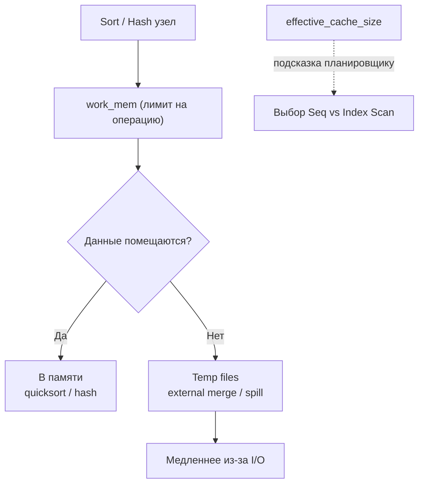
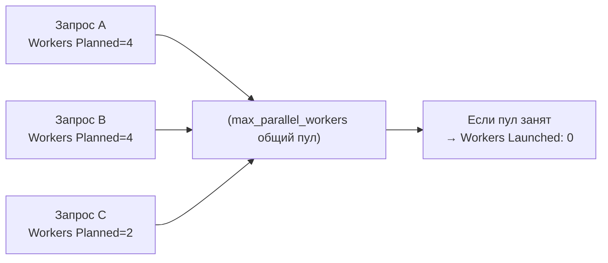
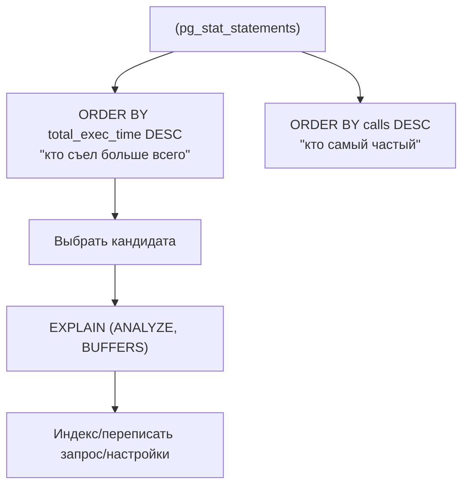

[← Назад к индексу части 7](index.md)

## 41. Настройка

### 41.1. work_mem и effective_cache_size

**Цель раздела.**  
Понять параметры **work_mem** (память на операцию: сортировка, хеш) и **effective_cache_size** (оценка кэша для планировщика). Как они влияют на планы и на использование диска (temp files). После раздела ты будешь настраивать work_mem при «Disk» в плане и effective_cache_size под размер кэша сервера.

**В этом разделе главное (три строки).** 1) **work_mem** — максимальная память **на одну операцию** (одну сортировку, один хеш в узле плана); если данных больше — сброс на **диск** (в плане «Disk», «external merge») — запрос замедляется. При «Disk» в плане Sort или Hash — **увеличить work_mem** для сессии или запроса. 2) work_mem даётся **на операцию**, не на сессию — в одном запросе может быть несколько Sort/Hash, каждый может взять до work_mem; не ставь глобально огромное значение (риск OOM при многих запросах). 3) **effective_cache_size** — только **подсказка** планировщику о размере кэша (обычно 50–75% RAM); память **не резервируется**; влияет на выбор между seq scan и index scan.



#### Термины (расшифровка)

- **work_mem** — максимальный объём **памяти на одну операцию** (сортировка, хеш-таблица для JOIN/агрегации) в одной сессии. Если данных больше — часть сбрасывается на **диск** (временные файлы); в плане видно «Sort Method: external merge», «Disk: …». Увеличение work_mem уменьшает выгрузку на диск и ускоряет запрос. **Важно:** это память **на операцию**, а не на сессию — один запрос с несколькими Sort/Hash может использовать work_mem несколько раз; суммарно на запрос может уйти несколько work_mem.
- **effective_cache_size** — **оценка** объёма кэша, доступного для чтения с диска (память ОС + shared_buffers PostgreSQL). Планировщик **не резервирует** эту память — он использует её как подсказку: при большом effective_cache_size последовательное чтение «дешевле» (вероятность попадания в кэш выше), планировщик чаще выбирает Seq Scan там, где данные могут быть в кэше. Обычно ставят 50–75% от общей RAM сервера.

#### Теория и правила (подробно)

- **work_mem:** по умолчанию в PostgreSQL 4 MB. Для тяжёлых запросов с большими сортировками или Hash Join можно увеличить **для сессии** (SET work_mem = '256MB';) или для пользователя/БД. Слишком большое значение при многих одновременных запросах может привести к OOM — учитывать число одновременных операций.
- **effective_cache_size:** по умолчанию 4 GB в PostgreSQL. На сервере с 64 GB RAM можно выставить 32–48 GB. Влияет только на **выбор плана** (cost), не на реальное использование памяти.

#### Пошагово: work_mem и «Disk» в плане; effective_cache_size (с числами)

**Шаг 1. Когда в плане появляется «Disk».**  
Запрос с ORDER BY по столбцу без индекса или с большим GROUP BY. В плане у узла **Sort**: «Sort Method: external merge **Disk: 10240 kB**». Это значит: данных для сортировки **больше**, чем **work_mem** (например, work_mem = 4 MB); избыток сброшен на **диск** (временные файлы). Внешняя сортировка (merge с диском) **медленнее**, чем сортировка в памяти. Решение: увеличить work_mem для этой сессии: `SET work_mem = '128MB';` — повторить запрос; при достаточном work_mem в плане будет «Sort Method: quicksort **Memory**» без Disk. Запрос ускорится.

**Шаг 2. work_mem — на операцию, не на сессию.**  
Один запрос может содержать **несколько** Sort и Hash (например, два JOIN и ORDER BY). Каждая операция может использовать до **work_mem**; итого на запрос может уйти 2–3 × work_mem. При 100 одновременных запросах и work_mem = 256 MB теоретический пик — десятки гигабайт — риск **OOM**. Поэтому work_mem поднимают выборочно (для тяжёлых запросов или для конкретного пользователя/БД), а не «на всю систему» до огромных значений.

#### Часто путают

**work_mem** — это лимит **на одну операцию** (одну сортировку, один хеш в узле плана), а **не на всю сессию** и не на весь запрос. В одном запросе может быть несколько Sort и несколько Hash — каждый узел может взять до work_mem. Поэтому «поставил work_mem = 100 MB» не значит «этот запрос использует максимум 100 MB» — он может использовать 100 + 100 + 100 MB и т.д. по числу таких узлов. **effective_cache_size** путают с «выделенной памятью» — это **не так**: effective_cache_size **ничего не выделяет**, это только **подсказка** планировщику для расчёта cost; память под кэш резервирует сама СУБД и ОС отдельно.

**Шаг 3. effective_cache_size — только для планировщика.**  
Параметр **не резервирует** память и не влияет на реальное использование. Планировщик использует его как оценку: «сколько данных уже может быть в кэше (ОС + shared_buffers)». При **большом** effective_cache_size cost **последовательного чтения** снижается (вероятность попадания в кэш выше) — планировщик **чаще** выбирает Seq Scan для больших таблиц, если считает, что данные в кэше. Обычно ставят **50–75% RAM** сервера (например, 32 GB при 64 GB RAM). После изменения перепланировать запрос (EXPLAIN без кэша или новый запрос) — план может измениться.

#### Типичная ошибка

Путать **work_mem** с «памятью на всю сессию» или «памятью на весь запрос». work_mem — это лимит **на одну операцию** (одну сортировку, один хеш в узле). В одном запросе может быть несколько Sort и несколько Hash — каждый узел может взять до work_mem; запрос в сумме может использовать 3–4 × work_mem и больше. Поэтому **глобально** ставить work_mem = 1 GB опасно: при 20 одновременных тяжёлых запросах с тремя такими операциями — до 60 GB только на work_mem, риск OOM. Поднимай work_mem **для сессии** (SET work_mem) перед тяжёлым запросом или для конкретной роли/БД, а не «на весь сервер» до огромных значений.

#### Что будет, если work_mem оставить очень маленьким при тяжёлых запросах

Сортировки и хеш-таблицы будут часто уходить на **диск** (external merge, temp files). Время выполнения запросов с ORDER BY и большими JOIN вырастет в разы (диск медленнее памяти). В плане будет стабильно «Disk: …» у Sort и Hash. **Итог:** при появлении «Disk» в плане для тяжёлых запросов увеличить work_mem (хотя бы для сессии или для роли); не ставить глобально гигантское значение — учитывать число одновременных запросов.

#### Картинка в голове

**work_mem** — размер стола для сортировки карточек: если карточек больше, чем помещается на стол, часть сбрасываешь на пол (диск) и потом сливаешь — дольше. Увеличил стол (work_mem) — больше помещается в памяти, быстрее. **effective_cache_size** — подсказка планировщику: «у тебя в комнате уже лежит столько данных в кэше»; от этого он решает, выгоднее ли читать всё подряд (Seq Scan) или по индексу.

#### Простыми словами

**work_mem** — «сколько памяти можно потратить на одну сортировку/хеш». Мало — сброс на диск (медленно). Много — быстрее, но при многих запросах риск OOM. **effective_cache_size** — «подсказка планировщику: сколько кэша у тебя есть»; влияет на выбор между seq scan и index scan.

#### Проверь себя (41.1)

1. В плане Sort с «Disk: 1000». Что делать?  
<details><summary>Ответ</summary> Данных для сортировки **больше**, чем помещается в **work_mem** — 1000 блоков записано на диск. **Действие:** увеличить **work_mem** для этой сессии (SET work_mem = '128MB';) или для этого запроса (SET LOCAL work_mem = '128MB'; в транзакции перед запросом). После увеличения повторить запрос — сортировка должна уместиться в памяти и «Disk» исчезнет, запрос ускорится.</details>

2. На что влияет effective_cache_size?  
<details><summary>Ответ</summary> **effective_cache_size** влияет только на **оценку стоимости** плана планировщиком (cost). Планировщик считает, что часть страниц при последовательном чтении может быть **уже в кэше** — тогда cost Seq Scan снижается относительно Index Scan. При **большом** effective_cache_size планировщик чаще выбирает Seq Scan для больших таблиц (данные «помещаются» в кэш). Память **не резервируется** — это только подсказка для расчёта cost.</details>

3. Почему не ставить work_mem = 1 GB глобально для всех?  
<details><summary>Ответ</summary> **work_mem** — лимит **на одну операцию**; один запрос может содержать **несколько** Sort/Hash и каждый может использовать до work_mem. При 50 одновременных тяжёлых запросах с тремя такими операциями — до 50 × 3 × 1 GB = 150 GB только на work_mem — риск **OOM** (out of memory) и падения сервера. Разумнее поднимать work_mem **выборочно**: для конкретной роли, БД или для сессии перед тяжёлым запросом (SET work_mem = '256MB';).</details>

**Как запомнить.** work_mem — память на одну операцию (Sort, Hash); при нехватке — Disk в плане (медленно); увеличить при «Disk». effective_cache_size — только подсказка планировщику о кэше; 50–75% RAM; память не резервируется.

**Три пункта, чтобы не забыть (work_mem и effective_cache_size).** 1) **work_mem** — максимум памяти **на одну операцию** (сортировка, хеш); при нехватке данные сбрасываются на **диск** — в плане «Disk», запрос медленнее; при «Disk» увеличить work_mem (для сессии или роли). 2) work_mem **на операцию**, не на сессию — один запрос может использовать несколько work_mem; глобально ставить огромное значение опасно (OOM при многих запросах). 3) **effective_cache_size** — **подсказка** планировщику о размере кэша; влияет на выбор seq vs index scan; обычно 50–75% RAM; память не резервируется.

#### Запомните

- **work_mem** — память на одну операцию (Sort, Hash); при нехватке — сброс на диск (медленно); увеличить при «Disk» в плане.
- **effective_cache_size** — подсказка планировщику о размере кэша; влияет на выбор плана (seq vs index scan); обычно 50–75% RAM.

**Ещё раз самыми простыми словами:** work_mem — сколько памяти можно потратить на одну сортировку или хеш; если мало — в плане будет «Disk» и запрос тормозит; увеличь для тяжёлых запросов, но не «на весь сервер» — иначе при многих запросах можно вылететь по памяти. effective_cache_size — просто подсказка планировщику «сколько у тебя кэша»; от неё зависит выбор между полным сканом и индексом; память под неё не выделяется.

**Одна фраза (если забыл всё):** work_mem — память на одну операцию (Sort, Hash); при «Disk» в плане — увеличить. effective_cache_size — подсказка о кэше для планировщика (50–75% RAM); память не резервируется.

---

### 41.2. Параллельные воркеры

**Цель раздела.**  
Понять параметры **max_parallel_workers_per_gather**, **max_parallel_workers** и **max_parallel_workers_maintenance** и как они ограничивают параллельное выполнение запросов и обслуживание (CREATE INDEX и т.д.). После раздела ты будешь настраивать параллелизм под число ядер и нагрузку.

**В этом разделе главное (три строки).** 1) **max_parallel_workers_per_gather** — максимум **worker-процессов на один узел Gather** (на один запрос); по умолчанию 2. **max_parallel_workers** — максимум **всего** параллельных workers в системе (все запросы вместе); по умолчанию 8. 2) При исчерпании **max_parallel_workers** новые запросы с параллельным планом получат **Workers Launched: 0** — весь запрос выполнит один процесс. 3) Настраивай значения **под число ядер** (например, max_parallel_workers_per_gather = 25–50% ядер); не ставь больше ядер — конкуренция за CPU без выигрыша.



#### Термины (расшифровка)

- **max_parallel_workers_per_gather** — максимальное число **worker-процессов** на один узел Gather в плане запроса. По умолчанию 2. Увеличение (например, до 4–8) позволяет тяжёлым запросам использовать больше workers — быстрее Parallel Seq Scan, Hash Join, Aggregate. Не должно превышать число ядер CPU, иначе конкуренция за ресурсы.
- **max_parallel_workers** — общее максимальное число **параллельных workers** в системе (на все запросы суммарно). По умолчанию 8. Ограничивает суммарную нагрузку от параллельных запросов.
- **max_parallel_workers_maintenance** — лимит параллельных workers для **обслуживания** (CREATE INDEX, VACUUM и т.д.). По умолчанию 2. Отдельно от рабочих запросов.

#### Теория и правила (подробно)

- **Рекомендации:** max_parallel_workers_per_gather — порядка 25–50% от числа ядер (например, 4 при 8 ядрах). max_parallel_workers — не больше числа ядер; при смешанной нагрузке оставлять запас для последовательных запросов.
- **Проверка:** в плане с Gather смотреть Workers Planned / Workers Launched; при необходимости увеличить max_parallel_workers_per_gather для тяжёлых запросов.

#### Пошагово: что ограничивают параметры параллелизма (с числами)

**Шаг 1. max_parallel_workers_per_gather.**  
По умолчанию **2**. Это **максимум worker-процессов на один узел Gather** в одном запросе. Запрос с Parallel Seq Scan может использовать до 2 workers + leader. Если поставить **4** (при 8 ядрах) — один тяжёлый запрос сможет занять до 4 workers; в плане будет Workers Planned: 4. Планировщик сам решает, сколько workers использовать (по cost), но не больше этого лимита. Рекомендация: порядка **25–50% ядер** (4 при 8 ядрах), чтобы не занимать все ядра одним запросом.

**Шаг 2. max_parallel_workers.**  
По умолчанию **8**. Это **общий** лимит параллельных workers **по всей системе** (все запросы вместе). Если два запроса по 4 workers — всего 8; третий запрос с Gather получит Workers Launched: 0 (workers не хватило). Имеет смысл ставить не больше числа ядер; при смешанной нагрузке (много коротких запросов + несколько тяжёлых) оставлять запас, чтобы короткие запросы не ждали.

**Шаг 3. max_parallel_workers_maintenance.**  
Отдельный лимит для **обслуживания**: CREATE INDEX, VACUUM и т.д. По умолчанию **2**. Не отнимает из max_parallel_workers для запросов — это отдельный пул. Увеличивать при больших индексах и частом VACUUM, если хочется ускорить обслуживание.

#### Что будет, если max_parallel_workers_per_gather поставить больше числа ядер

Один запрос сможет запланировать больше workers, чем ядер. На практике **запустятся** не больше, чем есть свободных процессов (max_parallel_workers), но планировщик может заложить в cost больше параллелизма, чем физически выгодно — возможна избыточная конкуренция за ядра и кэш, общее время может не улучшиться или даже ухудшиться. **Итог:** ставить max_parallel_workers_per_gather и max_parallel_workers в разумных пределах относительно числа ядер (например, не больше числа ядер).

#### Картинка в голове

**max_parallel_workers_per_gather** — «сколько помощников можно позвать на одну задачу» (один запрос). **max_parallel_workers** — «сколько всего помощников на стройке одновременно» (все запросы). Если помощников на одну задачу много, а общий лимит маленький — при нескольких задачах часть не получит помощников (Workers Launched: 0). Настраивай под число «рабочих» (ядер) и под то, сколько задач обычно идут параллельно.

#### Простыми словами

**max_parallel_workers_per_gather** — сколько workers на один запрос (Gather). **max_parallel_workers** — сколько всего параллельных workers в системе. Увеличивая их, тяжёлые запросы используют больше ядер; слишком большие значения — конкуренция и перегрузка.

#### Проверь себя (41.2)

1. Что ограничивает max_parallel_workers_per_gather?  
<details><summary>Ответ</summary> **max_parallel_workers_per_gather** ограничивает число **worker-процессов** на **один** узел Gather в плане запроса. То есть один запрос не может запустить больше этого числа workers для своего параллельного подплана. Обычно ставят 25–50% от числа ядер CPU, чтобы не занимать все ядра одним запросом и не создавать избыточную конкуренцию.</details>

2. Чем max_parallel_workers отличается от max_parallel_workers_per_gather?  
<details><summary>Ответ</summary> **max_parallel_workers_per_gather** — лимит workers **на один запрос** (на один узел Gather). **max_parallel_workers** — **общий** лимит параллельных workers **по всей системе** (суммарно по всем запросам). Например, при max_parallel_workers_per_gather = 4 и max_parallel_workers = 8 два тяжёлых запроса могут занять по 4 workers; третий запрос с Gather не получит workers (Workers Launched: 0).</details>

3. В плане Gather, Workers Planned: 2, но Workers Launched: 0. Что это значит и что можно сделать?  
<details><summary>Ответ</summary> Планировщик **запланировал** 2 workers для этого запроса, но в момент выполнения **не удалось запустить ни одного** worker. Обычно это значит, что **max_parallel_workers** уже исчерпан другими параллельными запросами (все worker-процессы заняты). Весь подплан выполнил **leader** в одиночку — запрос мог быть медленнее ожидаемого. **Что сделать:** увеличить **max_parallel_workers** (если ядер хватает), снизить параллелизм у других запросов или разнести тяжёлые запросы по времени, чтобы они не конкурировали за workers.</details>

**Как запомнить.** max_parallel_workers_per_gather — workers на один Gather (один запрос); max_parallel_workers — всего в системе. Настраивать под число ядер; не ставить больше ядер.

**Три пункта, чтобы не забыть (параллельные воркеры).** 1) **max_parallel_workers_per_gather** — максимум workers **на один запрос** (Gather); по умолчанию 2. 2) **max_parallel_workers** — максимум параллельных workers **всего в системе**; по умолчанию 8. 3) Настраивать под **число ядер** и нагрузку; слишком большие значения — конкуренция за CPU; при исчерпании max_parallel_workers новые запросы получают Workers Launched: 0.

#### Запомните

- **max_parallel_workers_per_gather** — workers на один Gather; **max_parallel_workers** — всего в системе. Настраивать под число ядер и нагрузку.

**Ещё раз самыми простыми словами:** max_parallel_workers_per_gather — сколько «помощников» можно дать одному запросу; max_parallel_workers — сколько всего таких помощников в системе. Если помощников на систему мало, часть запросов будет выполняться без параллелизма. Ставь значения под число ядер и не завышай.

**Одна фраза (если забыл всё):** max_parallel_workers_per_gather — workers на один Gather; max_parallel_workers — всего в системе. Настраивать под число ядер.

---

### 41.3. pg_stat_statements и поиск тяжёлых запросов

**Цель раздела.**  
Понять расширение **pg_stat_statements**: какие метрики оно собирает (total_time, calls, mean_time, rows и др.) и как использовать их для **поиска тяжёлых и частых запросов**. После раздела ты будешь запрашивать pg_stat_statements и сортировать по времени и вызовам.

**В этом разделе главное (три строки).** 1) **pg_stat_statements** — расширение, которое накапливает по каждому (нормализованному) запросу: **calls** (сколько раз выполнен), **total_exec_time** (суммарное время в ms), **mean_exec_time** (среднее время), **rows** и др. 2) Чтобы найти **самые тяжёлые** запросы — запросить представление **pg_stat_statements** и отсортировать по **total_exec_time DESC**; по **calls DESC** — самые частые. 3) Дальше по **тексту запроса (query)** снять **EXPLAIN ANALYZE** и разобрать план — где узкое место; для установки расширения нужен **shared_preload_libraries** и перезапуск кластера.



#### Термины (расшифровка)

- **pg_stat_statements** — расширение PostgreSQL, которое накапливает **статистику по каждому уникальному запросу** (нормализованный текст + параметры): число выполнений (**calls**), суммарное время (**total_exec_time** в миллисекундах), среднее время (**mean_exec_time**), число возвращённых строк (**rows**), shared_blks_hit/read и т.д. Позволяет найти запросы с наибольшим total time или наибольшим числом вызовов.
- **Нормализация запроса** — запросы с разными литералами сводятся к одному «шаблону» (например, SELECT * FROM t WHERE id = $1). Статистика накапливается по шаблону. В выводе виден queryid и текст запроса (или усечённый).
- **Использование:** запрос к представлению **pg_stat_statements**: сортировка по total_exec_time DESC — самые «тяжёлые» по суммарному времени; по calls DESC — самые частые; по mean_exec_time DESC — самые медленные в среднем. По queryid можно связать с планом (EXPLAIN по тексту запроса).

#### Теория и правила (подробно)

- **Установка:** CREATE EXTENSION pg_stat_statements; (требует настройки shared_preload_libraries и перезапуска). После установки представление pg_stat_statements доступно.
- **Типичный запрос:** SELECT query, calls, total_exec_time, mean_exec_time, rows FROM pg_stat_statements ORDER BY total_exec_time DESC LIMIT 20; — топ-20 запросов по суммарному времени.
- **Сброс:** pg_stat_statements_reset() сбрасывает накопленную статистику. Для «свежего» среза после изменений или для периодического мониторинга сбрасывать и ждать период нагрузки.

#### Пошагово: как найти тяжёлые запросы через pg_stat_statements (с числами)

**Шаг 1. Установка и доступ.**  
В postgresql.conf: **shared_preload_libraries = 'pg_stat_statements'** (или добавить к существующим). Перезапуск кластера. В БД: `CREATE EXTENSION pg_stat_statements;` После этого доступно представление **pg_stat_statements** с полями: **query** (нормализованный текст), **calls** (число выполнений), **total_exec_time** (суммарное время в ms), **mean_exec_time** (среднее время), **rows** (суммарно возвращённых строк), shared_blks_hit/read и др.

**Шаг 2. Топ по суммарному времени.**  
Запрос: `SELECT query, calls, total_exec_time, mean_exec_time, rows FROM pg_stat_statements ORDER BY total_exec_time DESC LIMIT 20;` Это **топ-20 запросов**, съевших больше всего времени суммарно. Часто там оказываются частые запросы (большой calls) с небольшим mean_exec_time или редкие, но очень медленные. Дальше по **query** взять текст запроса и выполнить **EXPLAIN (ANALYZE, BUFFERS)** — разобрать план и узкие места.

**Шаг 3. Топ по вызовам и по среднему времени.**  
**ORDER BY calls DESC** — самые **частые** запросы; оптимизация такого запроса даёт выигрыш на каждом вызове. **ORDER BY mean_exec_time DESC** — самые **медленные в среднем**; кандидаты на переписывание или индексы. Комбинируй: высокий total_exec_time + высокий calls = приоритетный кандидат на оптимизацию.

#### Что будет, если не использовать pg_stat_statements при проблемах с производительностью

Приходится гадать, какой запрос тормозит: смотреть логи (если включён log_min_duration_statement), перехватывать активность вручную (pg_stat_activity). **pg_stat_statements** даёт **накопленную** картину: какие запросы в сумме съели больше всего времени и сколько раз выполнялись — без него сложнее приоритизировать оптимизацию и находить «тихих пожирателей» (частые запросы с средним временем). **Итог:** на продовых и тестовых серверах имеет смысл держать расширение включённым и периодически смотреть топ по total_exec_time и calls.

#### Картинка в голове

**pg_stat_statements** — общая «счётная книга» по каждому типу запроса: сколько раз вызывали, сколько всего времени ушло, в среднем сколько. Открыл книгу — видишь, какие запросы «съели» больше всего времени и какие вызываются чаще всего. Дальше по этим записям разбираешь конкретный запрос и смотришь план (EXPLAIN ANALYZE).

#### Простыми словами

**pg_stat_statements** — «счётчик по каждому запросу»: сколько раз выполнен, сколько всего времени занял, среднее время, строки. По нему находишь **самые тяжёлые** (total time) и **самые частые** (calls) запросы и дальше разбираешь их планы (EXPLAIN ANALYZE).

#### Проверь себя (41.3)

1. Как найти самые тяжёлые запросы с помощью pg_stat_statements?  
<details><summary>Ответ</summary> Запросить представление **pg_stat_statements** и отсортировать по **total_exec_time DESC** (или total_exec_time в зависимости от версии — в новых версиях total_exec_time). Например: SELECT query, calls, total_exec_time, mean_exec_time FROM pg_stat_statements ORDER BY total_exec_time DESC LIMIT 20; Это даст топ запросов по **суммарному** времени выполнения. Дополнительно смотреть **calls** — очень частые запросы с высоким mean_exec_time тоже кандидаты на оптимизацию.</details>

2. Зачем сбрасывать pg_stat_statements (pg_stat_statements_reset)?  
<details><summary>Ответ</summary> **Сброс** обнуляет накопленную статистику. Нужен для **свежего среза** после изменений (добавили индексы, поменяли настройки) — чтобы через некоторое время смотреть статистику уже по новой нагрузке. Или для периодического мониторинга: сбросил в понедельник — в пятницу смотришь топ за неделю. Без сброса статистика накапливается с момента последнего сброса или запуска кластера.</details>

3. Почему для установки pg_stat_statements нужен перезапуск кластера (shared_preload_libraries)?  
<details><summary>Ответ</summary> **pg_stat_statements** загружается через **shared_preload_libraries** — список расширений, которые подгружаются при **старте** сервера в общую память (shared memory). Так расширение может собирать статистику по **всем** запросам во всех сессиях. Если просто выполнить CREATE EXTENSION без preload, расширение не сможет перехватывать запросы глобально при старте. После добавления pg_stat_statements в shared_preload_libraries конфиг перечитывается только при **перезапуске** процесса PostgreSQL (reload недостаточен для смены preload). Поэтому нужен перезапуск кластера.</details>

**Как запомнить.** pg_stat_statements — статистика по каждому запросу (calls, total_exec_time, mean_exec_time); ORDER BY total_exec_time DESC — самые тяжёлые; по query потом делать EXPLAIN ANALYZE.

**Три пункта, чтобы не забыть (pg_stat_statements).** 1) **pg_stat_statements** — расширение, накапливающее по каждому (нормализованному) запросу: **calls**, **total_exec_time**, **mean_exec_time**, rows. 2) **Поиск тяжёлых:** ORDER BY total_exec_time DESC — топ по суммарному времени; ORDER BY calls DESC — самые частые. 3) Дальше по **query** выполнить **EXPLAIN (ANALYZE, BUFFERS)** и разобрать план; для установки нужен shared_preload_libraries и перезапуск.

#### Запомните

- **pg_stat_statements** — статистика по запросам: calls, total_exec_time, mean_exec_time, rows. Сортировка по total_exec_time — самые тяжёлые; по calls — самые частые.
- Использовать для поиска кандидатов на оптимизацию; затем анализировать планы (EXPLAIN ANALYZE).

**Ещё раз самыми простыми словами:** pg_stat_statements — это «кто сколько времени в сумме съел» и «кого сколько раз вызывали». Отсортируй по суммарному времени — увидишь главных кандидатов на оптимизацию; потом по тексту запроса сними план (EXPLAIN ANALYZE) и смотри, где узкое место.

**Одна фраза (если забыл всё):** pg_stat_statements — статистика по запросам (calls, total_exec_time, mean_exec_time). ORDER BY total_exec_time DESC — самые тяжёлые; дальше EXPLAIN ANALYZE по тексту запроса.

---

### 41.4. auto_explain и логирование

**Цель раздела.**  
Понять расширение **auto_explain** и параметр **log_min_duration_statement**: автоматическое логирование планов и/или текста **медленных запросов** в лог сервера. После раздела ты будешь настраивать логирование медленных запросов для диагностики.

**В этом разделе главное (три строки).** 1) **log_min_duration_statement** — запросы, выполнившиеся **дольше** заданного порога (в ms), записываются в лог **полным текстом**; по логу видно, **какой** запрос медленный. 2) **auto_explain** — для запросов дольше своего порога в лог записывается **план выполнения** (и при log_analyze — с actual time, rows, BUFFERS); по плану видно, **почему** запрос медленный. 3) Для **диагностики** медленных запросов включают **оба** с порогом (например, 1 с): по логу находишь текст запроса и его план; для auto_explain нужен **shared_preload_libraries** и перезапуск (или LOAD для сессии).

```mermaid
flowchart LR
  Q["Медленный запрос"] --> Text["log_min_duration_statement\n→ текст в лог"]
  Q --> Plan["auto_explain\n→ план в лог"]
  Plan --> Why["Понять почему медленно\n("Seq Scan/Disk/SubPlan/...")"]
  Text --> Find["Найти какой именно запрос"]
```

#### Термины (расшифровка)

- **auto_explain** — расширение PostgreSQL, которое **автоматически** записывает в лог сервера план выполнения (и при необходимости текст запроса) для запросов, выполнившихся **дольше** заданного порога (auto_explain.log_min_duration). Включается через session или глобально. Помогает собирать планы медленных запросов без ручного EXPLAIN ANALYZE.
- **log_min_duration_statement** — параметр PostgreSQL (не расширение): запросы, выполнившиеся **дольше** этого значения (в миллисекундах), логируются в лог сервера **полным текстом**. Значение 0 — логировать все запросы; -1 — отключить. Используется для аудита и поиска медленных запросов по логам.
- **Комбинация:** log_min_duration_statement логирует **текст** запроса; auto_explain — **план** (и при включении — BUFFERS, ANALYZE). Для глубокого разбора медленного запроса нужен план — включают auto_explain с порогом (например, 1 s).

#### Теория и правила (подробно)

- **Включение auto_explain:** LOAD 'auto_explain'; SET auto_explain.log_min_duration = '1s'; (для сессии) или в postgresql.conf: shared_preload_libraries = 'auto_explain', auto_explain.log_min_duration = '1s'. После порога в лог пишется план (и при auto_explain.log_analyze = on — с фактическими временами и строками).
- **log_min_duration_statement:** в postgresql.conf: log_min_duration_statement = 1000 (логировать запросы дольше 1 s). Перезагрузка конфига: pg_reload_conf(); (для log_min_duration_statement достаточно reload).

#### Пошагово: как включить auto_explain и log_min_duration_statement (с числами)

**Шаг 1. log_min_duration_statement — только текст.**  
В postgresql.conf: **log_min_duration_statement = 1000** (в миллисекундах; 1000 = 1 с). Перезагрузить конфиг: `SELECT pg_reload_conf();` (reload достаточен). Теперь каждый запрос, выполнившийся **дольше 1 с**, попадёт в лог **полным текстом**. По логам видно, **какой** запрос медленный; **почему** — по одному тексту не видно, нужен план. Значение **0** — логировать **все** запросы (шумно, только для отладки). **-1** — отключить логирование по длительности.

**Шаг 2. auto_explain — план в лог.**  
Для **сессии**: `LOAD 'auto_explain'; SET auto_explain.log_min_duration = '1s';` (или 1000 для ms в некоторых версиях). Для запросов дольше 1 s в лог будет записываться **план** (дерево узлов). С **SET auto_explain.log_analyze = on** в лог попадёт план как от **EXPLAIN ANALYZE** (actual time, actual rows) — удобно для разбора. Для **глобального** включения: в postgresql.conf **shared_preload_libraries = 'auto_explain'**, **auto_explain.log_min_duration = '1s'**, перезапуск кластера.

**Шаг 3. Комбинация.**  
**log_min_duration_statement** даёт **текст** медленного запроса; **auto_explain** — **план** (и при log_analyze — фактические времена и строки). Включи оба: по логу находишь запрос по тексту и рядом (или ниже) — его план, видишь узкие места (Seq Scan по большой таблице, SubPlan с большим loops, Sort с Disk и т.д.).

#### Что будет, если поставить auto_explain.log_min_duration = 0

В лог будут записываться **планы всех** запросов, включая быстрые (миллисекунды). Объём логов резко вырастет, диск заполнится, логирование само станет нагрузкой. **Итог:** использовать порог (например, 1 s или 500 ms), чтобы логировать только действительно медленные запросы; для общей картины по всем запросам — pg_stat_statements.

#### Картинка в голове

**log_min_duration_statement** — «если запрос шёл дольше N ms — записать в журнал его текст». **auto_explain** — «если запрос шёл дольше N ms — записать в журнал его **план** (как делал EXPLAIN ANALYZE)». По журналу потом видишь: вот медленный запрос (текст) и вот как он выполнялся (план) — где время ушло, где Seq Scan, где Disk.

#### Простыми словами

**auto_explain** — «в лог автоматически писать план» для запросов дольше порога. **log_min_duration_statement** — «в лог писать текст запроса» для запросов дольше порога. По логам потом ищешь медленные запросы и разбираешь их планы.

#### Проверь себя (41.4)

1. Чем auto_explain отличается от log_min_duration_statement?  
<details><summary>Ответ</summary> **log_min_duration_statement** только записывает в лог **текст** запроса, выполнившегося дольше порога — по нему видно, какой запрос медленный. **auto_explain** записывает **план выполнения** (и при включении log_analyze — с actual time, rows, BUFFERS) для запросов дольше своего порога. Для разбора **почему** запрос медленный нужен план — для этого и используют auto_explain. Оба пишут в лог сервера (обычно stderr или файл лога).</details>

2. Как включить auto_explain только для своей сессии?  
<details><summary>Ответ</summary> В сессии выполнить: **LOAD 'auto_explain';** затем **SET auto_explain.log_min_duration = '1s';** (порог, например 1 с). При необходимости **SET auto_explain.log_analyze = on;** — в лог будет писаться план с фактическими временами и строками (как EXPLAIN ANALYZE). Действует до конца сессии. Для глобального включения нужны параметры в postgresql.conf и shared_preload_libraries с перезапуском.</details>

3. Зачем включать и log_min_duration_statement, и auto_explain вместе?  
<details><summary>Ответ</summary> **log_min_duration_statement** пишет в лог **только текст** запроса — по нему видно, **какой** запрос выполнился дольше порога. **auto_explain** пишет в лог **план** выполнения (и при log_analyze — actual time, rows, BUFFERS) — по нему видно, **почему** запрос медленный (какой узел съел время, Seq Scan, Disk и т.д.). Вместе: по логу находишь медленный запрос по тексту и сразу видишь его план — не нужно вручную запускать EXPLAIN ANALYZE для каждого такого запроса.</details>

4. Что будет, если поставить auto_explain.log_min_duration = 0?  
<details><summary>Ответ</summary> В лог будут записываться **планы всех** запросов, включая быстрые (миллисекунды). Объём логов резко вырастет, диск может заполниться, само логирование станет нагрузкой на I/O. **Итог:** порог нужен (например, 1 s или 500 ms), чтобы логировать только действительно медленные запросы; для общей картины по всем запросам лучше использовать **pg_stat_statements**.</details>

**Как запомнить.** log_min_duration_statement — в лог **текст** запроса дольше порога; auto_explain — в лог **план** (и при log_analyze — actual time/rows). Для диагностики медленных запросов включают оба.

**Три пункта, чтобы не забыть (auto_explain и логирование).** 1) **log_min_duration_statement** — логировать **текст** запросов, выполнившихся дольше порога (в ms); по нему видно **какой** запрос медленный. 2) **auto_explain** — логировать **план** запросов дольше своего порога (при log_analyze — с actual time, rows); по плану видно **почему** медленный. 3) Для диагностики включают оба; auto_explain для сессии: LOAD 'auto_explain'; SET auto_explain.log_min_duration = '1s'; глобально — shared_preload_libraries и перезапуск.

#### Запомните

- **auto_explain** — автоматическое логирование **планов** медленных запросов; **log_min_duration_statement** — логирование **текста** запросов дольше порога.
- Для диагностики медленных запросов включают оба: по логу находишь запрос и его план.

**Ещё раз самыми простыми словами:** log_min_duration_statement пишет в лог текст запроса, если он шёл дольше порога — видишь, что за запрос тормозит. auto_explain пишет в лог план этого запроса — видишь, как он выполнялся и где узкое место. Включи оба с порогом (например, 1 с) — по логам потом удобно разбирать медленные запросы.

**Одна фраза (если забыл всё):** log_min_duration_statement — в лог текст запроса дольше порога; auto_explain — в лог план. Для диагностики медленных запросов включают оба.

---

---

<!-- prev-next-nav -->
*[← 40. Антипаттерны запросов](05_40_antipatterny_zaprosov.md) | [→ Справочник по части VII](07_spravochnik_voprosy_rezyume.md)*
