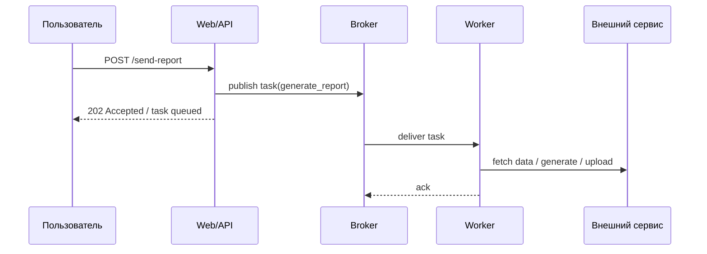

[← Назад к индексу части](index.md)
[↑ К глобальному плану](../../mastery_plan.md)

## 1.1. Что такое Celery

### Цель раздела

Понять Celery как полноценную систему распределённого исполнения задач: увидеть его место в Python-экосистеме, разобраться в основных ролях компонентов, почувствовать разницу между "запустить функцию позже" и "надежно вынести работу в отдельный контур", а также сразу увидеть, какие задачи Celery решает хорошо, а какие не стоит на него вешать.

### В этом разделе главное

- Celery — это **distributed task queue**, а не просто "библиотека для background jobs".
- Задача в Celery — это **сообщение и контракт исполнения**, а не прямой вызов функции.
- Базовый контур состоит из **producer -> broker -> worker**, а часто также из `beat`, `result backend` и систем наблюдения.
- Celery отлично подходит для **фона, отложенного запуска, ретраев, fan-out по worker-ам и независимого масштабирования обработки**.
- Celery не предназначен для **hard real-time**, ultra-low latency, строгого exactly-once и сложной долговременной бизнес-оркестрации уровня workflow engine.
- Celery не "ускоряет Python-код магически"; он **переносит и распределяет работу**.

### Термины

- **Distributed task queue** — система, где задачи описываются как сообщения, передаются через broker и исполняются отдельными worker-ами.
- **Background job** — работа, которую не хочется делать в основном пользовательском потоке прямо сейчас.
- **Producer** — отправитель задачи.
- **Broker** — транспорт и буфер сообщений между producer и worker.
- **Worker** — исполнитель задач.
- **Beat** — планировщик периодических задач.
- **Monitoring tools** — инструменты наблюдаемости: события worker-ов, метрики, Flower, логи, брокерные метрики.

### Теория и правила

#### 1. Celery как система, а не декоратор

На поверхности Celery выглядит очень просто:

```python
from celery import Celery

app = Celery("demo", broker="redis://localhost:6379/0")

@app.task
def send_email(user_id: int) -> None:
    print(f"Send email to user {user_id}")

send_email.delay(42)
```

У начинающего разработчика после такого примера формируется опасная мысль: "Celery — это просто способ вызвать функцию не сейчас, а потом". Это **частично верно**, но **слишком упрощённо**.

Фактически здесь произошло не "отложенное выполнение функции", а более сложная вещь:

1. код producer-а сериализовал информацию о задаче;
2. сообщение ушло в broker;
3. другой процесс, возможно на другой машине, позже прочитал это сообщение;
4. worker восстановил контекст настолько, насколько это возможно;
5. код задачи выполнился в среде, которая уже **не является тем же самым процессом**, что инициировал вызов.

То есть задача Celery — это не "вызов функции в будущем", а **распределённое взаимодействие между независимыми процессами через очередь**.

#### Мини-проверка: Celery как система, а не декоратор

1. Почему пример с `@app.task` и `delay()` опасно воспринимать как "обычный вызов, только потом"?

<details><summary>Ответ</summary>

Потому что за простым синтаксисом скрывается сериализация, транспорт, отдельное место и время исполнения, а также новые failure modes. Это уже не локальный вызов функции.

</details>

2. Что именно меняется в инженерном смысле, когда код уезжает в другой процесс через broker?

<details><summary>Ответ</summary>

Появляются отдельный жизненный цикл задачи, границы между producer и worker, возможные повторы, необходимость думать о delivery semantics, наблюдаемости и побочных эффектах.

</details>

#### Отложить вызов vs распределённо обработать надёжно

Это различие настолько важное, что его полезно зафиксировать отдельно.

| Вопрос                                           | "Просто вызвать позже"                                   | "Распределённо обработать надёжно"            |
| ------------------------------------------------ | -------------------------------------------------------- | --------------------------------------------- |
| Где живёт работа                                 | Обычно в том же процессе, потоке или локальном scheduler | В другом процессе, а часто и на другой машине |
| Есть ли очередь как отдельная сущность           | Необязательно                                            | Почти всегда да                               |
| Кто отвечает за переживание рестарта приложения  | Часто никто или локальный механизм                       | Broker + worker-контур + конфигурация         |
| Есть ли независимое масштабирование исполнителей | Обычно нет                                               | Да, это одна из причин существования Celery   |
| Есть ли retry и повторная доставка               | Обычно вручную или вовсе нет                             | Да, это часть ментальной модели               |
| Нужно ли думать об идемпотентности               | Иногда                                                   | Почти всегда                                  |
| Нужен ли мониторинг очередей и worker-ов         | Обычно минимально                                        | Обязательно в production                      |

Из этой таблицы рождается полезная мысль:

> **Когда ты добавляешь Celery, ты добавляешь не "удобный вызов попозже", а новый слой архитектуры.**

#### Мини-проверка: отложить вызов vs распределённо обработать

1. В каком случае тебе почти наверняка не понадобится полноценный Celery-контур, даже если хочется "сделать позже"?

<details><summary>Ответ</summary>

Когда работу можно отложить локальным scheduler-ом или простым процессом без очереди, независимого масштабирования и сложной delivery-модели.

</details>

2. Почему идемпотентность становится почти обязательной именно в распределённой модели?

<details><summary>Ответ</summary>

Потому что распределённый контур допускает повторные доставки, рестарты worker-ов и retry, а значит один и тот же эффект может быть инициирован более одного раза.

</details>

#### 2. Основные роли в контуре Celery

Базовая схема выглядит так:

```mermaid
flowchart LR
    A["Producer\n("web app / CLI / task")"] --> B["Broker\n("RabbitMQ / Redis / SQS ...")"]
    B --> C["Worker"]
    D["Beat"] --> B
    C --> E["Result backend\n("optional")"]
    C --> F["Logs / metrics / events / Flower"]
```

Расшифруем роли:

- **Producer** создаёт и отправляет задачу.
- **Broker** принимает сообщение и хранит его, пока worker не заберёт его на исполнение.
- **Worker** исполняет задачу.
- **Beat** по расписанию сам создаёт новые задачи и отправляет их в broker.
- **Result backend** хранит статус и, если нужно, результат выполнения.
- **Monitoring tools** помогают увидеть, что вообще происходит: какие очереди растут, где ошибки, какие worker-ы живы.

Под `monitoring tools` полезно понимать не "одну волшебную панель", а набор разных источников правды:

| Инструмент / слой             | На какой вопрос отвечает                                                 |
| ----------------------------- | ------------------------------------------------------------------------ |
| **Task logs**                 | Что делал конкретный worker во время выполнения задачи?                  |
| **Broker metrics**            | Растут ли очереди, есть ли backlog, redelivery, saturation?              |
| **Flower / Celery events UI** | Какие задачи выполняются, retry-ятся, какими worker-ами?                 |
| **Application metrics / APM** | Как фон влияет на latency, ошибки, внешние зависимости, ресурсы сервиса? |
| **Infra metrics**             | Не упираемся ли в CPU, RAM, сеть, диски, connection limits?              |

То есть "наблюдать Celery" означает смотреть не только на сам код задач, но и на поведение очереди, worker-ов и инфраструктуры вокруг них.

Для production-мышления полезно сразу делить наблюдение на три уровня:

- **уровень приложения**: логи producer-а, task-логи, ошибки кода, latency выполнения;
- **уровень Celery**: статусы задач, события worker-ов, retry, revoke, concurrency, prefetch;
- **уровень broker-а**: длина очередей, скорость потребления, redelivery, persistence, dead lettering, сетевые разрывы.

Именно поэтому "у нас есть логи приложения" ещё не означает "мы наблюдаем Celery".

#### Мини-проверка: роли и контур Celery

1. Зачем в схеме Celery одновременно нужны и broker, и worker, а не только один "фоновой процесс"?

<details><summary>Ответ</summary>

Broker буферизует и доставляет сообщения, а worker исполняет работу. Это разные ответственности: транспорт и выполнение.

</details>

2. Почему monitoring в Celery нельзя свести только к логам задач?

<details><summary>Ответ</summary>

Потому что логи задач не покажут полную картину по backlog, redelivery, saturation, состоянию worker-ов и инфраструктурным ограничениям.

</details>

3. В каком случае `result backend` можно не включать?

<details><summary>Ответ</summary>

Когда результат никто не читает и задача нужна только ради побочного эффекта, а не ради возвращаемого значения или polling-статуса.

</details>

#### 2.5. Место Celery в Python-экосистеме

Полезно сразу видеть Celery не изолированно, а среди соседних уровней решений:

| Уровень                             | Типичный вопрос                                               | Типичный инструмент                                                 |
| ----------------------------------- | ------------------------------------------------------------- | ------------------------------------------------------------------- |
| **Внутри одного вызова**            | "Как выполнить логику прямо сейчас?"                          | обычная функция, сервисный слой, синхронный код                     |
| **Внутри одного процесса**          | "Как не блокировать I/O или распараллелить локальную работу?" | `asyncio`, `threading`, `concurrent.futures`, `ProcessPoolExecutor` |
| **Между процессами и инстансами**   | "Как вынести работу в отдельный фон через очередь?"           | **Celery** и другие task queue-инструменты                          |
| **Над процессами и шагами бизнеса** | "Как управлять долгим workflow с историей и версиями?"        | Temporal, Airflow, Prefect и похожие workflow engines               |

Из этой рамки хорошо видно:

- Celery стоит **выше локального параллелизма**, потому что добавляет очередь, worker-ы и распределённость;
- но он стоит **ниже workflow engine**, потому что в центре у него не долгоживущий процесс, а отдельные задачи.

#### Мини-проверка: место Celery в экосистеме

1. Чем Celery отличается от `ProcessPoolExecutor` на уровне архитектурного слоя, а не API?

<details><summary>Ответ</summary>

`ProcessPoolExecutor` решает локальный параллелизм внутри одного хоста, а Celery добавляет внешний контур: broker, очередь, worker-fleet и отдельную operational-модель.

</details>

2. Почему Celery нельзя автоматически считать заменой workflow engine?

<details><summary>Ответ</summary>

Потому что workflow engine управляет долгоживущим процессом с состоянием, историей, шагами и версиями, а Celery в центре держит отдельные задачи и их исполнение.

</details>

#### 3. Какие классы задач Celery решает хорошо

Celery особенно хорош там, где есть хотя бы часть следующих требований:

- операция не должна блокировать HTTP-ответ;
- работа может выполняться отдельно от пользовательского запроса;
- допустима асинхронность и eventual consistency;
- задачи естественно распараллеливаются между несколькими worker-ами;
- полезны retry, routing, отложенный запуск, периодическое исполнение;
- нужно независимо масштабировать слой обработки.

Типичные примеры:

- отправка email и push-уведомлений;
- генерация отчётов и документов;
- ресайз изображений и видео-конвертация;
- интеграции с медленными или нестабильными внешними API;
- пакетная обработка данных;
- очистка кэша, прогрев индексов, пересчёт агрегатов;
- периодические housekeeping-задачи.

#### Мини-проверка: хорошие сценарии для Celery

1. Почему медленная интеграция с внешним API часто хорошо ложится в Celery?

<details><summary>Ответ</summary>

Потому что такие вызовы не обязаны жить внутри HTTP-ответа, могут временно падать и выигрывают от retry, очереди и независимого масштабирования исполнителей.

</details>

2. Какой общий признак объединяет письма, отчёты, пересчёты агрегатов и housekeeping-задачи?

<details><summary>Ответ</summary>

Все они естественно переносятся в background jobs: допускают асинхронность, часто независимы друг от друга и не требуют мгновенного ответа пользователю.

</details>

#### 4. Какие задачи Celery решает плохо или не должен решать

Celery обычно плохой выбор, если:

- нужен **мгновенный ответ** с очень маленькой задержкой;
- нужна **жёсткая транзакционная связность** "коммит БД и побочный эффект должны либо оба произойти, либо оба не произойти";
- нужен **строгий exactly-once** без допущения повторов;
- требуется сложная долговременная **бизнес-оркестрация** с версиями workflow, compensation logic, human-in-the-loop и историей шагов;
- нужен поток событий уровня stream processing, а не queue-driven обработка;
- слишком высока цена эксплуатации broker + worker + monitoring для реального выигрыша.

#### Мини-проверка: плохие сценарии для Celery

1. Почему ultra-low latency и Celery обычно плохо сочетаются?

<details><summary>Ответ</summary>

Потому что Celery добавляет очередь, сериализацию, broker и отдельный контур исполнения, а это почти всегда увеличивает задержку и число точек отказа.

</details>

2. В чём принципиальная проблема попытки сделать через Celery строгий exactly-once на критичном шаге?

<details><summary>Ответ</summary>

Потому что Celery живёт в мире распределённых очередей и повторов, поэтому строгая семантика без повторов требует отдельной архитектурной защиты и нередко выходит за естественную область применения Celery.

</details>

#### 5. Почему Celery не равен workflow engine

Celery умеет цепочки, группы, chord и периодические задачи, поэтому у людей возникает соблазн решить им любую оркестрацию. Но важно различать:

- **task queue** — "есть единицы работы, нужно их исполнять и повторять";
- **workflow engine** — "есть сложный долгоживущий бизнес-процесс с явным состоянием, шагами, версиями, зависимостями, компенсациями, историей исполнения, визуализацией и воспроизводимостью".

Celery можно использовать для несложной оркестрации, но он не становится от этого полноценным заменителем Temporal, Airflow или Prefect во всех сценариях.

#### Мини-проверка: Celery vs workflow engine

1. Когда chain/group/chord ещё остаются в естественной зоне Celery, а когда уже стоит думать о workflow engine?

<details><summary>Ответ</summary>

Пока речь о сравнительно коротких композициях задач без богатой истории процесса, версионирования и сложной compensation-логики, Celery уместен. Когда появляется долгоживущий процесс с явным состоянием и управлением шагами, пора смотреть на workflow engine.

</details>

2. Почему наличие orchestration-примитивов в Celery ещё не делает его workflow-платформой?

<details><summary>Ответ</summary>

Потому что orchestration-примитивы решают только часть задачи композиции вызовов, но не дают автоматически весь слой процессного управления, истории, версионирования и воспроизводимости.

</details>

### Пошагово

Как правильно мысленно распознавать Celery:

1. Сначала спроси себя: **я хочу просто вызвать код позже или строю отдельный контур исполнения?**
2. Если есть broker, worker, очереди, ретраи, маршрутизация и отдельный жизненный цикл задач, это уже не "потом вызвать", а распределённая система.
3. Дальше проверь: **какой эффект создаёт задача?**
4. Если эффект внешний и побочный, сразу думай об идемпотентности и сбоях.
5. Если задача требует сложного бизнес-процесса с историей шагов, проверь, не нужен ли workflow engine.
6. Если задача короткая, локальная и не требует очередей, возможно Celery избыточен.

### Простыми словами

Представь ресторан доставки.

- Веб-приложение — это касса, где клиент делает заказ.
- Celery producer — кассир, который не идёт сам жарить еду, а передаёт заказ дальше.
- Broker — окно с заказами или электронная очередь.
- Worker — кухня, которая реально готовит.
- Beat — человек, который по расписанию напоминает: "каждый день в 03:00 сделать инвентаризацию".
- Result backend — журнал, где можно посмотреть: "заказ взят", "готовится", "готов", "ошибка".

Если кассир сам и принимает заказ, и готовит, и моет посуду, касса быстро встанет. Celery помогает **развести роли**. Но кухня всё равно может ошибаться, заказы могут дублироваться, а журнал может врать или запаздывать. То есть проблема не исчезает, а **переезжает в более управляемую форму**.

### Картинка в голове



Главная мысль схемы: пользователь уже получил ответ, а реальная работа живёт своей отдельной жизнью.

### Как запомнить

> **Celery не ускоряет код. Celery переносит код в отдельный контур исполнения.**

И ещё одна формула:

> **`@app.task` = не "магия", а вход в распределённую систему.**

### Примеры

#### Пример 1. Хороший кандидат на Celery

```python
@app.task(bind=True, autoretry_for=(TimeoutError,), retry_backoff=True, max_retries=5)
def sync_crm_contact(self, contact_id: int) -> None:
    contact = load_contact(contact_id)
    payload = build_payload(contact)
    send_to_crm(payload)
```

Почему это хороший кандидат:

- есть внешний API;
- возможны временные ошибки;
- операция не обязана завершиться внутри HTTP-запроса;
- полезны retry и независимое масштабирование worker-ов.

#### Мини-проверка: пример хорошего кандидата

1. Какие свойства этого примера делают Celery оправданным, а не просто "удобным"?

<details><summary>Ответ</summary>

Внешний API, допустимая асинхронность, польза от retry и возможность вынести обработку из пользовательского запроса.

</details>

2. Почему здесь важно, что ошибка может быть временной?

<details><summary>Ответ</summary>

Потому что временная ошибка как раз делает retry-политику осмысленной: систему можно стабилизировать без ручного вмешательства на каждый сбой.

</details>

#### Пример 2. Плохой кандидат на Celery

```python
@app.task
def calculate_total(items):
    return sum(item["price"] for item in items)
```

Если это просто локальный быстрый расчёт без побочных эффектов, без очередей и без необходимости вынесения из request/response, Celery только добавит сложность.

#### Мини-проверка: пример плохого кандидата

1. Почему сам по себе факт "это функция" не делает пример плохим, а плохим его делает именно характер задачи?

<details><summary>Ответ</summary>

Потому что проблема не в синтаксисе, а в том, что задача локальная, быстрая и не требует очереди, фона, retry и отдельного контура исполнения.

</details>

2. Какой класс инструмента здесь чаще всего уместнее Celery?

<details><summary>Ответ</summary>

Обычный синхронный вызов функции, а при необходимости локального параллелизма - executor или иной простой локальный механизм.

</details>

#### Пример 3. Celery не спасает от плохой границы транзакции

```python
def create_order(payload):
    order = Order.objects.create(**payload)
    charge_card.delay(order.id)
    return order
```

На вид удобно. Но если после записи заказа транзакция откатится, а задача уже ушла, система может попытаться списать деньги по заказу, которого "не существует" в итоговом состоянии. Тут уже нужен разговор про transactional outbox или `transaction.on_commit`, а не просто "мы добавили Celery".

Более безопасная промежуточная практика в Django-контуре выглядит так:

```python
from django.db import transaction

def create_order(payload):
    order = Order.objects.create(**payload)

    transaction.on_commit(
        lambda: charge_card.delay(order.id)
    )

    return order
```

Это ещё не полноценный transactional outbox, но уже важный шаг вперёд:

- сначала должен успешно завершиться коммит;
- только потом задача получает право уйти в broker;
- уменьшается риск, что фон начнёт действовать раньше, чем система зафиксировала бизнес-истину.

Практически важно помнить: `transaction.on_commit` хорошо помогает в пределах одного приложения и его транзакционной границы, но не заменяет автоматически все более сложные сценарии надёжной межсервисной интеграции.

#### Мини-проверка: граница транзакции

1. Какую именно проблему снижает `transaction.on_commit` в этом примере?

<details><summary>Ответ</summary>

Он уменьшает риск того, что задача уйдёт в broker и начнёт действовать до того, как бизнес-данные будут успешно закоммичены.

</details>

2. Почему `transaction.on_commit` ещё не равен полноценному transactional outbox?

<details><summary>Ответ</summary>

Потому что это всё ещё локальная техника внутри одной транзакционной границы приложения, а transactional outbox решает более общий и надёжный сценарий согласования данных и внешней публикации.

</details>

### Практика / реальные сценарии

- **Интернет-магазин**: оформление заказа отвечает быстро, а письма, создание PDF-счёта, обновление аналитики и интеграция со складом уходят в фон.
- **SaaS-платформа**: nightly-задачи пересчитывают usage, квоты, счета и отчёты.
- **Контент-система**: загрузка изображения возвращает ответ быстро, а тяжёлые преобразования и хранение копий выполняют worker-ы.
- **Интеграционный слой**: при обновлении пользователя событие отправляется в CRM, ERP и рассылочный сервис, при этом временные падения внешних систем не должны валить пользовательский запрос.

### Типичные ошибки

- Считать Celery "асинхронным Python" и забывать, что исполнение идёт **в другом процессе**.
- Передавать в задачу всё подряд: ORM-объекты, гигантские бинарные payload, нестабильные структуры.
- Воспринимать `delay()` как бесплатный аналог вызова функции.
- Игнорировать broker и думать, что "Celery сам всё гарантирует".
- Пытаться строить сложнейший бизнес-workflow на чистом Celery Canvas без понимания ограничений.

### Что будет, если...

1. Что будет, если относиться к задаче Celery как к обычной функции?
2. Что будет, если использовать Celery для критичного шага, который обязан завершиться в рамках текущей транзакции?
3. Что будет, если взять Celery там, где нужен полноценный workflow engine?

Короткий ответ:

- в первом случае появится ложное чувство простоты и начнутся проблемы с сериализацией, повторами и контекстом исполнения;
- во втором случае ты разорвёшь причинно-следственную связь между запросом и бизнес-инвариантом;
- в третьем случае начнёшь руками строить историю шагов, компенсации, видимость статусов и эволюцию процессов поверх инструмента, который для этого не оптимизирован.

### Проверь себя

1. Почему Celery правильнее называть distributed task queue, а не "библиотекой фоновых задач"?
2. В чём разница между "функция исполняется в фоне" и "задача исполняется распределённо"?
3. Назови один сценарий, где Celery подходит хорошо, и один, где он создаст лишнюю сложность.

<details><summary>Ответ</summary>

Потому что Celery включает транспорт сообщений, очереди, worker-ы, маршрутизацию, планирование, retry-механику, результат и мониторинг. Это целая подсистема, а не просто декоративный способ "не блокировать код".

</details>
<details><summary>Ответ</summary>

"В фоне" может означать просто другой поток или процесс в том же приложении. "Распределённо" означает отдельный контур с broker-ом, сериализацией, независимым временем исполнения, подтверждениями и отказами на границах компонентов.

</details>
<details><summary>Ответ</summary>

Хорошо: отправка писем, интеграции с медленным API, генерация отчётов. Плохо: ultra-low latency запрос, строго транзакционный шаг в том же коммите, сложный долгоживущий workflow с версиями процесса.

</details>

### Запомните

- **Celery — это не трюк для "сделать потом", а отдельная распределённая подсистема.**
- **Задача Celery — это сообщение и контракт исполнения, а не обычная функция.**
- **Celery хорош там, где нужна очередь, фон, ретраи, отложенность и независимое масштабирование.**
- **Celery плох там, где нужны мгновенность, exactly-once или сложная workflow-оркестрация.**

---
