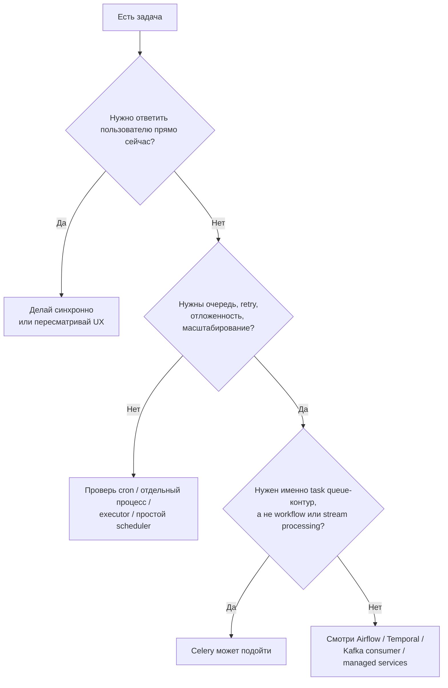

[← Назад к индексу части](index.md)
[↑ К глобальному плану](../../mastery_plan.md)

## 1.2. Когда Celery нужен, а когда нет

### Цель раздела

Научиться узнавать сценарии, где Celery действительно окупает свою сложность, и отличать их от ситуаций, где лучше использовать более простой механизм или другой класс инструмента.

### В этом разделе главное

- Celery нужен не потому, что "задача долгая", а потому, что у задачи есть **архитектурные свойства**, выгодные для вынесения в queue-based контур.
- Хорошие сценарии: медленные внешние вызовы, batch jobs, fan-out обработки, периодические задания, независимое масштабирование слоя обработки.
- Плохие сценарии: мгновенные локальные операции, строго синхронные гарантии, тяжёлые workflow, event streaming не того класса, слишком дорогая эксплуатация ради малого выигрыша.
- Очень часто **cron**, `systemd timer`, отдельный процесс, RQ, Huey, Dramatiq, Kafka-consumer или managed queue подходят лучше.
- Выбор должен строиться по критериям: распределённость, retry, наблюдаемость, сложность эксплуатации, тип нагрузки, требования к гарантиям и задержке.

### Термины

- **Batch job** — пакетная обработка множества объектов или данных.
- **Periodic task** — задача по расписанию.
- **Fan-out** — один входной факт порождает много параллельной работы.
- **Managed queue** — управляемая облачная очередь вроде AWS SQS.
- **Workflow engine** — движок оркестрации долгоживущих процессов.
- **Event-driven обработчик** — фоновая реакция на внутреннее или внешнее событие системы.

### Теория и правила

#### Когда Celery нужен

Celery обычно оправдан, если одновременно выполняется несколько условий:

1. **Работа не обязана завершиться в рамках HTTP-ответа.**
2. **Работа может быть вынесена в отдельный процесс или отдельный пул ресурсов.**
3. **Нужны retries, очереди, отложенный запуск или расписание.**
4. **Полезно независимо масштабировать обработку отдельно от API.**
5. **Команда готова эксплуатировать broker, worker-ы и мониторинг.**

Хорошие сценарии:

- **Вынесение медленных операций из HTTP-запроса**  
  Пример: отправка писем, генерация Excel/PDF, webhooks, интеграция с платёжным или CRM API.

- **Массовая обработка данных**  
  Пример: пересчитать миллион записей, сгенерировать превью для пакета файлов, мигрировать данные по частям.

- **Интеграции с ненадёжными внешними системами**  
  Пример: API отвечает с таймаутами, временно падает или ограничивает частоту запросов.

- **Отложенные и периодические задачи**  
  Пример: напомнить через 24 часа, раз в ночь пересчитать агрегаты, раз в 5 минут собирать отчёт.

- **Внутренние event-driven реакции в Python-ландшафте**  
  Пример: после события `order_paid` асинхронно отправить письмо, обновить аналитический срез, инициировать синхронизацию с ERP.

#### Мини-проверка: когда Celery нужен

1. Почему вынесение работы из HTTP-запроса само по себе ещё не единственный аргумент, но уже важный сигнал?

Ответ

Потому что это указывает на полезность отдельного контура исполнения, но окончательное решение всё равно зависит от retries, очередей, масштабирования и цены эксплуатации.

2. Что объединяет batch jobs, интеграции и периодические задачи с точки зрения выбора Celery?

Ответ

Им выгодны очередь, фон, независимое выполнение и часто повторные попытки или отложенный запуск.

#### Когда Celery не нужен

Celery часто не нужен, если:

- задача **быстрая и локальная**;
- у тебя **одна машина и один простой периодический скрипт**;
- нужен **один отдельный воркер без сложной маршрутизации**;
- операция должна быть выполнена **строго синхронно**;
- у команды нет ресурсов на эксплуатацию очередей и мониторинга;
- сама бизнес-проблема лучше ложится в другой инструмент.

Хорошие альтернативы:

| Сценарий                                                | Часто лучше взять                                    |
| ------------------------------------------------------- | ---------------------------------------------------- |
| Раз в день запускать отчёт                              | `cron`, `systemd timer`, CI scheduler                |
| Локально распараллелить CPU-задачи в одном процессе     | `concurrent.futures`, `ProcessPoolExecutor`          |
| Нужен простой Redis-based фон без сложного контура      | `RQ`, `Huey`, иногда `Dramatiq`                      |
| Нужна долговременная оркестрация процесса               | `Temporal`, `Prefect`, `Airflow`                     |
| Нужен потоковый event streaming и consumer group-модель | Kafka consumer или смежный стек                      |
| Хочется без собственного broker-а в облаке              | SQS + лямбды / managed queues / облачные scheduler-ы |

#### Мини-проверка: когда Celery не нужен

1. Почему "у команды нет ресурсов на сопровождение очередей" - это технический аргумент, а не организационная мелочь?

Ответ

Потому что эксплуатация broker, worker-ов и мониторинга - часть самой системы. Если команда не готова это поддерживать, решение может оказаться нестабильным и дорогим.

2. В каком случае `cron` будет архитектурно честнее, чем Celery?

Ответ

Когда задача проста по жизненному циклу, периодична, не требует гибкой маршрутизации, retries на уровне множества независимых задач и отдельного fleet worker-ов.

#### Когда лучше смотреть в сторону других классов инструментов

Иногда полезно не просто сказать "Celery не нужен", а точно назвать, **какой именно класс решения больше подходит**.

- Если у тебя поток событий, партиции, consumer groups, реплей потока и stream-style обработка, то ты уже ближе к **Kafka consumer** или **Faust-подобному** подходу, чем к классической task queue.
- Если нужен лёгкий async-first фон рядом с уже существующим async-приложением и без полной тяжести Celery-контура, логично хотя бы сравнить с **Arq**.
- Если хочется Redis-based queue попроще и без части operational-модели Celery, смотри на **RQ**, **Huey**, **Dramatiq**.
- Если приоритет — минимизировать собственную инфраструктуру и жить в облачных примитивах, честно сравни Celery с **managed queues**, serverless consumers и cloud scheduler-ами.
- Если нужен не набор задач, а **долгий управляемый процесс**, лучше сразу думать в сторону workflow engine, а не пытаться "дотянуть" Celery до чужого класса задач.

#### Мини-проверка: другие классы инструментов

1. Как понять, что ты описываешь stream-processing, а не task queue?

Ответ

Когда в центре уже поток событий, consumer groups, реплей, партиции и обработка лога, а не доставка отдельных background jobs в очередь исполнения.

2. Почему managed queues и serverless consumers иногда честнее Celery для команды?

Ответ

Потому что они уменьшают объём собственной инфраструктуры и operational-бремени, если команде это важнее гибкости и богатой модели Celery.

#### Мини-матрица выбора: Celery или не Celery

Ниже не "истина в последней инстанции", а удобная стартовая рамка для выбора:

| Если у тебя задача такого класса                                                       | Чаще первый кандидат                         |
| -------------------------------------------------------------------------------------- | -------------------------------------------- |
| Нужно быстро и просто запускать одно периодическое действие                            | `cron` / `systemd timer`                     |
| Нужно локально распараллелить вычисления на одной машине                               | `ProcessPoolExecutor`                        |
| Уже есть async-стек, нужен лёгкий фон внутри Python и команда не хочет тяжёлую очередь | `Arq` или похожий async-first инструмент     |
| Нужна зрелая task queue с routing, beat, retries и fleet worker-ов                     | `Celery`                                     |
| Нужен лёгкий Redis-based queue-tool без части сложности Celery                         | `RQ`, `Huey`, иногда `Dramatiq`              |
| Нужен поток событий, consumer groups и stream-processing                               | Kafka consumer / stream stack                |
| Нужен долгий процесс с состоянием, версиями и compensation                             | `Temporal`, `Prefect`, `Airflow` по сценарию |

Практическое правило:

- если ты уже мысленно говоришь "очередь", "классы worker-ов", "retry с политикой", "отложенные задачи", "наблюдение за backlog" — Celery вероятен;
- если ты говоришь "один ночной скрипт", "локально ускорить CPU", "просто async HTTP внутри сервиса" — почти наверняка сначала смотри не на Celery.

#### Мини-проверка: матрица выбора

1. Почему сама по себе "асинхронность" ещё не указывает именно на Celery?

Ответ

Потому что асинхронность бывает разного класса: локальный async I/O, scheduler, batch, stream, workflow. Celery нужен только для части таких задач.

2. Какой набор признаков сильнее всего подталкивает выбор в сторону Celery?

Ответ

Очередь, retries, delayed execution, несколько классов worker-ов, backlog как сущность и готовность сопровождать broker и мониторинг.

#### Сигналы, что Celery, скорее всего, выбран зря

Иногда полезно не только искать аргументы "за", но и узнавать красные флаги неправильного выбора:

- задача выполняется быстро и локально, но её всё равно отправляют в очередь "на всякий случай";
- команда не готова поднимать и сопровождать broker, но уже хочет "как в больших проектах";
- весь бизнес-контур завязан на немедленный результат, а Celery пытаются вставить между шагами ради модности;
- почти все задачи на практике уникальны, тяжело маршрутизируются и плохо повторяются, но их всё равно пытаются представить как однотипные background jobs;
- каждый раз, когда обсуждают Celery, разговор быстро скатывается к "ну потом как-нибудь разберёмся с идемпотентностью, ретеншном, мониторингом".

Если ты видишь такие сигналы, это не всегда запрет на Celery, но почти всегда повод ещё раз вернуться к вопросу: **какую именно боль мы решаем, и нельзя ли решить её проще?**

#### Мини-проверка: красные флаги выбора

1. Почему формула "сейчас внедрим Celery, а идемпотентность и мониторинг потом" сама по себе тревожный сигнал?

Ответ

Потому что эти свойства не дополнительные украшения, а базовая часть безопасной эксплуатации Celery-контуров.

2. Что общего у быстрых локальных задач и бизнес-контуров, требующих немедленного результата, если смотреть на пригодность Celery?

Ответ

В обоих случаях Celery часто не приносит честной пользы: в первом он избыточен, во втором ломает естественную синхронную границу результата.

#### Особый момент: "достаточно cron или нет?"

Очень частая ошибка — тащить Celery только ради периодического запуска одной задачи. Если задача:

- запускается по расписанию;
- не требует burst-параллелизма;
- не нуждается в тонкой маршрутизации;
- легко наблюдается через логи одного процесса;
- живёт на одной машине или в одном deployment-контуре;

то `cron` или `systemd timer` может быть не "бедным решением", а **наиболее здравым**.

#### Мини-проверка: достаточно ли cron

1. Почему простота `cron` в некоторых случаях является достоинством, а не недостатком?

Ответ

Потому что меньше инфраструктуры, меньше точек отказа и выше прозрачность, если задача действительно проста и не требует queue-driven модели.

2. Какой дополнительный признак обычно переводит периодическую задачу из зоны `cron` в зону Celery?

Ответ

Наличие очередей, bursts, множества независимых единиц работы, классов worker-ов и сложной retry-модели.

### Пошагово

Как решать, нужен ли Celery:

1. Сначала опиши задачу без технологии: что она делает, как долго живёт, какие побочные эффекты имеет.
2. Ответь: обязательно ли завершить её прямо в пользовательском запросе?
3. Если нет, спроси: нужна ли очередь между производством работы и её исполнением?
4. Дальше проверь: будут ли retry, bursts, периодичность, независимое масштабирование, несколько классов worker-ов?
5. Если да, Celery может быть разумным выбором.
6. Затем проверь альтернативы меньшей стоимости.
7. В конце посчитай цену эксплуатации: broker, мониторинг, деплой, диагностика.

### Простыми словами

Celery нужен тогда, когда между "работу нужно инициировать" и "работу нужно исполнить" полезно вставить **почтовое отделение с сортировкой, ожиданием и несколькими курьерами**.

Если тебе надо просто один раз напомнить себе вынести мусор в 20:00, строить для этого логистическую компанию не надо. Достаточно будильника. Точно так же:

- **будильник** = `cron`;
- **один помощник** = отдельный процесс;
- **небольшая курьерская служба** = простая очередь;
- **полноценный распределённый центр доставки** = Celery.

### Картинка в голове

### Как запомнить

> **Celery нужен не для "долгих задач", а для задач с очередной природой.**

И ещё:

> **Если эксплуатационная цена Celery выше пользы, это не "взрослая архитектура", а лишняя сложность.**

### Примеры

#### Пример 1. Celery нужен

Сценарий: при оплате заказа надо:

- отправить чек на email;
- синхронизировать платёж в CRM;
- обновить аналитический витринный слой;
- уведомить внутренний anti-fraud сервис;
- повторять интеграции при временных ошибках.

Это хороший кандидат: есть несколько побочных эффектов, не все они обязаны завершиться до ответа пользователю, внешние системы нестабильны, полезно разделить обработку по очередям.

#### Мини-проверка: пример "Celery нужен"

1. Почему наличие нескольких независимых побочных эффектов усиливает аргумент в пользу Celery?

Ответ

Потому что их удобно выполнять отдельно, масштабировать независимо и повторять по мере временных ошибок без блокировки пользовательского ответа.

2. Что даёт разделение таких действий по очередям, а не одним общим процессом?

Ответ

Оно помогает лучше управлять нагрузкой, приоритетами и изоляцией разных типов работы.

#### Пример 2. Celery избыточен

Сценарий: раз в ночь нужно сделать дамп БД и положить архив в объектное хранилище.

Если это одиночная операция в одном окружении и без сложной fan-out обработки, то обычный `cron` или отдельный batch job часто проще, прозрачнее и дешевле.

#### Мини-проверка: пример "Celery избыточен"

1. Что в этом примере делает `cron` или batch честнее Celery?

Ответ

Единичный запуск, простая периодичность и отсутствие потребности в queue-driven разбиении работы.

2. Почему "можно сделать через Celery" ещё не означает "стоит делать через Celery"?

Ответ

Потому что инструмент нужно выбирать по пользе и цене сопровождения, а не по одной лишь технической возможности.

#### Пример 3. Celery не тот класс инструмента

Сценарий: нужно управлять процессом "сбор документов по клиенту", где:

- шаги длятся днями;
- в процесс вмешивается человек;
- есть версии процесса;
- нужны компенсации и история состояний.

Это скорее territory workflow engine, а не обычной task queue.

#### Мини-проверка: пример "нужен другой класс инструмента"

1. Какой признак в этом сценарии сильнее всего отталкивает от Celery как центрального решения?

Ответ

Долгоживущий процесс со состояниями, версиями, историей и compensation-логикой, а не набор независимых коротких задач.

2. Почему вмешательство человека особенно тянет архитектуру в сторону workflow engine?

Ответ

Потому что появляется явное процессное управление шагами и состоянием, а не просто выполнение фоновых работ.

### Практика / реальные сценарии

- **Marketplace**: тысячи webhook-ов от партнёров приходят рывками, их нужно не потерять и обрабатывать независимо от API-инстансов.
- **Fintech**: внешние anti-fraud и KYC API тормозят, поэтому проверки уводят в очередь с retry и ручным разбором неудачных кейсов.
- **EdTech**: ночные пересчёты рекомендаций и прогрессов студентов лучше жить в фоне, а не в интерактивных запросах.
- **Internal tools**: одноразовый nightly export на одной машине чаще живёт спокойнее через `cron`, чем через целый Celery-контур.

### Типичные ошибки

- Брать Celery просто потому, что "так делают взрослые проекты".
- Считать, что любая долгая задача автоматически требует очереди.
- Не сравнивать цену эксплуатации с альтернативами.
- Пытаться сделать через Celery потоковую аналитику или сложную бизнес-оркестрацию не его класса.
- Игнорировать облачные managed-варианты там, где команда не хочет сопровождать свой broker.

### Что будет, если...

1. Что будет, если взять Celery для одной простой задачи по расписанию?
2. Что будет, если не взять Celery там, где bursts, retry и независимое масштабирование реально нужны?
3. Что будет, если использовать Celery как универсальный молоток для всех видов асинхронности?

Коротко:

- в первом случае, скорее всего, ты переплатишь сложностью;
- во втором начнутся таймауты, ручные повторы, блокировки HTTP-запросов и хаотичные самодельные очереди;
- в третьем неизбежно появится смесь неправильных гарантий, плохой наблюдаемости и архитектурной путаницы.

### Проверь себя

1. Почему "операция долгая" и "операция должна жить в Celery" — не одно и то же?
2. Когда `cron` оказывается зрелым, а не примитивным решением?
3. Чем отличается выбор Celery от выбора workflow engine?

Ответ

Потому что длительность — только один фактор. Важно, нужна ли очередь, отложенность, retry, независимое масштабирование, fan-out обработка и эксплуатация этого контура.

Ответ

Когда задача проста по жизненному циклу, запускается по расписанию, не требует гибкой маршрутизации и распределённых worker-ов, а прозрачность и простота важнее богатой очередной инфраструктуры.

Ответ

Celery выбирают для единиц фоновой работы и их надёжного исполнения через очередь. Workflow engine выбирают для явного управления долговременным процессом со сложным состоянием, историей и шагами.

### Запомните

- **Celery нужен тогда, когда у работы есть "очередная природа", а не просто длительность.**
- **Не каждая асинхронность требует Celery.**
- **Выбор инструмента — это выбор компромисса между пользой и эксплуатационной ценой.**

---
