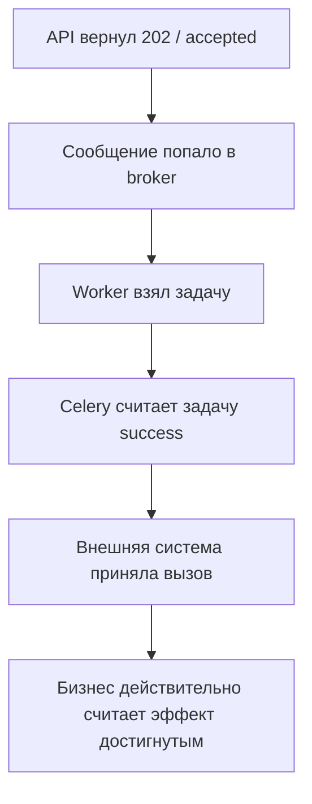
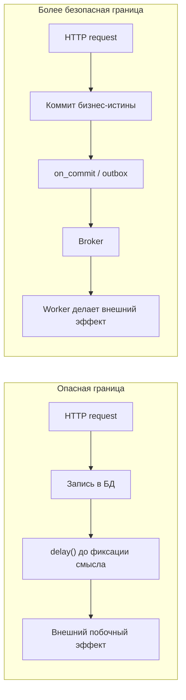
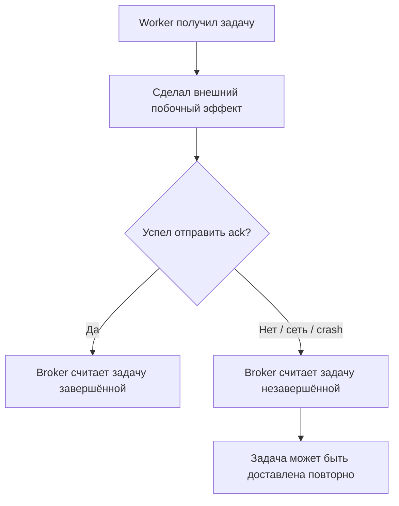

[← Назад к индексу части](index.md)
[↑ К глобальному плану](../../mastery_plan.md)

## 1.3. Базовые ограничения и компромиссы

### Цель раздела

Понять, какие ограничения встроены в саму природу распределённых очередей и Celery-контура: почему at-least-once — это реальность, почему exactly-once почти всегда маркетинговая ловушка, как broker и backend влияют на поведение системы и какую цену мы платим за асинхронность.

### В этом разделе главное

- В большинстве реальных конфигураций Celery живёт в мире **at-least-once**, а не exactly-once.
- Повторы задачи — не аномалия, а нормальное следствие сбоев, таймаутов, потерь ack, рестартов worker-а и retry-логики.
- Асинхронность покупается ценой **eventual consistency**, усложнённой диагностики и размазанной ответственности по компонентам.
- Broker и result backend не "прозрачные детали реализации", а важная часть гарантий и ограничений.
- Критичные бизнес-инварианты нельзя слепо выносить в "удобный фон" без отдельного проектирования.

### Термины

- **At-least-once** — задача будет доставлена как минимум один раз, но возможны повторы.
- **Exactly-once** — идеализированная модель "ровно один раз", очень дорогая и редко достижимая на уровне всей системы.
- **Eventual consistency** — согласованность достигается со временем, а не мгновенно.
- **Failure mode** — типовой режим отказа: потеря worker-а, сетевой разрыв, дублирование доставки, плохой payload.
- **Business invariant** — бизнес-правило, которое нельзя нарушить, например "деньги списать не больше одного раза".

### Теория и правила

#### 1. Почему at-least-once — базовая реальность

Представим ситуацию:

1. worker получил задачу;
2. начал её выполнять;
3. выполнил внешний побочный эффект;
4. упал до того, как broker надёжно зафиксировал подтверждение;
5. broker считает, что задача не подтверждена, и отдаёт её снова.

С точки зрения системы это абсолютно нормальный сценарий. Он и создаёт мир **"как минимум один раз"**.

То есть проблема не в том, что "Celery плохо работает". Проблема в том, что распределённые системы не умеют бесплатно различать:

- "задача не успела начаться";
- "задача успела начать";
- "задача завершила побочный эффект";
- "подтверждение просто потерялось";
- "подтверждение дошло, но наблюдатель об этом не знает".

#### Мини-проверка: at-least-once как реальность

1. Почему повтор задачи может произойти даже без явного `retry()` в коде?

<details><summary>Ответ</summary>

Потому что задача может выполнить побочный эффект, но не успеть подтвердить broker-у завершение из-за crash или сетевого разрыва, после чего будет доставлена снова.

</details>

2. Какой именно разрыв между фактом и знанием о факте создаёт мир at-least-once?

<details><summary>Ответ</summary>

Разрыв между "эффект уже произошёл" и "система надёжно знает, что он произошёл и может это зафиксировать".

</details>

#### 2. Почему exactly-once обычно маркетинговая ловушка

Фраза "ровно один раз" звучит замечательно, но почти всегда требует уточнения:

- ровно один раз **где**;
- ровно один раз **на каком участке**;
- ровно один раз **за счёт чего**;
- ровно один раз **при каких предпосылках**.

Очень часто "exactly-once" в маркетинговом смысле на деле сводится к:

- идемпотентным потребителям;
- дедупликации по ключу;
- ограниченному окну гарантии;
- специальному состоянию в хранилище;
- дорогим транзакциям или узким ограничениям конкретного транспорта.

Практический вывод:

> **В Celery-проектах почти всегда надо проектировать идемпотентность и допускать повторы.**

#### Мини-проверка: exactly-once как ловушка

1. Почему фраза "ровно один раз" без уточнения условий почти бесполезна инженерно?

<details><summary>Ответ</summary>

Потому что нужно знать, на каком участке, за счёт каких механизмов и при каких предпосылках эта гарантия вообще заявляется.

</details>

2. Что обычно скрывается за практическим "почти exactly-once" в реальных системах?

<details><summary>Ответ</summary>

Идемпотентность, дедупликация, ограниченные окна гарантии, состояние в хранилище и дорогие компромиссы по транспорту или транзакциям.

</details>

#### 3. Цена асинхронности

Когда работа уходит из синхронного запроса в Celery, ты получаешь плюсы:

- не блокируешь пользователя;
- можешь пережить кратковременный пик;
- можешь повторять временно неудачные операции;
- можешь масштабировать worker-ы отдельно.

Но платишь за это:

- **eventual consistency**;
- более сложную трассировку причинно-следственной цепочки;
- размазывание логики между API, broker, worker и внешними системами;
- новые failure modes;
- потребность в мониторинге не только приложения, но и очередей.

#### Мини-проверка: цена асинхронности

1. Почему eventual consistency - это не просто "небольшая задержка", а архитектурный компромисс?

<details><summary>Ответ</summary>

Потому что меняются ожидания пользователей и системы: данные и эффекты становятся согласованными не мгновенно, а со временем.

</details>

2. Какой новый класс сложности появляется, когда работа выносится из запроса в Celery?

<details><summary>Ответ</summary>

Появляется распределённая диагностика: нужно отслеживать причинно-следственную цепочку между API, broker, worker и downstream-системами.

</details>

#### 4. Broker и backend влияют на поведение

Celery не существует в вакууме. Его реальное поведение зависит от:

- какого broker-а ты выбрал;
- как настроены подтверждения и prefetch;
- как хранятся результаты;
- как ведут себя сетевые разрывы и рестарты;
- есть ли persistence на стороне broker-а;
- что считается успехом для бизнеса, а что только "сообщение снято с очереди".

Один и тот же код задачи может вести себя очень по-разному на разных контурах.

Полезно держать в голове такую таблицу:

| Подсистема              | На что влияет                                                        | Типичный риск при непонимании                                                            |
| ----------------------- | -------------------------------------------------------------------- | ---------------------------------------------------------------------------------------- |
| **Broker**              | доставка, буферизация, redelivery, backlog, маршрутизация            | команда думает, что "Celery сломался", хотя проблема в транспорте или saturation очереди |
| **Worker**              | модель исполнения, concurrency, memory/CPU pressure, retry-поведение | задачи начинают тормозить или падать под нагрузкой, хотя код сам по себе корректен       |
| **Result backend**      | видимость статуса и результатов, часть orchestration-сценариев       | статусам начинают доверять больше, чем они реально означают                              |
| **Внешняя зависимость** | фактический бизнес-эффект задачи                                     | Celery технически отработал, а бизнес-операция не достигла цели                          |

Отсюда важный вывод:

> **У задачи Celery нет одной "точки истины". Есть несколько уровней истины, и их нужно уметь различать.**

#### Мини-проверка: broker и backend влияют на поведение

1. Почему один и тот же Python-код задачи может вести себя по-разному в разных контурах?

<details><summary>Ответ</summary>

Потому что поведение определяется не только кодом, но и transport-слоем, настройками ack/prefetch, persistence, restart-сценариями и поведением внешних зависимостей.

</details>

2. В чём опасность доверять `result backend` как единственному источнику истины?

<details><summary>Ответ</summary>

Потому что backend знает только о статусе задачи в терминах Celery, но не гарантирует полного понимания бизнес-результата и состояния очередей.

</details>

#### Диаграмма уровней истины: где именно можно ошибиться в интерпретации



Эта цепочка кажется линейной, но в жизни каждый переход может разойтись:

- API уже ответил, а сообщение не дошло до ожидаемого эффекта;
- Celery видит `SUCCESS`, а downstream потом отклоняет операцию;
- внешняя система технически приняла вызов, но бизнес-результат ещё не наступил;
- пользователь думает "всё сделано", хотя система пока только поставила работу в очередь.

Поэтому в Celery-проектах важно всегда уточнять:

- мы говорим про **принятие запроса**;
- про **постановку задачи**;
- про **техническое исполнение**;
- или про **настоящий бизнес-результат**?

Практическое правило общения в команде:

> Вместо фразы "задача успешно выполнена" полезнее говорить точнее:
> "задача поставлена", "задача обработана worker-ом", "внешний API принял запрос", "бизнес-эффект подтверждён".

Эта маленькая дисциплина резко снижает путаницу в инцидентах и обсуждениях.

#### Мини-проверка: уровни истины

1. Почему фраза "задача успешно выполнена" без уточнения уровня может быть вредной?

<details><summary>Ответ</summary>

Потому что она смешивает разные уровни: постановку в очередь, техническое выполнение, ответ downstream и реальный бизнес-результат.

</details>

2. Какой уровень обычно интересует пользователя больше всего: технический статус Celery или бизнес-эффект?

<details><summary>Ответ</summary>

Обычно пользователя интересует именно бизнес-эффект, а не внутренний технический статус обработки задачи.

</details>

#### 5. Нельзя путать удобную асинхронность с критичным бизнес-коммитом

Есть действия, которые можно спокойно делать "чуть позже":

- отправить письмо;
- пересчитать витрину;
- обновить поисковый индекс;
- синхронизировать вторичную систему.

А есть вещи, где нельзя просто сказать: "ну если что, доретраим":

- списание денег без идемпотентного ключа;
- создание юридически значимого документа;
- фиксация критичного инварианта без согласования с первичным коммитом;
- шаг, без которого пользовательский ответ был бы ложью.

#### Мини-проверка: критичные бизнес-инварианты

1. Почему некоторые шаги опасно выносить в фон просто ради отзывчивости интерфейса?

<details><summary>Ответ</summary>

Потому что разрывается синхронная граница правды: пользователь может получить ответ, который не соответствует реально зафиксированному состоянию системы.

</details>

2. Что объединяет платежи, юридически значимые документы и критичные инварианты в контексте Celery?

<details><summary>Ответ</summary>

Для них недостаточно "потом доретраим"; им нужна особенно аккуратная модель согласования, идемпотентности и фиксации бизнес-истины.

</details>

#### Картинка границы: где Celery уместен, а где уже опасно



Смысл диаграммы:

- в левой схеме задача может "убежать вперёд" относительно бизнес-истины;
- в правой схеме сначала фиксируется первичная правда системы, и только потом фон получает право действовать.

Это ещё не полная тема надёжности и outbox-паттерна, но уже правильная картинка в голове для вводной части.

#### Мини-проверка: граница между коммитом и фоном

1. Почему схема `commit -> on_commit/outbox -> broker -> worker` безопаснее прямого `delay()` внутри незафиксированной логики?

<details><summary>Ответ</summary>

Потому что она сначала фиксирует первичную бизнес-правду, и только потом разрешает внешнему фоновому контуру действовать.

</details>

2. Что именно защищает такая граница: транспорт, бизнес-истину или оба уровня?

<details><summary>Ответ</summary>

В первую очередь она защищает бизнес-истину и согласованность между коммитом и последующим фоновым действием.

</details>

### Пошагово

Как мыслить о гарантиях Celery:

1. Прими, что повторы возможны.
2. Определи, какой именно побочный эффект создаёт задача.
3. Спроси: безопасно ли повторить задачу?
4. Если нет, нужен идемпотентный ключ, дедупликация, внешняя защита или иной способ согласования.
5. Затем проверь, где проходит граница между бизнес-истиной и фоновым удобством.
6. Не забывай, что статус в Celery и реальный бизнес-результат — не всегда одно и то же.

### Простыми словами

Celery похож на доставку курьером в непредсказуемом городе.

- Иногда заказ привозят один раз и всё прекрасно.
- Иногда курьер не успел отметить доставку, хотя товар уже передал.
- Иногда курьер исчез, и система решила отправить второго.
- Иногда клиент уже получил товар, а в системе всё ещё "в пути".

Если у тебя доставка пиццы — это неприятно, но терпимо. Если у тебя доставка единственного уникального юридического документа без контроля дублей — уже опасно.

### Картинка в голове



Смысл диаграммы: повтор — это не "редкий баг", а естественное следствие границ системы.

### Как запомнить

> **Celery надёжен не потому, что исключает повторы, а потому, что позволяет с ними инженерно жить.**

И ещё:

> **Асинхронность покупает отзывчивость ценой согласованности и простоты диагностики.**

### Примеры

#### Пример 1. Неидемпотентная задача

```python
@app.task
def charge_card(order_id: int) -> None:
    order = get_order(order_id)
    payment_gateway.charge(order.card_token, order.amount)
```

Если задача выполнится повторно, можно списать деньги дважды.

#### Мини-проверка: неидемпотентная задача

1. Почему именно платежи особенно чувствительны к повторному исполнению задачи?

<details><summary>Ответ</summary>

Потому что внешний эффект финансово значим и повтор создаёт новый ущерб, а не просто дублирует безобидное действие.

</details>

2. Что делает эту задачу опасной даже при "редких" повторах?

<details><summary>Ответ</summary>

Отсутствие внешней защиты от повторов: один и тот же вызов может быть интерпретирован как новое списание.

</details>

#### Пример 2. Более безопасный вариант

```python
@app.task(bind=True, autoretry_for=(TimeoutError,), retry_backoff=True)
def charge_card(self, order_id: int) -> None:
    order = get_order(order_id)
    idempotency_key = f"order-charge:{order.id}"
    payment_gateway.charge(
        token=order.card_token,
        amount=order.amount,
        idempotency_key=idempotency_key,
    )
```

Теперь повтор задачи не обязан приводить к двойному списанию, если внешний сервис уважает idempotency key.

#### Мини-проверка: более безопасный вариант

1. Почему idempotency key не "украшение", а часть архитектурной защиты?

<details><summary>Ответ</summary>

Потому что он помогает связать повторные попытки одной и той же логической операции с одним эффектом, а не с несколькими независимыми действиями.

</details>

2. Достаточно ли одного `autoretry_for`, если внешняя система не умеет уважать idempotency key?

<details><summary>Ответ</summary>

Нет. Retry без защиты от повторного эффекта может только усилить риск дублирования.

</details>

#### Пример 3. Разрыв между статусом задачи и бизнес-истиной

Задача может иметь статус `SUCCESS`, но фактический бизнес-эффект может быть лишь частично достигнут:

- письмо отправлено, но аналитика не обновилась;
- файл выгружен, но ссылка не записалась в БД;
- webhook ушёл, но downstream-система его отвергла по своей бизнес-логике.

Поэтому **статус Celery-задачи не равен автоматически "всё в бизнесе прошло идеально"**.

#### Мини-проверка: разрыв статуса и бизнес-истины

1. Почему `SUCCESS` в Celery ещё не даёт права автоматически считать операцию бизнесово завершённой?

<details><summary>Ответ</summary>

Потому что Celery оценивает техническое исполнение задачи, а не обязательно конечный смысловой эффект во всех downstream-компонентах.

</details>

2. Какой тип ошибок особенно хорошо маскируется за технически успешным статусом задачи?

<details><summary>Ответ</summary>

Частично успешные и смысловые ошибки downstream-систем, где вызов принят, но итог для бизнеса не достигнут.

</details>

### Практика / реальные сценарии

- **Платёжные интеграции**: всегда проектируют идемпотентность, потому что повторы задач недопустимо трактовать как новые платежи.
- **Webhooks**: повторы и отложенная доставка нормальны, поэтому downstream должен уметь дедуплицировать события.
- **Синхронизация каталогов**: eventual consistency терпима, если пользователь не ожидает мгновенного отражения изменений повсюду.
- **Пересчёт рекомендаций**: хороший фон, потому что небольшая задержка согласованности обычно допустима.

### Типичные ошибки

- Верить в "ровно один раз" без уточнения, как это обеспечивается.
- Не проектировать идемпотентность, потому что "у нас же одна очередь и один worker".
- Переносить критичные инварианты в фон только ради отзывчивости интерфейса.
- Считать, что проблема гарантий решается только конфигурацией Celery.
- Игнорировать различие между техническим успехом задачи и бизнес-успехом операции.

### Что будет, если...

1. Что будет, если предположить exactly-once там, где реально at-least-once?
2. Что будет, если вынести в Celery критичный шаг без идемпотентности?
3. Что будет, если не наблюдать broker и очереди, а смотреть только на API-логи?

Коротко:

- система начнёт дублировать эффекты именно в тех случаях, где команда уверена, что "такого быть не может";
- самые болезненные ошибки будут проявляться редко, но дорого;
- инциденты станут плохо диагностируемыми: API уже ответил, а фон живёт своей жизнью, и без метрик очередей картина неполна.

### Проверь себя

1. Почему at-least-once — не "недостаток Celery", а свойство реального распределённого контура?
2. Чем exactly-once как маркетинговый лозунг отличается от инженерной практики?
3. Почему eventual consistency — это не просто "данные обновятся чуть позже", а полноценный архитектурный компромисс?

<details><summary>Ответ</summary>

Потому что даже идеальный код не отменяет сетевые разрывы, падения worker-ов, повторные доставки и рассинхрон между фактическим побочным эффектом и подтверждением broker-у.

</details>
<details><summary>Ответ</summary>

Лозунг обещает простое свойство "ровно один раз", а инженерная практика требует уточнять границы, предпосылки, механизмы дедупликации и цену такой гарантии.

</details>
<details><summary>Ответ</summary>

Потому что она меняет пользовательские ожидания, дизайн интерфейсов, правила работы с побочными эффектами, диагностику и требования к идемпотентности.

</details>

### Запомните

- **В Celery-мире нормальная отправная точка — at-least-once и идемпотентность.**
- **Exactly-once без оговорок почти всегда обманчив.**
- **Асинхронность помогает, но всегда приносит новые failure modes.**

---
