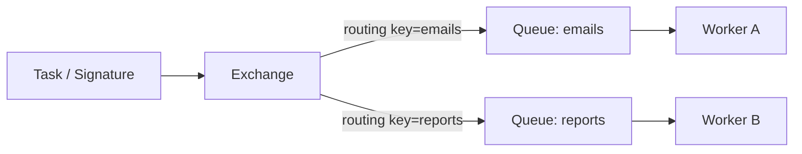

[← Назад к индексу части](index.md)
[↑ К глобальному плану](../celery_mastery_plan.md)

## 1.4. Язык предметной области Celery

### Цель раздела

Собрать и упорядочить базовый словарь Celery, чтобы дальше ты мог уверенно читать документацию, обсуждать настройки с командой и не путать близкие по звучанию, но разные по смыслу понятия.

### В этом разделе главное

- Без правильного словаря невозможно адекватно обсуждать ни конфигурацию, ни инциденты, ни архитектуру Celery.
- Много терминов Celery лежит на пересечении самого фреймворка и конкретного broker-а.
- Особенно важно не путать: `task` и обычную функцию, `queue` и `routing key`, `ETA` и `retry`, `revoke` и "убить выполнение", `ack` и "задача точно бизнесово успешна".
- Термины — это не академическая часть; это рабочие инструменты мышления.

### Термины

| Термин                           | Что это значит                                                                                                                |
| -------------------------------- | ----------------------------------------------------------------------------------------------------------------------------- |
| **Task**                         | Единица фоновой работы, объявленная в Celery.                                                                                 |
| **Signature**                    | Сериализуемое описание вызова задачи с аргументами и опциями.                                                                 |
| **Queue**                        | Логическое место, откуда worker получает задачи.                                                                              |
| **Routing key**                  | Ключ маршрутизации, по которому broker может отправить сообщение в нужную очередь.                                            |
| **Exchange**                     | Сущность broker-а, которая принимает сообщения и направляет их в очереди по правилам маршрутизации.                           |
| **Broker**                       | Посредник для приёма, хранения и доставки сообщений.                                                                          |
| **Result backend**               | Хранилище статусов и результатов задач.                                                                                       |
| **ETA**                          | Выполнить задачу не раньше конкретного времени.                                                                               |
| **Countdown**                    | Выполнить задачу через заданное количество секунд.                                                                            |
| **Retry**                        | Повтор выполнения задачи после ошибки.                                                                                        |
| **Revoke**                       | Пометить задачу отменённой и попытаться не дать ей стартовать.                                                                |
| **Prefetch**                     | Сколько задач worker может забрать заранее.                                                                                   |
| **Acknowledgment / ack**         | Подтверждение broker-у, что сообщение обработано или принято по правилам конкретного контура.                                 |
| **Worker pool**                  | Способ организовать параллельное исполнение в worker-е.                                                                       |
| **Chord unlock**                 | Механизм завершения `chord`: Celery должен понять, что все элементы группы завершились, и только потом пустить callback.      |
| **Dead letter / poison message** | Смежные понятия из мира очередей: сообщение, которое не удаётся обработать и которое нужно изолировать от нормального потока. |

### Теория и правила

#### 1. `task` — это не просто функция

Да, задача может быть объявлена как Python-функция под декоратором. Но в системе Celery она живёт как:

- имя;
- сериализуемые аргументы;
- набор опций выполнения;
- политика retry;
- потенциальный результат;
- единица маршрутизации и наблюдения.

То есть задача — это одновременно **код**, **сообщение** и **операционный объект**.

#### Мини-проверка: `task` как объект системы

1. Почему в Celery задача шире, чем просто функция с аргументами?

<details><summary>Ответ</summary>

Потому что у неё есть имя, сериализация, маршрутизация, политика retry, статус и отдельный жизненный цикл.

</details>

2. Что добавляется к коду задачи, когда она становится объектом распределённой системы?

<details><summary>Ответ</summary>

Транспорт, наблюдаемость, delivery semantics, конфигурация исполнения и работа с отказами.

</details>

#### 2. `signature` — переносимая заготовка вызова

`signature` нужна, когда ты хочешь обращаться не просто к функции, а к описанию её исполнения:

```python
send_email.s(user_id=42)
```

Это важно для цепочек, групп, chord и переиспользуемых композиций. Простыми словами: `signature` — это "подписанный конверт", который можно передавать дальше, комбинировать и запускать позже.

#### Мини-проверка: `signature`

1. Почему `signature` удобнее обычного `delay()` в композициях задач?

<details><summary>Ответ</summary>

Потому что она позволяет обращаться с вызовом как с объектом: передавать, комбинировать и запускать позже в составе цепочек и групп.

</details>

2. Что в ней важно концептуально: сам код или описание будущего исполнения?

<details><summary>Ответ</summary>

Описание будущего исполнения: задача, аргументы и опции в переносимом виде.

</details>

#### 3. `queue`, `exchange`, `routing key`

Тут у новичков часто всё сливается в одно слово "очередь", но роли разные:

- **exchange** принимает сообщение;
- **routing key** помогает решить, куда его направить;
- **queue** хранит сообщение до чтения consumer-ом.

На практике в Redis-transport эта модель может быть скрыта, а в RabbitMQ проявляется явно. Именно поэтому знание чистой терминологии полезно: оно помогает понимать, **что является абстракцией Celery, а что приходит из транспорта**.

#### Мини-проверка: `queue`, `exchange`, `routing key`

1. Почему опасно называть всё подряд просто "очередью"?

<details><summary>Ответ</summary>

Потому что теряются разные роли: приём сообщения, правило маршрутизации и место ожидания consumer-а.

</details>

2. Какое практическое преимущество даёт различение этих терминов?

<details><summary>Ответ</summary>

Оно помогает правильно читать конфигурацию и разбираться, где именно проблема - в маршрутизации, очереди или транспортной модели.

</details>

#### 4. `ETA` / `countdown` не равны scheduler enterprise-класса

`ETA` и `countdown` позволяют отложить запуск конкретной задачи. Это удобно, но не превращает Celery автоматически в систему управления сложными календарями и SLA-планированием. Для одиночных или умеренных отложенных задач это хорошо. Для сложного мира расписаний и процессов иногда нужен другой класс инструмента.

#### Мини-проверка: `ETA` и `countdown`

1. Почему наличие отложенного запуска ещё не означает, что Celery - полноценный scheduler enterprise-класса?

<details><summary>Ответ</summary>

Потому что они решают лишь запуск конкретной задачи позже, но не весь мир сложных расписаний, SLA и управления процессами.

</details>

2. В каком случае возможностей `ETA/countdown` обычно уже недостаточно?

<details><summary>Ответ</summary>

Когда нужны сложные календари, богатые правила планирования, управление долгими процессами и развёрнутая scheduler-логика.

</details>

#### 5. `retry` и `revoke` — не противоположности

- `retry` говорит: "эта задача не завершена успешно, попробуем позже".
- `revoke` говорит: "эту задачу больше не надо запускать", если удастся перехватить её до старта.

Важно: revoke не означает магическую отмену уже завершённого внешнего побочного эффекта.

#### Мини-проверка: `retry` и `revoke`

1. Почему `retry` и `revoke` нельзя воспринимать как зеркальные противоположности?

<details><summary>Ответ</summary>

Потому что один механизм говорит "попробуем ещё раз", а другой - "постараемся не запускать дальше", но они работают на разных этапах жизни задачи.

</details>

2. Что делает `revoke` принципиально ограниченным в системах с внешними побочными эффектами?

<details><summary>Ответ</summary>

Он не умеет отменять уже произошедший внешний эффект, если задача успела его выполнить.

</details>

#### 6. `ack` не равен бизнес-успеху

Очень важно разделять:

- broker считает сообщение подтверждённым;
- Celery считает задачу завершённой;
- бизнес считает операцию успешной.

Это три разных уровня правды.

#### 6.5. `broker` и `result backend`: что чаще всего путают

Очень частая путаница у новичков выглядит так:

- broker воспринимают как "место, где хранятся результаты";
- result backend воспринимают как "то же самое, только для Celery";
- очередь, статус и итог операции мысленно сливаются в один объект.

Правильнее держать в голове такую таблицу:

| Подсистема                        | Главный вопрос, на который она отвечает             | Чего от неё не надо ждать                    |
| --------------------------------- | --------------------------------------------------- | -------------------------------------------- |
| **Broker**                        | "Как задача будет доставлена от producer к worker?" | полного бизнес-статуса и истории результата  |
| **Queue**                         | "Где задача ждёт, пока её возьмут в работу?"        | понимания, успешен ли итог для бизнеса       |
| **Result backend**                | "Что Celery знает о статусе/результате задачи?"     | правды о всей системе и её нагрузке          |
| **Бизнес-хранилище / downstream** | "Достигнут ли реальный эффект?"                     | транспортной информации о доставке сообщения |

Простыми словами:

- **broker** отвечает за дорогу;
- **queue** отвечает за ожидание;
- **result backend** отвечает за видимость статуса задачи;
- **бизнес-система** отвечает за то, произошёл ли реальный смысловой эффект.

Когда эти уровни смешивают, появляются очень вредные фразы вроде:

> "Раз задача есть в backend, значит всё уже произошло".

Именно так рождаются неправильные выводы в эксплуатации.

#### Мини-проверка: `broker` vs `result backend`

1. Почему broker нельзя считать местом хранения полноценного результата задачи?

<details><summary>Ответ</summary>

Потому что его главная задача - доставка и буферизация сообщений, а не хранение полной правды о результате для бизнеса.

</details>

2. Что помогает понять эта четырёхуровневая таблица: транспорт, ожидание, статус или бизнес-эффект?

<details><summary>Ответ</summary>

Она помогает развести все четыре уровня и не смешивать дорогу сообщения, очередь ожидания, технический статус и реальный смысловой эффект.

</details>

#### 7. `prefetch`: почему worker может казаться "жадным"

`prefetch` показывает, сколько задач worker может заранее забрать у broker-а ещё до фактического завершения текущих задач.

Почему это важно:

- слишком большой prefetch может приводить к неравномерному распределению нагрузки;
- длинные задачи начинают "залипать" у одного worker-а;
- очередь снаружи выглядит почти пустой, но работа фактически уже разобрана по исполнителям;
- справедливость между разными типами задач может ухудшаться.

Простыми словами: worker может набрать себе "пачку коробок", хотя ещё не успел их разобрать.

#### Мини-проверка: `prefetch`

1. Почему большой prefetch может визуально "очистить очередь", но не ускорить систему?

<details><summary>Ответ</summary>

Потому что задачи могут быть уже разобраны worker-ами, но ещё не завершены фактически.

</details>

2. Как prefetch связан со справедливостью распределения задач между worker-ами?

<details><summary>Ответ</summary>

Слишком большой prefetch может привести к тому, что один worker заранее заберёт слишком много задач и распределение станет неравномерным.

</details>

#### 8. `dead letter` и `poison message`: где заканчивается "нормальный retry"

Celery сам по себе не отменяет классическую проблему плохих сообщений:

- payload повреждён;
- схема изменилась;
- задача всегда падает на одном и том же аргументе;
- внешний контракт больше несовместим.

Такое сообщение называют **poison message**.  
Если его бесконечно возвращать в тот же поток, оно:

- шумит в логах;
- забивает retry-слот;
- мешает нормальным задачам;
- создаёт иллюзию "система занята полезной работой".

Поэтому в смежных очередных системах используют **dead letter**-механику: плохие сообщения выводятся в отдельный контур разбора. Для понимания Celery это важно уже сейчас, даже если конкретную transport-реализацию мы подробно разберём позже.

#### Мини-проверка: `dead letter` и `poison message`

1. Почему плохое сообщение опасно оставлять бесконечно в основном потоке retry?

<details><summary>Ответ</summary>

Оно шумит, забивает слоты повтора и мешает нормальной работе полезных задач.

</details>

2. Что даёт dead letter-модель по сравнению с бесконечным повтором?

<details><summary>Ответ</summary>

Она изолирует неисправимые сообщения в отдельный контур разбора, не отравляя основной поток обработки.

</details>

#### 9. `chord unlock`: маленький термин с большим operational-смыслом

`chord unlock` кажется экзотикой, но он нужен, чтобы Celery понял: "все элементы группы завершились, можно запускать общий callback".

Почему это важно даже в вводной части:

- новички думают, что `chord` — просто "group + callback";
- на практике между "кажется, все завершились" и "можно безопасно пускать callback" есть отдельная механика синхронизации;
- именно на таких местах особенно видна разница между "красивой API-абстракцией" и реальной распределённой системой под капотом.

#### Мини-проверка: `chord unlock`

1. Почему `chord` нельзя сводить к простой мысли "сначала group, потом callback"?

<details><summary>Ответ</summary>

Потому что системе ещё нужно надёжно понять, что все элементы группы действительно завершились и только тогда запускать общий callback.

</details>

2. Что показывает существование `chord unlock` о природе Celery?

<details><summary>Ответ</summary>

Что под красивым API скрываются реальные механизмы координации распределённого исполнения.

</details>

### Пошагово

Как разбирать незнакомый Celery-код:

1. Сначала найди, где объявлен `Celery app`.
2. Затем посмотри, какие есть `task`.
3. После этого выясни, какие очереди, маршрутизация и transport используются.
4. Дальше проверь, есть ли `result backend` и зачем он вообще нужен.
5. Потом посмотри на `retry`, `ETA`, `countdown`, `expires`, `revoke`.
6. В конце разберись, как задачи компонуются: одиночные вызовы, chain, group, chord, periodic jobs.

### Простыми словами

Язык Celery похож на язык логистики:

- `task` — что нужно доставить;
- `signature` — готовая наклейка на посылку;
- `exchange` — сортировочный центр;
- `routing key` — правило, в какой отсек отправить;
- `queue` — конкретная лента ожидания;
- `worker` — курьер/исполнитель;
- `ack` — отметка "посылка получена";
- `retry` — повторная попытка доставки;
- `revoke` — команда "не отправлять эту посылку";
- `prefetch` — сколько посылок курьер может набрать заранее.

### Картинка в голове



Диаграмма помогает не путать "как называется работа" и "куда она фактически поедет".

### Как запомнить

> **Task = что делать. Queue = где ждать. Worker = кто делает.**

И ещё:

> **Ack подтверждает движение сообщения, а не автоматически смысл операции для бизнеса.**

### Примеры

#### Пример 1. `delay()` и `apply_async()`

```python
send_email.delay(42)

send_email.apply_async(
    args=[42],
    countdown=60,
    queue="emails",
)
```

`delay()` — это короткая форма.  
`apply_async()` — явный вариант, когда нужны параметры маршрутизации и времени.

#### Мини-проверка: `delay()` vs `apply_async()`

1. Когда короткая форма `delay()` перестаёт быть достаточной?

<details><summary>Ответ</summary>

Когда нужны countdown, queue, routing, expires и другие параметры исполнения.

</details>

2. Почему полезно понимать `apply_async()`, даже если в коде часто виден только `delay()`?

<details><summary>Ответ</summary>

Потому что именно `apply_async()` показывает полную модель вызова задачи и её operational-настройки.

</details>

#### Пример 2. `signature`

```python
welcome_email = send_email.s(user_id=42)
welcome_email.apply_async(queue="emails")
```

Теперь вызов можно передавать дальше как объект.

#### Мини-проверка: пример `signature`

1. Почему этот пример полезен именно для ментальной модели, а не только для синтаксиса?

<details><summary>Ответ</summary>

Потому что он показывает: в Celery можно работать не только с исполнением, но и с описанием исполнения.

</details>

2. Что меняется, когда вызов задачи становится объектом, а не мгновенным действием?

<details><summary>Ответ</summary>

Его можно передавать, комбинировать и использовать как строительный блок композиций.

</details>

#### Пример 3. Путаница с `revoke`

Если задача уже стартовала и успела сходить во внешний API, `revoke` не "отменит историю". Он только может помешать дальнейшему запуску или повторному взятию, в зависимости от момента и конфигурации.

#### Мини-проверка: пример с `revoke`

1. Почему у многих возникает ложное ощущение, что revoke умеет "отменять прошлое"?

<details><summary>Ответ</summary>

Потому что слово "отменить" интуитивно звучит как полный rollback, хотя в распределённых системах уже совершённый внешний эффект не исчезает сам.

</details>

2. Какой главный практический вывод нужно вынести из этого примера?

<details><summary>Ответ</summary>

Revoke ограничен по моменту применения и не заменяет архитектуру, учитывающую внешние побочные эффекты.

</details>

### Практика / реальные сценарии

- Команда разбирает инцидент и пишет: "сообщение не дошло до очереди". На деле проблема может быть не в queue, а в routing/exchange.
- Разработчик говорит: "мы отменили задачу". На деле revoke произошёл уже после старта, и внешний эффект уже был сделан.
- Инженер считает, что `SUCCESS` означает "письмо у клиента в inbox", хотя это может означать лишь "SMTP API принял запрос".

### Типичные ошибки

- Путать `queue` с transport-specific деталями маршрутизации.
- Считать `signature` "ненужной сложностью", а потом страдать в Canvas и композициях.
- Думать, что `ETA` и `countdown` решают всю задачу планирования.
- Использовать `result backend` по умолчанию, не задавая вопроса, зачем он нужен.
- Понимать `ack` как "точно всё сделано правильно".

### Что будет, если...

1. Что будет, если команда использует термины Celery неточно?
2. Что будет, если не различать уровни "технический статус" и "бизнес-результат"?
3. Что будет, если разработчик не понимает разницу между routing и queue?

Коротко:

- обсуждения будут расходиться словами, а не решениями;
- инциденты станут тяжелее, потому что люди будут думать, что говорят об одном и том же, хотя нет;
- конфигурация очередей начнёт выглядеть "магической", а изменения станут опасными.

### Проверь себя

1. Почему `task` в Celery шире, чем просто функция Python?
2. Для чего нужен `signature`, если можно просто вызвать `delay()`?
3. Почему термин `ack` нельзя переводить у себя в голове как "всё точно успешно"?

<details><summary>Ответ</summary>

Потому что у задачи есть сериализация, имя, опции исполнения, retry-политика, статус, маршрутизация и отдельная жизнь в распределённом контуре.

</details>
<details><summary>Ответ</summary>

Потому что `signature` позволяет описывать вызов как объект: комбинировать его, передавать, сохранять, использовать в chain/group/chord и запускать позже с дополнительными параметрами.

</details>
<details><summary>Ответ</summary>

Потому что `ack` — это подтверждение на уровне обработки сообщения в транспортном контуре, а не полное доказательство бизнес-успеха всей операции.

</details>

### Запомните

- **Термины Celery нужны не для экзамена, а для правильной инженерной коммуникации.**
- **Особенно важно не путать message-flow термины с бизнес-смыслом операции.**
- **Хорошая терминология защищает от плохой конфигурации и неверных ожиданий.**

---
