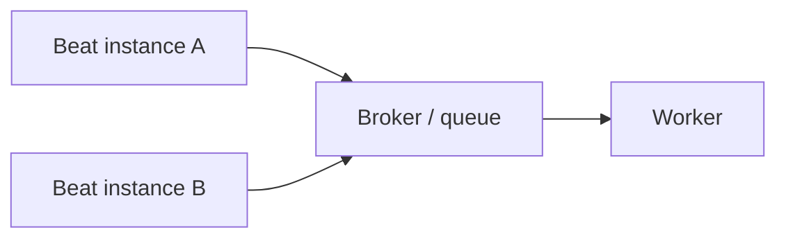
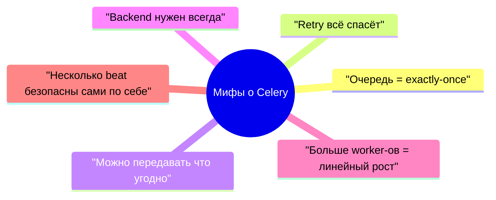

[← Назад к индексу части](index.md)
[↑ К глобальному плану](../mastery_plan.md)

## 1.5. Типичные заблуждения о Celery

### Цель раздела

Разобрать самые распространённые мифы о Celery, показать, почему они возникают, где именно они ломают проектирование, и как формулировать правильную инженерную позицию вместо удобной, но ложной упрощённой модели.

### В этом разделе главное

- Самые болезненные проблемы Celery рождаются не из API, а из **неверных ожиданий**.
- Очередь не гарантирует exactly-once.
- Result backend нужен не всегда и иногда даже вредит.
- Большие payload и ORM-объекты в задачах — один из самых частых источников хрупкости.
- Больше worker-процессов не гарантирует линейного роста производительности.
- Celery beat не становится автоматически безопасным при запуске в нескольких экземплярах.
- Retry не чинит архитектурно неправильную задачу.

### Термины

- **Заблуждение** — ложная ментальная модель, которая внешне похожа на здравый смысл.
- **Payload** — данные, которые ты передаёшь в задачу.
- **Linear scaling** — ожидание, что удвоение ресурсов даст удвоение производительности.
- **Single scheduler assumption** — скрытое предположение, что расписание генерируется одним источником без дублей.

### Теория и правила

#### Заблуждение 1. "Если задача в очереди, она точно выполнится ровно один раз"

Правильнее говорить так:

> "Если задача поставлена в очередь и контур настроен корректно, у неё есть шанс быть доставленной и выполненной, но повторы и сбои всё равно надо учитывать."

Очередь не отменяет:

- повторную доставку;
- сетевые сбои;
- crash worker-а;
- частичные побочные эффекты;
- плохие payload;
- логические ошибки самой задачи.

#### Мини-проверка: миф про "ровно один раз"

1. Почему сама постановка задачи в очередь ещё не делает систему надёжной в бизнесовом смысле?

<details><summary>Ответ</summary>

Потому что очередь решает только часть задачи доставки, но не устраняет повторы, частичные эффекты и ошибки логики самой операции.

</details>

2. Какие два класса проблем остаются даже при корректной очереди: транспортные или смысловые?

<details><summary>Ответ</summary>

Остаются и транспортные проблемы, и смысловые: повторы доставки, сетевые сбои, плохие payload и логические ошибки обработки.

</details>

#### Заблуждение 2. "Result backend обязателен всегда"

Во многих системах результат фоновой задачи вообще не нужен:

- письмо либо отправлено, либо ошибка ушла в лог/алерт;
- webhook ушёл, а повтор и так будет управляться задачей;
- housekeeping-задача нужна как побочный эффект, а не как `return value`.

Result backend полезен, когда:

- ты реально читаешь статус;
- нужен polling по `task_id`;
- нужна оркестрация, завязанная на завершение;
- нужно исследовать итоги выполнения.

Но хранить результаты "на всякий случай" означает:

- тратить хранилище;
- усложнять очистку;
- создавать ложное ощущение наблюдаемости.

Быстрая рамка для решения:

| Вопрос                                                                 | Если ответ "да"                                  | Если ответ "нет"                           |
| ---------------------------------------------------------------------- | ------------------------------------------------ | ------------------------------------------ |
| Нужно ли пользователю или API читать статус по `task_id`?              | backend становится полезным                      | чаще можно жить без него                   |
| Нужен ли `return value` задачи, а не только побочный эффект?           | backend часто оправдан                           | backend может быть лишним                  |
| Есть ли orchestration, которая опирается на завершение задач?          | backend или другая явная механика статусов нужны | нет причин включать его "на всякий случай" |
| Готова ли команда обслуживать retention, очистку и стоимость хранения? | можно включать осознанно                         | лучше не плодить лишний слой               |

Хороший рабочий вопрос звучит так:

> **Кто и зачем будет читать этот результат через сутки, неделю и месяц?**

Если честного ответа нет, `result backend` часто не нужен.

Ещё одна полезная мысль:

> **Result backend не заменяет monitoring.**

Он может хранить статусы и результаты, но не отвечает сам по себе на вопросы:

- почему растёт очередь;
- какой worker тормозит;
- где saturation по инфраструктуре;
- почему одна группа задач стала выполняться в 10 раз дольше.

То есть backend помогает **читать итог отдельных задач**, а monitoring помогает **понимать состояние системы в целом**.

#### Мини-проверка: миф про обязательный backend

1. Почему вопрос "кто будет читать этот результат?" важнее привычки "включим backend на всякий случай"?

<details><summary>Ответ</summary>

Потому что backend нужно оправдать реальным сценарием использования, иначе он создаёт только стоимость и иллюзию пользы.

</details>

2. Что показывает различие между backend и monitoring с точки зрения инженерного мышления?

<details><summary>Ответ</summary>

Что статус отдельных задач и состояние всей системы - это разные уровни наблюдения, которые нельзя смешивать.

</details>

#### Заблуждение 3. "Можно спокойно передавать ORM-объекты и большие бинарные payload"

Передавать нужно **устойчивые идентификаторы и компактные сериализуемые данные**, а не живые объекты из памяти процесса.

Почему:

- ORM-объект нельзя надёжно сериализовать как "живое состояние";
- между отправкой и исполнением данные могут измениться;
- большие payload раздувают broker, замедляют сеть и ухудшают ретраи;
- тесная привязка к внутренней модели усложняет версионирование задач.

Хорошая практика:

- передавать `id`, а не объект;
- перечитывать актуальное состояние внутри задачи;
- бинарные данные хранить отдельно, передавать ссылку или ключ.

#### Мини-проверка: миф про ORM-объекты и большие payload

1. Почему передача ORM-объекта в задачу делает систему хрупкой даже без явной ошибки сериализации?

<details><summary>Ответ</summary>

Потому что состояние объекта может устареть, быть не полностью сериализуемым и слишком тесно связывать producer с внутренней моделью данных.

</details>

2. Какой общий принцип лежит за советом передавать `id` и ссылку, а не тяжёлый объект?

<details><summary>Ответ</summary>

Передавать нужно устойчивые, компактные и переносимые аргументы, а актуальное состояние читать в момент исполнения.

</details>

#### Заблуждение 4. "Если включить больше worker-процессов, будет линейный рост производительности"

На производительность влияют:

- CPU-bound или IO-bound природа задачи;
- ограничения внешней зависимости;
- DB pool и connection limits;
- prefetch и fairness;
- contention за ресурсы;
- overhead сериализации и коммуникации;
- реальная узкая горлышко системы.

Если bottleneck — внешний API с лимитом 100 запросов в минуту, то удвоение worker-ов просто быстрее упрётся в лимит.

#### Мини-проверка: миф про линейный рост производительности

1. Почему увеличение числа worker-процессов не гарантирует ускорения?

<details><summary>Ответ</summary>

Потому что скорость ограничивается не только числом процессов, но и внешними зависимостями, БД, конфигурацией и природой нагрузки.

</details>

2. Какой тип узкого места особенно быстро ломает мечту о линейном масштабировании?

<details><summary>Ответ</summary>

Любая внешняя зависимость с лимитами или узкий ресурс вроде connection pool, CPU bottleneck или rate limit.

</details>

#### Заблуждение 5. "Celery beat автоматически безопасен в нескольких экземплярах"

Если несколько экземпляров `beat` публикуют одни и те же периодические задачи без координации, можно получить дублирование расписания. Это не баг "странного поведения", а естественное следствие нескольких источников планирования.

Полезно представить это визуально:



Если оба `beat` считают, что "сейчас пора публиковать nightly job", worker получит две одинаковые задачи.

Что обычно делают на практике:

- держат **один активный scheduler**;
- используют **внешний orchestrator/scheduler**, если это лучше ложится в инфраструктуру;
- при необходимости добавляют **координацию или лидерство**, чтобы только один экземпляр публиковал периодические задачи.

То есть корректная инженерная формулировка не "Celery beat плох", а:

> **Beat требует осознанной модели единственного источника расписания или координации.**

#### Мини-проверка: миф про безопасность нескольких beat

1. Почему запуск двух `beat` без координации приводит не к "высокой доступности", а часто к дублям?

<details><summary>Ответ</summary>

Потому что оба экземпляра могут независимо решить, что пришло время опубликовать одну и ту же задачу.

</details>

2. Что важнее для периодических задач: количество scheduler-ов или ясная модель единственного источника расписания?

<details><summary>Ответ</summary>

Ясная модель единственного источника расписания или координации между scheduler-ами.

</details>

#### Заблуждение 6. "Retry чинит всё"

Retry полезен против **временных** ошибок:

- network timeout;
- кратковременная недоступность сервиса;
- transient lock;
- временный rate limit.

Retry не лечит:

- неправильный payload;
- баг в коде;
- неидемпотентный побочный эффект;
- неверную бизнес-логику;
- систематически плохую конфигурацию.

#### Мини-проверка: миф про "retry чинит всё"

1. Почему retry помогает только против части ошибок, а не против любой проблемы?

<details><summary>Ответ</summary>

Потому что он эффективен против transient-проблем, но не исправляет неправильные данные, баги и неидемпотентные эффекты.

</details>

2. Что особенно опасно ретраить без разбора: временные сбои или детерминированные ошибки логики?

<details><summary>Ответ</summary>

Детерминированные ошибки логики: retry там только создаёт шум и дополнительную нагрузку.

</details>

### Пошагово

Как проверять свои ожидания от Celery:

1. Найди своё интуитивное убеждение, например: "раз в очереди, значит надёжно".
2. Спроси: какая именно гарантия здесь предполагается?
3. Уточни: на каком уровне она должна держаться — broker, Celery, бизнес?
4. Проверь failure mode, который разрушает это убеждение.
5. После этого замени миф на точную формулировку.

### Простыми словами

Большинство мифов о Celery похоже на детскую веру в то, что если посылку положили на склад, то:

- её точно не потеряют;
- её точно не отправят дважды;
- в коробку можно положить что угодно;
- если нанять больше курьеров, всё станет быстрее;
- если курьер не нашёл адрес, надо бесконечно пытаться снова.

В реальной логистике всё устроено сложнее. В Celery тоже.

### Картинка в голове



### Как запомнить

> **Celery не делает систему магической. Он делает её явной и управляемой, если ты правильно понимаешь ограничения.**

### Примеры

#### Пример 1. Плохой payload

```python
@app.task
def process_order(order):
    ...
```

Проблемы:

- что именно в `order`?
- сериализуется ли он стабильно?
- не устарел ли он к моменту исполнения?
- не раздувает ли он сообщение?

Лучше:

```python
@app.task
def process_order(order_id: int):
    order = load_order(order_id)
    ...
```

#### Мини-проверка: пример плохого payload

1. Почему `order_id` лучше целого объекта `order` в распределённой задаче?

<details><summary>Ответ</summary>

Потому что идентификатор компактен, устойчив и позволяет читать актуальное состояние в момент исполнения.

</details>

2. Какой риск остаётся, даже если большой объект "вроде сериализуется"?

<details><summary>Ответ</summary>

Остаются хрупкость контракта, лишний объём сообщения и риск работы с устаревшим состоянием.

</details>

#### Пример 2. Бесполезный result backend

```python
@app.task
def cleanup_temp_files():
    ...
```

Если никто не читает `AsyncResult`, постоянное хранение результатов этой housekeeping-задачи почти наверняка лишнее.

#### Мини-проверка: пример бесполезного backend

1. Почему housekeeping-задача часто не оправдывает хранение результатов?

<details><summary>Ответ</summary>

Потому что её ценность в побочном эффекте, а не в возвращаемом значении, которое кто-то потом будет читать.

</details>

2. Какой критерий здесь важнее привычки "пусть статус будет на всякий случай"?

<details><summary>Ответ</summary>

Наличие реального потребителя статуса или результата.

</details>

#### Пример 3. Retry не лечит баг

```python
@app.task(bind=True, autoretry_for=(Exception,), retry_backoff=True)
def export_invoice(self, invoice_id: int):
    invoice = get_invoice(invoice_id)
    return invoice.total / 0
```

Если ошибка детерминированная, бесконтрольный retry только создаст шум и нагрузку.

#### Мини-проверка: пример "retry не лечит баг"

1. Почему `autoretry_for=(Exception,)` особенно опасен как слепая настройка?

<details><summary>Ответ</summary>

Потому что под него попадают и временные, и постоянные ошибки, включая баги, которые retry не исправляет.

</details>

2. Что показывает пример с делением на ноль о границе применимости retry?

<details><summary>Ответ</summary>

Что retry не исправляет детерминированный дефект кода и только усугубляет инцидент.

</details>

### Практика / реальные сценарии

- В продукте внезапно появились двойные письма: команда верила в "один раз", а worker падал после внешнего SMTP-вызова.
- Broker распух от задач, потому что в payload клали большие JSON-документы и даже бинарные данные.
- После масштабирования worker-ов throughput не вырос: bottleneck оказался в базе и rate limit внешнего API.
- Два экземпляра beat начали публиковать одни и те же nightly-задачи.

### Типичные ошибки

- Понимать Celery через лозунги, а не через гарантии.
- Делать `autoretry_for=(Exception,)` без разбора класса ошибок.
- Использовать backend "на всякий случай".
- Таскать в задачу большие и хрупкие объекты.
- Масштабировать worker-ы без поиска реального bottleneck.

### Что будет, если...

1. Что будет, если верить в exactly-once и не сделать идемпотентность?
2. Что будет, если хранить результаты всех задач без стратегии retention?
3. Что будет, если настроить бездумный retry на любой Exception?

Коротко:

- начнутся дублирующиеся побочные эффекты;
- backend станет мусорным складом и ложным источником уверенности;
- очередь может забиться неисправимыми задачами, а инцидент будет только усиливаться.

### Проверь себя

1. Почему вера в "очередь всё гарантирует" так опасна?
2. Когда result backend оправдан, а когда нет?
3. Почему "больше worker-ов" не равно "быстрее система"?

<details><summary>Ответ</summary>

Потому что она отключает инженерное мышление о повторах, идемпотентности, сбоях и границах ответственности.

</details>
<details><summary>Ответ</summary>

Когда реально нужно читать статусы, результаты или строить механику вокруг завершения задач. Если это никем не используется, backend часто лишний.

</details>
<details><summary>Ответ</summary>

Потому что производительность ограничивается не только числом процессов, но и природой нагрузки, скоростью внешних зависимостей, БД, сетью, блокировками и конфигурацией.

</details>

### Запомните

- **Самая опасная часть Celery — не API, а ложные ожидания от него.**
- **Retry, backend и масштабирование помогают только при правильной модели задачи.**
- **Передавать надо устойчивые данные, а не живые объекты.**

---
