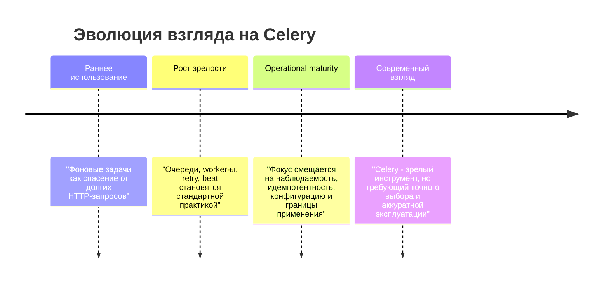

[← Назад к индексу части](index.md)
[↑ К глобальному плану](../celery_mastery_plan.md)

## 1.6. История и эволюция Celery

### Цель раздела

Понять, как Celery появился, как менялся вместе с Python-экосистемой, почему часть старых практик сегодня считается устаревшей, и как это знание помогает аккуратнее относиться к статьям, старым репозиториям и "легендарным" советам из интернета.

### В этом разделе главное

- Celery вырос из практической потребности Python-проектов, особенно веб-проектов, в устойчивой фоновой обработке.
- Исторически Celery тесно ассоциировался с Django, но не ограничивается им.
- За годы у Celery менялись версии, транспорты, рекомендованные практики и отношение к безопасности сериализации.
- Многие старые примеры в интернете всё ещё живы, но часть из них демонстрирует устаревшие подходы.
- Знание эволюции инструмента помогает не тащить в новый проект старые антипаттерны.

### Термины

- **Эволюция инструмента** — изменение возможностей, defaults, рекомендаций и интеграций со временем.
- **Legacy pattern** — старый шаблон использования, который до сих пор встречается в коде, но уже не считается хорошей практикой.
- **Major release** — крупный релиз с возможными несовместимыми изменениями.

### Теория и правила

#### 1. Откуда вырос Celery

Когда Python-веб-приложения начали активно расти, стало ясно, что часть задач не должна жить внутри HTTP-запроса:

- письма;
- индексация;
- отчёты;
- импорты;
- интеграции;
- тяжёлые вычисления;
- периодические housekeeping-задачи.

Нужен был инструмент, который:

- естественно встраивается в Python-код;
- умеет работать через внешние broker-ы;
- позволяет поднимать worker-ы независимо от веб-приложения;
- даёт базовые механики маршрутизации, retry и расписания.

Так Celery занял свою нишу как один из главных Python-инструментов фоновой распределённой обработки.

#### Мини-проверка: откуда вырос Celery

1. Какая практическая боль веб-приложений особенно сильно подтолкнула появление таких инструментов, как Celery?

<details><summary>Ответ</summary>

Необходимость уводить медленную, тяжёлую и ненадёжную работу из request/response в отдельный контур.

</details>

2. Почему потребность "вынести работу из HTTP-запроса" стала системной, а не единичной?

<details><summary>Ответ</summary>

Потому что письма, интеграции, отчёты, импорты и периодические задачи массово повторялись во многих Python-проектах.

</details>

#### 2. Почему Celery часто связывают с Django

Исторически Celery очень часто использовали рядом с Django, потому что:

- Django-проекты быстро упирались в необходимость выносить работу из request/response;
- экосистема Django охотно принимала практики "web + background workers";
- появлялись вспомогательные пакеты вроде `django-celery-results` и `django-celery-beat`.

Но это важно понимать правильно:

> **Celery не равен Django-инструменту. Это общий Python-фреймворк, который просто особенно часто встречался рядом с Django.**

#### Мини-проверка: Celery и Django

1. Почему историческая связка с Django не должна сужать понимание Celery?

<details><summary>Ответ</summary>

Потому что Celery решает общий Python-класс задач и не ограничивается одним фреймворком.

</details>

2. Что именно в экосистеме Django сделало Celery особенно заметным рядом с ней?

<details><summary>Ответ</summary>

Высокая потребность Django-приложений в фоне и появление сопутствующих интеграционных пакетов и практик.

</details>

#### 3. Major-релизы и меняющиеся практики

Подробный список версий мы будем обсуждать отдельно в части про миграции и совместимость. Здесь важна интуиция:

- у Celery были этапы зреления API и operational-практик;
- менялись рекомендуемые версии Python;
- менялись рекомендуемые настройки и способы интеграции;
- старые статьи не всегда отражают современную безопасную практику.

Для учебной ментальной карты достаточно помнить четыре ориентира:

1. **Ранний период** — Celery воспринимают прежде всего как способ вынести тяжёлую работу из веб-запроса.
2. **Период массового внедрения** — очередь, beat, worker-fleet и интеграции с Django становятся "нормой" для многих Python-продуктов.
3. **Период operational-зрелости** — команды понимают, что настоящая сложность не в `@task`, а в идемпотентности, мониторинге, конфигурации, транспортах и миграциях.
4. **Современный взгляд** — Celery рассматривают как зрелый, мощный, но не универсальный инструмент; выбор стал более осознанным, а сравнение с workflow-движками и managed services — обычной практикой.

Что обычно означает **major release** для инженерной команды:

- могут меняться рекомендуемые версии Python;
- могут переименовываться или иначе интерпретироваться конфигурационные параметры;
- могут меняться defaults, которые раньше "молчаливо работали";
- может меняться поддержка или рекомендуемый статус transport/backend-интеграций;
- может ломаться часть operational-привычек: как запускаются worker-ы, как читаются предупреждения, как интерпретируются deprecation notices.

Поэтому major-релиз Celery — это не только "обновить пакет", а обычно:

1. перечитать changelog и notes по миграции;
2. проверить broker/backend-связку;
3. пересмотреть конфиги и deprecations;
4. прогнать реальные сценарии задач, retry и shutdown;
5. только потом считать апгрейд завершённым.

#### Мини-проверка: major-релизы

1. Почему обновление major-версии Celery нельзя сводить к `pip install -U`?

<details><summary>Ответ</summary>

Потому что могут поменяться defaults, конфиги, поведение transport/backend-связок и operational-привычки.

</details>

2. Какие два типа вещей особенно важно перепроверять после major-релиза: кодовые или operational?

<details><summary>Ответ</summary>

И кодовые, и operational: конфигурацию, broker/backend, retry-сценарии, shutdown-поведение и deprecations.

</details>

Типичные исторические ловушки:

- слепое копирование устаревших конфигов;
- использование небезопасной сериализации там, где это не оправдано;
- монолитный `tasks.py`, который со временем превращается в свалку;
- привычка складывать всю бизнес-логику прямо в task, без чистых границ домена и инфраструктуры.

#### 4. Устаревающие паттерны

Особенно часто стоит насторожиться, когда в старом коде или статье видишь:

- чрезмерную ставку на `pickle` без ясной причины и понимания рисков;
- гигантский единый `tasks.py` на сотни задач;
- слабую изоляцию настроек между средами;
- implicit auto-discovery без явного понимания, как задачи импортируются;
- надежду на то, что "worker сам всё решит" без архитектуры вокруг идемпотентности и наблюдаемости.

#### Мини-проверка: устаревающие паттерны

1. Почему legacy-паттерн опасен даже тогда, когда "он всё ещё работает"?

<details><summary>Ответ</summary>

Потому что рабочесть не гарантирует безопасности, поддерживаемости и актуальности практики в современном контексте.

</details>

2. Какой общий признак объединяет `pickle`, гигантский `tasks.py` и надежду на "worker сам всё решит"?

<details><summary>Ответ</summary>

Все они скрывают сложность и откладывают её в будущие проблемы сопровождения и эксплуатации.

</details>

#### 5. Как смотреть на "текущее состояние проекта"

Практически важно не столько помнить наизусть исторические даты, сколько понимать:

- Celery остаётся широко используемым industrial-инструментом;
- его надо оценивать не как "модную новинку", а как зрелый рабочий инструмент с сильной экосистемой и накопленными operational-знаниями;
- при этом зрелость не означает, что любые старые статьи и gist'ы безопасны к копированию.

Что значит "зрелый инструмент" в реальной жизни:

- у него большой объём накопленных production-практик;
- у команд есть опыт эксплуатации Celery годами, а не неделями;
- рядом существует экосистема пакетов, гайдов, operational-рецептов и типовых граблей;
- Celery часто живёт в enterprise-средах не потому, что "идеален", а потому что достаточно силён, понятен и давно проверен.

Но зрелость не надо путать с двумя опасными иллюзиями:

- **"раз зрелый, значит подходит везде"**;
- **"раз старый, значит любые его legacy-практики по-прежнему нормальны"**.

Поэтому современный взгляд на Celery обычно такой:

> **Это промышленный инструмент с долгой историей, который особенно хорош там, где действительно нужен зрелый task queue-контур, но который надо сравнивать с alternatives, а не брать автоматически.**

#### Мини-проверка: текущее состояние Celery

1. Почему зрелость инструмента нельзя путать с универсальностью?

<details><summary>Ответ</summary>

Потому что даже проверенный временем инструмент имеет естественные границы применимости.

</details>

2. Что означает зрелость Celery на практике для инженерной команды?

<details><summary>Ответ</summary>

Что вокруг него есть большой объём operational-знания, но его всё равно нужно сопоставлять с задачей и конкретной версией/контуром.

</details>

#### 6. Release cycle, community vs enterprise usage

Celery важно понимать в двух измерениях одновременно.

С одной стороны, это **community-driven open source проект**:

- развитие идёт через открытое сообщество;
- качество практики сильно поддерживается документацией, issue-tracker-ом, changelog-ами и реальным опытом пользователей;
- некоторые решения и паттерны исторически тянутся долго, потому что вокруг инструмента огромная установленная база.

С другой стороны, Celery давно живёт в **enterprise usage**:

- его эксплуатируют в больших продуктах годами;
- вокруг него накоплены operational-чек-листы, типовые конфигурации и battle-tested практики;
- он часто остаётся в стеке не потому, что "самый модный", а потому что достаточно зрелый и предсказуемый для своей ниши.

Из этого следует правильная инженерная позиция:

- не относись к Celery как к "игрушечному community tool";
- но и не считай, что enterprise-популярность отменяет необходимость читать changelog, deprecations и ограничения конкретной версии;
- опирайся не на мемы про "старый/новый" инструмент, а на совместимость, эксплуатационные знания и соответствие задаче.

#### Мини-проверка: community vs enterprise usage

1. Почему Celery одновременно важно воспринимать и как community-driven, и как enterprise-used инструмент?

<details><summary>Ответ</summary>

Потому что это открытый проект с живой экосистемой и одновременно промышленный инструмент с большим боевым опытом эксплуатации.

</details>

2. Что опаснее: считать его "игрушечным open source" или автоматически "идеальным enterprise-стандартом"?

<details><summary>Ответ</summary>

Обе крайности опасны: первая недооценивает зрелость инструмента, вторая переоценивает его универсальность и снимает критическое мышление.

</details>

### Пошагово

Как правильно использовать историческое знание:

1. Когда читаешь старую статью по Celery, всегда смотри на её дату и стек.
2. Проверяй, не использует ли пример старые transports, устаревшие настройки или небезопасную сериализацию.
3. Не копируй конфигурацию "как есть" только потому, что она популярна в блоге.
4. Разделяй историческую полезность идеи и актуальность конкретного кода.

### Простыми словами

История Celery нужна не ради музейного интереса. Она нужна потому, что интернет полон старых рецептов, а новые команды любят копировать то, что "похоже работает".

Представь, что ты учишься водить автомобиль и читаешь советы по машине двадцатилетней давности:

- часть принципов останется верной;
- часть кнопок окажется не там;
- часть привычек будет уже плохой практикой;
- а некоторые "полезные лайфхаки" окажутся просто опасными.

С Celery ровно так же.

### Картинка в голове



### Как запомнить

> **Старый пример Celery не обязательно плохой, но всегда требует проверки на актуальность.**

### Примеры

#### Пример 1. Монолитный `tasks.py`

В маленьком проекте файл:

```python
# tasks.py
@app.task
def task_a(): ...

@app.task
def task_b(): ...
```

выглядит невинно. В большом проекте через пару лет он часто превращается в огромный файл, где смешаны:

- письма;
- платежи;
- индексирование;
- выгрузки;
- housekeeping;
- интеграции.

Это уже признак не "простоты", а организационного долга.

#### Пример 2. Старый совет "используйте pickle, так проще"

Да, технически иногда так проще. Но простота сериализации не отменяет:

- риски безопасности;
- хрупкость контрактов;
- плохую межсервисную переносимость;
- зависимость от внутренних Python-структур.

#### Пример 3. Старые статьи про "Celery всё оркестрирует"

Исторически многие команды пытались расширить Celery до универсального workflow-движка. Это полезный опыт, но не обязательно лучший выбор сегодня.

#### Мини-проверка: старые примеры и legacy

1. Почему пример из старой статьи может быть полезным как идея, но опасным как шаблон?

<details><summary>Ответ</summary>

Потому что принцип может оставаться ценным, а конкретная реализация уже не соответствовать современным практикам и ограничениям.

</details>

2. Что общего у монолитного `tasks.py`, `pickle` и "Celery всё оркестрирует"?

<details><summary>Ответ</summary>

Это примеры исторически понятных, но сегодня рискованных или чрезмерно упрощающих паттернов.

</details>

### Практика / реальные сценарии

- В legacy-проекте используют старый набор настроек и никто уже не помнит, почему именно так. Историческое понимание помогает отличить "это обязательно" от "это просто пережиток".
- Команда мигрирует старый Django-монолит и находит гигантский `tasks.py` с импортами всего мира. Здесь важно видеть, что проблема не в Celery как таковом, а в накопившейся структуре проекта.
- Новичок читает старую статью и копирует insecure serialization, потому что "в комментариях все хвалили". Историческая грамотность здесь защищает от плохого наследования практик.

### Типичные ошибки

- Думать, что любая статья про Celery одинаково актуальна.
- Слепо копировать старые конфиги и transports.
- Принимать legacy-структуру проекта за "рекомендованную".
- Не отличать историческое происхождение паттерна от его современной ценности.

### Что будет, если...

1. Что будет, если строить новый проект по старым рецептам без проверки актуальности?
2. Что будет, если не понимать, какие практики исторически устарели?
3. Что будет, если воспринимать широкую популярность Celery как доказательство, что он подходит для любой задачи?

Коротко:

- появятся устаревшие конфиги, плохая структура кода и повышенные риски;
- команда потратит время на борьбу не с предметной задачей, а с наследием чужих решений;
- инструмент начнут применять шире его естественной зоны полезности.

### Проверь себя

1. Зачем вообще изучать историю Celery, если нам нужен современный проект?
2. Почему тесная связь Celery с Django исторически понятна, но не должна сужать картину?
3. Какой признак старого примера в интернете должен заставить тебя насторожиться первым делом?

<details><summary>Ответ</summary>

Чтобы уметь отличать устойчивые принципы от устаревших реализаций и не копировать legacy-паттерны бездумно.

</details>
<details><summary>Ответ</summary>

Потому что Django часто нуждался в фоне и поэтому породил много практик рядом с Celery, но сам Celery остаётся общим Python-инструментом и не ограничивается Django-миром.

</details>
<details><summary>Ответ</summary>

Отсутствие проверки версии стека, небезопасная сериализация, монолитные файлы задач, старые настройки broker/backend и любой конфиг, который объясняется фразой "так исторически принято".

</details>

### Запомните

- **Celery — зрелый инструмент, а не модная новинка, но зрелость не равна универсальности.**
- **История важна для распознавания legacy-паттернов и устаревших советов.**
- **Старые примеры полезны как контекст, но не как слепой шаблон.**

---
