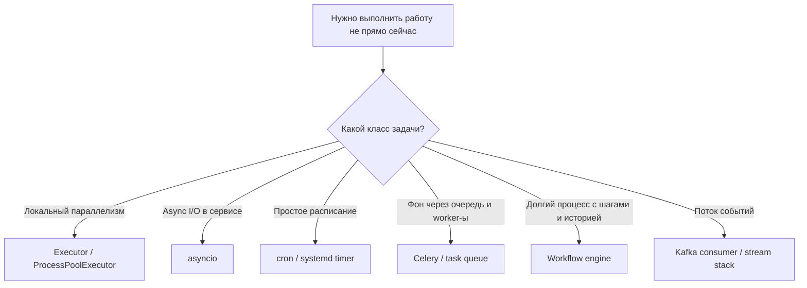

[← Назад к индексу части](index.md)
[↑ К глобальному плану](../celery_mastery_plan.md)

## 1.7. Celery и соседние абстракции Python

### Цель раздела

Научиться сравнивать Celery с близкими по назначению инструментами и абстракциями: `concurrent.futures`, `ProcessPoolExecutor`, `asyncio`, `cron`, отдельными batch-процессами, workflow-движками и альтернативными очередными решениями. Цель не в том, чтобы объявить Celery "лучшим", а в том, чтобы уметь выбирать по задаче.

### В этом разделе главное

- Celery — не замена всему миру асинхронности и параллелизма в Python.
- `asyncio` решает кооперативную асинхронность внутри процесса; Celery решает распределённую фоновую обработку через очередь.
- `ProcessPoolExecutor` и `concurrent.futures` хороши для локального параллелизма, но не дают broker, маршрутизации и очередной эксплуатации.
- `cron` и отдельный batch-процесс часто выигрывают по простоте.
- Workflow-движки нужны для процессов, а Celery — для задач.
- Выбирать надо по критериям: распределённость, retry, observability, стоимость, тип нагрузки, длительность жизни процесса, требования к истории и управляемости.

### Термины

- **Executor** — абстракция локального параллельного исполнения.
- **Coroutine** — единица кооперативной асинхронности в `asyncio`.
- **Batch process** — отдельный процесс, запускаемый под задачу или расписание.
- **Orchestration** — управление последовательностью и состоянием процесса.
- **Observability** — наблюдаемость: логи, метрики, статусы, события, трассировка.

### Теория и правила

#### Сравнительная таблица

| Инструмент                                       | Что решает хорошо                                                                                      | Где слаб                                                                       | Когда выбирать                                                                           |
| ------------------------------------------------ | ------------------------------------------------------------------------------------------------------ | ------------------------------------------------------------------------------ | ---------------------------------------------------------------------------------------- |
| **Celery**                                       | Фоновые распределённые задачи, retries, очереди, periodic tasks, независимое масштабирование worker-ов | Сложность эксплуатации, eventual consistency, слабее как workflow engine       | Когда нужна именно queue-driven обработка с worker-ами                                   |
| **`concurrent.futures` / `ProcessPoolExecutor`** | Локальный параллелизм в одном приложении                                                               | Нет broker, очередей, распределённости, слабая эксплуатационная модель         | Когда задача живёт в рамках одного процесса/хоста                                        |
| **`asyncio` + фоновые воркеры**                  | Неблокирующий I/O внутри процесса, сервисы с большим числом одновременных ожиданий                     | Не решает сам по себе распределённую доставку и worker-fleet модель            | Когда нужен асинхронный сервис, но не обязательно внешний broker                         |
| **`cron` / `systemd timer`**                     | Простые периодические задания, высокая прозрачность                                                    | Слабая гибкость очередей, poor fit для burst-нагрузки и сложной маршрутизации  | Когда нужно просто запускать задачу по расписанию                                        |
| **RQ / Huey / Dramatiq / Arq**                   | Более лёгкие или более узко ориентированные task queue-решения для части сценариев                     | Обычно уже по возможностям или operational-экосистеме, зависит от стека и нужд | Когда Celery кажется тяжёлым, а требования умеренные или стек диктует более лёгкий выбор |
| **Airflow / Prefect**                            | Планирование и оркестрация data/workflow-пайплайнов                                                    | Избыточны для обычных фоновых задач API-продукта                               | Когда первична оркестрация, DAG и observability процесса                                 |
| **Temporal**                                     | Долговременные workflow с историей, retries, compensation и stateful orchestration                     | Более высокий порог входа и другой класс системы                               | Когда нужен именно процессный движок, а не просто task queue                             |
| **Kafka consumer**                               | Потоковое потребление событий, consumer groups, stream-style обработка                                 | Это не прямая замена Celery по модели задач                                    | Когда доминирует event streaming, а не классические background jobs                      |
| **Managed queues / cloud-native jobs**           | Меньше собственной инфраструктуры, легче старт в облаке                                                | Могут быть уже по гибкости, привязывают к платформе и модели облака            | Когда команда хочет меньше сопровождать broker сама                                      |

#### Мини-проверка: сравнительная таблица

1. Почему таблицу сравнения нельзя читать как "кто лучше вообще", а надо читать как "кто лучше под задачу"?

<details><summary>Ответ</summary>

Потому что инструменты лежат на разных уровнях задач и делают разные компромиссы, а не соревнуются в одном измерении.

</details>

2. Какой главный вопрос помогает быстро отделить Celery от workflow engine и stream-стека?

<details><summary>Ответ</summary>

Что находится в центре модели: отдельная queue-driven задача, долгий процесс со состоянием или поток событий.

</details>

#### Критерии выбора в одном месте

| Критерий                                                         | Если ответ "да", Celery становится сильнее | Если ответ "нет", чаще смотри на альтернативы            |
| ---------------------------------------------------------------- | ------------------------------------------ | -------------------------------------------------------- |
| Нужна распределённая очередь между producer и worker             | Да                                         | Локальный executor, `asyncio`, batch-процесс             |
| Нужны retries, delayed execution и несколько классов worker-ов   | Да                                         | `cron`, простой worker, облачный scheduler               |
| Есть готовность сопровождать broker и monitoring                 | Да                                         | Managed services или более простой инструмент            |
| Нужен именно task queue, а не долгий процесс с историей          | Да                                         | Workflow engine                                          |
| Задачи естественно независимы и хорошо ложатся в background jobs | Да                                         | Возможно синхронный вызов или иной процессный инструмент |

#### Мини-проверка: критерии выбора

1. Почему вопрос "есть ли очередь между producer и worker?" так хорошо отделяет Celery от части альтернатив?

<details><summary>Ответ</summary>

Потому что именно очередь как отдельная сущность является центральной архитектурной идеей task queue-контуров.

</details>

2. Зачем в критериях выбора отдельно вынесена готовность сопровождать broker и monitoring?

<details><summary>Ответ</summary>

Потому что эксплуатация - часть решения; если команда не готова к ней, технически красивый выбор может стать организационно плохим.

</details>

#### Celery vs `concurrent.futures`

`ProcessPoolExecutor` отвечает на вопрос: "как мне распараллелить работу локально?"  
Celery отвечает на вопрос: "как мне вынести работу в отдельный распределённый контур с очередями и operational-моделью?"

Если не нужен broker, не нужен отложенный запуск и нет независимого worker-fleet, Celery может быть слишком тяжёлым.

#### Мини-проверка: Celery vs `concurrent.futures`

1. Почему локальный executor не надо считать "бедной версией Celery"?

<details><summary>Ответ</summary>

Потому что он честно решает другую задачу - локальный параллелизм без распределённого контура.

</details>

2. Что является решающей границей между этими инструментами?

<details><summary>Ответ</summary>

Наличие внешнего broker-а, очереди и независимого fleet worker-ов.

</details>

#### Celery vs `asyncio`

`asyncio` помогает эффективно выполнять много I/O-операций в одном процессе без блокировки.  
Celery помогает вынести работу в отдельные процессы и машины, через broker и очередь.

Можно использовать их вместе:

- API-сервис написан на async stack;
- тяжёлую или надёжно ретраимую фоновую работу он отдаёт в Celery.

То есть это не всегда конкуренты. Часто они отвечают на **разные уровни архитектуры**.

#### Мини-проверка: Celery vs `asyncio`

1. Почему async-приложение всё ещё может нуждаться в Celery?

<details><summary>Ответ</summary>

Потому что async I/O внутри процесса не заменяет очередь, worker-ы, retries и отдельный жизненный цикл фоновой обработки.

</details>

2. В чём ключевое различие между event loop и task queue-контуром?

<details><summary>Ответ</summary>

Event loop организует неблокирующее выполнение внутри процесса, а task queue организует распределённое фоновое исполнение между процессами и инстансами.

</details>

#### Celery vs `cron`

Если задача проста и периодична, `cron` часто лучше.  
Если задача должна:

- стоять в очереди;
- ретраиться;
- перераспределяться по worker-ам;
- маршрутизироваться;
- жить в нескольких классах нагрузки;

тогда Celery получает преимущество.

#### Мини-проверка: Celery vs `cron`

1. Почему `cron` часто выигрывает именно своей ограниченностью?

<details><summary>Ответ</summary>

Потому что при простой задаче ограниченность означает прозрачность, меньшую стоимость и меньше инфраструктуры.

</details>

2. Какой тип усложнения обычно переводит задачу из `cron` в Celery?

<details><summary>Ответ</summary>

Появление очереди, bursts, retries, разбиения на множество единиц работы и отдельных классов worker-ов.

</details>

#### Celery vs отдельный batch-процесс

Это сравнение часто недооценивают, хотя оно очень практичное.

Отдельный batch-процесс хорош, когда:

- работа запускается по явному событию или расписанию, но не требует очереди как буфера;
- весь объём данных можно обработать в одном управляемом запуске;
- прозрачность одного процесса важнее, чем fleet worker-ов;
- не нужно дробить обработку на множество independently retried задач.

Celery выигрывает, когда:

- работа естественно распадается на много независимых единиц;
- полезно растягивать нагрузку по времени и worker-ам;
- важны повторные попытки не на уровне всего batch, а на уровне отдельных задач;
- backlog сам по себе становится управляемой сущностью.

Простыми словами:

- **batch-процесс** — это "поехал один большой поезд и везёт весь состав";
- **Celery** — это "много отдельных посылок, которые можно распределять, повторять и отслеживать поштучно".

Если тебе не нужна поштучная queue-driven модель, отдельный batch-процесс может быть честнее и дешевле.

#### Мини-проверка: Celery vs batch-процесс

1. Почему единый batch-запуск иногда лучше множества отдельных задач?

<details><summary>Ответ</summary>

Потому что он проще, прозрачнее и не требует queue-driven раздробления, если работа естественно живёт как один управляемый запуск.

</details>

2. Какой главный признак говорит, что уже нужен Celery, а не один batch-процесс?

<details><summary>Ответ</summary>

Потребность в поштучном управлении, retries и распределении множества независимых единиц работы.

</details>

#### Celery vs workflow engine

Ключевое различие:

- Celery — **про исполнение задач**;
- workflow engine — **про управление процессом**.

Если процесс:

- длится долго;
- включает человека;
- требует версионирования шагов;
- нуждается в сохранении полной истории и компенсаций;

то workflow engine часто честнее и дешевле по итоговой сложности.

#### Мини-проверка: Celery vs workflow engine

1. Почему compensation и история процесса тянут архитектуру от Celery к workflow engine?

<details><summary>Ответ</summary>

Потому что они требуют явного управления шагами, состоянием и воспроизводимостью процесса, а не просто запуска фоновых задач.

</details>

2. Какой вопрос быстрее всего выявляет, что ты уже не про задачи, а про процесс?

<details><summary>Ответ</summary>

"Нужно ли мне управлять жизнью долгого процесса со статусами и версиями, а не просто исполнять отдельные работы?"

</details>

### Пошагово

Как выбирать между Celery и соседями:

1. Определи, тебе нужен локальный параллелизм, асинхронность в процессе, периодический запуск, очередная фоновая обработка или workflow.
2. Если нужен локальный параллелизм — смотри executor-ы.
3. Если нужен неблокирующий I/O внутри сервиса — смотри `asyncio`.
4. Если нужен простой периодический запуск — смотри `cron`.
5. Если нужен queue-based фон и fleet worker-ов — смотри Celery.
6. Если нужен управляемый долгоживущий процесс — смотри workflow engine.

### Простыми словами

Не стоит сравнивать Celery со всем подряд как "что лучше". Это всё равно что спорить:

- грузовик лучше или поезд;
- будильник лучше или календарная система предприятия;
- курьер лучше или конвейер на складе.

Ответ всегда один: **зависит от задачи**.

Celery — это скорее **служба распределённой доставки и выполнения посылок**.  
`asyncio` — это **хорошо организованная работа внутри одного офиса**.  
`cron` — это **будильник по расписанию**.  
Workflow engine — это **система управления целым производственным процессом**.

### Картинка в голове



### Как запомнить

> **Celery — это про queue-driven tasks. Не про любую асинхронность и не про любой процесс.**

### Примеры

#### Пример 1. `asyncio` не заменяет Celery автоматически

```python
async def send_webhook(payload):
    async with httpx.AsyncClient() as client:
        await client.post("https://partner/api", json=payload)
```

Этот код делает I/O неблокирующим внутри процесса. Но он сам по себе не даёт:

- очереди;
- независимых worker-ов;
- отложенного запуска;
- retry-политики уровня task queue;
- операционной модели "запрос завершился, а работа живёт дальше".

#### Мини-проверка: пример `asyncio` не заменяет Celery

1. Почему неблокирующий HTTP-вызов ещё не превращает систему в queue-driven фон?

<details><summary>Ответ</summary>

Потому что это всё ещё выполнение внутри процесса, без broker-а, очереди и независимых worker-ов.

</details>

2. Какой missing-piece в примере особенно важен для Celery-мышления?

<details><summary>Ответ</summary>

Отсутствие отдельного жизненного цикла задачи: очереди, retries, delayed execution и независимого fleet исполнителей.

</details>

#### Пример 2. `ProcessPoolExecutor` не равен Celery

```python
from concurrent.futures import ProcessPoolExecutor

with ProcessPoolExecutor(max_workers=4) as pool:
    futures = [pool.submit(cpu_heavy_fn, item) for item in items]
```

Это хороший способ локально распараллелить CPU-задачу. Но это не система очередей и не распределённый fleet worker-ов.

#### Мини-проверка: пример `ProcessPoolExecutor`

1. Почему этот пример хорош именно как локальный инструмент, а не как упрощённый Celery?

<details><summary>Ответ</summary>

Потому что он прозрачно даёт локальный параллелизм без лишней инфраструктуры.

</details>

2. Какую задачу он решает честно, не притворяясь распределённой системой?

<details><summary>Ответ</summary>

Распараллеливание вычислений внутри одного приложения/хоста.

</details>

#### Пример 3. Когда `cron` красивее Celery

```bash
0 3 * * * /usr/local/bin/python /srv/app/scripts/build_nightly_report.py
```

Если nightly report — одиночная операция без хитрой маршрутизации, такое решение может быть честнее и легче в сопровождении.

#### Мини-проверка: пример с `cron`

1. Почему этот пример полезен как антидот против reflex "всё завернём в Celery"?

<details><summary>Ответ</summary>

Потому что показывает: простая периодическая задача может не нуждаться в очереди и fleet worker-ов вообще.

</details>

2. Какой основной критерий здесь работает сильнее всего: мода или соответствие задаче?

<details><summary>Ответ</summary>

Соответствие задаче: здесь выигрывает более простой и прозрачный инструмент.

</details>

### Практика / реальные сценарии

- **FastAPI-сервис** использует `asyncio` для входящего I/O и Celery для тяжёлых фоновых интеграций: это не конфликт, а удачное разделение слоёв.
- **Data-команда** пытается строить сложный DAG на Celery, а затем переезжает на Airflow/Prefect, потому что им важнее история и оркестрация пайплайна.
- **Небольшой продукт** начинает с `cron`, а переходит на Celery только тогда, когда появляются bursts, очереди, независимые worker-ы и потребность в ретраях.

### Типичные ошибки

- Сравнивать инструменты по лозунгу "что современнее", а не по классу задачи.
- Выбирать Celery там, где нужен просто executor или `cron`.
- Пытаться заменить workflow engine набором Celery-задач и ручных таблиц состояний без осознанного решения.
- Считать `asyncio` "асинхронной заменой Celery", хотя это разные уровни задачи.

### Что будет, если...

1. Что будет, если спутать локальный параллелизм и распределённую очередь?
2. Что будет, если использовать Celery вместо workflow engine для длительного процесса?
3. Что будет, если использовать workflow engine там, где достаточно Celery?

Коротко:

- получишь либо избыточную инфраструктуру, либо недостающие гарантии;
- начнёшь строить вручную историю процесса и компенсации;
- либо, наоборот, переплатишь сложностью и порогом входа за простые фоновые задачи.

### Проверь себя

1. Чем `asyncio` и Celery отличаются по уровню решаемой проблемы?
2. Почему `cron` иногда лучше Celery, хотя формально "проще"?
3. Какой главный критерий отделяет task queue от workflow engine?

<details><summary>Ответ</summary>

`asyncio` организует асинхронность внутри процесса и event loop, а Celery организует распределённую фоновую обработку через broker и worker-ы.

</details>
<details><summary>Ответ</summary>

Потому что простота — это не недостаток, а важный архитектурный ресурс. Если задача действительно простая и периодическая, `cron` может дать лучшую прозрачность и меньшую стоимость сопровождения.

</details>
<details><summary>Ответ</summary>

Наличие явного долгоживущего процесса с состоянием, шагами, историей, версиями и компенсациями. Если нужен именно такой процесс, одной task queue обычно мало.

</details>

### Запомните

- **Celery — один из инструментов вокруг асинхронности, а не "правильная асинхронность вообще".**
- **Сравнивай инструменты по классу задачи, а не по громкости названия.**
- **Простой инструмент часто лучше сложного, если он решает задачу полностью.**

---
