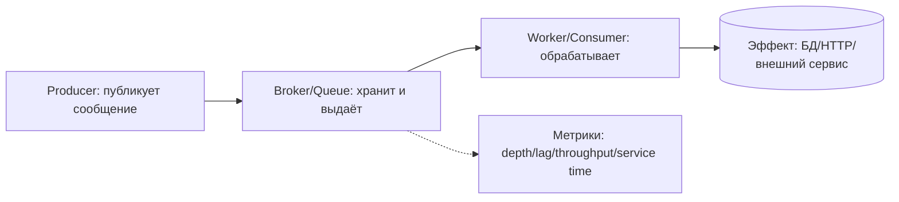

[← Назад к индексу части](index.md)
[↑ К глобальному плану](../mastery_plan.md)

## 2.1. Базовые концепции систем очередей

### Цель раздела

Понять, что очередь — это инженерный механизм развязки и буфер, а не «магическая надёжность». Ты должен уметь объяснить роли producer/consumer, смысл queue depth/lag/throughput и почему decoupling всегда имеет цену в виде очереди (а значит — ожидания и потенциальных задержек).

### В этом разделе главное

- Очередь — это **буфер** между скоростью производства и скоростью потребления.
- Decoupling позволяет разнести по времени, нагрузке и ответственности producer и consumer.
- Message — единица работы, которая несёт тело и метаданные доставки.
- Метрики очереди (queue depth, lag, throughput, service time) помогают «видеть» перегрузку до того, как SLA рухнет.

### Термины

- **Producer-consumer модель** — архитектурный паттерн, где producer производит сообщения, а consumer их забирает и обрабатывает.
- **Decoupling** — развязка по времени/нагрузке/ответственности, чтобы поломка или перегрузка одной стороны не мгновенно ломала другую.
- **Queue depth** — текущий размер очереди.
- **Lag** — отставание (обычно измеряется по времени отправки сообщения).
- **Throughput** — скорость обработки сообщений.
- **Service time** — среднее время обработки сообщения одним consumer-ом.

### Теория и правила

#### Producer-consumer и развязка

Представь очередь как «промежуточный склад» между двумя цехами:

- producer кладёт «корзины» (сообщения) на склад;
- consumer берёт корзины и выполняет работу.

Пока consumer успевает — корзины быстро заканчиваются и очередь почти пустая. Когда consumer медленнее — очередь растёт. Это не «ошибка очереди», а естественное следствие несовпадения скоростей.

#### Push vs pull-like модели

В системах очередей обычно используется **pull-like** потребление: consumer «забирает» сообщения, когда готов работать (часто с prefetch/QoS контролем).

Push-like поведение (когда производитель «выталкивает» работу напрямую в исполнение) обычно приводит к тому, что нагрузка начинает «пробивать» систему каскадами: если consumer не готов, всё начинает тормозить синхронно.

Правило: очередь полезна как buffer именно потому, что потребление контролируемо со стороны consumer.

#### Message как единица работы

Сообщение в очереди — не просто «текст». Это:

- payload (что надо сделать),
- метаданные доставки (например, идентификаторы, headers, время публикации),
- информация, которая позволяет брокеру управлять видимостью/повторной доставкой.

Поэтому «хрупкость payload» (слишком большой объект, несериализуемые типы) в итоге становится проблемой delivery. Это не часть API Celery, но это часть реальности очередей.

#### Queue depth, lag, throughput, service time как карта здоровья

Эти метрики связаны:

- **Service time** задаёт «насколько быстро consumer может сделать одно сообщение».
- **Throughput** — «сколько сообщений обработано в единицу времени» (зависит от service time и параллелизма).
- **Queue depth** — «сколько накопилось работы в ожидании».
- **Lag** — «сколько времени сообщение ждало до начала обработки».

Если `publish rate` (скорость публикации) выше, чем достижимый `throughput`, очередь неизбежно растёт, а lag растёт вместе с ней. На уровне SLA это часто означает «всё вроде живо, но ответы приходят слишком поздно».

Похожая интуиция: очередь — это измеритель **производственного разрыва**. Если разрыв большой и не закрывается — система деградирует.

### Пошагово: как мыслить очередью на пальцах

1. Определи `что является сообщением` (какой эффект/операция внутри payload).
2. Оцени `service time` (сколько времени в среднем занимает обработка) и возможные пики.
3. Посмотри на `throughput` (сколько сообщений в секунду реально обрабатывается сейчас).
4. Сравни с `publish rate` (сколько сообщений публикует producer).
5. Если publish > throughput, ожидай рост queue depth и лаг.
6. При росте очереди обязательно думай о backpressure/торможении (это будет в 2.7).

### Простыми словами

#### Проверь себя (2.1. пошаговое мышление)

1. Какие две метрики чаще всего первыми заметно растут, когда publish rate становится выше реальной мощности consumer-ов?

Ответ

Обычно первыми заметно растут `queue depth` и `lag`: очередь наполняется, а время ожидания увеличивается.

2. Почему после роста `queue depth` важно думать не только о worker-ах, но и об ограничении входа (backpressure)?

Ответ

Потому что рост depth означает дисбаланс скоростей. Даже если worker-ов прибавить, downstream может оставаться bottleneck, и очередь продолжит расти. Backpressure тормозит приток, чтобы очередь снова стала «буфером», а не источником задержек.

Очередь — это не «второй процесс», который автоматически решает всё. Это «копилка ожидания». Если деньги (работа) приходят быстрее, чем их тратят (обрабатывают), копилка растёт — и клиент/бизнес начинает ждать.

### Картинка в голове

### Как запомнить

Очередь = `buffer` + `измеритель разрыва скоростей`.

### Примеры

#### Пример 1: отправка писем (batch-подобный workload)

- Producer получает событие: «пользователь зарегистрирован».
- В очередь кладётся сообщение: `{user_id, template, event_time}`.
- Worker отправляет email.

Если внешний почтовый сервис начинает отвечать медленно:

- service time растёт,
- throughput падает,
- queue depth растёт,
- lag растёт,
- письма начинают приходить «позже», даже если всё программно исправно.

#### Пример 2: синхронизация данных

Иногда «обработка» небыстрая из-за чтения из БД/внешнего API. Очередь помогает:

- разорвать request/response цикл,
- перераспределить нагрузку по time,
- пережить всплеск публикации.

Но она не отменяет физику: backlog всё равно появится, если consumer не тянет.

#### Проверь себя (2.1. примеры)

1. В примере с письмами почему рост `service time` приводит к росту `lag`, хотя «всё программно исправно»?

Ответ

Потому что растёт реальная стоимость обработки: `service time` увеличивается, throughput становится ниже publish rate, и сообщения копятся. Это копится именно как рост очереди и времени ожидания, то есть `lag`.

2. В примере с синхронизацией данных очередь «помогает» чем, и почему backlog всё равно возможен?

Ответ

Очередь помогает разорвать request/response по времени и выдержать всплеск публикации, перераспределяя нагрузку во времени. Но если downstream/БД/HTTP не способен обеспечить требуемый throughput, backlog возникает неизбежно — очередь только откладывает выполнение.

### Практика / реальные сценарии

- В проде часто видят рост `queue depth`, но ошибочно думают «значит broker медленный».
- Правильнее: рост depth означает, что есть дисбаланс: **скорость публикации выше скорости обработки** (или service time увеличился).

### Типичные ошибки

- Считать очередь «надежной страховкой от задержек»: она лишь откладывает нагрузку.
- Измерять только throughput и игнорировать lag/queue depth.
- Не различать service time (стоимость обработки сообщения) и latency в очереди (время ожидания).

#### Проверь себя (2.1. типичные ошибки)

1. Почему «измерять только throughput» опасно, когда SLA измеряет latency (а не скорость обработки)?

Ответ

Потому что latency часто определяется временем ожидания в очереди (`lag`), которое может расти даже при неплохом среднем throughput. Если очередь копит работу, клиент начинает ждать дольше.

2. Что обычно происходит, если считать очередь «страховкой» и ничего не делать с входом (backpressure)?

Ответ

Очередь превращается из буфера в источник хронических задержек: backlog растёт, лаг увеличивается, downstream получает устойчивое давление. В итоге SLA рушится, а ошибки могут привести к повторным попыткам и каскадной деградации.

### Что будет если...

... producer начинает публиковать быстрее, чем consumer способен обработать:

- очередь будет расти,
- lag будет нарастать,
- SLA будет рушиться,
- при попытке «лечить» увеличением числа worker-ов можно получить ещё больший storm повторов (когда люди начнут включать retry без идемпотентности — это 2.5/2.4).

#### Проверь себя (2.1. последствия)

1. Почему при дисбалансе publish rate > throughput добавление worker-ов не всегда помогает?

Ответ

Потому что лимит может быть в downstream (DB/HTTP/внешних сервисах): при росте параллельности service time увеличивается, а throughput не масштабируется пропорционально. Тогда backlog продолжает расти.

2. Какой смысл backpressure в этом сценарии «очередь растёт»?

Ответ

Backpressure ограничивает приток задач, чтобы очередь снова стала буфером. Если вход не ограничивать, очередь перестаёт сглаживать пики и превращается в источник хронической latency (lag).

### Проверь себя

1. Почему queue depth — не просто «сколько сообщений», а диагностический индикатор?

Ответ

Потому что depth напрямую отражает разницу между скоростью публикации и скоростью обработки. Если depth растёт устойчиво, значит throughput consumer-а не покрывает publish rate или service time увеличился.

2. Чем отличается service time от lag?

Ответ

Service time — время обработки сообщения consumer-ом. Lag — время ожидания сообщения в очереди до старта обработки (до того, как consumer его взял).

### Запомните

Очередь показывает **разрыв скоростей** и делает ожидание измеримым. Это первый шаг к корректной диагностике и к проектированию backpressure.

---
