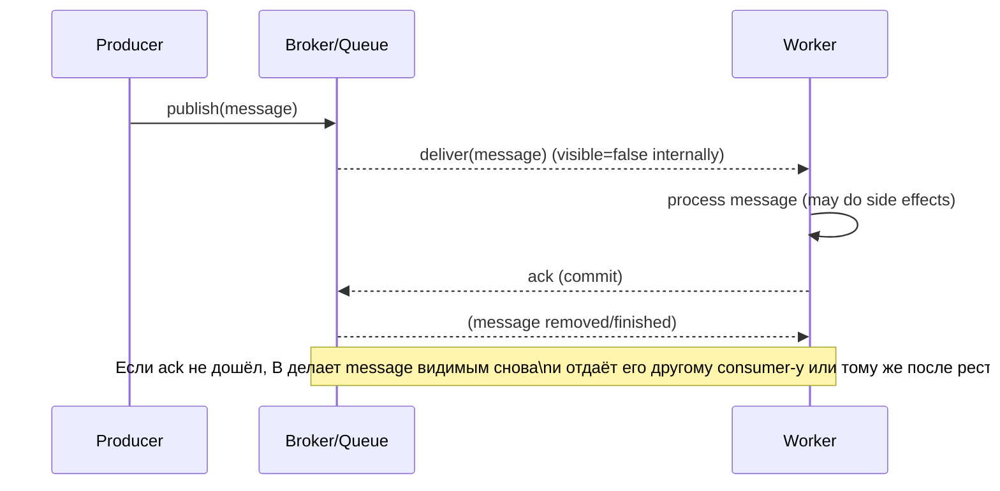

[← Назад к индексу части](index.md)
[↑ К глобальному плану](../celery_mastery_plan.md)

## 2.2. Семантика доставки

### Цель раздела

Понять, почему в очередях почти всегда реалистична семантика **at-least-once**, и научиться объяснять «откуда берутся дубликаты». Ты должен уметь связать это с **ack/commit** и с понятием **видимости сообщения** (visibility) и **redelivery**.

### В этом разделе главное

- `At-least-once` означает: сообщение будет обработано как минимум один раз, но возможно повторно.
- Дубликаты не обязательно зло — это нормально, если бизнес-эффект спроектирован идемпотентным.
- `Ack` — точка ответственности: до ack сообщение может быть доставлено повторно.
- Понятие visibility (и истечение visibility timeout) объясняет, когда сообщение становится доступным снова.

### Термины

- **At-most-once** — «выполнится 0 или 1 раз».
- **At-least-once** — «выполнится минимум 1 раз, возможно больше».
- **Visibility** — состояние сообщения: «видимо/невидимо» для consumer.
- **Redelivery** — повторная доставка сообщения.
- **Ack/commit point** — момент времени, когда система считает сообщение «обработанным».

### Теория и правила

#### Почему вообще появляются дубликаты

В распределённой системе всегда возможны ситуации:

- consumer начал обработку,
- но ack не дошёл до broker из-за сети/падения процесса/timeout,
- broker не может быть уверен, что обработка завершена,
- поэтому сообщение становится доступным снова (redelivery).

Чтобы гарантировать «не потерять работу», система выбирает стратегию, при которой лучше выполнить повторно, чем потерять. Это и есть основа `at-least-once`.

#### At-most-once vs At-least-once

Семантика `at-most-once` звучит красиво, но на практике её сложно обеспечить, не потеряв при сбоях.

`At-least-once` — это компромисс: система допускает дубликаты, но снижает риск потери.

В контексте Celery это означает: ты не можешь проектировать задачи как «идеально однократное выполнение». Система будет вести себя так, будто повторы возможны всегда, пока не доказано обратное на уровне приложения.

#### Ack как точка ответственности

Смысл ack можно описать просто:

- Пока ack не отправлен (или не признан), broker не принимает решение «работа точно выполнена».
- Следовательно, если worker умер до ack, message можно увидеть снова.

Поэтому инженерное правило:

> Если бизнес-эффект нельзя повторять — делай его идемпотентным или защищай на уровне downstream/БД.

#### Видимость сообщения и повторная доставка

У многих брокеров есть концепт visibility/timeout:

- сообщение выдано consumer-у (становится «невидимым» для других),
- если за время обработки ack не пришёл, сообщение считается «не выполненным»,
- оно возвращается в доступность и может быть выдано снова.

Это объясняет: «почему дубликаты возникают после сбоя» без мистики.

### Пошагово: как объяснить delivery-сбой

1. Спроси: где именно могло «потеряться» решение — до ack, после ack или где-то между?
2. Определи: был ли side effect (побочный эффект) до момента отправки ack?
3. Если side effect произошёл, а ack — нет, ожидай дубликаты.
4. Если ack произошёл, но side effect не завершился — ожидай «потерю эффекта», которую нужно устранять на уровне идемпотентности/компенсаций.

### Простыми словами

#### Проверь себя (2.2. пошаговый разбор delivery-сбоя)

1. Почему важно различать «ack не дошёл» и «ack дошёл, но side effect не завершён»?

Ответ

Потому что это две разные зоны ответственности delivery semantics. В первом случае возможны redelivery (дубликаты), значит бизнес-эффект должен переживать повтор. Во втором случае дубликаты менее вероятны, но становится вероятной рассинхронизация результата/статуса — нужны компенсации и идемпотентное восстановление.

2. Какой вопрос помогает определить, что нужно исправлять: retry policy или идемпотентность/компенсации?

Ответ

Нужно спросить: «что произошло с внешним side effect в реальности?» Если side effect мог повториться — думай про идемпотентность. Если side effect завершился, но система не зафиксировала это — думай про компенсации и согласование результата/статуса, а не только про retry.

Очередь как диспетчер: пока он не получил подтверждение «всё сделано», он считает задачу не завершённой. Если worker исчез — диспетчер отправит «задачу снова», потому что терять нельзя.

### Картинка в голове

### Как запомнить

Ack — это «точка, после которой broker уверен». До неё — дубликаты возможны.

### Примеры

#### Пример: worker упал после внешнего вызова, но до ack

Сценарий:

- Worker начал задачу и сделал внешнее действие (например, отправил письмо).
- Затем process упал (или сеть оборвалась).
- Ack не отправился.

Broker считает, что задача не завершена, и выполнит её снова.

Если письмо можно отправлять дважды — это ошибка. Если эффект идемпотентен (например, письмо отправляется по уникальному ключу и второй раз будет проигнорирован) — система переживёт дубликаты.

#### Пример: retry как «второй шанс диспетчера»

Retry policy в очередях обычно не «чинит» бизнес, но даёт повторные попытки для transient ошибок. Для permanent ошибок тебе нужна separate стратегия (quarantine/DLQ часто обсуждается позже, здесь достаточно мыслить «не надо ретраить бесконечно» — это связано с failure modes и backpressure).

#### Проверь себя (2.2. примеры)

1. Почему пример с падением worker «после внешнего вызова, но до ack» обычно нельзя решать одним только `retry`?

Ответ

Потому что повтор доставки может повторить уже выполненный внешний side effect. `Retry` может помочь только с transient ошибками execution, но если side effect уже произошёл, безопасность повторов требует идемпотентности (или дедупликации/уникального ключа) на уровне side effect/приёмника.

2. В чём смысл фразы «retry — второй шанс диспетчера», если система всё равно at-least-once?

Ответ

Смысл в том, что retry возвращает system control: даёт очереди/worker возможность повторно попытаться обработать сообщение при временной ошибке delivery/execution. Но at-least-once означает: повторов нельзя избежать полностью, поэтому бизнес-эффект должен быть устойчивым к повтору (идемпотентность).

### Практика / реальные сценарии

Инциденты часто выглядят так:

- «В логах задача дважды»
- «Но мы же видим retry?»
- На самом деле — redelivery из-за того, что ack потерялся или упала часть контура.

Теперь ты можешь классифицировать: это delivery layer проблема (2.2/2.4), или задача сама делает side effect незащищённо (2.5).

### Типичные ошибки

- Путать «статус успешного выполнения» со «внешний эффект гарантированно один раз».
- Делать side effects до идемпотентной защиты.
- Ожидать at-most-once «по умолчанию» от очереди.

#### Проверь себя (2.2. типичные ошибки)

1. В чём практическая разница между «задача успешна» и «внешний side effect выполнен ровно один раз»?

Ответ

Задача может быть помечена как успешная в логике приложения, но внешний side effect мог повториться из-за delivery semantics и потери/несинхронизации ack/результата. Поэтому успех задачи ≠ гарантия exactly-once внешнего эффекта: безопасность повторов должна обеспечиваться идемпотентностью/компенсациями.

2. Почему предположение «at-most-once по умолчанию» делает бизнес-контракты хрупкими?

Ответ

Потому что в очередях при сбоях реалистично получить дубликаты (ближе к at-least-once). Если бизнес-операция не защищена идемпотентностью, эти дубликаты превращаются в повторные записи/начисления/уведомления.

### Что будет если...

... не спроектировать идемпотентность:

- дубликаты превращаются в повторное нанесение ущерба (двойные записи, двойные начисления, двойные уведомления).

... спроектировать идемпотентность только на стороне broker, а не на стороне приложения:

- broker может переотправить сообщение, но если application не защищено — side effect повторится.

#### Проверь себя (2.2. последствия)

1. Почему «идемпотентность на стороне broker» всё равно оставляет риск повторного side effect?

Ответ

Потому что broker отвечает за delivery semantics (ack/redelivery), но не за бизнес-логику приложения. Если приложение не умеет безопасно переживать повтор вызова, повтор delivery повторит внешнее действие.

2. Какой эффект делает дубликаты реальной угрозой именно для бизнес-контрактов?

Ответ

Дубликаты становятся угрозой, когда бизнес-эффект не спроектирован как идемпотентный или когда нет корректных компенсаций/согласования результата и статуса. Тогда повтор delivery меняет состояние бизнеса дважды.

### Проверь себя

1. Почему `at-least-once` часто выгоднее, чем попытка «строгого exactly-once»?

Ответ

Потому что strict exactly-once почти всегда требует сложных протоколов/координации и может снизить доступность или привести к потерям при сбоях. `At-least-once` выигрывает в простоте и надёжности доставки, а дубликаты решаются идемпотентностью на уровне приложения.

2. Где обычно «ломается» идея «задача выполнится один раз»?

Ответ

В моменте после побочного эффекта и/или вокруг ack. Если side effect произошёл, а ack не дошёл, broker будет доставлять повторно.

### Запомните

Доставка в очередях — это мир `at-least-once`. Твоя задача — сделать бизнес-эффект безопасным к повторам.

---
