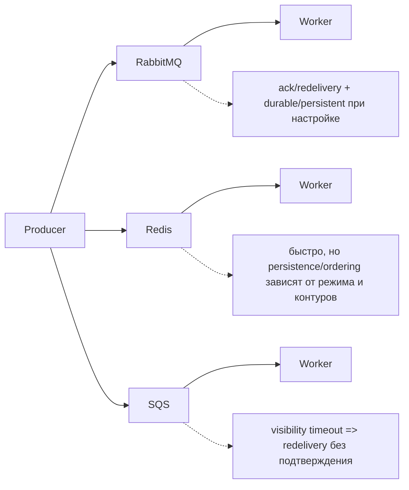

[← Назад к индексу части](index.md)
[↑ К глобальному плану](../../mastery_plan.md)

## 2.3. Виды очередей и брокеров

### Цель раздела

Уметь сравнить типичные варианты broker/queue рядом с Celery и объяснить, как их особенности влияют на поведение доставки, latency, устойчивость и требования к приложениям.

### В этом разделе главное

- RabbitMQ — broker, ориентированный на AMQP, с развитой топологией и ack-поведением.
- Redis часто используют как быстрый in-memory store, но нужно понимать ограничения (особенно по устойчивости/памяти/долговременным гарантиям).
- Amazon SQS — managed очередь с ключевым механизмом visibility timeout, влияющим на redelivery.
- Латентность, persistence, ordering и priority support — реальные факторы компромиссов.

### Термины

- **AMQP-oriented broker** — брокер, чья модель доставки и топология построены вокруг AMQP-понятий.
- **In-memory store** — хранение в памяти (быстро, но зависит от persistence режима и рисков рестартов).
- **Managed queue** — управляемая сервисом очередь, где часть поведения «зашита» в платформу.
- **Visibility timeout** — время, после которого сообщение возвращается в видимость, если ack/подтверждение не состоялось.
- **Persistence** — устойчивое хранение сообщений (уменьшает риск потери при перезапусках).

### Теория и правила

#### RabbitMQ как AMQP-oriented broker

RabbitMQ ориентирован на модель exchanges/queues/bindings. Это важно, потому что:

- можно проектировать топологию маршрутизации (какая очередь получит message);
- можно управлять durable queues и persistent messages;
- ack/redelivery тесно связаны с тем, когда consumer подтверждает обработку.

Компромиссы: latency и ops complexity обычно выше, чем у «простых in-memory» решений, но это платёж за функциональность и предсказуемость при сбоях.

#### Redis как быстрый in-memory store (часто broker/backend)

Redis часто используют из-за простоты старта и высокой скорости:

- latency обычно низкая,
- модель проще «на первый взгляд».

Но нужно помнить:

- persistence и режим хранения зависят от настроек,
- большие очереди могут упираться в память и производительность,
- ordering и priority могут быть ограничены или не совпадать с ожиданиями «как в AMQP».

В итоге: Redis может быть отличным выбором для старта, но на long-term production нужно понимать требования к delivery guarantees и риски рестартов.

#### Amazon SQS как managed queue

SQS — managed подход. Он ценен тем, что:

- вы не управляете брокером (меньше ops),
- сервис сам справляется со многими деталями доступности.

Ключевой элемент — **visibility timeout**:

- после доставки consumer «скрывает» сообщение на время обработки,
- если в течение visibility timeout не произошло подтверждение/ack (в терминах SQS — не было delete сообщения),
- сообщение станет видимым снова и будет доставлено повторно.

Ordering и priority зависят от типа очереди (standard/FIFO) и требований, но важно знать: «строгий порядок» часто либо отсутствует, либо оплачивается снижением параллелизма.

### Пошагово: как выбрать тип очереди под ожидания

1. Сформулируй бизнес-эффект и допустимость повторов.
   - Если повтор опасен без идемпотентности, тебе важнее предсказуемость `redelivery` и согласованная модель подтверждения (2.2/2.5).
2. Определи, какой уровень persistence ожидаешь.
   - Нужна ли устойчивость при рестартах очереди, или достаточно мягких гарантий и компенсации на уровне приложения?
3. Уточни требования к упорядочиванию.
   - Глобальный порядок почти всегда будет ограничивать throughput (2.6). Обычно проектируют порядок по ключу.
4. Проверь модель видимости/повторной доставки.
   - Для SQS ключевой фактор — visibility timeout: когда сообщение «возвращается» к потребителям.
5. Сопоставь требования к latency и ops complexity.
   - Managed решения проще в эксплуатации, но имеют модель стоимости и ограничения операций.

### Простыми словами

#### Проверь себя (2.3. пошагово: выбор broker)

1. Почему выбор broker «только по latency в среднем» легко приводит к сюрпризам в production?

Ответ

Потому что средняя скорость не отражает поведение при сбоях: именно тогда проявляются persistence/visibility, ack/redelivery и backlog. Поэтому система может выглядеть нормально «на дистанции», но ломать SLA при деградациях.

2. На каком шаге Poshagovo ты явно связываешь broker-выбор с тем, когда сообщения «возвращаются» к потребителям?

Ответ

На шаге 4 про visibility/pовторную доставку: для SQS ключевой фактор — `visibility timeout`, а для других broker-ов схожую роль играют ack/redelivery semantics.

Разные брокеры по-разному отвечают на два вопроса:

- «когда система считает сообщение выполненным» (и запускает удаление/ack),
- «как система ведёт себя при сбоях» (persistence, visibility timeout, восстановление).

Поэтому выбор брокера — это перевод бизнес-требований в модель доставки и подтверждений.

### Картинка в голове

### Как запомнить

RabbitMQ — ближе к «AMQP-предсказуемости и топологии», Redis — к «простоте/скорости» с вниманием к persistence и лимитам, SQS — к «managed-очереди» с visibility timeout.

### Примеры

1. **Уведомления (email/SMS)**: часто выбирают managed-подход (например, SQS), но обязательно проектируют идемпотентность по idempotency key, потому что дубликаты возможны.
2. **Фоновая обработка с потребностью в durable поведении**: RabbitMQ выбирают, когда важны предсказуемые модели durable queues/persistent messages и ack/redelivery.

#### Проверь себя (2.3. примеры)

1. Почему в примере с email/SMS ключевой риск — дубликаты, а не строгий порядок?

Ответ

Потому что для уведомлений обычно важнее «не потерять событие» и «не выполнить опасно повторно». Порядок доставок редко критичен как контракт, а повторное выполнение чаще управляется идемпотентностью/ключами.

2. Почему во втором примере про durable поведение важны именно механизмы persistence и ack/redelivery?

Ответ

Потому что durable/persistence и момент ack определяют, что произойдёт при рестартах и сбоях: будут ли сообщения переживать перезапуски и когда они считаются обработанными. Это напрямую влияет на надёжность доставки и отсутствие неожиданной redelivery.

### Практика / реальные сценарии

- Если ты строишь систему с требованиями к сохранности и управлению redelivery — выбор брокера будет влиять на то, как часто тебе приходится «держать» идемпотентность и какие задержки ты увидишь.
- Если твой основной сценарий — быстрое выполнение команды «здесь и сейчас без сложных гарантий», Redis может быть стартовым.
- Если ты хочешь управляемую очередь и меньше ops — SQS часто логичен.

Но всегда есть вопрос: что именно означает «доставка надёжна» для твоего бизнеса? Это связь с 2.2/2.4/2.5.

### Типичные ошибки

- Считать, что «быстрый брокер» автоматически означает «надёжная доставка» (не всегда).
- Не учитывать persistence и поведение при рестартах.
- Считать, что ordering/priority гарантируются так же, как в «однопоточном выполнении».

#### Проверь себя (2.3. типичные ошибки)

1. Что опаснее: выбрать «быстрый» broker без понимания delivery semantics или без контроля persistence/visibility?

Ответ

В большинстве случаев опаснее неразобранность именно delivery semantics и persistence/visibility при сбоях: это напрямую влияет на redelivery/повторы и на то, как система будет восстанавливаться. Скорость в среднем может быть приемлемой, но в инцидентах поведение меняется и превращается в дубликаты/потери.

2. Почему приоритеты (priority) чаще требуют контрактного дизайна приложения?

Ответ

Потому что параллельность worker-ов, разные service time и redelivery ломают ожидание «всегда обработаем самое важное первым». Если нужен строгий эффект, порядок/очередность обычно обеспечивают топологией и ключами, а priority используют как эвристику.

### Что будет если...

... выбрать broker, не подходящий по требованиям к persistence/visibility:

- увеличится вероятность неожиданной redelivery (или наоборот — возрастёт риск потери, если система неправильно использует модель подтверждения);
- придётся сильнее полагаться на идемпотентность/дедупликацию;
- диагностика инцидентов станет сложнее, если ты не понимаешь, где broker «прячет» сообщения.

#### Проверь себя (2.3. последствия)

1. Почему проблемы с неподходящим broker по persistence/visibility часто проявляются именно в инцидентах, а не при «здоровой» нагрузке?

Ответ

Потому что в штатном режиме доставка может выглядеть стабильной: сообщения быстро обрабатываются и ack/удаление происходит в срок. При сбоях (рестарты, таймауты, недоступность downstream) активируются механизмы повторной доставки и видимости, и тогда начинают проявляться redelivery/потери/задержки.

2. Какой тип защиты ты должен выбрать: «верить в идемпотентность» или одновременно обеспечить идемпотентность и быструю диагностику?

Ответ

Нужно и то, и другое: идемпотентность защищает бизнес-эффект от повторов, а диагностика помогает быстро определить failure mode и скорректировать стратегии retry/backpressure. Без диагностики ты можешь усиливать неправильные механизмы и ухудшать ситуацию.

### Проверь себя

1. Как visibility timeout связан с появлением дублей?

Ответ

Если consumer не удалил/подтвердил сообщение до истечения visibility timeout, сообщение снова становится видимым. Это и приводит к redelivery и возможным дубликатам.

2. Почему ordering — это не то же самое, что «сообщения идут в том же порядке, в каком их отправили»?

Ответ

Потому что ordering зависит от модели брокера и топологии consumer-ов. При параллельной обработке и разных путях доставки порядок нарушается, если гарантии не зафиксированы и не обеспечены явно.

### Запомните

Брокер — это не «адрес для очереди», а часть delivery semantics. Его особенности определяют, насколько часто (и в каких сценариях) тебе придётся защищаться от повторов и задержек.

---
