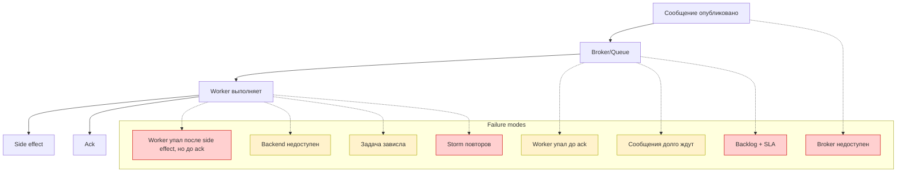

[← Назад к индексу части](index.md)
[↑ К глобальному плану](../mastery_plan.md)

## 2.4. Модели отказов

### Цель раздела

Научиться диагностировать сбои по классам: понять, какие failure modes возникают в контуре producer/broker/worker/result backend, и как они отражаются на бизнес-сценарии (дубликаты, потери, задержки, зависания, SLA).

### В этом разделе главное

- Failure modes различаются по тому, кто именно «не успел»: worker до ack, worker после побочного эффекта до ack, broker недоступен, backend результатов недоступен.
- «Зависание задачи» и «задача слишком долго ждёт в очереди» — разные проблемы.
- storm повторов и рост backlog — отдельные классы последствий, которые часто начинаются с неправильной стратегии retry/идемпотентности/backpressure.

### Термины

- **Failure mode** — конкретный способ сбоя, описывающий: где сломалось и какой эффект это даёт.
- **Backlog** — накопленная очередь/необработанные сообщения.
- **Storm повторов** — лавинообразное увеличение повторов задач (часто из-за слишком агрессивного retry и отсутствия ограничений).

### Теория и правила

#### Карта failure modes

В production важно уметь ответить на вопрос: «что именно сломалось — worker, broker, backend, или очередь перегружена?»

Ниже — failure modes из плана, которые ты должен уметь узнавать по симптомам.

1) **Worker упал до ack**

Смысл: worker не успел подтвердить обработку.

- Вероятно, broker увидит message снова (redelivery).
- Поскольку side effect мог не завершиться — возможна «доставка повторно» без полного эффекта, но на практике проверять надо по бизнес-логике.

2) **Worker упал после побочного эффекта, но до ack**

Смысл: side effect уже сделан, но ack потерян.

- Это классический сценарий «дубликаты возможны» (2.2).
- Именно здесь идемпотентность и дедупликация решают бизнес проблему.

3) **Broker недоступен**

Смысл: сообщения не могут быть доставлены/хранятся/маршрутизируются.

- Producer может не публиковать, или публикация будет лаговать/падать.
- Работы могут копиться или теряться — в зависимости от модели подтверждения публикации.

4) **Backend результатов недоступен**

Смысл: worker может выполнить задачу, но результат/статус не сохраняются.

- Ты можешь получить сложности с наблюдаемостью и состояниями задач.
- Важный нюанс: бизнес-эффект может быть уже выполнен, а «для системы» это выглядит как ошибка хранения результата.

5) **Задача зависла**

Смысл: worker взял сообщение и «не вернул контроль».

- Это может выглядеть как рост очереди и лаг, потому что throughput падает.
- Может быть «всё стоит», но broker при этом доступен — проблема в execution/коде/зависимостях.

6) **Задача слишком долго ждёт в очереди**

Смысл: delivery доставила message, но он лежит. Это симптом перегрузки/дисбаланса.

- Обычно это означает publish rate > throughput или service time вырос.
- SLA ломается не потому что «задача упала», а потому что она слишком долго не начала выполняться.

7) **Возникает storm повторов**

Смысл: retry policy порождает экспоненциальный/лавинообразный рост попыток.

- Это опасно для downstream систем: внешние API начинают получать слишком много запросов.
- Если нет circuit breaker/backoff/rate limiting, система «самоуничтожается».

8) **Нарастает backlog и SLA рушится**

Смысл: backlog растёт настолько, что задержка становится бизнес проблемой.

- Очередь начинает превращаться из буфера в «главный источник задержки».

### Пошагово: как диагностировать инцидент в контуре очередей

1. Определи наблюдаемую проблему: дубликаты? задержки? потеря? отсутствие статуса?
2. Сопоставь с ожидаемыми failure modes:
   - есть ли side effect «внешне» даже когда задачи выглядят «неуспешно» (→ likely worker-after-side-effect-before-ack)?
   - растёт ли queue depth/lag (→ перегрузка/зависания или backend/broker проблемы)?
   - видишь ли лавину повторов (→ storm retry)?
3. Уточни «точку ответственности»:
   - broker/queue отвечает за доставку и redelivery,
   - worker отвечает за выполнение и ack,
   - backend отвечает за сохранение статусов/результатов (и наблюдаемость).
4. После классификации — выбирай паттерн ответа:
   - идемпотентность/дедупликация для дубликатов,
   - backpressure/circuit breaker/rate limiting для storm/overload.

### Простыми словами

#### Проверь себя (2.4. пошаговая диагностика)

1. Почему в диагностике инцидента в очередях важно начинать с наблюдаемого симптома, а не сразу с предположения «worker виноват»?

Ответ

Потому что разные failure modes дают разные комбинации симптомов: дубликаты/потери/зависания/backlog/storm повторов указывают на разные зоны ответственности (delivery vs execution vs backend). Старт с симптома помогает сузить класс сбоя и выбрать правильный паттерн реакции.

2. Что должен дать шаг «уточни точку ответственности» — и как он связан с выбором паттерна (идемпотентность vs backpressure)?

Ответ

Он должен связать симптом с тем, кто именно управляет delivery/execution/recording: broker/queue (redelivery), worker (execution и ack), backend (статусы/результаты). Тогда дубликаты обычно требуют идемпотентности, а storm/backlog — контроля входа, retry/backoff и circuit breaker/rate limiting.

Можно думать о очереди как о диспетчере, а worker — как о сотруднике:

- если сотрудник ушёл до отметки, диспетчер отправит задачу снова;
- если сотрудник успел сделать дело, но «не поставил печать», диспетчер тоже отправит снова — и тогда твоя бизнес-операция должна пережить дубль.

### Картинка в голове

### Как запомнить

Разделяй контур на три зоны: **delivery (broker)**, **execution (worker)** и **observability результата (backend)**. Симптомы почти всегда объясняются тем, где именно зона отказала.

### Примеры

#### Пример: backend недоступен, а бизнес-эффект уже сделан

Сценарий:

- Worker завершает задачу, делает побочный эффект (например, запись в БД или отправку события).
- Но backend недоступен → статус `SUCCESS/FAILURE` не сохраняется.

С точки зрения системы наблюдения кажется, что «задача не удалась».

Понимание failure mode из пункта «Backend результатов недоступен» помогает:

- не делать повтор эффекта,
- а разруливать вопрос статуса/наблюдаемости корректно (и опираясь на идемпотентность).

#### Проверь себя (2.4: пример и вывод)

1. Почему при failure mode «Backend результатов недоступен» важно сначала проверить «эффект есть?» и только потом делать retry?

Ответ

Потому что backend down может скрыть SUCCESS/FAILURE в наблюдаемости, но побочный эффект может быть уже выполнен. Если повторить side effect из-за неверной интерпретации статуса, ты создашь риск двойного выполнения. Поэтому сначала сверяют эффект по источникам правды (БД/бизнес-события), а затем решают, что чинить: backend/статусы или бизнес-обработку.

2. Какие две зоны ответственности нужно различать в этом примере: «delivery/execution» и «observability backend»?

Ответ

Delivery/execution отвечает за то, что работа действительно выполнена и ack отработан. Observability backend отвечает за то, что статус/результат записаны и доступны для чтения. В этом failure mode выполнение может быть успешным, но backend не фиксирует результат.

### Практика / реальные сценарии

Частый паттерн в проде:

- сначала начинают видеть storm или backlog,
- затем включают больше retry/worker,
- а причина оказывается в side effect, который не идемпотентен (→ 2.5) и/или в отсутствии backpressure (→ 2.7).

### Типичные ошибки

- Лечить симптом (увеличить worker) вместо классификации failure mode.
- Смешивать «нет результата в backend» с «побочный эффект не выполнен».
- Ожидать, что зависание задачи обязательно означает «broker не работает».

### Что будет если...

... повторять задачи «как попало» при storm:

- ты можешь перегрузить внешний API и увеличить service time, что снова увеличит backlog (замкнутый цикл).

... считать, что backend — это «истина о бизнес-эффекте»:

- при недоступности backend ты получишь несогласованность и риск повторной операции.

#### Проверь себя (2.4: последствия и логика действий)

1. Почему в ситуации «backend не истина о бизнес-эффекте» опасно лечить только наблюдаемую ошибку статуса?

Ответ

Потому что ошибка статуса в backend может означать только проблему записи/наблюдаемости, а бизнес-эффект уже мог быть выполнен. Если повторить бизнес-операцию из-за «неуспешного статуса», ты создашь риск двойного выполнения и несогласованности данных.

2. Как этот failure mode влияет на выбор паттерна: идемпотентность, outbox/saga или retry?

Ответ

Сначала нужен контроль результата: проверить эффект и договориться о том, как он фиксируется. Идемпотентность снижает риск повторов, outbox/saga помогает согласовать локальные транзакции и внешний side effect, а retry без понимания failure mode может ухудшить ситуацию. Поэтому выбор — не «retry по умолчанию», а паттерн защиты бизнес-эффекта плюс корректная диагностика.

### Проверь себя

1. Почему failure mode «Worker упал после побочного эффекта, но до ack» почти всегда требует идемпотентности?

Ответ

Потому что broker, не получив ack, может доставить сообщение повторно. Если side effect уже произошёл, повтор может привести к двойному выполнению бизнес операции.

2. Чем отличается «задача зависла» от «задача слишком долго ждёт в очереди»?

Ответ

«Зависла» означает, что worker взял сообщение и не завершает выполнение (throughput падает, но очередь может не расти мгновенно). «Долго ждёт» означает, что сообщение не может быть взято worker-ом из-за перегрузки/дисбаланса (queue depth растёт, lag увеличивается).

### Запомните

Failure modes — это ключ к диагностике. Если ты умеешь классифицировать сбой, то выбор паттерна защиты становится очевидным.

---
