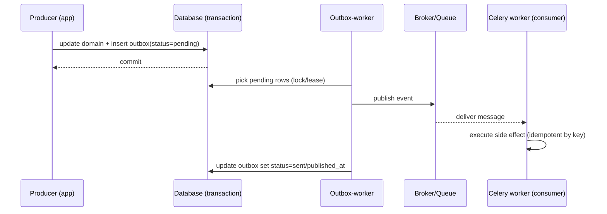

[← Назад к индексу части](index.md)
[↑ К глобальному плану](../celery_mastery_plan.md)

## 2.5. Паттерны надёжной фоновой обработки

### Цель раздела

Научиться проектировать задачи и delivery-контур так, чтобы система оставалась устойчивой к дубликатам, сбоям и перегрузке. Ты должен уметь выбрать набор паттернов под конкретный класс failure mode: идемпотентность/дедупликация, outbox/saga, корректный retry/backoff, circuit breaker, rate limiting/backpressure.

### В этом разделе главное

- Надёжность в очередях строится не «магией Celery», а правилами бизнес-эффекта.
- Идемпотентность — фундамент: поскольку `at-least-once` допускает дубликаты.
- Outbox/saga — способы согласовать «локальную транзакцию» и «внешний побочный эффект».
- Retry/backoff, circuit breaker и rate limiting управляют каскадами ошибок и storm-ами.

### Термины

- **Idempotency key** — ключ идемпотентности, который позволяет отличить «эта бизнес-операция уже выполнена» от «это новая попытка».
- **De-duplication** — устранение повторов на уровне приложения.
- **Transactional outbox** — таблица outbox для публикации событий после commit.
- **Saga/compensation** — цепочка шагов с компенсациями при частичных сбоях.
- **Backoff** — паузы между retries, часто экспоненциальные.
- **Circuit breaker** — режим «не дёргаем внешний сервис, пока он не восстановился».
- **Backpressure** — торможение входа в систему при перегрузке.

### Теория и правила

#### Почему паттерны надёжности нужны даже при «правильной очереди»

Потому что очередь не отменяет сбои:

- дубликаты возможны из-за ack/redelivery (2.2),
- внешние зависимости могут отвечать медленно/ошибаться (2.4),
- нагрузка может нарастать быстрее обработки (2.1/2.7),
- наблюдаемость может частично отсутствовать (backend down).

Поэтому твоя стратегия: сделать бизнес-эффект безопасным к повтору и управлять каскадами ошибок.

#### Idempotency key и de-duplication

**Idempotency key** — это бизнес-ключ операции. Идея проста:

- ты сохраняешь факт «операция с ключом X уже обработана»,
- при повторном запуске проверяешь ключ,
- если ключ уже обработан — второй раз эффект не выполняешь или выполняешь только безопасную часть.

Практически часто это делается так:

- таблица `processed_events` или `idempotency_keys`,
- уникальный constraint на `(idempotency_key)`,
- попытка insert/обновления используется как «атомарное решение».

Такой дизайн опирается на БД и транзакционность — это делает идемпотентность стабильной, а не «на памяти процесса».

#### Проверь себя (2.5: idempotency key и de-duplication)

1. Чем idempotency key отличается от «просто проверить, что уже выполнено» без уникального ключа?

<details><summary>Ответ</summary>

Idempotency key — это явный бизнес-идентификатор операции, который связывает повтор с той же смысловой попыткой. Без уникального ключа ты не сможешь надежно отличить «новое событие» от «повтора доставки» и дедупликация станет хрупкой (придётся угадывать по косвенным признакам).

</details>

2. Почему в примере с уникальным constraint на `(idempotency_key)` идемпотентность становится устойчивой?

<details><summary>Ответ</summary>

Потому что уникальность обеспечивается на уровне БД, а значит решение «выполняем/не выполняем повтор» становится атомарным и переживает рестарты процессов. Ты полагаешься не на память worker-а, а на транзакционность и консистентность данных.

</details>

#### Transactional outbox

Проблема transactional outbox возникает, когда у тебя есть два согласованных мира:

- локальная транзакция (БД) внутри producer/сервиса,
- доставка сообщения в очередь для background обработки.

Если попытаться «сделать побочный эффект в очередь» вне транзакции, то возможны расхождения:

- коммит в БД произошёл, но publish в очередь упал → очередь не узнает о состоянии;
- publish прошёл, но коммит не произошёл → worker увидит сообщение, но бизнес-данных ещё нет.

Transactional outbox решает это так:

1. В той же транзакции, где меняешь состояние в БД, записываешь запись в outbox.
2. Отдельный процесс/worker периодически читает outbox и публикует сообщения в очередь.
3. После успешной публикации outbox помечается как обработанная.

Ключевой эффект: «сообщение появляется в очереди согласованно с БД».

#### Проверь себя (2.5: transactional outbox)

1. Какая из двух расхождений (commit прошёл, publish упал / publish прошёл, commit не прошёл) решается outbox-ом лучше всего и почему?

<details><summary>Ответ</summary>

Outbox решает обе стороны расхождения, потому что запись в outbox делается в той же транзакции, что и изменение бизнес-данных. Если commit не произошёл — outbox-записи не будет, и publisher ничего не опубликует. Если publish упал — запись в outbox останется, и отдельный outbox-worker сможет повторить публикацию после восстановления.

</details>

2. Почему из outbox нельзя сделать «просто таблицу» без отдельного процесса публикации?

<details><summary>Ответ</summary>

Потому что тогда нарушается основная идея разделения транзакций: publisher должен читать pending outbox и превращать их в сообщения, а также надёжно маркировать результат публикации. Если не использовать отдельный процесс (или планировщик/worker) с повтором и фиксацией состояния outbox, ты не получишь гарантии «eventually опубликовано» и снова упрёшься в расхождения между БД и очередью.

</details>

#### Saga / compensation

Saga — когда у тебя нет возможности сделать «единый ACID-коммит» через границы систем. Тогда процесс разбивают на шаги:

- каждый шаг делает часть эффекта,
- при частичном сбое выполняются компенсации (откат/исправление), чтобы привести систему в корректное состояние.

В контексте очередей saga часто реализуется как набор фоновых задач с явными статусами и компенсационными шагами.

#### Проверь себя (2.5: saga / compensation)

1. В чём ключевое отличие saga от «попытки повторять всё до победы»?

<details><summary>Ответ</summary>

Saga не просто пытается завершить всё любой ценой. Она предполагает частичные сбои и заранее проектирует компенсации, чтобы привести систему в корректное состояние. «Повторять всё» может усилить каскады ошибок и оставить систему в «полусделанном» состоянии без способа откатиться безопасно.

</details>

2. Как понять, что тебе нужна saga/compensation, а не outbox или только идемпотентность?

<details><summary>Ответ</summary>

Saga нужна, когда нет возможности сделать единый ACID-коммит между системами и есть несколько шагов с возможными частичными сбоями. Outbox решает согласование «локальная БД ↔ публикация события в очередь», а идемпотентность защищает повтор эффекта. Если при ошибке важно восстановить согласованность набора шагов — это уже saga/compensation.

</details>

#### Retry with backoff и борьба с storm

Retry нужен для transient ошибок (таймауты, временная недоступность).

Но retry без backoff превращается в storm:

- чем больше ошибок,
- тем больше задач повторяются,
- тем медленнее становится внешний сервис,
- тем больше ошибок,
- и цикл усиливается.

Backoff (часто экспоненциальный) + jitter помогает:

- уменьшать синхронизацию повторов,
- давать downstream время восстановиться.

Практический шаблон:

`pause = min(base_delay * 2^attempt, max_delay) + random(0, jitter)`

Здесь:

- `attempt` — номер попытки (1, 2, 3...),
- `base_delay` и `max_delay` ограничивают рост пауз,
- `jitter` ломает «строй» повторов, когда много задач одновременно делают retry и синхронно бьют по downstream.

#### Проверь себя (2.5: retry/backoff и предотвращение storm)

1. Почему backoff + jitter снижает storm именно в распределённых системах, а не только «уменьшает нагрузку»?

<details><summary>Ответ</summary>

Потому что в распределённых системах много одинаковых ошибок часто происходят синхронно (одинаковые таймауты, одновременные сбои). Без jitter все retry-попытки возвращаются «в один и тот же момент», создавая волны нагрузки. Jitter разрывает синхронизацию, превращая «одновременный шторм» в разнесённые во времени попытки, что даёт downstream восстановиться.

</details>

2. Как связать формулу `pause = ... + random(0, jitter)` с бизнес-последствием «SLA рушится» из 2.1/2.4?

<details><summary>Ответ</summary>

Когда retry без backoff вызывает storm, service time downstream растёт, throughput падает, а backlog/lag увеличиваются. Формула с ограничением `max_delay` и случайным jitter уменьшает долю «переуплотняющих» повторов и разрывает замкнутый цикл “ошибки -> retry -> overload -> ещё больше ошибок”, удерживая задержки в допустимых пределах.

</details>

#### Circuit breaker на внешние зависимости

Когда внешний сервис устойчиво не отвечает, повторные вызовы только ухудшают ситуацию.

Circuit breaker переводит обработку в режим:

- временно перестать вызывать зависимость,
- быстрее отдавать ошибку/переносить обработку,
- и периодически тестировать восстановление.

В очередях это помогает не раздувать retry storm и удерживать latency/service time в разумных границах.

#### Проверь себя (2.5: circuit breaker в контексте очередей)

1. Почему circuit breaker особенно полезен, когда зависимость «лежит», а не просто «временно отвечает медленно»?

<details><summary>Ответ</summary>

Потому что circuit breaker переводит систему из режима «продолжаем дергать зависимость» в режим «не тратим попытки на бесплодные вызовы» и быстро возвращаем управляемую ошибку/перенос. Когда зависимость действительно недоступна длительно, повторные попытки только разгоняют backlog и увеличивают service time, не улучшая вероятность успеха.

</details>

2. Какой компромисс обычно платится за использование circuit breaker?

<details><summary>Ответ</summary>

Ты временно уменьшаешь попытки вызова внешней зависимости, поэтому часть обработок получит отложение/ошибку раньше, чем «вылечится» upstream. Это повышает управляемость каскадов, но требует грамотной retry/backoff стратегии на верхнем уровне и защиты бизнес-эффекта от повторов (идемпотентность).

</details>

#### Rate limiting и backpressure

Это два «родственных» механизма:

- rate limiting — ограничение скорости (на уровне producer retry попыток, на уровне API входа, на уровне параллелизма обработки);
- backpressure — сигнал торможения, когда downstream не тянет, чтобы не разгонять backlog.

Важно: rate limiting без backpressure может быть недостаточным, если очередь продолжает расти. А backpressure без rate limiting может быть мягким и запоздалым.

#### Проверь себя (2.5: rate limiting vs backpressure)

1. Почему одного rate limiting иногда недостаточно, даже если он «ограничивает скорость»?

<details><summary>Ответ</summary>

Потому что ограничение попыток не гарантирует, что очередь перестанет накапливаться: сообщения могут продолжать приходить быстрее, чем их успевают утилизировать (publish rate остаётся высоким). Тогда backlog растёт, а задержки/lag продолжают ухудшаться. Backpressure как раз ограничивает приток work в систему, чтобы разорвать дисбаланс.

</details>

2. В чём разница по эффекту между «soft backpressure» и «жёстким торможением», когда SLA про latency?

<details><summary>Ответ</summary>

Soft backpressure может быть запоздалым: система ещё некоторое время продолжает принимать/публиковать, и очередь не успевает перестроиться, поэтому lag растёт и SLA нарушается. Жёсткое торможение быстрее снижает приток и даёт очереди «высохнуть», удерживая latency в пределах. При этом жёсткость должна быть совместима с бизнесом (клиенты не должны получать неопределённые отказы).

</details>

### Пошагово: выбрать набор паттернов под failure mode

1. Если возможны дубликаты (`at-least-once`) → добавь идемпотентность/de-duplication.
2. Если есть согласование «локальная транзакция БД ↔ публикация сообщения» → outbox.
3. Если процесс многошаговый и возможны частичные сбои → saga/compensation.
4. Если ошибки временные → retry с backoff.
5. Если зависимость «лежит» → circuit breaker.
6. Если publish/attempts разгоняют систему → rate limiting/backpressure.

#### Проверь себя (2.5: выбор паттернов)

1. Если у тебя есть и дубликаты (at-least-once), и риск рассинхронизации «БД vs сообщение», что выбрать в первую очередь: идемпотентность или outbox?

<details><summary>Ответ</summary>

Сначала идемпотентность, потому что дубликаты и повтор deliveries в этой модели возможны всегда. Но outbox нужен, чтобы именно рассинхронизация «локальная транзакция ↔ публикация события» не превращалась в хронические проблемы. На практике: идемпотентность защищает бизнес-эффект от повторов, outbox снижает вероятность рассинхронов на уровне доставки.

</details>

2. Как отличить ситуацию «нужен backoff» от ситуации «нужен circuit breaker»?

<details><summary>Ответ</summary>

Backoff нужен, когда зависимость временно недоступна и есть шанс восстановиться в пределах ожидания: retry должна попробовать снова, но не сразу и не синхронно. Circuit breaker включают, когда качество/доступность зависимости ухудшается устойчиво: продолжение попыток только усиливает backlog/service time и почти не увеличивает шанс успеха. Сигнал — масштабированная/длительная ошибка и отсутствие позитивной динамики при повторе.

</details>

### Простыми словами

Надёжность в очередях — это «страховка от того, что случается неизбежно»:

- очередь может доставить снова,
- worker может умереть в неудачный момент,
- зависимости могут не успевать,
- поэтому твой бизнес-эффект должен быть защищён.

### Картинка в голове

```mermaid
flowchart TB
  A[Producer: меняет БД и делает outbox запись] --> B[Outbox (в БД)]
  B --> C[Publisher Outbox Worker: публикует сообщение в очередь]
  C --> D[Broker/Queue]
  D --> E[Celery worker: выполняет бизнес эффект]
  E --> F[(БД: idempotency key / de-duplication)]
  F --> G[Эффект считается сделанным безопасно даже при дубликатах]
```

### Как запомнить

Дубликаты решает идемпотентность. Согласование транзакций решает outbox. Частичные сбои решает saga. Каскады ошибок решают backoff/breaker/rate limiting.

### Примеры

#### Пример 1: idempotency key через unique constraint

Идея:

- у каждой бизнес-операции есть `idempotency_key` (например, комбинация `order_id + action + event_id`);
- перед выполнением side effect ты пытаешься зарегистрировать ключ в БД.

Псевдо-логика:

```python
def handle_message(message):
    key = message["idempotency_key"]
    with db.transaction():
        inserted = insert_into_idempotency_table_if_absent(key)
        if not inserted:
            return "already processed"  # эффект повторно не делаем
        do_side_effect()
```

Если два worker-а одновременно получат один и тот же message:

- уникальный constraint в БД гарантирует только один «успешный insert»,
- второй поток увидит «ключ уже обработан» и не повторит эффект.

#### Пример 2: transactional outbox (как реализовать)

Схема:

- producer в рамках транзакции записывает изменения и запись в outbox;
- отдельный процесс читает outbox и публикует сообщения.

Почему это важно:

- message не может «уйти в очередь» без commit (потому что outbox запись commit-ится вместе с состоянием);
- worker не увидит сообщение раньше данных (потому что публикация следует после commit).

Что хранит outbox (типовые поля):

- `outbox_id` — технический идентификатор записи,
- `event_type` — тип события/сообщения,
- `payload` — сериализованные данные (обычно JSON),
- `idempotency_key` — бизнес-ключ события (защищает от повторов публикации/приёма),
- `status` — `pending/sent/failed`,
- `created_at`, `published_at`, `attempts` — для диагностики и управления повторными публикациями.

#### Пример таблицы outbox (PostgreSQL)

```sql
create table outbox (
  outbox_id uuid primary key,
  event_type text not null,
  payload jsonb not null,
  idempotency_key text not null,
  status text not null default 'pending',
  attempts int not null default 0,
  created_at timestamptz not null default now(),
  published_at timestamptz null,
  unique (idempotency_key)
);
```

#### Пошагово: как работает outbox-worker в production

1. Producer меняет бизнес-данные и в той же транзакции добавляет строку в `outbox` со статусом `pending`.
2. Outbox-worker выбирает небольшими порциями записи `pending` (часто с `for update skip locked`, чтобы несколько воркеров не боролись за одну и ту же строку).
3. Для выбранной записи outbox-worker публикует сообщение в очередь.
4. После успешной публикации он атомарно переключает `status` на `sent` и ставит `published_at`.

Edge case, который превращает outbox в “настоящий” production-паттерн:

если outbox-worker упал после публикации, но до изменения `status`, запись снова окажется в выборке. Поэтому дедупликация/`idempotency_key` должна защищать от повторной обработки на consumer-стороне.

#### Проверь себя (2.5: outbox-worker edge case)

1. Что именно здесь означает “опять окажется в выборке” на уровне логики outbox?

<details><summary>Ответ</summary>

Это означает, что outbox-worker фильтрует/выбирает записи по статусу (например, `pending/failed`). Если после publish упал процесс и `status` не успел переключиться, то при следующем цикле worker снова увидит эту запись как ещё не обработанную и попытается опубликовать событие ещё раз.

</details>

2. Какая защита должна быть на стороне consumer и какая причина у неё “быть обязательной”, а не опциональной?

<details><summary>Ответ</summary>

На consumer обязательна идемпотентность/дедупликация по `idempotency_key` (или бизнес-ключу события). Причина — outbox-worker может повторять публикацию при падениях/таймаутах, а значит приложение должно безопасно переживать delivery at-least-once: повтор доставит сообщение, и side effect должен быть защищён от повторного выполнения.

</details>

#### Картинка в голове (упрощённая последовательность)



#### Мини-диагностика «outbox завис»

Типичная причина, когда `outbox` накапливает `pending/failed`, а в очереди «тишина»:

- outbox-worker не работает (рестарты, упал runtime, проблемы с доступом к broker),
- outbox-worker застрял на ошибках публикации (см. последние ошибки),
- очередь/брокер недоступны из сети outbox-worker (DNS/ACL/порт),
- или consumer-сторона делает идемпотентность, но при этом очень медленно — тогда backlog в очереди просто растёт.

#### Проверь себя (2.5: мини-диагностика outbox завис)

1. Какие два наблюдения чаще всего помогают отличить “outbox-worker не работает” от “consumer слишком медленно/неэффективно обрабатывает”?

<details><summary>Ответ</summary>

Смотри на активность outbox-worker и ошибки публикации: если outbox-worker не выбирает/не публикует (нет активности или много ошибок публикации), проблема в delivery/outbox-worker. Если outbox-worker работает и публикует, но backlog растёт, значит bottleneck чаще на consumer side (идемпотентность медленная, downstream зависимостям плохо или нарушены SLA по исполнению).

</details>

2. Почему нельзя “на 100%” диагностировать outbox завис только по размеру очереди?

<details><summary>Ответ</summary>

Потому что очередь растёт при нескольких разных причинах: outbox-worker может перестать публиковать (и тогда “тишина”), broker может не выдавать сообщения, consumer может выполнять медленно, а идемпотентность может быть слишком тяжёлой. Поэтому нужна тройка метрик/логов: активность outbox-worker + признаки ошибок публикации + поведение execution/ack на consumer стороне.

</details>

### Практика / реальные сценарии

1. **Email/уведомления**: всегда используйте идемпотентность по ключу события.
2. **Платежи/начисления**: обычно критично повторно выполнить нельзя, значит требуется идемпотентный эффект.
3. **ETL/синхронизации**: дубликаты могут быть частыми, поэтому ключи событий и статусы обработки — обязательны.
4. **Интеграции с нестабильными сервисами**: backoff + circuit breaker + rate limiting защищают от storm.

### Типичные ошибки

- Считать, что retry «починит» бизнес-несогласованность.
- Делать идемпотентность «только в памяти» воркера (она исчезнет при рестарте).
- Пытаться обеспечить exactly-once на уровне очереди вместо идемпотентности приложения.
- Настроить retry слишком агрессивно без backoff и без лимитов.

### Что будет если...

... не добавить идемпотентность:

- в сценарии «worker упал после side effect до ack» ты повторишь эффект и получишь последствия.

... не использовать outbox при необходимости согласования:

- сообщения уйдут в очередь без данных или наоборот — данные появятся без сообщений; это создаёт рассинхрон и последующую необходимость ручных коррекций.

... добавить retry без backoff:

- появится storm повторов, рост очереди и SLA-крах.

### Проверь себя

#### Проверь себя (2.5)

1. Почему задача, которая «иногда дублируется», не обязательно плохая?

<details><summary>Ответ</summary>

Плохой она становится только тогда, когда бизнес-эффект не защищён от повторов. Если идемпотентность/дедупликация есть, дубликаты безопасны и система остаётся устойчивой к `at-least-once`.

</details>

2. Что опаснее для бизнеса: потеря задачи или её повторное выполнение?

<details><summary>Ответ</summary>

Это зависит от типа побочного эффекта. В большинстве «транзакционно-подобных» сценариев повторение опаснее, но потеря может быть критичной там, где нет способа восстановиться. Правильный подход: анализировать конкретный эффект и его допустимость к повтору.

</details>

3. Почему идемпотентность важнее любого красивого retry policy?

<details><summary>Ответ</summary>

Потому что retry policy управляет попытками, но не может отменить фундаментальную возможность дубликатов из delivery semantics. Идемпотентность гарантирует безопасность повторов независимо от того, как именно произошёл повтор.

</details>

### Ключевые тезисы (зафиксировать в контенте как короткие тезисы)

- Celery начинается не с `@app.task`, а с понимания доставки и повторов.
- Все побочные эффекты должны проектироваться так, будто задача может стартовать повторно.
- Очередь скрывает latency, но не устраняет бизнес-сложность.

### Запомните

Если ты хочешь надёжную фоновой обработку, думай так: delivery может повторить, значит бизнес-эффект должен пережить повтор. Остальное — выбор паттернов под согласование, частичные сбои и каскады ошибок.

---
