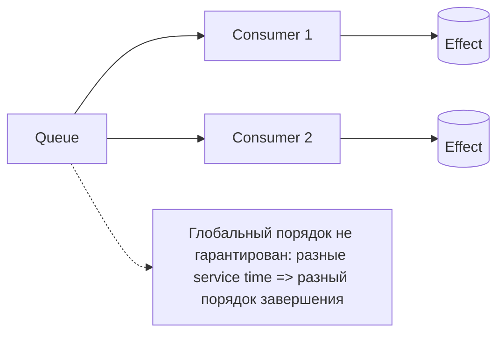

[← Назад к индексу части](index.md)
[↑ К глобальному плану](../mastery_plan.md)

## 2.6. Упорядочивание и детерминизм

### Цель раздела

Понять, какие гарантии на порядок выполнения реально доступны в системах очередей, почему «порядок по умолчанию» слабый, и как получить детерминизм в пределах явных ограничений (single consumer/partition key/dedicated queue).

### В этом разделе главное

- Гарантии порядка по умолчанию отсутствуют или очень слабые.
- «Псевдо-порядок» можно обеспечить топологией: single consumer, partition key, dedicated queue.
- При масштабировании consumer-ов порядок ломается, если он не зафиксирован механизмом.

### Термины

- **Ordering** — возможность/гарантии выполнения сообщений в определённом порядке.
- **Детерминизм** — способность системы вести себя предсказуемо: при одних и тех же входах наблюдаемое поведение повторяется.
- **Partition key** — ключ разбиения, по которому сообщения попадают в «свою» последовательность (часто — в свою логическую группу/очередь/partition).

### Теория и правила

#### Порядок по умолчанию — не гарантия

Даже если сообщения публикуются в каком-то порядке, consumer-ов может быть несколько, а обработка может занимать разное время. Поэтому:

- сообщения могут завершаться в разном порядке,
- даже если начало обработки где-то близко по времени.

Правило: порядок выполнения — это контракт, который нужно явно проектировать.

#### Псевдо-порядок: single consumer / partition key / dedicated queue

1) **Single consumer**

Если есть один consumer, который обрабатывает одну очередь последовательно, порядок выполнения сообщений по этой очереди будет близок к порядку доставки.

Но минусы:

- ограничение throughput,
- очередь становится узким местом.

2) **Partition key**

Если у тебя есть ключ, по которому можно гарантировать последовательность, ты делаешь так:

- сообщения с одинаковым ключом обрабатываются последовательно (например, попадают в одну группу),
- сообщения с разными ключами обрабатываются параллельно.

Это даёт баланс: детерминизм в пределах ключа + масштабирование по ключам.

3) **Dedicated queue**

Если у тебя есть отдельная очередь под «последовательность», то consumer для этой очереди обеспечивает локальный порядок.

Минусы:

- растёт количество очередей,
- усложняется routing/topology (это уже связано с later parts, но базовая идея важна здесь).

#### Почему нельзя опираться на порядок при масштабировании

Как только появляются:

- несколько consumer-ов,
- различная длительность обработки,
- возможность redelivery,

ты теряешь глобальный порядок. Даже если broker отдаёт сообщения в порядке публикации, завершение может быть не в том порядке.

### Пошагово: как выбрать стратегию порядка

1. Уточни требование: тебе нужен порядок **по всей системе** или только по ключу (например, `order_id`)?
2. Если нужен глобальный порядок — это почти всегда будет узкое место; часто лучше пересмотреть требование.
3. Если порядок нужен по ключу — используй partition key и «локальную последовательность».
4. Если у тебя мало ключей/хорошо известные группы — выделяй dedicated queues.

### Простыми словами

#### Проверь себя (2.6: стратегия порядка)

1. Почему попытка обеспечить «глобальный порядок» почти всегда ухудшает масштабирование?

<details><summary>Ответ</summary>

Потому что сохранение глобального порядка требует серийного выполнения (меньше параллелизма). Это ограничивает throughput и приводит к росту очереди/lag при увеличении нагрузки — SLA страдает.

</details>

2. Какой контракт чаще всего даёт практичный компромисс: «порядок везде» или «порядок в пределах ключа»?

<details><summary>Ответ</summary>

Чаще всего практичен порядок в пределах ключа: partition key (или dedicated queue на группу) сохраняет последовательность только там, где она действительно бизнес-критична, и позволяет масштабировать обработку по независимым группам.

</details>

Порядок — это не «как было отправлено». Порядок — это «как именно тебе гарантируется обработка с учётом параллельности». Если ты не фиксируешь контракт, очередь превращает порядок в лотерею.

### Картинка в голове



Идея partition key:

```mermaid
flowchart LR
  K[partition key] --> P1[Partition/Queue A: order_id=...]
  K --> P2[Partition/Queue B: order_id=...]
  P1 --> C1[Consumer A (последовательно)]
  P2 --> C2[Consumer B (последовательно)]
```

### Как запомнить

Порядок либо обеспечивается топологией и ключами, либо его нет. «По умолчанию» — нет.

### Примеры

#### Пример: обновления одного объекта

Предположим, есть поток сообщений «обновить профиль пользователя»:

- если обновления для одного `user_id` должны применяться последовательно, partition key по `user_id` решает задачу;
- если сделать всё в одну общую очередь с несколькими consumer-ами, то быстрый апдейт может «переписать» медленный, и итог будет неверным.

### Практика / реальные сценарии

- Платформенные события часто имеют естественные ключи (tenant_id, entity_id).
- Проектирование идемпотентности часто проще, чем пытаться добиться строгого глобального порядка.

### Типичные ошибки

- Пытаться получить глобальный порядок «просто потому что так отправили».
- Масштабировать consumer-ов и не пересматривать требования к порядку.
- Смешивать «порядок публикации» с «порядком завершения» — это разные вещи.

#### Проверь себя (2.6: типичные ошибки порядка)

1. Почему «порядок публикации» почти ничего не гарантирует про «порядок завершения»?

<details><summary>Ответ</summary>

Потому что при масштабировании обработка идёт параллельно: service time отличается, consumer-ов несколько, а сообщения могут иметь разную скорость завершения (и могут быть redelivered). Поэтому завершение определяется скоростями execution, а не порядком выдачи брокером.

</details>

2. Что нужно сделать, если порядок действительно важен, а consumer-ов хочется масштабировать?

<details><summary>Ответ</summary>

Сжать контракт: обеспечивать порядок только в рамках partition key или dedicated queue (локальная последовательность). Либо перестроить бизнес-эффекты так, чтобы они сходились даже при перестановках (идемпотентность/компенсации/агрегирование с правильными правилами).

</details>

### Что будет если...

... опираться на порядок при масштабировании:

- бизнес-логика начнёт наблюдать редкие, но критичные несоответствия (race conditions), особенно когда часть операций медленнее.

#### Проверь себя (2.6: последствия опоры на порядок)

1. Почему несоответствия возникают «редко», но при этом критичны?

<details><summary>Ответ</summary>

Потому что гонки проявляются на конкретных сочетаниях времени выполнения: когда одни сообщения дольше, а другие завершаются быстрее. При типичной нагрузке это может происходить редко, но когда совпадение случается (например, из-за всплеска задержек или нестабильных dependencies), ошибка бьёт по целостности данных/состояния.

</details>

2. Какой защитный контракт обычно снижает риск race conditions, вызванных перестановками сообщений?

<details><summary>Ответ</summary>

Обычно это переход от «порядок обязателен» к «эффект должен быть согласуем при любых перестановках»: идемпотентность, ключевые агрегирования, компенсации, а также обеспечение порядка только локально (partition key/dedicated queue).

</details>

### Проверь себя

1. Почему наличие нескольких worker-ов автоматически ломает глобальный порядок выполнения?

<details><summary>Ответ</summary>

Потому что обработка разных сообщений может занимать разное время. При параллельной обработке сообщения могут завершиться в другом порядке, даже если брокер выдавал их «по очереди».

</details>

2. Какой подход обычно лучше: пытаться добиться строгого глобального порядка или обеспечить локальный порядок по ключу?

<details><summary>Ответ</summary>

Чаще лучше локальный порядок по ключу, потому что он позволяет масштабировать обработку по ключам и уменьшает узкие места. Глобальный порядок почти всегда превращается в ограничение throughput.

</details>

### Запомните

Сделай контракт явным: либо локальный порядок по ключу/очереди, либо идемпотентность и независимость от порядка.

---
