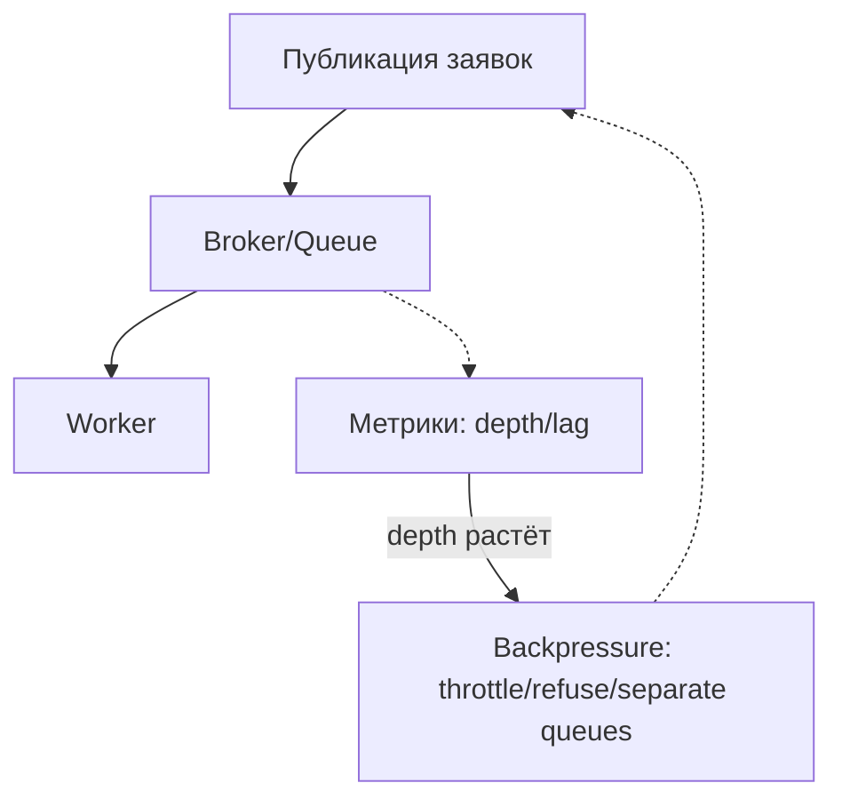

[← Назад к индексу части](index.md)
[↑ К глобальному плану](../mastery_plan.md)

## 2.7. Backpressure и ограничение входа

### Цель раздела

Понять, что происходит, когда publish происходит быстрее consume: как это выражается в росте очереди и деградации SLA. Научиться управлять входом: throttle на producer, отдельные очереди и отказ в приёме на уровне API.

### В этом разделе главное

- Backpressure появляется там, где очередь растёт как следствие дисбаланса скоростей.
- Стратегии управления входом: throttle producer, отдельные очереди, refusal в API.
- Backpressure напрямую связан с SLA и деградацией сервиса.

### Термины

- **Backpressure** — набор механизмов, который «тормозит» поток сообщений, когда downstream не справляется.
- **Throttle** — ограничение скорости публикации или повторов.
- **Отказ в приёме** — отказ на уровне API (например, вернуть 429), чтобы не принимать работу, которую нельзя обработать вовремя.

### Теория и правила

#### Что происходит при publish быстрее consume

Если producer публикует быстрее, чем throughput worker-ов (и service time растёт или throughput падает), то:

- queue depth растёт,
- lag растёт,
- возрастает вероятность таймаутов в downstream,
- при агрессивных retry ты получишь storm повторов (2.4/2.5).

В какой-то момент это становится не «буфером», а «главным источником задержки», и SLA ломается.

#### Стратегии backpressure

1) **Throttle на producer**

- ограничиваешь скорость публикации,
- или ограничиваешь число активных задач/заявок,
- или делаешь задержку публикации.

Смысл: не разгонять систему дальше.

2) **Отдельные очереди**

Раздели workload по критичности/типу:

- latency-sensitive задачи — в очередь с отдельным consumer/pool,
- bulk задачи — в отдельную.

Тогда рост очереди одного типа не уничтожает SLA для другого.

3) **Отказ в приёме на уровне API**

Если вход продолжается и очередь растёт, но SLA уже на грани:

- возвращай отказ/лимит (например, `429 Too Many Requests`),
- давай клиенту сигнал: «попробуй позже».

Это выглядит жёстко, но часто спасает систему и удерживает SLA.

#### Проверь себя (2.7: стратегии backpressure)

1. Когда throttle (замедление входа) предпочтительнее отдельной очереди?

Ответ

Throttle обычно предпочтительнее, когда тип workload один и его нельзя легко разнести по критичности/очередям, но при этом можно измерить метрики деградации и плавно ограничивать скорость поступления. Отдельные очереди лучше, когда есть чёткие типы/классы работ и нужно локализовать деградацию.

2. Почему отказ в приёме (refusal/429) иногда — часть корректной инженерной стратегии, а не «просто грубость»?

Ответ

Потому что отказ — управляемая деградация: он предотвращает накопление backlog, сохраняя SLA по latency-sensitive компонентам. Если не отказывать, система будет молча копить задержки, а потом всё равно начнёт падать по таймаутам и повторным попыткам клиентов.

#### Связь с деградацией и SLA

Backpressure — это управляемая деградация:

- лучше дать клиенту быстрый отказ/задержку,
- чем молча копить backlog и потом «всё поздно».

### Пошагово: проектирование backpressure

1. Определи метрики деградации: queue depth, lag, время ответа downstream.
2. Определи пороги: при каком lag система уже не выполняет SLA.
3. Выбери режим:
   - throttle (мягко замедлить),
   - отдельные очереди (локализовать деградацию),
   - отказ в приёме (жёстко остановить вход).
4. Привяжи retry policy к backpressure:
   - backoff обязателен,
   - rate limiting и/или circuit breaker должен снижать давление.

#### Проверь себя (2.7: проектирование backpressure)

1. Почему в проектировании пороги обязательно должны включать `lag`/queue depth, а не только частоту ошибок?

Ответ

Потому что ошибки могут быть не доминирующим симптомом: систему можно «подвесить» очередью раньше, чем начнутся массовые отказы. `lag` показывает задержку ожидания, а queue depth — накопление работы. Когда эти метрики растут, SLA по latency неизбежно ухудшается, даже если в логах ещё не видно всплеска ошибок.

2. Как связаны retry policy и backpressure: какую ошибку делают чаще всего, когда backpressure только «включили»?

Ответ

Чаще всего продолжают ретраить агрессивно, не синхронизируя retry с режимом деградации. Тогда отказоустойчивость оказывается номинальной: новые попытки добавляют нагрузку, backlog продолжает расти, а система снова входит в storm. Правильная связка: backoff обязателен, а rate limiting/circuit breaker должны снижать давление на downstream.

### Простыми словами

Backpressure — это когда ты перестаёшь «наливать бензин в огонь» и начинаешь регулировать поток работы по способности обработчика.

### Картинка в голове

### Как запомнить

Backpressure = управление потоком, когда очередь начинает заменять буфер на задержку.

### Примеры

#### Пример: отказ в приёме при перегрузке

API принимает запрос «создать отчёт».

Если queue depth > порога, API возвращает `429` и `Retry-After`:

- клиент понимает, что система перегружена,
- система не раздувает backlog,
- SLA (в части latency-sensitive компонентов) сохраняется.

#### Пример: отдельные очереди для разных типов работы

- `queue:emails` — быстрое выполнение,
- `queue:etl_bulk` — тяжёлая обработка,
- в `etl_bulk` включены сильные ограничения rate лимитов и более агрессивный backoff.

### Практика / реальные сценарии

- В системах с «пиковыми волнами» backpressure становится обязательным компонентом устойчивости.
- Без backpressure увеличение количества worker-ов часто не помогает, потому что узкое место — внешняя зависимость (HTTP/DB) и service time растёт.

### Типичные ошибки

- Регулировать только worker concurrency, игнорируя producer side и retry.
- Считать, что «пока очередь растёт, всё ок» — игнорируя lag и SLA.
- Отсутствие политики для отказов в приёме: тогда клиент продолжает отправлять, а система — накапливать.

### Что будет если...

... не делать backpressure:

- backlog будет расти,
- лаг станет слишком большим,
- часть задач начнёт «умирать» по таймаутам/экспайрам,
- SLA разрушится, и в конце концов люди включат «ещё больше retry» — получая storm.

### Проверь себя

1. Почему throttle на producer может быть эффективнее, чем увеличение числа worker-ов?

Ответ

Потому что узкое место может быть не в количестве execution потока, а в downstream (DB/HTTP). Если service time увеличивается, увеличение concurrency не повышает пропускную способность линейно, а backlog продолжит расти. Throttle уменьшает давление на систему.

2. Когда лучше выбрать отказ в приёме на уровне API?

Ответ

Когда порог деградации уже достигнут и система не сможет обработать вход вовремя. Отказ помогает удержать SLA и даёт клиенту сигнал, что нужно повторить позже.

### Запомните

Backpressure — это управляемая деградация. Она нужна, чтобы очередь оставалась буфером, а не источником хронических задержек.

---
