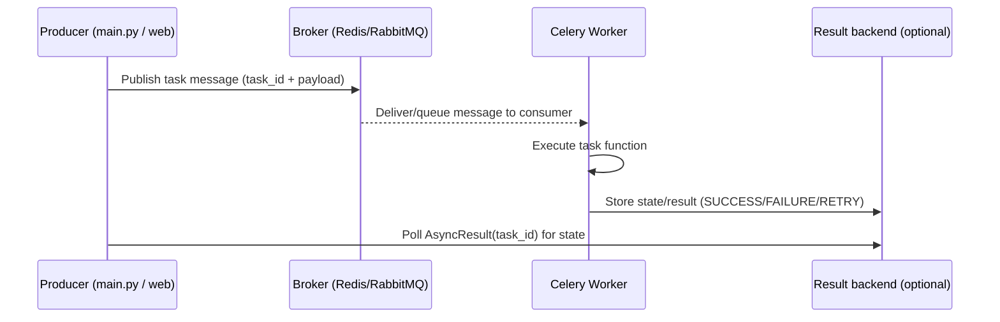

[← Назад к индексу части](index.md)
[↑ К глобальному плану](../celery_mastery_plan.md)

## 3.4. Запуск worker

### Цель раздела

Ты научишься запускать worker так, чтобы он:

- импортировал правильное приложение через `-A`;
- зарегистрировал задачи;
- реально забирал сообщения из broker и исполнял их;
- имел базовое логирование, чтобы ты мог видеть “публикация -> потребление -> выполнение”.

### В этом разделе главное

- `-A` — это ключ к импорту app и регистрации задач.
- Без корректного `-A` worker может быть “живым”, но не знать о твоей задаче.
- Логи worker — главный инструмент для первичной проверки.

### Термины

- **registration** — момент, когда Celery worker узнаёт, какие задачи существуют и как к ним обращаться.
- **hostname/имя worker** — идентификатор процесса worker в кластере (полезно при нескольких воркерах).

### Теория и правила

Worker — это отдельный процесс. Когда ты запускаешь его, он должен:

1) импортировать Celery app (через `-A`);
2) загрузить модули с задачами (через import/auto-discovery);
3) подключиться к broker;
4) подписаться на очереди и ждать сообщений;
5) выполнить полученную задачу и (при наличии) записать результат.

Если шаг 1 или 2 не произошёл корректно — ты не увидишь сообщения “о регистрации задач” и дальше диагностика упрётся в “worker не видит task”.

### Пошагово

#### Шаг 1. Запусти worker для учебного проекта

Из корня проекта:

```bash
celery -A celery_app worker -l info
```

Где `celery_app` — модуль, который содержит `app`.

Если хочешь явнее имя worker (удобно для обучения):

```bash
celery -A celery_app worker -n worker_1@%h -l info
```

`%h` подставляет hostname.

#### Шаг 2. Убедись, что задачи зарегистрировались

В логах worker часто увидишь строки вида:

- “Registered tasks: …”
- или перечисление имён задач.

Если “Registered tasks” отсутствует или там нет твоей `tasks.add` — проблема почти наверняка в импортах/`-A`.

#### Шаг 3. Проверь, что worker реально забирает задачи

Ты можешь:

- запустить worker в одном терминале;
- запустить `main.py` (или `main_send.py`) в другом терминале;
- смотреть логи worker: появилась ли “received task …” и “succeeded/failed”.

На этом шаге удобно сделать задачу с `sleep`, чтобы не было ощущения, что всё мгновенно.

#### Шаг 4. Протяни мысль “цикл publish -> consume -> execute”

Ниже — схема “как это течёт”:



### Простыми словами

`celery -A ... worker` — это как сказать worker’у: “возьми приложение из вот этого модуля”. Если он взял не то — он не знает, какие задачи исполнять. Если он взял то — дальше всё зависит от broker-доставки.

### Картинка в голове

Worker — это “кассир на складе”: он открывает нужную папку (через `-A`), знает список заказов (зарегистрированные задачи), потом подключается к складу (broker) и начинает выдавать и выполнять задания.

### Как запомнить

Если задача “не видна”, сначала проверь лог регистрации, потом — соединение с broker, и только после — сериализацию и бизнес-код.

### Примеры

Добавим задачу со `sleep`, чтобы эффект был очевиден:

```python
# tasks.py
import time
from celery_app import app

@app.task(name="tasks.sleepy_add")
def sleepy_add(x, y, seconds=2):
    time.sleep(seconds)
    return x + y
```

Запуск:

```bash
celery -A celery_app worker -l info
python main.py
```

Ты должен увидеть, что `sleepy_add` стартовала (по логам worker) и только затем задача завершилась.

### Практика / реальные сценарии

- В production у worker’ов будут другие параметры, но принцип диагностики такой же: `-A` влияет на понимание задач, broker влияет на доставку.
- Хорошая привычка: всегда проверяй worker логом “видит ли задачу”.

### Типичные ошибки

- Запустить worker из другой директории, где модуль `celery_app` недоступен (PYTHONPATH).
- Использовать неверный модуль для `-A`.
- Ожидать, что worker сам “найдёт” задачи из файлов, которые не импортируются (если не включено auto-discovery/не организованы импорты).

### Что будет если…

… worker зарегистрировал задачи, но “не получал сообщения”?

- Значит, producer не публикует в ту же очередь/vhost или брокер URL отличается между producer и worker.

… worker даже не перечисляет registered tasks?

- Значит проблема в `-A`/импортах/PYTHONPATH или в ошибке импорта на старте worker (тогда worker может упасть или работать частично).

### Проверь себя

1. Что первично проверить при проблеме “worker не видит задачи”?

<details><summary>Ответ</summary>

Лог регистраций и соответствие `-A` модулю/объекту app. Если worker не импортирует app корректно, он не зарегистрирует задачи.

</details>

2. Почему лучше добавить задачу с `sleep` на старте?

<details><summary>Ответ</summary>

Потому что мгновенные задачи сложно отлаживать визуально: ты не увидишь разницу между publish и consume, а статусы будут меняться “слишком быстро”.

</details>

3. Какой сигнал в логах worker помогает понять, что пошёл real consumption?

<details><summary>Ответ</summary>

Строки “received task … / executing … / succeeded/failed” (или близкие по смыслу). Главное — есть обработка и изменение состояния, а не “просто worker запущен”.

</details>

4. Что в этой части означает `registration`, и чем оно отличается от факта выполнения?
<details><summary>Ответ</summary>
`registration` — момент, когда worker узнаёт “какие задачи существуют” и связывает имена задач с функциями/обработчиками. Выполнение — это последующий этап, когда конкретное сообщение с payload приходит из broker и worker реально запускает функцию. Поэтому можно увидеть registration без выполнения, если доставка/routing не работает.
</details>

5. Как интерпретировать ситуацию: `Registered tasks ...` есть, но `received task ...` не появляется?
<details><summary>Ответ</summary>
Значит worker действительно импортировал app и зарегистрировал задачи, но сообщения не доходят до очереди/consumer-ов: вероятна проблема с broker connectivity или mismatch routing (queue/vhost/имя приложения) либо ограничения `-Q` (worker слушает не ту очередь).
</details>

6. Зачем в примерах вводится explicit `-n worker_1@%h`?
<details><summary>Ответ</summary>
Чтобы сделать worker идентифицируемым. При нескольких worker-ах одинаковый формат логов становится путаным, а `-n` добавляет уникальный hostname/имя процесса. Это полезно для диагностики через логи, а дальше также для remote control/inspect (в следующих частях плана).
</details>

7. Чем полезна связка “sequenceDiagram” из `3.4`, если у тебя нет результата в консоли?
<details><summary>Ответ</summary>
Она помогает сопоставить “шаг” из диаграммы с наблюдаемыми артефактами: publishing (producer), delivering/queue (broker), executing (worker logs), запись статуса/результата (backend/AsyncResult). Если нет evidence на одном из шагов, ты знаешь, какой именно boundary проверять.
</details>

8. Почему старт с задачи `sleep` часто быстрее приводит к “правильной” локализации проблемы?
<details><summary>Ответ</summary>
Потому что увеличивается окно времени: publish происходит раньше, а выполнение и смена статусов происходят позже. Это снижает шанс, что ты перепутаешь порядок событий, и позволяет одновременно наблюдать и логи worker, и изменения `AsyncResult`.
</details>

9. Что проверить, если worker запускается, но при этом “зарегистрированные задачи” оказываются неполными?
<details><summary>Ответ</summary>
Чаще всего это либо ошибка импорта внутри модулей с задачами (тогда декораторы не успевают зарегистрировать задачи), либо неверный модуль для `-A`/не тот cwd/PYTHONPATH, из‑за чего worker импортирует не те файлы.
</details>

10. Чем отличаются ошибки “на уровне delivery” от “ошибок в выполнении” на старте?
<details><summary>Ответ</summary>
Delivery-ошибки — это когда сообщение не дошло/не распаковалось/не попало в нужный consumer (в логах будет видно проблемы подключения или отсутствие `received task` и/или ошибки упаковки payload). Ошибки выполнения — это когда worker получил сообщение и уже запускает функцию, а затем она падает и приводит к `FAILURE` с traceback.
</details>

11. Какой самый ранний “инструмент контроля” ты должен поставить в привычку сразу после запуска worker?
<details><summary>Ответ</summary>
Проверять логи: есть ли registration и появляется ли именно тот `task` (по имени) после публикации. Это позволяет отделить “worker не знает” от “worker знает, но сообщение не дошло”.
</details>

12. Что делать, если при запуске worker из другой директории он “вдруг” перестаёт видеть app?
<details><summary>Ответ</summary>
Проверь cwd/PYTHONPATH и структуру импортов: worker — это обычный Python-процесс. Если из другой директории проект/модули не видны, `-A` может указывать на несуществующий/не тот модуль, и registration не случается корректно.
</details>

### Запомните

Worker должен стать “видимым”: зарегистрировать задачи и начать получать/исполнять сообщения. Это база для любого дальнейшего углубления.

---
