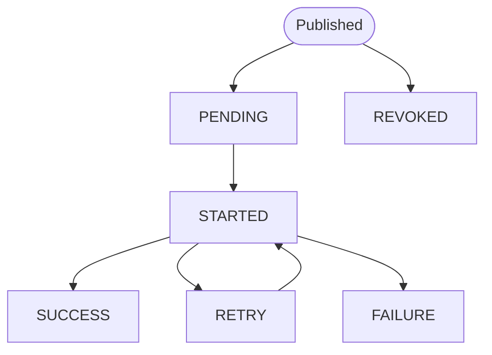

[← Назад к индексу части](index.md)
[↑ К глобальному плану](../../mastery_plan.md)

## 3.5. Чтение результатов и статусов

### Цель раздела

Ты научишься:

- читать статус задачи через `AsyncResult`;
- правильно интерпретировать состояния `PENDING`, `STARTED`, `RETRY`, `FAILURE`, `SUCCESS`, `REVOKED`;
- понимать роль result backend и почему он нужен не всегда;
- выполнять мини-практику “два вызова подряд и status polling”.

### В этом разделе главное

- `AsyncResult` — это интерфейс к result backend по `task_id`.
- Состояния отражают “что известно и что записано”, а не всегда буквальную позицию в очереди.
- `PENDING` — это часто “ещё нет информации в backend”, и причины могут быть разными.

### Термины

- **`AsyncResult`** — клиент для чтения состояния/результата по `task_id`.
- **task state** — статус текущего запуска задачи (строка/enum-like).
- **result backend** — компонент, который хранит метаданные (статус, traceback, результат).

### Теория и правила

Ключевая мысль:

- Если задача должна возвращать результат или ты хочешь видеть статус через API — тебе нужен result backend.
- Если тебе важнее лишь “побочный эффект выполнен” и ты не хочешь хранить статусы — backend может быть не включён.

При этом Celery всё равно может исполнять задачу. Но **ты не увидишь трекинг** или он будет неполным.

#### Что именно сохраняется в result backend (на практическом уровне)

Backend — это “табло” по конкретному `task_id`. В типичном случае там лежит:

- **task state** (то, что ты читаешь как `AsyncResult.state`);
- **результат успешной задачи** (то, что вернул `return ...` у функции задачи), если хранение результатов не отключено;
- **информация об ошибке** для `FAILURE` (чтобы ты мог понять причину падения; обычно это включает traceback/описание исключения);
- **метаданные по задаче**, если ты обновляешь состояние/данные вручную в коде задачи (например, через механизмы обновления state).

Важно: backend не хранит “весь код” и не исполняет задачу. Он хранит то, что нужно для диагностики/статусов/возврата результата клиенту.

#### Почему не все проекты должны хранить результаты

Это компромисс, а не “по умолчанию плохо”.

1) **Стоимость хранения**: backend нужно обслуживать, он может расти, требовать очистки (иначе место и нагрузка становятся проблемой).
2) **Семантика**: бизнес-истина часто живёт в БД/источниках правды, а `AsyncResult` — лишь технический след исполнения. Иногда лучше читать “истину” из БД, а не из очередной таблицы статусов.

#### Семантика состояний (практический взгляд)

Состояния в Celery полезны как “диагностические метки”:

- `PENDING` — обычно “статус ещё неизвестен/не обновлён”.
- `STARTED` — “worker начал выполнение” (обычно появляется только если включен `task_track_started` и при доступности result backend, чтобы статусы можно было записывать/читать).
- `RETRY` — “задача решила повторить после ошибки” (например, через `self.retry`).
- `FAILURE` — “финальная ошибка, повтор больше не будет”.
- `SUCCESS` — “всё успешно”.
- `REVOKED` — “задачу отозвали/отменили” до выполнения (или в процессе, в зависимости от timing).

### Пошагово

#### Шаг 1. Посмотри статус сразу после публикации

В `main.py` после `result = add.delay(...)` ты можешь прочитать:

```python
print("state:", result.state)
print("task_id:", result.id)
```

Обычно сразу будет `PENDING`, даже если задача вот-вот начнёт выполняться.

#### Шаг 2. Сделай polling с интервалом

```python
import time

for _ in range(20):
    print("state:", result.state)
    if result.ready():
        break
    time.sleep(0.25)
```

`ready()` обычно означает “успешно или неуспешно (или отменено)”.

#### Шаг 3. Учитывай, что `PENDING` бывает “по разным причинам”

Самая частая логика:

- `PENDING` действительно может означать “в очереди”.
- но также `PENDING` может означать “backend не обновляет статусы (или backend выключен/не доступен)”.

Поэтому на старте твоя диагностика всегда должна иметь “проверку исполнения” через worker логи.

#### Шаг 4. Добавь задачу с `sleep`, чтобы увидеть изменения статусов

У тебя уже есть `sleepy_add` из раздела 3.4. Отлично. Теперь:

- отправь задачу;
- сразу в цикле печатай `state`;
- параллельно смотри worker лог.

### Простыми словами

Статус — это “табло результатов”, а не “сколько осталось сообщений в очереди”. Если табло (backend) выключено или не обновляется — ты видишь `PENDING`, даже если worker уже работает.

### Картинка в голове

Изобрази backend как таблицу:

- worker заполняет строку для `task_id`;
- `AsyncResult` читает эту строку.

Если строки ещё нет или таблица недоступна — значит `PENDING`.

Ниже — упрощённая схема переходов:



### Как запомнить

Проверяй статусы так:

- “видел ли worker выполнение?” (лог)
- “какой статус показывает backend?” (AsyncResult)

Если они расходятся — проблема в backend/статусах или в маршрутизации.

### Примеры

Мини-практика — твой “первый рабочий контур”.

#### Мини-практика

Цель: увидеть, что отправка из HTTP/CLI не ждёт синхронно исполнение, и что статусы меняются.

1. Подними Redis или RabbitMQ локально.
2. В `tasks.py` убедись, что есть задача со `sleep`, например:

```python
# tasks.py
import time
from celery_app import app

@app.task(name="tasks.sleepy_add")
def sleepy_add(x, y, seconds=2):
    time.sleep(seconds)
    return x + y
```

3. В `main.py` отправь **две задачи подряд**, не делая ожидание результата в момент публикации.

Пример:

```python
# main_two.py
import time
from tasks import sleepy_add

if __name__ == "__main__":
    r1 = sleepy_add.delay(1, 2, seconds=3)
    r2 = sleepy_add.delay(10, 20, seconds=5)

    print("t1:", r1.id, "state:", r1.state)
    print("t2:", r2.id, "state:", r2.state)

    # Не ждём result.get() сразу, только опрашиваем статусы
    for _ in range(30):
        print("t1:", r1.state, "t2:", r2.state)
        if r1.ready() and r2.ready():
            break
        time.sleep(0.5)

    print("t1 ready:", r1.ready(), "t1 result:", r1.get() if r1.successful() else None)
    print("t2 ready:", r2.ready(), "t2 result:", r2.get() if r2.successful() else None)
```

4. Запусти worker в отдельном терминале, затем запусти `python main_two.py`.
5. Убедись:
   - вызов `main_two.py` не зависает до завершения задач;
   - статусы меняются (хотя бы `PENDING` -> `STARTED` -> `SUCCESS` или `RETRY/FAILURE`).

### Практика / реальные сценарии

- Веб-приложение часто публикует задачи и возвращает быстрый ответ пользователю, а статус/результат читается асинхронно позже (через polling, websocket или другой механизм).
- На старте polling через `AsyncResult` — самый простой способ убедиться, что backend обновляется.

### Типичные ошибки

- Пытаться интерпретировать `PENDING` как “точно в очереди”. На практике `PENDING` — “в backend пока нет обновлений/данных”.
- Выключить или неверно настроить result backend, а потом обвинять worker в “ничего не работает”.
- Ожидать, что `STARTED` всегда будет виден. В некоторых конфигурациях он может появляться неполно.

### Что будет если…

… result backend отключён?

- Тогда чтение результата через `AsyncResult` будет неполным или невозможным. Но задача всё равно может исполняться (и это подтверждается логами worker).

… задача упала?

- Ты увидишь `FAILURE`. Если у задачи была логика `retry` — возможен `RETRY` до финального `FAILURE`.

… задачу отозвали?

- Появится `REVOKED` (или близкое поведение в зависимости от timing отмены).

### Проверь себя

1. Почему `AsyncResult.state` может оставаться `PENDING` дольше, чем ты ожидаешь?

<details><summary>Ответ</summary>

Причины могут быть разные: backend не обновляет статусы (не доступен/не настроен), broker задерживает доставку, worker перегружен или задача ещё не забрана. Поэтому нужно смотреть и backend-статус, и worker-логи.

</details>

2. В каких случаях тебе не обязательно хранить результат задач?

<details><summary>Ответ</summary>

Если задача нужна только для побочного эффекта (например, отправить письмо/сделать запись в внешней системе) и статус не требуется пользователю или инженерам, можно не включать хранение результатов (или минимизировать его).

</details>

3. Что означает состояние `RETRY` в терминах твоей системы?

<details><summary>Ответ</summary>

Это означает, что задача обработала ошибку так, что Celery планирует повторное выполнение. Значит, “первый провал” не является финальным, и бизнес должен быть безопасен к повтору (глубже это будет в следующих частях).

</details>

4. Когда ты реально ожидаешь увидеть `STARTED`, а когда он может “не проявиться”?
<details><summary>Ответ</summary>
Обычно `STARTED` зависит от того, включён ли механизм трекинга “started” статусов (и есть ли доступность result backend, куда эти статусы записываются). Если backend недоступен или `task_track_started` не настроен, ты можешь увидеть переходы сразу из `PENDING` в `SUCCESS/FAILURE` без явного `STARTED`.
</details>

5. Чем отличается `result.ready()` от `result.successful()` при чтении статусов?
<details><summary>Ответ</summary>
`ready()` отвечает на вопрос “задача уже достигла финального состояния” (успех/ошибка/отмена), то есть “больше не будет обычного выполнения”. `successful()` отвечает только на “успех”. Поэтому правильная логика такая: сначала проверяешь `ready()`, затем — `successful()` и только потом, если успех, читаешь результат через `get()`.
</details>

6. Что часто означает ситуация “worker пишет, что задача выполнилась, но `AsyncResult` не даёт результата”?
<details><summary>Ответ</summary>
Это признак проблем с result backend: либо backend выключен/недоступен, либо ты читаешь не тот URL/ключевое хранилище. Worker мог исполнить код, но статусы/результат не записались так, чтобы `AsyncResult` их увидел.
</details>

7. Чем отличается `REVOKED` от `FAILURE` для интерпретации поведения системы?
<details><summary>Ответ</summary>
`FAILURE` — это финальная ошибка выполнения (исключение/ошибка логики/лимитов). `REVOKED` — это отмена/отзыв задачи. В первом случае задача “пыталась” выполнить и упала, во втором — её отменили до финального выполнения (или в процессе, в зависимости от timing).
</details>

8. Если result backend отключён, почему `AsyncResult.state` может быть “похоже на зависание”?
<details><summary>Ответ</summary>
Потому что `AsyncResult` читает не очередь и не execution, а то, что backend успел сохранить по `task_id`. При отключённом backend эти обновления либо не приходят, либо не доступны, поэтому состояние может дольше оставаться `PENDING` и не давать точной картины.
</details>

9. Почему `RETRY` требует от бизнес-кода идемпотентности?
<details><summary>Ответ</summary>
Потому что `RETRY` означает повторное выполнение. Если код не идемпотентен, то повтор создаст дубликаты действий: повторно изменит данные, повторно отправит письма и т.п. Поэтому бизнес должен быть безопасен к повторным попыткам.
</details>

10. Как в диагностике связать “факт исполнения” и “статус в backend”?
<details><summary>Ответ</summary>
Сверкой: смотри worker logs (есть ли `received task`, `executing`, `succeeded/failed`) и параллельно `AsyncResult.state` по `task_id`. Если выполнение есть, но backend молчит — проблема backend. Если выполнения нет — проблема доставки/routing/очереди.
</details>

11. Почему “статус изменился” ещё не означает “всё успешно”?
<details><summary>Ответ</summary>
Потому что изменение `state` может привести к финальному неуспеху (`FAILURE`) или отмене (`REVOKED`). Поэтому нужно проверять финальное состояние: `ready()` + `successful()` (или анализ `FAILURE`), а не просто “не PENDING”.
</details>

12. Что делает мини-практику в 3.5 более диагностической, чем просто пример?
<details><summary>Ответ</summary>
Она создаёт управляемое окно времени: отправляются две задачи с `sleep`, затем ты не блокируешься на синхронном `get()` и опрашиваешь `state`. Так ты видишь последовательность событий (publish → execution → статус в backend) и лучше отличаешь задержку доставки от проблем backend.
</details>

### Запомните

Статусы — это про то, что известно и записано в backend. Рабочий контур на старте подтверждается логами worker + изменением статусов в `AsyncResult`.

---
