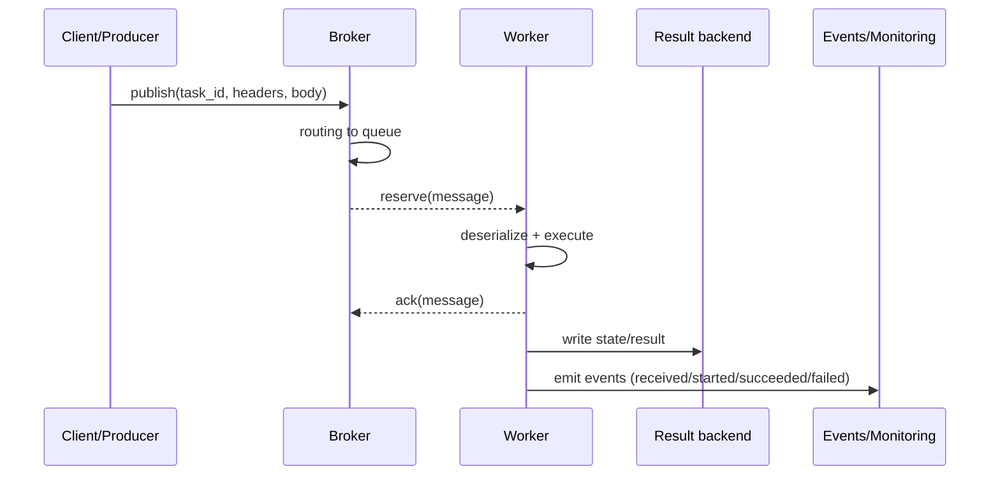

[← Назад к индексу части](index.md)
[↑ К глобальному плану](../celery_mastery_plan.md)

## 4.2. Message flow end-to-end

### Цель раздела

Собрать точную “трассу” задачи как сообщения: от формирования payload/headers до reserve, выполнения, ack и записи состояния в backend или event stream. Ты должен понимать, на каком шаге что ломается и какие доказательства смотреть.

### В этом разделе главное

- Задача в Celery — это **сообщение**: метаданные и сериализованный payload.
- Message flow удобно думать как pipeline с checkpoints: **publish → routing → reserve → execute → ack → state record**.
- **Headers** часто несут корреляцию/контекст; **body** — аргументы; **properties** — транспортные детали.
- ack — “точка ответственности”: она меняет семантику повторной выдачи при сбоях.
- Запись состояния происходит в event stream и/или result backend, и доступность этих мест влияет на видимость “что произошло”.

### Термины

- **Task message**: структура сообщения с body + headers + properties.
- **Routing**: выбор очереди/обменника в broker.
- **Reserve**: “взять сообщение в работу”.
- **Ack**: подтверждение broker’у (в зависимости от настроек может происходить в разных фазах).
- **State writing**: запись статуса/результата.

### Теория и правила

#### Упрощенная схема pipeline

#### Проверь себя (доп.)

1. Перечисли шаги message flow в логическом порядке и отметь, где возникают основные failure domains (доставка vs исполнение vs фиксация состояния).
<details><summary>Ответ</summary>

Логический порядок: `Producer -> Broker (routing/очередь) -> Worker (reserve) -> execute -> ack -> state writing (event/result backend)`. Failure domains: на стороне producer возможны проблемы формирования/сериализации; на стороне broker — routing/доставка/хранение; на стороне worker — reserve/execution; на последнем шаге — запись/доступность статусов в backend/events.

</details>

2. Почему “если сообщение исчезло из очереди” недостаточно, чтобы считать задачу завершенной?
<details><summary>Ответ</summary>

Потому что сообщение может исчезнуть из очереди на этапе `reserve` или `ack`, но финальная фиксация статуса/результата в backend/events может не успеть или быть недоступной. Поэтому “исчезло” не равно “SUCCESS”.

</details>

Реальный Celery message flow зависит от transport, но общий контур похож:

1) Producer сериализует аргументы и формирует сообщение.
2) Broker помещает сообщение в правильную очередь (routing).
3) Worker забирает сообщение из очереди (reserve).
4) Worker выполняет задачу (execute).
5) Worker подтверждает обработку (ack).
6) Celery фиксирует состояние (event/result backend).

Каждый шаг — отдельная зона отказа.

#### Headers, body, properties: зачем “три части”

#### Проверь себя (доп.)

1. Какой из трёх блоков (headers/body/properties) чаще всего объясняет симптом “worker не узнает задачу” и почему?
<details><summary>Ответ</summary>

Чаще всего — **headers**: там лежит имя/идентификаторы задачи (`task`, `task_id` и корреляция). Если worker не сопоставляет сообщение с зарегистрированной задачей/ожидаемым контекстом, оно может не распознаться или уйти в неверную обработку.

</details>

2. Где искать причину симптома “сообщение дошло до worker, но падает на распаковке”?
<details><summary>Ответ</summary>

В **body/properties**: проблема обычно в сериализации/`content_type`/кодировании аргументов либо в mismatch serializer’а. Routing может быть успешным, но worker не сможет распаковать payload.

</details>

Чтобы не теряться, полезно разделять:
- **body** — “содержимое” (аргументы/kwargs задачи в сериализованном виде),
- **headers** — “контекст” (task name, task id, корреляция, routing метки),
- **properties** — transport-level параметры (например, доставка/expiration/persistence — зависит от брокера).

Если тело неправильно сериализовано — задача может “не стартовать” или упасть при распаковке.
Если headers не соответствуют ожидаемому имени/маршрутизации — сообщение попадет “не туда” или будет проигнорировано.

#### ack как точка “когда считаем выполненным”

#### Проверь себя (доп.)

1. Какое различие в “что считаем выполненным” задаёт `ack` относительно `execute` и записи state в backend?
<details><summary>Ответ</summary>

`ack` отвечает за момент, когда сообщение считается обработанным на стороне брокера/очереди. Это может быть раньше или позже записи финального состояния в backend/events, поэтому “ack случился” и “SUCCESS зафиксирован” — разные проверки.

</details>

2. Почему при неправильной точке ack могут расти дубликаты?
<details><summary>Ответ</summary>

Если `ack` приходит поздно (или связь с broker/transport ломается), брокер может переотдать сообщение при таймаутах, и worker начнет повторную обработку. А если ack слишком ранний — можно получить обратный симптом: статус не обновился, хотя execution мог случиться.

</details>

ack — механизм синхронизации producer/broker/worker по поводу “сообщение обработано”. Важно:
- если ack приходит слишком рано, можно “потерять” доказательство обработки (при падении worker после ack задача может быть уже “считана выполненной”);
- если ack приходит слишком поздно, увеличивается риск дубликатов при таймаутах/рестартах.

Инженерный вывод: **ack управляет несогласованностью между “что брокер считает обработанным” и “что backend/события успели записать”**. Поэтому при разборе инцидентов ты всегда должен думать не только про execute, но и про точку подтверждения относительно записи состояния.

Мы не углубляемся в конфигурационные опции в этой части, но даже на уровне архитектуры важно понимать: ack влияет на то, что ты увидишь снаружи.

#### Ранний ack vs поздний ack (практический смысл)

#### Проверь себя (доп.)

1. Какой сценарий чаще соответствует “ранний ack” и почему?
<details><summary>Ответ</summary>

Сценарий “execution был, но backend/events не успели записать финальное состояние”: ты видишь “execution есть, но статус пустой/необновляющийся”, потому что ack мог закрыть сообщение до state writing.

</details>

2. Какой сценарий чаще соответствует “поздний ack” и почему он потенциально опаснее для side-effect’ов?
<details><summary>Ответ</summary>

Поздний ack чаще дает повторную выдачу при сбое до ack: дубликаты возможны. Для задач с побочными эффектами это опасно без идемпотентности/дедупликации.

</details>

Думай об `ack` как о моменте, когда “внутренний билет” сообщения закрывается:
- если `ack` отправлен **после** выполнения (поздний ack), то падение worker’а до ack чаще приводит к повторной выдаче (дубликаты возможны), но evidence “с большей вероятностью” сохранится через повтор.
- если `ack` отправлен **до** записи результата/статуса (ранний ack), то при падении worker сразу после `execute` может возникнуть ситуация: брокер уже считает сообщение обработанным, а backend/events не успели записать финальное состояние (ты видишь “execution есть, но статус пустой/необновляющийся”).

Эта разница напрямую объясняет, почему некоторые инциденты выглядят как “backend сломался”, хотя фактически виновата точка подтверждения (ack point) и порядок записи state/events.

### Пошагово

Чек-лист “как проследить end-to-end”:

1. Убедись, что producer публикует: смотри логи producer (или факт наличия task_id).
2. Убедись, что message попало в очередь: смотри метрики broker/очереди (depth/потоки) и/или события.
3. Убедись, что worker “видит” задачу:
   - зарегистрирована ли задача в worker,
   - слушает ли worker нужную очередь (queue name/topology).
4. Убедись, что reserve/execute произошло:
   - логи worker (received/started/executed),
   - события events stream (если включены).
5. Убедись, что состояние записалось:
   - result backend содержит запись по `task_id`,
   - либо ты видишь событие в event system.

Этот чек-лист — основа диагностики из части 3, но теперь ты понимаешь “почему именно так”.

### Простыми словами

Представь конвейер на производстве:
- формуляры (сообщения) печатаются в начале (producer),
- на складе и в сортировке (broker) они получают “ярлык куда идти”,
- рабочий возьмет бумагу (reserve),
- выполнит работу (execute),
- поставит отметку “выполнено” (ack),
- и после этого бухгалтерия (backend/events) узнает, что процесс завершен.

Если бухгалтерия не работает — ты можешь видеть, что рабочий сделал работу, но учет не обновился.

### Картинка в голове



#### Где здесь Kombu и transport (слои)

#### Проверь себя (доп.)

1. В каком месте message flow “встраивается” Kombu, если мыслить слоями?
<details><summary>Ответ</summary>

Кombu встраивается как переводчик: Celery формирует сообщение/контракт, а Kombu и transport реализуют конкретные операции доставки (как это упакуется, куда пойдет и как будет происходить retry/visibility на уровне transport).

</details>

2. Почему при смене transport меняется не только скорость, но и поведение failure modes?
<details><summary>Ответ</summary>

Потому что гарантия доставки, ack/visibility, persistence и механика повторной выдачи зависят от транспортной модели. Celery “строит” свой опыт retry поверх transport-нюансов, поэтому свойства меняются.

</details>

Иногда полезно “разделить” один и тот же message flow по слоям: Celery описывает задачу и контракты, а `Kombu` + `transport` переводят это в конкретные операции доставки брокеру.

```mermaid
flowchart LR
  subgraph ProducerSide[Producer side]
    CeleryP[Celery app\n(формирует сообщение)] --> Kombu[Kombu\n(messaging layer)]
    Kombu --> Transport[Transport\n(AMQP/Redis/SQS модель)]
    Transport --> Broker[Broker\n(очереди/хранение/routing)]
  end

  subgraph ConsumerSide[Worker side]
    Broker --> Worker[Worker\n(reserve + execute)]
    Worker --> Backend[Result backend\n(state/result/traceback)]
    Worker --> Events[Events stream\n(для наблюдателей)]
  end
```

### Как запомнить

Фраза-подсказка: **message route to queue, worker reserves, then ack and record**.

### Примеры

#### Пример: какие поля обычно встречаются в message (обобщенно)

В разных транспортных реализациях структура различается, но концептуально сообщение выглядит так:

- **headers**:
  - `task` (полное имя задачи, по которому worker сопоставляет сообщение с зарегистрированной задачей),
  - `id` (task_id),
  - `retries` (сколько раз задача уже пыталась, если retry используется),
  - корреляция/трейсинг (например, `correlation_id`, trace context — чтобы связать сообщение и бизнес-операцию),
  - параметры, связанные с планированием (например, ETA/countdown, если задача отправлялась “не сейчас”),
  - routing-метки (могут быть как в headers, так и в transport-level параметрах — зависит от transport’а).
- **body**:
  - сериализованные `args`/`kwargs` (и иногда служебные поля вроде repr для отладки).
- **properties**:
  - детали сериализации/кодирования (`content_type`, encoding/сжатие — если используется),
  - delivery свойства transport’а: `delivery_mode` (persistent/неpersistent), `priority`, `expiration` (если указано),
  - транспортные параметры, которые влияют на “когда и как повторно выдастся” при сбоях (концептуально это и есть transport-level часть).

На практике тебе не нужно “вручную парсить” сообщение всегда, но полезно понимать, где искать, если:
- задача не “узнается” (task name/headers),
- задача не может распаковаться (serializer/body),
- сообщения “не исчезают” из очереди (ack/routing/reserve).

Если ты отлаживаешь “не дошло/не упало”, то заглядывай в порядок такой логики:
1) `task` и routing (понять, куда сообщение попало и кто его может распознать),
2) serializer/content_type (понять, сможет ли worker распаковать body),
3) delivery свойства (понять, почему сообщение могло не удалиться/повториться).

#### Пример: как мыслить про evidence

Если ты видишь:
- в broker очередь растет,
- worker логирует “received task …”,
- но backend не обновляется,

то виноват не “routing” и не “execute”, а именно подсистема “state writing” (backend/events).

### Практика / реальные сценарии

1) “Задача отправлена, но worker ее никогда не берет”
- первая гипотеза: worker не слушает нужную очередь или task не зарегистрирована (`-A`/импорт).
- второе: routing в broker отправляет в другую очередь.

2) “Задача начала работать, но после рестарта worker backend показывает PENDING”
- возможно, ack/state writing не успели записаться.
- это зависит от того, когда Celery подтверждает сообщение относительно состояния.

3) “Все задачи завершились, но веб-интерфейс не показывает результат”
- вероятно, backend недоступен или игнорирование результатов/TTL настроено так, что записи очищаются.

### Типичные ошибки

- Думать, что “если сообщение в очереди, оно обязательно скоро станет SUCCESS”.
- Смешивать события worker’а (видишь “started”) с отсутствием записи backend’а.
- Оценивать delivery, смотря только на `AsyncResult` (это backend, а не broker).

### Что будет если…

#### ...сообщение попало в очередь, но worker не зарегистрировал задачу

#### Проверь себя (доп.)

1. Что именно означает “worker не зарегистрировал задачу”, и почему это может выглядеть как “выполнение не случилось”?
<details><summary>Ответ</summary>

Сообщение дошло до worker, но worker не сопоставил сообщение с зарегистрированной task-логикой (из-за имени, импорта, -A/PYTHONPATH, mismatch конфигурации). В итоге execution может не начаться так, как ожидается, и снаружи это выглядит как “ничего не произошло”.

</details>

2. Какие две проверки обычно быстрее всего выявляют причину в этом блоке?
<details><summary>Ответ</summary>

Проверки: (1) логи/сигналы worker о registered tasks (и корректности импорта через `-A`); (2) evidence routing/очередей — убедиться, что worker слушает нужную очередь и task name совпадает.

</details>

Worker может брать сообщения, но не уметь сопоставить их с зарегистрированными задачами. Тогда ты увидишь либо ошибки dispatch, либо обработку не произойдет так, как ожидаешь. Снаружи это будет похоже на “выполнение не случилось”, но evidence нужно искать в логах worker.

#### ...ack уже был, а статус/результат не успел записаться

#### Проверь себя (доп.)

1. Почему при наличии `ack` пользователь/клиент может всё ещё видеть “необновляющийся” статус?
<details><summary>Ответ</summary>

Потому что `ack` относится к подтверждению сообщения на транспортном/очередном уровне, а финальная запись state/result в backend/events может не успеть выполниться (или не выполниться) из-за сбоя. Поэтому execution мог произойти, а “read model” — нет.

</details>

2. Какие признаки (evidence) сильнее всего подтверждают ветку “ack есть, запись state не успела”?
<details><summary>Ответ</summary>

Подтверждение: в worker/или events видно `started/succeeded/failed`, а в backend запись по `task_id` отсутствует или не меняется (или TTL уже “укусил”). То есть execution evidence есть, visibility evidence — нет.

</details>

Это типичный “пограничный” симптом: ты можешь видеть, что worker дошел до выполнения, но backend/events показывают “необновляющийся” статус. Ментальная модель такая: подтверждение доставки/взятия в обработку уже произошло (ack point), а запись финального состояния (state writing) не успела или не смогла выполниться в момент сбоя.

Что делать при диагностике:
1) проверить worker logs/events на фазе `execute`;
2) проверить доступность и наличие записей в backend/events по `task_id`;
3) если backend под нагрузкой/недоступен — это подтверждает ветку деградации “visibility”.
### Проверь себя

1. Какие два “места”, где ты можешь наблюдать, что сообщение дошло до worker: логи или backend?

<details><summary>Ответ</summary>

Логи worker и event stream (если events включены). Backend подтверждает состояние/результат, но не гарантирует, что message реально reserved и исполнялся.

</details>

2. Почему ошибка сериализации payload чаще всего проявляется не “в очереди”, а уже на этапе worker’а?

<details><summary>Ответ</summary>

Потому что serialization/deserialization обычно происходит на стороне producer (при упаковке) и worker (при распаковке). Routing может быть успешным, а падение произойдет при десериализации/инициализации.

</details>

3. Что является более точным сигналом “выполнилось”, чем “сообщение исчезло из очереди”?

<details><summary>Ответ</summary>

Комбинация: ack + запись state/result (backend) и/или событие succeeded/failed в event system. “Исчезло из очереди” само по себе может означать reserve, но не факт завершения.

</details>

### Запомните

Message flow — это pipeline с checkpoint’ами. Диагностика должна соответствовать checkpoint’ам, а не эмоциям.

---
