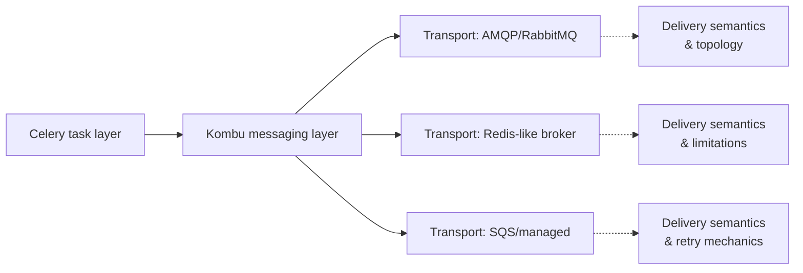

[← Назад к индексу части](index.md)
[↑ К глобальному плану](../../mastery_plan.md)

## 4.3. Роль Kombu

### Цель раздела

Понять, что Celery общается с брокером не напрямую в каждом месте, а через messaging layer **Kombu**. Ты должен уметь объяснить, почему Celery “зависит” от transport не меньше, чем от себя самого: у разных транспортов разные возможности, семантики и ограничения.

### В этом разделе главное

- **Kombu** — messaging layer под капотом Celery.
- Kombu дает транспортную абстракцию: единый API для Celery, но не “универсальность возможностей”.
- Разница AMQP (RabbitMQ) и Redis/SQS часто проявляется в:
  - routing/топологии,
  - подтверждениях и повторной доставке,
  - приоритетах и ordering,
  - механике visibility/ack timeout.
- Отсюда retry и наблюдаемость могут вести себя по-разному.

### Термины

- **Messaging layer** — слой, который реализует транспортные детали и дает Celery единый интерфейс.
- **Transport** — конкретный протокол/модель доставки (AMQP, Redis-подобный transport, SQS и т.п.).
- **Транспортная абстракция** — попытка унифицировать API, но с сохранением различий возможностей.

### Теория и правила

#### Что делает Kombu

#### Проверь себя (доп.)

1. Что именно делает Kombu между “сообщение нужно отправить” и реальной delivery-операцией в брокере?

Ответ

Kombu переводит абстрактный запрос Celery “опубликуй/получи сообщение” в операции конкретного transport: создает/использует exchange/queues (в AMQP) или использует модель очередей/параметров транспортного протокола (в Redis/SQS-подобных вариантах).

2. Почему нельзя считать транспорт “просто настройкой”, не влияющей на поведение Celery?

Ответ

Потому что transport определяет семантики доставки: что происходит при недоставке, где точка ack/visibility, какие механики persistence/повтора доступны. Celery поверх этого “строит” retry и наблюдаемость, поэтому failure modes меняются.

Упрощенно: Celery говорит Kombu “опубликуй сообщение/получи сообщения”, а Kombu переводит это в операции конкретного transport:
- создает/использует обменники и очереди (в AMQP),
- или использует модель “очереди” своего транспортного протокола (в Redis/SQS-подобных вариантах).

#### Почему абстракция не означает одинаковое поведение

#### Проверь себя (доп.)

1. Какая логическая ошибка чаще всего приводит к неправильным ожиданиям при переносе между транспортами?

Ответ

Ошибка — думать, что Celery работает “одинаково везде”, потому что API унифицирован. На деле унифицирован API не унифицирует семантики доставки: возможности и failure modes задаются транспортом.

2. Какой минимальный шаг инженер делает при переносе transport, чтобы снизить риск “всё запускается, но ведёт себя иначе”?

Ответ

Перед переносом формулирует требования к delivery-свойствам (retry, дубликаты, ETA, порядок по ключу) и проверяет evidence-сквозь delivery: routing/queue, повторную выдачу и как это влияет на ack/visibility. То есть тестирует не только “успешность”, но и failure semantics.

Абстракция нужна, чтобы Celery не превращался в набор транспортных веток на тысячи строк. Но если у транспорта нет свойства X, то Celery не сможет магически его внедрить.

Поэтому правила для зрелого инженера:
1) Celery API — это одно,
2) а семантики delivery — это другое,
3) и они частично определяются транспортом.

### Пошагово

Как “правильно думать” про Kombu/transport при проектировании:

1. Сформулируй требования к доставке не словами “Celery сделает”, а словами “мне важна гарантия/свойство”.
   - Например: “мне критичен retry”, “мне важны дубликаты и идемпотентность”, “нужны задержки ETA”, “нужен порядок по ключу”.
2. Выбери transport и сопоставь требования с его моделью.
   - Где он хранит сообщения.
   - Как устроены ack/повторная выдача.
   - Что он реально умеет по routing/priority/ordering.
3. Запланируй evidence-тест.
   - Проверь, что message реально доходит до worker (routing/queue).
   - Проверь, что повторная доставка ведет к ожидаемым семантикам (сколько дубликатов и когда).
4. Зафиксируй наблюдаемость.
   - Какие события ты увидишь.
   - Какие метрики broker’а и backend’а нужны, чтобы отличить “доставка” от “видимости результата”.

### Простыми словами

Kombu можно представить как “переходник между Celery и почтовой инфраструктурой”.
- Celery говорит: “отправь сообщение”.
- Kombu переводит это на язык конкретного “почтового протокола” (RabbitMQ/AMQP или Redis/SQS-подобная очередь).

Поэтому одинаковый код Celery при разном “почтовом протоколе” может вести себя по-разному именно там, где протокол имеет разные возможности и разные правила повторной выдачи.

### Картинка в голове

### Как запомнить

Формула: **Celery управляет задачами, Kombu управляет транспортным переводом, а transport управляет семантикой доставки**.

### Примеры

#### Сравнение возможностей (интуитивно)

Ниже пример “карты различий”. Это не исчерпывающая спецификация, но помогает думать.

| Способ доставки | Часто встречается | Что обычно отличается в поведении |
|---|---|---|
| AMQP (RabbitMQ) | exchanges/queues/bindings, routing keys | выраженная топология маршрутизации, разные модели durable/persistent, ack semantics |
| Redis (как broker) | простота старта | ограниченная функциональность относительно AMQP, иной профиль latency/ресурсов |
| Managed очереди (SQS) | visibility timeout, polling/long polling | семантика “невидимости” и повторной выдачи, стоимость запросов, ограничения ordering/FIFO |

### Практика / реальные сценарии

1) На одном транспорте retry “выглядит аккуратно”, а на другом — вызывает больше дубликатов.
- причина: различается механизм delivery повторной выдачи и точка ack/visibility.

2) Routing “работает” в тестах, но в production задачи уходят в “не ту” очередь.
- часто: топология/binding/routing key настроена под конкретный transport, или worker/consumer ожидает одну очередь, а публикуется в другую.

### Типичные ошибки

- Думать, что “Celery — это одинаково везде” и транспорт не играет роли.
- Проектировать топологию очередей, не учитывая ограничения выбранного транспорта.
- Ошибочно ожидать строгие ordering/priority, если транспорт это не гарантирует (или гарантирует через узкие схемы).

### Что будет если…

#### ...ты переносишь приложение с RabbitMQ на Redis/SQS, не пересмотрев ожидания

Тебе придется пересмотреть:
- порядок ожиданий по delivery/retry,
- поведение при недоступности,
- наблюдаемость (какие события и метрики реально доступны),
- стоимость/latency при текущем объеме.

Часто “всё компилируется и запускается”, но качество доставки и стабильность меняются — и симптомы появляются только под нагрузкой.

### Проверь себя

1. Почему Kombu — это не “деталь реализации”, а часть архитектурной картины?

Ответ

Потому что Kombu делает transport-операции. Если transport меняется, меняются доступные механики доставки, маршрутизации и повторной выдачи. Значит меняется и то, как Celery будет вести себя в failure modes.

2. Что безопаснее предполагать при переносе между транспортами: “одинаковые гарантии” или “разные семантики”?

Ответ

Разные семантики. Абстракция Kombu помогает унифицировать API, но не гарантирует одинаковые свойства delivery.

3. Где искать ответы на “почему retry не такой, как ожидалось” — в Celery или в транспортных свойствах?

Ответ

И в Celery, и в transport. Но часто ключ к симптомам находится в механике повторной выдачи транспортом (visibility/ack/persistence) и топологии routing.

### Запомните

Celery работает “поверх транспорта”. **Транспорт влияет на гарантию и поведение** так же сильно, как и настроки Celery.

---
